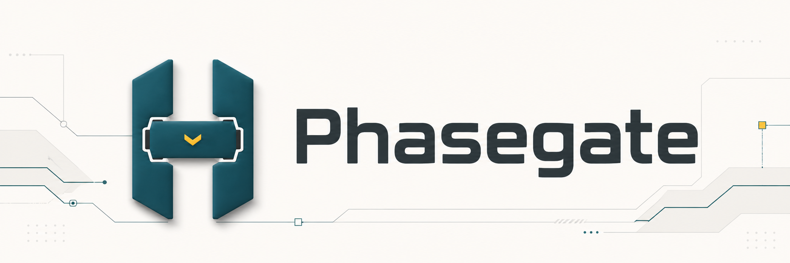

# Phasegate

[](https://opensource.org/licenses/MIT)
[](https://nodejs.org/)

**A toolkit that makes AI agents design before they code.**

Phasegate adds project-local hooks, validators, and agent skills that keep generated code aligned with design intent, layer boundaries, and test discipline across Claude Code, Codex, Cursor, Copilot, and other AI coding agents.

[日本語版](README.ja.md) | [Developer Guide](DEVELOPMENT.md)

---

## Phasegate in 30 Seconds

1. **When an AI agent tries to write implementation code without design docs, Phasegate blocks the write** through agent hooks or git hooks.
2. **Before commit and CI, validators check layer boundaries, metadata, test quality, security, performance, and traceability.**
3. **Every failure is returned in an agent-readable format** with the reason, missing artifacts, references, and the next skill or command to run.

Run `npx phasegate install` to merge those guardrails into an existing project, or `npx phasegate init` for the legacy bootstrap path on a new project. `phasegate doctor`, `uninstall`, and `reconcile` keep the installation observable, removable, and upgradeable.

---

## Why Phasegate?

AI coding agents are fast, but they do not naturally protect your architecture. They skip design steps, cross layer boundaries, weaken type systems with `any`, and generate tests that mirror implementation instead of proving behavior. Human review cannot reliably catch that at AI speed.

Phasegate turns those expectations into enforcement. If the design is missing, the agent is told what to create first. If a change violates the architecture, commit or CI fails. If a design has not been reflected into canonical product docs, implementation is blocked until the trace exists.

### Where it fits

| Good fit | Poor fit |
|---|---|
| Medium to large projects where AI agents implement multiple features | Throwaway scripts with no lasting structure |
| Clean Architecture, DDD, Hexagonal, or layered systems | Codebases where architecture is intentionally ad hoc |
| Teams that want TDD and test conventions enforced automatically | Projects that do not write automated tests |
| Products that need design-code drift detection over time | Projects where code is the only source of truth |

---

## What It Looks Like

When an agent tries to write `src/order/order-service.ts` before the `order` unit has design docs, Phasegate stops it:

```text
Phase gate violation: src/order/order-service.ts
Scope: Level 3 (implementation), Unit: order
Blocked because:
  - docs/product/construction/order/domain_model.md is missing
  - docs/product/construction/order/logical_design.md is missing
Next action: run the /story-implementor skill and start from design.
Example: /story-implementor --unit order
```

The point is not just to fail the edit. The error gives the AI agent enough structure to recover: create the missing design, reflect it into product docs, then implement with tests.

---

## Quick Start

For a guided first run, start with [Getting Started](docs/guide/getting-started.md). It maps new repo, existing repo, CI-only, agent-hook, and strict rollout paths to the next command and success state. <!-- @work-item-id WI-171 -->

### Requirements

Node.js >= 18, npm >= 9, TypeScript 5.x

### 3 steps

```bash
# 1. Install
npm install --save-dev phasegate

# 2. Initialize a new project
npx phasegate init --name my-project --with-husky --with-ci

# 3. Start your AI agent and begin with product design
claude
> /product-architect
```

`init` creates the initial project-local harness files:

- `phasegate.config.json` as the quality settings source of truth
- `skills/` with 30 AIDLC skills
- `.claude/skills` and/or `.codex/skills` links for agent use
- `.claude/settings.json` and/or `.codex/hooks.json` hook configuration
- `docs/principles/*.md` and `docs/folder_management_rules.md`
- `.husky/pre-commit`, `.husky/commit-msg`, and `.husky/pre-push` when `--with-husky` is passed
- `.github/workflows/aidlc-gate.yml`, `.github/workflows/consistency-check.yml`, and `.github/workflows/agent-context-refresh.yml` when `--with-ci` is passed

`init` is the legacy-compatible bootstrap path. For idempotent setup with structured merge into existing hooks, scripts, and package metadata, use `install`. `init` intentionally does **not** create `docs/inception/` work item directories or `docs/product/` design documents. Those are produced later by skills such as `/product-architect`, `/domain-designer`, and `/logical-designer`. That is the core contract: no design, no code.

For an existing project, preview and apply a structured install instead:

```bash
npx phasegate install --dry-run
npx phasegate install --apply
npx phasegate doctor
```

`install` merges PhaseGate into the current project without discarding existing Claude/Codex hooks, Husky scripts, or user-owned skills. It reports planned changes before writing, adds package scripts and the `phasegate` devDependency, deploys selected bundled skills to root `skills/`, creates agent skill links to that shared directory, writes `AGENTS.md` / `CLAUDE.md` PhaseGate managed sections for the selected agent targets, writes the CI workflow when missing, and records managed files in `.phasegate/manifest.json`. If an existing file needs a forced managed update, run `npx phasegate install --apply --force`; PhaseGate backs up replaced files under `.phasegate/backups/`. <!-- @work-item-id WI-174 --> <!-- @work-item-id WI-210 --> <!-- @work-item-id WI-216 -->

For personal evaluation inside a team-owned repository, use local-only install:

```bash
npx phasegate install --personal --agent claude --dry-run
npx phasegate install --personal --agent claude --apply
```

`--personal` does not plan or write `package.json`, `CLAUDE.md`, `.husky/*`, `.github/workflows/*`, `.gitignore`, GitHub CLI config, repo secrets, or CI settings. It creates `.phasegate-local/phasegate.config.json`, runtime-visible local agent context (`.claude/CLAUDE.md` for Claude, and `AGENTS.md` for Codex only when that root file is absent or already PhaseGate-managed), real local-only agent runtime artifacts for the selected agent (`.claude/settings.json` + `.claude/skills/` and/or `.codex/hooks.json` + `.codex/skills/`), local git hooks under `.git/hooks/`, local reference docs under `.phasegate-local/docs/`, a managed local-only block in `.git/info/exclude`, and `.phasegate/manifest.json`. Existing personal skills directories are merged: PhaseGate refreshes bundled skills and preserves user-owned skills. If a team `AGENTS.md` already exists, personal Codex install leaves it unchanged and `doctor --personal --agent codex` reports the remaining context step instead of hiding it behind `AGENTS.override.md`. Codex user-level hook feature enablement remains a manual action. <!-- @work-item-id WI-207 --> <!-- @work-item-id WI-208 --> <!-- @work-item-id WI-209 --> <!-- @work-item-id WI-213 --> <!-- @work-item-id WI-215 --> <!-- @work-item-id WI-216 -->

For agent-driven setup planning, use:

```bash
npx phasegate setup:agent --intent recommended --dry-run --json
npx phasegate config:plan --intent codex-hooks --dry-run --json
```

`setup:agent --json` includes `plan.completeness`, which separates local configured/planned areas from external manual checks such as Codex user-level feature enablement or the first CI run. It also includes `plan.agentReadiness` so Claude Code, Codex, and shared setup state can be evaluated separately. `config:plan` includes a read-only `configPatch` preview when an intent would change `phasegate.config.json`. <!-- @work-item-id WI-175, WI-176 -->

The first command reports detected setup state, missing questions, planned managed targets, rollback, and validation. The second maps a configuration change intent to files, commands, risks, and checks. <!-- @work-item-id WI-172, WI-173 -->

To remove PhaseGate from that project later, run:

```bash
npx phasegate uninstall --dry-run
npx phasegate uninstall --apply
```

`uninstall` uses the manifest to delete created files, remove only PhaseGate-managed portions from merged Claude/Codex, Husky, and `package.json` files, and remove only PhaseGate-managed bundled skills. User content and user-owned skills are preserved, and the manifest is archived under `.phasegate/`. <!-- @work-item-id WI-216 -->

When you upgrade PhaseGate, reconcile existing managed files with the current bundled templates:

```sh
npx phasegate reconcile --dry-run
npx phasegate reconcile --apply
```

`reconcile` updates only PhaseGate-managed portions, keeps user content, adds newly introduced managed targets, repairs missing shared or personal bundled skill bodies, and refreshes `.phasegate/manifest.json` with the current version and hashes. If a managed file was edited after install, `reconcile --apply` refuses that entry until you rerun with `--force`; PhaseGate writes a backup under `.phasegate/backups/reconcile-<timestamp>/`. <!-- @work-item-id WI-210 --> <!-- @work-item-id WI-216 -->

### Codex CLI

```bash
npx phasegate init --name my-project --agent codex --with-husky
codex features enable hooks
```

Use `--agent both` for projects that use Claude Code and Codex together. Codex native `apply_patch` currently cannot be intercepted before the edit, so those violations are caught at pre-commit; Bash-based writes are blocked before execution.

### Update

```bash
npm update phasegate
npx phasegate reconcile --dry-run
npx phasegate reconcile --apply
```

`update-skills` remains available as a compatibility alias, but `reconcile` is the preferred upgrade path because it updates all PhaseGate-managed files recorded in `.phasegate/manifest.json`, not just skills.

---

## Core Capabilities

| Capability | What it does |
|---|---|
| **Phase gates** | Blocks implementation writes until required design documents exist and have been reflected into product docs |
| **5-layer validation** | Runs checks from agent runtime and editor time through pre-commit, CI, and scheduled audits |
| **30 AIDLC skills** | Guides AI agents through product architecture, story writing, domain design, test design, and TDD implementation |
| **Quick Mode** | Keeps bugfixes, docs, test-only changes, and config changes lightweight while preserving traceability |
| **Claude Code / Codex hooks** | Runs checks around Write/Edit/Bash operations and session boundaries |
| **Agent-readable HarnessError output** | Gives AI agents the reason, missing artifacts, references, and examples needed to self-correct |
| **Retrofit baseline** | Lets existing repositories adopt Phasegate gradually by grandfathering unchanged files |
| **Configurable gates** | Supports AIDLC defaults or custom gates such as schema-first API development |

---

## 5-Layer Defense Model

```
+------------------------------------------------------------------+
|  L0  AGENT RUNTIME HOOKS   Claude Code / Codex hooks             |
|  PreToolUse (Write/Edit/Bash block + guide), PostToolUse         |
|  (auto lint/format), Stop (ReentryGuard + complete-check),       |
|  SessionStart, UserPromptSubmit. Plus Husky .husky/pre-commit    |
|  and .husky/commit-msg (Work-Item trailer enforcement).          |
+------------------------------------------------------------------+
|  L1  EDITOR TIME           Biome AST rules                       |
|  require-unit-comment, no-layer-violation, no-any-abuse,         |
|  enforce-folder-structure, no-ghost-file, no-code-duplication    |
+------------------------------------------------------------------+
|  L2  PRE-COMMIT            Validators                            |
|  phase-gate, metadata completeness, story-reflection,            |
|  test-quality (semantic AAA + assertion strength)                |
+------------------------------------------------------------------+
|  L3  CI/CD                 Validators                            |
|  security, performance, coverage threshold, nyquist traceability |
+------------------------------------------------------------------+
|  L4  SCHEDULED             Validators (default off)              |
|  drift-detection, consistency-check, dead-code analysis,         |
|  doc-freshness and pointer-validation via L4 + p2:* compatibility|
+------------------------------------------------------------------+
```

| Layer | Trigger | Key Checks |
|---|---|---|
| L0 | AI agent runtime (`.claude/settings.json` / `.codex/hooks.json`) + Husky git hooks | PreToolUse blocks Write/Edit/Bash that violate gates; PostToolUse runs lint/format; Stop enforces ReentryGuard + `complete-check`; `.husky/pre-commit` runs `phasegate pre-commit`; `.husky/commit-msg` enforces `Work-Item: WI-XXX` and bypass trailers; `.husky/pre-push` runs `phasegate bypass:audit` |
| L1 | Editor save / `phasegate lint` | `@unit` / `@layer` metadata, layer violations, AI anti-patterns, dead code |
| L2 | Pre-commit (also evaluated inside PreToolUse at L0) | Phase gate, metadata completeness, `@work-item-id` reflection (`L2-STORY-REFLECTION`), test quality |
| L3 | CI/CD pipeline | Security, performance, coverage (90%/95%), requirements traceability |
| L4 | Scheduled (weekly). Currently `layers.L4.enabled: false` by default — opt-in per project | Design-code drift, cross-document consistency, dead code, doc freshness, and pointer validation. `p2:*` standalone commands remain available as compatibility entry points. |

---

## 29 Skills

Skills cover the full **AIDLC (AI-Driven Development Life Cycle)**: product definition, design, test design, and TDD implementation. Each skill consumes the artifacts from the previous phase.

**First step**: run `/product-architect` inside Claude Code or Codex.

| Group | Skills |
|---|---|
| **Foundation (4)** | `/product-architect` `/story-writer` `/story-mapper` `/unit-designer` |
| **Design (5)** | `/domain-designer` `/logical-designer` `/mock-designer` `/uiux-designer` `/environment-designer` |
| **Test Engineering (7)** | `/unit-test-designer` `/it-test-designer` `/scenario-test-designer` `/unit-test-logic-designer` `/it-test-logic-designer` `/scenario-test-logic-designer` `/test-coverage-checker` |
| **Implementation (3)** | `/story-implementor` `/quick-implementor` `/implementation-readiness-checker` |
| **Verification (7)** | `/consistency-checker` `/cascade-updater` `/codex-delegator` `/codebase-mapper` `/doc-health-checker` `/engineering-perspective` `/skill-creator` |
| **Operations (3)** | `/phasegate-config-doctor` `/phasegate-toolkit-guide` `/release-publisher` |

Details, prerequisites, and generated artifacts: [Skills Overview](docs/guide/skills-overview.md)

---

## Document Lifecycle

Phasegate enforces a single-direction data flow: **inception → product → src**. Each step has a designated location and a corresponding PhaseGate behavior.

### Three-tier model

```
docs/inception/{unit}/{WI-XXX}/    ← transient planning/design (per WI, fluid)
        ↓ reflection (with @work-item-id, accumulated update)
docs/product/construction/{unit}/   ← canonical design (per Unit, persistent)
        ↕ phase gate
scripts/harness/{unit}/(domain|application|infrastructure|presentation)/*.ts
```

### Work Item (WI) layout

WIs are placed in one of three buckets based on scope:

| Path | Use |
|---|---|
| `docs/inception/_shared/` | Cross-cutting plans/strategy/research not tied to a WI |
| `docs/inception/_cross/{WI-XXX}/` | Cross-cutting WI affecting multiple Units |
| `docs/inception/{unit}/{WI-XXX}/` | WI owned by a single Unit |

> **Removed in v0.104.0**: `docs/inception/issues/`, `docs/inception/{unit}/issues/`, `docs/inception/{unit}/{US-XXX}/`. Existing assets are migrated via `npx phasegate migrate work-items --apply`. Legacy IDs are retained via `legacy_id` for grep compatibility.

### WI frontmatter (required)

Each WI's `description.md` must start with:

```yaml
---
id: WI-042
type: story | issue | fix | refactor | chore   # see below
severity: trivial | normal | high
status: drafted | reflected | implemented | tested   # auto-updated by PhaseGate
affects: [unit-a, unit-b]                            # cross-unit only
legacy_id: ISSUE-XXX | US-XXX | H{NN}-{NN}          # optional
---
```

L2 metadata validator verifies the frontmatter shape.

### Required artifacts by `type`

| `type` | inception artifacts | product reflection | Use |
|---|---|---|---|
| `story` | description + logical_design + domain_model + test designs | All categories accumulated | New feature |
| `issue` | description + logical_design + domain_model + relevant test designs | Relevant categories | Bug / spec mismatch |
| `refactor` | description + logical_design | logical_design update | Refactor |
| `fix` | description + PR link | `@work-item-id` annotation in relevant category | Typo / dep update |
| `chore` | description.md (1 line) + PR link | None | Chore |

`fix` / `chore` are lightweight paths — fixes too small for a formal story still get audit trail.

### State machine

```
DRAFTED  (inception artifacts present per `type`)
  ↓ Phase 0/2 reflection
REFLECTED  (product carries @work-item-id WI-XXX)
  ↓ Phase 3 implementation
IMPLEMENTED  (src exists / lint+type+test green)
  ↓ Phase 4 test
TESTED  (test files annotated with @work-item-id, all green)
```

`type: chore` ends at DRAFTED. `type: fix` shortcuts via DRAFTED → REFLECTED → IMPLEMENTED. PhaseGate auto-updates `status`.

Use `phasegate work-items:status --dry-run` to inspect current status, derived status, reason, next action, and structured missing evidence. Add `--id WI-XXX` to scope the report, `--fail-on-stale` for CI-style stale status detection, or `--apply` to update only the `status:` line in each stale `description.md` frontmatter. Standard L2 validation also runs `L2-014 work-item-status-staleness`; stale WI status fails `validate --layer L2` for pre-commit/CI use.

Full spec: [`docs/folder_management_rules.md`](docs/folder_management_rules.md)

---

## Metadata Conventions

Each source file declares its `@unit` / `@layer`. Tests add `@story` or `@work-item-id` for traceability.

```typescript
// @unit config-foundation
// @layer domain
// @work-item-id WI-042       ← optional (boosts traceability)
// @story US-001              ← test files only (legacy)

export class ConfigSchema { ... }
```

| Tag | Value | Required |
|---|---|---|
| `@unit` | Unit name from `/unit-designer` (e.g., `config-foundation`) | **Yes** (L1-001) |
| `@layer` | Layer name from `architecture.preset` | **Yes** (L1-002) |
| `@work-item-id` | WI driving this file change (e.g., `WI-042`) | Optional |
| `@story` | US/WI being verified by tests (legacy) | Recommended for tests |

In product docs, declare reflection per section using HTML-comment annotations:

```markdown
## Port Definitions

<!-- @work-item-id WI-042 -->
### OrderRepository Port
- findById(id: OrderId): Promise<Order>

<!-- @work-item-id WI-042, WI-051 -->
### PaymentGateway Port
- charge(amount: Money): Promise<Receipt>
```

L2-STORY-REFLECTION uses these annotations to verify inception design has been cascaded into product. Legacy `@story-id US-XXX` / `@story-id H##-##` / `@issue-id ISSUE-XXX` are still resolved via WI `legacy_id` — no bulk replacement needed for existing docs.

---

## Configuration

`phasegate.config.json` is the **Single Source of Truth** for quality settings.

### Presets

Phasegate has two orthogonal preset families — defense and architecture. See the note at the end of this section for naming conventions.

**Defense preset** (`project.preset`) -- overall layer strictness:

| Preset | Layers | Coverage | Use Case |
|---|---|---|---|
| `minimal` | L1 + L2 | -- | Prototyping, early exploration |
| `standard` | L1 - L3 | 90% | Production development (default) |
| `strict` | L1 - L4 | 95% | Mission-critical systems |

**Architecture preset** (`architecture.preset`) -- layer names and dependency directions used by L1-003 / L1-004:

| Preset | Layers | Use Case |
|---|---|---|
| `clean` (default) | `domain / application / infrastructure / presentation` | Clean Architecture / AIDLC full harness |
| `strict-ddd` | `clean` layers + stricter cycle detection | DDD-focused new projects |
| `onion` | `domain / application / interface` | Onion Architecture |
| `hexagonal` | `core / ports / adapters` | Hexagonal / Ports-and-Adapters |
| `layered` | `presentation / business / data` | Classic 3-tier layered |
| `flat` | No layers | Small scripts / CLI tools / retrofit start |
| `custom` | User-defined `layers` + `allowedDependencies` | Any other shape |

For selection guidance and config examples see [Preset Selection Guide](docs/guide/preset-selection.md).

> **Naming convention**: "defense preset" refers to CI strictness (`strict` / `standard` / `minimal`). "architecture preset" refers to layer topology (`clean` / `onion` / `hexagonal` / `layered` / `flat` / `strict-ddd` / `custom`). They are set independently.

`phaseDependencies.preset` -- phase-gate shape and storyReflection defaults (independent of `project.preset`):

| Preset | Phase 3 gates | storyReflection default | Use Case |
|---|---|---|---|
| `full` | All AIDLC gates | Enabled -- `logical_design` + `domain_model` required, `uiux` optional | AIDLC full ceremony (alias for legacy `default`) |
| `standard` | Core gates | Enabled -- `logical_design` required, `domain_model` optional | Production development with moderate rigor |
| `minimal` | None | Disabled -- no inception -> product enforcement | Prototyping / exploration |
| `custom` | User-defined via `gates[]` array | User-defined via `storyReflection.mappings` | Full control (requires `override: true`) |

`storyReflection` blocks writes to `src/{unit}/*` when an inception US/issue design exists but has not been cascaded into `docs/product/construction/{unit}/`. See [ADR-013](docs/ADR/013-story-reflection-gate.md) and the [Configuration guide](docs/guide/configuration.md#storyreflection-inception--product-gate).

### Key Configuration Sections

```jsonc
{
  "project": { "name": "my-project", "preset": "standard" },
  "layers": {
    "L1": { "enabled": true },
    "L2": { "enabled": true },
    "L3": { "enabled": true },
    "L4": { "enabled": false }
  },
  "quickMode": {
    "allowedCategories": ["bugfix", "docs", "test", "config"],
    "maintainedLayers": ["L1", "L2"],
    "relaxedGates": ["phase-gate", "2-phase-execution"],
    "fullModeRequiredWhen": {
      "mixedCategories": true,
      "newDomainFile": true,
      "apiContractChange": true
    }
  },
  "phaseDependencies": {
    "preset": "standard",
    "storyReflection": { "enabled": true }
  },
  "modelRouting": {
    "delegation": "delegate-sonnet"
  },
  "protectedFiles": {
    "exclude": ["tsconfig.json", "package.json"]
  },
  "paths": {
    "designDocs": "docs/product/construction",
    "inceptionDocs": "docs/inception",
    "principlesDocs": "docs/principles",
    "folderRulesDoc": "docs/folder_management_rules.md"
  },
  "baseline": {
    "enabled": true,
    "path": ".phasegate/baseline.json"
  }
}
```

`quickMode.fullModeRequiredWhen` declares which conditions force a Quick Mode change to escalate to the full `/story-implementor` flow. All three triggers default to `true` so retrofits stay safe; flip individual flags to `false` only when a project intentionally accepts the risk.

`paths` maps PhaseGate's design and reference documentation roots. Repositories that do not use `docs/` can point `designDocs`, `inceptionDocs`, `principlesDocs`, and `folderRulesDoc` at their own documentation layout; product-wide Level 1 artifacts are overridden separately with custom `phaseDependencies.gates[]`. <!-- @work-item-id WI-214 -->

`modelRouting.delegation` controls whether bundled skills may use the legacy `delegate-sonnet` workflow. Set it to `"none"` when the main agent session should do the work directly; skill deployment removes fixed model routing text and normal `delegate-sonnet` execution is refused. <!-- @work-item-id WI-219 -->

`baseline` opts in to the **Phase A-2 retrofit grandfather**: pre-existing files captured in `.phasegate/baseline.json` are exempted from `phase-gate` until they are structurally modified. Generate the snapshot with `npx phasegate baseline` before introducing the harness to an existing repository. Since v0.71.0 the `baseline.enabled` flag defaults to `true`, so simply running `npx phasegate baseline` after `init` is enough — no manual config edit needed. For a step-by-step retrofit walkthrough see [Retrofit Adoption Guide](docs/guide/retrofit-adoption.md).

---

## Configurable Phase Gates

By default, Phasegate enforces the **AIDLC phase dependency model** -- implementation files cannot be written without prerequisite design documents. This works out of the box with the `standard` or `full` preset.

For projects that don't follow AIDLC, you can define **custom gates** using the `gates[]` array in `phasegate.config.json`:

```jsonc
{
  "phaseDependencies": {
    "preset": "custom",
    "override": true,
    "gates": [
      {
        "name": "schema-first",
        "level": 3,
        "blocks": ["src/api/**/*.ts"],
        "requires": ["docs/api/openapi.yaml"],
        "description": "API implementation requires OpenAPI schema"
      }
    ]
  }
}
```

| Field | Type | Description |
|---|---|---|
| `name` | string | Unique gate identifier |
| `level` | 1 \| 2 \| 3 | Phase level (higher levels require lower-level gates to pass first) |
| `blocks` | string[] | Glob patterns for files this gate protects |
| `requires` | string[] | Files that must exist before writing to blocked paths |
| `dependsOn` | string[] | Other gate names that must pass first |
| `description` | string | Human-readable gate description |

Gates form a **DAG** (Directed Acyclic Graph). Circular dependencies are rejected at config load time.

---

## Claude Code Hooks Integration

Phasegate integrates natively with Claude Code via hooks in `.claude/settings.json`:

| Hook | Trigger | Behavior |
|---|---|---|
| `PreToolUse` | `Write`, `Edit`, or `Bash` (write operations detected) | Blocks writes to source files without design docs; enforces `quickMode.fullModeRequiredWhen` (escalates Quick Mode → Full when triggered); skips files captured in the `.phasegate/baseline.json` snapshot until they are modified; protects configured files; detects Bash write operations (`sed -i`, `tee`, `cp`, etc.) |
| `PostToolUse` | `Write` or `Edit` | Auto-formats and validates metadata |
| `Stop` | Session end | Runs full test suite to ensure all tests pass |

All hook errors use the `HarnessError` format with ADR references and fix examples, enabling AI agents to self-correct without human intervention.

---

## Codex CLI Integration

Phasegate also integrates with [OpenAI Codex CLI](https://developers.openai.com/codex/cli) via hooks in `.codex/hooks.json`. The CLI itself is agent-agnostic, so the same `npx phasegate hook <event>` commands power both Claude Code and Codex.

### Quick setup

```bash
# 1. Initialize the project for Codex (creates project-local files such as .codex/hooks.json and .codex/skills)
npx phasegate init --name my-project --agent codex --with-husky

# 2. Enable the Codex CLI feature flag manually on your machine
codex features enable hooks
```

For dual-agent projects (Claude + Codex), use `--agent both`.

`init` sets up files inside the project. The Codex CLI user-level hooks feature remains an explicit manual step.

### Coverage and known limitation

Because Codex's native `apply_patch` tool is routed through an internal `ApplyPatchHandler` and does not emit hook events ([openai/codex#16732](https://github.com/openai/codex/issues/16732)), pre-edit hard-block coverage is limited to Bash-based writes. Native `apply_patch` violations are caught at commit time by the pre-commit layer.

| Path | Pre-edit hard block | Commit-time block |
|---|---|---|
| Shell writes (`sed -i`, `tee`, heredoc, `cat >`) | ✅ `PreToolUse(Bash)` | ✅ pre-commit |
| Bash-invoked `apply_patch <<'PATCH'` | ✅ `PreToolUse(Bash)` (via `BashWriteTargetExtractor`) | ✅ pre-commit |
| Native `apply_patch` tool call | ❌ not intercepted by Codex today | ✅ pre-commit |

**Recommended mitigation**: commit frequently (e.g., after each logical change) so native `apply_patch` violations surface quickly. See the full guide for details.

---

## CLI Reference

<!-- @work-item-id WI-150 -->

```bash
npx phasegate <command> [options]
```

README keeps only the entry points most users need. The full public/compatibility/internal catalog, including commands shown by `phasegate --help`, lives in [CLI Reference](docs/guide/cli-reference.md).

| Command | Description |
|---|---|
| `init --name <name>` | Legacy-compatible bootstrap for new projects. Supports `--skills <core\|all>`, `--agent <claude\|codex\|both>`, `--with-husky`, `--with-ci`, and `--yes`. Prefer `install` when the project may already have hooks, scripts, or CI files. |
| `install --dry-run` / `--apply` | Idempotently merge PhaseGate into the current project, preserve existing user content, add package scripts/devDependency, and write `.phasegate/manifest.json`. Use `--force` only for managed-file replacement. |
| `doctor` | Diagnose silent or partial installations (`--json`, `--strict`, `--report-out <path>`). `--report-out` is an explicit file path, not `reporting.outputDir`. |
| `uninstall --dry-run` / `--apply` | Remove PhaseGate-managed files and managed blocks using `.phasegate/manifest.json`, preserving user content. |
| `reconcile --dry-run` / `--apply` | Update PhaseGate-managed files to the current package templates and refresh manifest hashes. |
| `setup:agent --dry-run` / `--apply` | Diagnose repository setup and produce or apply an agent-readable setup plan with questions, risks, rollback, and validation. |
| `config:plan --intent <intent>` | Map a safe configuration-change intent to target files, commands, risks, rollback, and validation. |
| `lint` / `phasegate:lint` | Run L1 Biome AST checks. The `phasegate:*` form is a binary subcommand, not an npm script unless `package.json` defines it locally. |
| `validate --layer <L1-L4\|all>` | Run validators for the specified layer (`--layer L0` prints runtime hook guidance). `--fail-on-warning` / `--no-fail-on-warning` override config. |
| `ci-check` | Full CI check (L2-L4; disabled L4 is reported as skipped). Supports `--quick`, `--fail-on-reject`, `--dry-run`, and `--files`. |
| `ci:generate-template --type <aidlc-gate\|consistency-check\|pre-commit\|agent-context-refresh> --render` | Render the bundled CI/hook template to stdout |
| `ci:auto-refresh-agent-context --dry-run` / `--apply` | Refresh AGENTS.md pointers and CLAUDE.md standard sections |
| `refresh-claude-md --dry-run` / `--apply` | Refresh only CLAUDE.md while preserving the user-owned section |
| `p2:check-agent-context` | Check AGENTS.md / CLAUDE.md freshness |
| `update-skills` | Compatibility alias for `reconcile` |
| `phasegate:status --json` | Display overall harness health summary, including configuration, cached artifact, and live validation state where available |
| `phasegate:detect-drift --json` | Design/code drift summary. Drift findings are advisory unless strict warning handling is enabled. |
| `work-items:status --dry-run` / `--apply` | Derive WI status from artifacts and optionally update stale `description.md` frontmatter. Apply refuses downgrades unless `--allow-downgrade` is supplied. |
| `phasegate:check-phase --unit <id>` | Check current phase for a Unit |
| `check-change-category --paths <csv>` | Classify changed files into Quick Mode categories and report whether Full Mode is required (`--format json`, `--fail-on-full-required`) |
| `baseline` | Create `.phasegate/baseline.json` snapshot for Phase A-2 retrofit grandfather (`--dry-run`, `--force`, `--paths <glob,glob,...>`, `--json`). `baseline.enabled` defaults to `true` since v0.71.0. |
| `scaffold-design --unit <id> --phase <logical\|domain\|uiux\|unit-test\|it-test>` | Generate minimum viable design doc from `templates/*.template.md` into `docs/product/construction/{unit}/*.md` (`--force`, `--json`). Materializes the `scaffold: ...` line emitted by phase-gate errors. |
| `scaffold-wi <unit> <type>` | Create `docs/inception/{unit}/WI-XXX/description.md` using the next free WI number. |
| `emit-agent-rules` | Print the AGENTS.md / CLAUDE.md WI workflow rules block. |
| `list-errors --layer <L0-L4>` | List error definitions with fix examples |
| `hook <pre-tool-use\|post-tool-use\|stop\|session-start\|user-prompt-submit>` | Run an agent hook (reads JSON from stdin; session-start/user-prompt-submit write JSON context) |
| `pre-commit` | Run L2 pre-commit validators on staged files |
| `bypass:audit --base <ref> [--head <ref>]` | Replay pre-commit validation over a push/CI range and require structured bypass evidence for gate failures |
| `delegate-sonnet [...args]` | Delegate task to Sonnet 4.6 when `modelRouting.delegation` allows it; `--help` and `--dry-run` remain available |
| `migrate work-items --dry-run` / `--apply` | Migrate legacy `ISSUE-XXX` / `H{NN}-{NN}` directories under `docs/inception/` to the unified `WI-XXX` layout (frontmatter `type` / `legacy_id` / `affects` injected). Sequential allocator skips numbers already used by existing WIs. See [CLI Reference -- Work Item Migration](docs/guide/cli-reference.md#work-item-migration). |
| `migrate --schema v3` | Upgrade `phasegate.config.json` to v3 schema by adding the `architecture` key (idempotent). |

### L4 warnings and strictness

<!-- @work-item-id WI-151 -->

Standard projects keep `layers.L4.enabled: false`; `validate --layer all` and `phasegate:ci-check` report disabled L4 validators as skipped. Explicit `validate --layer L4` runs the scheduled validators on demand. Warning-only L4 drift/consistency/dead-code/skill-catalog findings remain advisory unless `validate.failOnWarning: true`, the `strict` preset, or `--fail-on-warning` is used. Use that strict mode only after the project has real drift keys, consistency targets, pointer/freshness ownership, semantic drift coverage, and maintained skill-count declarations.

See the [CLI Reference](docs/guide/cli-reference.md) for the complete catalog and the [Japanese README](README.ja.md) for Japanese-language onboarding.

---

## Documentation

Detailed guides are available under `docs/guide/`:

- [Installation](docs/guide/installation.md) -- Detailed install and setup instructions
- [Getting Started](docs/guide/getting-started.md) -- First-run, daily-use, CI-use, and agent-use paths
- [Recipes](docs/guide/recipes.md) -- Focused onboarding and configuration recipes
- [Troubleshooting](docs/guide/troubleshooting.md) -- Doctor finding, repairHint, suggestedSkill, and setup recovery guide
- [Configuration](docs/guide/configuration.md) -- `phasegate.config.json` full reference
- [CLI Reference](docs/guide/cli-reference.md) -- All CLI commands and options
- [Skills Overview](docs/guide/skills-overview.md) -- 29 skills with AIDLC execution order
- [5-Layer Defense Model](docs/guide/layer-model.md) -- L0-L4 layer details and HarnessError format
- [Contract Traceability](docs/guide/contract-traceability.md) -- `L2-015` public contract, boundary, error, state, and observation annotations
- [Hooks Integration](docs/guide/hooks-integration.md) -- Claude Code Hooks setup and behavior
- [Codex Integration](docs/guide/codex-integration.md) -- Codex CLI setup, coverage matrix, and native `apply_patch` limitation
- [Quick Mode vs Full Mode](docs/guide/quick-vs-full-mode.md) -- When to use `/story-implementor` vs `/quick-implementor`, with decision flow and case studies
- [Retrofit Adoption Guide](docs/guide/retrofit-adoption.md) -- Onboard an existing project without getting blocked: `init` → `baseline` → `scaffold-design` in 4 steps

Additional resources:

- `docs/principles/architecture-philosophy.md` -- Architecture philosophy
- `docs/principles/testing-rules.md` -- Testing conventions
- `docs/ADR/` -- Architecture Decision Records

---

## Known Limits and Roadmap

The main path is ready for project use, but a few documented behaviors still require user-side wiring or are tracked for a future minor release. Each item has a Work Item under `docs/inception/_cross/WI-XXX/description.md`.

| Work Item | Title | Why it matters |
|---|---|---|
| **[WI-128](docs/inception/_cross/WI-128/description.md)** | Finish L4 operational rollout | `doc-freshness` and `pointer-validation` are registered as L4-004/L4-005 and also remain available through `p2:*` compatibility commands. WI-033 is closed; remaining rollout polish around scheduling, defaults, and operational docs is tracked separately. @work-item-id WI-128 |

`requirement-test-matrix.json` can be generated with `phasegate:generate-matrix` from product acceptance criteria and test metadata, then consumed by L3 Nyquist Validation. Use `--json` to inspect missing tests, orphan tests, preserved references, and intent coverage warnings.

---

## Contributing

Contributions are welcome. See [DEVELOPMENT.md](DEVELOPMENT.md) for internal architecture, regression tests, and release procedures.

---

## License

[MIT License](LICENSE)

---

[Japanese version / 日本語版](README.ja.md) | [Developer Guide](DEVELOPMENT.md) | [開発者ガイド](DEVELOPMENT.ja.md)
