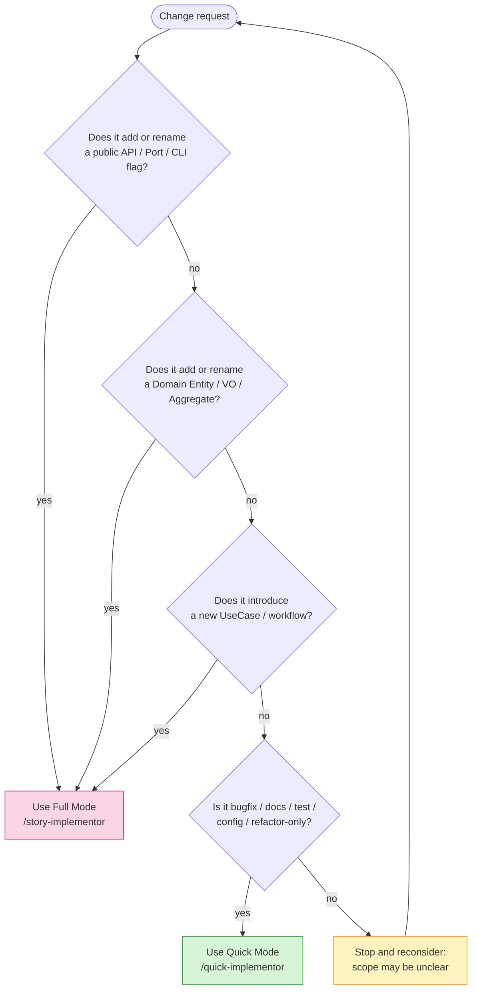

# Quick Mode vs Full Mode — Choosing the Right Flow

Phasegate ships two implementation flows. Picking the wrong one is the most common source of friction: Full on trivial changes feels overkill, and Quick on contract-level changes defeats the whole point of the harness. This guide gives you a decision flow and worked examples so the choice is mechanical, not judgemental.

> TL;DR — **Full Mode** (`/story-implementor`) is the default when a change touches API contracts, domain models, or new use cases. **Quick Mode** (`/quick-implementor`) is the escape hatch for bugfixes, docs, tests, and configuration tweaks. When in doubt, pick Full — a Full run on a small change is wasteful; a Quick run on a contract change is a latent bug.

---

## Decision Flow



**Rule of thumb**: if the change alters something another module can *observe* (contract, schema, domain shape, new capability), go Full. If the change is invisible to consumers (internal fix, doc rewording, test addition, config bump), go Quick.

---

## Mode Comparison

| Aspect | Full Mode (`/story-implementor`) | Quick Mode (`/quick-implementor`) |
|---|---|---|
| Prerequisite check | `/implementation-readiness-checker` required | Not required |
| Phase Gate | Enforced — `logical_design.md` + `domain_model.md` must exist | Relaxed — design docs not required |
| 2-Phase execution | Phase 1 (plan) → approval → Phase 2 (TDD) | Single phase |
| TDD pyramid | Unit → IT → E2E in order | Fix + spot-test only |
| Test design doc | Required before coding | Not required |
| Coverage target | 90% or above | Existing coverage maintained |
| L1 Biome rules | All 8 rules | **All 8 rules** |
| L2 Pre-commit | phase-gate + metadata + test-quality + CLI E2E coverage + WI status + contract traceability | **metadata + test-quality + WI status** (phase-gate, CLI E2E coverage, and contract traceability relaxed) |
| L3 CI | security + performance + coverage + nyquist | security only |
| L4 Scheduled | drift + consistency + dead-code | skipped |
| Commit prefix | conventional (`feat:`, `fix:`, ...) | `[quick] ...` |

Both modes keep **L1 in full strength** and **L2 metadata / test-quality / WI status** — `@unit` / `@layer` comments, semantic AAA structure, assertion-strength checks, and stale WI status checks are non-negotiable regardless of flow. Quick Mode treats `maintainedLayers` entries as exact validator IDs; `L2` is not expanded into every L2 validator. <!-- @work-item-id WI-159 -->

---

## Automatic Escalation: `fullModeRequiredWhen`

Even when you launch `/quick-implementor`, the harness re-checks whether the in-flight change set actually qualifies as Quick. Three triggers force escalation back to Full Mode at the **pre-tool-use hook** (synchronous block, not just a post-hoc warning):

| Trigger | `quickMode.fullModeRequiredWhen.*` flag | Default | Block reason on hook |
|---|---|---|---|
| Change set spans multiple categories (e.g. `bugfix` + `api`) | `mixedCategories` | `true` | `FULL_MODE_REQUIRED` |
| New file added under any `domain/` directory | `newDomainFile` | `true` | `FULL_MODE_REQUIRED` |
| Modification to a Port (`*port.ts`) or Adapter (`*adapter.ts`) | `apiContractChange` | `true` | `FULL_MODE_REQUIRED` |

Introduced in v0.63.0 (ISSUE-006 Story A — config-driven flags + `check-change-category` CLI) and wired into the hook in v0.64.0 (Story B). Each flag can be flipped to `false` only when a project intentionally accepts the risk of merging that category of change without the design ceremony — e.g. early-stage prototypes where new domain files churn freely.

When the escalation is intentional, do not widen `quickMode.allowedCategories` by hand. Start a hook-visible Full Mode session for the approved Unit/WI before the implementation step, then end it after completion:

```bash
npx phasegate session begin --mode full --unit <unit> --work-item <WI-XXX> --reason "story-implementor Phase 2" --duration 1h
npx phasegate session end --work-item <WI-XXX>
```

The PreToolUse hook validates `.phasegate/session.json` by TTL, unit, and dominant category. The `/story-implementor` skill is still the design/TDD guide; the session marker is the authorization the hook can actually observe. <!-- @work-item-id WI-206 -->

### How a path becomes a category

The classifier is **path-based, not intent-based**. It never reads your commit message or your stated purpose; it looks at the write target's path and its change kind (`CREATE` / `MODIFY` / `DELETE`). Rules are evaluated in this order, first match wins:

| Order | Match | Category |
|---|---|---|
| 0 | `quickMode.categoryOverrides` glob match (see below) | the configured category |
| 1 | `*.config.json`, `*.config.ts`, `phasegate.config.json` | `config` |
| 2 | `.github/workflows/*.yml`, `.github/workflows/*.yaml` | `config` |
| 3 | Repo-root bootstrap files: `.gitignore`, `.gitattributes`, `.editorconfig`, `.npmrc`, `.nvmrc`, `tsconfig.json`, `tsconfig.*.json`, anything under `.husky/` | `config` |
| 4 | Comment/whitespace-only diff | `docs` |
| 5 | `*port.ts`, `*adapter.ts` | `api` |
| 6 | `__tests__/`, `*.test.ts`, `*.spec.ts` | `test` |
| 7 | Anything under a `domain/` directory | `domain` |
| 8 | Anything under `docs/` | `docs` |
| 9 | `skills/**/*.md` | `docs` |
| 10 | Any other `CREATE` | `feature` |
| 11 | Any other `MODIFY` / `DELETE` | `bugfix` |

Two consequences worth internalising:

- The `config` rules are an **explicit allow-list**, not a wildcard. `.github/dependabot.yml`, `packages/app/.gitignore`, or a `Dockerfile` are *not* `config` — created fresh they fall through to `feature` and are blocked. This is deliberate fail-closed behaviour: widening the list is a config decision, not an inference the hook makes for you.
- `feature` is the fallback for **every new non-test source file**. "It's only a tiny helper" does not change the classification.

When the hook blocks a write, the message now names the deciding category and change kind per path (`foo.ts (category=feature, changeKind=CREATE)`), and — for `bugfix` / `docs` / `test` / `config` blocks — points at `allowedCategories` and `config:plan --intent quick-mode-relax` rather than at `/story-implementor`. <!-- @work-item-id WI-352 --> <!-- @work-item-id WI-354 -->

### Overriding the table for project-specific paths

<!-- @work-item-id WI-372 -->

The built-in table has no knowledge of your project's own conventions. A directory such as `results/` or `notes/` holds documents, but the classifier sees an unknown path: `MODIFY` falls through to `bugfix`, and `CREATE` falls through to `feature` — a category that cannot be added to `allowedCategories` at all, so the write is permanently Full Mode.

`quickMode.categoryOverrides` maps a category to a list of globs:

```jsonc
{
  "quickMode": {
    "allowedCategories": ["bugfix", "docs", "test", "config"],
    "categoryOverrides": {
      "docs": ["results/**", "notes/**"]
    }
  }
}
```

Four rules govern how overrides interact with the table above:

1. **Overrides are evaluated first — order 0 in the table.** They are an explicit declaration about your repository, so they beat inference. Without this, `notes/deploy.config.json` would still be caught by rule 1 and the setting would look broken.
2. **Overrides cannot downgrade `domain` or `api`.** If the built-in rules classify a path as `domain` (rule 7) or `api` (rule 5), an override may only raise the risk, never lower it. `{"docs": ["scripts/**"]}` will *not* turn a domain file into a doc. The weakening vector is closed by construction, not by convention.
3. **All seven categories are valid override keys**, including `domain`, `api`, and `feature`. Assigning a path to one of those only makes the gate harder to pass, since they sit outside the default `allowedCategories` — it is a hardening lever, e.g. `{"domain": ["packages/core/**"]}`.
4. **`NEW_DOMAIN` and `API_CONTRACT` still apply.** The three rejection rules stay path-based and ignore overrides entirely, so a misconfigured override cannot let a new domain file or a port/adapter change slip through. Only `MIXED_CHANGES` consumes the override-adjusted category.

If two override categories match the same path, the higher-risk one wins, so the result never depends on JSON key order.

Supported glob syntax is deliberately small: `**` (crosses `/`), `*` (does not cross `/`), and `?` (one non-`/` character). Brace expansion and negation are not supported. Patterns are matched against project-relative POSIX paths.

Overrides apply identically to all three consumers — the PreToolUse hook, `check-change-category`, and `ci-check --quick` — because they share one config load. With `categoryOverrides` unset the classification is exactly what it was before the feature existed.

### Dry-running the classifier

Use `check-change-category` to evaluate an arbitrary file list without actually starting an implementation:

```bash
# Inspect what category each file lands in
npx phasegate check-change-category --paths src/foo.ts,src/bar.ts

# CI gate: hard-fail the build if Quick Mode would have to escalate
npx phasegate check-change-category \
  --paths "$(git diff --name-only origin/main...HEAD | paste -sd, -)" \
  --fail-on-full-required \
  --format json
```

`--fail-on-full-required` is opt-in; without it the command is purely informational (always exit 0).

---

## Worked Examples

### Full Mode candidates

| Change | Why Full |
|---|---|
| Add a new `/phasegate inspect-unit` CLI command | New public surface — downstream users will depend on it |
| Introduce a `ValidationReport` value object | New domain model; invariants must be designed up front |
| Split a monolithic `PhaseGate` aggregate into two | Domain shape change — ripples into tests and consumers |
| Add a new "scheduled-audit" UseCase | New workflow requires logical design + test design |
| Change a Port interface (adapter contract) | Breaks existing adapters; contract change by definition |

### Quick Mode candidates

| Change | Why Quick |
|---|---|
| Fix a NaN in `calculate-coverage-usecase.ts` | Bugfix in existing code; no contract change |
| Reword an error message in a Biome rule | User-visible but not semantically new |
| Add a missing test case for an existing branch | Test-only; no production code touched |
| Bump `vitest` to a patch version in `package.json` | Config / dependency change |
| Rename a local helper variable across one file | Refactor with no external effect |
| Update `docs/guide/*.md` for clarity | Pure documentation |
| Add a new regex pattern to an existing `protectedFiles.exclude` list | Config tweak |

### Ambiguous — default to Full

| Change | Why not Quick |
|---|---|
| "Small" new feature, "just one function" | New behaviour is a contract addition; Quick would skip the test design gate |
| Refactor that moves types between modules | Import graph changes can cascade; Full's L3 coverage/performance gates catch regressions |
| "Tiny" adapter change that only adds one method | Port surface change — contract change even if code is short |

---

## Two-Tier Operation for Solo / Small Projects

Running every change through Full AIDLC is genuinely heavy for one-person projects. A pragmatic pattern is the **core / periphery split**:

- **Core scope** — the parts of the system where correctness, contracts, or domain invariants matter. Always Full.
- **Periphery scope** — CLI glue, helper utilities, documentation, developer tooling, scheduled jobs that aren't in the hot path. Default to Quick, escalate to Full only when a change touches a contract.

### Example partitioning (from the Phasegate repo itself)

| Scope | Typical path | Default mode |
|---|---|---|
| Core | `scripts/harness/<unit>/domain/**`, Port interfaces, public CLI surface | Full |
| Core | `docs/product/construction/<unit>/*.md` (contract docs) | Full |
| Periphery | Internal helpers in `application/` that don't change ports | Quick-first, Full if contract impact emerges |
| Periphery | `scripts/harness/presentation/` formatting / wording | Quick |
| Periphery | `docs/guide/*`, `README.md`, `skills/*` tweaks | Quick |
| Periphery | Version bumps, `phasegate.config.json` value edits | Quick |

Codify the split in your head (or in a project CLAUDE.md note) — "`domain/**` is core, everything else starts Quick" is a healthy default for a single-maintainer project.

---

## Common Pitfalls

1. **Using Quick to dodge a Phase Gate block.** If pre-tool-use blocks your write because `logical_design.md` is missing, the correct response is to create the design doc, not to re-launch in Quick Mode. Quick Mode is for changes that genuinely don't need design — not for bypassing the gate.
2. **Declaring "bugfix" on what is really a new feature.** Adding a new branch to an existing function that handles a previously-unsupported case is a feature, not a bugfix. If consumers will see new behaviour they didn't see before, it is Full Mode material.
3. **Drawing the core/periphery line too generously.** "Periphery" should mean "cannot affect contracts or domain invariants." If you're unsure, treat it as core for this change — you can re-classify later.
4. **Batching a Full change and a Quick change in the same commit.** If a commit touches both a domain model and a doc typo, run Full — the `[quick]` prefix on a commit that also changes a domain file is misleading.
5. **Using Quick for multi-Unit changes.** Cross-Unit work implies contract coordination; that is Full territory by definition.

---

## FAQ

**Q. I have a one-line bugfix in `domain/`. Does "any file under `domain/`" auto-trigger Full?**
Yes — mechanically. The classifier is path-based (see [How a path becomes a category](#how-a-path-becomes-a-category)), so *any* write under a `domain/` directory lands in the `domain` category, which is outside the default `allowedCategories`, and the hook blocks it with `MIXED_CHANGES`. Judgement about "it's only an off-by-one" does not enter into it. If the fix is genuinely trivial, the sanctioned routes are a Full Mode session (`phasegate session begin --mode full --unit <unit> ...`) or, when the project has decided domain edits are routinely Quick-eligible, widening `allowedCategories` via `config:plan`. Do not expect the hook to infer intent.

**Q. What if Quick discovers the change is bigger than expected mid-flight?**
Stop, commit nothing, and re-launch `/story-implementor`. Don't try to "finish in Quick" — you'll skip the design gate that would otherwise catch the scope creep.

**Q. Can I disable Quick Mode entirely?**
Not by emptying the list — `allowedCategories: []` is rejected as invalid config (`allowedCategories must not be empty`), so it breaks the hook rather than tightening it. Narrow it instead: `allowedCategories: ["docs"]` routes effectively everything through Full Mode while staying valid. Alternatively, leave the categories as-is and set every `quickMode.fullModeRequiredWhen.*` flag to `true` (the default) so any non-trivial scope automatically escalates.

**Q. Can I add custom categories?**
No. `allowedCategories` accepts only values from a fixed enum — the seven `ChangeCategory` values `bugfix`, `docs`, `test`, `config`, `feature`, `domain`, `api`. The default allow-list is the first four; the remaining three exist so that a project can *deliberately* widen the gate (rarely a good idea), not so you can invent a new label. The enum is enforced by both the config schema and `QuickModeConfig`, so a misspelling is a loud config error, not a setting that quietly never matches. <!-- @work-item-id WI-373 -->

What you *can* customise is which paths map to which of those seven categories — see [Overriding the table for project-specific paths](#overriding-the-table-for-project-specific-paths). If your workflow needs a category outside the enum, that is evidence the change is probably Full Mode material.

---

## Related

- [Skills Overview](skills-overview.md) — full catalogue of 29 skills
- [Layer Model](layer-model.md) — L0 through L4 defence layers
- [Configuration](configuration.md) — `quickMode` configuration reference
- `skills/quick-implementor/SKILL.md` — the Quick Mode skill definition
- `skills/story-implementor/SKILL.md` — the Full Mode skill definition
