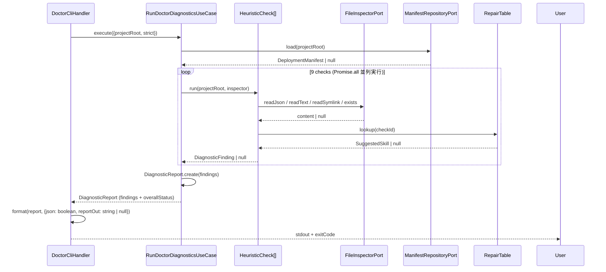

---
traceability:
  initial_creation: true
work_item: WI-145
---

# Logical Design: WI-145 (Deployment manifest + silent-failure doctor)

> **WI**: WI-145
> **Unit**: installation
> **作成日**: 2026-05-11
> **承認済 Phase 1 計画**: `docs/inception/_cross/WI-145/logical_design_plan.md`
> **関連 横断設計**: `docs/product/construction/installation/logical_design.md`
> **関連 domain model**: `docs/product/construction/installation/domain_model.md`

## 1. WI-145 スコープ範囲 (横断設計のうち本 WI が担当する範囲)

@work-item-id WI-145

本 WI が **実装する** 範囲:
- F3: Deployment manifest 生成・読込 (`DeploymentManifest` / `DeploymentEntry` の永続層構築)
- F2: Silent-failure doctor (9 heuristic checks + `RunDoctorDiagnosticsUseCase`)
- F2-3: AI 委譲経路の domain 構造化 (`RepairMode` / `SuggestedSkill` / `RepairTable`)

本 WI が **実装しない** 範囲 (各 WI で実装):
- WI-146: `InstallUseCase` + `MergeStrategy<T>` 実装
- WI-147: `UninstallUseCase` + `UninstallReverseStrategy` 実装
- WI-148: `ReconcileUseCase` + `ReconcileStrategy` 実装 + `init` deprecation

本 WI で interface のみ用意し、実装は後続 WI で行う:
- `MergeStrategy<T>` interface (domain layer)
- `UninstallReverseStrategy` interface (domain layer)
- `ReconcileStrategy` interface (domain layer)

## 2. WI-145 で新規作成するファイル一覧

@work-item-id WI-145

### 2.1 domain layer (`scripts/harness/installation/domain/`)

| Path | 役割 | テスト先 |
|---|---|---|
| `deployment-manifest.ts` | DeploymentManifest 集約 root + factory | `__tests__/unit/installation/deployment-manifest.spec.ts` |
| `deployment-entry.ts` | DeploymentEntry VO | `__tests__/unit/installation/deployment-entry.spec.ts` |
| `diagnostic-report.ts` | DiagnosticReport 集約 root + factory | `__tests__/unit/installation/diagnostic-report.spec.ts` |
| `diagnostic-finding.ts` | DiagnosticFinding VO | `__tests__/unit/installation/diagnostic-finding.spec.ts` |
| `repair-mode.ts` | RepairMode VO (3 値) | `__tests__/unit/installation/repair-mode.spec.ts` |
| `suggested-skill.ts` | SuggestedSkill VO | `__tests__/unit/installation/suggested-skill.spec.ts` |
| `hash.ts` | Hash VO (sha256 prefix) | `__tests__/unit/installation/hash.spec.ts` |
| `managed-block.ts` | ManagedBlock VO (WI-146 用 stub) | (test は WI-146 で完備) |
| `check-id.ts` | CheckId 9 種 union 型 | (type only) |
| `repair-table.ts` | RepairTable domain class (9 entries) | `__tests__/unit/installation/repair-table.spec.ts` |
| `ports/heuristic-check.ts` | HeuristicCheck interface | (interface only) |
| `ports/merge-strategy.ts` | MergeStrategy<T> interface (WI-146 用 stub) | (interface only) |
| `ports/uninstall-reverse-strategy.ts` | UninstallReverseStrategy interface (WI-147 用 stub) | (interface only) |
| `ports/reconcile-strategy.ts` | ReconcileStrategy interface (WI-148 用 stub) | (interface only) |

#### 2.1.1 主要 domain 型の詳細定義

**`DeploymentManifest`** (root aggregate)
- `version: string` — semver (deploy 時の phasegate version)
- `installedAt: string` — ISO8601
- `entries: readonly DeploymentEntry[]`
- 不変条件: (a) `entries[].path` がユニーク; (b) `entry.mode == "merged"` ⇒ `entry.block != null`; (c) `entry.hash` は `sha256:` prefix 付き 64 hex chars; (d) `version` は semver 形式
- API: `addEntry(entry): DeploymentManifest` / `removeEntry(path): DeploymentManifest` (pure function、新インスタンスを返す)

**`DeploymentEntry`** (VO)
- `path: string` — project root からの relative path
- `mode: "created" | "merged" | "symlink"`
- `block: ManagedBlock | null` — `mode == "merged"` の場合は非 null (不変条件)、それ以外は null
- `hash: Hash` — `sha256:<64 hex chars>` 形式の VO
- `deployedAt: string` — ISO8601 タイムスタンプ (domain_model.md §2.1 と同期)

**`DiagnosticReport`** (root aggregate、一過性)
- `findings: readonly DiagnosticFinding[]`
- `overallStatus: "green" | "red" | "warn"` — findings から derive される
- 不変条件: (a) `findings[].checkId` がユニーク; (b) `finding.repairMode == "ai-assisted"` ⇒ `finding.suggestedSkill != null`; (c) red finding が 1 件でもあれば `overallStatus = "red"`
- `hasRedFlag(): boolean` / `hasWarning(): boolean`

**`DiagnosticFinding`** (VO)
- `checkId: CheckId`
- `severity: "red" | "warn"`
- `target: string` — e.g. `.claude/settings.json`
- `message: string`
- `repairMode: RepairMode`
- `repairHint: string | null` — mechanical 時のコピペ可能コマンド hint
- `suggestedSkill: SuggestedSkill | null` — ai-assisted 時のみ非 null (不変条件)

**`RepairMode`** (3 値 VO)
- `"mechanical"`: phasegate install --apply 等で安全に自動修復可
- `"ai-assisted"`: user 改変あり / 意味的判断が必要なため AI と人間の協議が必要
- `"manual"`: phasegate の知識外で人間が判断

**`SuggestedSkill`** (VO)
- `skillName: string` — e.g. `phasegate-config-doctor`
- `rationale: string` — なぜこの skill を推奨するか
- `invokeCommand: string` — e.g. `invoke /phasegate-config-doctor`

**`Hash`** (VO)
- `value: string` — `sha256:<64 hex chars>` 形式
- `algorithm: "sha256"` (将来の alg 切替に備えた prefix 方式)
- 不変条件: `value.startsWith("sha256:")` かつ残り 64 hex chars

**`CheckId`** (union 型)
```typescript
type CheckId =
  | "claude-hook-missing"
  | "codex-hook-missing"
  | "husky-pre-commit-missing"
  | "husky-commit-msg-missing"
  | "husky-pre-push-missing"
  | "ci-workflow-missing"
  | "package-json-devdep-missing"
  | "claude-skills-symlink"
  | "codex-skills-symlink";
```

**`RepairTable`** (domain class、静的レジストリ)
- `lookup(checkId: CheckId): SuggestedSkill | null`
- 9 entries 全件マッピング (§2.1.2 参照)
- constructor で `Object.freeze()` による immutability 保護

#### 2.1.2 RepairTable 9 entries マッピング (固有 Phase 1 Q6=a 採用)

| CheckId | RepairMode (典型) | SuggestedSkill.skillName | SuggestedSkill.invokeCommand |
|---|---|---|---|
| `claude-hook-missing` (user 改変あり) | `ai-assisted` | `phasegate-config-doctor` | `invoke /phasegate-config-doctor` |
| `codex-hook-missing` (user 改変あり) | `ai-assisted` | `phasegate-config-doctor` | `invoke /phasegate-config-doctor` |
| `husky-pre-commit-missing` (既存 custom logic あり) | `ai-assisted` | `phasegate-config-doctor` | `invoke /phasegate-config-doctor` |
| `husky-commit-msg-missing` (既存 custom logic あり) | `ai-assisted` | `phasegate-config-doctor` | `invoke /phasegate-config-doctor` |
| `husky-pre-push-missing` | `mechanical` | `null` (mechanical は skill 不要) | — |
| `ci-workflow-missing` (既存 workflow と競合可能性) | `manual` | `phasegate-toolkit-guide` | `invoke /phasegate-toolkit-guide` |
| `package-json-devdep-missing` | `mechanical` | `null` | — |
| `claude-skills-symlink` | `mechanical` | `null` | — |
| `codex-skills-symlink` | `mechanical` | `null` | — |

注: `repairMode` は各 `HeuristicCheck` 内で file 状態を見て動的に判定される。上記は「典型的な判定結果」であり、user 改変有無によって変わる場合がある。`RepairTable` は `checkId → suggestedSkill` のマッピングのみ提供し、`repairMode` の判定はしない。

### 2.2 application layer (`scripts/harness/installation/application/`)

| Path | 役割 | テスト先 |
|---|---|---|
| `ports/manifest-repository-port.ts` | ManifestRepositoryPort interface | (interface only) |
| `ports/file-inspector-port.ts` | FileInspectorPort interface | (interface only) |
| `ports/hash-calculator-port.ts` | HashCalculatorPort interface | (interface only) |
| `use-cases/run-doctor-diagnostics.ts` | RunDoctorDiagnosticsUseCase | `__tests__/unit/installation/run-doctor-diagnostics.spec.ts` |
| `checks/claude-hook-missing-check.ts` | ClaudeHookMissingCheck | `__tests__/unit/installation/checks/claude-hook-missing-check.spec.ts` |
| `checks/codex-hook-missing-check.ts` | CodexHookMissingCheck | `__tests__/unit/installation/checks/codex-hook-missing-check.spec.ts` |
| `checks/husky-pre-commit-missing-check.ts` | HuskyPreCommitMissingCheck | `__tests__/unit/installation/checks/husky-pre-commit-missing-check.spec.ts` |
| `checks/husky-commit-msg-missing-check.ts` | HuskyCommitMsgMissingCheck | `__tests__/unit/installation/checks/husky-commit-msg-missing-check.spec.ts` |
| `checks/husky-pre-push-missing-check.ts` | HuskyPrePushMissingCheck | `__tests__/unit/installation/checks/husky-pre-push-missing-check.spec.ts` |
| `checks/ci-workflow-missing-check.ts` | CiWorkflowMissingCheck | `__tests__/unit/installation/checks/ci-workflow-missing-check.spec.ts` |
| `checks/package-json-devdep-missing-check.ts` | PackageJsonDevdepMissingCheck | `__tests__/unit/installation/checks/package-json-devdep-missing-check.spec.ts` |
| `checks/claude-skills-symlink-check.ts` | ClaudeSkillsSymlinkCheck | `__tests__/unit/installation/checks/claude-skills-symlink-check.spec.ts` |
| `checks/codex-skills-symlink-check.ts` | CodexSkillsSymlinkCheck | `__tests__/unit/installation/checks/codex-skills-symlink-check.spec.ts` |
| `wrappers/skill-deployer-manifest-builder.ts` | 既存 `setup/skill-deployer.ts` の薄い wrapper (横断 Phase 1 Q3=c) | `__tests__/integration/installation/skill-deployer-manifest-builder.spec.ts` |

#### 2.2.1 主要 Port interface の詳細定義

**`ManifestRepositoryPort`** (横断 logical_design.md §3.1 と同期)
```typescript
interface ManifestRepositoryPort {
  load(projectRoot: string): Promise<DeploymentManifest | null>;  // 不存在 → null、parse 失敗 → HarnessError throw
  save(projectRoot: string, manifest: DeploymentManifest): Promise<void>;  // atomic (tmp → rename)
  exists(projectRoot: string): Promise<boolean>;
  archive(projectRoot: string): Promise<void>;  // uninstall 用 (WI-147)、`.phasegate/manifest.archived-{ISO}.json` へ rename
}
```
- WI-145 では `load` / `save` / `exists` を実装。`archive` は WI-147 で実装するが interface には含める

**`FileInspectorPort`** (横断 logical_design.md §3.2 と同期)
```typescript
interface FileInspectorPort {
  exists(absolutePath: string): Promise<boolean>;
  readText(absolutePath: string): Promise<string | null>;         // 不存在 / 読込失敗 → null
  readJson<T = unknown>(absolutePath: string): Promise<T | null>; // 不存在 / parse 失敗 → null (例外を投げない)
  readSymlink(absolutePath: string): Promise<string | null>;      // not a symlink → null、深さ 1 のみ追跡
}
```
- `readJson` は parse 失敗時に例外を投げず `null` を返す: HeuristicCheck が parse 失敗を `manual` finding に変換するため

**`HashCalculatorPort`**
```typescript
interface HashCalculatorPort {
  compute(content: string | Buffer): Hash; // sha256 で実装
}
```

#### 2.2.2 HeuristicCheck の検出ロジック方針 (固有 Phase 1 Q3=b 採用)

各 `HeuristicCheck` 実装は文字列 substring 検索ではなく JSON 構造 parse を基本とする:

- `.claude/settings.json` / `.codex/hooks.json`: JSON parse して hook command の存在を確認。parse 失敗時は `repairMode: "manual"` で finding を生成
- `.husky/*` shell scripts: JSON parse 不可のため `# === phasegate managed (BEGIN) ===` block と本体コマンドの両存在を regex で確認
- `package.json`: JSON parse して `devDependencies.phasegate` の存在を確認
- `.github/workflows/`: phasegate workflow file の存在確認 (filename pattern matching)
- skill symlinks: `readSymlink` で symlink target が phasegate `skills/` を指しているか確認

**RepairMode 判定基準** (application check 内の pure function で実装):
- target file が存在しない → `mechanical`
- target file が存在し、phasegate 設定が無く、既存 content が template 互換 (e.g. 空 `{ "hooks": {} }`) → `mechanical`
- target file が存在し、phasegate 設定が無く、既存 content に user customization あり → `ai-assisted`
- target が JSON parse 失敗 / 権限欠如 / symlink 循環 → `manual`

### 2.3 infrastructure layer (`scripts/harness/installation/infrastructure/`)

| Path | 役割 | テスト先 |
|---|---|---|
| `adapters/file-system-manifest-repository-adapter.ts` | ManifestRepositoryPort impl | `__tests__/integration/installation/file-system-manifest-repository-adapter.spec.ts` |
| `adapters/node-fs-file-inspector-adapter.ts` | FileInspectorPort impl | `__tests__/integration/installation/node-fs-file-inspector-adapter.spec.ts` |
| `adapters/node-crypto-hash-adapter.ts` | HashCalculatorPort impl (Node.js 標準 crypto) | `__tests__/unit/installation/node-crypto-hash-adapter.spec.ts` (Node.js built-in なので unit) |

#### 2.3.1 FileSystemManifestRepositoryAdapter の atomic write 方針

```
1. manifest.json をシリアライズ
2. .phasegate/<uuid>.tmp に書き込み
3. .phasegate/manifest.json へ rename (OS レベルの atomic 操作)
4. .tmp ファイルは rename 完了後に消える
```

書き込み中 crash が発生しても `.phasegate/manifest.json` は旧バージョンのまま保持される。

### 2.4 presentation layer (`scripts/harness/installation/presentation/`)

| Path | 役割 | テスト先 |
|---|---|---|
| `cli/doctor-handler.ts` | `phasegate doctor` CLI handler | `__tests__/integration/installation/doctor-handler.spec.ts` (CLI 起動 e2e) |
| `formatters/diagnostic-report-formatter.ts` | human / json output formatter (schemaVersion: 1.0) | `__tests__/unit/installation/diagnostic-report-formatter.spec.ts` |

### 2.5 既存ファイルへの追記

| Path | 追記内容 |
|---|---|
| `scripts/harness/main.ts` | `case "doctor"` (本 WI で完全実装)、`case "install"` (WI-146 stub)、`case "uninstall"` (WI-147 stub)、`case "reconcile"` (WI-148 stub) を追加。stub case は `Not yet implemented` を投げる暫定実装 |

## 3. 主要 use case の sequence diagram

@work-item-id WI-145

### 3.1 RunDoctorDiagnosticsUseCase



### 3.2 exit code 決定ロジック

```
report.hasRedFlag() → exitCode = 1
!report.hasRedFlag() && report.hasWarning() && strict → exitCode = 1
!report.hasRedFlag() && report.hasWarning() && !strict → exitCode = 0
all clear → exitCode = 0
```

加えて、`repairMode != "mechanical"` の finding が 1 件でも存在する場合は warn 扱い (`--strict` 時 exitCode = 1)。

## 4. 4 種 fixture 定義 (横断 Phase 1 Q2=a、固有 Phase 1 Q4=c と整合)

@work-item-id WI-145

`scripts/harness/__tests__/integration/installation/fixtures/` に配置:

| Fixture | 内容 | 期待 doctor 結果 |
|---|---|---|
| `no-phasegate/` | phasegate 未導入のクリーンな package (空 `package.json` + 空ディレクトリ構造) | `overallStatus: "red"`, findings に `package-json-devdep-missing` 等が含まれる。manifest が無い場合は heuristic-only モードで動作 |
| `full-install/` | 全 file 完全に deploy 済み (`.claude/settings.json` に phasegate hooks 全 4 種、`.codex/hooks.json` に phasegate hooks、`.husky/pre-commit` / `commit-msg` / `pre-push` に phasegate managed block、`.github/workflows/phasegate-aidlc-gate.yml` 存在、`package.json` devDep に phasegate、`.claude/skills` / `.codex/skills` が `skills/` を指す symlink すべて存在) | `overallStatus: "green"`, `findings: []`, exitCode: 0 |
| `partial-install/` | 一部 file は存在するが一部欠落 (e.g. `.claude/settings.json` に phasegate hooks 存在、`.husky/pre-commit` 欠落、`.github/workflows/` に phasegate workflow 欠落) | `overallStatus: "red"`, findings に `husky-pre-commit-missing` / `ci-workflow-missing` が含まれる |
| `inert-install/` | `package.json` に phasegate devDep あり、`.claude/settings.json` は存在するが phasegate hook 未登録、hook / workflow がすべて未 deploy (silent install 失敗ケース) | `overallStatus: "red"`, findings に hook 系 (`claude-hook-missing` / `codex-hook-missing` / `husky-pre-commit-missing` / `husky-commit-msg-missing` / `husky-pre-push-missing`) + `ci-workflow-missing` + symlink 系 (`claude-skills-symlink` / `codex-skills-symlink`) が含まれる |

各 fixture の正確な file tree は `[TODO: Opus review]` (実 fixture 作成時に最終決定)。golden test の期待 JSON は実装フェーズで確定する。

## 5. CLI 出力仕様

@work-item-id WI-145

### 5.1 human readable (default)

```
phasegate doctor v0.146.0
Project: /path/to/project

[red] claude-hook-missing: .claude/settings.json に phasegate hook 4 種の登録がありません
  → repairMode: ai-assisted
  → suggested: phasegate-config-doctor (`invoke /phasegate-config-doctor`)
  → rationale: .claude/settings.json に既存設定がある場合、merge 位置の判定に AI 協議が必要です。

[red] package-json-devdep-missing: package.json の devDependencies に phasegate がありません
  → repairMode: mechanical
  → fix: `npx phasegate install --apply`

[warn] ci-workflow-missing: .github/workflows/ に phasegate L3 検査 workflow が存在しません
  → repairMode: manual
  → suggested: phasegate-toolkit-guide (`invoke /phasegate-toolkit-guide`)
  → rationale: 既存 CI workflow との依存関係解決は人間が判断する必要があります。

Status: RED  (3 findings: 2 red, 1 warn)
Exit: 1
```

### 5.2 --json output (横断 Phase 1 Q4=a 承認、schemaVersion 含む)

```json
{
  "schemaVersion": "1.0",
  "phasegateVersion": "0.146.0",
  "projectRoot": "/path/to/project",
  "overallStatus": "red",
  "findings": [
    {
      "checkId": "claude-hook-missing",
      "severity": "red",
      "target": ".claude/settings.json",
      "message": ".claude/settings.json に phasegate hook 4 種の登録がありません",
      "repairMode": "ai-assisted",
      "repairHint": null,
      "suggestedSkill": {
        "skillName": "phasegate-config-doctor",
        "rationale": ".claude/settings.json に既存設定がある場合、merge 位置の判定に AI 協議が必要です。",
        "invokeCommand": "invoke /phasegate-config-doctor"
      }
    },
    {
      "checkId": "package-json-devdep-missing",
      "severity": "red",
      "target": "package.json",
      "message": "package.json の devDependencies に phasegate がありません",
      "repairMode": "mechanical",
      "repairHint": "npx phasegate install --apply",
      "suggestedSkill": null
    },
    {
      "checkId": "ci-workflow-missing",
      "severity": "warn",
      "target": ".github/workflows/",
      "message": ".github/workflows/ に phasegate L3 検査 workflow が存在しません",
      "repairMode": "manual",
      "repairHint": null,
      "suggestedSkill": {
        "skillName": "phasegate-toolkit-guide",
        "rationale": "既存 CI workflow との依存関係解決は人間が判断する必要があります。",
        "invokeCommand": "invoke /phasegate-toolkit-guide"
      }
    }
  ],
  "exitCode": 1
}
```

### 5.3 --report-out=<path> (固有 Phase 1 Q4=c 承認、opt-in)

`--report-out=.phasegate/last-doctor-report.json` で json output を file に書き出す。default では書き出さない。`--report-out` を指定した場合も stdout には human format (または `--json` が指定されていれば json format) を出力し続ける。

## 6. 受け入れ基準 (WI-145 description.md と整合)

@work-item-id WI-145

1. `.phasegate/manifest.json` が `phasegate install` 後に生成される (atomic write: tmp → rename)
2. `phasegate doctor` が 9 種 heuristic check 全件を評価する (`claude-hook-missing` / `codex-hook-missing` / `husky-pre-commit-missing` / `husky-commit-msg-missing` / `husky-pre-push-missing` / `ci-workflow-missing` / `package-json-devdep-missing` / `claude-skills-symlink` / `codex-skills-symlink`)
3. `phasegate doctor` が `inert-install` fixture で `overallStatus: "red"` を返し exitCode = 1
4. `phasegate doctor` が `full-install` fixture で `overallStatus: "green"` を返し exitCode = 0
5. `--json` output が JSON Schema `schemaVersion: "1.0"` で valid (必須フィールド: `schemaVersion`, `overallStatus`, `findings[].checkId`, `findings[].severity`, `findings[].repairMode`)
6. `--report-out <path>` opt-in で json を file に書き出し
7. `repairMode == "ai-assisted"` の finding に `suggestedSkill` が必ず同梱される (constructor 不変条件)
8. `RepairMode` が 3 値 (`mechanical` / `ai-assisted` / `manual`) で定義される
9. `RepairTable` に 9 entries 全件マッピングあり (§2.1.2)
10. `loadManifest` が存在しない manifest に対し `null` を返し、壊れた JSON に対して明確な error を投げる
11. `DiagnosticFinding.repairMode` が各 check 内で file 状態を見て動的に判定される
12. `repairMode != "mechanical"` の finding が 1 件以上存在すれば doctor が warn 扱い (`--strict` 時 exitCode = 1)
13. 全コードが `// @unit installation` + `// @layer <layer>` アノテーションを持つ
14. manifest 関連の domain / application / infrastructure / presentation コードが Clean Architecture 依存方向 (`domain ← application ← infrastructure/presentation`) を守る

## 7. 設計判断の根拠 (固有 Phase 1 Q1〜Q6 + 横断 Q1〜Q5)

@work-item-id WI-145

| Q (固有/横断) | 採用 | 根拠 |
|---|---|---|
| 固有 Q1 (Unit 配置) | A (新 unit `installation`) | harness-api に詰めると凝集崩壊、manifest / doctor / install / uninstall / reconcile は独立した Bounded Context |
| 固有 Q2 (Manifest 書き出し有効化) | a (無条件) | manifest は doctor / WI-146/147/148 の前提。opt-in にすると「manifest 無しユーザーが heuristic のみ」状態が残り土台整備のゴールを達成できない |
| 固有 Q3 (Heuristic check 方式) | b (JSON 構造 parse) | 文字列 substring では false positive (コメント内に "npx phasegate hook" と書かれただけで pass) が発生するため JSON 構造 parse が妥当 |
| 固有 Q4 (doctor 出力先) | c (--report-out opt-in) | デフォルトで report file を吐かないことで `.phasegate/` ディレクトリ汚染を避ける。既存 phasegate コマンドの慣行と一致 |
| 固有 Q5 (AI 委譲フロー) | a (hint のみ) | skill 起動は Claude Code agent context で行われるべき動作。CLI 子プロセスから起動すると context が分離して AI の判断材料が失われる |
| 固有 Q6 (RepairTable 配置) | a (静的テーブル in WI-145) | WI-145 段階での finding は 9 種限定で best-fit skill は phasegate 開発側が知っている。config 化は WI-148 で再評価 |
| 横断 Q1 (新規 npm package 依存) | a (新規依存ゼロ) | Node.js built-in と既存 phasegate 依存のみ。ユーザー側 npm install 負担を増やさない |
| 横断 Q2 (report 独立/共通基底) | a (各 report 独立) | InstallReport / UninstallReport / ReconcileReport は内部構造が異なるため共通基底は overkill |
| 横断 Q3 (skill-deployer 改修粒度) | c (薄い wrapper) | 既存 deploy 関数の test 群を破壊しない。WI-146 完了時点で wrapper を削除し install 内部に直接統合 |
| 横断 Q4 (--json schema version) | a (schemaVersion 含む) | phasegate version と schema version は独立して進化する。CI consumer 側で互換性判定可能 |
| 横断 Q5 (HeuristicCheck interface 配置) | a (domain layer に interface) | RepairTable も domain layer にあり、checkId 判定ロジックは domain pure。実装は application layer (FileInspectorPort 依存のため) |

## 8. 開発者向け備考

@work-item-id WI-145

- 既存 `scripts/harness/setup/skill-deployer.ts` は `// @unit harness-api` のまま変更なし
- 新規 `scripts/harness/installation/` 配下のソースには `// @unit installation` + `// @layer <layer>` を必ず記載
- 依存方向 violation は `npx phasegate validate --layer L1` で検出
- WI-145 は composition root (`main.ts`) に doctor のみ完全注入。install / uninstall / reconcile case は暫定 handler で `Not yet implemented` を返す (WI-146/147/148 で完備)
- `NodeCryptoHashAdapter` は Node.js built-in `crypto` を使い新規 npm 依存なし (横断 Q1=a)
- `FileSystemManifestRepositoryAdapter` は atomic write のため uuid-like tmp file name を使用 (Node.js `crypto.randomUUID()` 等)
- `symlink` の循環検出は `readSymlink` で深さ 1 のみ追跡し、循環している場合は `manual` finding
- 9 種の HeuristicCheck は application layer で並列実行 (`Promise.all`) し、report 構築は全結果揃ってから行う
- `--strict` flag は `RunDoctorDiagnosticsUseCase` の input に含め、presentation 層ではなく use case 内で exitCode 判定を補完する (presentation は exitCode mapping のみ担当)
