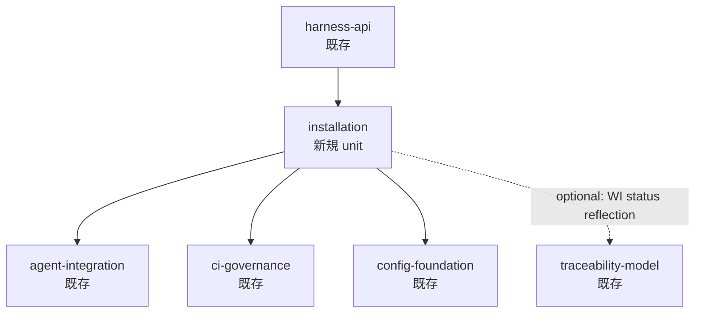

---
traceability:
  initial_creation: true
---

# Unit設計計画: installation (新規 unit 追加)

@work-item-id WI-144

> 起票元: WI-145 (`docs/inception/_cross/WI-145/description.md`) Phase 1 計画書の Q1=A 採用 (新規 unit 導入)
> 関連 WI: WI-144 (umbrella), WI-145 / WI-146 / WI-147 / WI-148 (sub-WI)
> 適用範囲: 単一 unit の新規追加 (既存 14 unit はそのまま、`installation` を 15 番目として追加)

## 1. スコープ

### 対象 WI / ストーリー
- **WI-145**: Deployment manifest + Silent-failure doctor
- **WI-146**: `phasegate install` with structured merge
- **WI-147**: `phasegate uninstall`
- **WI-148**: `phasegate reconcile` + `init` deprecation

### 分析対象の業務領域
phasegate の **deploy 状態管理 + 構造健全性検査** を担当する境界づけられたコンテキスト。
- deploy された全ファイルの manifest 管理 (created / merged 区別、hash、block 識別子)
- inert installation の検出 (heuristic + manifest-based check)
- 既存ファイルへの structured merge (JSON / shell / yaml-add / package.json の異質形式統合)
- clean uninstall (managed block のみ除去、user 部分保持)
- version upgrade 追従 (template と manifest の hash 比較ベース)
- AI 委譲経路 (`RepairMode` / `SuggestedSkill`) の domain 第一級表現

### 単一 unit 提案の根拠
WI-145〜148 は全て「**phasegate 自身の deploy/teardown ライフサイクル**」という一貫した文脈で動作する。manifest schema / RepairMode / SuggestedSkill は全 sub-WI で共有されるため、別 unit に分散させると Shared Kernel が肥大化する。Bounded Context として 1 つに収束させる方が境界が明確。

## 2. グルーピング方針

### 凝集性の基準

| 観点 | 適用 |
|---|---|
| **ライフサイクル一致** | manifest / doctor / install / uninstall / reconcile は phasegate の単一 deploy/teardown 流の異なる断面。全て manifest を共有。 |
| **ユビキタス言語** | `deployment entry` / `repair mode` / `suggested skill` / `managed block` が全 sub-WI で共有される語彙。 |
| **変更単位** | install/uninstall/reconcile のいずれかが変わると manifest schema にも影響しうるため、変更単位が密結合。同一 unit に置くべき。 |
| **テスト境界** | 4 種 fixture (inert-install / partial-install / full-install / no-phasegate) は doctor / install / uninstall / reconcile 全てで再利用される。 |

### Unit 分割の判断根拠
**1 unit 集約**を推奨。理由:
- 上記凝集性基準 4 観点すべてが「同一 unit」を示唆
- 既存 phasegate に同種の Bounded Context (e.g. `validator-system` が複数の L2/L3 validator を集約しているのと類似) の前例あり
- 別 unit に分けると Shared Kernel に `RepairMode` / `DeploymentManifest` を出す必要があり、Shared Kernel 肥大化を招く

### 代替案 (採用しない)
- **代替案 A**: WI ごとに 4 unit に分割 — Shared Kernel 肥大、過剰分割
- **代替案 B**: 既存 `harness-api` に統合 — harness-api は CLI presentation 専属で、deploy 状態管理という別文脈を抱えるべきでない
- **代替案 C**: 既存 `agent-integration` に統合 — agent-integration は hook/agent context 専属で、ファイル deploy 状態管理は範囲外

## 3. Unit一覧（ドラフト）

新規追加 1 件のみ。既存 14 unit は変更なし。

| Unit名 | 担当WI | 責務概要 | 命名 |
|---|---|---|---|
| **installation** | WI-145, WI-146, WI-147, WI-148 | phasegate の deploy 状態管理 / 構造健全性検査 / 既存ファイルへの structured merge / clean uninstall / version upgrade 追従 | kebab-case (`installation_unit.md` / `installation`) |

担当ストーリー詳細 (各 WI から導出した story-id ライク参照):

| WI ID | タイトル | 優先度 |
|---|---|---|
| WI-145 | Deployment manifest と silent-failure doctor | Must |
| WI-146 | `phasegate install` — 既存ファイルへの structured merge | Must |
| WI-147 | `phasegate uninstall` — manifest-driven clean removal | Must |
| WI-148 | `phasegate reconcile` + `init` deprecation | Should |

## 4. Unit間依存関係（ドラフト）

- **harness-api → installation**: `phasegate doctor` / `install` / `uninstall` / `reconcile` の CLI handler が `harness-api` に登録され、`installation` unit の use case を呼ぶ
- **installation → agent-integration**: `.claude/settings.json` / `.codex/hooks.json` の merge strategy が `agent-integration` の hook config 知識を参照
- **installation → ci-governance**: `.github/workflows/*.yml` の deploy / 別名追加が `ci-governance` の workflow 規約を参照
- **installation → config-foundation**: `phasegate.config.json` の deploy / 整合性検査が `config-foundation` の schema を参照
- **installation -.-> traceability-model** (optional): doctor 起動時に WI status / `@work-item-id` annotation の整合性も検査するなら参照 (現時点では非スコープ、将来拡張余地のみ示す)

依存方向に循環なし。Clean Architecture の依存方向と整合。

## 5. QA（不明点・確認事項）

### [Question] Q1: `user_stories.md` への WI-145〜148 追記範囲

現状 `docs/product/user_stories.md` は legacy `H-XX` story ID 形式が主で、`WI-126` 等は `@work-item-id` annotation で併存追加される過渡期にある。本 unit 設計で WI-145〜148 を `user_stories.md` にも追加するか:

**選択肢 a**: WI-145〜148 を `user_stories.md` に新規 Epic `H-installation` として追加し、各 WI を `H-installation-01〜04` のような legacy 互換 ID で正規登録 + `@work-item-id` で WI 参照を併記
**選択肢 b**: `user_stories.md` は触らず、`installation_unit.md` 内で WI-145〜148 を直接参照する形式に留める。`user_stories.md` の WI 化は別 WI で扱う
**選択肢 c**: WI-026 (taxonomy unification) 完了を待ち、本 unit 設計を保留

**推奨案**: **b (`installation_unit.md` 内で WI 直参照)**
- 理由 1: WI-145 のスコープは「manifest + doctor」であり、`user_stories.md` 改訂は本 WI 範囲外
- 理由 2: WI-026 で taxonomy 統一が進む過渡期に legacy ID を新規発行するのは drift を逆方向に増やす
- 理由 3: 既存 `harness-api_unit.md` も `@work-item-id WI-126` のように WI 追記併存パターンが先例にある
- 影響: `unit-designer` Phase 3 review で「全 story が unit に割り当てられているか」check が `user_stories.md` ベースだと WI-145〜148 を見ない懸念。これに対しては `installation_unit.md` 内の「担当 WI 一覧」を unit-designer review の追加観点として扱うことで補う

[Answer]
推奨案 **b** (`installation_unit.md` 内で WI 直参照、user_stories.md は触らない) を採用。承認日: 2026-05-11。

### [Question] Q2: 既存 `scripts/harness/setup/skill-deployer.ts` の `@unit` 再 annotation

現状 `scripts/harness/setup/skill-deployer.ts` は `// @unit harness-api` annotation を持つ。本 WI で installation unit を新設するにあたり:

**選択肢 a**: 既存 `scripts/harness/setup/` 配下のファイルを `// @unit installation` に **全面 re-annotate**。WI-146 で structured merge ロジック追加時に同 directory に追加実装
**選択肢 b**: 既存 `scripts/harness/setup/skill-deployer.ts` は `// @unit harness-api` のまま **legacy 互換維持**。新規 manifest / doctor / install ロジックは `scripts/harness/installation/` (新 directory) 配下に配置し、`// @unit installation`
**選択肢 c**: `scripts/harness/setup/` 自体を `scripts/harness/installation/` にリネームし、`// @unit installation` で統一

**推奨案**: **b (新 directory + legacy 互換維持)**
- 理由 1: 既存 `skill-deployer.ts` の改修は WI-145 では「manifest 書き出し追加 1 行」のみ。re-annotate コストに見合わない
- 理由 2: rename (c) は `import` path 全置換になり、WI-145 のスコープを超える
- 理由 3: WI-146 の structured merge / WI-147 uninstall / WI-148 reconcile は全て新規実装で、`scripts/harness/installation/` 配下に Clean Architecture 4 層 (domain / application / infrastructure / presentation) として配置すれば構造が綺麗
- 暫定的に `scripts/harness/setup/skill-deployer.ts` は「legacy initial deploy 関数群」として残し、新 `scripts/harness/installation/` が install/doctor/uninstall/reconcile の現役実装を持つ
- WI-148 完了時の片付け (legacy `setup/` 削除 or full rename) は別 WI で

[Answer]
推奨案 **b** (新 directory `scripts/harness/installation/` + legacy 互換維持) を採用。承認日: 2026-05-11。

### [Question] Q3: `integration_contract.md` の改訂粒度

`docs/product/units/integration_contract.md` は Unit 数 = 14 (v1) + 2 (Future) として記載されている。新 unit `installation` を追加するにあたり:

**選択肢 a**: `integration_contract.md` に installation unit セクションを **新規追加**。Unit 数を 15 (v1) + 2 (Future) に更新
**選択肢 b**: `integration_contract.md` の Unit 数は触らず、`installation` を「Wave 3 (品質防御メタ層)」として明示的に区別。本契約の対象外であることを注記
**選択肢 c**: `integration_contract.md` を最小改訂 (Unit 数のみ更新、詳細セクション追加は WI-146 完了時の re-review に委ねる)

**推奨案**: **c (最小改訂)**
- 理由 1: WI-145 完了時点では installation unit の API contract は「`phasegate doctor` CLI + `.phasegate/manifest.json` schema」のみ
- 理由 2: WI-146/147/148 完了時に install / uninstall / reconcile CLI の追加で contract が安定するため、それまで詳細追加は留保
- 理由 3: 不完全な contract を `integration_contract.md` に書くと過渡的に drift を生む
- 実施内容: 冒頭の "Unit数: 14 → 15" 更新 + Section "X. installation" を 1 段落 stub で追加 ("詳細は WI-146/147/148 完了時に拡充")

[Answer]
推奨案 **c** (最小改訂、WI-148 完了時に拡充) を採用。承認日: 2026-05-11。

### [Question] Q4: Unit 命名 — `installation` vs 別候補

新 unit の名称候補:

**選択肢 a**: `installation` — install/uninstall/manifest を素直に表現。狭義に取ると "install only" に見える
**選択肢 b**: `deployment` — phasegate を deploy する文脈。広い
**選択肢 c**: `setup-orchestration` — 既存 `setup/` directory との連続性、orchestration ニュアンスで manifest 管理含意
**選択肢 d**: `harness-lifecycle` — install/uninstall/reconcile の lifecycle 全体を表現

**推奨案**: **a (`installation`)**
- 理由 1: 短くて明示的。kebab-case で `installation_unit.md` / `installation/` / `@unit installation` と統一しやすい
- 理由 2: WI-144 タイトル "install/uninstall idempotency" の主語に対応
- 理由 3: install/uninstall/reconcile/doctor は全て「installation lifecycle の操作」とみなせるため、命名上の違和感は無い
- 代替案の課題: `deployment` (b) は phasegate 自身の deploy と user PJ の deploy が混同しうる。`setup-orchestration` (c) は冗長。`harness-lifecycle` (d) は harness という言葉が phasegate に rename 済みの v1 で古い

[Answer]
推奨案 **a** (`installation`) を採用。承認日: 2026-05-11。

## 6. 前提条件・リスク

### 前提条件
- 既存 14 unit の docs (`docs/product/construction/*/` および `docs/product/units/*_unit.md`) を保護し、新 unit `installation` のみを追加する変更
- `docs/product/user_stories.md` への WI-145〜148 追加は Q1 で決定する範囲
- `docs/product/units/integration_contract.md` への新 unit セクション追加は Q3 で決定する粒度

### リスク

| リスク | 影響 | 緩和策 |
|---|---|---|
| Q1 で b 採用 → `user_stories.md` と `installation_unit.md` の story 一覧が乖離 | `phasegate work-items:status` 等の整合性チェックが新 WI に届かない | `unit-designer` Phase 3 review で「`installation_unit.md` 担当 WI 一覧 vs `_cross/WI-XXX/description.md` 存在チェック」を追加 |
| Q2 で b 採用 → `scripts/harness/setup/` と `scripts/harness/installation/` の重複 | 「どこに新コード書くか」が曖昧化 | `installation/` 配下の README で「新規実装はここ、`setup/` は legacy 互換用」を明示。WI-148 完了後の整理は別 WI で |
| Q3 で c 採用 → `integration_contract.md` が不完全な状態で merge | dogfood の文書整合性低下 | section stub に "TODO: WI-148 完了時に拡充" を明示。WI-148 受け入れ基準に integration_contract 拡充を含める |
| WI-026 (taxonomy unification) との衝突 | WI-026 完了時に installation unit の story-id 形式を再調整する必要 | `installation_unit.md` を `@work-item-id` ベースで書き、WI-026 完了時の retrofit を容易にする |
| 新 unit 追加で既存 phasegate L1/L2 が新 unit を見落とす | metadata validator / phase-gate が new unit を skip | `phasegate.config.json` に installation unit の自動認識を確認、不足あれば WI-145 受け入れ基準に含める |

### 既知の依存

- WI-145 → WI-146/147/148 が manifest / RepairMode / SuggestedSkill を共有
- WI-145 Phase 1 計画書 (logical_design_plan.md) の Q1=A 採用に基づく新 unit 導入

---

## Phase 1 完了宣言

本計画書を出力した時点で Phase 1 は完了。**人間にレビューと Q1〜Q4 回答を依頼する**。

Phase 2 (`docs/product/units/installation_unit.md` 新規 + `docs/product/units/integration_contract.md` 改訂) は `npx phasegate delegate-sonnet` 経由で Sonnet 4.6 に委任。Phase 3 (Opus レビュー) でメタデータ / story マッピング / 依存方向 / Bounded Context 境界を検証する。

Phase 2 で生成する成果物のフォーマット:
- `installation_unit.md`: YAML frontmatter (`initial_creation: true`) + 1.概要 / 2.担当ストーリー (WI 表記) / 3.機能要件 (`@work-item-id WI-145` 等 annotation 付き) / 4.データモデル概要 / 5.外部依存
- `integration_contract.md`: Unit 数を 14 → 15 に更新 + "X. installation" section を stub で追加 (Q3=c 採用時)
