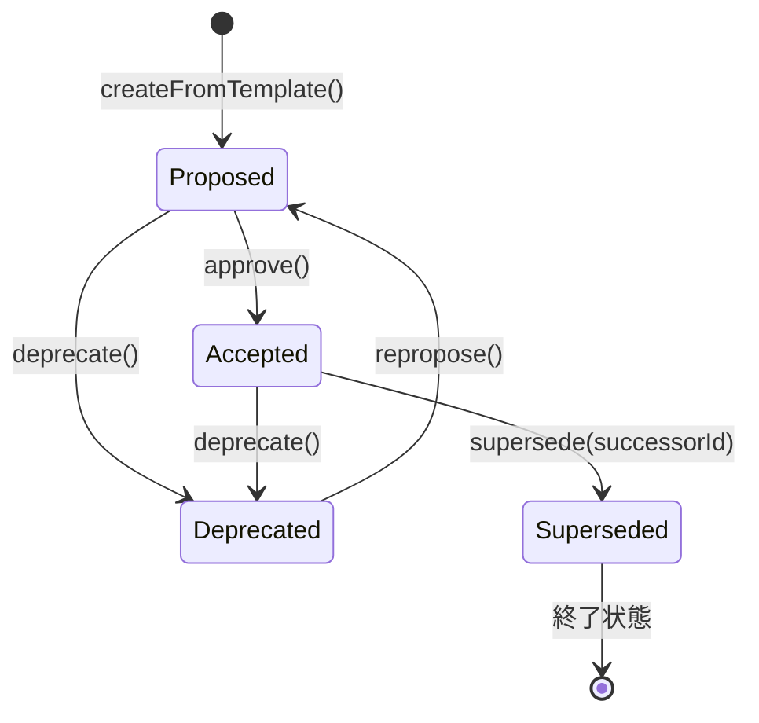
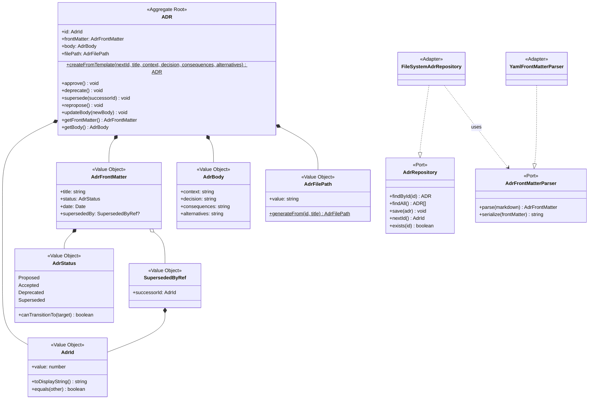

# ドメインモデル: adr-documentation

> **Unit ID**: adr-documentation
> **作成日**: 2026-03-10
> **Wave**: 1（基盤構築）
> **対応ストーリー**: US-020, US-021, US-022

---

## 1. 集約

### 1.1 ADR（Architecture Decision Record）集約

本Unitの唯一の集約。ADRは独立したライフサイクル（作成→提案→承認→廃止/置換）を持ち、フロントマター（メタデータ）と本文で構成される一貫した整合性境界を形成する。

#### 集約ルートの責務

- ADRの作成（テンプレートに基づくファクトリ）
- ステータス遷移の制御と制約の強制
- フロントマターの整合性保証
- ADR番号の一意性保証（リポジトリとの連携）

#### メソッド

| メソッド | 説明 | 不変条件 |
|---------|------|---------|
| `createFromTemplate(nextId, title, context, decision, consequences, alternatives)` | ファクトリ: テンプレート構造に基づいて新規ADRを生成。ステータスはProposed、日付は作成日 | タイトルが空でないこと。nextIdが既存ADR番号と重複しないこと |
| `approve()` | Proposed → Accepted へ遷移 | 現在のステータスがProposedであること |
| `deprecate()` | Proposed/Accepted → Deprecated へ遷移 | 現在のステータスがProposedまたはAcceptedであること |
| `supersede(successorId)` | Accepted → Superseded へ遷移。後継ADR参照を設定 | 現在のステータスがAcceptedであること。successorIdが有効なAdrIdであること |
| `repropose()` | Deprecated → Proposed へ遷移（例外的に許可） | 現在のステータスがDeprecatedであること |
| `updateBody(newBody)` | 本文を更新 | — |
| `getFrontMatter()` | フロントマターを返す | — |
| `getBody()` | 本文を返す | — |

---

## 2. エンティティ

### 2.1 ADR（集約ルート兼エンティティ）

| 属性 | 型 | 説明 |
|------|-----|------|
| id | AdrId | ADR番号（NNN形式）。一意識別子 |
| frontMatter | AdrFrontMatter | フロントマター（メタデータ） |
| body | AdrBody | 本文（コンテキスト・決定・結果・代替案） |
| filePath | AdrFilePath | ファイルパス（`docs/ADR/{NNN}-{title}.md`） |

---

## 3. 値オブジェクト

### 3.1 AdrId

ADR番号を表す値オブジェクト。

| 属性 | 型 | 説明 |
|------|-----|------|
| value | number | ADR番号（正の整数） |

**バリデーション**: 正の整数であること。表示時はNNN形式（ゼロパディング3桁、例: `001`）。

**等価性**: value同士の数値比較。

**採番ルール**: 自動採番（既存最大番号+1）。手動指定不可。欠番は許容（削除されたADRの番号は再利用しない）。

### 3.2 AdrStatus

ADRのライフサイクル状態を表す値オブジェクト（列挙型）。

| 値 | 説明 |
|---|------|
| Proposed | 提案状態。作成直後の初期状態 |
| Accepted | 承認状態。正式に採択された |
| Deprecated | 非推奨状態。もはや推奨されない |
| Superseded | 置換状態。後継ADRにより置き換えられた |

### 3.3 AdrFrontMatter

ADRファイル冒頭のYAMLメタデータ構造を表す値オブジェクト。

| 属性 | 型 | 説明 |
|------|-----|------|
| title | string | ADRのタイトル |
| status | AdrStatus | 現在のステータス |
| date | Date | 作成日（YYYY-MM-DD形式） |
| supersededBy | SupersededByRef | 後継ADR参照（Superseded時のみ有効、それ以外はnull） |

**不変条件**:
- titleは空文字列不可
- statusはAdrStatusの4値のいずれか
- statusがSupersededの場合、supersededByは必須（非null）
- statusがSuperseded以外の場合、supersededByはnull

### 3.4 AdrBody

ADR本文の構造を表す値オブジェクト。

| 属性 | 型 | 説明 |
|------|-----|------|
| context | string | 意思決定に至った背景・状況 |
| decision | string | 採択された技術的判断の内容 |
| consequences | string | 決定による影響・帰結 |
| alternatives | string | 検討されたが採択されなかった選択肢 |

**バリデーション**: context, decision, consequencesは必須（空文字列不可）。alternativesは任意。

### 3.5 SupersededByRef

後継ADR参照を表す値オブジェクト。

| 属性 | 型 | 説明 |
|------|-----|------|
| successorId | AdrId | 後継ADRのID |

**バリデーション**: 参照先のAdrIdが存在すること（リポジトリでの存在確認が必要）。

### 3.6 AdrFilePath

ADRファイルの配置パスを表す値オブジェクト。

| 属性 | 型 | 説明 |
|------|-----|------|
| value | string | `docs/ADR/{NNN}-{title}.md` 形式のパス |

**生成ルール**: AdrIdとtitleから自動生成。`docs/ADR/{AdrId.toDisplayString()}-{kebab-case(title)}.md`

---

## 4. 不変条件

| # | 不変条件 | 検証タイミング |
|---|---------|-------------|
| INV-1 | ADR番号（AdrId）は全ADR内で一意であること | ADR作成時（ファクトリ） |
| INV-2 | フロントマターのstatusは4つの許容値（Proposed/Accepted/Deprecated/Superseded）のいずれかであること | 作成時、ステータス遷移時 |
| INV-3 | statusがSupersededの場合、superseded_byフィールドは必須 | ステータス遷移時（supersede） |
| INV-4 | statusがSuperseded以外の場合、superseded_byはnull | ステータス遷移時 |
| INV-5 | ステータス遷移は許可された遷移パスのみ | ステータス遷移時 |
| INV-6 | AdrBody.context, AdrBody.decision, AdrBody.consequencesは空文字列不可 | 作成時、更新時 |
| INV-7 | AdrFrontMatter.titleは空文字列不可 | 作成時 |
| INV-8 | SupersededByRefの参照先ADRが存在すること | supersede時 |

---

## 5. 状態遷移

### 5.1 ADRステータス遷移表

| 現在のステータス | メソッド | 次のステータス | 条件 |
|----------------|---------|--------------|------|
| Proposed | approve() | Accepted | — |
| Proposed | deprecate() | Deprecated | — |
| Accepted | deprecate() | Deprecated | — |
| Accepted | supersede(successorId) | Superseded | successorIdが有効なAdrIdであること |
| Deprecated | repropose() | Proposed | 例外的な遷移。再提案の妥当性は人間が判断 |

### 5.2 不許可遷移

| 現在のステータス | 試行遷移先 | 理由 |
|----------------|-----------|------|
| Superseded | 全て | 後継ADRに置き換えられた決定は復活不可 |
| Proposed | Superseded | 未承認の提案は置き換え対象にならない |
| Deprecated | Accepted | 再提案を経ずに承認には戻せない |
| Deprecated | Superseded | 非推奨状態からの置換は意味をなさない |

### 5.3 状態遷移図

---

## 6. ドメインイベント

v1実装では明示的なドメインイベント発行メカニズムは不要とする。以下は将来拡張の候補として記録する。

| イベント | 発生条件 | ペイロード | 用途（将来） |
|---------|---------|----------|-------------|
| AdrCreated | createFromTemplate完了時 | AdrId, title | ログ記録、通知 |
| AdrStatusChanged | ステータス遷移時 | AdrId, oldStatus, newStatus, supersededBy(nullable) | 整合性チェックトリガー |

---

## 7. ポートとアダプター

### 7.1 ポート（インターフェース）

| ポート | 方向 | 責務 |
|-------|------|------|
| AdrRepository | 駆動される側（Secondary） | ADRの永続化（読み込み・書き出し・一覧取得・採番） |
| AdrFrontMatterParser | 駆動される側（Secondary） | YAMLフロントマターのパース・シリアライズ |

### 7.2 AdrRepository のメソッド

| メソッド | 説明 |
|---------|------|
| `findById(id)` | ADR番号でADRを取得 |
| `findAll()` | 全ADRを取得 |
| `save(adr)` | ADRを永続化（新規作成・更新） |
| `nextId()` | 次のADR番号を取得（既存最大番号+1） |
| `exists(id)` | 指定IDのADRが存在するか確認 |

### 7.3 アダプター（実装）

| アダプター | 実装対象ポート | 実装内容 |
|-----------|-------------|---------|
| FileSystemAdrRepository | AdrRepository | `docs/ADR/{NNN}-{title}.md` ファイルの読み書き。Markdownファイル（YAMLフロントマター + Markdown本文）との双方向変換 |
| YamlFrontMatterParser | AdrFrontMatterParser | gray-matter等のライブラリによるYAMLフロントマターのパース・シリアライズ |

---

## 8. Shared Kernelとの関係

| 共有概念 | 定義元 | 利用方法 |
|---------|-------|---------|
| ADRフロントマターYAML構造 | 統合契約 §4.8 | 本Unitが定義し、harness-dxがadr_refで参照 |
| HarnessError | 統合契約 §4.1（harness-dx定義） | 本Unitでは直接利用しない |

---

## 9. クラス図

---

## 10. 用語集

| 用語 | 定義 |
|------|------|
| ADR | Architecture Decision Record。技術的意思決定の記録文書 |
| AdrId | ADRの一意識別番号（NNN形式） |
| AdrStatus | ADRのライフサイクル状態（Proposed/Accepted/Deprecated/Superseded） |
| AdrFrontMatter | ADRファイル冒頭のYAMLメタデータ |
| AdrBody | ADR本文（コンテキスト・決定・結果・代替案） |
| SupersededByRef | Superseded状態のADRが持つ後継ADRへの参照 |
| ファクトリ | テンプレート構造に基づくADR生成パターン |
