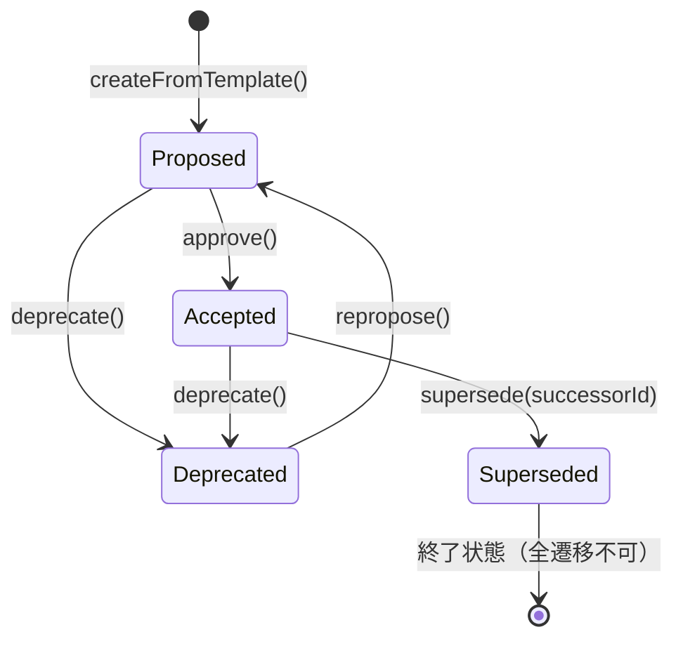

# 論理設計: adr-documentation

> **Unit ID**: adr-documentation
> **作成日**: 2026-03-11
> **Wave**: 1（基盤構築）
> **モード**: 横断（Unit全体の論理設計）
> **対応ストーリー**: US-020, US-021, US-022
> **入力**: `domain_model.md`, `logical_design_plan.md`（QA回答済み）

---

## 1. アーキテクチャ概要

### 1.1 層構成・責務・依存方向

ヘキサゴナルアーキテクチャ（ポート&アダプター）に準拠した4層構成。

```
Controller (Primary Adapter) ─── プログラマティックAPI
    ↓ 依存
UseCase (Application Service)
    ↓ 依存
Domain (Entity / Value Object / Aggregate)
    ↑ 実装
Port (Interface) ← Infrastructure (Secondary Adapter)
```

| 層 | 責務 | 依存先 |
|----|------|--------|
| Domain | 集約・値オブジェクト・不変条件・状態遷移ルール | なし（自己完結） |
| Port | リポジトリ・パーサーのインターフェース定義 | Domain（型参照のみ） |
| UseCase | 集約の取得・永続化の調整。ドメインロジックの呼び出し | Domain, Port |
| Controller | 入出力変換、DTO⇔ドメイン変換、ファサード | UseCase |
| Infrastructure | ポートの具象実装（ファイルI/O、YAMLパース） | Port, Domain（型参照のみ） |

**依存方向の厳守**: Domain層は外部への依存を一切持たない。UseCaseはPortインターフェースに依存し、具象実装（Infrastructure）には依存しない。

### 1.2 ディレクトリ構成

```
src/units/adr-documentation/
├── domain/
│   ├── entities/
│   │   └── adr.ts                    # ADR集約ルート
│   ├── value-objects/
│   │   ├── adr-id.ts                 # AdrId
│   │   ├── adr-status.ts             # AdrStatus
│   │   ├── adr-front-matter.ts       # AdrFrontMatter
│   │   ├── adr-body.ts               # AdrBody
│   │   ├── superseded-by-ref.ts      # SupersededByRef
│   │   └── adr-file-path.ts          # AdrFilePath
│   ├── errors/
│   │   ├── invalid-adr-status-transition-error.ts
│   │   ├── invalid-adr-id-error.ts
│   │   ├── invalid-adr-body-error.ts
│   │   ├── invalid-adr-front-matter-error.ts
│   │   └── duplicate-adr-id-error.ts
│   └── ports/
│       ├── adr-repository.ts         # AdrRepository インターフェース
│       └── adr-front-matter-parser.ts # AdrFrontMatterParser インターフェース
├── use-cases/
│   ├── create-adr-use-case.ts
│   ├── list-adrs-use-case.ts
│   ├── find-adr-by-id-use-case.ts
│   ├── approve-adr-use-case.ts
│   ├── deprecate-adr-use-case.ts
│   ├── supersede-adr-use-case.ts
│   ├── repropose-adr-use-case.ts
│   ├── validate-all-adr-front-matters-use-case.ts
│   └── seed-initial-adrs-use-case.ts
├── controllers/
│   ├── adr-controller.ts             # ファサードモジュール
│   ├── dto/
│   │   ├── input/
│   │   │   ├── create-adr-input.ts
│   │   │   ├── change-status-input.ts
│   │   │   └── supersede-adr-input.ts
│   │   └── output/
│   │       ├── adr-output.ts
│   │       └── adr-list-output.ts
│   └── index.ts                      # 公開エントリポイント
├── infrastructure/
│   ├── file-system-adr-repository.ts
│   ├── yaml-front-matter-parser.ts
│   └── markdown-serializer.ts
└── seed/
    └── initial-adrs.ts               # 初期10件ADRシードデータ
```

テスト用ディレクトリ構成:

```
src/units/adr-documentation/__tests__/
├── domain/
│   ├── entities/
│   │   └── adr.test.ts
│   └── value-objects/
│       ├── adr-id.test.ts
│       ├── adr-status.test.ts
│       ├── adr-front-matter.test.ts
│       ├── adr-body.test.ts
│       ├── superseded-by-ref.test.ts
│       └── adr-file-path.test.ts
├── use-cases/
│   ├── create-adr-use-case.test.ts
│   ├── list-adrs-use-case.test.ts
│   ├── find-adr-by-id-use-case.test.ts
│   ├── approve-adr-use-case.test.ts
│   ├── deprecate-adr-use-case.test.ts
│   ├── supersede-adr-use-case.test.ts
│   ├── repropose-adr-use-case.test.ts
│   ├── validate-all-adr-front-matters-use-case.test.ts
│   └── seed-initial-adrs-use-case.test.ts
├── controllers/
│   └── adr-controller.test.ts
└── infrastructure/
    ├── file-system-adr-repository.test.ts
    ├── yaml-front-matter-parser.test.ts
    └── markdown-serializer.test.ts
```

---

## 2. Domain層設計

### 2.1 集約ルート: ADR

#### 属性一覧

| 属性 | 型 | アクセス | 説明 |
|------|-----|---------|------|
| id | AdrId | readonly | ADR番号。作成時に確定し不変 |
| frontMatter | AdrFrontMatter | private | フロントマター。状態遷移時に内部で更新 |
| body | AdrBody | private | 本文。updateBodyで更新可能 |
| filePath | AdrFilePath | readonly | ファイルパス。作成時にid+titleから自動生成し不変 |

#### コンストラクタ

ADRコンストラクタはprivateとし、外部からのインスタンス生成はファクトリメソッド（`createFromTemplate`）またはリコンストラクタ（`reconstruct`）を経由する。

- `private constructor(id: AdrId, frontMatter: AdrFrontMatter, body: AdrBody, filePath: AdrFilePath)`

#### メソッド一覧

##### `static createFromTemplate(nextId: AdrId, title: string, context: string, decision: string, consequences: string, alternatives: string): ADR`

- **責務**: テンプレート構造に基づく新規ADR生成
- **入力**: nextId（採番済みID）, title, context, decision, consequences, alternatives
- **出力**: ADRインスタンス
- **不変条件**: INV-6（本文必須フィールド）, INV-7（タイトル空不可）
- **処理フロー**:
  1. AdrBody.create(context, decision, consequences, alternatives) でバリデーション付き生成
  2. AdrFrontMatter.create(title, AdrStatus.Proposed, new Date(), null) で生成
  3. AdrFilePath.generateFrom(nextId, title) でファイルパス生成
  4. ADRインスタンスを返却

##### `static reconstruct(id: AdrId, frontMatter: AdrFrontMatter, body: AdrBody, filePath: AdrFilePath): ADR`

- **責務**: 永続化済みデータからADRを再構築（リポジトリ用）
- **入力**: 全属性
- **出力**: ADRインスタンス
- **処理フロー**: バリデーションなしでインスタンスを生成（永続化済みデータは整合性が保証されている前提）

##### `approve(): void`

- **責務**: Proposed → Accepted への状態遷移
- **不変条件**: INV-5（許可遷移のみ）
- **処理フロー**:
  1. `this.frontMatter.status.canTransitionTo(AdrStatus.Accepted)` で遷移可否を判定
  2. 不可の場合 `InvalidAdrStatusTransitionError` をスロー
  3. `this.frontMatter = this.frontMatter.withStatus(AdrStatus.Accepted)` で新しいフロントマターを生成

##### `deprecate(): void`

- **責務**: Proposed/Accepted → Deprecated への状態遷移
- **不変条件**: INV-5, INV-4（supersededByをnullに維持）
- **処理フロー**:
  1. `this.frontMatter.status.canTransitionTo(AdrStatus.Deprecated)` で遷移可否を判定
  2. 不可の場合 `InvalidAdrStatusTransitionError` をスロー
  3. `this.frontMatter = this.frontMatter.withStatus(AdrStatus.Deprecated)` で新しいフロントマターを生成

##### `supersede(successorId: AdrId): void`

- **責務**: Accepted → Superseded への状態遷移。後継ADR参照を設定
- **前提**: UseCase層で `repository.exists(successorId)` による存在確認が完了していること（INV-8）
- **不変条件**: INV-5, INV-3（supersededBy必須）
- **処理フロー**:
  1. `this.frontMatter.status.canTransitionTo(AdrStatus.Superseded)` で遷移可否を判定
  2. 不可の場合 `InvalidAdrStatusTransitionError` をスロー
  3. `SupersededByRef.create(successorId)` で参照オブジェクトを生成
  4. `this.frontMatter = this.frontMatter.withStatusAndSupersededBy(AdrStatus.Superseded, ref)` で新しいフロントマターを生成

##### `repropose(): void`

- **責務**: Deprecated → Proposed への例外的遷移
- **不変条件**: INV-5
- **処理フロー**:
  1. `this.frontMatter.status.canTransitionTo(AdrStatus.Proposed)` で遷移可否を判定
  2. 不可の場合 `InvalidAdrStatusTransitionError` をスロー
  3. `this.frontMatter = this.frontMatter.withStatus(AdrStatus.Proposed)` で新しいフロントマターを生成

##### `updateBody(newBody: AdrBody): void`

- **責務**: 本文の更新
- **入力**: 新しいAdrBody（バリデーション済み）
- **処理フロー**: `this.body = newBody`

##### `getFrontMatter(): AdrFrontMatter`

- **責務**: フロントマターの取得
- **出力**: 現在のAdrFrontMatter

##### `getBody(): AdrBody`

- **責務**: 本文の取得
- **出力**: 現在のAdrBody

#### 状態遷移表

| 現在 \ 遷移先 | Proposed | Accepted | Deprecated | Superseded |
|--------------|----------|----------|------------|------------|
| **Proposed** | - | approve() | deprecate() | 不可 |
| **Accepted** | 不可 | - | deprecate() | supersede(id) |
| **Deprecated** | repropose() | 不可 | - | 不可 |
| **Superseded** | 不可 | 不可 | 不可 | - |

#### 状態遷移図



### 2.2 値オブジェクト群

#### 2.2.1 AdrId

ADR番号を表す不変の値オブジェクト。

| 属性 | 型 | 説明 |
|------|-----|------|
| value | number | ADR番号（正の整数） |

**ファクトリ**: `static create(value: number): AdrId`

**バリデーション**:
- `value`は正の整数であること（`Number.isInteger(value) && value > 0`）
- 違反時: `InvalidAdrIdError` をスロー（メッセージ: `ADR番号は正の整数である必要があります: ${value}`）

**等価性**: `equals(other: AdrId): boolean` -- `this.value === other.value`

**採番ルール**:
- リポジトリの`nextId()`で自動採番（既存最大番号+1）
- 手動指定不可（ファクトリ経由でのみ生成）
- 欠番は許容（削除されたADRの番号は再利用しない）

**表示フォーマット**: `toDisplayString(): string` -- ゼロパディング3桁（例: `001`, `012`, `100`）
- 実装: `String(this.value).padStart(3, '0')`

#### 2.2.2 AdrStatus

ADRのライフサイクル状態を表す列挙型の値オブジェクト。

| 値 | 文字列表現 | 説明 |
|---|-----------|------|
| Proposed | `"Proposed"` | 提案状態。作成直後の初期状態 |
| Accepted | `"Accepted"` | 承認状態。正式に採択された |
| Deprecated | `"Deprecated"` | 非推奨状態。もはや推奨されない |
| Superseded | `"Superseded"` | 置換状態。後継ADRにより置き換えられた |

**実装方式**: TypeScriptのenumまたはconst objectとして定義。

```
AdrStatus = "Proposed" | "Accepted" | "Deprecated" | "Superseded"
```

**遷移マトリクス**: `canTransitionTo(target: AdrStatus): boolean`

| from \ to | Proposed | Accepted | Deprecated | Superseded |
|-----------|----------|----------|------------|------------|
| Proposed | false | true | true | false |
| Accepted | false | false | true | true |
| Deprecated | true | false | false | false |
| Superseded | false | false | false | false |

**ファクトリ**: `static fromString(value: string): AdrStatus`
- 4値のいずれかに一致しない場合: `InvalidAdrFrontMatterError` をスロー

#### 2.2.3 AdrFrontMatter

ADRファイル冒頭のYAMLメタデータ構造を表す不変の値オブジェクト。

| 属性 | 型 | 説明 |
|------|-----|------|
| title | string | ADRのタイトル |
| status | AdrStatus | 現在のステータス |
| date | Date | 作成日 |
| supersededBy | SupersededByRef \| null | 後継ADR参照 |

**ファクトリ**: `static create(title: string, status: AdrStatus, date: Date, supersededBy: SupersededByRef | null): AdrFrontMatter`

**不変条件の検証ロジック**（コンストラクタ/ファクトリで強制）:
1. **INV-7**: `title`が空文字列または空白のみの場合 → `InvalidAdrFrontMatterError`（`ADRタイトルは空にできません`）
2. **INV-3**: `status`が`Superseded`かつ`supersededBy`が`null`の場合 → `InvalidAdrFrontMatterError`（`Superseded状態のADRにはsupersededByが必須です`）
3. **INV-4**: `status`が`Superseded`以外かつ`supersededBy`が非`null`の場合 → `InvalidAdrFrontMatterError`（`Superseded以外の状態ではsupersededByはnullである必要があります`）

**状態遷移用メソッド**（不変オブジェクトのため新インスタンスを返却）:
- `withStatus(newStatus: AdrStatus): AdrFrontMatter` -- supersededByをnullに設定して新インスタンス生成
- `withStatusAndSupersededBy(newStatus: AdrStatus, ref: SupersededByRef): AdrFrontMatter` -- Superseded遷移時に使用

#### 2.2.4 AdrBody

ADR本文の構造を表す不変の値オブジェクト。

| 属性 | 型 | 説明 |
|------|-----|------|
| context | string | 意思決定に至った背景・状況 |
| decision | string | 採択された技術的判断の内容 |
| consequences | string | 決定による影響・帰結 |
| alternatives | string | 検討されたが採択されなかった選択肢 |

**ファクトリ**: `static create(context: string, decision: string, consequences: string, alternatives: string): AdrBody`

**バリデーション（INV-6）**:
- `context`が空文字列または空白のみ → `InvalidAdrBodyError`（`contextは必須です`）
- `decision`が空文字列または空白のみ → `InvalidAdrBodyError`（`decisionは必須です`）
- `consequences`が空文字列または空白のみ → `InvalidAdrBodyError`（`consequencesは必須です`）
- `alternatives`は任意（空文字列許可）

#### 2.2.5 SupersededByRef

後継ADR参照を表す不変の値オブジェクト。

| 属性 | 型 | 説明 |
|------|-----|------|
| successorId | AdrId | 後継ADRのID |

**ファクトリ**: `static create(successorId: AdrId): SupersededByRef`

**バリデーション**:
- `successorId`がnullまたはundefinedでないこと
- AdrId自体のバリデーションはAdrId.createで実施済み
- 参照先の存在チェック（INV-8）はUseCase層で実施

**表示形式**: `toReferenceString(): string` -- `docs/ADR/{successorId.toDisplayString()}`形式。ADRフロントマターの`superseded_by`フィールドに書き込む値。

#### 2.2.6 AdrFilePath

ADRファイルの配置パスを表す不変の値オブジェクト。

| 属性 | 型 | 説明 |
|------|-----|------|
| value | string | ファイルパス文字列 |

**ファクトリ**: `static generateFrom(id: AdrId, title: string): AdrFilePath`

**生成ルール**:
1. IDの表示文字列を取得: `id.toDisplayString()` → 例: `"001"`
2. タイトルをkebab-caseに変換: `toKebabCase(title)` → 例: `"phase-gate-adoption"`
3. パスを組み立て: `docs/ADR/${displayId}-${kebabTitle}.md`

**kebab-case変換仕様**:
1. 英字を全て小文字に変換
2. 英数字以外の文字（スペース、記号等）をハイフン`-`に置換
3. 連続するハイフンを単一ハイフンに正規化
4. 先頭・末尾のハイフンを除去
5. 使用可能文字: `a-z`, `0-9`, `-` のみ
6. 日本語・マルチバイト文字は非対応（英数字のみのタイトルを前提とする）

**例**:
- `"Phase Gate Adoption"` → `"phase-gate-adoption"` → `"docs/ADR/001-phase-gate-adoption.md"`
- `"DDD Design Skills Philosophy"` → `"ddd-design-skills-philosophy"` → `"docs/ADR/007-ddd-design-skills-philosophy.md"`
- `"ESLint→Biome Migration"` → `"eslint-biome-migration"` → `"docs/ADR/003-eslint-biome-migration.md"`

### 2.3 ドメインエラー

全てのドメインエラーは基底クラス`AdrDomainError`を継承する。

| エラー | スローされる場面 | メッセージ例 |
|--------|----------------|-------------|
| `InvalidAdrStatusTransitionError` | 不許可の状態遷移を試行した場合 | `ADRステータスを${from}から${to}に遷移できません` |
| `InvalidAdrIdError` | 不正なADR番号で生成を試行した場合 | `ADR番号は正の整数である必要があります: ${value}` |
| `InvalidAdrBodyError` | 本文の必須フィールドが空の場合 | `${fieldName}は必須です` |
| `InvalidAdrFrontMatterError` | フロントマターの不変条件に違反した場合 | `ADRタイトルは空にできません` / `Superseded状態のADRにはsupersededByが必須です` |
| `DuplicateAdrIdError` | 重複するADR番号での生成を試行した場合 | `ADR番号${id}は既に存在します` |

**基底クラス設計**:

```
abstract class AdrDomainError extends Error {
  abstract readonly code: string
  constructor(message: string)
}
```

| エラークラス | code |
|-------------|------|
| InvalidAdrStatusTransitionError | `"INVALID_ADR_STATUS_TRANSITION"` |
| InvalidAdrIdError | `"INVALID_ADR_ID"` |
| InvalidAdrBodyError | `"INVALID_ADR_BODY"` |
| InvalidAdrFrontMatterError | `"INVALID_ADR_FRONT_MATTER"` |
| DuplicateAdrIdError | `"DUPLICATE_ADR_ID"` |

---

## 3. Port（ポートインターフェース）設計

### 3.1 AdrRepository

ADRの永続化を抽象化するセカンダリポート。

```
interface AdrRepository {
  findById(id: AdrId): Promise<ADR | null>
  findAll(): Promise<ADR[]>
  save(adr: ADR): Promise<void>
  nextId(): Promise<AdrId>
  exists(id: AdrId): Promise<boolean>
}
```

| メソッド | 入力 | 出力 | 説明 |
|---------|------|------|------|
| `findById` | `id: AdrId` | `Promise<ADR \| null>` | 指定IDのADRを取得。存在しない場合はnull |
| `findAll` | なし | `Promise<ADR[]>` | 全ADRを取得（template.md除外）。ID昇順でソート |
| `save` | `adr: ADR` | `Promise<void>` | ADRをファイルとして永続化。新規作成・上書き更新の両方に対応 |
| `nextId` | なし | `Promise<AdrId>` | 次のADR番号を取得。既存最大番号+1。ADRが0件の場合はAdrId(1) |
| `exists` | `id: AdrId` | `Promise<boolean>` | 指定IDのADRファイルが存在するか確認 |

### 3.2 AdrFrontMatterParser

YAMLフロントマターのパース・シリアライズを抽象化するセカンダリポート。

```
interface AdrFrontMatterParser {
  parse(markdown: string): { frontMatter: AdrFrontMatter; content: string }
  serialize(frontMatter: AdrFrontMatter): string
}
```

| メソッド | 入力 | 出力 | 説明 |
|---------|------|------|------|
| `parse` | `markdown: string` | `{ frontMatter: AdrFrontMatter; content: string }` | Markdown文字列からYAMLフロントマターを抽出しAdrFrontMatterに変換。contentはフロントマター以降の本文部分 |
| `serialize` | `frontMatter: AdrFrontMatter` | `string` | AdrFrontMatterをYAML形式文字列（`---`デリミタ含む）に変換 |

---

## 4. UseCase層設計

全UseCaseはコンストラクタインジェクションでポートを受け取る。ドメインロジックは集約に委譲し、UseCaseは調整役に徹する。

### 4.1 CreateAdrUseCase

**責務**: テンプレートに基づく新規ADR生成と永続化

**入力DTO**:
```
interface CreateAdrCommand {
  title: string
  context: string
  decision: string
  consequences: string
  alternatives: string
}
```

**出力DTO**: `ADR`（生成されたADRドメインオブジェクト）

**利用ポート**: `AdrRepository`

**処理フロー**:
1. `repository.nextId()` で次のADR番号を採番
2. `ADR.createFromTemplate(nextId, title, context, decision, consequences, alternatives)` でADR生成
3. `repository.save(adr)` で永続化
4. 生成されたADRを返却

**エラー時の振る舞い**:
- AdrBody/AdrFrontMatterのバリデーション失敗 → ドメインエラーがそのままスロー

### 4.2 ListAdrsUseCase

**責務**: 全ADRの一覧取得

**入力DTO**: なし

**出力DTO**: `ADR[]`

**利用ポート**: `AdrRepository`

**処理フロー**:
1. `repository.findAll()` で全ADRを取得
2. 取得結果をそのまま返却

### 4.3 FindAdrByIdUseCase

**責務**: 指定IDのADR取得

**入力DTO**: `AdrId`

**出力DTO**: `ADR | null`

**利用ポート**: `AdrRepository`

**処理フロー**:
1. `repository.findById(id)` でADRを取得
2. 取得結果を返却（存在しない場合はnull）

### 4.4 ApproveAdrUseCase

**責務**: 指定ADRをProposed→Acceptedへ遷移して永続化

**入力DTO**: `AdrId`

**出力DTO**: `ADR`

**利用ポート**: `AdrRepository`

**処理フロー**:
1. `repository.findById(id)` でADRを取得
2. ADRが存在しない場合 → エラー（`ADR番号${id}が見つかりません`）
3. `adr.approve()` で状態遷移（ドメイン層で遷移可否を検証）
4. `repository.save(adr)` で永続化
5. 更新されたADRを返却

### 4.5 DeprecateAdrUseCase

**責務**: 指定ADRをDeprecatedへ遷移して永続化

**入力DTO**: `AdrId`

**出力DTO**: `ADR`

**利用ポート**: `AdrRepository`

**処理フロー**:
1. `repository.findById(id)` でADRを取得
2. ADRが存在しない場合 → エラー
3. `adr.deprecate()` で状態遷移
4. `repository.save(adr)` で永続化
5. 更新されたADRを返却

### 4.6 SupersedeAdrUseCase

**責務**: 指定ADRをSupersededへ遷移（後継ADR存在確認含む）して永続化

**入力DTO**:
```
interface SupersedeAdrCommand {
  targetId: AdrId
  successorId: AdrId
}
```

**出力DTO**: `ADR`

**利用ポート**: `AdrRepository`

**処理フロー**:
1. `repository.findById(targetId)` でADRを取得
2. ADRが存在しない場合 → エラー
3. **INV-8: `repository.exists(successorId)` で後継ADRの存在を確認**
4. 存在しない場合 → `DuplicateAdrIdError` ではなく専用エラー（`後継ADR番号${successorId}が存在しません`）をスロー。エラー型は `InvalidAdrFrontMatterError` を再利用（参照先不整合のため）
5. `adr.supersede(successorId)` で状態遷移
6. `repository.save(adr)` で永続化
7. 更新されたADRを返却

**特記事項**: INV-8（参照先存在チェック）はUseCase層で実施する。集約のsupersedeメソッドはsuccessorIdが有効であることを前提として受け取る。これはリポジトリアクセスが必要な検証をドメイン層で行うとPortへの依存が生じ、ヘキサゴナルアーキテクチャの依存方向に違反するため。

### 4.7 ReproposeAdrUseCase

**責務**: Deprecated→Proposedの例外的遷移

**入力DTO**: `AdrId`

**出力DTO**: `ADR`

**利用ポート**: `AdrRepository`

**処理フロー**:
1. `repository.findById(id)` でADRを取得
2. ADRが存在しない場合 → エラー
3. `adr.repropose()` で状態遷移
4. `repository.save(adr)` で永続化
5. 更新されたADRを返却

### 4.8 ValidateAllAdrFrontMattersUseCase

**責務**: 全ADRのフロントマター整合性を一括検証

**入力DTO**: なし

**出力DTO**:
```
interface ValidationResult {
  valid: boolean
  errors: { adrId: AdrId; message: string }[]
}
```

**利用ポート**: `AdrRepository`

**処理フロー**:
1. `repository.findAll()` で全ADRを取得
2. 各ADRについて以下を検証:
   - statusが4値のいずれかであること（INV-2）
   - Superseded状態のADRにsupersededByが設定されていること（INV-3）
   - Superseded以外のADRにsupersededByが設定されていないこと（INV-4）
   - titleが空でないこと（INV-7）
   - Superseded状態のADRのsupersededBy参照先が存在すること（INV-8、`repository.exists`で確認）
3. 検証エラーを集約してValidationResultとして返却

**特記事項**: このUseCaseはUS-022のAC-4「ADRフロントマターのバリデーションテストが存在する」を満たすための機能基盤。

### 4.9 SeedInitialAdrsUseCase

**責務**: 初期ADR（10件以上）の一括生成

**入力DTO**: なし（シードデータはUseCase内部で参照）

**出力DTO**: `ADR[]`（生成されたADRのリスト）

**利用ポート**: `AdrRepository`

**処理フロー**:
1. `seed/initial-adrs.ts` から初期ADRデータ定義配列を読み込み
2. 各エントリについて:
   a. `repository.nextId()` で次のIDを採番
   b. `ADR.createFromTemplate(nextId, entry.title, entry.context, entry.decision, entry.consequences, entry.alternatives)` で生成
   c. 初期ステータスがAcceptedのエントリについては `adr.approve()` を呼び出し
   d. `repository.save(adr)` で永続化
3. 生成された全ADRのリストを返却

**シードデータ方式**: TypeScript定数配列として10件以上のADRコンテンツを定義（セクション8参照）。再現性と自動テストの容易さを確保。

---

## 5. Controller層設計（プログラマティックAPI）

本UnitはCLIコマンドを直接公開せず、他Unit（harness-dx等）やスキルから呼び出されるプログラマティックAPIとして設計する。将来CLIが必要になった場合はController層にCLIアダプターを追加する形で拡張可能。

### 5.1 入力DTO定義

#### CreateAdrInput

```
interface CreateAdrInput {
  title: string
  context: string
  decision: string
  consequences: string
  alternatives?: string
}
```

- `alternatives`はオプショナル。未指定時は空文字列として扱う。

#### ChangeStatusInput

```
interface ChangeStatusInput {
  adrId: number
  action: "approve" | "deprecate" | "repropose"
}
```

- `adrId`はプリミティブなnumber。Controller層でAdrIdに変換。
- `action`はリテラル型で遷移種別を指定。

#### SupersedeAdrInput

```
interface SupersedeAdrInput {
  targetAdrId: number
  successorAdrId: number
}
```

### 5.2 出力DTO定義

#### AdrOutput

```
interface AdrOutput {
  id: number
  displayId: string        // "001" 形式
  title: string
  status: string           // "Proposed" | "Accepted" | "Deprecated" | "Superseded"
  date: string             // "YYYY-MM-DD" 形式
  supersededBy: string | null  // "docs/ADR/XXX" 形式またはnull
  filePath: string
  body: {
    context: string
    decision: string
    consequences: string
    alternatives: string
  }
}
```

#### AdrListOutput

```
interface AdrListOutput {
  adrs: AdrOutput[]
  total: number
}
```

#### ValidationOutput

```
interface ValidationOutput {
  valid: boolean
  errors: { adrId: number; displayId: string; message: string }[]
  checkedCount: number
}
```

### 5.3 ファサードモジュール設計

`AdrController`クラスとして全APIを集約する。

#### 公開関数一覧

| メソッド | 入力 | 出力 | 対応UseCase |
|---------|------|------|-------------|
| `createAdr(input: CreateAdrInput)` | CreateAdrInput | `Promise<AdrOutput>` | CreateAdrUseCase |
| `listAdrs()` | なし | `Promise<AdrListOutput>` | ListAdrsUseCase |
| `findAdrById(adrId: number)` | number | `Promise<AdrOutput \| null>` | FindAdrByIdUseCase |
| `changeStatus(input: ChangeStatusInput)` | ChangeStatusInput | `Promise<AdrOutput>` | Approve/Deprecate/ReproposeAdrUseCase |
| `supersedeAdr(input: SupersedeAdrInput)` | SupersedeAdrInput | `Promise<AdrOutput>` | SupersedeAdrUseCase |
| `validateAllFrontMatters()` | なし | `Promise<ValidationOutput>` | ValidateAllAdrFrontMattersUseCase |
| `seedInitialAdrs()` | なし | `Promise<AdrListOutput>` | SeedInitialAdrsUseCase |

#### 入出力変換

- **入力変換**: プリミティブ型 → 値オブジェクト（例: `number` → `AdrId.create(number)`）
- **出力変換**: ドメインオブジェクト → 出力DTO（例: `ADR` → `AdrOutput`）
- 変換ロジックはController層内のprivateメソッド `toAdrOutput(adr: ADR): AdrOutput` に集約

#### DI戦略

コンストラクタインジェクションで全UseCaseを受け取る。

```
class AdrController {
  constructor(
    private readonly createAdrUseCase: CreateAdrUseCase,
    private readonly listAdrsUseCase: ListAdrsUseCase,
    private readonly findAdrByIdUseCase: FindAdrByIdUseCase,
    private readonly approveAdrUseCase: ApproveAdrUseCase,
    private readonly deprecateAdrUseCase: DeprecateAdrUseCase,
    private readonly supersedeAdrUseCase: SupersedeAdrUseCase,
    private readonly reproposeAdrUseCase: ReproposeAdrUseCase,
    private readonly validateAllAdrFrontMattersUseCase: ValidateAllAdrFrontMattersUseCase,
    private readonly seedInitialAdrsUseCase: SeedInitialAdrsUseCase,
  )
}
```

**ファクトリ関数**: `createAdrController(basePath?: string): AdrController`
- 全依存を組み立てるComposition Root。basePath未指定時はプロジェクトルートを使用。
- Infrastructure層の具象クラスをインスタンス化し、UseCaseに注入。
- `index.ts` からexportし、外部からのエントリポイントとする。

---

## 6. Infrastructure層設計（アダプター）

### 6.1 FileSystemAdrRepository

`AdrRepository`ポートのファイルシステム実装。

**コンストラクタ**:
```
class FileSystemAdrRepository implements AdrRepository {
  constructor(
    private readonly basePath: string,           // プロジェクトルートパス
    private readonly parser: AdrFrontMatterParser // フロントマターパーサー
  )
}
```

**ADRディレクトリパス**: `${basePath}/docs/ADR/`

#### findById(id: AdrId): Promise<ADR | null>

**処理フロー**:
1. ADRディレクトリ内のファイルをスキャンし、`{id.toDisplayString()}-*.md` パターンに一致するファイルを検索
2. 一致するファイルがなければ `null` を返却
3. ファイルの内容を読み取り
4. `parser.parse(content)` でフロントマターと本文を分離
5. `MarkdownSerializer.deserializeBody(contentAfterFrontMatter)` でAdrBodyに変換
6. `ADR.reconstruct(id, frontMatter, body, filePath)` でドメインオブジェクトを再構築
7. ADRを返却

#### findAll(): Promise<ADR[]>

**処理フロー**:
1. ADRディレクトリ内の全 `.md` ファイルを取得
2. `template.md` を除外
3. ファイル名パターン `{NNN}-{title}.md` に一致するファイルのみ抽出（正規表現: `/^(\d{3})-.+\.md$/`）
4. 各ファイルをfindByIdと同様にパース
5. AdrIdの昇順でソート
6. ADR配列を返却

#### save(adr: ADR): Promise<void>

**処理フロー**:
1. `parser.serialize(adr.getFrontMatter())` でフロントマターをYAML文字列に変換
2. `MarkdownSerializer.serializeBody(adr.getBody())` で本文をMarkdown文字列に変換
3. フロントマターYAML + 改行 + 本文Markdownを結合
4. `adr.filePath.value` のパスにファイルを書き出し
5. ディレクトリが存在しない場合は作成（`docs/ADR/`）

#### nextId(): Promise<AdrId>

**処理フロー**:
1. ADRディレクトリ内の全 `.md` ファイル名からADR番号を抽出（正規表現: `/^(\d{3})-.+\.md$/`）
2. `template.md` を除外
3. 番号を数値に変換し、最大値を取得
4. 最大値+1のAdrIdを返却。ファイルが0件の場合は `AdrId.create(1)` を返却

#### exists(id: AdrId): Promise<boolean>

**処理フロー**:
1. ADRディレクトリ内に `{id.toDisplayString()}-*.md` パターンに一致するファイルが存在するか確認
2. 存在すれば `true`、なければ `false`

### 6.2 YamlFrontMatterParser

`AdrFrontMatterParser`ポートの実装。gray-matterライブラリを利用。

**gray-matter利用方針**:
- ポート経由で利用するため、将来のライブラリ差し替えは容易
- gray-matterはdevDependenciesではなくdependenciesに追加
- バージョンは安定版を固定

#### parse(markdown: string): { frontMatter: AdrFrontMatter; content: string }

**処理フロー**:
1. `gray-matter(markdown)` でパース。結果オブジェクトから `data`（YAML）と `content`（本文）を取得
2. `data.title` を文字列として取得。未定義の場合はエラー
3. `data.status` を `AdrStatus.fromString()` で変換。未定義/不正な場合はエラー
4. `data.date` を `Date` に変換。文字列の場合は `new Date(data.date)` でパース
5. `data.superseded_by` が存在する場合:
   a. 文字列からADR番号を抽出（パターン: `docs/ADR/{NNN}` または単純な数値）
   b. `AdrId.create(number)` → `SupersededByRef.create(adrId)` で値オブジェクト生成
6. `data.superseded_by` が未定義/nullの場合: `null`
7. `AdrFrontMatter.create(title, status, date, supersededBy)` で値オブジェクト生成（不変条件を自動検証）
8. `{ frontMatter, content }` を返却

**型変換マッピング**:

| YAMLキー | YAML型 | ドメイン型 | 変換ロジック |
|----------|--------|-----------|-------------|
| `title` | string | string | そのまま |
| `status` | string | AdrStatus | `AdrStatus.fromString()` |
| `date` | string (YYYY-MM-DD) | Date | `new Date(value)` |
| `superseded_by` | string \| null | SupersededByRef \| null | ADR番号抽出 → AdrId → SupersededByRef |

#### serialize(frontMatter: AdrFrontMatter): string

**処理フロー**:
1. YAMLオブジェクトを構築:
   ```
   {
     title: frontMatter.title,
     status: frontMatter.status （文字列表現）,
     date: frontMatter.date をYYYY-MM-DD形式に変換,
     superseded_by: frontMatter.supersededBy?.toReferenceString() ?? undefined
   }
2. `superseded_by`がundefinedの場合はYAMLオブジェクトから除外
3. YAMLデリミタ（`---`）で囲んだ文字列を生成
4. 結果文字列を返却

**出力例**:
```yaml
---
title: "Phase Gate Adoption"
status: Accepted
date: "2026-03-11"
---
```

Superseded状態の場合:
```yaml
---
title: "Old Decision"
status: Superseded
date: "2026-03-01"
superseded_by: "docs/ADR/005"
---
```

### 6.3 Markdownシリアライザ

ADR本文（AdrBody）とMarkdownセクション構造の双方向変換を担うユーティリティクラス。

**クラス名**: `MarkdownSerializer`

#### serializeBody(body: AdrBody): string

**処理フロー**:
1. 以下の構造でMarkdown文字列を組み立て:
   ```
   ## Context

   {body.context}

   ## Decision

   {body.decision}

   ## Consequences

   {body.consequences}

   ## Alternatives

   {body.alternatives}
   ```
2. alternativesが空文字列の場合も`## Alternatives`セクションは出力する（セクション構造の一貫性のため）

#### deserializeBody(content: string): AdrBody

**処理フロー**:
1. Markdown文字列を`## `で始まるヘッダーで分割
2. 各セクションのヘッダー名と本文を抽出:
   - `## Context` → context
   - `## Decision` → decision
   - `## Consequences` → consequences
   - `## Alternatives` → alternatives
3. セクション本文の前後の空白をtrim
4. `AdrBody.create(context, decision, consequences, alternatives)` で値オブジェクト生成
5. 必須セクション（Context, Decision, Consequences）が欠落している場合は `InvalidAdrBodyError` をスロー

**セクション名のマッチング**: 大文字小文字を区別しない比較で行う（`context` = `Context` = `CONTEXT`）。

---

## 7. テンプレートファイル設計

`docs/ADR/template.md`として物理ファイルを配置する。人間が手動でADRを作成する際のリファレンスとして機能。

### テンプレート構造

```markdown
---
title: "[ADRタイトルを記入]"
status: Proposed
date: "YYYY-MM-DD"
---

## Context

[意思決定に至った背景・状況を記述]

## Decision

[採択された技術的判断の内容を記述]

## Consequences

[決定による影響・帰結を記述]

## Alternatives

[検討されたが採択されなかった選択肢を記述（任意）]
```

**注意事項**:
- `FileSystemAdrRepository.findAll()` はこのファイルを除外する（ファイル名パターン `{NNN}-*.md` に一致しないため自然に除外される）
- テンプレートファイルの生成はUS-020のスコープに含まれる

---

## 8. 初期ADRシードデータ設計

### 8.1 データ定義方式

`src/units/adr-documentation/seed/initial-adrs.ts` にTypeScript定数配列として定義する。

**データ型定義**:
```
interface InitialAdrSeed {
  title: string
  initialStatus: "Proposed" | "Accepted"
  context: string
  decision: string
  consequences: string
  alternatives: string
}
```

**定数名**: `INITIAL_ADR_SEEDS: readonly InitialAdrSeed[]`

### 8.2 初期ADR一覧

US-021のAC-1に基づく12件（当初10件の予定だが、AC-1で12件が列挙されている）:

| # | タイトル | 初期ステータス |
|---|---------|--------------|
| 1 | Phase Gate Adoption | Accepted |
| 2 | Five Layer Defense Model | Accepted |
| 3 | Biome AST Analysis Selection | Accepted |
| 4 | Two Phase Execution Design | Accepted |
| 5 | Inception Product Separation | Accepted |
| 6 | Harness Config JSON Unified Settings | Accepted |
| 7 | DDD Design Skills Philosophy | Accepted |
| 8 | GSD 2.0 Concept Adoption and NPM Package Rejection | Accepted |
| 9 | Quick Mode Introduction and Phase Gate Relaxation | Proposed |
| 10 | Nyquist Validation Layer Introduction | Proposed |
| 11 | FUSE Hooks Engine Cross Cutting Infrastructure | Proposed |
| 12 | Progress Record JSON Structuring | Proposed |

**ステータスの根拠**:
- ADR 1-8: v0で既に確立された設計判断 → Accepted
- ADR 9-12: v1で新規導入される機能の設計判断 → Proposed

### 8.3 SeedInitialAdrsUseCaseとの連携

1. `SeedInitialAdrsUseCase`が`INITIAL_ADR_SEEDS`配列を参照
2. 各エントリについて`CreateAdrUseCase`相当の処理（nextId採番→ADR生成→save）を実行
3. `initialStatus`が`"Accepted"`のエントリについては、生成後に`adr.approve()`を呼び出してから保存
4. 冪等性: 既にADRが存在する場合（findAllの結果が0件でない場合）は処理をスキップし、空配列を返却

---

## 9. テスト設計

### 9.1 テスト対象 x テストレイヤー対応表

| テスト対象 | テストレイヤー | テストファイル | モック対象 |
|-----------|-------------|-------------|----------|
| ADR集約ルート | ユニットテスト | `adr.test.ts` | なし（実体使用） |
| AdrId | ユニットテスト | `adr-id.test.ts` | なし |
| AdrStatus | ユニットテスト | `adr-status.test.ts` | なし |
| AdrFrontMatter | ユニットテスト | `adr-front-matter.test.ts` | なし |
| AdrBody | ユニットテスト | `adr-body.test.ts` | なし |
| SupersededByRef | ユニットテスト | `superseded-by-ref.test.ts` | なし |
| AdrFilePath | ユニットテスト | `adr-file-path.test.ts` | なし |
| CreateAdrUseCase | ユニットテスト | `create-adr-use-case.test.ts` | AdrRepository |
| ListAdrsUseCase | ユニットテスト | `list-adrs-use-case.test.ts` | AdrRepository |
| FindAdrByIdUseCase | ユニットテスト | `find-adr-by-id-use-case.test.ts` | AdrRepository |
| ApproveAdrUseCase | ユニットテスト | `approve-adr-use-case.test.ts` | AdrRepository |
| DeprecateAdrUseCase | ユニットテスト | `deprecate-adr-use-case.test.ts` | AdrRepository |
| SupersedeAdrUseCase | ユニットテスト | `supersede-adr-use-case.test.ts` | AdrRepository |
| ReproposeAdrUseCase | ユニットテスト | `repropose-adr-use-case.test.ts` | AdrRepository |
| ValidateAllAdrFrontMattersUseCase | ユニットテスト | `validate-all-adr-front-matters-use-case.test.ts` | AdrRepository |
| SeedInitialAdrsUseCase | ユニットテスト | `seed-initial-adrs-use-case.test.ts` | AdrRepository |
| AdrController | ユニットテスト | `adr-controller.test.ts` | 全UseCase |
| FileSystemAdrRepository | インテグレーションテスト | `file-system-adr-repository.test.ts` | なし（実ファイルシステム） |
| YamlFrontMatterParser | ユニットテスト | `yaml-front-matter-parser.test.ts` | なし（gray-matter実体使用） |
| MarkdownSerializer | ユニットテスト | `markdown-serializer.test.ts` | なし |

### 9.2 Domain層テスト方針

**原則**: ドメインオブジェクトは全て実体を使う。モックは一切使用しない。

#### ADR集約テスト（adr.test.ts）

テスト構造と代表的なテストケース:

```
target('createFromTemplate', () => {
  describe('テンプレートからADRを生成する', () => {
    it('指定されたタイトルとコンテンツでProposed状態のADRが生成されること', ...)
    it('生成されたADRのファイルパスがID+タイトルから自動生成されていること', ...)
    context('タイトルが空文字列の場合', () => {
      it('InvalidAdrFrontMatterErrorがスローされること', ...)
    })
    context('contextが空文字列の場合', () => {
      it('InvalidAdrBodyErrorがスローされること', ...)
    })
  })
})

target('approve', () => {
  describe('ADRをProposedからAcceptedに遷移する', () => {
    it('ステータスがAcceptedに変更されること', ...)
    context('ステータスがAccepted（Proposed以外）の場合', () => {
      it('InvalidAdrStatusTransitionErrorがスローされること', ...)
    })
    context('ステータスがSupersededの場合', () => {
      it('InvalidAdrStatusTransitionErrorがスローされること', ...)
    })
  })
})

target('deprecate', () => {
  describe('ADRをDeprecatedに遷移する', () => {
    context('ステータスがProposedの場合', () => {
      it('ステータスがDeprecatedに変更されること', ...)
    })
    context('ステータスがAcceptedの場合', () => {
      it('ステータスがDeprecatedに変更されること', ...)
    })
    context('ステータスがSupersededの場合', () => {
      it('InvalidAdrStatusTransitionErrorがスローされること', ...)
    })
  })
})

target('supersede', () => {
  describe('ADRをSupersededに遷移し後継参照を設定する', () => {
    it('ステータスがSupersededに変更されること', ...)
    it('supersededByに後継ADR参照が設定されること', ...)
    context('ステータスがProposedの場合', () => {
      it('InvalidAdrStatusTransitionErrorがスローされること', ...)
    })
  })
})

target('repropose', () => {
  describe('DeprecatedからProposedに再提案する', () => {
    it('ステータスがProposedに変更されること', ...)
    context('ステータスがAcceptedの場合', () => {
      it('InvalidAdrStatusTransitionErrorがスローされること', ...)
    })
  })
})

target('updateBody', () => {
  describe('ADRの本文を更新する', () => {
    it('本文が新しい内容に更新されること', ...)
  })
})
```

#### 値オブジェクトテスト

##### adr-id.test.ts
```
target('create', () => {
  describe('正の整数からAdrIdを生成する', () => {
    it('正の整数で正常に生成されること', ...)
    context('0が指定された場合', () => {
      it('InvalidAdrIdErrorがスローされること', ...)
    })
    context('負の数が指定された場合', () => {
      it('InvalidAdrIdErrorがスローされること', ...)
    })
    context('小数が指定された場合', () => {
      it('InvalidAdrIdErrorがスローされること', ...)
    })
  })
})

target('toDisplayString', () => {
  describe('3桁ゼロパディングで表示する', () => {
    it('1が"001"と表示されること', ...)
    it('12が"012"と表示されること', ...)
    it('100が"100"と表示されること', ...)
  })
})

target('equals', () => {
  describe('同じ値のAdrId同士を比較する', () => {
    it('同じ値の場合trueを返すこと', ...)
    it('異なる値の場合falseを返すこと', ...)
  })
})
```

##### adr-status.test.ts
```
target('canTransitionTo', () => {
  describe('許可された遷移パスを判定する', () => {
    context('ProposedからAcceptedへの遷移', () => {
      it('trueを返すこと', ...)
    })
    context('ProposedからDeprecatedへの遷移', () => {
      it('trueを返すこと', ...)
    })
    context('SupersededからProposedへの遷移', () => {
      it('falseを返すこと', ...)
    })
    // 全16パターン（4x4マトリクス）を網羅
  })
})

target('fromString', () => {
  describe('文字列からAdrStatusに変換する', () => {
    it('"Proposed"が正常に変換されること', ...)
    context('不正な文字列が指定された場合', () => {
      it('InvalidAdrFrontMatterErrorがスローされること', ...)
    })
  })
})
```

##### adr-front-matter.test.ts

INV-3, INV-4, INV-7のバリデーションを重点的にテスト。

```
target('create', () => {
  describe('フロントマターを生成する', () => {
    it('正常な入力で生成されること', ...)
    context('タイトルが空文字列の場合', () => {
      it('InvalidAdrFrontMatterErrorがスローされること', ...)  // INV-7
    })
    context('SupersededステータスでsupersededByがnullの場合', () => {
      it('InvalidAdrFrontMatterErrorがスローされること', ...)  // INV-3
    })
    context('ProposedステータスでsupersededByが設定されている場合', () => {
      it('InvalidAdrFrontMatterErrorがスローされること', ...)  // INV-4
    })
  })
})
```

##### adr-body.test.ts

INV-6のバリデーションをテスト。

```
target('create', () => {
  describe('ADR本文を生成する', () => {
    it('全フィールド指定で正常に生成されること', ...)
    it('alternativesが空文字列でも正常に生成されること', ...)
    context('contextが空文字列の場合', () => {
      it('InvalidAdrBodyErrorがスローされること', ...)
    })
    context('decisionが空文字列の場合', () => {
      it('InvalidAdrBodyErrorがスローされること', ...)
    })
    context('consequencesが空文字列の場合', () => {
      it('InvalidAdrBodyErrorがスローされること', ...)
    })
  })
})
```

##### adr-file-path.test.ts

```
target('generateFrom', () => {
  describe('IDとタイトルからファイルパスを生成する', () => {
    it('正常なタイトルでkebab-caseのパスが生成されること', ...)
    it('大文字が小文字に変換されること', ...)
    it('スペースがハイフンに変換されること', ...)
    it('連続するハイフンが単一ハイフンに正規化されること', ...)
    it('特殊文字が除去されてハイフンに置換されること', ...)
  })
})
```

### 9.3 UseCase層テスト方針

**原則**: AdrRepositoryポートはモックを使用する。ドメインオブジェクト（ADR, 値オブジェクト）は実体を使用する。

#### AdrRepositoryのモック戦略

各UseCaseテストで以下のモックリポジトリを作成:

```
// テスト内で定義するモックオブジェクト
const mockRepository: AdrRepository = {
  findById: vi.fn(),
  findAll: vi.fn(),
  save: vi.fn(),
  nextId: vi.fn(),
  exists: vi.fn(),
}
```

各テストケースのArrangeフェーズでモックの振る舞いを設定する。

#### SupersedeAdrUseCaseの参照先存在チェックテスト

```
target('execute', () => {
  describe('ADRをSupersededに遷移する', () => {
    it('後継ADRが存在する場合、正常にSupersededに遷移すること', ...)

    context('対象ADRが存在しない場合', () => {
      it('エラーがスローされること', ...)
    })

    context('後継ADR番号が存在しない場合', () => {
      it('参照先不存在エラーがスローされること', ...)
      // Arrange: mockRepository.exists = vi.fn().mockResolvedValue(false)
      // Act: useCase.execute({ targetId, successorId })
      // Assert: InvalidAdrFrontMatterError がスローされること
    })

    context('対象ADRのステータスがProposedの場合', () => {
      it('InvalidAdrStatusTransitionErrorがスローされること', ...)
    })
  })
})
```

#### SeedInitialAdrsUseCaseのテスト

```
target('execute', () => {
  describe('初期ADRを一括生成する', () => {
    it('シードデータの件数分のADRが生成されること', ...)
    it('各ADRが正しいステータスで生成されること', ...)
    it('repository.saveが件数分呼ばれること', ...)

    context('既にADRが存在する場合', () => {
      it('処理をスキップし空配列を返却すること', ...)
    })
  })
})
```

### 9.4 Controller層テスト方針

**原則**: 全UseCaseをモックする。入出力変換のロジックを検証する。

```
target('createAdr', () => {
  describe('プリミティブ入力からADRを作成する', () => {
    it('入力DTOがドメインオブジェクトに変換されてUseCaseに渡されること', ...)
    it('UseCaseの結果が出力DTOに変換されること', ...)
  })
})

target('changeStatus', () => {
  describe('ステータス変更アクションに応じたUseCaseを呼び出す', () => {
    context('actionが"approve"の場合', () => {
      it('ApproveAdrUseCaseが呼び出されること', ...)
    })
    context('actionが"deprecate"の場合', () => {
      it('DeprecateAdrUseCaseが呼び出されること', ...)
    })
    context('actionが"repropose"の場合', () => {
      it('ReproposeAdrUseCaseが呼び出されること', ...)
    })
  })
})
```

### 9.5 Infrastructure層テスト方針

#### FileSystemAdrRepository: テスト用一時ディレクトリ戦略

**方針**: テストごとに一時ディレクトリ（`os.tmpdir()` + ランダムサフィックス）を作成し、テスト終了後にクリーンアップする。

```
// テストセットアップ
let tempDir: string
beforeEach(() => {
  tempDir = fs.mkdtempSync(path.join(os.tmpdir(), 'adr-test-'))
  fs.mkdirSync(path.join(tempDir, 'docs', 'ADR'), { recursive: true })
})
afterEach(() => {
  fs.rmSync(tempDir, { recursive: true, force: true })
})
```

テスト対象のリポジトリは `new FileSystemAdrRepository(tempDir, parser)` で一時ディレクトリを指定。

```
target('findById', () => {
  describe('IDに一致するADRファイルを読み取る', () => {
    it('存在するADRファイルが正しくパースされてADRとして返されること', ...)
    context('該当するファイルが存在しない場合', () => {
      it('nullが返されること', ...)
    })
  })
})

target('findAll', () => {
  describe('全ADRファイルを一覧取得する', () => {
    it('全ADRファイルがID昇順で返されること', ...)
    it('template.mdが除外されること', ...)
    context('ADRファイルが0件の場合', () => {
      it('空配列が返されること', ...)
    })
  })
})

target('save', () => {
  describe('ADRをMarkdownファイルとして書き出す', () => {
    it('フロントマター+本文のMarkdownファイルが正しく書き出されること', ...)
    it('既存ファイルが上書き更新されること', ...)
  })
})

target('nextId', () => {
  describe('次のADR番号を算出する', () => {
    it('既存ADRの最大番号+1が返されること', ...)
    context('ADRファイルが0件の場合', () => {
      it('1が返されること', ...)
    })
  })
})
```

#### YamlFrontMatterParser: gray-matterのパース結果検証

gray-matterは管理下にない外部ライブラリだが、パーサーの動作検証のため実体を使用する（モックしない）。

```
target('parse', () => {
  describe('Markdown文字列からフロントマターを抽出する', () => {
    it('正常なYAMLフロントマターがAdrFrontMatterに変換されること', ...)
    it('superseded_byフィールドがSupersededByRefに変換されること', ...)
    context('フロントマターが存在しない場合', () => {
      it('エラーがスローされること', ...)
    })
    context('statusが不正な値の場合', () => {
      it('InvalidAdrFrontMatterErrorがスローされること', ...)
    })
  })
})

target('serialize', () => {
  describe('AdrFrontMatterをYAML文字列に変換する', () => {
    it('正常なフロントマターがYAML形式で出力されること', ...)
    it('Superseded状態の場合superseded_byが含まれること', ...)
    it('Proposed状態の場合superseded_byが含まれないこと', ...)
  })
})
```

#### MarkdownSerializer

```
target('serializeBody', () => {
  describe('AdrBodyをMarkdownセクション構造に変換する', () => {
    it('4セクションが正しいヘッダーで出力されること', ...)
    it('alternativesが空文字列でもセクションが出力されること', ...)
  })
})

target('deserializeBody', () => {
  describe('Markdownセクション構造からAdrBodyに変換する', () => {
    it('正常なMarkdownからAdrBodyが生成されること', ...)
    context('Contextセクションが欠落している場合', () => {
      it('InvalidAdrBodyErrorがスローされること', ...)
    })
  })
})
```

### 9.6 テストダブル方針

| テスト対象レイヤー | ドメインオブジェクト | ポート（AdrRepository等） |
|----------------|-----------------|------------------------|
| Domain | **実体** | N/A（Domainはポートに依存しない） |
| UseCase | **実体** | **モック**（vi.fn()によるスタブ） |
| Controller | N/A（DTOのみ扱う） | N/A（UseCase経由） |
| Infrastructure | **実体** | N/A（Infrastructure自体がポート実装） |

**根拠**: テスト規約の「モックオブジェクトは外部依存に対してのみ利用する」に準拠。ドメインオブジェクトは管理下にある依存のため実体を使用。ポート（AdrRepository）はUseCaseから見て管理下にない外部依存（永続化層）のためモックを使用。

**日本語テストケース名の例**:
- `'正の整数で正常にAdrIdが生成されること'`
- `'ProposedからAcceptedへの遷移が成功すること'`
- `'SupersededステータスでsupersededByがnullの場合にエラーがスローされること'`
- `'後継ADR番号が存在しない場合に参照先不存在エラーがスローされること'`
- `'シードデータの件数分のADRが生成されること'`

**テスト結果変数名**: 全テストで `actual` を使用（`result` は使用しない）。

---

## 10. ストーリーとの対応

### US-020: ADRテンプレートの整備

| 設計要素 | 対応箇所 |
|---------|---------|
| ADR集約ルート `createFromTemplate` | セクション2.1 |
| 値オブジェクト群（AdrId, AdrStatus, AdrFrontMatter, AdrBody, AdrFilePath） | セクション2.2 |
| AdrFrontMatterParser ポート | セクション3.2 |
| CreateAdrUseCase | セクション4.1 |
| テンプレートファイル `docs/ADR/template.md` | セクション7 |
| FileSystemAdrRepository（save, nextId） | セクション6.1 |
| YamlFrontMatterParser | セクション6.2 |
| MarkdownSerializer | セクション6.3 |
| AdrController.createAdr | セクション5.3 |

### US-021: 初期10件ADRの作成

| 設計要素 | 対応箇所 |
|---------|---------|
| SeedInitialAdrsUseCase | セクション4.9 |
| 初期ADRシードデータ（INITIAL_ADR_SEEDS） | セクション8 |
| CreateAdrUseCase（シード内で利用） | セクション4.1 |
| ListAdrsUseCase（生成確認） | セクション4.2 |
| AdrController.seedInitialAdrs | セクション5.3 |

### US-022: ADRステータス管理の付与

| 設計要素 | 対応箇所 |
|---------|---------|
| AdrStatus 値オブジェクト（4値列挙、canTransitionTo） | セクション2.2.2 |
| ADR集約の状態遷移メソッド（approve, deprecate, supersede, repropose） | セクション2.1 |
| SupersededByRef（後継ADR参照） | セクション2.2.5 |
| ApproveAdrUseCase | セクション4.4 |
| DeprecateAdrUseCase | セクション4.5 |
| SupersedeAdrUseCase（INV-8参照先チェック含む） | セクション4.6 |
| ReproposeAdrUseCase | セクション4.7 |
| ValidateAllAdrFrontMattersUseCase | セクション4.8 |
| AdrController.changeStatus / supersedeAdr / validateAllFrontMatters | セクション5.3 |
| ドメインエラー群 | セクション2.3 |
