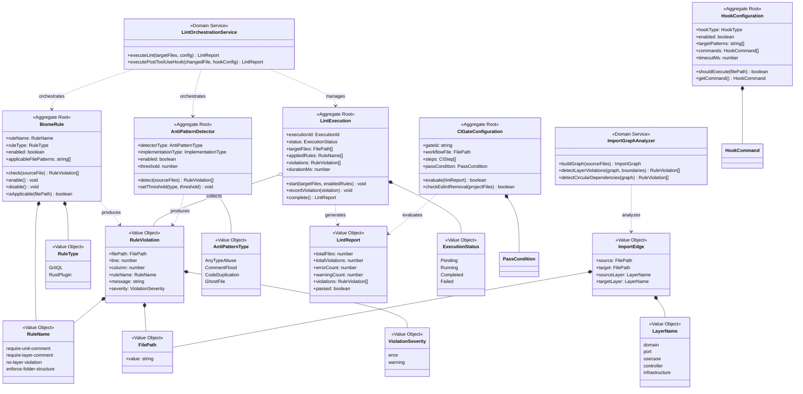

# ドメインモデル: biome-toolchain

> **Unit ID**: biome-toolchain
> **作成日**: 2026-03-10
> **Wave**: 1（基盤構築）
> **対応ストーリー**: US-036, US-037, US-038, US-039

---

## 1. 集約

biome-toolchainはリンター・AST解析というツールチェーンドメインであり、ステートレス性が高く設定駆動の特性を持つ。集約は小さく保ち、ルール間の結合を最小化する。

### 1.1 BiomeRule（Biomeルール集約）

4つのカスタムルール（require-unit-comment, require-layer-comment, no-layer-violation, enforce-folder-structure）を表す集約。各ルールは独立した検出ロジックを持つ。

#### 集約ルートの責務

- ルールの有効/無効管理
- 対象ファイルに対するルール検査の実行
- 違反（RuleViolation）の生成

#### メソッド

| メソッド | 説明 | 不変条件 |
|---------|------|---------|
| `check(sourceFile)` | 対象ファイルに対してルール検査を実行し、違反リストを返す | ルールが有効化されていること |
| `enable()` | ルールを有効化 | — |
| `disable()` | ルールを無効化 | — |
| `isApplicable(filePath)` | ルールが対象ファイルに適用可能か判定 | — |

### 1.2 LintExecution（リント実行集約）

1回のリント実行を表す集約。対象ファイル群に対して有効なルール群を適用し、違反を収集してレポートを生成する。

#### 集約ルートの責務

- リント実行のライフサイクル管理（開始→実行中→完了）
- 全対象ファイル×全有効ルールの検査完了保証
- 違反の集約とレポート生成
- 実行時間の計測

#### メソッド

| メソッド | 説明 | 不変条件 |
|---------|------|---------|
| `start(targetFiles, enabledRules)` | リント実行を開始 | 対象ファイルが1つ以上、有効ルールが1つ以上 |
| `recordViolation(violation)` | 違反を記録 | 実行中状態であること |
| `complete()` | 実行を完了し、LintReportを生成 | 全ファイル×全ルールの検査が完了していること |
| `getReport()` | LintReportを返す | 完了状態であること |

### 1.3 AntiPatternDetector（アンチパターン検出器集約）

AI生成コードのアンチパターン検出を担う集約。BiomeRuleとは異なるドメイン知識（AI生成コード特性）に基づく。

#### 集約ルートの責務

- アンチパターン種別ごとの検出ロジック管理
- 検出閾値の管理
- 検出結果の生成

#### 検出器種別と実装方式

| 種別 | 実装方式 | 説明 |
|------|---------|------|
| AnyTypeAbuse（any型乱用） | Biomeルール | noExplicitAnyの拡張。閾値ベースの検出 |
| CommentFlood（コメント洪水） | Biomeルール | AST解析によるコメント比率算出 |
| CodeDuplication（コード重複） | 外部スクリプト（TypeScript） | Biome AST結果を入力とする重複検出 |
| GhostFile（ゴーストファイル） | 外部スクリプト（TypeScript） | ファイル参照グラフ解析による未参照ファイル検出 |

#### メソッド

| メソッド | 説明 | 不変条件 |
|---------|------|---------|
| `detect(sourceFiles)` | 対象ファイル群に対してアンチパターン検出を実行 | — |
| `setThreshold(type, threshold)` | 検出閾値を設定 | 閾値が正の数値であること |

### 1.4 HookConfiguration（フック設定集約）

PostToolUse Hookの実行設定を管理する集約。

#### 集約ルートの責務

- フックの有効/無効管理
- 実行対象ファイルパターンの管理
- 実行コマンドとタイムアウト設定の管理

#### メソッド

| メソッド | 説明 | 不変条件 |
|---------|------|---------|
| `shouldExecute(filePath)` | 対象ファイルに対してフックを実行すべきか判定 | — |
| `getCommand()` | 実行コマンドを返す（biome check / biome format） | フックが有効であること |
| `isWithinTimeout(elapsedMs)` | 実行時間がタイムアウト内か判定 | — |

### 1.5 CIGateConfiguration（CIゲート設定集約）

CIパイプラインにおけるBiomeリント+フォーマットチェックの設定を管理する集約。

#### 集約ルートの責務

- CIゲートの合格/不合格判定ロジック管理
- ESLint残存チェックの設定管理
- HarnessError形式準拠の設定管理

#### メソッド

| メソッド | 説明 | 不変条件 |
|---------|------|---------|
| `evaluate(lintReport)` | リントレポートに基づくCIゲート判定 | — |
| `checkEslintRemoval(projectFiles)` | ESLint関連ファイル・依存の残存チェック | — |
| `formatError(violation)` | 違反をHarnessError形式にフォーマット | — |

---

## 2. エンティティ

### 2.1 BiomeRule（集約ルート兼エンティティ）

| 属性 | 型 | 説明 |
|------|-----|------|
| ruleName | RuleName | ルールの一意識別子 |
| ruleType | RuleType | 実装方式（GritQL / RustPlugin） |
| enabled | boolean | 有効/無効状態 |
| applicableFilePatterns | string[] | 適用対象ファイルパターン |

### 2.2 LintExecution（集約ルート兼エンティティ）

| 属性 | 型 | 説明 |
|------|-----|------|
| executionId | ExecutionId | 実行の一意識別子 |
| status | ExecutionStatus | 実行状態（Pending/Running/Completed/Failed） |
| targetFiles | FilePath[] | 対象ファイル群 |
| appliedRules | RuleName[] | 適用ルール群 |
| violations | RuleViolation[] | 検出された違反リスト |
| startedAt | Timestamp | 実行開始時刻 |
| completedAt | Timestamp | 実行完了時刻（nullable） |
| durationMs | number | 実行時間（ミリ秒） |

### 2.3 AntiPatternDetector（集約ルート兼エンティティ）

| 属性 | 型 | 説明 |
|------|-----|------|
| detectorType | AntiPatternType | 検出器種別 |
| implementationType | ImplementationType | 実装方式（BiomeRule / ExternalScript） |
| enabled | boolean | 有効/無効状態 |
| threshold | number | 検出閾値 |

### 2.4 HookConfiguration（集約ルート兼エンティティ）

| 属性 | 型 | 説明 |
|------|-----|------|
| hookType | HookType | フック種別（PostToolUse固定） |
| enabled | boolean | 有効/無効状態 |
| targetPatterns | string[] | 対象ファイルパターン |
| commands | HookCommand[] | 実行コマンドリスト（biome check, biome format） |
| timeoutMs | number | タイムアウト（ミリ秒） |

### 2.5 CIGateConfiguration（集約ルート兼エンティティ）

| 属性 | 型 | 説明 |
|------|-----|------|
| gateId | string | ゲート識別子 |
| workflowFile | FilePath | ワークフロー定義ファイル |
| steps | CIStep[] | 実行ステップ |
| passCondition | PassCondition | 合格条件 |

---

## 3. 値オブジェクト

### 3.1 RuleViolation

ルール実行結果として検出された違反。

| 属性 | 型 | 説明 |
|------|-----|------|
| filePath | FilePath | 違反が検出されたファイル |
| line | number | 行番号 |
| column | number | 列番号 |
| ruleName | RuleName | 検出したルール名 |
| message | string | 違反メッセージ |
| severity | ViolationSeverity | 重要度 |
| suggestion | string | 修正提案（nullable） |

**等価性**: filePath + line + column + ruleName の組み合わせで等価判定。

### 3.2 RuleName

ルール名を表す値オブジェクト。

| 値 | 説明 |
|---|------|
| require-unit-comment | @unitコメント必須 |
| require-layer-comment | @layerコメント必須 |
| no-layer-violation | レイヤー依存違反検出 |
| enforce-folder-structure | フォルダ構造検証 |

### 3.3 RuleType

ルールの実装方式を表す値オブジェクト。

| 値 | 対象ルール | 説明 |
|---|-----------|------|
| GritQL | require-unit-comment, require-layer-comment | 宣言的パターンマッチング |
| RustPlugin | no-layer-violation, enforce-folder-structure | Rust Plugin APIによる実装 |

### 3.4 FilePath

ファイルパスを表す値オブジェクト。

| 属性 | 型 | 説明 |
|------|-----|------|
| value | string | 正規化されたファイルパス |

**バリデーション**: パス正規化（相対パス→絶対パス変換）ロジックを持つ。

### 3.5 LayerName

アーキテクチャレイヤー名を表す値オブジェクト。

| 値 | 説明 |
|---|------|
| domain | ドメイン層 |
| port | ポート層 |
| usecase | ユースケース層 |
| controller | コントローラー層 |
| infrastructure | インフラ層 |

### 3.6 UnitName

Unit名を表す値オブジェクト。

| 属性 | 型 | 説明 |
|------|-----|------|
| value | string | Unit名文字列 |

### 3.7 ImportEdge

ファイル間のインポート依存関係を表す値オブジェクト。

| 属性 | 型 | 説明 |
|------|-----|------|
| source | FilePath | インポート元 |
| target | FilePath | インポート先 |
| sourceLayer | LayerName | インポート元のレイヤー |
| targetLayer | LayerName | インポート先のレイヤー |

### 3.8 ViolationSeverity

違反の重要度を表す値オブジェクト。

| 値 | 説明 |
|---|------|
| error | エラー（修正必須） |
| warning | 警告（推奨修正） |

### 3.9 AntiPatternType

アンチパターンの種別を表す値オブジェクト。

| 値 | 実装方式 | 説明 |
|---|---------|------|
| AnyTypeAbuse | Biomeルール | any型の乱用 |
| CommentFlood | Biomeルール | コメント洪水 |
| CodeDuplication | 外部スクリプト | コード重複 |
| GhostFile | 外部スクリプト | 未参照ファイル |

### 3.10 ImplementationType

検出器の実装方式を表す値オブジェクト。

| 値 | 説明 |
|---|------|
| BiomeRule | Biomeルールとして実装 |
| ExternalScript | Biome AST活用TypeScriptスクリプト |

### 3.11 ExecutionStatus

リント実行の状態を表す値オブジェクト。

| 値 | 説明 |
|---|------|
| Pending | 実行待ち |
| Running | 実行中 |
| Completed | 正常完了 |
| Failed | 異常終了 |

### 3.12 LintReport

リント実行結果のレポート。

| 属性 | 型 | 説明 |
|------|-----|------|
| executionId | ExecutionId | 対応する実行ID |
| totalFiles | number | 検査対象ファイル数 |
| totalViolations | number | 違反総数 |
| errorCount | number | エラー数 |
| warningCount | number | 警告数 |
| violations | RuleViolation[] | 違反リスト |
| durationMs | number | 実行時間 |
| passed | boolean | 合格判定（エラー0件） |

### 3.13 HookCommand

フック実行コマンドを表す値オブジェクト。

| 属性 | 型 | 説明 |
|------|-----|------|
| command | string | コマンド文字列（`biome check` / `biome format`） |
| args | string[] | コマンド引数 |

### 3.14 PassCondition

CIゲート合格条件を表す値オブジェクト。

| 属性 | 型 | 説明 |
|------|-----|------|
| maxErrors | number | 許容エラー数（通常0） |
| maxWarnings | number | 許容警告数 |
| requireEslintRemoval | boolean | ESLint完全除去が必須か |

### 3.15 CIStep

CIステップを表す値オブジェクト。

| 属性 | 型 | 説明 |
|------|-----|------|
| name | string | ステップ名 |
| command | string | 実行コマンド |
| continueOnError | boolean | エラー時に続行するか |

---

## 4. 不変条件

### 4.1 BiomeRule集約

| # | 不変条件 |
|---|---------|
| INV-1 | ルールが有効化されている場合、対象ファイルに対して必ず検査を実行する |
| INV-2 | ルール名は4つの定義済み値のいずれかである |
| INV-3 | GritQLルール（require-unit-comment, require-layer-comment）とRust Pluginルール（no-layer-violation, enforce-folder-structure）の実装方式は変更不可 |

### 4.2 LintExecution集約

| # | 不変条件 |
|---|---------|
| INV-4 | 実行完了時、全対象ファイルが全有効ルールで検査済みであること |
| INV-5 | 状態遷移はPending→Running→Completed/Failedの順序のみ（逆行不可） |
| INV-6 | 違反の記録は実行中（Running）状態でのみ可能 |

### 4.3 AntiPatternDetector集約

| # | 不変条件 |
|---|---------|
| INV-7 | 各検出器は独立して動作し、他の検出器の結果に依存しない |
| INV-8 | 検出閾値は正の数値であること |

### 4.4 HookConfiguration集約

| # | 不変条件 |
|---|---------|
| INV-9 | フック実行は冪等であること（同じファイルに対して複数回実行しても結果が同じ） |
| INV-10 | PostToolUse Hook実行時間は500ms以下（単一ファイル） |

### 4.5 CIGateConfiguration集約

| # | 不変条件 |
|---|---------|
| INV-11 | CIゲートはBiomeリント+フォーマットの両方が成功した場合のみ通過 |
| INV-12 | ESLint関連の設定・依存が完全に除去されていること |

---

## 5. 状態遷移

### 5.1 LintExecution 状態遷移表

| 現在の状態 | イベント | 次の状態 | 条件 |
|-----------|---------|---------|------|
| Pending | start | Running | 対象ファイル≧1, 有効ルール≧1 |
| Running | recordViolation | Running | — |
| Running | complete | Completed | 全ファイル×全ルール検査完了 |
| Running | fail | Failed | 致命的エラー発生 |

---

## 6. ドメインイベント

| イベント | 発生条件 | ペイロード | 消費者 |
|---------|---------|----------|--------|
| RuleViolationDetected | ルール実行で違反を検出 | RuleViolation | LintExecution集約 |
| LintExecutionCompleted | リント実行が完了 | LintReport | CIGateConfiguration, HookConfiguration |
| AntiPatternDetected | アンチパターンを検出 | AntiPatternType, FilePath, details | LintExecution集約 |

---

## 7. ドメインサービス

### 7.1 LintOrchestrationService

複数集約にまたがるリント実行のオーケストレーションを行うドメインサービス。

#### 責務

- BiomeRule群 + AntiPatternDetector群の実行調整
- LintExecution集約の生成とライフサイクル管理
- 結果の集約とLintReport生成

#### メソッド

| メソッド | 説明 |
|---------|------|
| `executeLint(targetFiles, config)` | 対象ファイル群に対してリント全体を実行 |
| `executePostToolUseHook(changedFile, hookConfig)` | PostToolUse Hook用の軽量リント実行 |

### 7.2 ImportGraphAnalyzer

importグラフ解析を行うドメインサービス。no-layer-violationルールが利用する。

#### 責務

- ソースファイル間のインポート依存関係グラフの構築
- TypeScript pathsの解決
- レイヤー境界違反の検出
- 循環依存の検出

#### メソッド

| メソッド | 説明 |
|---------|------|
| `buildGraph(sourceFiles)` | インポートグラフを構築 |
| `detectLayerViolations(graph, boundaries)` | レイヤー境界違反を検出 |
| `detectCircularDependencies(graph)` | 循環依存を検出 |

### 7.3 ParityTestService

v0 ESLintルールとBiomeルールの等価性を検証するドメインサービス。

#### 責務

- v0テストケースとBiomeルール実行結果の突き合わせ
- パリティ検証レポートの生成

---

## 8. ポートとアダプター

### 8.1 ポート

| ポート | 方向 | 責務 |
|-------|------|------|
| BiomeExecutor | 駆動される側 | Biome CLIの実行（biome check / biome format） |
| FileReader | 駆動される側 | ソースファイルの読み込み |
| BiomeConfigLoader | 駆動される側 | biome.json設定の読み込み |

### 8.2 アダプター

| アダプター | 実装対象ポート | 実装内容 |
|-----------|-------------|---------|
| BiomeCLIExecutor | BiomeExecutor | Biome CLIプロセスの起動・結果取得 |
| FileSystemReader | FileReader | ファイルシステムからのファイル読み込み |
| JsonBiomeConfigLoader | BiomeConfigLoader | biome.jsonの読み込み・パース |

---

## 9. Shared Kernelとの関係

| 共有概念 | 定義元 | 利用方法 |
|---------|-------|---------|
| @unit/@layerメタデータ仕様 | biome-toolchain（本Unit定義） | require-unit-comment/require-layer-commentが強制。全Unitが従う |
| レイヤー境界定義 | architecture-philosophy.md | no-layer-violationが参照。依存方向ルールをコードで表現 |
| フォルダ構造定義 | folder_management_rules.md | enforce-folder-structureが参照 |
| HarnessError | harness-dx Unit（統合契約 §4.1） | CI失敗時のエラー出力形式として準拠（利用側） |

---

## 10. クラス図

---

## 11. 用語集

| 用語 | 定義 |
|------|------|
| BiomeRule | Biomeプラグインとして実装されるカスタムリントルール |
| LintExecution | 対象ファイル群に対するリント実行の1単位 |
| AntiPatternDetector | AI生成コードのアンチパターンを検出する仕組み |
| RuleViolation | ルール検査で検出された違反 |
| ImportGraphAnalyzer | ソースファイル間のインポート依存関係を解析するサービス |
| LintOrchestrationService | 複数集約にまたがるリント実行を調整するサービス |
| ParityTestService | v0 ESLintルールとBiomeルールの等価性を検証するサービス |
| GritQL | Biomeの宣言的パターンマッチング言語 |
| RustPlugin | Biome Rust Plugin APIによるネイティブプラグイン |
