# ドメインモデル: config-foundation

> **Unit ID**: config-foundation
> **作成日**: 2026-03-10
> **Wave**: 1（基盤構築）
> **対応ストーリー**: US-027, US-028, US-029, US-030

---

## 1. 集約

### 1.1 HarnessConfig（集約ルート）

harness.config.jsonファイル全体を表す単一集約。設定ファイルの読み書きはファイル単位で行われるため、ファイル全体が整合性境界を形成する。

#### 集約ルートの責務

- 設定ファイル全体のスキーマバリデーション
- セクション間の整合性保証（例: orchestration.enabled=falseならworkflow設定は無視）
- 機能の有効/無効トグル操作（スキーマからの動的抽出に基づく）
- デフォルト値のマージとプリセット解決
- 環境変数オーバーライドの適用
- ファイルパス解決

#### メソッド（振る舞い）

| メソッド | 説明 | 不変条件 |
|---------|------|---------|
| `create(rawJson, schema)` | ファクトリ: JSON + スキーマからHarnessConfigを生成。バリデーション・デフォルト値マージ・プリセット解決・環境変数オーバーライド・パス解決を実行 | スキーマバリデーション通過が必須 |
| `enableFeature(featureName)` | 指定機能を有効化 | featureNameがスキーマ上の有効なトグル対象であること |
| `disableFeature(featureName)` | 指定機能を無効化 | featureNameがスキーマ上の有効なトグル対象であること |
| `getToggleableFeatures()` | スキーマから動的にトグル可能な機能名一覧を抽出 | — |
| `applyPreset(preset)` | プリセットに基づくデフォルト値の一括適用 | プリセットが有効な値であること |
| `resolveEnvironmentOverrides(envVars)` | 環境変数による設定値のオーバーライド | オーバーライド後もスキーマバリデーション通過 |
| `resolveFilePaths(basePath)` | 相対パスをbasePathからの絶対パスに解決 | 解決後のパスが有効であること |
| `getOrchestration()` | OrchestrationConfigを返す | — |
| `getSession()` | SessionConfigを返す | — |
| `getVersion()` | ConfigVersionを返す | — |

---

## 2. エンティティ

### 2.1 HarnessConfig（集約ルート兼エンティティ）

| 属性 | 型 | 説明 |
|------|-----|------|
| configFilePath | FilePath | 設定ファイルのパス（同一性の基準） |
| version | ConfigVersion | 設定ファイルのバージョン（v1 / v2） |
| project | ProjectConfig | プロジェクト設定（v1既存） |
| layers | LayerConfig | レイヤー設定（v1既存） |
| harnesses | HarnessesConfig | ハーネス設定（v1既存） |
| paths | PathsConfig | パス設定（v1既存） |
| reporting | ReportingConfig | レポート設定（v1既存） |
| orchestration | OrchestrationConfig | オーケストレーション設定（v2新規） |
| session | SessionConfig | セッション設定（v2新規） |
| quickMode | QuickModeConfig | Quick Mode設定（v2新規） |
| featureToggles | FeatureToggleMap | 機能トグル状態マップ |

---

## 3. 値オブジェクト

### 3.1 ConfigVersion

設定ファイルのバージョンを表す列挙型的な値。

| 値 | 説明 |
|---|------|
| V1 | versionフィールド未設定（レガシー） |
| V2 | `"version": 2` が設定されている |

**判定ルール**: `version`フィールドが存在しない → V1、`version: 2` → V2

### 3.2 OrchestrationConfig

orchestrationセクション全体を不変オブジェクトとして表現。

| 属性 | 型 | 説明 |
|------|-----|------|
| enabled | boolean | セクション有効/無効 |
| mode | Mode | 実行モード |
| parallelization | ParallelizationConfig | 並列実行設定 |
| modelProfile | ModelProfileConfig | モデルプロファイル設定 |
| contextStrategy | ContextStrategyConfig | コンテキスト戦略設定 |
| commitStrategy | CommitStrategyConfig | コミット戦略設定 |
| workflow | WorkflowConfig | ワークフロー設定 |

### 3.3 SessionConfig

sessionセクション全体を不変オブジェクトとして表現。

| 属性 | 型 | 説明 |
|------|-----|------|
| enabled | boolean | セクション有効/無効 |
| stateFile | FilePath | セッション状態ファイルパス（デフォルト: `.harness/session-state.json`） |
| roadmapFile | FilePath | ロードマップファイルパス |

### 3.4 QuickModeConfig

Quick Modeセクションを不変オブジェクトとして表現。

| 属性 | 型 | 説明 |
|------|-----|------|
| enabled | boolean | セクション有効/無効 |
| targetConditions | string[] | 対象条件 |
| excludeConditions | string[] | 除外条件 |
| validators | string[] | 使用バリデータ |

### 3.5 ParallelizationConfig

並列実行設定。v1では最小限の構造。

| 属性 | 型 | 説明 |
|------|-----|------|
| enabled | boolean | 並列実行の有効/無効 |

### 3.6 ModelProfileConfig

モデルプロファイル設定。v1では最小限の構造。

| 属性 | 型 | 説明 |
|------|-----|------|
| enabled | boolean | プロファイル機能の有効/無効 |

### 3.7 ContextStrategyConfig

コンテキスト戦略設定。v1では最小限の構造。

| 属性 | 型 | 説明 |
|------|-----|------|
| enabled | boolean | 戦略機能の有効/無効 |

### 3.8 CommitStrategyConfig

コミット戦略設定。v1では最小限の構造。

| 属性 | 型 | 説明 |
|------|-----|------|
| enabled | boolean | 戦略機能の有効/無効 |

### 3.9 WorkflowConfig

ワークフロー設定。v1では最小限の構造。

| 属性 | 型 | 説明 |
|------|-----|------|
| enabled | boolean | ワークフロー機能の有効/無効 |

### 3.10 Mode

orchestration.modeの値を表す値オブジェクト。

| 値 | 説明 |
|---|------|
| single | 単一executor実行（v1デフォルト） |
| parallel | Wave並列実行（Phase 2以降） |

### 3.11 FilePath

パス文字列のバリデーション付きラッパー。

| 属性 | 型 | 説明 |
|------|-----|------|
| value | string | パス文字列 |

**バリデーションルール**:
- 空文字列は不可
- プロジェクトルート外のパスは不可（プロジェクトローカル原則 K13/Go/No-Go Gate #6）
- `~/` や `$HOME` 等のグローバルパスは不可

### 3.12 Preset

プリセット種別を表す値オブジェクト。

| 値 | 説明 |
|---|------|
| minimal | 最小構成（GSD由来機能すべてOFF） |
| standard | 標準構成（推奨設定） |
| strict | 厳格構成（全機能ON） |

### 3.13 FeatureToggleMap

機能名→有効/無効のマッピングを表す値オブジェクト。

| 属性 | 型 | 説明 |
|------|-----|------|
| toggles | Map<string, boolean> | 機能名から有効/無効状態へのマップ |

**特記**: 機能名はスキーマから動的に抽出される（Q2: B案）。ハードコードされた列挙型ではなく、スキーマ定義に`enabled`フィールドを持つセクション名がトグル対象となる。

### 3.14 EnvironmentOverride

環境変数オーバーライドを表す値オブジェクト。

| 属性 | 型 | 説明 |
|------|-----|------|
| variableName | string | 環境変数名 |
| configPath | string | 対象となる設定パス（ドット記法、例: `orchestration.mode`） |
| value | string | オーバーライド値 |

---

## 4. 不変条件

### 4.1 HarnessConfig集約の不変条件

| # | 不変条件 | 検証タイミング |
|---|---------|-------------|
| INV-1 | JSONスキーマに適合すること | create時、変更操作後 |
| INV-2 | GSD由来設定のデフォルト値が`enabled: false`であること | create時（デフォルトOFF原則） |
| INV-3 | v2設定には`version: 2`フィールドが存在すること | create時 |
| INV-4 | enableFeature/disableFeatureの対象はスキーマから動的抽出された有効な機能名であること | enableFeature/disableFeature時 |
| INV-5 | v2はv1のスーパーセットであること（v1の全フィールドを維持） | create時 |
| INV-6 | 全FilePathがプロジェクトローカルであること（グローバルパス不可） | create時、resolveFilePaths時 |
| INV-7 | 環境変数オーバーライド適用後もスキーマバリデーションに適合すること | resolveEnvironmentOverrides時 |
| INV-8 | orchestration.enabled=falseの場合、orchestration内サブ設定の値は無視される（ただし保持はされる） | 読み取り時 |

---

## 5. ドメインサービス

### 5.1 ConfigMigrationService

v1設定からv2設定へのマイグレーションを実行するドメインサービス。

#### 責務

- v1設定の読み込みとバージョン判定
- v2セクション（orchestration, session, quick_mode）の追加
- `version: 2`フィールドの追加
- GSD由来設定のデフォルト値（enabled: false）の設定
- マイグレーション前のバックアップ作成

#### メソッド

| メソッド | 入力 | 出力 | 説明 |
|---------|------|------|------|
| `migrate(v1Config)` | v1のHarnessConfig | MigrationResult | v1→v2マイグレーション実行 |
| `detectVersion(rawJson)` | 生のJSON | ConfigVersion | バージョン判定（versionフィールド有無） |

#### 利用ポート

- ConfigRepository（設定ファイル読み書き）
- BackupCreator（バックアップ作成）

### 5.2 ConfigValidationService

JSONスキーマに基づくバリデーションを実行するドメインサービス。HarnessConfigファクトリメソッド内から呼び出される。

#### 責務

- JSONスキーマバリデーション
- カスタムバリデーションルールの適用（スキーマでは表現しきれない制約）

#### メソッド

| メソッド | 入力 | 出力 | 説明 |
|---------|------|------|------|
| `validate(rawJson, schema)` | 生のJSON + スキーマ | ValidationResult | スキーマバリデーション実行 |
| `extractToggleableFeatures(schema)` | スキーマ | string[] | スキーマからトグル可能な機能名を動的抽出 |

#### 利用ポート

- ConfigSchemaValidator（JSONスキーマバリデーション実装）

---

## 6. ドメインイベント

CLIツールの特性上、明示的なドメインイベント発行メカニズムの必要性は低いが、将来のFUSE Hooks Engine連携を見据えて以下を定義する。

| イベント | トリガー | ペイロード | 用途 |
|---------|---------|----------|------|
| ConfigMigrated | ConfigMigrationService.migrate完了時 | v1パス, v2パス, バックアップパス | ログ記録、通知 |
| FeatureToggled | enableFeature/disableFeature実行時 | 機能名, 新しい状態(enabled/disabled) | 他Unit通知（将来） |

---

## 7. ポートとアダプター

### 7.1 ポート（インターフェース）

| ポート | 方向 | 責務 |
|-------|------|------|
| ConfigRepository | 駆動される側（Secondary） | harness.config.jsonの読み込み・書き出し |
| ConfigSchemaValidator | 駆動される側（Secondary） | JSONスキーマに基づくバリデーション実行 |
| BackupCreator | 駆動される側（Secondary） | マイグレーション前のファイルバックアップ作成 |
| EnvironmentVariableReader | 駆動される側（Secondary） | 環境変数の読み取り |

### 7.2 アダプター（実装）

| アダプター | 実装対象ポート | 実装内容 |
|-----------|-------------|---------|
| FileSystemConfigRepository | ConfigRepository | harness.config.jsonのファイルI/O |
| JsonSchemaValidator | ConfigSchemaValidator | JSONスキーマライブラリによるバリデーション |
| FileSystemBackupCreator | BackupCreator | ファイルコピーによるバックアップ |
| ProcessEnvironmentReader | EnvironmentVariableReader | process.envからの環境変数読み取り |

---

## 8. Shared Kernelとの関係

| 共有概念 | 定義元 | 利用方法 |
|---------|-------|---------|
| HarnessConfigV2型定義 | 統合契約 §4.2 | config-foundationが提供し、全Unitが参照するShared Kernel |
| HarnessError型 | 統合契約 §4.1（harness-dx提供） | バリデーションエラー出力時にこの型に準拠 |

---

## 9. クラス図

```mermaid
classDiagram
    class HarnessConfig {
        <<Aggregate Root>>
        +configFilePath: FilePath
        +version: ConfigVersion
        +project: ProjectConfig
        +layers: LayerConfig
        +harnesses: HarnessesConfig
        +paths: PathsConfig
        +reporting: ReportingConfig
        +orchestration: OrchestrationConfig
        +session: SessionConfig
        +quickMode: QuickModeConfig
        +featureToggles: FeatureToggleMap
        +create(rawJson, schema)$ HarnessConfig
        +enableFeature(featureName) void
        +disableFeature(featureName) void
        +getToggleableFeatures() string[]
        +applyPreset(preset) void
        +resolveEnvironmentOverrides(envVars) void
        +resolveFilePaths(basePath) void
    }

    class ConfigVersion {
        <<Value Object>>
        V1
        V2
    }

    class OrchestrationConfig {
        <<Value Object>>
        +enabled: boolean
        +mode: Mode
        +parallelization: ParallelizationConfig
        +modelProfile: ModelProfileConfig
        +contextStrategy: ContextStrategyConfig
        +commitStrategy: CommitStrategyConfig
        +workflow: WorkflowConfig
    }

    class SessionConfig {
        <<Value Object>>
        +enabled: boolean
        +stateFile: FilePath
        +roadmapFile: FilePath
    }

    class QuickModeConfig {
        <<Value Object>>
        +enabled: boolean
        +targetConditions: string[]
        +excludeConditions: string[]
        +validators: string[]
    }

    class Mode {
        <<Value Object>>
        single
        parallel
    }

    class Preset {
        <<Value Object>>
        minimal
        standard
        strict
    }

    class FilePath {
        <<Value Object>>
        +value: string
        +isProjectLocal() boolean
    }

    class FeatureToggleMap {
        <<Value Object>>
        +toggles: Map~string, boolean~
        +isEnabled(featureName) boolean
        +toggle(featureName, enabled) FeatureToggleMap
    }

    class EnvironmentOverride {
        <<Value Object>>
        +variableName: string
        +configPath: string
        +value: string
    }

    class ParallelizationConfig {
        <<Value Object>>
        +enabled: boolean
    }

    class ModelProfileConfig {
        <<Value Object>>
        +enabled: boolean
    }

    class ContextStrategyConfig {
        <<Value Object>>
        +enabled: boolean
    }

    class CommitStrategyConfig {
        <<Value Object>>
        +enabled: boolean
    }

    class WorkflowConfig {
        <<Value Object>>
        +enabled: boolean
    }

    class MigrationResult {
        <<Value Object>>
        +success: boolean
        +backupPath: FilePath
        +errors: string[]
    }

    class ConfigMigrationService {
        <<Domain Service>>
        +migrate(v1Config) MigrationResult
        +detectVersion(rawJson) ConfigVersion
    }

    class ConfigValidationService {
        <<Domain Service>>
        +validate(rawJson, schema) ValidationResult
        +extractToggleableFeatures(schema) string[]
    }

    class ConfigRepository {
        <<Port>>
        +load(filePath) rawJson
        +save(filePath, config) void
    }

    class ConfigSchemaValidator {
        <<Port>>
        +validate(json, schema) ValidationResult
    }

    class BackupCreator {
        <<Port>>
        +createBackup(filePath) FilePath
    }

    class EnvironmentVariableReader {
        <<Port>>
        +read(variableName) string
        +readAll() Map~string, string~
    }

    HarnessConfig *-- ConfigVersion
    HarnessConfig *-- OrchestrationConfig
    HarnessConfig *-- SessionConfig
    HarnessConfig *-- QuickModeConfig
    HarnessConfig *-- FeatureToggleMap
    HarnessConfig *-- FilePath
    OrchestrationConfig *-- Mode
    OrchestrationConfig *-- ParallelizationConfig
    OrchestrationConfig *-- ModelProfileConfig
    OrchestrationConfig *-- ContextStrategyConfig
    OrchestrationConfig *-- CommitStrategyConfig
    OrchestrationConfig *-- WorkflowConfig
    SessionConfig *-- FilePath
    ConfigMigrationService ..> HarnessConfig : creates
    ConfigMigrationService ..> ConfigRepository : uses
    ConfigMigrationService ..> BackupCreator : uses
    ConfigMigrationService ..> MigrationResult : returns
    ConfigValidationService ..> ConfigSchemaValidator : uses
    HarnessConfig ..> ConfigValidationService : uses in factory
    HarnessConfig ..> EnvironmentOverride : applies
    HarnessConfig ..> Preset : applies
```

---

## 10. 用語集

| 用語 | 定義 |
|------|------|
| HarnessConfig | harness.config.jsonファイル全体を表す集約ルート |
| ConfigVersion | 設定ファイルのバージョン（V1: レガシー、V2: 新スキーマ） |
| FeatureToggleMap | スキーマから動的抽出された機能名と有効/無効状態のマッピング |
| Preset | 設定プリセット（minimal/standard/strict） |
| ConfigMigrationService | v1→v2マイグレーションを実行するドメインサービス |
| EnvironmentOverride | 環境変数による設定値オーバーライド |
