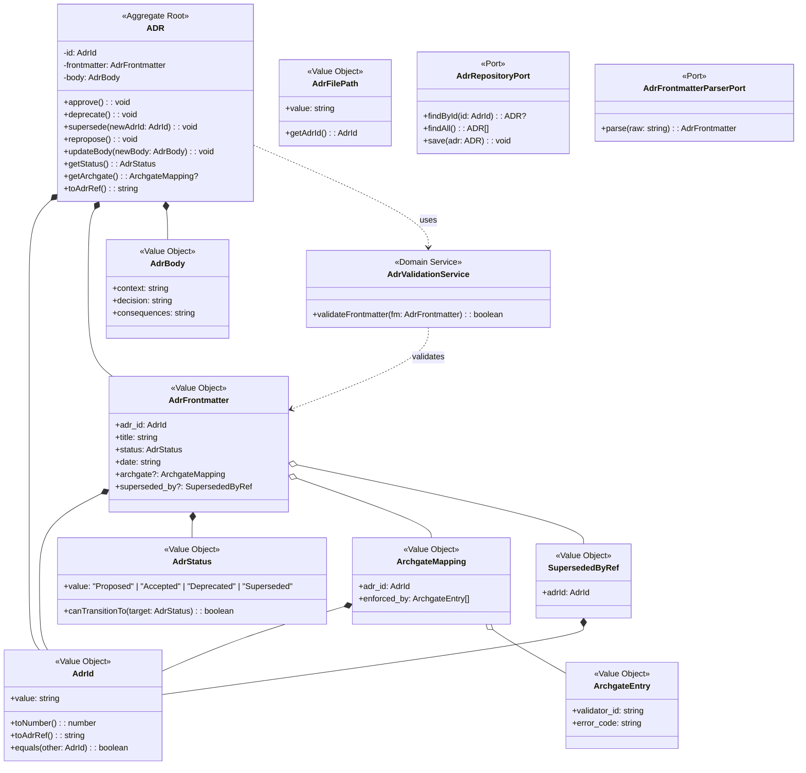

# ドメインモデル: adr-foundation

@story-id H05-01
@story-id H05-02
@story-id H05-03
> **Unit ID**: adr-foundation
> **作成日**: 2026-03-13
> **Wave**: 1（基盤構築）
> **対応ストーリー**: H05-01, H05-02, H05-03
> **横断契約参照**: cross_cutting_decisions.md §3（ErrorCode形式）

---

## 1. Ownership / Import-Export

### このUnitが所有する概念

| 概念 | 分類 | 説明 |
|------|------|------|
| ADR | 集約ルート | Architecture Decision Recordのライフサイクル管理 |
| AdrId | 値オブジェクト | ADR識別子（NNN形式） |
| AdrStatus | 値オブジェクト | Proposed/Accepted/Deprecated/Superseded |
| AdrFrontmatter | 値オブジェクト | YAMLフロントマター（archgateフィールド含む） |
| AdrBody | 値オブジェクト | ADR本文構造 |
| ArchgateMapping | 値オブジェクト | ADR→HarnessError codeマッピング |
| SupersededByRef | 値オブジェクト | 後継ADR参照 |
| AdrFilePath | 値オブジェクト | ADRファイルパス |
| AdrValidationService | ドメインサービス | フロントマター構造検証 |

### 他Unitから受け取るShared Kernel

| 型名 | 所有Unit | 自Unitでの扱い | 変更可否 |
|------|---------|---------------|---------|
| HarnessError | harness-error | adr_refフィールドの参照先として自UnitのADRを提供 | 読取専用 |

### 他Unitへ公開する契約

| 契約 | 消費Unit | 内容 |
|------|---------|------|
| ADR Frontmatter Schema | harness-error, ci-governance, validator-system | ADRフロントマターのYAML構造 |
| adr_ref表記規約 | 全Unit | `ADR-{nnn}`形式での参照 |
| ArchgateMapping | validator-system | ADR→HarnessError codeマッピング（逆引きregistry自動生成可） |

### Shared Kernel利用表

| 型名 | 所有Unit | 自Unitでの扱い | 変更可否 |
|------|---------|---------------|---------|
| HarnessError | harness-error | adr_ref参照先のADR実在性を保証する立場 | 読取専用 |

---

## 2. Aggregate Boundary

### 結論: 単一集約（ADR）

ADRは独立したライフサイクルを持ち、フロントマター+本文で構成される整合性境界。

### なぜ集約にするのか

- **独立ライフサイクル**: ADRはProposed→Accepted→Deprecated/Supersededという明確な状態遷移を持つ
- **整合性境界**: フロントマターのstatus変更時にsuperseded_by必須化などの不変条件がある
- **識別性**: AdrIdで一意に識別される

### 集約に入れない概念

| 概念 | 理由 |
|------|------|
| archgate-registry（生成物） | ADRフロントマターからの自動生成物。独立して管理する必要なし |

---

## 3. Model Classification

### 集約

| 集約ルート | 説明 |
|-----------|------|
| **ADR** | Architecture Decision Record。AdrIdで識別。フロントマター+本文+archgateで構成 |

### 値オブジェクト

| 値オブジェクト | 不変 | 値等価性 | 説明 |
|-------------|------|---------|------|
| **AdrId** | ✅ | ✅ | `NNN`形式（例: 001, 011）。v1は001から開始 |
| **AdrStatus** | ✅ | ✅ | `Proposed \| Accepted \| Deprecated \| Superseded` |
| **AdrFrontmatter** | ✅ | ✅ | `{ adr_id, title, status, date, archgate?, superseded_by? }` |
| **AdrBody** | ✅ | ✅ | ADR本文。Context/Decision/Consequences構造 |
| **ArchgateMapping** | ✅ | ✅ | `{ adr_id, enforced_by: [{ validator_id, error_code }] }`。ADRフロントマターに埋め込み |
| **SupersededByRef** | ✅ | ✅ | 後継ADRへの参照（AdrId） |
| **AdrFilePath** | ✅ | ✅ | `docs/ADR/{nnn}-{slug}.md`形式のファイルパス |

### ドメインサービス

| サービス | 責務 | 理由 |
|---------|------|------|
| **AdrValidationService** | フロントマターの構造検証（必須フィールド存在、status有効値、Superseded時のsuperseded_by必須） | 集約の不変条件検証をサポート。集約メソッドから呼び出される |

### ポートインターフェース

| ポート | 方向 | 理由 |
|--------|------|------|
| **AdrRepositoryPort** | 外部→ドメイン | ADRファイルの永続化（Markdownファイル読み書き） |
| **AdrFrontmatterParserPort** | 外部→ドメイン | YAMLフロントマターの解析 |

---

## 4. Invariants

### ADR集約の不変条件

| # | 不変条件 | 検証タイミング |
|---|---------|-------------|
| INV-1 | AdrIdはUnit内で一意である | ADR生成時 |
| INV-2 | AdrStatusは4つの有効値のいずれかである | 状態遷移時 |
| INV-3 | Superseded状態のADRにはsuperseded_byが必須 | supersede()実行時 |
| INV-4 | ステータス遷移は定義された遷移表に従う | 状態遷移メソッド実行時 |
| INV-5 | archgateのerror_codeは`L{n}-{nnn}`形式に準拠する（横断契約§3） | AdrFrontmatter生成時 |
| INV-6 | adr_ref表記は`ADR-{nnn}`形式に統一される | 外部参照時 |

### Shared Kernelに対する前提条件

| 前提 | 内容 |
|------|------|
| ErrorCode形式 | archgateのerror_codeは`L{n}-{nnn}`形式（横断契約§3） |
| adr_ref安定性 | ci-governanceとharness-errorが参照するため、フロントマタースキーマ変更は波及大 |

---

## 5. Port Boundary

| 操作 | Port越し？ | 理由 |
|------|-----------|------|
| ステータス遷移ロジック | ❌ ドメイン内 | 遷移表に基づく純粋なルール |
| フロントマター不変条件検証 | ❌ ドメイン内 | 値の整合性チェック |
| archgate ErrorCode形式検証 | ❌ ドメイン内 | 正規表現検証 |
| ADRファイル読み書き | ✅ Port越し | Markdownファイル I/O |
| YAMLフロントマター解析 | ✅ Port越し | YAMLパーサー依存 |

---

## 6. Archive Carry-over Exclusions

| 旧概念 | 旧出典 | 今回採用しない理由 | 置換先 |
|--------|--------|----------------|--------|
| harness-dx参照 | v0 adr-documentation | v1ではharness-error Unitに統合 | harness-error Unit |
| ADR番号v0体系 | v0（001〜） | v1は別プロダクト。001から再開始 | v1 ADR-001〜 |

---

## 7. State Transitions

### ADRステータス遷移表

```
    ┌──────────┐
    │ Proposed │
    └────┬─────┘
         │ approve()
         v
    ┌──────────┐
    │ Accepted │
    └────┬─────┘
         │
    ┌────┴─────────────┐
    │                  │
    │ deprecate()      │ supersede(newAdrId)
    v                  v
┌────────────┐  ┌─────────────┐
│ Deprecated │  │ Superseded  │
└────┬───────┘  └─────────────┘
     │
     │ repropose()
     v
┌──────────┐
│ Proposed │
└──────────┘
```

| 現在の状態 | イベント | 次の状態 | 制約 |
|-----------|---------|---------|------|
| Proposed | approve() | Accepted | — |
| Proposed | deprecate() | Deprecated | — |
| Accepted | deprecate() | Deprecated | — |
| Accepted | supersede(newAdrId) | Superseded | superseded_by必須 |
| Deprecated | repropose() | Proposed | 例外遷移（再検討時のみ） |

---

## 8. Domain Events

Wave 1ではドメインイベント基盤は構築しない。

将来的に以下のイベントが検討される：
- `AdrApproved`: ADR承認時（ci-governance連携用）
- `AdrSuperseded`: ADR置換時（adr_ref更新通知用）

---

## 9. Class Diagram



---

## 10. Open Questions（論理設計へ持ち越し）

| # | 質問 | 影響範囲 |
|---|------|---------|
| OQ-1 | archgate-registryの自動生成タイミング（ADR保存時 vs CI時） | Infrastructure層設計 |
| OQ-2 | 初期11件ADRのテンプレート構造をどこまでドメインで制約するか | AdrBody VO設計 |
