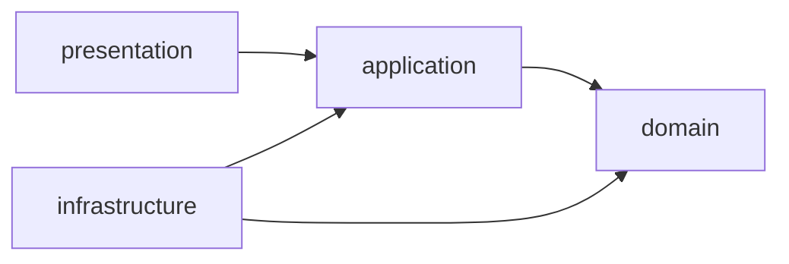

# 論理設計: adr-foundation

@story-id H05-01
@story-id H05-02
@story-id H05-03

> **Unit ID**: adr-foundation
> **作成日**: 2026-03-13
> **対応ストーリー**: H05-01, H05-02, H05-03
> **モード**: Unit横断設計（Phase 2成果物）
> **前提ドキュメント**: `domain_model.md`（同ディレクトリ）, `units/adr_foundation_unit.md`, `units/integration_contract.md`, `inception/adr-foundation/logical_design_plan.md`

---

## 1. アーキテクチャ概要

### 1.1 層構成と責務

| 層 | 主要責務 | 依存先 | 本Unitで扱う主要要素 |
|----|----------|--------|----------------------|
| domain | ADR集約のライフサイクル、不変条件、値オブジェクト、archgate整合性 | なし | `ADR`, `AdrId`, `AdrStatus`, `AdrFrontmatter`, `AdrBody`, `ArchgateMapping`, `AdrValidationService`, `domain/ports/*` |
| application | ADR取得・一覧・検索・初期投入・検証・状態変更の調整 | domain | `GetAdrByRefUseCase`, `ListAdrsUseCase`, `SeedInitialAdrsUseCase`, `ValidateAllAdrsUseCase` など |
| infrastructure | `docs/ADR/*.md` のI/O、YAML frontmatter解析、Markdown本文変換、初期11件定義の提供 | application, domain | `FileSystemAdrRepository`, `GrayMatterAdrFrontmatterParser`, `AdrMarkdownDocumentParser` |
| presentation | 内部運用用CLIの引数解釈、UseCase呼び出し、終了コードと表示整形 | application, domain | `adr-list`, `adr-show`, `adr-search-archgate`, `adr-validate`, `adr-change-status` 等 |

- レイヤー語彙は横断決定事項に従い `domain / application / infrastructure / presentation` のみを用いる
- ポートはすべて `scripts/harness/adr-foundation/domain/ports/` に配置する
- `ADR-{NNN}` は外部参照表記、`NNN` は内部識別子、`docs/ADR/{NNN}-{slug}.md` はInfrastructureが扱う永続化表現として分離する
- `template.md` は参照テンプレートであり、ADR一覧・検索・ID採番の対象外とする

### 1.2 依存方向



```text
domain ← application ← infrastructure
domain ← application ← presentation
```

- Domain層は外部ライブラリ、ファイルシステム、CLI引数形式に依存しない
- Application層はポート越しに永続化・変換を依頼し、MarkdownやYAMLの詳細を知らない
- Infrastructure層はDomainのポートを実装するが、Presentationには依存しない
- Presentation層はDomain集約を直接操作せず、必ずUseCase経由で振る舞いを起動する

### 1.3 ディレクトリ構成（全ファイル一覧）

#### 本体コード

```text
scripts/harness/adr-foundation/
├── domain/
│   ├── aggregates/
│   │   └── adr.ts
│   ├── value-objects/
│   │   ├── adr-id.ts
│   │   ├── adr-status.ts
│   │   ├── adr-frontmatter.ts
│   │   ├── adr-body.ts
│   │   ├── archgate-entry.ts
│   │   ├── archgate-mapping.ts
│   │   ├── superseded-by-ref.ts
│   │   └── adr-file-path.ts
│   ├── services/
│   │   └── adr-validation-service.ts
│   ├── ports/
│   │   ├── adr-repository-port.ts
│   │   ├── adr-frontmatter-parser-port.ts
│   │   └── adr-document-parser-port.ts
│   └── index.ts
├── application/
│   ├── dto/
│   │   ├── adr-detail-dto.ts
│   │   ├── adr-list-item-dto.ts
│   │   ├── adr-list-summary-dto.ts
│   │   ├── adr-template-dto.ts
│   │   ├── adr-validation-result-dto.ts
│   │   ├── archgate-search-result-dto.ts
│   │   ├── change-adr-status-command.ts
│   │   └── seed-adr-definition.ts
│   ├── mappers/
│   │   ├── adr-to-detail-dto-mapper.ts
│   │   ├── adr-to-list-item-dto-mapper.ts
│   │   └── adr-validation-to-harness-error-mapper.ts
│   ├── use-cases/
│   │   ├── get-adr-by-ref-use-case.ts
│   │   ├── list-adrs-use-case.ts
│   │   ├── create-adr-template-use-case.ts
│   │   ├── seed-initial-adrs-use-case.ts
│   │   ├── change-adr-status-use-case.ts
│   │   ├── validate-adr-frontmatter-use-case.ts
│   │   ├── validate-all-adrs-use-case.ts
│   │   └── search-archgate-mappings-use-case.ts
│   └── index.ts
├── infrastructure/
│   ├── repositories/
│   │   └── file-system-adr-repository.ts
│   ├── parsers/
│   │   ├── gray-matter-adr-frontmatter-parser.ts
│   │   └── adr-markdown-document-parser.ts
│   ├── serializers/
│   │   └── adr-markdown-serializer.ts
│   ├── seeds/
│   │   └── initial-adr-definitions.ts
│   └── index.ts
├── presentation/
│   ├── cli/
│   │   ├── adr-create-template.ts
│   │   ├── adr-seed-initial.ts
│   │   ├── adr-list.ts
│   │   ├── adr-show.ts
│   │   ├── adr-search-archgate.ts
│   │   ├── adr-validate.ts
│   │   └── adr-change-status.ts
│   └── index.ts
└── index.ts
```

#### テストコード

```text
scripts/harness/__tests__/adr-foundation/
├── domain/
│   ├── adr.test.ts
│   ├── adr-id.test.ts
│   ├── adr-status.test.ts
│   ├── adr-frontmatter.test.ts
│   ├── adr-body.test.ts
│   ├── archgate-mapping.test.ts
│   └── adr-validation-service.test.ts
├── application/
│   ├── get-adr-by-ref-use-case.test.ts
│   ├── list-adrs-use-case.test.ts
│   ├── create-adr-template-use-case.test.ts
│   ├── seed-initial-adrs-use-case.test.ts
│   ├── change-adr-status-use-case.test.ts
│   ├── validate-adr-frontmatter-use-case.test.ts
│   ├── validate-all-adrs-use-case.test.ts
│   └── search-archgate-mappings-use-case.test.ts
├── infrastructure/
│   ├── file-system-adr-repository.test.ts
│   ├── gray-matter-adr-frontmatter-parser.test.ts
│   ├── adr-markdown-document-parser.test.ts
│   └── adr-markdown-serializer.test.ts
├── presentation/
│   ├── adr-list.test.ts
│   ├── adr-show.test.ts
│   ├── adr-search-archgate.test.ts
│   ├── adr-validate.test.ts
│   └── adr-change-status.test.ts
└── fixtures/
    └── docs/ADR/
        ├── template.md
        ├── 001-package-separation.md
        ├── 002-biome-migration.md
        └── invalid-superseded.md
```

#### 生成・管理対象ドキュメント

```text
docs/ADR/
├── template.md
├── 001-package-separation.md
├── 002-biome-migration.md
├── 003-quality-harness-owns-k1-k13.md
├── 004-fuse-hooks-engine-out-of-scope.md
├── 005-harness-error-fix-example-required.md
├── 006-quick-mode-eligibility.md
├── 007-config-file-separation.md
├── 008-nyquist-truths-artifacts-integration.md
├── 009-artifact-driven-state-derivation.md
├── 010-validator-stack-detection.md
└── 011-l0-to-4layer-temporary-path.md
```

- `docs/ADR/` 配下の11ファイルはH05-02の初期投入成果物
- `scripts/harness/adr-foundation/infrastructure/seeds/initial-adr-definitions.ts` が11件の初期定義の正規入力を持ち、Repositoryはその定義をMarkdownへ変換して保存する
- `presentation/cli/*` はPhase 1では内部運用用エントリポイントとして実装し、統合契約上の公開CLIコマンドには含めない

---

## 2. Domain層設計

### 2.1 ADR集約の不変条件

| ID | 不変条件 | 適用対象 |
|----|----------|----------|
| INV-1 | `AdrId` は `NNN` の3桁数字で一意 | 生成、採番、再構築 |
| INV-2 | `AdrStatus` は `Proposed / Accepted / Deprecated / Superseded` のみ | Frontmatter生成、状態遷移 |
| INV-3 | `Superseded` の場合は `superseded_by` が必須 | `supersede()`、再構築 |
| INV-4 | 許可された状態遷移のみ実行できる | `approve()`, `deprecate()`, `supersede()`, `repropose()` |
| INV-5 | `archgate.enforced_by[*].error_code` は `L{n}-{nnn}` 形式 | Frontmatter生成、再構築 |
| INV-6 | 外部公開参照は必ず `ADR-{NNN}` 形式 | `toAdrRef()`, DTO変換 |
| INV-7 | `archgate.enforced_by` の `(validator_id, error_code)` 組は重複不可 | Frontmatter生成 |
| INV-8 | 本文は `Context / Decision / Consequences` を必須、`Alternatives` を任意とする | Body生成、Markdown変換 |

### 2.2 集約ルート: `ADR`

**責務**: ADR 1件の識別、フロントマター整合性、本文保持、状態遷移を一貫して管理する唯一の集約ルート。

#### 属性一覧

| 属性 | 型 | 説明 | 必須 |
|------|----|------|------|
| `id` | `AdrId` | ADR内部識別子。`001` のような3桁文字列 | Yes |
| `frontmatter` | `AdrFrontmatter` | YAML frontmatterの正規表現 | Yes |
| `body` | `AdrBody` | ADR本文の正規表現 | Yes |

#### メソッド一覧

##### `static create(frontmatter: AdrFrontmatter, body: AdrBody, validationService: AdrValidationService): ADR`

- **入力**: `frontmatter`, `body`, `validationService`
- **出力**: `ADR`
- **処理フロー**:
  1. `validationService.validateFrontmatter(frontmatter)` を実行する
  2. `validationService.validateBody(body)` を実行する
  3. `frontmatter.adrId` と `frontmatter.status` の整合性を確認する
  4. `ADR` を生成して返す
- **例外**:
  - `AdrValidationError`
  - `InvalidAdrStatusError`
  - `InvalidArchgateErrorCodeError`
- **関連不変条件**: INV-1, INV-2, INV-3, INV-5, INV-7, INV-8

##### `static reconstitute(frontmatter: AdrFrontmatter, body: AdrBody, validationService: AdrValidationService): ADR`

- **用途**: Repositoryから読み込んだ既存Markdownを集約へ復元する
- **入力/出力**: `create()` と同一
- **処理フロー**:
  1. `create()` と同等の検証を行う
  2. 永続化済みADRとして再構築する
- **例外**:
  - `AdrValidationError`
  - `MalformedAdrDocumentError`
- **関連不変条件**: INV-1〜INV-8

##### `approve(): void`

- **入力**: なし
- **出力**: なし
- **処理フロー**:
  1. 現在ステータスが `Proposed` であることを確認する
  2. `frontmatter.transitionStatus(AdrStatus.accepted())` を呼び出す
  3. `superseded_by` を未設定のまま維持する
- **例外**:
  - `InvalidAdrStatusTransitionError`
- **関連不変条件**: INV-2, INV-4

##### `deprecate(): void`

- **入力**: なし
- **出力**: なし
- **処理フロー**:
  1. 現在ステータスが `Proposed` または `Accepted` であることを確認する
  2. `frontmatter.transitionStatus(AdrStatus.deprecated())` を呼び出す
  3. `superseded_by` をクリアする
- **例外**:
  - `InvalidAdrStatusTransitionError`
- **関連不変条件**: INV-2, INV-4

##### `supersede(newAdrId: AdrId): void`

- **入力**: `newAdrId`
- **出力**: なし
- **処理フロー**:
  1. 現在ステータスが `Accepted` であることを確認する
  2. `newAdrId` が自分自身の `id` と異なることを確認する
  3. `SupersededByRef.create(newAdrId)` を生成する
  4. `frontmatter.withSupersededBy(ref).transitionStatus(AdrStatus.superseded())` を適用する
- **例外**:
  - `InvalidAdrStatusTransitionError`
  - `SelfSupersedeNotAllowedError`
  - `SupersededByRequiredError`
- **関連不変条件**: INV-1, INV-2, INV-3, INV-4

##### `repropose(): void`

- **入力**: なし
- **出力**: なし
- **処理フロー**:
  1. 現在ステータスが `Deprecated` であることを確認する
  2. `frontmatter.transitionStatus(AdrStatus.proposed())` を呼び出す
  3. `superseded_by` をクリアした状態で保存する
- **例外**:
  - `InvalidAdrStatusTransitionError`
- **関連不変条件**: INV-2, INV-4

##### `updateBody(newBody: AdrBody): void`

- **入力**: `newBody`
- **出力**: なし
- **処理フロー**:
  1. `AdrValidationService.validateBody(newBody)` を実行する
  2. `body` を差し替える
- **例外**:
  - `AdrBodySectionRequiredError`
- **関連不変条件**: INV-8

##### `replaceArchgate(mapping?: ArchgateMapping): void`

- **入力**: `mapping`
- **出力**: なし
- **処理フロー**:
  1. `mapping` がある場合は `AdrValidationService.validateArchgate(mapping)` を実行する
  2. `frontmatter.withArchgate(mapping)` を呼び出す
- **例外**:
  - `InvalidArchgateErrorCodeError`
  - `DuplicateArchgateEntryError`
- **関連不変条件**: INV-5, INV-7

##### `getStatus(): AdrStatus`

- **出力**: 現在の `AdrStatus`

##### `getArchgate(): ArchgateMapping | undefined`

- **出力**: 現在の `ArchgateMapping`

##### `getFrontmatter(): AdrFrontmatter`

- **出力**: 現在の `AdrFrontmatter`

##### `getBody(): AdrBody`

- **出力**: 現在の `AdrBody`

##### `toAdrRef(): string`

- **出力**: `ADR-{NNN}`
- **処理**: `id.toAdrRef()` を委譲する
- **関連不変条件**: INV-6

### 2.3 値オブジェクト群

#### 2.3.1 `AdrId`

| 属性 | 型 | 説明 |
|------|----|------|
| `value` | `string` | `001` 形式の3桁数字 |

**生成ルール**:
- 受け入れ入力は `NNN` または `ADR-NNN`
- 正規化後は必ず `NNN` で保持する
- `000` は不許可、`001` 以上を許可する

**メソッド**:
- `static create(raw: string): AdrId`
- `static fromAdrRef(adrRef: string): AdrId`
- `toNumber(): number`
- `toAdrRef(): string`
- `equals(other: AdrId): boolean`
- `compare(other: AdrId): number`

**バリデーションルール**:
- 正規表現 `^(ADR-)?[0-9]{3}$`
- 数値化結果が `1` 以上

#### 2.3.2 `AdrStatus`

| 属性 | 型 | 説明 |
|------|----|------|
| `value` | `"Proposed" \| "Accepted" \| "Deprecated" \| "Superseded"` | ADRステータス |

**生成ルール**:
- 文字列からのみ生成する
- 大文字小文字は区別し、frontmatterではキャメルケース固定

**メソッド**:
- `static create(raw: string): AdrStatus`
- `static proposed(): AdrStatus`
- `static accepted(): AdrStatus`
- `static deprecated(): AdrStatus`
- `static superseded(): AdrStatus`
- `canTransitionTo(target: AdrStatus): boolean`
- `equals(other: AdrStatus): boolean`
- `isSuperseded(): boolean`

**バリデーションルール**:
- 定義済み4値のみ許可
- 遷移表は `Proposed -> Accepted/Deprecated`, `Accepted -> Deprecated/Superseded`, `Deprecated -> Proposed`

#### 2.3.3 `AdrFrontmatter`

| 属性 | 型 | 説明 | 必須 |
|------|----|------|------|
| `adrId` | `AdrId` | 内部識別子 | Yes |
| `title` | `string` | ADRタイトル | Yes |
| `status` | `AdrStatus` | 現在状態 | Yes |
| `date` | `string` | `YYYY-MM-DD` 形式の日付 | Yes |
| `archgate` | `ArchgateMapping \| undefined` | validator/error code紐付け | No |
| `supersededBy` | `SupersededByRef \| undefined` | 後継ADR参照 | No |

**生成ルール**:
- `create(props)` でのみ生成する
- `title` は空文字・前後空白のみ不可
- `date` は `YYYY-MM-DD` 形式で保持し、時刻は持たない
- `status=Superseded` の場合 `supersededBy` 必須
- `status!=Superseded` の場合 `supersededBy` は未設定に正規化する

**メソッド**:
- `static create(props: AdrFrontmatterProps): AdrFrontmatter`
- `transitionStatus(nextStatus: AdrStatus): AdrFrontmatter`
- `withSupersededBy(ref?: SupersededByRef): AdrFrontmatter`
- `withArchgate(mapping?: ArchgateMapping): AdrFrontmatter`
- `toPrimitives(): { adr_id: string; title: string; status: string; date: string; superseded_by?: string; archgate?: { enforced_by: Array<{ validator_id: string; error_code: string }> } }`

**バリデーションルール**:
- `title.length >= 1`
- `date` 正規表現 `^[0-9]{4}-[0-9]{2}-[0-9]{2}$`
- `archgate.adrId` は `adrId` と一致する

#### 2.3.4 `AdrBody`

| 属性 | 型 | 説明 | 必須 |
|------|----|------|------|
| `context` | `string` | 背景・問題設定 | Yes |
| `decision` | `string` | 採用する判断 | Yes |
| `consequences` | `string` | 結果・副作用 | Yes |
| `alternatives` | `string \| undefined` | 検討した代替案 | No |

**生成ルール**:
- `create(props)` でのみ生成する
- `context`, `decision`, `consequences` は空不可
- Markdownセクションが欠けても、parserは空文字ではなく生成失敗にする

**メソッド**:
- `static create(props: AdrBodyProps): AdrBody`
- `withAlternatives(alternatives?: string): AdrBody`
- `toSectionMap(): Record<"Context" | "Decision" | "Consequences" | "Alternatives", string | undefined>`
- `equals(other: AdrBody): boolean`

**バリデーションルール**:
- 必須3セクションはトリム後1文字以上
- `alternatives` は未指定可、指定時のみトリム後1文字以上

#### 2.3.5 `ArchgateEntry`

| 属性 | 型 | 説明 |
|------|----|------|
| `validatorId` | `string` | validator識別子。kebab-caseの内部名を保持 |
| `errorCode` | `string` | `L{n}-{nnn}` 形式のHarnessError code |

**生成ルール**:
- `validatorId` は空不可
- `validatorId` は `phase-gate`, `architecture`, `dependency` のようなkebab-caseを正とする
- `errorCode` は横断契約の正規形式に一致すること

**メソッド**:
- `static create(props: { validatorId: string; errorCode: string }): ArchgateEntry`
- `matchesValidatorId(value: string): boolean`
- `matchesErrorCode(value: string): boolean`
- `equals(other: ArchgateEntry): boolean`

**バリデーションルール**:
- `validatorId` 正規表現 `^[a-z0-9]+(?:-[a-z0-9]+)*$`
- `errorCode` 正規表現 `^L[0-4]-\d{3,}$`

#### 2.3.6 `ArchgateMapping`

| 属性 | 型 | 説明 |
|------|----|------|
| `adrId` | `AdrId` | 紐付くADR識別子 |
| `enforcedBy` | `readonly ArchgateEntry[]` | 検証ルールとの対応一覧 |

**生成ルール**:
- `enforcedBy` は1件以上
- `(validatorId, errorCode)` の完全一致重複を禁止

**メソッド**:
- `static create(props: { adrId: AdrId; enforcedBy: readonly ArchgateEntry[] }): ArchgateMapping`
- `findByValidatorId(validatorId: string): ArchgateEntry[]`
- `findByErrorCode(errorCode: string): ArchgateEntry[]`
- `hasEntry(validatorId: string, errorCode: string): boolean`
- `toPrimitives(): { enforced_by: Array<{ validator_id: string; error_code: string }> }`

**バリデーションルール**:
- すべての `errorCode` がINV-5に従う
- すべての `validatorId` がkebab-case

#### 2.3.7 `SupersededByRef`

| 属性 | 型 | 説明 |
|------|----|------|
| `adrId` | `AdrId` | 後継ADRの識別子 |

**生成ルール**:
- `AdrId` からのみ生成

**メソッド**:
- `static create(adrId: AdrId): SupersededByRef`
- `toAdrRef(): string`
- `equals(other: SupersededByRef): boolean`

**バリデーションルール**:
- 実在性はApplicationでRepository照会する
- 自己参照禁止は `ADR.supersede()` で検証する

#### 2.3.8 `AdrFilePath`

| 属性 | 型 | 説明 |
|------|----|------|
| `value` | `string` | `docs/ADR/{NNN}-{slug}.md` 形式のプロジェクト相対パス |

**位置づけ**:
- Domain所有の値オブジェクトだが、ADR集約には保持しない
- RepositoryとSerializerがファイル名規則を扱う際の境界型として用いる

**生成ルール**:
- `template.md` は `AdrFilePath` として扱わない
- 拡張子は `.md` 固定
- basename先頭は `NNN-` 必須

**メソッド**:
- `static create(path: string): AdrFilePath`
- `static fromAdr(adrId: AdrId, title: string): AdrFilePath`
- `getAdrId(): AdrId`
- `toString(): string`
- `equals(other: AdrFilePath): boolean`

**バリデーションルール**:
- 正規表現 `^docs/ADR/[0-9]{3}-[a-z0-9-]+\\.md$`

### 2.4 ドメインサービス: `AdrValidationService`

**責務**: 値オブジェクト単体では表現しづらい複合検証を集約生成・更新時に集約する。

#### コンストラクタ依存

- なし

#### メソッド

##### `validateFrontmatter(frontmatter: AdrFrontmatter): void`

- **処理フロー**:
  1. 必須項目の欠落がないことを確認する
  2. `status=Superseded` と `supersededBy` の整合性を確認する
  3. `archgate` がある場合、`adrId` 一致と `errorCode` 形式を確認する
- **例外**:
  - `AdrValidationError`
  - `SupersededByRequiredError`
  - `InvalidArchgateErrorCodeError`

##### `validateBody(body: AdrBody): void`

- **処理フロー**:
  1. `context`, `decision`, `consequences` の空欄を確認する
  2. `alternatives` がある場合は空白のみでないことを確認する
- **例外**:
  - `AdrBodySectionRequiredError`

##### `validateArchgate(mapping: ArchgateMapping): void`

- **処理フロー**:
  1. `enforcedBy` が空でないことを確認する
  2. 全 `errorCode` の形式を確認する
  3. 重複エントリがないことを確認する
- **例外**:
  - `InvalidArchgateErrorCodeError`
  - `DuplicateArchgateEntryError`

### 2.5 ドメインイベント

Wave 1ではドメインイベントの永続化・発行基盤は持たない。将来のci-governance連携を見据え、以下のイベントスキーマのみ予約する。

| イベント | 属性 | 説明 |
|---------|------|------|
| `AdrApproved` | `adrId: string`, `previousStatus: string`, `currentStatus: string`, `occurredAt: string` | `approve()` 成功時の将来イベント |
| `AdrDeprecated` | `adrId: string`, `previousStatus: string`, `currentStatus: string`, `occurredAt: string` | `deprecate()` 成功時の将来イベント |
| `AdrSuperseded` | `adrId: string`, `previousStatus: string`, `currentStatus: string`, `supersededBy: string`, `occurredAt: string` | `supersede()` 成功時の将来イベント |
| `AdrReproposed` | `adrId: string`, `previousStatus: string`, `currentStatus: string`, `occurredAt: string` | `repropose()` 成功時の将来イベント |

- 本Waveの実装ではイベント発火を行わず、状態遷移結果はApplication DTOとしてのみ返す
- 将来イベント導入時も集約境界は増やさず、`ADR` からイベントをpullする形に限定する

---

## 3. Domain層ポート設計

### 3.1 `AdrRepositoryPort`

```ts
export interface AdrRepositoryPort {
  findById(id: AdrId): Promise<ADR | null>;
  findByRef(adrRef: string): Promise<ADR | null>;
  findAll(filters?: {
    statuses?: AdrStatus[];
    includeTemplate?: boolean;
  }): Promise<ADR[]>;
  save(adr: ADR): Promise<void>;
  exists(id: AdrId): Promise<boolean>;
  nextId(): Promise<AdrId>;
}
```

| メソッド | 入力 | 出力 | 用途 |
|---------|------|------|------|
| `findById` | `AdrId` | `Promise<ADR \| null>` | 内部IDでADR取得 |
| `findByRef` | `string` | `Promise<ADR \| null>` | `ADR-001` / `001` の両方で参照解決 |
| `findAll` | `filters?` | `Promise<ADR[]>` | 一覧取得、状態絞り込み |
| `save` | `ADR` | `Promise<void>` | Markdownとして永続化 |
| `exists` | `AdrId` | `Promise<boolean>` | 採番重複防止、`superseded_by` 実在確認 |
| `nextId` | なし | `Promise<AdrId>` | 次の採番取得 |

### 3.2 `AdrFrontmatterParserPort`

```ts
export interface AdrFrontmatterParserPort {
  parseFrontmatter(raw: string): AdrFrontmatter;
  serializeFrontmatter(frontmatter: AdrFrontmatter): string;
}
```

| メソッド | 入力 | 出力 | 用途 |
|---------|------|------|------|
| `parseFrontmatter` | frontmatter文字列 | `AdrFrontmatter` | YAML → Domain VO |
| `serializeFrontmatter` | `AdrFrontmatter` | `string` | Domain VO → YAML |

### 3.3 `AdrDocumentParserPort`

```ts
export interface AdrDocumentParserPort {
  parseDocument(rawMarkdown: string): {
    frontmatter: AdrFrontmatter;
    body: AdrBody;
  };
  serializeDocument(adr: ADR): string;
}
```

| メソッド | 入力 | 出力 | 用途 |
|---------|------|------|------|
| `parseDocument` | Markdown全文 | `{ frontmatter, body }` | Markdown全文 → Domain |
| `serializeDocument` | `ADR` | `string` | Domain → Markdown全文 |

- 3ポートとも `domain/ports/` に配置し、Infrastructureが実装する
- `AdrDocumentParserPort` はMarkdownセクションの双方向変換をRepositoryから分離し、テスト対象を局所化する

---

## 4. Application層設計

### 4.1 DTO一覧

| DTO | 主な属性 | 用途 |
|-----|----------|------|
| `AdrDetailDto` | `adrRef`, `title`, `status`, `date`, `body`, `archgate`, `supersededBy`, `filePath` | 単体表示・参照解決 |
| `AdrListItemDto` | `adrRef`, `title`, `status`, `date`, `hasArchgate`, `supersededBy` | 一覧表示 |
| `AdrListSummaryDto` | `total`, `proposed`, `accepted`, `deprecated`, `superseded` | 一覧集計 |
| `AdrTemplateDto` | `adrRef`, `filePath`, `markdown`, `frontmatterDefaults` | テンプレート生成結果 |
| `AdrValidationResultDto` | `adrRef`, `valid`, `violations`, `harnessErrors` | 単体/全件検証結果 |
| `ArchgateSearchResultDto` | `validatorId`, `errorCode`, `adrRef`, `title`, `status` | archgate検索結果 |
| `ChangeAdrStatusCommand` | `adrRef`, `action`, `supersededBy?` | 状態変更入力 |
| `SeedAdrDefinition` | `title`, `status`, `date`, `body`, `archgate?` | 初期11件の入力定義 |

### 4.2 共通アプリケーション例外

| 例外 | 発生条件 |
|------|----------|
| `AdrNotFoundApplicationError` | 指定ADRが存在しない |
| `DuplicateAdrIdApplicationError` | シード投入時に既存ADRと衝突した |
| `SupersededTargetNotFoundApplicationError` | `superseded_by` 参照先が存在しない |
| `ArchgateSearchConditionRequiredError` | 検索条件が未指定 |
| `TemplateOutputConflictError` | テンプレート出力先が既存ADRと衝突した |

### 4.3 `GetAdrByRefUseCase`

**責務**: `ADR-{NNN}` または `NNN` を入力としてADR詳細を返す。

**コンストラクタ依存**:
- `adrRepository: AdrRepositoryPort`

**入力**:

```ts
type GetAdrByRefInput = {
  adrRef: string;
};
```

**出力**: `Promise<AdrDetailDto>`

**処理フロー**:
1. `adrRepository.findByRef(input.adrRef)` を呼び出す
2. 未検出の場合は `AdrNotFoundApplicationError` を送出する
3. `AdrDetailDto` へマッピングする
4. 呼び出し元へ返す

**例外**:
- `AdrNotFoundApplicationError`

### 4.4 `ListAdrsUseCase`

**責務**: `docs/ADR/` に存在するADRを一覧し、状態別集計を返す。

**コンストラクタ依存**:
- `adrRepository: AdrRepositoryPort`

**入力**:

```ts
type ListAdrsInput = {
  statuses?: Array<"Proposed" | "Accepted" | "Deprecated" | "Superseded">;
};
```

**出力**:

```ts
type ListAdrsOutput = {
  items: AdrListItemDto[];
  summary: AdrListSummaryDto;
};
```

**処理フロー**:
1. `statuses` がある場合は `AdrStatus` 配列へ変換する
2. `adrRepository.findAll({ statuses })` でADRを取得する
3. `template.md` 非対象であることを前提にDTOへ変換する
4. ステータス別件数を集計する
5. `items` と `summary` を返す

**例外**:
- `InvalidAdrStatusError`

### 4.5 `CreateAdrTemplateUseCase`

**責務**: 新規ADR起票用のMarkdownテンプレートを生成する。

**コンストラクタ依存**:
- `adrRepository: AdrRepositoryPort`
- `documentParser: AdrDocumentParserPort`

**入力**:

```ts
type CreateAdrTemplateInput = {
  title?: string;
  date?: string;
  status?: "Proposed" | "Accepted";
  includeArchgateExample?: boolean;
};
```

**出力**: `Promise<AdrTemplateDto>`

**処理フロー**:
1. `adrRepository.nextId()` で次番号を取得する
2. タイトル未指定時は `"Short decision title"` を仮置きする
3. `AdrFrontmatter` と `AdrBody` のプレースホルダを生成する
4. `includeArchgateExample` が真の場合はサンプル `ArchgateMapping` を付与する
5. `ADR.create()` でテンプレート用集約を組み立てる
6. `documentParser.serializeDocument(adr)` でMarkdownを生成する
7. 推奨ファイルパスとあわせて返す

**例外**:
- `InvalidAdrDateError`
- `TemplateOutputConflictError`

### 4.6 `SeedInitialAdrsUseCase`

**責務**: H05-02で定義された初期11件ADRを投入する。

**コンストラクタ依存**:
- `adrRepository: AdrRepositoryPort`
- `documentParser: AdrDocumentParserPort`

**入力**:

```ts
type SeedInitialAdrsInput = {
  definitions: SeedAdrDefinition[];
  overwrite?: boolean;
};
```

**出力**:

```ts
type SeedInitialAdrsOutput = {
  created: string[];
  skipped: string[];
};
```

**処理フロー**:
1. `definitions.length === 11` を確認する
2. 定義順に `AdrId` を `001` から採番して集約を生成する
3. 各ADRについて `adrRepository.exists(id)` を確認する
4. 既存で `overwrite=false` の場合は `skipped` に記録する
5. 新規または上書き対象を `adrRepository.save(adr)` で保存する
6. 保存結果を `created` / `skipped` にまとめて返す

**例外**:
- `DuplicateAdrIdApplicationError`
- `AdrValidationError`

### 4.7 `ChangeAdrStatusUseCase`

**責務**: ADRの状態遷移を実行し、更新後の状態を返す。

**コンストラクタ依存**:
- `adrRepository: AdrRepositoryPort`

**入力**:

```ts
type ChangeAdrStatusInput = ChangeAdrStatusCommand;
```

**出力**:

```ts
type ChangeAdrStatusOutput = {
  adrRef: string;
  previousStatus: string;
  currentStatus: string;
  supersededBy?: string;
};
```

**処理フロー**:
1. `adrRepository.findByRef(input.adrRef)` で対象ADRを取得する
2. 未検出時は `AdrNotFoundApplicationError`
3. `action` に応じて `approve`, `deprecate`, `supersede`, `repropose` を選択する
4. `action=supersede` の場合は `supersededBy` 必須、`adrRepository.exists(newAdrId)` で存在確認する
5. 集約メソッド実行後に `adrRepository.save(adr)` で保存する
6. 変更結果DTOを返す

**例外**:
- `AdrNotFoundApplicationError`
- `SupersededTargetNotFoundApplicationError`
- `InvalidAdrStatusTransitionError`

### 4.8 `ValidateAdrFrontmatterUseCase`

**責務**: 単一ADRのfrontmatterと本文を検証し、違反一覧を返す。

**コンストラクタ依存**:
- `adrRepository: AdrRepositoryPort`

**入力**:

```ts
type ValidateAdrFrontmatterInput = {
  adrRef: string;
};
```

**出力**: `Promise<AdrValidationResultDto>`

**処理フロー**:
1. `adrRepository.findByRef(adrRef)` でADRを取得する
2. 未検出時は `AdrNotFoundApplicationError`
3. Domainの再構築時検証結果を収集する
4. `status=Superseded` なら `superseded_by` 実在性をRepositoryで追加確認する
5. 違反をDTOへ変換する
6. 必要に応じて `HarnessError` 互換へも変換して返す

**例外**:
- `AdrNotFoundApplicationError`

### 4.9 `ValidateAllAdrsUseCase`

**責務**: `docs/ADR/` 配下の全ADRを検証し、HarnessError互換のエラー配列を返す。

**コンストラクタ依存**:
- `adrRepository: AdrRepositoryPort`

**入力**:

```ts
type ValidateAllAdrsInput = {
  failFast?: boolean;
};
```

**出力**:

```ts
type ValidateAllAdrsOutput = {
  valid: boolean;
  results: AdrValidationResultDto[];
  errors: HarnessError[];
};
```

**処理フロー**:
1. `adrRepository.findAll()` でADRを全件取得する
2. ADRごとに `ValidateAdrFrontmatterUseCase` 相当の検証を行う
3. `HarnessError` へ変換する際は `adr_ref` に対象ADRを埋める
4. `failFast=true` の場合は最初の致命違反で打ち切る
5. `valid`, `results`, `errors` を返す

**例外**:
- Infrastructure起因の読み込み例外のみ上位へ伝播し、検証違反自体は例外にしない

### 4.10 `SearchArchgateMappingsUseCase`

**責務**: `validator_id` または `error_code` から対応ADRを検索する。

**コンストラクタ依存**:
- `adrRepository: AdrRepositoryPort`

**入力**:

```ts
type SearchArchgateMappingsInput = {
  validatorId?: string;
  errorCode?: string;
};
```

**出力**: `Promise<ArchgateSearchResultDto[]>`

**処理フロー**:
1. `validatorId` と `errorCode` の少なくとも一方が指定されていることを確認する
2. `adrRepository.findAll()` で全ADRを取得する
3. `adr.getArchgate()` を持つADRのみを対象に絞る
4. 条件一致する `ArchgateEntry` を抽出する
5. `ArchgateSearchResultDto[]` に変換して返す

**例外**:
- `ArchgateSearchConditionRequiredError`

---

## 5. Infrastructure層設計

### 5.1 `FileSystemAdrRepository`

**実装ポート**: `AdrRepositoryPort`

**利用ライブラリ**:
- `node:fs/promises`
- `node:path`

**実装方針**:
- ルートディレクトリは `docs/ADR/`
- 対象拡張子は `.md` のみ
- `template.md` は `findAll`, `nextId`, `search`, `validate` の対象外
- `findByRef` は `ADR-001` を `AdrId.create("001")` に正規化して探索する
- `save` はタイトルからslugを生成し、既存ファイル名と異なる場合は rename してから write する
- `nextId` は既存ADRの最大ID + 1 を返す

**詳細処理**:
1. `findAll` は `docs/ADR/*.md` を列挙し、`template.md` を除外する
2. 各ファイルを `AdrDocumentParserPort.parseDocument()` へ渡して集約を再構築する
3. `save` は `AdrMarkdownSerializer` でMarkdown文字列を作り、UTF-8・末尾改行付きで保存する
4. ファイル名規則違反を検出した場合は `MalformedAdrDocumentError` として返す

### 5.2 `GrayMatterAdrFrontmatterParser`

**実装ポート**: `AdrFrontmatterParserPort`

**利用ライブラリ**:
- `gray-matter`

**実装方針**:
- frontmatterキー順は `adr_id`, `title`, `status`, `date`, `superseded_by`, `archgate`
- `archgate.enforced_by` は配列順を保持する
- YAML parse結果は即Domain VOへ変換し、不正値を生のオブジェクトで流さない

**注意点**:
- `validator_id` はkebab-case文字列として受理する
- `error_code` は `L{n}-{nnn}` 形式でなければDomain生成前に例外化する

### 5.3 `AdrMarkdownDocumentParser`

**実装ポート**: `AdrDocumentParserPort`

**実装方針**:
- Markdownは `frontmatter + H1 title + section blocks` として扱う
- canonical section は `## Context`, `## Decision`, `## Consequences`, `## Alternatives`
- 既存資料の移行容易性のため、読み込み時のみ `## コンテキスト`, `## 決定`, `## 結果`, `## 代替案` を別名として受理する
- 書き出しは英語見出しに統一する

**パース手順**:
1. `gray-matter` でfrontmatterとbodyを分離する
2. bodyからH1タイトル行を除去する
3. `##` 見出し単位で section map を構築する
4. `AdrBody.create()` へ渡してVO化する

### 5.4 `AdrMarkdownSerializer`

**責務**: Domainオブジェクトから保存用Markdown文字列とファイルパスを生成する。

**実装方針**:
- H1は常に `# {title}`
- セクション順は `Context -> Decision -> Consequences -> Alternatives`
- 末尾改行を1つだけ付与する
- slug生成は ASCII lower-kebab-case 固定とし、日本語タイトルはpresentationで英語slug候補を受け取るか、簡易ローマ字化ではなく明示指定タイトルを前提にする

### 5.5 `initial-adr-definitions.ts`

**責務**: H05-02の初期11件ADR定義を `SeedAdrDefinition[]` として提供する。

| ADR ID | タイトル | 初期ステータス |
|--------|----------|----------------|
| 001 | Package separation | Accepted |
| 002 | Full migration from ESLint to Biome | Accepted |
| 003 | Quality harness owns K1-K13 | Accepted |
| 004 | FUSE Hooks Engine is out of v1 scope | Proposed |
| 005 | HarnessError requires fix_example | Accepted |
| 006 | Strict quick mode eligibility | Accepted |
| 007 | Separate config files | Accepted |
| 008 | Nyquist integration for truths and artifacts | Proposed |
| 009 | Artifact-driven state derivation | Accepted |
| 010 | Validator stack detection | Accepted |
| 011 | Temporary 4-layer definition with return path to 5-layer | Proposed |

- ステータスは `adr_foundation_unit.md` の「§12 decided済み=Accepted / 検討中=Proposed」の方針に従う
- archgate定義を持つADRはここで `enforcedBy` を明示する

### 5.6 `index.ts`

**責務**:
- Repository, Parser, Serializerの組み立て
- Presentationや他Unit向けにUseCaseファクトリを提供

- Phase 1ではDIコンテナを導入せず、`createAdrFoundationServices()` のような明示ファクトリ関数で十分とする

---

## 6. Presentation層設計

本UnitのPresentation層は内部運用CLIであり、統合契約上の公開CLIレジストリには登録しない。終了コードは全体規約に合わせ `0: 成功`, `1: 検証失敗/未検出`, `2: 実行エラー` とする。

### 6.1 CLIハンドラ一覧

| ハンドラ | 主目的 | 対応ストーリー |
|----------|--------|----------------|
| `adr-create-template.ts` | 新規ADRテンプレート生成 | H05-01 |
| `adr-seed-initial.ts` | 初期11件ADR投入 | H05-02 |
| `adr-list.ts` | ADR一覧表示 | H05-03 |
| `adr-show.ts` | ADR詳細表示・adr_ref解決 | H05-02 |
| `adr-search-archgate.ts` | validator/error codeから検索 | H05-01, H05-03 |
| `adr-validate.ts` | 単体/全件frontmatter検証 | H05-03 |
| `adr-change-status.ts` | ステータス変更 | H05-03 |

### 6.2 `adr-create-template`

**想定コマンド**:

```bash
pnpm tsx scripts/harness/adr-foundation/presentation/cli/adr-create-template.ts --title "Decision title" --status Proposed
```

**引数**:
- `--title <string>`: 任意
- `--status <Proposed|Accepted>`: 任意、既定値 `Proposed`
- `--date <YYYY-MM-DD>`: 任意、既定値は当日
- `--include-archgate-example`: 任意

**処理**:
1. 引数を `CreateAdrTemplateInput` に変換する
2. `CreateAdrTemplateUseCase.execute()` を呼ぶ
3. 生成Markdownと推奨ファイルパスを表示する

**終了コード**:
- `0`: 生成成功
- `2`: 引数不正、テンプレート生成失敗

### 6.3 `adr-seed-initial`

**引数**:
- `--overwrite`: 既存ADRを上書き

**処理**:
1. `initial-adr-definitions.ts` を読み込む
2. `SeedInitialAdrsUseCase.execute({ definitions, overwrite })` を呼ぶ
3. `created` / `skipped` を集計表示する

**終了コード**:
- `0`: 少なくとも1件作成、または全件既存で安全にスキップ
- `2`: 定義不整合、保存失敗

### 6.4 `adr-list`

**引数**:
- `--status <Status>`: 任意、複数指定可
- `--json`: JSON出力

**処理**:
1. `ListAdrsUseCase.execute({ statuses })` を呼ぶ
2. テーブルまたはJSONで `items` と `summary` を表示する

**終了コード**:
- `0`: 正常終了
- `2`: ステータス指定不正、読み込み失敗

### 6.5 `adr-show`

**引数**:
- `<adrRef>`: 必須。`ADR-001` または `001`
- `--json`: JSON出力

**処理**:
1. `GetAdrByRefUseCase.execute({ adrRef })` を呼ぶ
2. frontmatterと本文を整形して表示する

**終了コード**:
- `0`: 正常終了
- `1`: ADR未検出
- `2`: 読み込み失敗

### 6.6 `adr-search-archgate`

**引数**:
- `--validator <validator-id>`: 任意
- `--error-code <Lx-nnn>`: 任意
- `--json`: JSON出力

**処理**:
1. いずれか1条件以上の指定を確認する
2. `SearchArchgateMappingsUseCase.execute()` を呼ぶ
3. 一致結果を一覧表示する

**終了コード**:
- `0`: 1件以上一致、または空結果を正常返却
- `2`: 条件未指定、形式不正、読み込み失敗

### 6.7 `adr-validate`

**引数**:
- `<adrRef>`: 任意
- `--all`: 全件検証
- `--json`: JSON出力

**処理**:
1. `--all` 指定時は `ValidateAllAdrsUseCase`、それ以外は `ValidateAdrFrontmatterUseCase` を呼ぶ
2. 違反一覧を `HarnessError` 互換で表示する

**終了コード**:
- `0`: 違反なし
- `1`: 検証違反あり、または単体指定ADR未検出
- `2`: 実行エラー

### 6.8 `adr-change-status`

**引数**:
- `<adrRef>`: 必須
- `<action>`: `approve | deprecate | supersede | repropose`
- `--superseded-by <ADR-XXX>`: `supersede` 時必須
- `--json`: JSON出力

**処理**:
1. 引数を `ChangeAdrStatusCommand` に変換する
2. `ChangeAdrStatusUseCase.execute()` を呼ぶ
3. 変更前後のステータスを表示する

**終了コード**:
- `0`: 変更成功
- `1`: ADR未検出、状態遷移違反、後継ADR未検出
- `2`: 実行エラー

---

## 7. テスト方針

### 7.1 層別テスト方針

| 層 | 主対象 | 方針 |
|----|--------|------|
| domain | `ADR`, 各VO, `AdrValidationService` | 状態遷移、不変条件、正規化、ErrorCode形式をAAAで検証する |
| application | 各UseCase | In-memory Repository/Parserを使い、参照解決、一覧、検索、初期投入、Superseded参照整合を検証する |
| infrastructure | Repository/Parser/Serializer | fixture Markdownとの往復変換、`template.md` 除外、ファイル名生成を検証する |
| presentation | CLIハンドラ | 引数解釈、UseCase呼び出し、終了コード、JSON/テキスト出力の切替を検証する |

### 7.2 テストケース設計上の規約適用

- テストファイル名は kebab-case に統一する
- テストケース名は日本語で記述する
- 構造は必ず AAA パターンにする
- 実行結果の変数名は `actual` に統一する
- ドメインオブジェクトに対するモックは作らず、外部依存にのみテストダブルを使う

### 7.3 優先テストケース

| ID | テスト内容 | 層 |
|----|------------|----|
| T-D-01 | `Accepted` から `Superseded` へ遷移でき、`superseded_by` が設定される | domain |
| T-D-02 | `Proposed` から `Superseded` へは遷移できない | domain |
| T-D-03 | `archgate.error_code` が `L{n}-{nnn}` 形式外の場合に失敗する | domain |
| T-A-01 | `ADR-001` と `001` の両方で同一ADRを取得できる | application |
| T-A-02 | `superseded_by` の参照先が存在しないADRを全件検証で失敗扱いにする | application |
| T-A-03 | archgate検索が `validator_id` と `error_code` の両方で機能する | application |
| T-I-01 | `template.md` が一覧・採番対象から除外される | infrastructure |
| T-I-02 | Markdownの往復変換でfrontmatterキー順と本文セクション順が保たれる | infrastructure |
| T-P-01 | `adr-validate --all` が違反時に終了コード1を返す | presentation |
| T-P-02 | `adr-show ADR-999` が未検出時に終了コード1を返す | presentation |

### 7.4 回帰観点

- 11件シードADRのIDとファイル名が安定していること
- `adr_ref` の外部表記が常に `ADR-{NNN}` で返ること
- `validator_id` はkebab-case、`error_code` は `L{n}-{nnn}` という責務分離が崩れないこと
- 日本語見出しの旧テンプレートを読み込んでも、保存時は英語見出しへ正規化されること

---

## 8. 実装上の補足判断

- `presentation` は内部CLIとして設計するが、責務分離のため実装位置は必ず4層構造内に置く
- `SeedInitialAdrsUseCase` の入力定義はポート化せず、PresentationまたはComposition Rootから `SeedAdrDefinition[]` を明示注入する
- `AdrFilePath` はDomain所有概念として残すが、集約に持ち込まず永続化境界でのみ利用する
- `validator_id` の存在妥当性そのものはvalidator-system所有レジストリで判定し、本Unitでは構文妥当性とADR内保持責務に限定する
