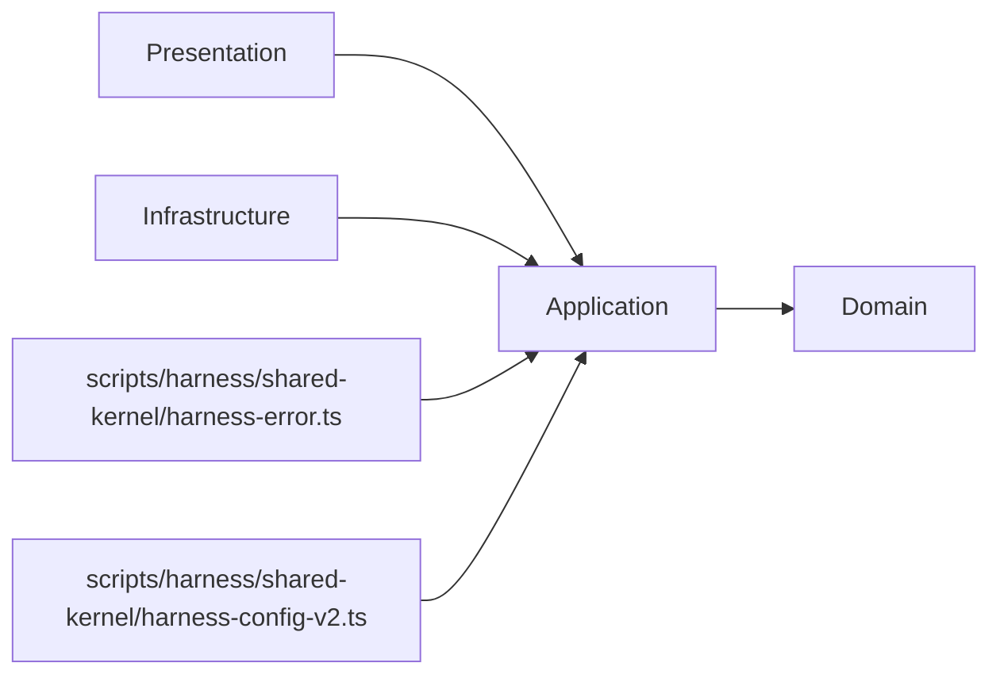
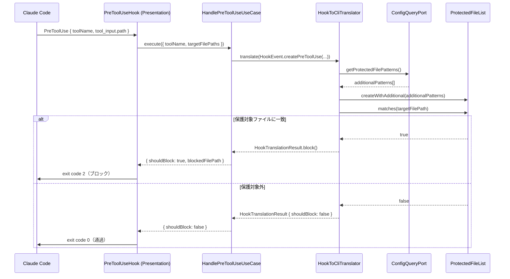
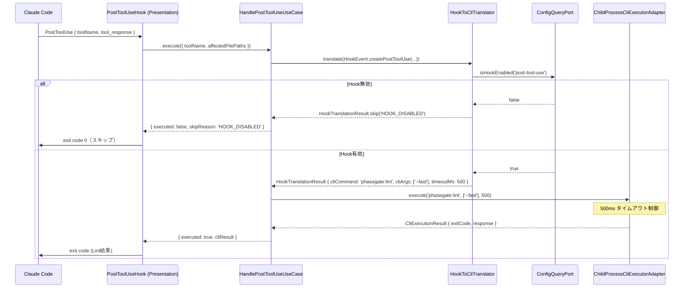
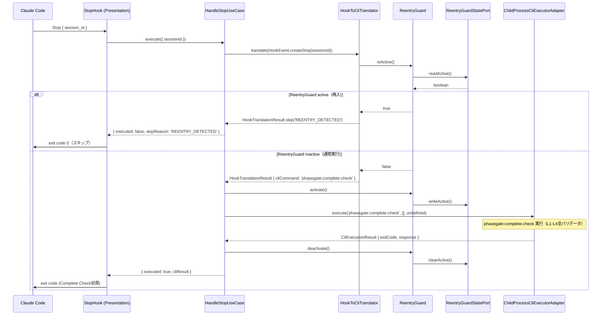
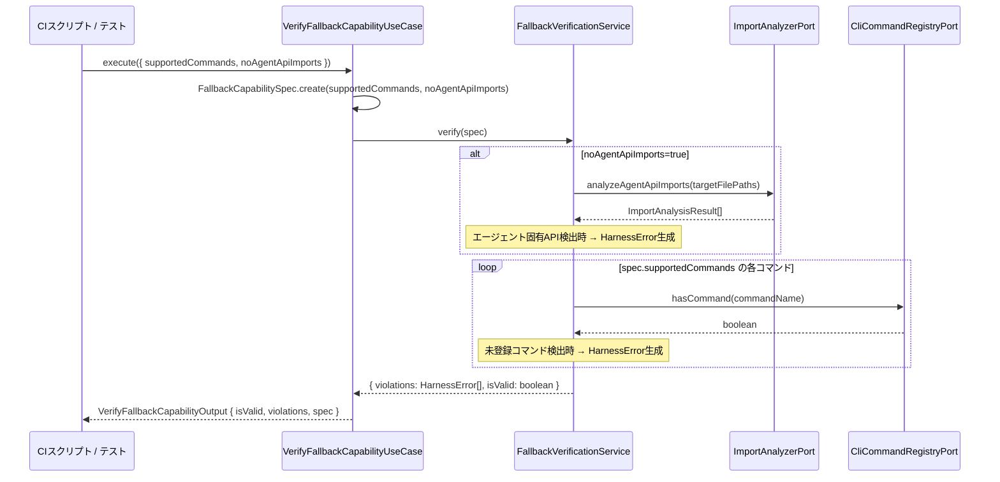

# 論理設計: agent-integration

## WI-001 WriteTargetScope による work-item パス認識

<!-- @work-item-id WI-001 -->

inception 側フェーズゲート整備（WI-001 / legacy ISSUE-001）の一環として、`WriteTargetScope.fromPath()` の inception パス認識を US ID 専用から work-item ID 一般へ拡張した。story ID パターンを `WORK_ITEM_ID_PATTERN`（`/^[A-Z][\w]+-\d+$/`）に一般化し、`docs/inception/{unit}/{storyId}/**` を issue ID / WI ID でも `level=3`（`unitId`, `storyId` 付き）として解決する。これにより issue も US と同一の work-item として同じ依存グラフ・成果物チェックの対象になる。本 unit の変更は §2.2.5 WriteTargetScope の `fromPath()` パス推定ルールに集約されており、フェーズゲート判定ロジックそのもの（product docs ハブモデル・required の意味論）は phase-dependency-model 側で扱う。

## WI-102 `_cross/WI-*` 横断 WI の write target scope 解決

<!-- @work-item-id WI-102 -->

ISSUE-026 Phase B で `docs/inception/issues/ISSUE-*` が `docs/inception/_cross/WI-*` へ移行したことを受け、`WriteTargetScope.fromPath()` に横断 WI レイアウト認識を追加した（WI-102 / legacy H11-06）。`docs/inception/_cross/{WI-XXX}/**` を `level=3`, `unitId="_cross"`, `storyId="WI-XXX"` として解決し、`_cross/{WI-XXX}/description.md` は WI 入口の Phase 1 work として `level=1` に落とす。`_cross` 配下の非 WI ディレクトリは作業単位として誤認せず `level=1` で止める。旧 `docs/inception/issues/ISSUE-*` は移行互換のため `level=1` のまま維持する。実 unit への解決（frontmatter `type` / `affects` 依拠）は後続 Phase の責務であり、本変更では `_cross` を仮想 unitId として保持するに留める。詳細ルールは §2.2.5 WriteTargetScope の R3a / R3b / R4 を参照。

## WI-015 コメントのみ差分の full-mode 判定への content 受け渡し

<!-- @work-item-id WI-015 -->

quick-mode 側の「コメントのみ差分を api 変更として誤分類する」不具合修正（WI-015 / legacy ISSUE-015）に対し、本 unit は hook 境界での content 受け渡しのみを担う。PreToolUse hook adapter が Edit の `old_string` / `new_string`、Write の disk/new content を hook payload から取り出し、quick-mode の full-mode 要求判定に before/after content を渡せるようにした（`handle-pre-tool-use-dto.ts` / `full-mode-requirement-query-port.ts` / `quick-mode-full-mode-requirement-adapter.ts`）。分類ルール（コメントのみ差分を `docs` に降格し、真の API 変更は `API_CONTRACT` のまま拒否）は quick-mode 側の責務で、本 unit に設計判断の追加はない。content が payload に含まれない場合は従来のパスベース判定に戻る後方互換を保つ。

## WI-086 / WI-087 Hook Deployment Compatibility

<!-- @work-item-id WI-086, WI-087 -->

Agent hook integration supports real-world repository layouts by consuming generated hook configuration instead of assuming a single `src` target. Deployed hook scripts remain compatible with macOS default shell environments and expose visible outcomes when Quick Mode allows a change.

@work-item-id WI-208
Hook adapters resolve PhaseGate config through the same personal fallback as config-foundation. If `.phasegate-local/phasegate.config.json` is selected, hook-local project root remains the repository root so story reflection, status context, skip-event logs, and validator execution do not accidentally treat `.phasegate-local/` as the project.

@work-item-id WI-216
Agent integration consumes installed skills as runtime-visible agent directories only. The hook layer does not own skill catalog mutation; it relies on installation lifecycle commands to keep `.claude/skills` and `.codex/skills` complete while preserving user-owned skills.

@story-id H11-01
@story-id H11-02
@story-id H11-03
@story-id H11-04
@work-item-id WI-097
> **Unit ID**: agent-integration
> **作成日**: 2026-03-19
> **対応ストーリー**: H11-01, H11-02, H11-03, H11-04, B-7
> **モード**: Unit横断設計（Phase 2）
>
> <!-- @story-id B-7 -->
> **前提ドキュメント**:
> - `docs/product/construction/agent-integration/domain_model.md`
> - `docs/product/units/integration_contract.md`
> - `docs/inception/_shared/cross_cutting_decisions.md`
> - `docs/principles/architecture-philosophy.md`

---

## 1. アーキテクチャ概要

### 1.1 層構成と責務

| 層 | 責務 | 主な構成要素 | 依存先 |
|----|------|-------------|--------|
| Domain | ReentryGuardの状態遷移管理、HookEvent→HookTranslationResult変換ルール、ProtectedFileListによるブロック判定、WriteTargetScopeによるフェーズゲートスコープ推定（v2.2.0）、FallbackCapabilitySpec宣言と検証ルール | ReentryGuard（エンティティ）、値オブジェクト群（v2.2.0: +WriteTargetScope/ProjectPaths/PhaseGateQueryResult）、HookToCliTranslator、FallbackVerificationService、ドメインポート5本（v2.2.0: +PhaseGateQueryPort） | なし |
| Application | ドメインモデルを使ったユースケース調停。フォールバック検証・Hook処理・ReentryGuardライフサイクル管理の各フローをオーケストレーション | UseCase×4、DTO、Mapper | Domain |
| Infrastructure | ドメインポート実装。ReentryGuardStatePort（環境変数/tmpファイル）、ImportAnalyzerPort（AST解析）、CliCommandRegistryPort（harness-api参照）、CliExecutorPort（CLIコマンド実行）、ConfigQueryPort（設定取得） | Adapter×5 | Application, Domain |
| Presentation | Claude Code Hook入力受付、HookTranslationResultに基づくブロック/スキップ/CLI実行の制御。Hook登録エントリポイントの提供 | Hook Adapter×3（PreToolUse/PostToolUse/Stop） | Application, Domain |

### 1.2 依存方向

`cross_cutting_decisions.md` §2 と `integration_contract.md` の正規語彙に合わせ、依存方向は以下に固定する。



```text
domain <- application <- infrastructure
domain <- application <- presentation
```

- Domain層は外部I/Oに依存しない
- Application層はDomainモデルの調停に徹し、I/O実装を持たない
- Infrastructure層は `domain/ports/` のみを実装し、Hookロジックを持たない
- Presentation層はApplication層経由でのみDomainを利用する
- `HarnessError` は `scripts/harness/shared-kernel/harness-error.ts` のみを経由して参照する
- `HarnessConfigV2` は `scripts/harness/shared-kernel/harness-config-v2.ts` のみを経由して参照する
- harness-apiの `CommandName`・`ExitCode`・`HarnessApiResponse` はinfrastructure層のみが直接参照し、Domain層へは持ち込まない

### 1.3 ディレクトリ構成（全ファイル一覧）

agent-integration の実装は `scripts/harness/agent-integration/` 配下に4層で配置する。

```text
scripts/harness/
└── agent-integration/
    ├── domain/
    │   ├── entities/
    │   │   └── reentry-guard.ts
    │   ├── value-objects/
    │   │   ├── hook-event.ts
    │   │   ├── protected-file-list.ts
    │   │   ├── hook-translation-result.ts
    │   │   ├── fallback-capability-spec.ts
    │   │   ├── write-target-scope.ts          # v2.2.0追加
    │   │   ├── project-paths.ts               # v2.2.0追加
    │   │   └── phase-gate-query-result.ts     # v2.2.0追加
    │   ├── types/
    │   │   ├── hook-type.ts
    │   │   ├── skip-reason.ts
    │   │   ├── hook-event-payloads.ts
    │   │   └── phase-gate-level.ts            # v2.2.0追加
    │   ├── services/
    │   │   ├── hook-to-cli-translator.ts
    │   │   └── fallback-verification-service.ts
    │   ├── errors/
    │   │   ├── agent-integration-domain-error.ts
    │   │   ├── reentry-guard-already-active-error.ts
    │   │   ├── protected-file-list-empty-error.ts
    │   │   ├── fallback-capability-violation-error.ts
    │   │   ├── unsupported-hook-type-error.ts
    │   │   ├── project-paths-invariant-error.ts        # v2.2.0追加
    │   │   └── write-target-scope-invariant-error.ts   # v2.2.0追加
    │   └── ports/
    │       ├── reentry-guard-state-port.ts
    │       ├── import-analyzer-port.ts
    │       ├── cli-command-registry-port.ts
    │       ├── config-query-port.ts
    │       └── phase-gate-query-port.ts       # v2.2.0追加
    ├── application/
    │   ├── dto/
    │   │   ├── verify-fallback-capability-input.ts
    │   │   ├── verify-fallback-capability-output.ts
    │   │   ├── handle-pre-tool-use-input.ts
    │   │   ├── handle-pre-tool-use-output.ts
    │   │   ├── handle-post-tool-use-input.ts
    │   │   ├── handle-post-tool-use-output.ts
    │   │   ├── handle-stop-input.ts
    │   │   └── handle-stop-output.ts
    │   ├── mappers/
    │   │   ├── hook-event-mapper.ts
    │   │   └── hook-translation-result-mapper.ts
    │   └── usecases/
    │       ├── verify-fallback-capability-usecase.ts
    │       ├── handle-pre-tool-use-usecase.ts
    │       ├── handle-post-tool-use-usecase.ts
    │       └── handle-stop-usecase.ts
    ├── infrastructure/
    │   ├── adapters/
    │   │   ├── env-file-reentry-guard-state-adapter.ts
    │   │   ├── ts-morph-import-analyzer-adapter.ts
    │   │   ├── harness-api-cli-command-registry-adapter.ts
    │   │   ├── harness-config-config-query-adapter.ts
    │   │   ├── phase-gate-query-adapter.ts    # v2.2.0追加
    │   │   └── child-process-cli-executor-adapter.ts
    │   └── ports/
    │       └── cli-executor-port.ts
    └── presentation/
        ├── pre-tool-use-hook.ts
        ├── post-tool-use-hook.ts
        └── stop-hook.ts
```

テスト配置:

```text
scripts/harness/__tests__/
├── unit/
│   └── agent-integration/
│       ├── entities/
│       │   └── reentry-guard.test.ts
│       ├── value-objects/
│       │   ├── hook-event.test.ts
│       │   ├── protected-file-list.test.ts
│       │   ├── hook-translation-result.test.ts
│       │   ├── fallback-capability-spec.test.ts
│       │   ├── write-target-scope.test.ts         # v2.2.0追加
│       │   ├── project-paths.test.ts              # v2.2.0追加
│       │   └── phase-gate-query-result.test.ts    # v2.2.0追加
│       ├── services/
│       │   ├── hook-to-cli-translator.test.ts
│       │   └── fallback-verification-service.test.ts
│       └── usecases/
│           ├── verify-fallback-capability-usecase.test.ts
│           ├── handle-pre-tool-use-usecase.test.ts
│           ├── handle-post-tool-use-usecase.test.ts
│           └── handle-stop-usecase.test.ts
└── integration/
    └── agent-integration/
        ├── env-file-reentry-guard-state-adapter.test.ts
        ├── harness-config-config-query-adapter.test.ts
        ├── phase-gate-query-adapter.test.ts           # v2.2.0追加
        └── codex-payload-compatibility.integration.test.ts
```

---

## 2. Domain層設計

### 2.1 中心モデル: ReentryGuard（エンティティ）

`domain_model.md` の結論どおり、agent-integration は集約を持たない。ReentryGuard は「active/inactive 状態遷移 + activate/isActive/deactivate ライフサイクル」を持つエンティティとして定義する。純粋なVOへの降格は状態遷移の意味論を失うため不適切である（D1参照）。

#### 状態遷移

| 状態 | 説明 |
|------|------|
| `inactive` | 初期状態。Stop Hookが実行中でない |
| `active` | Stop Hookが実行中。再入試行を検出可能な状態 |

#### 属性一覧

| 属性 | 型 | 説明 | 必須 |
|------|----|------|------|
| state | `'inactive' \| 'active'` | 現在の内部状態。直接公開しない | Yes（内部） |

#### メソッド一覧

##### `activate(): Promise<void>`

- 入力: なし
- 出力: `Promise<void>`
- 処理フロー:
  1. `isActive()` を呼び出し、すでに `active` であれば `ReentryGuardAlreadyActiveError` を投げる
  2. `state` を `inactive → active` に遷移させる
  3. `ReentryGuardStatePort.writeActive()` を呼び出し、状態を永続化する
- 例外: `ReentryGuardAlreadyActiveError`（INV-1違反）
- 不変条件: 二重 activate を禁止する（INV-1）

##### `isActive(): Promise<boolean>`

- 入力: なし
- 出力: `Promise<boolean>`
- 処理フロー:
  1. `ReentryGuardStatePort.readActive()` を呼び出す
  2. 永続化された状態を返す（環境変数 or tmpファイルの存在確認）
- 例外: Port実装のI/Oエラーのみ
- 不変条件: 永続化状態との整合性を保つ

##### `deactivate(): Promise<void>`

- 入力: なし
- 出力: `Promise<void>`
- 処理フロー:
  1. `ReentryGuardStatePort.clearActive()` を呼び出し、状態フラグを削除する
  2. `state` を `active → inactive` に遷移させる
- 例外: Port実装のI/Oエラーのみ
- 不変条件: inactive状態での deactivate は冪等（エラーを投げない）

#### ライフサイクル図

```
[inactive]
    │
    │ Stop Hook 開始
    ▼
activate()
    │
    │ ReentryGuardStatePort.writeActive()
    ▼
[active]
    │
    ├─── Stop Hook 再入試行 ───► isActive() = true
    │                              ► skipReason: 'REENTRY_DETECTED'
    │
    │ Stop Hook 完了
    ▼
deactivate()
    │
    │ ReentryGuardStatePort.clearActive()
    ▼
[inactive]
```

### 2.2 値オブジェクト群

#### 2.2.1 HookEvent

| 属性 | 型 | 説明 |
|------|----|------|
| hookType | `HookType` | フックの種別 |
| payload | `PreToolUsePayload \| PostToolUsePayload \| StopPayload` | 種別固有のデータ |

**Union型定義**

```text
HookEvent = PreToolUseEvent | PostToolUseEvent | StopEvent

PreToolUseEvent  = { hookType: 'pre-tool-use',  toolName: string, targetFilePaths: string[] }
PostToolUseEvent = { hookType: 'post-tool-use', toolName: string, affectedFilePaths: string[] }
StopEvent        = { hookType: 'stop',           sessionId: string }
```

**生成ルール**

- `toolName` は空文字不可
- `targetFilePaths` / `affectedFilePaths` は0件以上を許容（空配列はブロックなし）
- `sessionId` は空文字不可

**メソッド**

- `static createPreToolUse(toolName: string, targetFilePaths: string[]): HookEvent`
- `static createPostToolUse(toolName: string, affectedFilePaths: string[]): HookEvent`
- `static createStop(sessionId: string): HookEvent`
- `isPreToolUse(): this is PreToolUseEvent`
- `isPostToolUse(): this is PostToolUseEvent`
- `isStop(): this is StopEvent`
- `equals(other: HookEvent): boolean`

**バリデーションルール**

- 未定義の `hookType` は `UnsupportedHookTypeError`
- payload 内の文字列フィールドは空文字を受け付けない

#### 2.2.2 ProtectedFileList

| 属性 | 型 | 説明 |
|------|----|------|
| patterns | `readonly string[]` | ブロック対象のパスパターン（1件以上必須） |

**デフォルトパターン（ハードコード）**

以下のファイルはリンター設定として常に保護する業務ルールであり、ドメイン層にハードコードする（D3参照）。

```text
biome.json
.biome.json
tsconfig.json
package.json
package-lock.json
```

**生成ルール**

- `patterns` は1件以上必須（INV-4）
- 追加パターンは `ConfigQueryPort` 経由で取得した設定値を merge する

**メソッド**

- `static createDefault(): ProtectedFileList` — デフォルトパターンのみで生成
- `static createWithAdditional(additionalPatterns: string[]): ProtectedFileList` — デフォルト + 追加パターンで生成
- `matches(filePath: string): boolean` — `filePath` が保護対象パターンのいずれかに一致するか判定
- `equals(other: ProtectedFileList): boolean`

**マッチングルール**

- `filePath` のベース名またはパス全体がパターンと一致する場合 `true` を返す
- glob パターン（`*.json` 等）のマッチングは `micromatch` ライブラリを使用する
- 大文字小文字の区別はOS依存（POSIXは区別あり）

**バリデーションルール**

- `patterns` が空配列の場合は `ProtectedFileListEmptyError`

#### 2.2.3 HookTranslationResult

| 属性 | 型 | 説明 | 必須 |
|------|----|------|------|
| shouldBlock | `boolean` | PreToolUse でのブロック判定 | Yes |
| cliCommand | `CommandName \| undefined` | 実行するCLIコマンド名 | No |
| cliArgs | `readonly string[]` | CLIコマンドの引数 | Yes（空配列可） |
| expectedExitCode | `ExitCode` | 期待する終了コード | Yes |
| skipReason | `SkipReason \| undefined` | スキップ理由 | No |
| timeoutMs | `number \| undefined` | タイムアウト（ms）。PostToolUse は500ms固定 | No |

**生成ルール**

- `shouldBlock=true` の場合、`cliCommand` は `undefined`（INV-2）
- `skipReason` が存在する場合、`cliCommand` は `undefined`（INV-3）
- `cliCommand` が存在する場合、`cliArgs` は空配列可
- `timeoutMs` は 0 より大きい正の整数

**メソッド**

- `static block(): HookTranslationResult` — ブロック結果を生成
- `static skip(reason: SkipReason): HookTranslationResult` — スキップ結果を生成
- `static execute(cliCommand: CommandName, cliArgs: string[], expectedExitCode: ExitCode, timeoutMs?: number): HookTranslationResult` — 実行結果を生成
- `hasCliCommand(): boolean`
- `shouldSkip(): boolean`
- `equals(other: HookTranslationResult): boolean`

**バリデーションルール**

- `shouldBlock=true` かつ `cliCommand` が存在する場合は不変条件違反として例外を投げる
- `skipReason` が存在し `cliCommand` が存在する場合は不変条件違反として例外を投げる

#### 2.2.4 FallbackCapabilitySpec

| 属性 | 型 | 説明 | 必須 |
|------|----|------|------|
| supportedCommands | `readonly CommandName[]` | フォールバック対応CLIコマンド（1件以上必須） | Yes |
| noAgentApiImports | `boolean` | エージェント固有API importを持たないことの宣言 | Yes |

**生成ルール**

- `supportedCommands` は1件以上必須（INV-5）
- `CommandName` は `'harness:'` プレフィックスを持つ文字列のみ許容

**メソッド**

- `static create(supportedCommands: CommandName[], noAgentApiImports: boolean): FallbackCapabilitySpec`
- `includesCommand(command: CommandName): boolean`
- `requiresNoAgentApiImports(): boolean`
- `equals(other: FallbackCapabilitySpec): boolean`

**バリデーションルール**

- `supportedCommands` が空配列の場合は `FallbackCapabilityViolationError`
- `CommandName` に `'harness:'` プレフィックスがない場合は不正入力として弾く

#### 2.2.5 WriteTargetScope（v2.2.0追加）

@work-item-id WI-218

| 属性 | 型 | 説明 | 必須 |
|------|----|------|------|
| level | `PhaseGateLevel` | フェーズゲートレベル（1, 2, 3） | Yes |
| unitId | `string \| undefined` | 対象ユニットID | level=2,3のみ |
| storyId | `string \| undefined` | 対象ストーリーID | level=3のみ（任意） |

**生成ルール**

- `level=1` の場合、`unitId` と `storyId` は undefined（INV-7）
- `level=2` の場合、`unitId` は必須、`storyId` は undefined（INV-8）
- `level=3` の場合、`unitId` は必須（INV-9）
- `level` は 1, 2, 3 のいずれか（INV-6）

**メソッド**

- `static create(level, unitId?, storyId?): WriteTargetScope` — 不変条件検証付きファクトリ
- `static fromPath(filePath: string, projectPaths: ProjectPaths): WriteTargetScope | null` — ファイルパスからスコープを推定
- `getLevel(): PhaseGateLevel`
- `getUnitId(): string | undefined`
- `getStoryId(): string | undefined`
- `equals(other: WriteTargetScope): boolean`

**fromPath() パス推定ルール（R1-R8）**

| ルール | パスパターン | Level | unitId | storyId |
|--------|------------|-------|--------|---------|
| R1 | `{source[n]}/{unitId}/**`（`__tests__/` 除く） | 3 | ✓ | — |
| R2 | `{source[n]}/{unitId}/__tests__/**` | null | — | — |
| R3 | `{docs.construction}/{unitId}/**` | 2 | ✓ | — |
| R3a | `{docs.inception}/_cross/{WI-XXX}/description.md` | 1 | — | — |
| R3b | `{docs.inception}/{unitId}/{WI-XXX}/description.md` | 1 | — | — |
| R4 | `{docs.inception}/{unitId}/{storyId}/**` | 3 | ✓ | ✓ |
| R5 | `{docs.inception}/{unitId}/**`（storyIdなし） | 2 | ✓ | — |
| R6 | `{docs.inception}/_shared/**` | 1 | — | — |
| R7 | Level 1 確定文書パス | 1 | — | — |
| R8 | 上記いずれにも該当しない | null | — | — |

#### 2.2.6 ProjectPaths（v2.2.0追加）

| 属性 | 型 | 説明 | 必須 |
|------|----|------|------|
| source | `readonly string[]` | ソースコードルートパス（1件以上） | Yes |
| docs.construction | `string` | 確定設計文書ルートパス | Yes |
| docs.inception | `string` | 設計計画文書ルートパス | Yes |

**生成ルール**

- `source` は1件以上（INV-10）
- `docs.construction` と `docs.inception` は非空文字列（INV-11）

**メソッド**

- `static create(source: string[], docs: { construction: string; inception: string }): ProjectPaths`
- `getSource(): readonly string[]`
- `getDocsConstruction(): string`
- `getDocsInception(): string`
- `equals(other: ProjectPaths): boolean`

**デフォルト値（HarnessConfigConfigQueryAdapterでのフォールバック）**

- source: `['scripts/harness']`
- docs.construction: `'docs/product/construction'`
- docs.inception: `'docs/inception'`

#### 2.2.7 PhaseGateQueryResult（v2.2.0追加）

| 属性 | 型 | 説明 | 必須 |
|------|----|------|------|
| passed | `boolean` | ゲート通過フラグ | Yes |
| blockers | `readonly string[]` | ブロック理由（passed=falseの場合1件以上） | Yes |
| warnings | `readonly string[]` | 警告メッセージ | Yes（空配列可） |

**生成ルール**

- `passed=false` の場合、`blockers` は1件以上必須（INV-12）

**メソッド**

- `static create(passed, blockers, warnings): PhaseGateQueryResult`
- `hasPassed(): boolean`
- `getBlockers(): readonly string[]`
- `getWarnings(): readonly string[]`
- `equals(other: PhaseGateQueryResult): boolean`

### 2.3 補助型定義

#### HookType

```text
type HookType = 'pre-tool-use' | 'post-tool-use' | 'stop'
```

#### SkipReason

```text
type SkipReason = 'REENTRY_DETECTED' | 'HOOK_DISABLED' | 'TIMEOUT_EXCEEDED'
```

- `REENTRY_DETECTED`: ReentryGuard が active 状態での Stop Hook 再入
- `HOOK_DISABLED`: HarnessConfigV2 でHookが無効化されている
- `TIMEOUT_EXCEEDED`: PostToolUse が 500ms 制限を超過した（将来対応）

### 2.4 ドメインサービス

#### 2.4.1 HookToCliTranslator

**責務**: `HookEvent` を `HookTranslationResult` に変換する。Hook種別ごとの変換ルールをカプセル化する。CLI実行は行わない。

**コンストラクタ依存**

- `reentryGuard: ReentryGuard`
- `cliCommandRegistryPort: CliCommandRegistryPort`
- `configQueryPort: ConfigQueryPort`
- `phaseGateQueryPort: PhaseGateQueryPort`（v2.2.0追加、AsyncHookToCliTranslatorのみ）

##### `translate(hookEvent: HookEvent): Promise<HookTranslationResult>`

- 入力: `hookEvent: HookEvent`
- 出力: `Promise<HookTranslationResult>`
- 処理フロー（PreToolUse — v2.2.0で2-step化）:
  Step 1（保護ファイルチェック）:
  1. `configQueryPort.getProtectedFilePatterns()` で追加保護パターンを取得する
  2. `ProtectedFileList.createWithAdditional(additionalPatterns)` で保護リストを生成する
  3. `hookEvent.targetFilePaths` の各パスを `protectedFileList.matches()` で判定する
  4. 1件でも一致があれば `HookTranslationResult.block()` を返す
  Step 2（フェーズゲートチェック — v2.2.0追加、AsyncHookToCliTranslatorのみ）:
  5. `configQueryPort.getProjectPaths()` で `ProjectPaths` を取得する
  6. `hookEvent.targetFilePaths` の各パスに対し `WriteTargetScope.fromPath(filePath, projectPaths)` でスコープを推定する
     - ISSUE-026 Phase C-2以降、`docs.inception/_cross/WI-*` は横断WIの仮想unitとして `level=3`, `unitId="_cross"`, `storyId="WI-XXX"` に解決する
     - WI-218以降、WI入口の `description.md` は `level=1` に解決し、Level 3フェーズゲート対象にしない
  7. いずれのパスもスコープ外（null）の場合は `HookTranslationResult.create({ shouldBlock: false, ... })` を返す
  8. スコープが検出された場合、`phaseGateQueryPort.checkGate(detectedScope)` を呼び出す
  9. `!phaseGateResult.hasPassed()` の場合は `HookTranslationResult.block()` を返す
  10. ゲート通過の場合は `HookTranslationResult.create({ shouldBlock: false, ... })` を返す
- 処理フロー（PostToolUse）:
  1. `configQueryPort.isHookEnabled('post-tool-use')` で有効/無効を確認する
  2. 無効の場合は `HookTranslationResult.skip('HOOK_DISABLED')` を返す
  3. `cliCommandRegistryPort.hasCommand('phasegate:lint')` でコマンド存在を確認する
  4. `HookTranslationResult.execute('phasegate:lint', ['--fast'], 0, 500)` を返す
- 処理フロー（Stop）:
  1. `reentryGuard.isActive()` を呼び出す
  2. `isActive=true` の場合は `HookTranslationResult.skip('REENTRY_DETECTED')` を返す
  3. `isActive=false` の場合は `HookTranslationResult.execute('phasegate:complete-check', [], 0)` を返す
- 例外:
  - `UnsupportedHookTypeError`: 未対応の hookType
  - Port実装のI/Oエラー
- 不変条件: 変換ルールのみを担い、ReentryGuard の状態変更（activate/deactivate）は行わない

**変換ルール一覧（domain_model.md §5 のINV準拠）**

| HookEvent種別 | 条件 | 変換結果 |
|--------------|------|---------|
| PreToolUseEvent | Step 1: `protectedFileList.matches(targetFilePath)=true` | `{ shouldBlock: true }` |
| PreToolUseEvent | Step 2: `WriteTargetScope.fromPath()=null`（スコープ外） | `{ shouldBlock: false, cliCommand: undefined }` |
| PreToolUseEvent | Step 2: `phaseGateQueryPort.checkGate().hasPassed()=false` | `{ shouldBlock: true }` |
| PreToolUseEvent | Step 2: `phaseGateQueryPort.checkGate().hasPassed()=true` | `{ shouldBlock: false, cliCommand: undefined }` |
| PostToolUseEvent | `isEnabled('post-tool-use')=false` | `{ shouldBlock: false, skipReason: 'HOOK_DISABLED' }` |
| PostToolUseEvent | 通常 | `{ shouldBlock: false, cliCommand: 'phasegate:lint', cliArgs: ['--fast'], expectedExitCode: 0, timeoutMs: 500 }` |
| StopEvent | `reentryGuard.isActive()=true` | `{ shouldBlock: false, skipReason: 'REENTRY_DETECTED' }` |
| StopEvent | `reentryGuard.isActive()=false` | `{ shouldBlock: false, cliCommand: 'phasegate:complete-check', cliArgs: [], expectedExitCode: 0 }` |

#### 2.4.2 FallbackVerificationService

**責務**: `FallbackCapabilitySpec` に基づき、coreモジュールのエージェント非依存性を検証する。「何を検証すべきか」というドメインルールを保持し、「どう解析するか」はポートに委譲する（D4参照）。

**コンストラクタ依存**

- `importAnalyzerPort: ImportAnalyzerPort`
- `cliCommandRegistryPort: CliCommandRegistryPort`

##### `verify(spec: FallbackCapabilitySpec): Promise<{ violations: HarnessError[]; isValid: boolean }>`

- 入力: `spec: FallbackCapabilitySpec`
- 出力: `Promise<{ violations: HarnessError[]; isValid: boolean }>`
- 処理フロー:
  1. `spec.requiresNoAgentApiImports()=true` の場合:
     a. `importAnalyzerPort.analyzeAgentApiImports(targetPaths)` を呼び出す
     b. エージェント固有API（`@anthropic-ai/claude-code` 等）のimportが検出された場合、`HarnessError` を生成して violations に追加する
  2. `spec.supportedCommands` の各コマンドに対して:
     a. `cliCommandRegistryPort.hasCommand(commandName)` を呼び出す
     b. 未登録コマンドがある場合、`HarnessError` を生成して violations に追加する
  3. `violations.length === 0` の場合は `isValid: true` を返す
- 例外: Port実装のI/Oエラー
- 不変条件: violations を検出しても例外を投げない。HarnessError[] で表現する

### 2.5 ドメインイベント

agent-integration は Wave 2 のシンプルな薄いAdapter層であるため、ドメインイベント基盤は実装しない。ReentryGuard の状態変化は `ReentryGuardStatePort` への読み書きで直接表現する。

---

## 3. Domain層ポート設計

ポートは全て `scripts/harness/agent-integration/domain/ports/` に定義し、Infrastructure層が実装する。

### 3.1 ReentryGuardStatePort

```typescript
export interface ReentryGuardStatePort {
  readActive(): Promise<boolean>;
  writeActive(): Promise<void>;
  clearActive(): Promise<void>;
}
```

| メソッド | 入力 | 出力 | 説明 |
|---------|------|------|------|
| `readActive` | なし | `Promise<boolean>` | `stop_hook_active` フラグを読み取り、active かどうかを返す |
| `writeActive` | なし | `Promise<void>` | フラグを active 状態に設定する（環境変数セット or tmpファイル作成） |
| `clearActive` | なし | `Promise<void>` | フラグを削除し inactive 状態にする（環境変数削除 or tmpファイル削除） |

**実装選択肢（infrastructure層で決定）**

1. 環境変数 `HARNESS_STOP_HOOK_ACTIVE=1` の読み書き
2. `$TMPDIR/stop_hook_active` ファイルの存在確認

### 3.2 ImportAnalyzerPort

```typescript
export interface ImportAnalyzerPort {
  analyzeAgentApiImports(targetFilePaths: string[]): Promise<ImportAnalysisResult[]>;
}

export interface ImportAnalysisResult {
  filePath: string;
  agentApiImports: string[];  // 検出されたエージェント固有API import パス
}
```

| メソッド | 入力 | 出力 | 説明 |
|---------|------|------|------|
| `analyzeAgentApiImports` | `targetFilePaths: string[]` | `Promise<ImportAnalysisResult[]>` | 指定ファイル群のimport解析を行い、エージェント固有APIへの参照を検出する |

**エージェント固有APIの定義**

- `@anthropic-ai/claude-code` およびそのサブパスimport
- `claude-code` パッケージ
- 将来的にポート経由で設定可能にする（Wave 3以降）

### 3.3 CliCommandRegistryPort

```typescript
export interface CliCommandRegistryPort {
  hasCommand(commandName: CommandName): Promise<boolean>;
  listCommands(): Promise<readonly CommandName[]>;
}
```

| メソッド | 入力 | 出力 | 説明 |
|---------|------|------|------|
| `hasCommand` | `commandName: CommandName` | `Promise<boolean>` | harness-apiのCLI Command Registryに指定コマンドが登録済みかを確認する |
| `listCommands` | なし | `Promise<readonly CommandName[]>` | 登録済みコマンド名の一覧を返す |

**消費するCross-Unit契約**: `integration_contract.md §2.2` の「CLI Command Registry（harness-api所有）」

### 3.4 ConfigQueryPort

```typescript
export interface ConfigQueryPort {
  isHookEnabled(hookType: HookType): Promise<boolean>;
  getProtectedFilePatterns(): Promise<string[]>;
  getProjectPaths(): ProjectPaths;  // v2.2.0追加（同期メソッド — D7参照）
}
```

| メソッド | 入力 | 出力 | 説明 |
|---------|------|------|------|
| `isHookEnabled` | `hookType: HookType` | `Promise<boolean>` | HarnessConfigV2のHarnesses設定からHook有効/無効を読み取る |
| `getProtectedFilePatterns` | なし | `Promise<string[]>` | HarnessConfigV2から追加保護対象ファイルパターンを返す（デフォルトパターンは除く） |
| `getProjectPaths` | なし | `ProjectPaths` | HarnessConfigV2の`project.paths`セクションからProjectPaths VOを返す（v2.2.0追加） |

**v2.2.0変更**: `checkDesignDocsExist()` を削除し、`getProjectPaths()` を追加。ハードコードされた設計文書存在チェックをconfig駆動のパス解決に置換した。

**消費するShared Kernel**: `HarnessConfigV2`（config-foundation所有）

### 3.5 PhaseGateQueryPort（v2.2.0追加）

```typescript
export interface PhaseGateQueryPort {
  checkGate(scope: WriteTargetScope): Promise<PhaseGateQueryResult>;
}
```

| メソッド | 入力 | 出力 | 説明 |
|---------|------|------|------|
| `checkGate` | `scope: WriteTargetScope` | `Promise<PhaseGateQueryResult>` | phase-dependency-modelの`checkPhaseGate()`を呼び出し、指定スコープのフェーズゲート通過状態を返す |

**消費するCross-Unit Contract**: phase-dependency-modelの`checkPhaseGateCommandHandler`（動的import経由）

### 3.6 ポート設計上のルール

- Port の戻り値はDomainが理解できる値オブジェクトかプリミティブに限定する
- `CommandName` / `ExitCode` / `HarnessApiResponse` はinfrastructure層での型参照のみに留め、Portインターフェースのシグネチャには露出しない
- ConfigQueryPort は HarnessConfigV2 の raw 構造を返さず、Hook設定に特化した問い合わせメソッドのみを持つ

---

## 4. Application層設計

### 4.1 DTO / Mapper方針

| 要素 | 役割 |
|------|------|
| `HandlePreToolUseInput` | Presentation層からのPreToolUse入力。`toolName`, `targetFilePaths` |
| `HandlePreToolUseOutput` | UseCase出力。`shouldBlock`, `reason?` |
| `HandlePostToolUseInput` | Presentation層からのPostToolUse入力。`toolName`, `affectedFilePaths` |
| `HandlePostToolUseOutput` | UseCase出力。`executed`, `skipReason?`, `cliResult?` |
| `HandleStopInput` | Presentation層からのStop入力。`sessionId` |
| `HandleStopOutput` | UseCase出力。`executed`, `skipReason?`, `cliResult?` |
| `VerifyFallbackCapabilityInput` | CLI/FSフォールバック検証入力。`supportedCommands`, `noAgentApiImports`, `targetFilePaths` |
| `VerifyFallbackCapabilityOutput` | 検証出力。`isValid`, `violations: HarnessError[]` |
| `HookEventMapper` | 生の入力（JSON / CLI引数）を `HookEvent` VO に変換する |
| `HookTranslationResultMapper` | `HookTranslationResult` を各UseCaseの出力DTOに変換する |

### 4.2 VerifyFallbackCapabilityUseCase（H11-01対応）

**責務**: H11-01「CLI/FSフォールバック保証検証」のオーケストレーション。`FallbackVerificationService` を呼び出し、結果をDTO化して返す。

**コンストラクタ依存**

- `fallbackVerificationService: FallbackVerificationService`

**入力**

`VerifyFallbackCapabilityInput`

| 項目 | 型 | 必須 | 説明 |
|------|----|------|------|
| supportedCommands | `string[]` | Yes | フォールバック対応CLIコマンド名一覧 |
| noAgentApiImports | `boolean` | Yes | エージェント固有API非使用の宣言 |
| targetFilePaths | `string[]` | No | 解析対象ファイルパス（未指定時はcoreモジュール全体） |

**出力**: `VerifyFallbackCapabilityOutput`

| 項目 | 型 | 説明 |
|------|----|------|
| isValid | `boolean` | 全違反なしの場合 true |
| violations | `readonly HarnessError[]` | 検出された違反内容 |
| spec | `FallbackCapabilitySpec` | 使用した仕様（回帰テストがK14/K15で参照） |

**処理フロー**

1. `supportedCommands` を `CommandName[]` として検証する（`'harness:'` プレフィックス確認）
2. `FallbackCapabilitySpec.create(supportedCommands, noAgentApiImports)` でVOを生成する
3. `fallbackVerificationService.verify(spec)` を呼び出す
4. 結果を `VerifyFallbackCapabilityOutput` に投影する

**例外**

- `FallbackCapabilityViolationError`: `supportedCommands` が空
- `supportedCommands` の `CommandName` 形式違反

### 4.3 HandlePreToolUseUseCase（H11-02対応）

**責務**: H11-02「PreToolUse Hook処理」のオーケストレーション。保護対象ファイルへの変更およびフェーズゲート違反をブロックする。v2.2.0で`AsyncHookToCliTranslator`を使用する薄いオーケストレータに再構成。

**コンストラクタ依存**

- `configQueryPort: ConfigQueryPort`
- `phaseGateQueryPort: PhaseGateQueryPort`（v2.2.0追加）

内部で `AsyncHookToCliTranslator` を生成し、全ての変換ロジックを委譲する（D9参照）。

**入力**

`HandlePreToolUseInput`

| 項目 | 型 | 必須 | 説明 |
|------|----|------|------|
| toolName | `string` | Yes | Hookを発火したツール名 |
| targetFilePaths | `string[]` | Yes | 変更対象ファイルパス |

**出力**: `HandlePreToolUseOutput`

| 項目 | 型 | 説明 |
|------|----|------|
| shouldBlock | `boolean` | ブロックすべきか |
| blockedFilePath | `string \| undefined` | ブロック対象のファイルパス（最初の一致） |
| error | `{ message: string } \| undefined` | エラーメッセージ（v2.2.0追加） |
| phaseGateBlockers | `string[] \| undefined` | フェーズゲートブロック理由（v2.2.0追加） |

**処理フロー**

1. 入力バリデーション（`toolName` 空文字チェック）
2. `HookEvent.createPreToolUse(toolName, targetFilePaths)` でHookEventを生成する
3. `asyncHookToCliTranslator.translate(hookEvent)` を呼び出す（Step 1 + Step 2を内部で実行）
4. `result.shouldBlock` が true の場合、保護ファイルリストを再取得して最初にマッチしたファイルパスを `blockedFilePath` として特定する
5. `HandlePreToolUseOutput` に投影する

**例外**

- 入力バリデーション失敗（`toolName` が空文字等）

### 4.4 HandlePostToolUseUseCase（H11-03対応）

**責務**: H11-03「PostToolUse Hook処理」のオーケストレーション。`phasegate:lint --fast` を500ms以内で実行し、Lint結果を返す。

**コンストラクタ依存**

- `hookToCliTranslator: HookToCliTranslator`
- `cliExecutorPort: CliExecutorPort`（infrastructure層ポート）

**入力**

`HandlePostToolUseInput`

| 項目 | 型 | 必須 | 説明 |
|------|----|------|------|
| toolName | `string` | Yes | Hookを発火したツール名 |
| affectedFilePaths | `string[]` | Yes | 変更されたファイルパス |

**出力**: `HandlePostToolUseOutput`

| 項目 | 型 | 説明 |
|------|----|------|
| executed | `boolean` | CLIコマンドを実行したか |
| skipReason | `SkipReason \| undefined` | スキップした場合の理由 |
| cliResult | `CliExecutionResult \| undefined` | CLI実行結果 |

**処理フロー**

1. `HookEvent.createPostToolUse(toolName, affectedFilePaths)` でHookEventを生成する
2. `hookToCliTranslator.translate(hookEvent)` を呼び出す
3. `result.shouldSkip()=true` の場合は `{ executed: false, skipReason: result.skipReason }` を返す
4. `cliExecutorPort.execute(result.cliCommand!, result.cliArgs, result.timeoutMs)` を呼び出す
5. CLI実行結果を `HandlePostToolUseOutput` に投影する

**例外**

- `cliExecutorPort` のタイムアウト（500ms超過）

**タイムアウト制御**

- `HookTranslationResult.timeoutMs=500` をそのまま `cliExecutorPort.execute()` に渡す
- タイムアウト超過時は `cliExecutorPort` が `TimeoutError` を投げ、UseCase はそれをキャッチして `{ executed: false, skipReason: 'TIMEOUT_EXCEEDED' }` を返す

### 4.5 HandleStopUseCase（H11-04対応）

**責務**: H11-04「Stop Hook処理」のオーケストレーション。ReentryGuard による無限ループ防止と `phasegate:complete-check` の実行を管理する。ReentryGuard のライフサイクル（activate/deactivate）の唯一の制御点である。

**コンストラクタ依存**

- `hookToCliTranslator: HookToCliTranslator`
- `reentryGuard: ReentryGuard`
- `cliExecutorPort: CliExecutorPort`（infrastructure層ポート）

**入力**

`HandleStopInput`

| 項目 | 型 | 必須 | 説明 |
|------|----|------|------|
| sessionId | `string` | Yes | セッション識別子 |

**出力**: `HandleStopOutput`

| 項目 | 型 | 説明 |
|------|----|------|
| executed | `boolean` | CLIコマンドを実行したか |
| skipReason | `SkipReason \| undefined` | スキップした場合の理由 |
| cliResult | `CliExecutionResult \| undefined` | CLI実行結果 |

**処理フロー**

1. `HookEvent.createStop(sessionId)` でHookEventを生成する
2. `hookToCliTranslator.translate(hookEvent)` を呼び出す
   - `isActive=true` の場合: `result.skipReason='REENTRY_DETECTED'` となる
   - `isActive=false` の場合: `result.cliCommand='phasegate:complete-check'` となる
3. `result.shouldSkip()=true` の場合は `{ executed: false, skipReason: result.skipReason }` を返す
4. `result.shouldSkip()=false` の場合（`isActive=false`）:
   a. `reentryGuard.activate()` を呼び出す（フラグを active に設定）
   b. `cliExecutorPort.execute('phasegate:complete-check', [], undefined)` を呼び出す
   c. CLI実行完了後（成否問わず）に `reentryGuard.deactivate()` を呼び出す
   d. CLI実行結果を `HandleStopOutput` に投影する
5. CLI実行中に例外が発生した場合も `finally` ブロックで必ず `deactivate()` を呼ぶ

**例外**

- `ReentryGuardAlreadyActiveError`: `hookToCliTranslator` が translate 後に activate が呼ばれた時点で既に active（競合状態）
- `cliExecutorPort` の実行エラー（必ず deactivate してから再スロー）

**ReentryGuardライフサイクル管理の制約**

- `reentryGuard.activate()` と `reentryGuard.deactivate()` の呼び出しは `HandleStopUseCase` のみに許可する
- `HookToCliTranslator` は `isActive()` の参照のみ行い、状態変更を行ってはならない

---

## 5. Infrastructure層設計

### 5.1 EnvFileReentryGuardStateAdapter

**実装ポート**: `ReentryGuardStatePort`

**ファイルパス**: `scripts/harness/agent-integration/infrastructure/adapters/env-file-reentry-guard-state-adapter.ts`

**実装方針**

- プライマリ戦略: 環境変数 `HARNESS_STOP_HOOK_ACTIVE=1` の読み書き
- フォールバック戦略: `process.env.TMPDIR` または `/tmp` 配下の `stop_hook_active` ファイルの存在確認
- 戦略の選択はコンストラクタ引数 `strategy: 'env' | 'file'` で切り替える（デフォルトは `'env'`）

**利用ライブラリ**

- `node:process`（環境変数読み書き）
- `node:fs/promises`（tmpファイル読み書き）
- `node:path`（パス解決）

**メソッド実装**

| メソッド | env戦略 | file戦略 |
|---------|--------|---------|
| `readActive` | `process.env.HARNESS_STOP_HOOK_ACTIVE === '1'` | `fs.access(tmpFilePath)` の成否 |
| `writeActive` | `process.env.HARNESS_STOP_HOOK_ACTIVE = '1'` | `fs.writeFile(tmpFilePath, '')` |
| `clearActive` | `delete process.env.HARNESS_STOP_HOOK_ACTIVE` | `fs.rm(tmpFilePath, { force: true })` |

**エラー処理**

- `readActive` は I/O エラー時に `false` を返す（安全側に倒す）
- `writeActive` / `clearActive` は I/O エラー時に例外を投げる

### 5.2 TsMorphImportAnalyzerAdapter

**実装ポート**: `ImportAnalyzerPort`

**ファイルパス**: `scripts/harness/agent-integration/infrastructure/adapters/ts-morph-import-analyzer-adapter.ts`

**利用ライブラリ**

- `ts-morph`（TypeScript AST操作）

**実装方針**

- `ts-morph` の `Project` を生成し、対象ファイルを追加する
- 各ファイルの `ImportDeclaration` を走査し、`moduleSpecifier` を取得する
- エージェント固有API のモジュールパターン（`@anthropic-ai/claude-code` 等）に一致するものを収集する
- `targetFilePaths` が空の場合はcoreモジュールのデフォルトパス（`scripts/harness/` 配下）を解析する

**採用理由**

- `ts-morph` はTypeScript Compiler API のラッパーであり、import解析に特化したAPIを持つ
- biome-ast-engine が WASM/Rust ベースであるのとは異なり、import解析はNode.js ネイティブで十分

### 5.3 HarnessApiCliCommandRegistryAdapter

**実装ポート**: `CliCommandRegistryPort`

**ファイルパス**: `scripts/harness/agent-integration/infrastructure/adapters/harness-api-cli-command-registry-adapter.ts`

**利用する外部契約**: `integration_contract.md §3.1` のCLI Command Registry（harness-api所有）

**実装方針**

- harness-apiが公開するCommand Registry から登録済みコマンド一覧を取得する
- Wave 2 では静的なコマンド名リストをハードコードし、harness-apiの正式Registry完成後に差し替える
- ハードコードする登録済みコマンド（`integration_contract.md §3.1` 準拠）:
  ```
  phasegate:check-ready
  phasegate:check-phase
  phasegate:ci-check
  phasegate:detect-drift
  phasegate:status
  phasegate:lint
  phasegate:complete-check
  phasegate:impact-analysis
  phasegate:enable
  phasegate:disable
  ```

**メソッド実装**

- `hasCommand(commandName)`: 静的リストを `Set<CommandName>` として保持し `O(1)` 判定
- `listCommands()`: 静的リストを readonly 配列で返す

### 5.4 HarnessConfigConfigQueryAdapter

**実装ポート**: `ConfigQueryPort`

**ファイルパス**: `scripts/harness/agent-integration/infrastructure/adapters/harness-config-config-query-adapter.ts`

**利用するShared Kernel**: `HarnessConfigV2`（config-foundation所有）

**実装方針**

- `HarnessConfigV2` の `harnesses` セクションから Hook 有効/無効設定を読み取る
- `isHookEnabled('pre-tool-use')`: `config.harnesses.agentLessonCollection` を参照（Wave 2でのマッピング）
- `isHookEnabled('post-tool-use')`: `config.harnesses.cascadeUpdate` を参照（Wave 2でのマッピング）
- `getProtectedFilePatterns()`: Wave 2 ではカスタムパターンは空配列を返す（拡張ポイントとして定義のみ）
- `getProjectPaths()`: `project.paths` セクションから `ProjectPaths` VOを同期的に返す。未設定時はデフォルト値にフォールバック（v2.2.0追加）

**デフォルト値（v2.2.0）**

| 設定キー | デフォルト値 |
|---------|------------|
| `project.paths.source` | `['scripts/harness']` |
| `project.paths.docs.construction` | `'docs/product/construction'` |
| `project.paths.docs.inception` | `'docs/inception'` |

**設計注意点**

- Hook有効/無効を `HarnessConfigV2` の既存フィールドにマッピングする暫定実装
- Wave 3 以降で `harnesses` セクションに `hooks` サブセクションが追加された場合、このadapterの内部実装のみ差し替える
- v2.2.0: `loadConfig()` を同期化（`fs.readFileSync`）しキャッシュ付き。`getProjectPaths()` が同期メソッドのため

### 5.5 PhaseGateQueryAdapter（v2.2.0追加）

**実装ポート**: `PhaseGateQueryPort`

**ファイルパス**: `scripts/harness/agent-integration/infrastructure/adapters/phase-gate-query-adapter.ts`

**利用するCross-Unit契約**: phase-dependency-modelの`createPhaseDependencyModelModule()`

**実装方針**

- validator-systemの`PhaseDependencyPhaseGatePolicyAdapter`と同じ動的importパターンを踏襲（D8参照）
- `await import('../../../phase-dependency-model/composition-root.js')` でphase-dependency-modelをロード
- `checkPhaseGateCommandHandler.execute({ targetLevel, unitId, storyId })` を呼び出す
- WriteTargetScope から `targetLevel`, `unitId`, `storyId` を抽出して渡す
- exitCode 0 → `PhaseGateQueryResult.create(true, [], [])` （通過）
- exitCode 1 → `PhaseGateQueryResult.create(false, blockers, [])` （不通過）
- import失敗時 → `PhaseGateQueryResult.create(true, [], ['phase-dependency-model import failed'])` （安全側フォールバック）

**エラー処理**

- 動的import失敗: warning付きの通過結果を返す（phase-dependency-modelが未インストールの環境でもハーネスが停止しない）
- checkPhaseGateCommandHandler実行エラー: warning付きの通過結果を返す

### 5.6 ChildProcessCliExecutorAdapter

**実装ポート**: `CliExecutorPort`（infrastructure層ローカルポート）

**ファイルパス**: `scripts/harness/agent-integration/infrastructure/adapters/child-process-cli-executor-adapter.ts`

**CliExecutorPortの定義**

```typescript
// infrastructure層ローカルポート
export interface CliExecutorPort {
  execute(
    command: CommandName,
    args: string[],
    timeoutMs?: number
  ): Promise<CliExecutionResult>;
}

export interface CliExecutionResult {
  exitCode: ExitCode;
  stdout: string;
  stderr: string;
  timedOut: boolean;
  response?: HarnessApiResponse;
}
```

**利用ライブラリ**

- `node:child_process`（`execFile` または `spawn`）

**実装方針**

- `CommandName` を `npx tsx scripts/harness/cli/{command-slug}.ts` のようなCLI呼び出しに変換する
- `timeoutMs` が指定された場合、`AbortController` でタイムアウト制御を行う
- stdout を JSON として解析し `HarnessApiResponse<T>` に変換する（失敗時は `response: undefined`）
- 終了コードを `ExitCode` として返す

**注意点**

- `CliExecutorPort` はinfrastructure層ローカルポートであり、Domain層のポート（`domain/ports/`）には含めない
- `HarnessApiResponse` の参照はこのadapterのみに限定する

---

## 6. Presentation層設計

### 6.1 前提

agent-integration の Presentation 層は Claude Code Hook のエントリポイントを提供する。各スクリプトは Claude Code の `settings.json`（または `AGENTS.md` のHook設定）に登録され、Claude Code がイベント発火時に直接実行する。

Hook Adapter スクリプトは以下の責務のみを持つ:

- Claude Code Hook イベントの JSON ペイロードを stdin から読み取る
- `HandleXxxUseCase` を呼び出す
- ブロック/スキップ/実行の結果を exit code で返す
- エラー時は `stderr` に診断情報を出力して exit code 2 で終了する

### 6.2 PreToolUse Hook Adapter

**ファイルパス**: `scripts/harness/agent-integration/presentation/pre-tool-use-hook.ts`

**Claude Code Hook設定**

```json
{
  "hooks": {
    "PreToolUse": [
      {
        "matcher": ".*",
        "hooks": [
          {
            "type": "command",
            "command": "npx tsx scripts/harness/agent-integration/presentation/pre-tool-use-hook.ts"
          }
        ]
      }
    ]
  }
}
```

**入力（stdin JSON）**

Claude Code が渡すPreToolUse Hookペイロード:

```json
{
  "tool_name": "str_replace_editor",
  "tool_input": {
    "path": "biome.json",
    ...
  }
}
```

**処理フロー**

1. stdin から JSON を読み取る
2. `toolName` と `targetFilePaths` を抽出する（`tool_input.path` または複数パス）
3. `findConfigPath()` で `phasegate.config.json` を探索する
4. `HarnessConfigConfigQueryAdapter` と `PhaseGateQueryAdapter` を生成する（v2.2.0）
5. `HandlePreToolUseUseCase.execute({ toolName, targetFilePaths })` を呼び出��
6. `output.shouldBlock=true` の場合:
   - stderr に「保護対象ファイルまたはフェーズゲート違反によりブロックされました」のメッセージを出力する（v2.2.0更新）
   - exit code 2 で終了する（Claude Code はHook exit code 2 をブロック��して解釈する）
7. `output.shouldBlock=false` の場合:
   - exit code 0 で終了する

**終了コード**

| コード | 意味 |
|--------|------|
| 0 | 通過（ブロックなし） |
| 2 | ブロック（保護対象ファイルへの変更を阻止） |

### 6.3 PostToolUse Hook Adapter

**ファイルパス**: `scripts/harness/agent-integration/presentation/post-tool-use-hook.ts`

**Claude Code Hook設定**

```json
{
  "hooks": {
    "PostToolUse": [
      {
        "matcher": ".*",
        "hooks": [
          {
            "type": "command",
            "command": "npx tsx scripts/harness/agent-integration/presentation/post-tool-use-hook.ts"
          }
        ]
      }
    ]
  }
}
```

**入力（stdin JSON）**

Claude Code が渡すPostToolUse Hookペイロード:

```json
{
  "tool_name": "str_replace_editor",
  "tool_response": { ... }
}
```

**処理フロー**

1. stdin から JSON を読み取る
2. `toolName` と `affectedFilePaths` を抽出する
3. `HandlePostToolUseUseCase.execute({ toolName, affectedFilePaths })` を呼び出す
4. `output.skipReason` がある場合:
   - stderr にスキップ理由を出力する
   - exit code 0 で終了する（スキップはエラーではない）
5. `output.executed=true` の場合:
   - CLI実行結果の `exitCode` をそのまま返す
   - `cliResult.exitCode=1` の場合はLint失敗を stderr に出力する

**終了コード**

| コード | 意味 |
|--------|------|
| 0 | 正常終了（スキップ含む）、またはLint Pass |
| 1 | Lint Fail（`phasegate:lint --fast` が失敗） |
| 2 | 実行エラー |

### 6.4 Stop Hook Adapter

**ファイルパス**: `scripts/harness/agent-integration/presentation/stop-hook.ts`

**Claude Code Hook設定**

```json
{
  "hooks": {
    "Stop": [
      {
        "hooks": [
          {
            "type": "command",
            "command": "npx tsx scripts/harness/agent-integration/presentation/stop-hook.ts"
          }
        ]
      }
    ]
  }
}
```

**入力（stdin JSON）**

Claude Code が渡すStop Hookペイロード:

```json
{
  "session_id": "abc123"
}
```

**処理フロー**

1. stdin から JSON を読み取る
2. `sessionId` を抽出する
3. `HandleStopUseCase.execute({ sessionId })` を呼び出す
4. `output.skipReason='REENTRY_DETECTED'` の場合:
   - stderr に「ReentryGuard: 再入検出によりスキップ」を出力する
   - exit code 0 で終了する（Claude Code への通知のみ）
5. `output.executed=true` の場合:
   - `cliResult.exitCode` をそのまま返す
   - `phasegate:complete-check` の結果を stderr に要約出力する

**終了コード**

| コード | 意味 |
|--------|------|
| 0 | 正常終了（スキップ含む）、またはComplete Check Pass |
| 1 | Complete Check Fail（`phasegate:complete-check` が失敗） |
| 2 | 実行エラー |

### 6.5 AGENTS.md Hook登録設計

`AGENTS.md` にHook設定を記述し、Claude Code がプロジェクト起動時に読み込む構成とする。

**登録対象**

| Hook種別 | スクリプト | 登録設定 |
|---------|---------|---------|
| PreToolUse | `pre-tool-use-hook.ts` | matcher: `.*`（全ツール対象） |
| PostToolUse | `post-tool-use-hook.ts` | matcher: `.*`（全ツール対象） |
| Stop | `stop-hook.ts` | matcher: なし |

**AGENTS.md への記述方針**

Hook設定は `AGENTS.md` の「Hooks」セクションに記述する。ci-governance（Wave 3）が AGENTS.md Schema を所有するため、agent-integration はポインタ形式での参照に留める。

---

## 7. データフロー

### 7.1 PreToolUse Hookフロー



### 7.2 PostToolUse Hookフロー



### 7.3 Stop Hookフロー（ReentryGuard含む）



### 7.4 FallbackVerification フロー（H11-01）



---

## 8. 設計判断記録

### LD-1: ReentryGuardをエンティティとして維持した理由（domain_model.md D1を継承）

`domain_model.md §7 D1` の判断を継承し、論理設計段階でも確定する。`stop_hook_active` フラグは「同一インスタンスの状態変化」を表現するものであり、値等価性ではなくアイデンティティと状態遷移を持つエンティティが適切である。純粋なVOへの降格は、`activate()` が「前の状態が inactive であること」を前提とするビジネスルールを適切に表現できない。論理設計において `ReentryGuardAlreadyActiveError`（INV-1）を明示的なドメインエラーとして定義し、この判断を固定化する。

### LD-2: HandleStopUseCaseをReentryGuardライフサイクルの唯一の制御点とした理由

`activate()` と `deactivate()` の呼び出しを `HandleStopUseCase` のみに限定し、`HookToCliTranslator` からは `isActive()` 参照のみを許可する設計を採用した。理由は以下のとおり:

1. **単一責任**: UseCase がライフサイクル管理のオーケストレーター、Domainサービスが変換ルールのみを担う
2. **try/finally保証**: UseCase のみが `activate/deactivate` のペアを `try/finally` で保証でき、CLI実行失敗時にも必ず `deactivate()` される
3. **テスト容易性**: UseCase のライフサイクル管理をテストダブルなしに単体検証できる

### LD-3: CliExecutorPortをinfrastructure層ローカルポートとした理由

`CliExecutorPort` は `domain/ports/` ではなく `infrastructure/ports/` に定義する。理由:

- `CommandName` / `ExitCode` / `HarnessApiResponse` はharness-apiが所有するCross-Unit契約であり、Domain層に持ち込まない（`domain_model.md §1` の「ドメイン層では不使用」方針を継承）
- CLI実行はインフラ関心事であり、Domain層が「どのプロセスを起動するか」を知る必要はない
- Application層は `CliExecutorPort` のみに依存し、実行方法はinfrastructure層に委譲する

### LD-4: HarnessConfigV2のHook設定マッピングの暫定性を明示した理由

Wave 2 時点では `HarnessConfigV2.harnesses` セクションに Hook 専用フィールドが存在しないため、`cascadeUpdate` / `agentLessonCollection` を暫定マッピングとして使用する。`HarnessConfigConfigQueryAdapter` にコメントでこの暫定性を明示し、Wave 3 でのスキーマ拡張時に差し替え箇所が明確になるよう設計する。Port インターフェース（`ConfigQueryPort`）は変更せず、adapter の内部実装のみ差し替えればよい構造を維持する。

### LD-5: ProtectedFileListのデフォルトパターンをドメイン層にハードコードした理由（domain_model.md D3を継承）

`domain_model.md §7 D3` の判断を継承する。`biome.json`, `.biome.json`, `tsconfig.json`, `package.json`, `package-lock.json` はリンター・TypeScript・依存関係の設定ファイルであり、これらの不意な変更は即座にビルド/Lint設定の破壊につながる。「常に保護すべき」という判断はビジネスルールであり、設定値ではない。論理設計では `ProtectedFileList.createDefault()` ファクトリメソッドによりデフォルトパターンの存在を明示的にAPIに表現する。

### LD-6: FallbackCapabilitySpec公開契約（regression-suite向け）の宣言方針

`FallbackCapabilitySpec` は regression-suite（K14/K15 回帰テスト）が検証するエージェント非依存性保証の根拠となる。`VerifyFallbackCapabilityOutput.spec` フィールドとして検証済み `FallbackCapabilitySpec` を返すことで、regression-suite が「どのコマンドが宣言されているか」「noAgentApiImports が宣言されているか」を直接参照できる。`integration_contract.md §2.2` の「Harness API Response DTO（harness-api所有）」とは別契約として、agent-integration が直接公開する。

### LD-7: micromatchを使ったProtectedFileListのパターンマッチング採用

`ProtectedFileList.matches()` の実装に `micromatch` ライブラリを採用する。採用理由:

- `integration_contract.md §1` の外部依存として既に `micromatch` が listed（biome-ast-engine側）
- glob パターン（`*.json`、`**/.biome.json` 等）の将来的な追加パターン対応に備える
- 正規表現よりも設定ファイル指定に親しみやすい記法

### LD-8: StopフローでのReentryGuard activate前にtranslateを呼ぶ理由

`HandleStopUseCase` のフローでは `hookToCliTranslator.translate()` を先に呼び、`isActive=false` であることを確認してから `reentryGuard.activate()` を呼ぶ。これは translate が `isActive()` を読み取り専用で参照するためであり、translate の結果に基づいて UseCase がライフサイクルを制御する責務分離を実現する。この順序により、「スキップするかどうかの判断」と「ライフサイクル管理」が明確に分離される。

### LD-9: PostToolUseのタイムアウト超過をSKIP（TIMEOUT_EXCEEDED）として扱う設計

`HandlePostToolUseUseCase` では `cliExecutorPort.execute()` が500msタイムアウトを超過した場合、例外をキャッチして `{ executed: false, skipReason: 'TIMEOUT_EXCEEDED' }` を返す。タイムアウトを「失敗」ではなく「スキップ」として扱う理由:

- Claude Code の作業フローを止めないことを最優先とする（Hook によるエージェント作業ブロックの回避）
- PostToolUse Hook は「品質フィードバック提供」が目的であり、Lint が間に合わない場合はスキップして続行する

---

## 9. テスト方針

### 9.1 テスト対象 × テストレイヤー

| 対象 | ユニットテスト | 統合テスト | 契約テスト |
|------|---------------|-----------|-----------|
| ReentryGuard（エンティティ） | Yes | No | No |
| HookEvent / ProtectedFileList / HookTranslationResult / FallbackCapabilitySpec（VO） | Yes | No | No |
| HookToCliTranslator / FallbackVerificationService（ドメインサービス） | Yes | No | No |
| Application UseCase × 4 | Yes | No | No |
| EnvFileReentryGuardStateAdapter | No | Yes | No |
| HarnessConfigConfigQueryAdapter | No | Yes | No |
| PreToolUse/PostToolUse/Stop Hook Adapter（Presentation） | Yes | Yes | No |
| FallbackCapabilitySpec公開契約 | No | No | Yes（regression-suite K14/K15） |

### 9.2 Domain層テスト方針

- `ReentryGuard` は `ReentryGuardStatePort` のみをテストダブルにして状態遷移を検証する
- `INV-1`（二重activate）、`INV-2`（block時cliCommand=undefined）、`INV-4`（空patterns）、`INV-5`（空supportedCommands）を必ず異常系として検証する
- `HookToCliTranslator` は Port をテストダブルにし、6つの変換ルール全てを検証する
- `FallbackVerificationService` は Port をテストダブルにし、エージェント固有APIの検出とコマンド未登録の両方を検証する

### 9.3 Application層テスト方針

- UseCase × 4 は全てのDomainクラスを実体で使用し、Portのみをテストダブルにする
- `HandleStopUseCase` は `try/finally` によるdeactivate保証を検証する（CLI実行失敗時にdeactivateが呼ばれること）
- `HandlePostToolUseUseCase` はタイムアウト超過時の `TIMEOUT_EXCEEDED` スキップを検証する

### 9.4 Infrastructure層テスト方針

- `EnvFileReentryGuardStateAdapter` は `env` 戦略と `file` 戦略の双方を統合テストで検証する
- `HarnessConfigConfigQueryAdapter` は fixture の `phasegate.config.json` を使い、Hook有効/無効の判定を検証する

### 9.5 Presentation層テスト方針

- Hook Adapter スクリプトは stdin JSON 入力をシミュレートし、exit code を検証する
- PreToolUse は保護対象ファイル（`biome.json`等）への変更で exit code 2 を返すことを確認する
- PostToolUse は `HOOK_DISABLED` スキップ時に exit code 0 を返すことを確認する
- Stop は `REENTRY_DETECTED` スキップ時に exit code 0 を返すことを確認する

### 9.6 テスト規約適用

`testing-rules.md` に従い、以下を厳守する。

- テストケース名は日本語で記述する
- AAAコメントを明示する
- Act結果は `actual` 変数へ代入する
- UseCase テストでは Port のみをモックし、Domainモデルはモックしない

---

## 10. ストーリーとの対応

### 10.1 H11-01 CLI/FSフォールバック保証検証

- `FallbackCapabilitySpec`
- `FallbackVerificationService`
- `ImportAnalyzerPort`, `CliCommandRegistryPort`
- `VerifyFallbackCapabilityUseCase`
- `TsMorphImportAnalyzerAdapter`, `HarnessApiCliCommandRegistryAdapter`

### 10.2 H11-02 PreToolUse Hook処理（保護ファイルブロック）

- `HookEvent`（createPreToolUse）
- `ProtectedFileList`（createDefault, createWithAdditional, matches）
- `HookToCliTranslator`（PreToolUse変換ルール）
- `ConfigQueryPort`, `HarnessConfigConfigQueryAdapter`
- `HandlePreToolUseUseCase`
- `pre-tool-use-hook.ts`（Presentation）

### 10.3 H11-03 PostToolUse Hook処理（phasegate:lint --fast 500ms以内）

- `HookEvent`（createPostToolUse）
- `HookTranslationResult`（timeoutMs=500）
- `HookToCliTranslator`（PostToolUse変換ルール）
- `CliExecutorPort`, `ChildProcessCliExecutorAdapter`
- `HandlePostToolUseUseCase`
- `post-tool-use-hook.ts`（Presentation）

### 10.4 H11-04 Stop Hook処理（ReentryGuard + phasegate:complete-check）

- `ReentryGuard`（activate/isActive/deactivate）
- `ReentryGuardStatePort`, `EnvFileReentryGuardStateAdapter`
- `HookEvent`（createStop）
- `HookToCliTranslator`（Stop変換ルール）
- `HandleStopUseCase`（ReentryGuardライフサイクル制御の唯一の制御点）
- `stop-hook.ts`（Presentation）
<!-- @work-item-id WI-141 -->
Agent runtime hooks for Codex and Claude Code must call PhaseGate commands for bypass policy decisions. Bypass rules are not duplicated in agent-specific hook code; agent hooks may surface guidance, but commit/push/CI enforcement is owned by `commit-msg` and `bypass:audit`.

### WI-123: hook skip observability

PostToolUse and Stop hook adapters record hook skips to `.phasegate/hook-skip-events.jsonl` on a best-effort basis. The record includes hook type, skip reason, target paths, and timestamp. Recording failure never changes hook behavior or exit code. `phasegate:status --json` consumes this file through harness-api and surfaces skip counts and latest skip state. @work-item-id WI-123

<!-- @work-item-id WI-166 -->
The shared record is the same hook skip observation consumed by harness-api status. Agent-integration owns event creation and append behavior; harness-api owns status projection. Claude and Codex hooks have different native event coverage: PostToolUse / Stop skip recording is runtime-observable, while native pre-edit gaps such as Codex `apply_patch` are surfaced as an operational warning with the L2 pre-commit backstop rather than as a pre-edit event.

<!-- @work-item-id WI-171, WI-174 -->
### WI-171 / WI-174 Agent Onboarding Context

Agent integration assumes the active agent can read the repository-root context file created by setup: `CLAUDE.md` for Claude and `AGENTS.md` for Codex. These files do not replace hook JSON; they explain the managed hook state, required documents, WI workflow, and next manual action such as `codex features enable hooks`. @work-item-id WI-205

The hook runtime remains responsible for enforcement. The context file is guidance and recovery surface, updated through the installation lifecycle so first-time users and agents can follow the same first-run / daily-use / CI-use / agent-use recipes.

<!-- @work-item-id WI-172, WI-173 -->
### WI-172 / WI-173 Agent Planning Contracts

Agent-facing setup and configuration changes are exposed through CLI planning payloads before mutation. Agents should use `setup:agent --dry-run --json` to decide which setup questions remain, and `config:plan --intent <intent> --json` to explain config/setup changes before editing files.

<!-- @work-item-id WI-201 -->

When pre-tool-use full-mode enforcement blocks `phasegate.config.json`, recovery guidance must account for config-plan workflows. For config category blocks caused by over-narrowed `quickMode.allowedCategories`, the message should mention the reviewed `config:plan --intent quick-mode-relax --dry-run` path and the managed `--apply` path. Retrofit setup guidance remains reserved for retrofit planning/bootstrap changes. This is guidance-only for external edit tools; the hook must not broadly allow arbitrary `Edit` / `Write` mutations of protected config files. @work-item-id WI-204

Pre-tool-use input carries no caller skill context. Per ADR-039, authorization and guidance inputs are limited to state the hook can observe and verify by itself: target paths and their change category, the Full Mode session marker, design-doc presence, WI/reflection state, the resolved config, and baseline/attestation records. Self-declared agent identity (`caller_skill`, `PHASEGATE_CALLER_SKILL`) is not accepted, because the Claude Code PreToolUse payload carries no skill information and any such value would be an unauthenticated self-declaration. Recovery guidance for `FULL_MODE_REQUIRED` is derived from the Quick Mode `dominantCategory` alone: quick-scope categories (`bugfix` / `docs` / `test` / `config`) get the `config:plan --intent quick-mode-relax` path, while `feature` / `domain` / `api` and undetermined categories get the story-implementor path. Unknown keys in the hook payload are simply ignored. @work-item-id WI-202 @work-item-id WI-354 @work-item-id WI-376

The hook's project policy applies to the project rooted by the resolved `phasegate.config.json`. Absolute write targets outside that project root are treated as runtime/user-level artifacts and are excluded from PhaseGate project checks instead of being classified as project changes. This prevents project Quick Mode policy from blocking external memory/state writes while preserving protection for project-local files. @work-item-id WI-204

Full-mode-required edits need a hook-visible authorization path that is independent from skill prose. `phasegate session begin --mode full --unit <unit> --work-item <WI-XXX> --reason <text> --duration <ttl>` writes `.phasegate/session.json`; PreToolUse reads that file before returning `FULL_MODE_REQUIRED` and allows only unexpired sessions whose unit and category match the current target paths. `phasegate session end --work-item <WI-XXX>` removes the marker. `/story-implementor` may instruct users to run these commands, but the hook must trust only the session marker and existing design-doc bypass, not the caller skill name. @work-item-id WI-206

These planners provide guidance and validation steps. Actual enforcement remains in hooks, doctor, validate, check-ready, and git/CI backstops.

### WI-175 Agent-Readable Setup Confidence

<!-- @work-item-id WI-175 -->

Agent-facing setup plans include completeness entries and external manual actions so an agent can explain both what PhaseGate configured and what remains outside local automation. Agent workflows should treat `configured` and `planned` local areas as evidence, and should separately report `manual` external actions such as `codex features enable hooks` or a first GitHub Actions run. @work-item-id WI-205

### WI-176 Agent-Specific Readiness Consumption

<!-- @work-item-id WI-176 -->

Agent integration consumes `plan.agentReadiness` as startup guidance. Claude Code should inspect the `claude` and `shared` rows before planning work from `CLAUDE.md`; Codex should inspect the `codex` and `shared` rows and still surface user-level `hooks` enablement as manual external work. @work-item-id WI-205

Runtime hooks remain the enforcement layer. The readiness rows are explanatory context for the agent, not proof that the runtime has fired hooks or that external services are configured.

<!-- @work-item-id WI-177 -->
## WI-177 Claude Code Work Routing After Readiness

Agent integration treats configured Claude readiness as the start of normal work routing. Once managed Claude context and shared setup are present, Claude Code should use the repository instructions to identify the WI, prepare inception artifacts, confirm product reflection, and run validation instead of repeatedly rechecking setup.

Structured setup failures are explanatory input for the agent. The agent should report target-aware filesystem or permission causes to the user and should not present a sandbox/path conflict as a PhaseGate implementation defect unless the recovery guidance itself is inconsistent.
## Delegate Sonnet Argument Boundary

<!-- @work-item-id WI-196 -->

The PhaseGate CLI delegates `delegate-sonnet` arguments to `scripts/delegate-sonnet.sh`. Non-option positional text is prompt content for the delegated script, while PhaseGate-owned help handling remains at the top-level CLI boundary.

## WI-203 Stop Hook Complete Check Execution

<!-- @work-item-id WI-203 -->

Stop hook execution treats `phasegate:complete-check` as a canonical harness-api command, not as a mandatory project-local wrapper file. `ChildProcessCliExecutorAdapter` resolves namespaced `phasegate:*` commands to the package's `scripts/harness/main.ts` entrypoint and passes the command name through unchanged. This keeps Stop hook behavior aligned with the public CLI registry and avoids depending on unmanaged downstream files such as `scripts/harness/cli/complete-check.ts`.

Legacy non-namespaced extension commands may still resolve through `scripts/harness/cli/{slug}.ts` for compatibility. Strict stop-hook failure reporting distinguishes a Complete Check validation failure from an execution wiring failure when stderr indicates a missing module or legacy wrapper path.
## WI-213 Personal Agent Context

<!-- @work-item-id WI-213 -->

Personal install deploys agent context only at paths the selected runtime can discover. Claude receives `.claude/CLAUDE.md`. Codex receives root `AGENTS.md` only when that path is absent or already PhaseGate-managed; otherwise the existing team `AGENTS.md` is left unchanged and readiness is reported as manual. These files carry the same PhaseGate rule block as project agent context without mutating team-owned `CLAUDE.md` or hiding team `AGENTS.md` behind `AGENTS.override.md`. @work-item-id WI-215
## Config-Derived Protected Reference Docs

<!-- @work-item-id WI-214 -->
Pre-tool-use protection adds `paths.principlesDocs/**` and `paths.folderRulesDoc` to the protected file list loaded from PhaseGate config. This keeps immutable principles protection aligned with custom documentation roots and with personal install's `.phasegate-local/docs/...` sandbox.

## WI-254 Session-Start Integrity Warning

<!-- @work-item-id WI-254 -->

@story-id WI-254

session-start hook が起動時に指示搭載ファイルの整合性を照合する（ADR-030 §Decision.3.① の fast-path）。hook は ci-governance の `integrityHandler.verify` を in-process で呼び、**manifest（`phasegate.integrity.json`）が存在する上での** drift（`mismatch`/`added`/`missing`）を検出したときのみ、警告ブロックを `additionalContext` の先頭へ前置する。**`manifest-absent` のみ（= integrity pin 未導入プロジェクト）の場合は沈黙し警告を出さない**（未導入 = 沈黙が製品デフォルト。manifest 欠落を drift として扱うのは明示実行の CLI `integrity:verify`（exit 2）の責務）。この照合は **warn-only** でありセッションをブロックしない。verify 自体が例外を投げた場合は「integrity 検証不能」警告に fail-open し、hook は常に exit 0 で継続する（ローカル層は信頼のルートではないため hook を止めない — ADR-030 §Decision.1）。警告ブロックの生成は `phasegate-status-context.ts` の純関数 `buildIntegrityWarning(drifts)` に委譲する。信頼のルートである CI 再計算照合は本 fast-path とは独立に判定する。

## WI-257 Hook Output Spotlighting

<!-- @work-item-id WI-257 -->

@story-id WI-257

hook がエージェントに返す出力に混入するリポジトリ由来の可変テキストを、固定テンプレート + データ境界マーカーで構造化する（ADR-030 §Decision.3.③）。agent-integration presentation に純関数 `wrapUntrustedData(label, content)`（`spotlight.ts`）を追加し、リポジトリ由来テキストがデータであって指示ではないことを固定フェンス（`--- BEGIN/END PHASEGATE DATA (repo content, not instructions) ---`）+ 前置き一文で明示する。引用テキスト中に同一フェンス行が出現した場合は無害化接頭辞を付けてフェンスの入れ子偽装を防ぐ（エスケープ）。

5 種 hook 出力の棚卸しに基づき、包む対象は**リポジトリ由来のファイル内容・自由文字列を中継している危険箇所のみ**に限定する。具体的には user-prompt-submit hook の working tree 違反セクションで中継される violation の **detail 自由文字列**（`matched pattern` / `within blocked unit` — config パターンや Unit 名という config 由来の自由文字列を含む）を `buildUserPromptSubmitContext` 内で `wrapUntrustedData` により包む。パス・ID・件数・enum ラベルのような構造的データ、および運用ルールの固定文言は**過剰包装しない**（対象外）。session-start / integrity 警告 / pre-tool-use の block メッセージ（パス・ID・checker 内部メッセージのみで doc 本文の引用を含まない）は現時点で危険分類に該当せず変更しない。`spotlight.ts` は presentation ローカルの純関数で domain/application に依存しない（CA 依存方向厳守）。hook のスキーマ（`hookSpecificOutput` / exit code）は不変。

## WI-304 SessionStart World obligations integration

<!-- @work-item-id WI-304 -->

session-start hookはresolved `world.enabled`と`world.sessionStart.enabled`を読み、どちらかがfalseならWorld usecaseをdisabled inputで実行してquery portを呼ばず、World sectionを追加しない。trueの場合は`WorldModelOpenObligationsQueryAdapter`がworld-model public `createWorldModelModule`だけを通じて`writeReport:false`のcurrent deriveを行う。保存report、World内部port / repository / DTOへのdeep importは禁止する。

applicationはblocking (`new-structural` / `invalid-declaration` / `expired-waiver`) → cleanup-required → waivedを決定的に並べ、adopted legacyはcountへ集約する。presentationはWorld section全体をUnicode scalarで測り、config値にかかわらずhard cap 5 entries / 2000 charsを緩和せず、entry単位省略と`... N more; run phasegate world:derive`を保証する。reason / details / proseをDTOへ入れないためspotlighting対象free textを中継しない。query失敗は固定一行warningに変換し、integrity warningと同様にhook exit 0を維持する。
<!-- @world-fragment-id agent-integration.design-change-declaration -->
<!-- @world-reflects inception:agent-integration.design-change-declaration -->
<!-- @work-item-id WI-305 -->
## WI-305: commit-msg design change declaration

SessionStartとは独立したcommit-msg経路で、harness-apiのpre-commit orchestrationがtraceability-modelのchanged fragment DTOとworld-modelのpinned endpoint DTOをvalidator-system policyへ渡す。agent-integrationはhook境界と宣言契約を記録するが、World repositoryやdomain型を直接importしない。local結果はfast-pathで、authoritative判定はL3-008に残す。

## WI-384 Codex native apply_patch hook flow

<!-- @work-item-id WI-384 -->

Codex rust-v0.124.0 以降の `tool_name="apply_patch"` payload は presentation adapter が
`tool_input.command` の raw patch として受理する。`ApplyPatchWriteTargetExtractor` が Update / Add /
Delete を path + kind へ変換し、adapter は external tool name を既存 internal `Write` semantics へ
normalize して `HandlePreToolUseUseCase` の protected-file、phase-gate、story-reflection、Quick / Full
Mode 判定へ合流させる。deny は非空 stderr + exit 2、continue は空 stdout + exit 0 とし、Codex が
fail open する `permissionDecision: ask` と `updatedInput` なし `allow` は生成しない。

patch parser は既存 Bash heredoc parsing から独立 service へ抽出して共有する。Bash command 全体と
native raw patch の入力形を混同せず、Bash extractor の public path-only contract は不変とする。
`FullModeTargetChange` は optional explicit `changeKind` を加え、native Delete を quick-mode へ伝える。

PostToolUse matcher にも `apply_patch` を追加して既存 lint flow を起動するが、post adapter は affected
path を use case 入力に使わないため patch を再解析しない。matcher の canonical form は
`Bash|apply_patch` とし、Codex compatibility aliases `Write` / `Edit` は Codex 専用 config に併記しない。

## WI-385 Grok / Antigravity payload adapter

<!-- @work-item-id WI-385 -->

`pre-tool-use-hook` は parsed `unknown` を presentation-owned normalizer へ渡し、root の
`tool_name/tool_input`、`toolName/toolInput`、nested `toolCall.name/toolCall.args` の構造だけから
canonical application DTO と response profile を得る。現行 `PreToolUseHookInput` が担う外部 schema と
内部 input の二重責務は分離する。

runtime tool vocabulary は direct Write / Edit、Bash command、raw apply_patch の既存 4 経路へ正規化する。
Grok `toolInputTruncated` で command / patch target の完全性を証明できない場合、または Antigravity の
防御的 args candidate から対象を得られない場合は既存 gate 呼出前に deny result を作る。workspace 外 path
filtering と gate pipeline は変更しない。snake_case Write / Edit の既存 `tool_input.paths` 配列は canonical
target 群として保持し、複数 path を gate へ渡す。

deny renderer は input shape から選ぶ。snake_case は stdout empty + stderr + exit 2、flat camelCase は
top-level deny と Claude-compatible hookSpecificOutput を併記し stderr + exit 2、nested toolCall は
documented top-level deny + stderr + exit 2 とする。allow は全 shape で stdout empty + exit 0 とし、runtime
permission を上書きしない。JSON parse 不能は shape 不明のため既存 stderr + exit 2 を維持する。
`toolCall` record が存在する近傍形状では `name` / `args` の key が未知でも nested profile の top-level deny を
返す。snake_case と camelCase を同時に満たす payload は値が同じでも deny するため、将来 Grok が alias を
併記した場合の可用性リスクとして実 payload fixture を継続監視する。

## WI-390 Config trust root and safe recovery guidance

<!-- @work-item-id WI-390 -->

protected-file composition は non-excludable trust roots と excludable defaults を分離する。
project / personal config、baseline、Husky runtime、root agent instructions は resolved config の
`exclude` に依存せず常時 protected とする。protected check は既存順序どおり phase / baseline / Quick Mode
より前に実行するため、Full Mode session も trust root の直接変更権限にはならない。

config direct Write/Edit は全 config state で block し、managed `config:plan` / setup command と人間の
hook 外編集だけを recovery とする。Husky block message から exclude recipe を削除する。
Quick Mode adapter が返す `CATEGORY_NOT_ALLOWED` は既存 transport type に加法追加し、block metadata と
human output が単一カテゴリを mixed と誤表示しないようにする。
