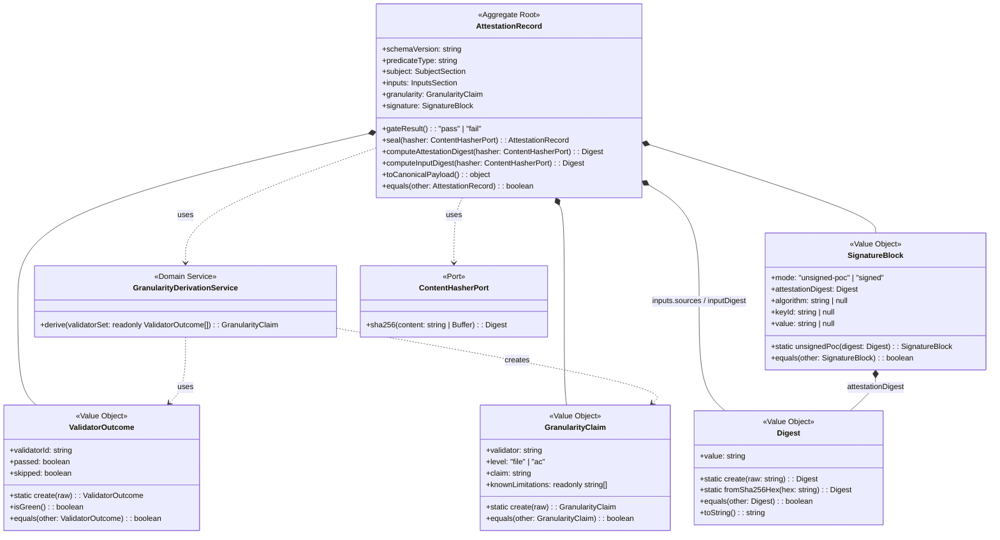

# ドメインモデル: attestation

@story-id H16-01
@story-id H16-02
@work-item-id WI-224
> **Unit ID**: attestation
> **作成日**: 2026-07-05
> **Wave**: 3（品質保証拡張 / 手1 signed attestation PoC）
> **対応ストーリー**: H16-01, H16-02
> **横断契約参照**: cross_cutting_decisions.md §3（errorCode 採番）, §5（所有権）

---

## 1. Ownership / Import-Export

### このUnitが所有する概念

| 概念 | 分類 | 説明 |
|------|------|------|
| AttestationRecord | 集約ルート | attestation ドキュメント全体の整合性境界 |
| Digest | 値オブジェクト | `sha256:<64hex>` 形式の content digest。**この Unit がローカルに所有する**（下記「所有判断」参照） |
| ValidatorOutcome | 値オブジェクト | `{ validatorId, passed, skipped }`。ci-check の1バリデータ結果を写す |
| GranularityClaim | 値オブジェクト | validator set から機械的に導出される検査粒度の主張（L3-004 の file-level 制約を含む） |
| SignatureBlock | 値オブジェクト | `{ mode, attestationDigest, algorithm, keyId, value }`。mode discriminator を持つ |
| GranularityDerivationService | ドメインサービス | validator set + known-limitations registry から `GranularityClaim` を機械導出する |
| ContentHasherPort | ポート | canonical payload や sources の sha256 を計算する（外部→ドメイン） |

### 所有判断: なぜ `Digest` をローカル VO として所有するか

@story-id H16-01

installation Unit には既に `installation/domain/hash.ts`（`Hash` VO）が存在し `sha256:<hex>` を表現できる。しかしこれを import すると **attestation → installation のドメイン間結合** が発生し、依存方向とShared Kernel 境界を汚す。attestation の `Digest` は content-addressed self-digest という本 Unit 固有の不変条件（`sha256:` prefix + 64hex）だけを要求するため、他 Unit の VO へ依存する理由がない。よって attestation は **自前の `Digest` VO をローカル所有**し、cross-unit domain coupling を避ける。`Hash` との重複は意図的なものであり、両者は独立に進化してよい。

### 他Unitから受け取るShared Kernel

| 型名 | 所有Unit | 自Unitでの扱い | 変更可否 |
|------|---------|---------------|---------|
| HarnessError | harness-error | 検証エラー・生成エラー出力 | 読取専用 |

`subject.validatorSet` の元データ（ci-check の `validatorResults`）は **Shared Kernel の型 import ではなく、application 層の `GateResultSourcePort` が返す plain DTO 経由** で受け取る。attestation の domain は harness-api の `CiCheckResult` 型に依存しない（black-box observation）。

### 他Unitへ公開する契約

| 契約 | 消費Unit | 内容 |
|------|---------|------|
| attestation record JSON schema (`phasegate-attestation/v1`) | 外部消費者 / CI | content-addressed な gate-run attestation ドキュメント形式 |

### Shared Kernel利用表

| 型名 | 所有Unit | 自Unitでの扱い | 変更可否 |
|------|---------|---------------|---------|
| HarnessError | harness-error | 検証・生成エラー報告に使用 | 読取専用 |

---

## 2. Aggregate Boundary

### 結論: 単一集約（AttestationRecord）

1つの attestation ドキュメント全体を1つの `AttestationRecord` 集約で管理する。

### なぜ集約にするのか

- **ファイル単位I/O**: attestation は `.harness/attestation.json` 1ファイルとして読み書きされ、`subject` / `inputs` / `granularity` / `signature` の各セクション間で整合性が必要
- **セクション間制約**: `signature.attestationDigest` は document 全体（volatile metadata と signature を除く）から導出される値であり、`subject.gateResult` は `subject.validatorSet` から、`granularity` は `subject.validatorSet` から導出される。これらの整合はファイル全体で保証すべき不変条件
- **不変ライフサイクル**: attestation は一度生成されたら不変（content-addressed）。生成後に部分更新することはなく、検証時は生成時と同じ導出規則で再計算するだけ

### 集約に入れない概念

| 概念 | 理由 |
|------|------|
| GranularityDerivationService | 集約生成のための前処理（validator set → GranularityClaim 導出）。集約自体の責務ではない |
| ContentHasherPort 実装 | sha256 計算は Infrastructure 層 |
| known-limitations registry | validatorId → 制約テキストの静的マップ。ドメインサービスが参照する参照データ |

---

## 3. Model Classification

### 集約

| 集約ルート | 説明 |
|-----------|------|
| **AttestationRecord** | attestation ドキュメント全体。canonical digest と導出値の不変条件を保証する整合性境界 |

### 値オブジェクト

| 値オブジェクト | 不変 | 値等価性 | 説明 |
|-------------|------|---------|------|
| **Digest** | ✅ | ✅ | `sha256:<64hex>`。`sha256:` prefix + 64桁 hex を強制。@story-id H16-01 |
| **ValidatorOutcome** | ✅ | ✅ | `{ validatorId: string, passed: boolean, skipped: boolean }`。ci-check の1バリデータ結果。@story-id H16-01 |
| **GranularityClaim** | ✅ | ✅ | `{ validator, level, claim, knownLimitations }`。検査粒度の主張。@story-id H16-01 |
| **SignatureBlock** | ✅ | ✅ | `{ mode: "unsigned-poc" \| "signed", attestationDigest: Digest, algorithm, keyId, value }`。mode discriminator を持つ。@story-id H16-01 |

### ドメインサービス

| サービス | 責務 | 理由 |
|---------|------|------|
| **GranularityDerivationService** | `readonly ValidatorOutcome[]` + 静的 known-limitations registry から `GranularityClaim` を機械導出する。L3-004 が validator set に存在する場合、`level: "file"` と file-level known-limitation を必ず付与する | 導出ロジックを集約に置くと責務過多。生成時（H16-01）と検証時（H16-02 anti-laundering 再導出）で同一ロジックを共有するため独立サービス化する |

### ポートインターフェース

| ポート | 方向 | 理由 |
|--------|------|------|
| **ContentHasherPort** | 外部→ドメイン | canonical payload / source ファイルの sha256 計算。Node.js `crypto` 依存を domain から隔離 |

---

## 4. Invariants

### AttestationRecord集約の不変条件

| # | 不変条件 | 検証タイミング |
|---|---------|-------------|
| INV-1 | `subject.gateResult == "pass"` iff `subject.validatorSet` の全要素が `passed \|\| skipped`（ci-check の allPassed 規則と同一） | 集約生成時 / 検証時 |
| INV-2 | `signature.attestationDigest` が存在するのは `signature.mode` が設定されているとき、かつそのときに限る（digest present iff mode set） | 集約生成時 |
| INV-3 | `granularity` は常に `subject.validatorSet` から `GranularityDerivationService` で導出可能であり、格納値は導出値と一致する（anti-laundering） | 集約生成時 / 検証時 |
| INV-4 | `signature.attestationDigest` は `signature` ブロックと volatile `metadata`（`producedAt`, `gitCommit`）を除去した document の canonical JSON（キー昇順ソート・空白なし）上の sha256 と一致する | 集約生成時 / 検証時 |
| INV-5 | `inputs.inputDigest` は `inputs.sources` を安定ソート（path 昇順）した上の canonical 表現の sha256 と一致する | 集約生成時 / 検証時 |
| INV-6 | `signature.mode == "unsigned-poc"` のとき `algorithm`/`keyId`/`value` はすべて `null`（unsigned-poc は INTEGRITY のみを証明し AUTHENTICITY は証明しない） | 集約生成時 |
| INV-7 | すべての `Digest` は `sha256:` prefix + 64桁 hex に適合する | `Digest.create()` |
| INV-8 | `acBoundScope` は stored matrix + config allowlist から `AcBoundScopeService.derive()` で再導出可能であり、格納値は再導出値と一致する（option-a determinism / anti-laundering）。story が含まれる ⟺ allowlist 内 かつ 全 linked AC が ≥1 の `binding:"ac"` ref を持つ。acBoundScope は canonical payload に含まれ `attestationDigest` でカバーされる。`granularity.traceability.level`（"file"）とは独立 | 集約生成時 / 検証時 |

### 前提条件

| 前提 | 内容 |
|------|------|
| canonical JSON 規則の安定性 | canonicalization 規則（キー昇順ソート・空白なし・signature/volatile metadata 除外）は record format の load-bearing 契約。変更すると既存 attestation の再検証が失敗するため、schemaVersion を上げずに変更してはならない |
| black-box observation | validator set は ci-check の観測結果であり、attestation domain は検査の意味論を再解釈しない |

---

## 5. Port Boundary

| 操作 | Port越し？ | 理由 |
|------|-----------|------|
| gateResult ↔ validatorSet 整合検証（INV-1） | ❌ ドメイン内 | 集約の不変条件チェック |
| GranularityClaim 導出 | ❌ ドメイン内 | validator set + 静的 registry からの純粋データ変換 |
| Digest 形式検証 | ❌ ドメイン内 | VO の生成規則 |
| canonical JSON 直列化 | ❌ ドメイン内 | 決定論的な純粋関数（キーソート・空白除去） |
| sha256 計算 | ✅ Port越し | Node.js `crypto` 依存を隔離（ContentHasherPort） |
| ci-check --json 実行と結果取得 | ✅ Port越し（application 層） | subprocess 観測。`GateResultSourcePort`（application 所有） |
| attestation ファイル読み書き | ✅ Port越し（application 層） | ファイルシステムI/O。`AttestationRepositoryPort`（application 所有） |

> **ポート配置**: `ContentHasherPort` は domain 層に置く（digest は domain 不変条件 INV-4/INV-5 の一部）。一方 `GateResultSourcePort` と `AttestationRepositoryPort` は集約の不変条件に関与しない調停用ポートのため application 層に置く。詳細は `logical_design.md` §3 / §4。

---

## 6. Archive Carry-over Exclusions

| 旧概念 | 旧出典 | 今回採用しない理由 | 置換先 |
|--------|--------|----------------|--------|
| ed25519 KeyPair / Signer | signed attestation 将来案 | PoC は unsigned-poc のみ。鍵管理は本 Unit のスコープ外 | `signature.mode: "signed"` 拡張点として予約（未実装） |
| in-toto / SLSA predicate 全体 | 外部 attestation 標準 | v1 は自前の最小 predicate に限定。標準準拠は将来検討 | `predicateType` フィールドで将来差し替え可能 |
| installation `Hash` VO | installation/domain/hash.ts | cross-unit domain coupling 回避（§1 所有判断） | ローカル `Digest` VO |

---

## 7. State Transitions

`AttestationRecord` は content-addressed な不変ドキュメントであり、生成後の状態遷移を持たない。

```
    [Derived] ──seal(hasher)──> [Sealed]
      │                            │
      │ (validatorSet/inputs/       │ attestationDigest 確定
      │  granularity 確定)          │ 以降 immutable
      v                            v
   （導出済み・未封印）          （封印済み・検証可能）
```

※ `Derived` は導出値（gateResult, granularity, sources, inputDigest）が揃った状態、`Sealed` は `signature.attestationDigest` が canonical payload から確定した状態。検証（H16-02）は `Sealed` な record を読み込み、生成時と同じ導出・ハッシュ規則で再計算して一致を確認するだけで、状態を変えない。

---

## 8. Domain Events

Wave 3（本 PoC）ではドメインイベント基盤は構築しない。

将来的に以下が検討される:
- `AttestationSealed`: attestationDigest 確定時
- `AttestationVerificationFailed`: 再検証で mismatch を検出した時

---

## 9. Class Diagram

> **注**: 以下のクラス図は `logical_design.md` §1.4 の canonicalization 契約に準拠。
> 外部参照型: `HarnessError`（harness-error所有）



補足:
- `SubjectSection` = `{ command: "phasegate:ci-check", gateResult, validatorSet: ValidatorOutcome[] }`
- `InputsSection` = `{ digestAlgorithm: "sha256", sources: { path, digest: Digest }[], inputDigest: Digest }`
- `metadata`（`producedAt`, `producer`, `gitCommit`）は集約の不変条件に関与しない volatile セクションであり、canonical payload から除外される（INV-4）。domain では plain データとして保持するのみ

---

## 10. Open Questions（論理設計へ持ち越し）

| # | 質問 | 影響範囲 |
|---|------|---------|
| OQ-1 | canonical JSON 直列化を domain のユーティリティ純粋関数として持たせるか、専用の Canonicalizer VO を切るか | Domain層設計 |
| OQ-2 | known-limitations registry を静的 TS マップにするか JSON 外部ファイル化するか | Infrastructure / Domain 境界 |
| OQ-3 | `signed` mode 実装時に KeyResolverPort を domain / application どちらに置くか | 将来拡張 |
<!-- @work-item-id WI-224 -->

---

## 11. WI-286: Unit非依存SHA-256 public capability

<!-- @work-item-id WI-286 -->

@story-id H17-01

attestationはSHA-256 primitiveのdeployment ownerとして、plain public contractをapplication境界に追加する。

| Concept | Classification | Ownership |
|---|---|---|
| `Sha256Capability` | application public port | `Uint8Array`をhashしplain `sha256:<64 lowercase hex>`を返す |
| `Sha256DigestString` | public scalar | 他UnitのVOではなくserialized boundary value |
| `hashUtf8` | pure public helper | `TextEncoder` bytesをcapabilityへ委譲 |
| `ContentHasherPort` | domain internal port | 既存attestation aggregateの`Digest`導出を維持 |
| `Digest` | domain local VO | public contractへ露出しない |

`Sha256Capability`と`ContentHasherPort`を継承関係にせず、infrastructure adapterがplain digestを`Digest.create`へ変換する。これによりWorldはattestation domainをimportせず、将来consumer-owned `WorldHashingPort`へadaptできる。

追加invariant:

1. public resultは`^sha256:[0-9a-f]{64}$`。
2. `hashUtf8`はUnicode normalizationを行わず`TextEncoder` semanticsを使う。
3. SHA-256 algorithm fallbackを持たない。
4. 既存attestation `Digest` / record schema / canonical payloadは変更しない。

## 12. WI-306: versioned World snapshot root evidence

<!-- @work-item-id WI-306 -->

@story-id H17-18

`AttestationRecord`はv2でoptional domain property `worldSnapshotRoot: Digest | null`を所有する。v1はroot absent、v2はroot requiredとし、schema / predicate / presenceを一体のversion invariantとして扱う。rootはWorldのcanonical `corpusRoot`一件であり、Fragment、Node、PathKey、個別content digestをaggregateへ複製しない。

`WorldSnapshotRootProvider`はapplication consumer portでplain SHA-256 stringだけを返す。provider未配線はv1互換produce、配線済みはv2 produceとし、provider失敗 / invalid digestは未封印recordを保存しない。v2 rootはcanonical payload、seal、equalsへ含まれ、改竄はattestationDigest不一致になる。
