# ドメインモデル: biome-ast-engine

@story-id H01-01
@story-id H01-02
@story-id H01-03
> **Unit ID**: biome-ast-engine
> **作成日**: 2026-03-13
> **最終更新**: 2026-03-17（H01-01, H01-02, H01-03 実装完了後の cascade update）
> **Wave**: 1（基盤構築）
> **対応ストーリー**: H01-01, H01-02, H01-03
> **横断契約参照**: cross_cutting_decisions.md §2（Layer語彙）, §6（集約降格）

---

## 1. Ownership / Import-Export

### このUnitが所有する概念

| 概念 | 分類 | 説明 |
|------|------|------|
| RuleDefinition | 値オブジェクト | 不変のルール定義（8ルール: L1-001〜L1-008）|
| RuleName | 値オブジェクト | ルール識別子 |
| RuleType | 値オブジェクト | ExternalAnalyzer（全8ルールがTS実装）|
| RuleSeverity | 型エイリアス | `"error" \| "warning"` |
| RuleViolation | 値オブジェクト | ルール違反検出結果 |
| LintReport | 値オブジェクト | lint実行結果の集約レポート |
| SourceModuleSnapshot | 値オブジェクト | ソースファイルの静的解析スナップショット（import情報・メトリクス） |
| ImportGraph | 値オブジェクト | モジュール依存グラフ |
| ImportEdge | 値オブジェクト | 依存グラフの辺（importKind付き） |
| ImportCycle | 値オブジェクト | 循環依存パス |
| LayerBoundary | 値オブジェクト | レイヤー依存方向の定義 |
| LayerName | 値オブジェクト | 正規レイヤー名（domain/application/infrastructure/presentation） |
| FilePath | 値オブジェクト | Unit内ローカルファイルパス |
| RequiredInput | 値オブジェクト | ルールが必要とする入力データの宣言型 |
| RuleDefinitionRegistry | ドメインサービス | ルール定義カタログ管理 |
| LintRunner | ドメインサービス | lint実行オーケストレーション |
| ImportGraphBuilder | ドメインサービス | SnapshotからImportGraph構築 |

### 他Unitから受け取るShared Kernel

| 型名 | 所有Unit | 自Unitでの扱い | 変更可否 |
|------|---------|---------------|---------|
| HarnessError | harness-error | RuleViolationをHarnessError形式に変換して出力 | 読取専用 |
| HarnessConfigV2 | config-foundation | `layers.L1`からルール有効/無効・severity設定を取得 | 読取専用 |

### 他Unitへ公開する契約

| 契約 | 消費Unit | 内容 |
|------|---------|------|
| RuleViolation Contract | validator-system | `{ filePath, line, column, ruleName, message, severity, fix_example? }` |
| @unit/@layerメタデータL1存在チェック | traceability-model | L1レベルでのメタデータ存在検証結果 |

---

## 2. Aggregate Boundary

### 結論: 集約なし

biome-ast-engineはステートレスなリンター/AST解析ドメインであり、集約を必要としない。

### なぜ集約にしないのか

- **RuleDefinition**: 不変でバージョニング不要。設定駆動で有効/無効が切り替わるが、RuleDefinition自体のライフサイクルは存在しない
- **LintReport**: 実行結果のスナップショットであり、永続化や状態遷移が不要
- **SourceModuleSnapshot**: ファイルシステムの静的解析結果。毎回新規構築される
- **ImportGraph**: SourceModuleSnapshotから毎回構築される

### 集約に入れない概念

| 概念 | 理由 |
|------|------|
| BiomeRule（v0） | v0では集約だったが、ルールの有効/無効はHarnessConfigV2で管理されるため独立ライフサイクルなし。RuleDefinition VOに降格 |
| LintExecution（v0） | v0では集約だったが、実行状態管理は不要。LintRunner + LintReportに分解 |
| AntiPatternDetector（v0） | v0では集約だったが、ExternalAnalyzer型ルールとして統一的に扱えるため不要 |

---

## 3. Model Classification

### 値オブジェクト

| 値オブジェクト | 不変 | 値等価性 | 説明 |
|-------------|------|---------|------|
| **RuleDefinition** | ✅ | ✅ | `{ name, type, enabled, severity, supportsAutofix, requiredInputs, config, errorCode, description, suggestion }`。withSeverity()/disable()で新インスタンスを生成 |
| **RuleName** | ✅ | ✅ | 8つの定義済みルール名（require-unit-comment〜no-comment-flood）のいずれか |
| **RuleType** | ✅ | ✅ | ExternalAnalyzer（全8ルールTS実装）。BiomeNative型は定義済みだがH01移行後は未使用 |
| **RequiredInput** | ✅ | ✅ | `'source-module-snapshots' \| 'import-graph' \| 'biome-diagnostics' \| 'workspace-inventory'` |
| **RuleViolation** | ✅ | ✅ | `{ filePath, line, column, ruleName, message, severity, fix_example? }` |
| **LintReport** | ✅ | ✅ | `{ violations[], passedRules[], skippedRules[], durationMs, scannedFiles }` |
| **SourceModuleSnapshot** | ✅ | ✅ | ファイルのAST解析スナップショット。import情報・anyCount・コメント・重複フィンガープリント等を含む |
| **ImportGraph** | ✅ | ✅ | `{ nodes: FilePath[], edges: ImportEdge[], rootNodes: FilePath[] }` |
| **ImportEdge** | ✅ | ✅ | `{ from: FilePath, to: FilePath, importKind: 'value' \| 'type' \| 'dynamic' }` |
| **ImportCycle** | ✅ | ✅ | `{ path: FilePath[], edgeCount: number }` |
| **LayerBoundary** | ✅ | ✅ | `{ sourceLayer, targetLayer, allowed }` 依存方向の許可/禁止 |
| **LayerName** | ✅ | ✅ | `domain \| application \| infrastructure \| presentation`（横断契約§2） |
| **FilePath** | ✅ | ✅ | プロジェクトルートからの相対パス |

### ドメインサービス

| サービス | 責務 | 理由 |
|---------|------|------|
| **RuleDefinitionRegistry** | 8ルールのカタログ管理・`resolveEnabled()`でHarnessConfigV2設定を反映した有効ルール一覧を返す | カタログ型参照。設定の解釈ロジックを集約 |
| **LintRunner** | SnapshotとImportGraphを入力に全ルールを評価し、LintReportを生成 | 複数RuleDefinitionを横断する実行制御。各ルールのswitch評価を一元管理 |
| **ImportGraphBuilder** | SourceModuleSnapshot[]からImportGraphを構築 | エントリポイント検出ロジックとエッジフィルタリングを含む |

### ポートインターフェース

| ポート | 方向 | 責務 |
|--------|------|------|
| **BiomeExecutorPort** | 外部→ドメイン | Biome CLIのサブプロセス起動・結果パース |
| **SourceModuleAnalyzerPort** | 外部→ドメイン | ファイル群をAST解析してSourceModuleSnapshot[]を生成 |
| **WorkspaceFilePort** | 外部→ドメイン | ファイル一覧取得・テキスト読み取り・存在確認 |
| **WorkspaceInventoryPort** | 外部→ドメイン | ESLintアーティファクト検出（configFiles・packageDependencies） |
| **RuleConfigProviderPort** | 外部→ドメイン | HarnessConfigV2からL1ルール設定を取得 |
| **ViolationFormatterPort** | 外部→ドメイン | RuleViolation[]をHarnessError形式の出力オブジェクトに変換 |
| **ClockPort** | 外部→ドメイン | 実行時刻取得（テスタビリティのため注入） |

---

## 4. Invariants

| # | 不変条件 | 検証タイミング |
|---|---------|-------------|
| INV-1 | RuleNameは定義済み8ルール名のいずれかである | RuleName.fromString()時 |
| INV-2 | RuleTypeはExternalAnalyzer（またはBiomeNative）のいずれかである | RuleType.fromString()時 |
| INV-3 | LayerNameは`domain/application/infrastructure/presentation`のいずれかである（横断契約§2） | LayerName.fromString()時 |
| INV-4 | レイヤー依存方向は`domain ← application ← {infrastructure, presentation}`に従う | ImportGraph.findLayerViolations()時 |
| INV-4b | ImportGraph.rootNodesはnodesのサブセットである | ImportGraph.create()時 |
| INV-5 | RuleViolationのseverityは`error`または`warning`である | RuleViolation.create()時 |
| INV-6 | LintReportの全violationsのruleNameはRuleDefinitionRegistryに登録済みである | LintRunner.run()時 |
| INV-7 | RequiredInputのvalueは定義済み4種のいずれかである | RequiredInput.fromString()時 |
| INV-8 | RuleDefinition.errorCodeはL1-001〜L1-008の範囲である | RuleDefinition.create()時 |
| INV-9 | SourceModuleSnapshotの数値メトリクス（anyTypeCount等）は0以上である | SourceModuleSnapshot.create()時 |
| INV-10 | ImportCycleのpathは2要素以上である | ImportCycle.create()時 |
| INV-11 | LintReport.durationMs・scannedFilesは0以上である | LintReport.create()時 |

### Shared Kernelに対する前提条件

| 前提 | 内容 |
|------|------|
| HarnessConfigV2.layers.L1 | L1ルールの有効/無効・severity設定が含まれる |
| HarnessError.code | L1ルールのエラーはL1-001〜L1-008の範囲 |

---

## 5. Port Boundary

| 操作 | Port越し？ | 理由 |
|------|-----------|------|
| RuleDefinition構築 | ❌ ドメイン内 | 静的定義のインメモリ操作 |
| LayerBoundary検証 | ❌ ドメイン内 | 純粋なルールロジック |
| ImportGraph構築（Snapshotから） | ❌ ドメイン内 | ImportGraphBuilder内の純粋計算 |
| Biome CLI実行 | ✅ Port越し | サブプロセス起動（BiomeExecutorPort） |
| ファイル一覧・読み取り | ✅ Port越し | ファイルシステムアクセス（WorkspaceFilePort） |
| AST解析・Snapshot生成 | ✅ Port越し | TS Compiler API利用（SourceModuleAnalyzerPort） |
| HarnessConfigV2取得 | ✅ Port越し | 他Unitの設定読み取り（RuleConfigProviderPort） |
| RuleViolation→HarnessError変換 | ✅ Port越し | Shared Kernel利用（ViolationFormatterPort） |
| ESLintアーティファクト検出 | ✅ Port越し | ファイルシステム・package.json参照（WorkspaceInventoryPort） |
| 実行時刻取得 | ✅ Port越し | テスタビリティ（ClockPort） |

---

## 6. Archive Carry-over Exclusions

| 旧概念 | 旧出典 | 今回採用しない理由 | 置換先 |
|--------|--------|----------------|--------|
| BiomeRule集約 | v0 biome-toolchain | ルールの有効/無効はHarnessConfigV2管理。独立ライフサイクルなし | RuleDefinition VO + RuleDefinitionRegistry |
| LintExecution集約 | v0 biome-toolchain | 実行状態管理不要。ステートレス実行 | LintRunner サービス + LintReport VO |
| AntiPatternDetector集約 | v0 biome-toolchain | RuleType.ExternalAnalyzerで統一的に扱える | RuleDefinitionRegistry内のExternalAnalyzer型ルール |
| HookConfiguration集約 | v0 biome-toolchain | Hook設定はHarnessConfigV2の責務 | config-foundation Unit |
| CIGateConfiguration集約 | v0 biome-toolchain | CI設定はci-governance Unitの責務 | ci-governance Unit |
| ParityTestService | v0 biome-toolchain | ESLint→Biome移行完了後は不要 | テストコードでのパリティ検証 |
| FileReaderPort | 初期domain_model設計 | SourceModuleAnalyzerPortに昇格・置換。単純ファイル読み取りからAST解析スナップショット生成に責務拡張 | SourceModuleAnalyzerPort |
| RuleType.BiomeNative実用 | 初期domain_model設計 | Biome v2のGritQLはコメントパターン未対応のため全ルールExternalAnalyzerで実装。BiomeNative型は将来用に定義のみ残存 | ExternalAnalyzer型ルール（TS実装） |

---

## 7. State Transitions

biome-ast-engineには状態遷移を持つエンティティ・集約が存在しない。すべての概念は不変値オブジェクトである。

LintRunner実行フローは以下の通り（状態遷移ではなくデータフロー）：

```
WorkspaceFilePort.listSourceFiles()
  → SourceModuleAnalyzerPort.analyzeMany(files)
      → SourceModuleSnapshot[] 生成
  → ImportGraphBuilder.build(snapshots)
      → ImportGraph 構築（rootNodes含む）
  → RuleConfigProviderPort.getL1Config()
      → L1Config 取得
  → RuleDefinitionRegistry.resolveEnabled({l1Enabled, rules})
      → enabledRules: RuleDefinition[], skippedRules: RuleName[]
  → ClockPort.now()  [開始時刻取得]
  → LintRunner.run({rules, snapshots, importGraph, durationMs})
      → 各ルールswitch評価 → RuleViolation[]
      → LintReport 生成
  → ViolationFormatterPort.format(violations)
      → HarnessError形式の出力
```

---

## 8. Domain Events

Wave 1ではドメインイベント基盤は構築しない。

---

## 9. Class Diagram

> **外部参照型**: `HarnessError`（harness-error所有）、`L1Config`（config-foundation所有、`HarnessConfigV2.layers.L1`の型）

```mermaid
classDiagram
    class L1Config {
        <<External: config-foundation>>
        +enabled: boolean
        +rules: Record~string, RuleSetting~
    }

    class RequiredInput {
        <<Value Object>>
        +value: "source-module-snapshots" | "import-graph" | "biome-diagnostics" | "workspace-inventory"
        +equals(other: RequiredInput): boolean
        +toString(): string
    }

    class RuleDefinition {
        <<Value Object>>
        +name: RuleName
        +type: RuleType
        +enabled: boolean
        +severity: RuleSeverity
        +supportsAutofix: boolean
        +requiredInputs: RequiredInput[]
        +config: Record~string, unknown~
        +errorCode: string
        +description: string
        +suggestion: string
        +isEnabled(): boolean
        +usesInput(input: RequiredInput): boolean
        +withSeverity(s: RuleSeverity): RuleDefinition
        +disable(): RuleDefinition
        +equals(other: RuleDefinition): boolean
    }

    class RuleName {
        <<Value Object>>
        +value: string
        +equals(other: RuleName): boolean
        +toString(): string
    }

    class RuleType {
        <<Value Object>>
        +value: "BiomeNative" | "ExternalAnalyzer"
        +equals(other: RuleType): boolean
    }

    class RuleViolation {
        <<Value Object>>
        +filePath: FilePath
        +line: number
        +column: number
        +ruleName: RuleName
        +message: string
        +severity: RuleSeverity
        +fix_example?: string
    }

    class LintReport {
        <<Value Object>>
        +violations: RuleViolation[]
        +passedRules: RuleName[]
        +skippedRules: RuleName[]
        +durationMs: number
        +scannedFiles: number
        +hasErrors(): boolean
        +errorCount(): number
        +warningCount(): number
        +violationCount(): number
    }

    class SourceModuleSnapshot {
        <<Value Object>>
        +filePath: FilePath
        +declaredUnit: string | null
        +declaredLayer: LayerName | null
        +imports: ImportEdge[]
        +anyTypeCount: number
        +typedNodeCount: number
        +commentLineCount: number
        +logicalLineCount: number
        +repeatedCommentBlocks: number
        +duplicationFingerprints: string[]
        +exportedSymbols: string[]
        +isEntrypointCandidate: boolean
        +hasUnitComment(): boolean
        +hasLayerComment(): boolean
        +anyRatio(): number
        +commentDensity(): number
        +belongsToLayerDirectory(): boolean
    }

    class ImportGraph {
        <<Value Object>>
        +nodes: FilePath[]
        +edges: ImportEdge[]
        +rootNodes: FilePath[]
        +detectCycles(): ImportCycle[]
        +findLayerViolations(boundaries, layerByFile): ImportEdge[]
        +findGhostFiles(ignorePatterns): FilePath[]
        +incomingCount(filePath): number
        +outgoingEdgesOf(filePath): ImportEdge[]
    }

    class ImportEdge {
        <<Value Object>>
        +from: FilePath
        +to: FilePath
        +importKind: "value" | "type" | "dynamic"
        +equals(other: ImportEdge): boolean
        +isTypeOnly(): boolean
        +touches(filePath: FilePath): boolean
    }

    class ImportCycle {
        <<Value Object>>
        +path: FilePath[]
        +edgeCount: number
        +includes(filePath: FilePath): boolean
        +firstEdge(): [FilePath, FilePath]
    }

    class LayerBoundary {
        <<Value Object>>
        +sourceLayer: LayerName
        +targetLayer: LayerName
        +allowed: boolean
        +standardMatrix(): LayerBoundary[]
    }

    class LayerName {
        <<Value Object>>
        +value: "domain" | "application" | "infrastructure" | "presentation"
        +equals(other: LayerName): boolean
        +toPathSegment(): string
    }

    class FilePath {
        <<Value Object>>
        +value: string
        +getLayer(): LayerName?
        +getUnit(): string?
        +segments(): string[]
        +equals(other: FilePath): boolean
        +toString(): string
    }

    class RuleDefinitionRegistry {
        <<Domain Service>>
        +getAll(): RuleDefinition[]
        +resolveEnabled(input: ResolveEnabledInput): ResolvResult
        +getByName(name: RuleName): RuleDefinition
    }

    class LintRunner {
        <<Domain Service>>
        +run(params: LintRunnerParams): LintReport
    }

    class ImportGraphBuilder {
        <<Domain Service>>
        +build(snapshots: SourceModuleSnapshot[]): ImportGraph
    }

    class BiomeExecutorPort {
        <<Port>>
        +execute(rules: RuleDefinition[], files: FilePath[]): RuleViolation[]
    }

    class SourceModuleAnalyzerPort {
        <<Port>>
        +analyzeMany(files: FilePath[]): Promise~SourceModuleSnapshot[]~
    }

    class WorkspaceFilePort {
        <<Port>>
        +listSourceFiles(targets?: string[]): Promise~FilePath[]~
        +readText(filePath: FilePath): Promise~string~
        +exists(filePath: FilePath): Promise~boolean~
    }

    class WorkspaceInventoryPort {
        <<Port>>
        +findLegacyEslintArtifacts(): Promise~EslintArtifacts~
    }

    class RuleConfigProviderPort {
        <<Port>>
        +getL1Config(): L1Config
    }

    class ViolationFormatterPort {
        <<Port>>
        +format(violations: RuleViolation[]): Promise~FormattedViolation[]~
    }

    class ClockPort {
        <<Port>>
        +now(): number
    }

    RuleDefinition *-- RuleName
    RuleDefinition *-- RuleType
    RuleDefinition o-- RequiredInput
    RuleViolation *-- RuleName
    RuleViolation *-- FilePath
    LintReport o-- RuleViolation
    LintReport o-- RuleName
    SourceModuleSnapshot *-- FilePath
    SourceModuleSnapshot o-- ImportEdge
    SourceModuleSnapshot *-- LayerName
    ImportGraph o-- ImportEdge
    ImportGraph o-- FilePath
    ImportEdge *-- FilePath
    ImportCycle o-- FilePath
    LayerBoundary *-- LayerName
    RuleDefinitionRegistry o-- RuleDefinition
    LintRunner ..> RuleDefinitionRegistry : uses
    LintRunner ..> LintReport : creates
    ImportGraphBuilder ..> SourceModuleSnapshot : consumes
    ImportGraphBuilder ..> ImportGraph : creates
```



---

## 10. Open Questions（解決済み）

| # | 質問（初期） | 解決内容 |
|---|------|---------|
| OQ-1 | RuleDefinitionのconfigフィールドの型 | `Record<string, unknown>` で許容。errorCode/description/suggestionを別フィールドとして型付け |
| OQ-2 | ImportGraphBuilderの対象ファイル範囲制御 | SourceModuleAnalyzerPortで解析対象を制御し、BuilderはSnapshot配列を受け取る設計に |
| OQ-3（追加） | BiomeNative型ルールはいつ使われるか | Biome v2 GritQLのコメントパターン対応が成熟次第。現時点では全ルールExternalAnalyzer |
## Architecture Semantic Policy Primitives

<!-- @work-item-id WI-119, WI-134, WI-135 -->

The AST engine exposes language-specific source facts while keeping validator policy language-independent. Architecture specs can carry side-effect capability policies and decision responsibility policies in addition to layer dependency rules.

<!-- @work-item-id WI-161 -->
## WI-161 Operational Validator Source Facts

Biome AST engine supplies source facts for G5 validators without owning validator policy.

| Source fact | Consumer |
|---|---|
| Token-family candidates and keyword context | `L3-001 security` scanner for redacted secret findings. |
| Await-in-loop, sync I/O, large literal size, and suppression marker evidence | `L3-002 performance` scanner. |
| Direct export, default export, named re-export, wildcard re-export, dynamic import, and generated/test/fixture classification | `L4-003 dead-code` graph. |
| Side-effect capability evidence and decision signal evidence | `L4-002 architecture semantic analysis`. |

Architecture `capabilityPolicies` and `decisionPolicies` are resolved from config-foundation presets. The AST engine reports observations; validator-system decides severity and whether a finding is advisory.

## WI-212 TypeScript Analyzer Capability

<!-- @work-item-id WI-212 -->

The existing source module analyzer is a TypeScript language adapter. It owns TypeScript source facts only and does not attempt to parse Python, Go, Rust, or other language files. Validator-system dispatch prevents unsupported language files from reaching this adapter.
