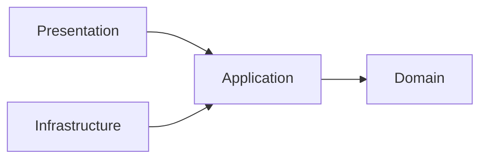

# 論理設計: biome-ast-engine

@story-id H01-01
@story-id H01-02
@story-id H01-03
@work-item-id WI-024
@work-item-id WI-239
> **作成日**: 2026-03-13
> **対応ストーリー**: H01-01, H01-02, H01-03
> **モード**: Unit横断設計（Phase 2）
> **前提ドキュメント**: `domain_model.md`（同ディレクトリ）, `docs/inception/biome-ast-engine/logical_design_plan.md`, `docs/product/units/biome_ast_engine_unit.md`, `docs/product/units/integration_contract.md`
>
> `@story-id H01-01`
> `@story-id H01-02`
> `@story-id H01-03`

---

## 1. アーキテクチャ概要

### 1.1 層構成と責務

| 層 | 責務 | 依存先 |
|----|------|--------|
| domain | 8ルールの不変定義、importグラフ不変条件、違反判定、LintReport集約結果の構築 | なし |
| application | 設定取得、解析対象ファイル収集、AST解析とBiome CLI実行の調停、ドメインサービス実行、CLI向けDTO組み立て | domain |
| infrastructure | TypeScript AST解析、ファイルI/O、Biome CLI実行、HarnessConfigV2読取、HarnessError変換、ESLint残存検査 | application, domain |
| presentation | `phasegate:lint` の引数解釈、UseCase呼び出し、JSON/テキスト出力、終了コード決定 | application |

### 1.2 依存方向

```text
domain <- application <- infrastructure
domain <- application <- presentation
```



- `domain` は外部ライブラリ型、Node.js API、Biome CLI結果型を直接参照しない
- `application` はポート経由でのみ外部要素へアクセスする
- `infrastructure` は `domain/ports/` の実装だけを担い、ドメイン判断は持ち込まない
- `presentation` は CLI の入出力変換に限定し、ルール判定や設定解釈を持たない
- v0語彙の `port / usecase / controller` はファイル名や役割説明にのみ残しうるが、論理層名としては使用しない

### 1.3 ディレクトリ構成（全ファイル一覧）

```text
scripts/harness/
├── biome-ast-engine/
│   ├── domain/
│   │   ├── errors/
│   │   │   └── biome-ast-engine-domain-error.ts
│   │   ├── ports/
│   │   │   ├── biome-executor-port.ts
│   │   │   ├── clock-port.ts
│   │   │   ├── rule-config-provider-port.ts
│   │   │   ├── source-module-analyzer-port.ts
│   │   │   ├── violation-formatter-port.ts
│   │   │   ├── workspace-file-port.ts
│   │   │   └── workspace-inventory-port.ts
│   │   ├── services/
│   │   │   ├── import-graph-builder.ts
│   │   │   ├── lint-runner.ts
│   │   │   └── rule-definition-registry.ts
│   │   ├── value-objects/
│   │   │   ├── file-path.ts
│   │   │   ├── import-cycle.ts
│   │   │   ├── import-edge.ts
│   │   │   ├── import-graph.ts
│   │   │   ├── layer-boundary.ts
│   │   │   ├── layer-name.ts
│   │   │   ├── lint-report.ts
│   │   │   ├── required-input.ts
│   │   │   ├── rule-definition.ts
│   │   │   ├── rule-name.ts
│   │   │   ├── rule-type.ts
│   │   │   ├── rule-violation.ts
│   │   │   └── source-module-snapshot.ts
│   │   └── index.ts
│   ├── application/
│   │   ├── dto/
│   │   │   ├── analyze-import-graph-input.ts
│   │   │   ├── analyze-import-graph-output.ts
│   │   │   ├── build-harness-error-payload-input.ts
│   │   │   ├── build-harness-error-payload-output.ts
│   │   │   ├── execute-lint-input.ts
│   │   │   ├── execute-lint-output.ts
│   │   │   ├── register-rule-catalog-output.ts
│   │   │   ├── resolve-enabled-rules-input.ts
│   │   │   ├── resolve-enabled-rules-output.ts
│   │   │   ├── verify-eslint-removal-input.ts
│   │   │   └── verify-eslint-removal-output.ts
│   │   ├── usecases/
│   │   │   ├── analyze-import-graph-usecase.ts
│   │   │   ├── build-harness-error-payload-usecase.ts
│   │   │   ├── execute-lint-usecase.ts
│   │   │   ├── register-rule-catalog-usecase.ts
│   │   │   ├── resolve-enabled-rules-usecase.ts
│   │   │   └── verify-eslint-removal-usecase.ts
│   │   └── index.ts
│   ├── infrastructure/
│   │   ├── adapters/
│   │   │   ├── biome-cli-executor-adapter.ts
│   │   │   ├── harness-config-provider-adapter.ts
│   │   │   ├── harness-error-formatter-adapter.ts
│   │   │   ├── node-workspace-file-adapter.ts
│   │   │   ├── typescript-source-module-analyzer-adapter.ts
│   │   │   └── workspace-inventory-adapter.ts
│   │   ├── mappers/
│   │   │   ├── biome-diagnostic-mapper.ts
│   │   │   ├── rule-violation-code-mapper.ts
│   │   │   └── source-module-snapshot-mapper.ts
│   │   ├── parsers/
│   │   │   ├── comment-density-parser.ts
│   │   │   ├── layer-comment-parser.ts
│   │   │   └── unit-comment-parser.ts
│   │   ├── process/
│   │   │   └── node-process-runner.ts
│   │   └── index.ts
│   ├── presentation/
│   │   ├── cli/
│   │   │   ├── harness-lint-command-handler.ts
│   │   │   └── lint-command-parser.ts
│   │   ├── formatters/
│   │   │   └── lint-cli-presenter.ts
│   │   └── index.ts
│   └── index.ts
└── __tests__/
    └── biome-ast-engine/
        ├── application/
        │   ├── analyze-import-graph-usecase.test.ts
        │   ├── build-harness-error-payload-usecase.test.ts
        │   ├── execute-lint-usecase.test.ts
        │   ├── resolve-enabled-rules-usecase.test.ts
        │   └── verify-eslint-removal-usecase.test.ts
        ├── domain/
        │   ├── import-graph-builder.test.ts
        │   ├── lint-runner.test.ts
        │   ├── rule-definition-registry.test.ts
        │   └── value-objects/
        │       ├── file-path.test.ts
        │       ├── import-graph.test.ts
        │       ├── layer-boundary.test.ts
        │       ├── rule-definition.test.ts
        │       ├── rule-name.test.ts
        │       ├── rule-violation.test.ts
        │       └── source-module-snapshot.test.ts
        ├── fixtures/
        │   ├── application/
        │   │   ├── comment-flood/noisy-comments.ts
        │   │   ├── duplication/duplicate-a.ts
        │   │   ├── duplication/duplicate-b.ts
        │   │   ├── layer-violation/invalid-domain-import.ts
        │   │   ├── layer-violation/valid-application-service.ts
        │   │   └── metadata/
        │   │       ├── missing-layer.ts
        │   │       └── missing-unit.ts
        │   ├── infrastructure/
        │   │   ├── biome-json-report.json
        │   │   └── package-with-eslint.json
        │   └── workspace/
        │       ├── biome-ast-engine/
        │       │   ├── application/execute-lint-usecase.ts
        │       │   ├── domain/rule-definition.ts
        │       │   ├── infrastructure/biome-cli-executor-adapter.ts
        │       │   └── presentation/harness-lint-command-handler.ts
        │       └── eslint-legacy/
        │           ├── .eslintrc.cjs
        │           └── eslint.config.js
        ├── infrastructure/
        │   ├── biome-cli-executor-adapter.test.ts
        │   ├── harness-config-provider-adapter.test.ts
        │   ├── harness-error-formatter-adapter.test.ts
        │   ├── node-workspace-file-adapter.test.ts
        │   ├── typescript-source-module-analyzer-adapter.test.ts
        │   └── workspace-inventory-adapter.test.ts
        └── presentation/
            └── harness-lint-command-handler.test.ts
```

### 1.4 ルール実行の責務分担

| ルール | 実行主体 | ドメインで使う入力 |
|--------|----------|-------------------|
| require-unit-comment | `LintRunner` | `SourceModuleSnapshot.declaredUnit` |
| require-layer-comment | `LintRunner` | `SourceModuleSnapshot.declaredLayer` |
| no-layer-violation | `LintRunner` | `ImportGraph`, `LayerBoundary` |
| enforce-folder-structure | `LintRunner` | `SourceModuleSnapshot.filePath`, `SourceModuleSnapshot.declaredLayer` |
| no-any-abuse | `LintRunner` | `SourceModuleSnapshot.anyTypeCount`, `typedNodeCount` |
| no-code-duplication | `LintRunner` | `SourceModuleSnapshot.duplicationFingerprints` |
| no-ghost-file | `LintRunner` | `ImportGraph.rootNodes`, `ImportGraph.findGhostFiles()` |
| no-comment-flood | `LintRunner` | `SourceModuleSnapshot.commentLineCount`, `logicalLineCount`, `repeatedCommentBlocks` |

- H01スコープの8ルールはすべて TypeScript 実装で評価し、v0の `RustPlugin` は採用しない
- `RuleType` は `BiomeNative | ExternalAnalyzer` の2値のみを許容する
- H01の8ルールは `ExternalAnalyzer` として登録し、Biome CLIは標準lint/format診断の収集に限定する

---

## 2. Domain層設計

### 2.1 集約ルート

#### 2.1.1 結論: 集約ルートは持たない

`biome-ast-engine` はステートレスな解析Unitであり、独立ライフサイクルを持つエンティティを扱わない。そのため v0 の `BiomeRule` / `LintExecution` 集約は採用せず、以下に分解する。

| v0概念 | v1での置換先 | 理由 |
|--------|--------------|------|
| BiomeRule | `RuleDefinition` + `RuleDefinitionRegistry` | ルール定義は不変、enabled/severity は設定注入後の値 |
| LintExecution | `LintRunner` + `LintReport` | 実行状態を永続化しない |
| RustPlugin | 廃止 | H01-03 移行方針により完全削除 |

#### 2.1.2 集約非採用時の不変条件

| ID | 内容 |
|----|------|
| INV-D-01 | `RuleName` は定義済み8ルール名のいずれかである |
| INV-D-02 | `RuleType` は `BiomeNative` または `ExternalAnalyzer` のいずれかである |
| INV-D-03 | `LayerName` は `domain/application/infrastructure/presentation` のいずれかである |
| INV-D-04 | `ImportGraph` の全エッジは登録済みノード間を結ぶ |
| INV-D-05 | `RuleViolation.severity` は `error` または `warning` である |
| INV-D-06 | `LintReport.passedRules` と `skippedRules` は互いに排他的である |
| INV-D-07 | `LintReport.violations[*].ruleName` は `RuleDefinitionRegistry` に登録済みである |

### 2.2 値オブジェクト群

#### 2.2.1 RuleName

| 属性 | 型 | 説明 |
|------|----|------|
| value | string | ルール識別子 |

**許容値**:
- `require-unit-comment`
- `require-layer-comment`
- `no-layer-violation`
- `enforce-folder-structure`
- `no-any-abuse`
- `no-code-duplication`
- `no-ghost-file`
- `no-comment-flood`

**生成ルール**:
- `RuleName.fromString(value: string): RuleName`
- 上記以外は `InvalidRuleNameError`

**メソッド**:
- `equals(other: RuleName): boolean`
- `toString(): string`
- `isMetadataRule(): boolean`
- `isImportGraphRule(): boolean`

#### 2.2.2 RuleType

| 属性 | 型 | 説明 |
|------|----|------|
| value | `"BiomeNative" | "ExternalAnalyzer"` | 実行経路の識別 |

**生成ルール**:
- `RuleType.fromString(value: string): RuleType`
- `RustPlugin` は受け付けない。入力された場合は `InvalidRuleTypeError`

**メソッド**:
- `isBiomeNative(): boolean`
- `isExternalAnalyzer(): boolean`
- `equals(other: RuleType): boolean`

#### 2.2.3 LayerName

| 属性 | 型 | 説明 |
|------|----|------|
| value | `"domain" | "application" | "infrastructure" | "presentation"` | 横断契約に従う正規レイヤー名 |

**生成ルール**:
- `LayerName.fromString(value: string): LayerName`
- v0語彙（`port`, `usecase`, `controller`）は受け付けない

**メソッド**:
- `equals(other: LayerName): boolean`
- `canDependOn(target: LayerName): boolean`
- `toPathSegment(): string`

#### 2.2.4 FilePath

| 属性 | 型 | 説明 |
|------|----|------|
| value | string | プロジェクトルートからの相対パス |

**生成ルール**:
- `FilePath.fromWorkspaceRelative(value: string): FilePath`
- 空文字、`..` 始まり、絶対パス、Windows drive letter は `InvalidFilePathError`

**メソッド**:
- `equals(other: FilePath): boolean`
- `segments(): readonly string[]`
- `fileName(): string`
- `extension(): string`
- `startsWith(segment: string): boolean`
- `parent(): string`

#### 2.2.5 RequiredInput

| 属性 | 型 | 説明 |
|------|----|------|
| value | `"source-module-snapshots" | "import-graph" | "biome-diagnostics" | "workspace-inventory"` | ルール評価に必要な入力種別 |

**生成ルール**:
- `RequiredInput.fromString(value: string): RequiredInput`

**メソッド**:
- `equals(other: RequiredInput): boolean`

#### 2.2.6 ImportEdge

| 属性 | 型 | 説明 |
|------|----|------|
| from | FilePath | import元ファイル |
| to | FilePath | import先ファイル |
| importKind | `"value" | "type" | "dynamic"` | import種別 |

**生成ルール**:
- `ImportEdge.create(from, to, importKind)`
- `from === to` は許可するが、`ImportGraph.detectCycles()` で自己循環として報告する

**メソッド**:
- `equals(other: ImportEdge): boolean`
- `isTypeOnly(): boolean`
- `touches(filePath: FilePath): boolean`

#### 2.2.7 ImportCycle

| 属性 | 型 | 説明 |
|------|----|------|
| path | readonly FilePath[] | 循環経路 |
| edgeCount | number | 経路長 |

**生成ルール**:
- `ImportCycle.create(path: readonly FilePath[])`
- 2ノード未満は `InvalidImportCycleError`

**メソッド**:
- `includes(filePath: FilePath): boolean`
- `firstEdge(): readonly [FilePath, FilePath]`

#### 2.2.8 LayerBoundary

| 属性 | 型 | 説明 |
|------|----|------|
| sourceLayer | LayerName | 依存元レイヤー |
| targetLayer | LayerName | 依存先レイヤー |
| allowed | boolean | 許可/禁止 |

**生成ルール**:
- `LayerBoundary.create(sourceLayer, targetLayer, allowed)`
- `LayerBoundary.standardMatrix()` で横断契約の正規行列を返す

**メソッド**:
- `allows(source: LayerName, target: LayerName): boolean`
- `equals(other: LayerBoundary): boolean`

#### 2.2.9 SourceModuleSnapshot

| 属性 | 型 | 説明 |
|------|----|------|
| filePath | FilePath | 解析対象ファイル |
| declaredUnit | string \| null | configured unit metadata tag（既定 `// @unit`）で宣言されたUnit名 |
| declaredLayer | LayerName \| null | configured layer metadata tag（既定 `// @layer`）で宣言されたレイヤー |
| imports | readonly ImportEdge[] | 解析で得たimport一覧 |
| anyTypeCount | number | `any` 使用数 |
| typedNodeCount | number | 型注釈を持つノード数 |
| commentLineCount | number | 密度分子となる narrative コメント行数。WI-239 で意味を再定義: 先頭の必須メタデータヘッダ行（`// @unit` / `// @layer` / `// @work-item-id` / `// @story` 等）と `/** … */` doc-comment ブロックは分子から除外し、narrative な `//` 行コメントと非 doc の `/* … */` ブロックのみを数える |
| logicalLineCount | number | 実コード行数（密度の分母。定義不変） |
| repeatedCommentBlocks | number | 同一コメントブロックの反復回数 |
| duplicationFingerprints | readonly string[] | 構造フィンガープリント |
| exportedSymbols | readonly string[] | exportシンボル名一覧 |
| isEntrypointCandidate | boolean | `index.ts` や CLI 等、未参照許容候補か |

**生成ルール**:
- `SourceModuleSnapshot.create(props)`
- 件数系の属性はすべて0以上であること
- `declaredLayer` が存在する場合は `LayerName` 正規値でなければならない

**メソッド**:
- `hasUnitComment(): boolean`
- `hasLayerComment(): boolean`
- `anyRatio(): number`
- `commentDensity(): number` — `commentLineCount / logicalLineCount`。分子は WI-239 で narrative コメント行数へ再定義済み（メタデータヘッダと JSDoc を除外）。分母・算式は不変
- `belongsToLayerDirectory(): boolean`

#### 2.2.10 RuleDefinition

| 属性 | 型 | 説明 |
|------|----|------|
| name | RuleName | ルール名 |
| type | RuleType | 実行経路 |
| enabled | boolean | L1設定を反映した実行可否 |
| severity | `"error" | "warning"` | 実行時深刻度 |
| supportsAutofix | boolean | 自動修正可否 |
| requiredInputs | readonly RequiredInput[] | 必要な解析入力 |
| config | Readonly<Record<string, unknown>> | ルール固有設定 |
| errorCode | string | HarnessError変換時のコード |
| description | string | ルール説明 |
| suggestion | string | 標準修正提案 |

**既定config**:

| RuleName | 既定config |
|----------|------------|
| require-unit-comment | `{}` |
| require-layer-comment | `{}` |
| no-layer-violation | `{ ignorePatterns: ["**/shared-kernel/**"] }` |
| enforce-folder-structure | `{ rootDir: "scripts/harness", allowTestFixtures: true }` |
| no-any-abuse | `{ maxAnyCount: 0, maxAnyRatio: 0.05 }` |
| no-code-duplication | `{ minOccurrences: 2, minFingerprintSpan: 20 }` |
| no-ghost-file | `{ entryPointPatterns: ["**/index.ts", "**/cli/**/*.ts"], ignorePatterns: ["**/*.test.ts", "**/*.spec.ts"] }` |
| no-comment-flood | `{ maxCommentRatio: 0.35, maxRepeatedBlocks: 1 }` |

> **WI-239**: `maxCommentRatio` の閾値（0.35）は不変。密度分子 `commentLineCount` の定義のみを訂正し、必須メタデータヘッダ行と `/** … */` doc-comment を分子から除外する（詳細は §2.2.9 SourceModuleSnapshot / comment-density-parser 責務を参照）。

**errorCode対応**:

| code | rule |
|------|------|
| `L1-001` | `require-unit-comment` |
| `L1-002` | `require-layer-comment` |
| `L1-003` | `no-layer-violation` |
| `L1-004` | `enforce-folder-structure` |
| `L1-005` | `no-any-abuse` |
| `L1-006` | `no-code-duplication` |
| `L1-007` | `no-ghost-file` |
| `L1-008` | `no-comment-flood` |

**生成ルール**:
- `RuleDefinition.create(props)`
- `errorCode` は `L1-001` 〜 `L1-008`
- `enabled === false` の場合でもレジストリ上は保持し、`ResolveEnabledRulesUseCase` が `skippedRules` に振り分ける

**メソッド**:
- `usesInput(input: RequiredInput): boolean`
- `isEnabled(): boolean`
- `withSeverity(severity: "error" | "warning"): RuleDefinition`
- `disable(): RuleDefinition`
- `equals(other: RuleDefinition): boolean`

#### 2.2.11 RuleViolation

| 属性 | 型 | 説明 |
|------|----|------|
| filePath | FilePath | 違反ファイル |
| line | number | 1始まり行番号 |
| column | number | 1始まり列番号 |
| ruleName | RuleName | 違反ルール |
| message | string | 人間可読メッセージ |
| severity | `"error" | "warning"` | 深刻度 |
| fixExample | string \| null | 任意の修正例 |

**生成ルール**:
- `RuleViolation.create(props)`
- `line >= 1`, `column >= 1`
- `message` は空不可

**メソッド**:
- `equals(other: RuleViolation): boolean`
- `withFixExample(fixExample: string): RuleViolation`
- `toContract(): { filePath: string; line: number; column: number; ruleName: string; message: string; severity: "error" | "warning"; fix_example?: string }`

#### 2.2.12 ImportGraph

| 属性 | 型 | 説明 |
|------|----|------|
| nodes | readonly FilePath[] | 解析対象ノード |
| edges | readonly ImportEdge[] | import辺 |
| rootNodes | readonly FilePath[] | 未参照許容の起点ノード |

**生成ルール**:
- `ImportGraph.create(nodes, edges, rootNodes)`
- `rootNodes` は `nodes` の部分集合であること
- 重複ノード、重複エッジは除去して保持する

**メソッド**:
- `detectCycles(): readonly ImportCycle[]`
- `findLayerViolations(boundaries: readonly LayerBoundary[], layerByFile: ReadonlyMap<string, LayerName>): readonly ImportEdge[]`
- `findGhostFiles(ignorePatterns: readonly string[]): readonly FilePath[]`
- `incomingCount(filePath: FilePath): number`
- `outgoingEdgesOf(filePath: FilePath): readonly ImportEdge[]`

#### 2.2.13 LintReport

| 属性 | 型 | 説明 |
|------|----|------|
| violations | readonly RuleViolation[] | 全違反 |
| passedRules | readonly RuleName[] | 実行して違反ゼロだったルール |
| skippedRules | readonly RuleName[] | 設定により未実行のルール |
| durationMs | number | 実行時間 |
| scannedFiles | number | 解析対象ファイル数 |

**生成ルール**:
- `LintReport.create(props)`
- `durationMs >= 0`
- `scannedFiles >= 0`

**メソッド**:
- `hasErrors(): boolean`
- `errorCount(): number`
- `warningCount(): number`
- `violationCount(): number`

### 2.3 ドメインサービス

#### 2.3.1 RuleDefinitionRegistry

8ルールの正規カタログを所有するドメインサービス。静的定義を持ちつつ、L1設定に応じた `RuleDefinition` を返す。

**コンストラクタ依存**:
- なし

##### `getAll(): readonly RuleDefinition[]`

- **入力**: なし
- **出力**: 既定severityと既定configを持つ8件の `RuleDefinition`
- **例外**: なし

**処理フロー**:
1. 内部カタログの8定義を `RuleDefinition` として構築する
2. ルール名昇順で返却する

##### `resolveEnabled(ruleSettings: Record<string, "error" | "warning" | "off">, l1Enabled: boolean): { enabledRules: readonly RuleDefinition[]; skippedRules: readonly RuleName[] }`

- **入力**: `HarnessConfigV2.layers.L1.rules`, `HarnessConfigV2.layers.L1.enabled`
- **出力**: 実行対象ルール群とスキップルール群
- **例外**: `UnknownRuleNameError`, `InvalidRuleSeverityError`
- **不変条件**: INV-D-01, INV-D-05

**処理フロー**:
1. `l1Enabled === false` の場合、全ルールを `skippedRules` として返す
2. `getAll()` で全ルール定義を取得する
3. 各ルールごとに設定値を解決する
4. `off` は `disable()`、`error/warning` は `withSeverity()` を適用する
5. `enabled === true` のルールを `enabledRules` に格納する
6. `enabled === false` のルール名を `skippedRules` に格納する

##### `getByName(name: RuleName): RuleDefinition`

- **入力**: `RuleName`
- **出力**: 対応する `RuleDefinition`
- **例外**: `UnknownRuleNameError`

#### 2.3.2 ImportGraphBuilder

AST解析済みスナップショット群から `ImportGraph` を構築するドメインサービス。

**コンストラクタ依存**:
- なし

##### `build(snapshots: readonly SourceModuleSnapshot[]): ImportGraph`

- **入力**: 対象ファイルのスナップショット一覧
- **出力**: `ImportGraph`
- **例外**: `InvalidImportGraphError`
- **不変条件**: INV-D-04

**処理フロー**:
1. `snapshots[*].filePath` からノード集合を構築する
2. `snapshots[*].imports` を平坦化してエッジ集合を構築する
3. `isEntrypointCandidate === true` のファイルを `rootNodes` に加える
4. `index.ts` と `presentation/cli` 配下を既定の root candidate として補完する
5. 重複除去後に `ImportGraph.create()` を返す

#### 2.3.3 LintRunner

8ルールの違反判定を実行し、`LintReport` を構築するドメインサービス。

**コンストラクタ依存**:
- `ruleDefinitionRegistry: RuleDefinitionRegistry`

##### `run(params: { rules: readonly RuleDefinition[]; snapshots: readonly SourceModuleSnapshot[]; importGraph: ImportGraph; durationMs: number }): LintReport`

- **入力**: 設定解決済みルール、AST解析結果、importグラフ、実行時間
- **出力**: `LintReport`
- **例外**: `UnknownRuleNameError`
- **不変条件**: INV-D-06, INV-D-07

**処理フロー**:
1. 違反集合を空で初期化する
2. `snapshots` を `filePath` で索引化する
3. 有効ルールを順に評価する
4. ルールごとに以下を適用する
   - `require-unit-comment`: `declaredUnit === null` を違反化
   - `require-layer-comment`: `declaredLayer === null` を違反化
   - `no-layer-violation`: `ImportGraph.findLayerViolations()` と `detectCycles()` を違反化
   - `enforce-folder-structure`: `declaredLayer` と `FilePath.segments()` の整合を検証
   - `no-any-abuse`: `anyTypeCount > maxAnyCount` または `anyRatio() > maxAnyRatio`
   - `no-code-duplication`: 同一 fingerprint が `minOccurrences` 以上の組み合わせを違反化
   - `no-ghost-file`: `ImportGraph.findGhostFiles()` 結果を違反化
   - `no-comment-flood`: `commentDensity() > maxCommentRatio` または `repeatedCommentBlocks > maxRepeatedBlocks`（WI-239: `commentDensity()` の分子はメタデータヘッダと JSDoc を除いた narrative コメント行数。ルール評価ロジック・閾値は不変）
5. 各ルールについて違反ゼロなら `passedRules` に追加する
6. `LintReport.create()` で結果を返す

### 2.4 ドメインイベント

Wave 1 ではドメインイベントを導入しない。`biome-ast-engine` は永続状態を持たず、後続Unitへ非同期通知する責務も持たないためである。

### 2.5 ドメインエラー

| エラー型 | 発生条件 | 主な送出元 |
|---------|---------|------------|
| `InvalidRuleNameError` | 未定義ルール名を生成しようとした | `RuleName`, `RuleDefinitionRegistry` |
| `InvalidRuleTypeError` | `RustPlugin` 等の禁止型を指定した | `RuleType` |
| `InvalidLayerNameError` | 4層語彙以外を指定した | `LayerName` |
| `InvalidFilePathError` | プロジェクト相対パスとして不正 | `FilePath` |
| `InvalidImportCycleError` | 2ノード未満で循環を作ろうとした | `ImportCycle` |
| `InvalidImportGraphError` | 未登録ノードへのエッジを含む | `ImportGraphBuilder`, `ImportGraph` |
| `InvalidRuleSeverityError` | `error/warning/off` 以外の設定を解釈した | `RuleDefinitionRegistry` |

---

## 3. Domain層ポート設計

全ポートは `scripts/harness/biome-ast-engine/domain/ports/` に配置する。

### 3.1 RuleConfigProviderPort

```ts
interface RuleConfigProviderPort {
  getL1Config(): Promise<{
    enabled: boolean;
    rules: Record<string, "error" | "warning" | "off">;
  }>;
}
```

用途:
- `ResolveEnabledRulesUseCase`
- `ExecuteLintUseCase`

### 3.2 WorkspaceFilePort

```ts
interface WorkspaceFilePort {
  listSourceFiles(targets?: readonly string[]): Promise<readonly FilePath[]>;
  readText(filePath: FilePath): Promise<string>;
  exists(filePath: FilePath): Promise<boolean>;
}
```

用途:
- 対象ソース列挙
- フィクスチャ/CLI対象の明示パス検証

### 3.3 SourceModuleAnalyzerPort

```ts
interface SourceModuleAnalyzerPort {
  analyzeMany(files: readonly FilePath[]): Promise<readonly SourceModuleSnapshot[]>;
}
```

用途:
- TypeScript AST解析結果をドメイン中立VOへ変換して返す

### 3.4 BiomeExecutorPort

```ts
interface BiomeExecutorPort {
  executeCheck(files: readonly FilePath[]): Promise<void>;
}
```

用途:
- Biome CLIの実行保証と失敗検知
- ドメインにはCLI stdout/stderrやBiome固有JSON型を持ち込まない

### 3.5 WorkspaceInventoryPort

```ts
interface WorkspaceInventoryPort {
  findLegacyEslintArtifacts(): Promise<{
    configFiles: readonly string[];
    packageDependencies: readonly string[];
  }>;
}
```

用途:
- H01-03のESLint完全除去確認

### 3.6 ViolationFormatterPort

```ts
interface ViolationFormatterPort {
  format(violations: readonly RuleViolation[]): Promise<readonly {
    code: string;
    severity: "error" | "warning";
    message: string;
    suggestion: string;
    adr_ref?: string;
    fix_example?: string;
  }[]>;
}
```

用途:
- `RuleViolation Contract` から `HarnessError` 互換payloadへの変換

### 3.7 ClockPort

```ts
interface ClockPort {
  now(): number;
}
```

用途:
- `ExecuteLintUseCase` の実行時間計測
- テストで時間依存を固定する

---

## 4. Application層設計

### 4.1 RegisterRuleCatalogUseCase

**責務**: 8ルールの正規カタログを外部へ返し、起動時検証と自己診断に使う。

**コンストラクタ依存**:
- `ruleDefinitionRegistry: RuleDefinitionRegistry`

**入力**: なし

**出力**:
- `RegisterRuleCatalogOutput`
  - `rules: readonly RuleDefinition[]`

**処理フロー**:
1. `ruleDefinitionRegistry.getAll()` を呼ぶ
2. 8件であることを検証する
3. DTOに詰めて返す

**例外**:
- `UnknownRuleNameError`

### 4.2 ResolveEnabledRulesUseCase

**責務**: `HarnessConfigV2.layers.L1` を読み取り、実行対象ルールを確定する。

**コンストラクタ依存**:
- `ruleConfigProviderPort: RuleConfigProviderPort`
- `ruleDefinitionRegistry: RuleDefinitionRegistry`

**入力**:
- `ResolveEnabledRulesInput`
  - `overrideRules?: Record<string, "error" | "warning" | "off">`

**出力**:
- `ResolveEnabledRulesOutput`
  - `enabledRules: readonly RuleDefinition[]`
  - `skippedRules: readonly RuleName[]`

**処理フロー**:
1. `ruleConfigProviderPort.getL1Config()` を呼ぶ
2. `overrideRules` がある場合は設定へマージする
3. `ruleDefinitionRegistry.resolveEnabled()` を呼ぶ
4. 結果DTOを返す

**例外**:
- `InvalidRuleSeverityError`
- `UnknownRuleNameError`

### 4.3 AnalyzeImportGraphUseCase

**責務**: 対象ファイルを走査し、解析済み `SourceModuleSnapshot` と `ImportGraph` を返す。

**コンストラクタ依存**:
- `workspaceFilePort: WorkspaceFilePort`
- `sourceModuleAnalyzerPort: SourceModuleAnalyzerPort`
- `importGraphBuilder: ImportGraphBuilder`

**入力**:
- `AnalyzeImportGraphInput`
  - `targets?: readonly string[]`

**出力**:
- `AnalyzeImportGraphOutput`
  - `files: readonly FilePath[]`
  - `snapshots: readonly SourceModuleSnapshot[]`
  - `importGraph: ImportGraph`

**処理フロー**:
1. `workspaceFilePort.listSourceFiles(targets)` で対象を列挙する
2. `sourceModuleAnalyzerPort.analyzeMany(files)` を呼ぶ
3. `importGraphBuilder.build(snapshots)` を呼ぶ
4. DTOで返す

**例外**:
- `InvalidImportGraphError`
- `InvalidFilePathError`

### 4.4 ExecuteLintUseCase

**責務**: 設定解決、ファイル解析、Biome CLI実行、ドメイン判定を一括で実行し、CLI向け `LintReport` を返す。

**コンストラクタ依存**:
- `resolveEnabledRulesUseCase: ResolveEnabledRulesUseCase`
- `analyzeImportGraphUseCase: AnalyzeImportGraphUseCase`
- `biomeExecutorPort: BiomeExecutorPort`
- `lintRunner: LintRunner`
- `clockPort: ClockPort`

**入力**:
- `ExecuteLintInput`
  - `targets?: readonly string[]`
  - `includeBiomeNative?: boolean`

**出力**:
- `ExecuteLintOutput`
  - `report: LintReport`
  - `checkedFiles: readonly FilePath[]`

**処理フロー**:
1. `clockPort.now()` で開始時刻を取得する
2. `resolveEnabledRulesUseCase.execute()` で有効ルールを解決する
3. `analyzeImportGraphUseCase.execute()` で `snapshots` と `importGraph` を得る
4. `includeBiomeNative !== false` の場合、`biomeExecutorPort.executeCheck(files)` を実行して Biome CLI のlint/format失敗を検知する
5. `clockPort.now()` で終了時刻を取得する
6. `lintRunner.run()` へ `rules`, `snapshots`, `importGraph`, `durationMs` を渡す
7. `report` と `checkedFiles` を返す

**例外**:
- `InvalidImportGraphError`
- `UnknownRuleNameError`
- `BiomeExecutionFailedError`

### 4.5 BuildHarnessErrorPayloadUseCase

**責務**: `RuleViolation[]` を `HarnessError[]` 相当の出力に変換する。

**コンストラクタ依存**:
- `violationFormatterPort: ViolationFormatterPort`

**入力**:
- `BuildHarnessErrorPayloadInput`
  - `violations: readonly RuleViolation[]`

**出力**:
- `BuildHarnessErrorPayloadOutput`
  - `errors: readonly { code: string; severity: "error" | "warning"; message: string; suggestion: string; adr_ref?: string; fix_example?: string }[]`

**処理フロー**:
1. `violationFormatterPort.format(violations)` を呼ぶ
2. 出力配列をそのままDTOに格納する
3. `errors.length === 0` でも空配列で返す

**例外**:
- `ViolationFormattingFailedError`

### 4.6 VerifyEslintRemovalUseCase

**責務**: v0 ESLint資産が残存していないことを検査し、移行完了条件を満たしているか判定する。

**コンストラクタ依存**:
- `workspaceInventoryPort: WorkspaceInventoryPort`

**入力**:
- `VerifyEslintRemovalInput`
  - `failOnLegacyArtifacts?: boolean`

**出力**:
- `VerifyEslintRemovalOutput`
  - `configFiles: readonly string[]`
  - `packageDependencies: readonly string[]`
  - `hasLegacyArtifacts: boolean`

**処理フロー**:
1. `workspaceInventoryPort.findLegacyEslintArtifacts()` を呼ぶ
2. `configFiles` と `packageDependencies` を集約する
3. 残存が1件以上なら `hasLegacyArtifacts = true`
4. `failOnLegacyArtifacts === true` かつ残存ありの場合は `LegacyEslintArtifactDetectedError` を送出する
5. DTOを返す

**例外**:
- `LegacyEslintArtifactDetectedError`

---

## 5. Infrastructure層設計

### 5.1 BiomeCliExecutorAdapter

**実装ファイル**: `infrastructure/adapters/biome-cli-executor-adapter.ts`

**実装方針**:
- `biome check --reporter json` をサブプロセスで実行する
- 入力ファイルは `FilePath.value` の配列から組み立てる
- JSON出力は `BiomeDiagnosticMapper` で失敗概要へ変換し、例外メッセージへ利用する
- H01ではBiomeside診断を `RuleViolation` へ変換しない。8ルールの判定は `LintRunner` が担う
- 非0終了、JSON解釈失敗、CLI未検出時は `BiomeExecutionFailedError`

### 5.2 TypeScriptSourceModuleAnalyzerAdapter

**実装ファイル**: `infrastructure/adapters/typescript-source-module-analyzer-adapter.ts`

**実装方針**:
- TypeScript Compiler APIで対象ファイルを一括解析する
- 各 `SourceFile` から以下を抽出する
  - import宣言
  - `// @unit` / `// @layer`
  - `any` 型の出現数
  - コメント行数、反復コメントブロック数
  - 構造フィンガープリント
  - export一覧
- `source-module-snapshot-mapper.ts` で `SourceModuleSnapshot` へ正規化する
- コメント解析は `unit-comment-parser.ts`, `layer-comment-parser.ts`, `comment-density-parser.ts` に委譲する

### 5.3 NodeWorkspaceFileAdapter

**実装ファイル**: `infrastructure/adapters/node-workspace-file-adapter.ts`

**実装方針**:
- `scripts/harness/` 配下を基準に `.ts`, `.tsx`, `.mts`, `.cts` を列挙する
- `node_modules`, `dist`, `coverage`, `__fixtures__` を除外する
- `targets` が指定された場合はグロブを解決し、存在ファイルだけを返す
- `FilePath` 変換時にプロジェクト相対表記へ統一する

### 5.4 HarnessConfigProviderAdapter

**実装ファイル**: `infrastructure/adapters/harness-config-provider-adapter.ts`

**実装方針**:
- `config-foundation` の公開ファサードから `HarnessConfigV2` を読取専用で取得する
- `layers.L1.enabled` と `layers.L1.rules` 以外は返さない
- 設定欠損時は既定値 `{ enabled: true, rules: {} }` を補う

### 5.5 HarnessErrorFormatterAdapter

**実装ファイル**: `infrastructure/adapters/harness-error-formatter-adapter.ts`

**実装方針**:
- `RuleViolation.ruleName` を `rule-violation-code-mapper.ts` で `L1-001`〜`L1-008` に変換する
- `RuleDefinition.suggestion` を標準 suggestion として埋める
- `fixExample` がある場合だけ `fix_example` を出力する
- 出力は `HarnessError` 契約に一致させる

### 5.6 WorkspaceInventoryAdapter

**実装ファイル**: `infrastructure/adapters/workspace-inventory-adapter.ts`

**実装方針**:
- ルート配下から `.eslintrc*`, `eslint.config.*`, `scripts/harness/templates/eslint.config.js` を検出する
- `package.json`, `pnpm-lock.yaml` から `eslint`, `@typescript-eslint/*` 依存残存を検査する
- 検査結果はファイルパスと依存名の配列に限定し、失敗判定はApplication層へ委ねる

### 5.7 補助コンポーネント

| ファイル | 役割 |
|---------|------|
| `mappers/biome-diagnostic-mapper.ts` | Biome JSON診断を `RuleViolation` に変換 |
| `mappers/rule-violation-code-mapper.ts` | 8ルール名とL1コードの対応表を保持 |
| `mappers/source-module-snapshot-mapper.ts` | AST抽出結果から `SourceModuleSnapshot` を生成 |
| `parsers/unit-comment-parser.ts` | `architecture.metadataTags.unit`（既定 `@unit`）に一致するUnit metadataの抽出 |
| `parsers/layer-comment-parser.ts` | `architecture.metadataTags.layer`（既定 `@layer`）に一致するLayer metadataの抽出 |
| `parsers/comment-density-parser.ts` | コメント密度、重複コメントブロック数の算出。WI-239 で密度分子（`commentLineCount`）の定義を訂正: 先頭の必須メタデータヘッダ行（ファイル冒頭の連続コメント領域に限る）と `/** … */` doc-comment ブロックを分子から除外し、narrative な `//` 行コメントと非 doc の `/* … */` ブロックのみを数える。反復ブロック検出も narrative コメント集合に対して行う |
| `process/node-process-runner.ts` | 子プロセス実行の共通化 |

#### WI-024: metadata tag名の設定反映

`ArchitectureSpec` は `metadataTags.unit` / `metadataTags.layer` を保持し、未指定時は `@unit` / `@layer` を使う。`ResolveEnabledRulesUseCase` は config-foundation から受け取った `architecture.metadataTags` を spec に透過し、`TypeScriptSourceModuleAnalyzerAdapter` は parser 呼び出し時にその tag名だけを検出対象にする。`LintRunner` の L1-001 / L1-002 欠落メッセージと `HarnessErrorFormatterAdapter` の suggestion も同じ tag名を使い、設定上有効な metadata key を user に提示する。

### WI-109: PhaseGate self-lint unit ownership fallback

`TypeScriptSourceModuleAnalyzerAdapter` は `@unit` metadata がない場合でも、PhaseGate 自身の標準配置 `scripts/harness/{unit}/...` と `scripts/harness/__tests__/{scope}/{unit}/...` から Unit 名を一意に導出できるときは `SourceModuleSnapshot.declaredUnit` にその Unit 名を設定する。これは pre-commit の staged-file grouping と同じ ownership 推定規則であり、repository baseline の既存ファイルを 1 件ずつ annotate しなくても self-lint の `require-unit-comment` signal を「Unit ownership が不明なファイル」に集中させるための互換措置である。`@unit` が明示されている場合はコメントを正とし、path-derived Unit は fallback に限る。`@layer` は依存方向判定に必要な architecture metadata のため、引き続き明示コメントのみを使う。@work-item-id WI-109

---

## 6. Presentation層設計

### 6.1 HarnessLintCommandHandler

**実装ファイル**: `presentation/cli/harness-lint-command-handler.ts`

**対応コマンド**: `pnpm phasegate:lint`

**入力引数**:

| 引数 | 必須 | 説明 |
|------|------|------|
| `--json` | No | `HarnessApiResponse` 互換JSONを標準出力へ出す |
| `--target <path ...>` | No | 対象ファイルまたはディレクトリを限定する |
| `--skip-eslint-removal-check` | No | H01-03 の移行検査を一時的にスキップする |

引数なしの場合は `scripts/harness/` 配下全体を検査対象とする。`harness-api` からの標準呼出は引数なしを前提とする。

**処理フロー**:
1. `LintCommandParser` で引数を解釈する
2. `ExecuteLintUseCase` を呼ぶ
3. `--skip-eslint-removal-check` が無い場合は `VerifyEslintRemovalUseCase` を呼ぶ
4. `BuildHarnessErrorPayloadUseCase` で `HarnessError[]` を構築する
5. `LintCliPresenter` で JSON またはテキスト整形する
6. 終了コードを返す

**終了コード**:

| コード | 条件 |
|--------|------|
| `0` | ルール違反なし、かつESLint残存なし |
| `1` | ルール違反あり、またはESLint残存あり |
| `2` | 設定読取失敗、Biome実行失敗、予期しない例外 |

**出力方針**:
- `--json` 指定時: `HarnessApiResponse<{ report: LintReportSummary }>`
- テキスト出力時: 違反件数、代表違反3件、スキップルール、ESLint残存結果を表示

### 6.2 LintCommandParser

**実装ファイル**: `presentation/cli/lint-command-parser.ts`

**責務**:
- `process.argv` から `targets`, `json`, `skipEslintRemovalCheck` を取り出す
- 不正フラグは Usage を返し、`HarnessLintCommandHandler` に終了コード `2` を指示する

### 6.3 LintCliPresenter

**実装ファイル**: `presentation/formatters/lint-cli-presenter.ts`

**責務**:
- `ExecuteLintOutput`, `HarnessError[]`, `VerifyEslintRemovalOutput` を標準出力向け文字列に変換する
- JSON出力時は `status`, `errors`, `summary`, `data` の共通envelopeを組み立てる

---

## 7. テスト方針

### 7.1 テスト対象×レイヤー対応

| 対象 | Unit Test | Integration Test | 回帰テスト |
|------|-----------|------------------|-----------|
| 値オブジェクト | Yes | No | No |
| ドメインサービス | Yes | No | Yes |
| Application UseCase | Yes | Yes（Port接続時） | Yes |
| Infrastructure Adapter | No | Yes | No |
| CLI Handler | Yes | Yes | No |
| v0 ESLintルール互換 | No | Yes | Yes |

### 7.2 Domain層テスト方針

- `RuleName`, `RuleType`, `LayerName`, `FilePath` は生成失敗ケースを含めて検証する
- `ImportGraph` は循環検出、許可依存、禁止依存、root node除外、ghost file検出を分けて検証する
- `RuleDefinitionRegistry` は8件固定、コード重複なし、severity解決、`off` 解決を回帰テスト化する
- `LintRunner` は各ルールごとに「違反する」「違反しない」の最小2ケースを持つ
- テスト名は日本語、AAA、`actual` 命名を徹底する

### 7.3 Application層テスト方針

- `ResolveEnabledRulesUseCase` は L1 disabled、個別off、個別warning を検証する
- `AnalyzeImportGraphUseCase` は対象ファイル限定と全件解析の両方を検証する
- `ExecuteLintUseCase` は `ClockPort` を固定し、`durationMs` と `checkedFiles` を確定値で確認する
- `BuildHarnessErrorPayloadUseCase` は `L1-001`〜`L1-008` のコード割当を固定する
- `VerifyEslintRemovalUseCase` はファイル残存・依存残存・残存なしの3系統を検証する

### 7.4 Infrastructure層テスト方針

- `BiomeCliExecutorAdapter` は正常JSON、非JSON失敗、標準エラー出力ありの3ケースを統合テストする
- `TypeScriptSourceModuleAnalyzerAdapter` は import、metadata、any、comment密度、重複指紋抽出を fixture で検証する
- `NodeWorkspaceFileAdapter` は除外ディレクトリ、ターゲット指定、相対パス正規化を検証する
- `WorkspaceInventoryAdapter` は `.eslintrc*` と `package.json` の両方を検査できることを確認する

### 7.5 Presentation層テスト方針

- `HarnessLintCommandHandler` は exit code `0/1/2` を分岐ごとに固定する
- `--json` 指定時の `HarnessApiResponse` envelope を snapshot ではなく属性単位で比較する
- Usageエラー時に不要なUseCase呼び出しが起きないことを検証する

### 7.6 パリティ回帰方針

- 既存 `scripts/harness/__tests__/eslint-rules/` の4テストケースを `biome-ast-engine` fixtures に再配置し、H01-01の回帰基準とする
- `require-unit-comment`, `require-layer-comment`, `no-layer-violation`, `enforce-folder-structure` の最小ケースは v0 と同一入力を使う
- H01-02の4ルールは fixture を共有しつつ、同一入力に対する誤検知防止ケースを必ず持つ

### 7.7 テストダブル方針

| 対象 | 方針 |
|------|------|
| Domain層 | モック禁止。実VO/実サービスを使う |
| Application層 | Portのみモックする |
| Infrastructure層 | 実ファイルシステムに近い fixture workspace を使う |
| CLI | stdout/stderr と exit code のみ差し替える |

---

## 8. ストーリーとの対応

### 8.1 H01-01: Biome AST解析基盤

- `SourceModuleAnalyzerPort` + `TypeScriptSourceModuleAnalyzerAdapter` により v0 ESLint 依存を切り離す
- `ImportGraphBuilder` + `ImportGraph` + `LayerBoundary` によりレイヤー違反と循環依存をドメインで判定する
- `RuleDefinitionRegistry` と `LintRunner` によりコア4ルールを v1 4層語彙へ正規化する

### 8.2 H01-02: カスタムルール定義

- `RuleDefinition` に8ルールの error code, severity, config を定義する
- `SourceModuleSnapshot` に `any`, コメント密度, 構造指紋を保持し、AI生成コードアンチパターン4ルールを同一実行系へ統合する
- `BuildHarnessErrorPayloadUseCase` により `RuleViolation Contract` と `HarnessError` を接続する

### 8.3 H01-03: v0 ESLintからの移行

- `VerifyEslintRemovalUseCase` + `WorkspaceInventoryAdapter` により `.eslintrc*`, `eslint.config.*`, `@typescript-eslint/*` の残存を検査する
- `BiomeCliExecutorAdapter` を標準lint/format統合点として配置し、CLIは `phasegate:lint` 一系統へ集約する
- `RuleType` から `RustPlugin` を削除し、v0の plugin/WASM 前提を論理設計レベルで廃止する

---

## 9. 実装変更記録（Wave 2A）

### 9.1 Composition Root 公開インターフェース拡張

**変更日**: 2026-03-22
**変更理由**: `harness-api` ユニットの `BiomeAstEngineLintAdapter` がスタブを脱してリアル実装に切り替わる際、`harnessLintCommandHandler` 経由でCLIテキスト出力をパースする代わりに `executeLintUseCase` を直接呼び出す必要があった。

**変更内容**: `createBiomeAstEngineModule()` の返却値に `executeLintUseCase` を追加

```typescript
// Before
return { harnessLintCommandHandler } as const;

// After
return { harnessLintCommandHandler, executeLintUseCase } as const;
```

**影響ファイル**: `scripts/harness/biome-ast-engine/composition-root.ts`

### 9.2 NodeWorkspaceFileAdapter ファイルパス対応

**変更日**: 2026-03-22
**変更理由**: `lint --target <file>` でファイルパス指定時に `readdir()` が ENOTDIR エラーをスローしていた。

**変更内容**: `listSourceFiles(targets)` 内で `stat()` を使ってファイル/ディレクトリを判定し、ファイルの場合は `walkDirectory()` を呼ばずに直接追加する。

**影響ファイル**: `scripts/harness/biome-ast-engine/infrastructure/adapters/node-workspace-file-adapter.ts`
<!-- @work-item-id WI-117, WI-139 -->
## G3 Export And Behavior Extraction Contract

AST extraction used by L4 precision must expose public exports including direct declarations, named re-exports, wildcard re-exports, and default exports. Future semantic drift adapters may map those public surfaces into implementation behavior records keyed by Unit and behavior ID.

<!-- @work-item-id WI-161 -->
## WI-161 G5 Adapter Boundary

The TypeScript source analyzer must preserve enough structure for validator-system to distinguish:

- real public exports from generated, test, fixture, and private implementation exports;
- static imports, dynamic imports, direct re-exports, and wildcard re-exports;
- suppressible performance smells from unsuppressed findings;
- side-effect capability observations from layer dependency violations.

The adapter does not decide fail/pass policy. It returns source facts and locations so validator-system can produce stable report payloads.

## WI-212 Source Analyzer Language Boundary

<!-- @work-item-id WI-212 -->

`TypeScriptSourceModuleAnalyzerAdapter` registers as the TypeScript implementation of source-fact extraction. The adapter remains unchanged internally for WI-212; the new boundary is that caller-side dispatch must only invoke it for `typescript` sources. Future Python/Go/Rust analyzers can implement the same source-fact contracts without changing validator policy.
