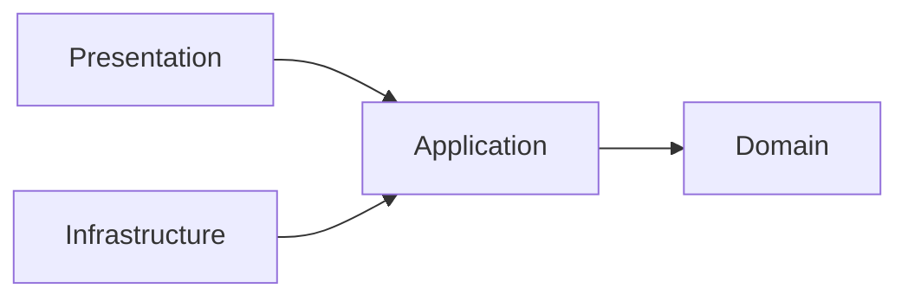
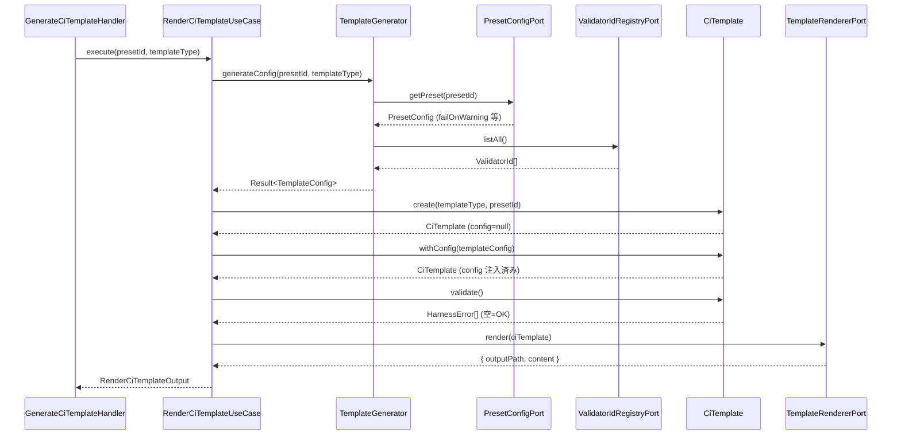
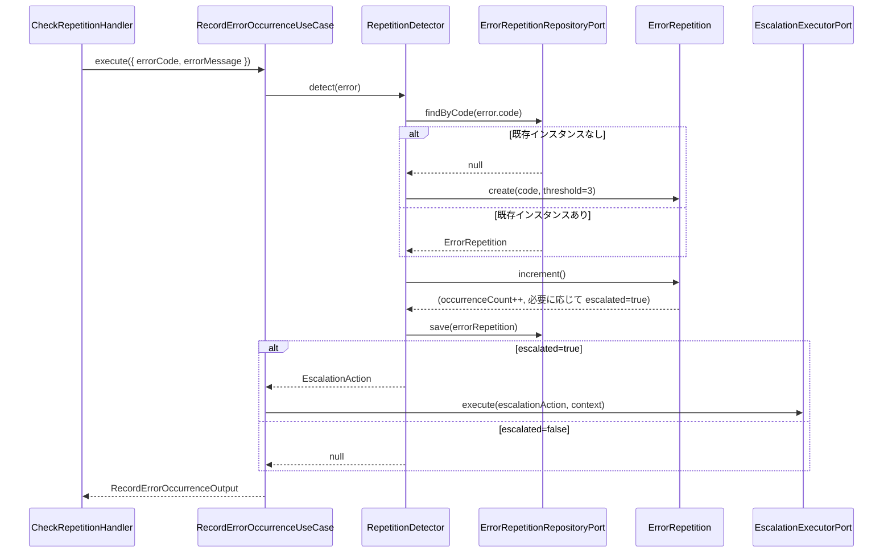

# 論理設計: ci-governance

# WI-185 L4 Downstream Scan Trust

<!-- @work-item-id WI-185 -->

CI and scheduled L4 governance consume P2 freshness/pointer validators as downstream project checks. Generated or documented L4 invocations must rely on the package bin resolving caller project docs, and a green result with zero scanned documents is not acceptable evidence unless the caller project has no matching `docs/**/*.md` files.

@story-id H13-01
@story-id H13-02
@story-id H13-03
@work-item-id WI-140
@work-item-id WI-182
@work-item-id WI-183
CI/pre-commit が消費する標準 L2 gate では、validator-system の `L2-014 work-item-status-staleness` を fail signal として扱う。local `work-items:status --dry-run` は advisory のまま維持し、CI 経路では変更対象 path に紐づく stale WI status を失敗として扱う。
> **Unit ID**: ci-governance
> **作成日**: 2026-03-19
> **対応ストーリー**: H13-01, H13-02, H13-03
> **モード**: Unit横断設計（Phase 2）
> **前提ドキュメント**:
> - `docs/product/construction/ci-governance/domain_model.md`
> - `docs/product/units/ci_governance_unit.md`
> - `docs/product/units/integration_contract.md`
> - `docs/inception/_shared/cross_cutting_decisions.md`
> - `docs/principles/architecture-philosophy.md`
> - `docs/product/construction/skill-quality/domain_model.md`

---

## 1. アーキテクチャ概要

### 1.1 層構成と責務

| 層 | 責務 | 主な構成要素 | 依存先 |
|----|------|-------------|--------|
| Domain | CiTemplate・ErrorRepetition・AgentsMdPointerの集約不変条件、TemplateConfig・EscalationAction等VOの値検証、TemplateGenerator・RepetitionDetector・PointerValidator・LessonAggregatorドメインサービス、ポート定義（10本） | 集約ルート、値オブジェクト、ドメインサービス、ポートインターフェース | なし |
| Application | ドメインモデルを用いたユースケース調停（H13-01〜H13-03）、入出力DTOへの投影、複数ドメインサービスのオーケストレーション | UseCase、DTO、Mapper | Domain |
| Infrastructure | ドメインポート実装、`.harness/error-history.json`ファイルI/O、YAMLテンプレートレンダリング、外部Unit（validator-system・config-foundation・harness-api・adr-foundation・skill-quality）へのアダプタ | Adapter、Renderer | Application, Domain |
| Presentation | CLIハンドラー（`phasegate:ci-template`等）、出力フォーマッター、終了コード決定 | CLI handler、Formatter | Application, Domain |

### 1.2 依存方向



```text
domain <- application <- infrastructure
domain <- application <- presentation
```

- Domain層は外部I/Oに依存しない。集約・VO・ドメインサービスはポートインターフェースのみを参照する
- Application層はDomain調停に徹し、I/O実装を保持しない
- Infrastructure層は `domain/ports/` に定義されたポートインターフェースのみを実装する
- Presentation層はApplication層経由でのみDomainを利用する
- Shared Kernelのインポートは `scripts/harness/shared-kernel/` 経由のみとし、他Unitのドメイン内部ディレクトリを直接importしない

### 1.2.1 Downstream Template Entry Points

@work-item-id WI-182
@work-item-id WI-183

`YamlTemplateRendererAdapter` が返す bundled templates は、npm package 利用者の checkout に存在しない repository-local script を呼ばない。pre-commit は `npx phasegate` を既定の `PHASEGATE_CMD` とし、AIDLC workflow は lockfile に基づいて install command を選択してから `npx phasegate lint --json` / `npx phasegate phasegate:ci-check --json` を実行する。

### 1.3 ディレクトリ構成（全ファイル一覧）

```text
scripts/harness/
└── ci-governance/
    ├── domain/
    │   ├── types/
    │   │   ├── lesson-artifact.ts          # LessonArtifact型定義（Cross-Unit Contract所有）
    │   │   ├── template-type.ts            # TemplateType補助型
    │   │   ├── trigger-condition.ts        # TriggerCondition補助型
    │   │   ├── lesson-category.ts          # LessonCategory補助型
    │   │   ├── escalation-log-level.ts     # EscalationLogLevel補助型
    │   │   └── pointer-type.ts             # PointerType・CommandPointer・FilePointer補助型
    │   ├── aggregates/
    │   │   ├── ci-template.ts              # CiTemplate集約ルート
    │   │   ├── error-repetition.ts         # ErrorRepetition集約ルート
    │   │   └── agents-md-pointer.ts        # AgentsMdPointer集約ルート
    │   ├── value-objects/
    │   │   ├── template-config.ts          # TemplateConfig VO
    │   │   ├── escalation-action.ts        # EscalationAction VO
    │   │   ├── repetition-reset-condition.ts # RepetitionResetCondition VO
    │   │   └── pointer-entry.ts            # PointerEntry VO（CommandPointer | FilePointer Union）
    │   ├── services/
    │   │   ├── template-generator.ts       # TemplateGeneratorドメインサービス
    │   │   ├── repetition-detector.ts      # RepetitionDetectorドメインサービス
    │   │   ├── pointer-validator.ts        # PointerValidatorドメインサービス
    │   │   └── lesson-aggregator.ts        # LessonAggregatorドメインサービス
    │   └── ports/
    │       ├── validator-id-registry-port.ts
    │       ├── preset-config-port.ts
    │       ├── error-repetition-repository-port.ts
    │       ├── escalation-executor-port.ts
    │       ├── template-renderer-port.ts
    │       ├── command-existence-port.ts
    │       ├── file-existence-port.ts
    │       ├── adr-existence-port.ts
    │       ├── agents-md-port.ts
    │       └── lesson-artifact-reader-port.ts
    ├── application/
    │   ├── dto/
    │   │   ├── generate-ci-template-input.ts
    │   │   ├── generate-ci-template-output.ts
    │   │   ├── render-ci-template-input.ts
    │   │   ├── render-ci-template-output.ts
    │   │   ├── record-error-occurrence-input.ts
    │   │   ├── record-error-occurrence-output.ts
    │   │   ├── check-escalation-input.ts
    │   │   ├── check-escalation-output.ts
    │   │   ├── reset-repetition-input.ts
    │   │   ├── reset-repetition-output.ts
    │   │   ├── migrate-agents-md-input.ts
    │   │   ├── migrate-agents-md-output.ts
    │   │   ├── aggregate-lessons-input.ts
    │   │   ├── aggregate-lessons-output.ts
    │   │   ├── validate-pointers-input.ts
    │   │   └── validate-pointers-output.ts
    │   └── usecases/
    │       ├── generate-ci-template-usecase.ts   # H13-01
    │       ├── render-ci-template-usecase.ts     # H13-01
    │       ├── record-error-occurrence-usecase.ts # H13-02
    │       ├── check-escalation-usecase.ts       # H13-02
    │       ├── reset-repetition-usecase.ts       # H13-02
    │       ├── migrate-agents-md-usecase.ts      # H13-03
    │       ├── aggregate-lessons-usecase.ts      # H13-03
    │       └── validate-pointers-usecase.ts      # H13-03
    ├── infrastructure/
    │   ├── adapters/
    │   │   ├── validator-id-registry-adapter.ts      # ValidatorIdRegistryPort実装
    │   │   ├── preset-config-adapter.ts              # PresetConfigPort実装
    │   │   ├── error-repetition-json-repository.ts   # ErrorRepetitionRepositoryPort実装（.harness/error-history.json）
    │   │   ├── escalation-log-executor-adapter.ts    # EscalationExecutorPort実装
    │   │   ├── yaml-template-renderer-adapter.ts     # TemplateRendererPort実装（YAML書き出し）
    │   │   ├── harness-api-command-existence-adapter.ts # CommandExistencePort実装
    │   │   ├── file-system-existence-adapter.ts      # FileExistencePort実装
    │   │   ├── adr-foundation-existence-adapter.ts   # AdrExistencePort実装
    │   │   ├── agents-md-file-adapter.ts             # AgentsMdPort実装（AGENTS.mdファイルI/O）
    │   │   └── lesson-artifact-file-reader-adapter.ts # LessonArtifactReaderPort実装
    │   └── schema/
    │       └── error-history-schema.ts               # .harness/error-history.json スキーマ定義
    └── presentation/
        ├── dto/
        │   └── ci-governance-render-options.ts
        ├── formatters/
        │   ├── ci-template-formatter.ts
        │   └── error-repetition-formatter.ts
        └── handlers/
            ├── generate-ci-template-handler.ts
            ├── migrate-agents-md-handler.ts
            └── check-repetition-handler.ts
```

---

## 2. Domain層設計

### 2.1 集約ルート: CiTemplate

#### 属性一覧

| 属性 | 型 | 説明 | 必須 |
|------|----|------|------|
| templateType | `TemplateType` | テンプレート種別識別子（`'aidlc-gate' \| 'consistency-check' \| 'pre-commit'`） | Yes |
| presetRef | `PresetId` | 参照するPresetのID（config-foundationからインポート） | Yes |
| config | `TemplateConfig \| null` | 注入済みのテンプレート設定。`withConfig()`呼び出し後にのみ非null | No（初期はnull） |

#### メソッド一覧

##### `static create(templateType: TemplateType, presetRef: PresetId): CiTemplate`

- 入力: `templateType: TemplateType`, `presetRef: PresetId`
- 出力: `CiTemplate`
- 処理フロー:
  1. `templateType` が `TemplateType` の3種のいずれかであること（INV-1）を検証する
  2. `presetRef` が非空であることを確認する
  3. `config = null` の初期状態でCiTemplateを生成し返す
- 例外: `templateType` が不正値の場合に `CiGovernanceDomainError`
- 不変条件: INV-1（templateType は3種のいずれか）

##### `withConfig(config: TemplateConfig): CiTemplate`

- 入力: `config: TemplateConfig`
- 出力: `CiTemplate`（設定注入済みの新インスタンス）
- 処理フロー:
  1. `config.targetValidatorIds` が1件以上であること（INV-2）を確認する
  2. 既存のtemplateType・presetRefを保持したまま、configを注入した新CiTemplateを生成する
  3. 生成した新インスタンスを返す
- 例外: `config.targetValidatorIds` が空の場合に `CiGovernanceDomainError`
- 不変条件: INV-2（targetValidatorIdsは1件以上）

##### `validate(): HarnessError[]`

- 入力: なし
- 出力: `HarnessError[]`（不変条件違反があれば1件以上）
- 処理フロー:
  1. `config` が null の場合、「設定未注入」エラーを追加する
  2. INV-2〜INV-4の整合性を確認し、違反があればHarnessErrorを蓄積する
  3. 収集したHarnessError[]を返す（空配列 = 検証通過）
- 例外: なし（エラーはHarnessError[]として返す）
- 不変条件: validateは不変条件の確認のみ行い、状態を変更しない

##### `isConfigured(): boolean`

- 入力: なし
- 出力: `boolean`
- 処理フロー: `config !== null` を返す
- 例外: なし

#### バリデーションルール

| ルール | 内容 | 違反コード |
|--------|------|----------|
| INV-1 | `templateType` は `'aidlc-gate' \| 'consistency-check' \| 'pre-commit'` のいずれか | `CI_TEMPLATE_INVALID_TYPE` |
| INV-2 | `TemplateConfig.targetValidatorIds` は1件以上 | `CI_TEMPLATE_EMPTY_VALIDATORS` |
| INV-3 | `TemplateConfig.targetValidatorIds` の全IDがValidator ID Registry上の有効なID | `CI_TEMPLATE_UNKNOWN_VALIDATOR` |
| INV-4 | `presetRef` が指すPresetは `targetValidatorIds` を包含する | `CI_TEMPLATE_PRESET_MISMATCH` |

---

### 2.2 集約ルート: ErrorRepetition

#### 属性一覧

| 属性 | 型 | 説明 | 必須 |
|------|----|------|------|
| code | `HarnessErrorCode` | 対象HarnessError.codeと一致する識別子（Shared Kernel: harness-error） | Yes |
| occurrenceCount | `number` | 発生回数（0以上の整数） | Yes |
| threshold | `number` | エスカレーション閾値（デフォルト: 3） | Yes |
| escalated | `boolean` | エスカレーション済みフラグ | Yes |
| escalationAction | `EscalationAction` | エスカレーション時アクション定義 | Yes |
| resetCondition | `RepetitionResetCondition` | リセット条件定義 | Yes |

#### メソッド一覧

##### `static create(code: HarnessErrorCode, threshold?: number): ErrorRepetition`

- 入力: `code: HarnessErrorCode`, `threshold?: number`（省略時デフォルト: 3）
- 出力: `ErrorRepetition`
- 処理フロー:
  1. `occurrenceCount = 0`, `escalated = false` の初期状態を生成する
  2. `threshold` が未指定の場合は `3` を使用する
  3. デフォルトの `EscalationAction`（logLevel: 'warn'）と `RepetitionResetCondition`（resetOnResolution: true）を設定する
- 例外: なし
- 不変条件: INV-5（occurrenceCountは0以上）

##### `increment(): void`

- 入力: なし
- 出力: なし（状態変更）
- 処理フロー:
  1. `occurrenceCount` を1加算する
  2. `occurrenceCount >= threshold` を確認する
  3. 条件成立の場合、`escalated = true` にセットする
- 例外: なし
- 不変条件: INV-5, INV-6（escalated=trueの場合、occurrenceCount >= threshold）

##### `isEscalated(): boolean`

- 入力: なし
- 出力: `boolean`
- 処理フロー: `escalated` フラグの値を返す
- 例外: なし

##### `reset(): void`

- 入力: なし
- 出力: なし（状態変更）
- 処理フロー:
  1. `escalated === true` かつ `resetCondition.resetOnResolution === true` であることを確認する（INV-7）
  2. 条件不成立の場合は `CiGovernanceDomainError` をthrowする
  3. `occurrenceCount = 0`, `escalated = false` にリセットする
- 例外: `CiGovernanceDomainError`（INV-7違反時）
- 不変条件: INV-7（reset()はescalated=trueかつResetCondition成立時のみ呼び出し可能）

##### `getEscalationAction(): EscalationAction`

- 入力: なし
- 出力: `EscalationAction`
- 処理フロー: 内部保持の `escalationAction` VOを返す
- 例外: なし

#### バリデーションルール

| ルール | 内容 | 違反コード |
|--------|------|----------|
| INV-5 | `occurrenceCount` は0以上の整数 | `REPETITION_INVALID_COUNT` |
| INV-6 | `escalated=true` の場合、`occurrenceCount >= threshold` | `REPETITION_INVALID_STATE` |
| INV-7 | `reset()` は `escalated=true` かつ `resetOnResolution=true` 時のみ | `REPETITION_RESET_FORBIDDEN` |

#### 状態遷移

```text
[初期状態]
  occurrenceCount = 0
  escalated = false
       |
       | increment()（1回目・2回目: occurrenceCount < threshold）
       v
[カウント進行中]
  occurrenceCount = 1, 2
  escalated = false
       |
       | increment()（3回目: occurrenceCount >= threshold=3）
       v
[エスカレーション済み]
  occurrenceCount = 3
  escalated = true
       |
       | getEscalationAction() → EscalationAction をアプリ層に返す
       | → EscalationExecutorPortで logLevel / messageTemplate 実行
       |
       | RepetitionResetCondition成立（手動解決確認後）
       v
reset()
  occurrenceCount = 0
  escalated = false
  ↑ 初期状態に戻る

※ threshold未満のincrementでは escalated=false を維持
※ reset()はescalated=falseの状態では呼び出し不可（INV-7）
※ 同一codeのインスタンスはErrorRepetitionRepositoryPortで一意管理
```

---

### 2.3 集約ルート: AgentsMdPointer

#### 属性一覧

| 属性 | 型 | 説明 | 必須 |
|------|----|------|------|
| pointers | `PointerEntry[]` | ポインタエントリ一覧（CommandPointer | FilePointer の Union） | Yes |
| adrLinks | `string[]` | ADR参照リンク一覧（`'ADR-NNN'` 形式） | Yes |

#### メソッド一覧

##### `static create(pointers?: PointerEntry[], adrLinks?: string[]): AgentsMdPointer`

- 入力: `pointers?: PointerEntry[]`, `adrLinks?: string[]`
- 出力: `AgentsMdPointer`
- 処理フロー:
  1. 初期 `pointers = []`, `adrLinks = []` で生成する（省略時）
  2. `pointers` が指定された場合、key一意性（INV-8）を事前検証する
  3. 不変条件違反がある場合は `CiGovernanceDomainError` をthrowする
- 例外: `CiGovernanceDomainError`（key重複時）
- 不変条件: INV-8（pointers[].keyはすべて一意）

##### `addPointer(entry: PointerEntry): void`

- 入力: `entry: PointerEntry`
- 出力: なし（状態変更）
- 処理フロー:
  1. 既存 `pointers` 内に同一 `key` が存在しないことを確認する（INV-8）
  2. 存在する場合は `CiGovernanceDomainError` をthrowする
  3. `pointers` 配列に `entry` を追加する
- 例外: `CiGovernanceDomainError`（key重複時）
- 不変条件: INV-8

##### `replacePointer(entry: PointerEntry): void`

- 入力: `entry: PointerEntry`
- 出力: なし（状態変更）
- 処理フロー:
  1. 既存 `pointers` 内に同一 `key` が存在する場合、該当エントリを `entry` で置換する
  2. 存在しない場合は新規追加（`addPointer` と同等の動作）として扱う
- 例外: なし
- 不変条件: INV-8は自動的に維持される（同一keyの置換のため）

##### `validate(): HarnessError[]`

- 入力: なし
- 出力: `HarnessError[]`
- 処理フロー:
  1. INV-8（key一意性）を確認する
  2. `FilePointer.filePath` が相対パス形式であること（INV-11）を確認する
  3. 違反があればHarnessError[]に蓄積して返す
- 例外: なし（エラーはHarnessError[]として返す）
- 不変条件: validateは参照整合性（Dead Pointer）の検証はドメインサービスに委譲し、構造的不変条件のみを自己検証する

#### バリデーションルール

| ルール | 内容 | 違反コード |
|--------|------|----------|
| INV-8 | `PointerEntry[].key` はすべて一意 | `AGENTS_MD_DUPLICATE_KEY` |
| INV-9 | validate()通過後はDead Pointerを含まない（PointerValidatorサービスで検証） | `AGENTS_MD_DEAD_POINTER` |
| INV-10 | `adrLinks` が参照するADRはadr-foundationのADR Frontmatter Schema上に存在する | `AGENTS_MD_INVALID_ADR_LINK` |
| INV-11 | `FilePointer.filePath` はプロジェクトルートからの相対パス形式 | `AGENTS_MD_INVALID_FILE_PATH` |

---

### 2.4 値オブジェクト

#### 2.4.1 TemplateConfig

| 属性 | 型 | 説明 | 必須 |
|------|----|------|------|
| targetValidatorIds | `ValidatorId[]` | 実行対象バリデータID一覧（validator-systemからインポート）。1件以上必須 | Yes |
| triggerCondition | `TriggerCondition` | テンプレートのトリガー条件（`'pull_request' \| 'schedule' \| 'pre-commit'`） | Yes |
| failOnWarning | `boolean` | warning発生時もfailとするか | Yes |

**生成ルール**

- `targetValidatorIds` は1件以上であること
- `triggerCondition` は `TriggerCondition` の3種のいずれかであること
- `Object.freeze()` により生成後の変更を禁止する

**メソッド**

- `static create(input: { targetValidatorIds: ValidatorId[]; triggerCondition: TriggerCondition; failOnWarning: boolean }): TemplateConfig`
- `equals(other: TemplateConfig): boolean`

#### 2.4.2 EscalationAction

| 属性 | 型 | 説明 | 必須 |
|------|----|------|------|
| logLevel | `EscalationLogLevel` | ログレベル（`'warn' \| 'error'`） | Yes |
| messageTemplate | `string` | 警告メッセージテンプレート文字列 | Yes |

**生成ルール**

- `logLevel` は `'warn'` または `'error'` のみ
- `messageTemplate` は空文字不可
- EscalationActionは宣言的定義のみを保持し、実際のアクション実行は `EscalationExecutorPort` に委譲する

**メソッド**

- `static create(logLevel: EscalationLogLevel, messageTemplate: string): EscalationAction`
- `equals(other: EscalationAction): boolean`
- `formatMessage(errorCode: string, count: number): string`

#### 2.4.3 RepetitionResetCondition

| 属性 | 型 | 説明 | 必須 |
|------|----|------|------|
| resetOnResolution | `boolean` | エラー解消確認時にリセットを許可するか | Yes |

**生成ルール**

- `resetOnResolution = true` の場合のみ `ErrorRepetition.reset()` の呼び出しが可能（INV-7）

**メソッド**

- `static create(resetOnResolution: boolean): RepetitionResetCondition`
- `equals(other: RepetitionResetCondition): boolean`

#### 2.4.4 PointerEntry

`PointerEntry` は以下の2種のUnion型である。

**CommandPointer**

| 属性 | 型 | 説明 |
|------|----|------|
| type | `'command'` | ポインタ種別識別子 |
| key | `string` | エントリ一意キー（INV-8） |
| command | `string` | 実行コマンド名（例: `'phasegate:status'`） |
| description | `string` | コマンドの説明 |

**FilePointer**

| 属性 | 型 | 説明 |
|------|----|------|
| type | `'file'` | ポインタ種別識別子 |
| key | `string` | エントリ一意キー（INV-8） |
| filePath | `string` | プロジェクトルートからの相対パス（INV-11） |
| description | `string` | ファイルの説明 |

**メソッド**

- `static createCommand(key: string, command: string, description: string): PointerEntry`
- `static createFile(key: string, filePath: string, description: string): PointerEntry`
- `isCommand(): boolean`
- `isFile(): boolean`

#### 2.4.5 LessonArtifact型（TypeScript型定義）

ci-governanceドメイン層が所有するCross-Unit Contract型。

```typescript
// scripts/harness/ci-governance/domain/types/lesson-artifact.ts

export type LessonCategory = 'anti-pattern' | 'best-practice' | 'edge-case';

export interface LessonArtifact {
  /** UUID形式の一意識別子（INV-12: UUID形式必須） */
  lessonId: string;
  /** lesson artifactの出力元スキル名（例: 'story-implementor', 'domain-designer'） */
  source: string;
  /** AGENTS.mdに集約するlesson内容テキスト */
  content: string;
  /** lessonのカテゴリタグ（重複集約時はマージされる） */
  tags: LessonCategory[];
  /** artifact作成日時（ISO 8601形式） */
  timestamp: string; // ISO8601DateString
}
```

**不変条件**

| ルール | 内容 |
|--------|------|
| INV-12 | `lessonId` はUUID形式の一意識別子 |

**JSONスキーマ配置先**: `docs/contracts/lesson-artifact.schema.json`（skill-qualityがバリデーション参照）

---

### 2.5 ドメインサービス

#### 2.5.1 TemplateGenerator

**責務**: PresetId → TemplateConfig導出。CiTemplate集約の構築を補助する。

**コンストラクタ依存**

- `validatorIdRegistry: ValidatorIdRegistryPort`
- `presetConfig: PresetConfigPort`

##### `generateConfig(presetId: PresetId, templateType: TemplateType): Promise<Result<TemplateConfig, HarnessError[]>>`

- 入力: `presetId: PresetId`, `templateType: TemplateType`
- 出力: `Promise<Result<TemplateConfig, HarnessError[]>>`
- 処理フロー:
  1. `PresetConfigPort.getPreset(presetId)` でPreset設定を取得する
  2. `ValidatorIdRegistryPort.listAll()` で有効なValidatorId一覧を取得する
  3. Preset設定から `targetValidatorIds` を導出する（Preset対応のValidatorId[]を抽出）
  4. `templateType` から `triggerCondition` をマッピングする（D6の固定ルール）:
     - `'aidlc-gate'` → `'pull_request'`
     - `'consistency-check'` → `'schedule'`
     - `'pre-commit'` → `'pre-commit'`
  5. Preset設定から `failOnWarning` を取得する
  6. `TemplateConfig.create({ targetValidatorIds, triggerCondition, failOnWarning })` を生成して返す
- 例外: ポートI/O失敗時に `HarnessError[]` を含む `Result.fail()` を返す

#### 2.5.2 RepetitionDetector

**責務**: HarnessError発生時に対象ErrorRepetition集約を取得・increment・escalation判定・saveを行う。

**コンストラクタ依存**

- `errorRepetitionRepository: ErrorRepetitionRepositoryPort`

##### `detect(error: HarnessError): Promise<EscalationAction | null>`

- 入力: `error: HarnessError`（Shared Kernel: harness-error）
- 出力: `Promise<EscalationAction | null>`（エスカレーションが発生した場合のみEscalationAction）
- 処理フロー:
  1. `ErrorRepetitionRepositoryPort.findByCode(error.code)` で既存インスタンスを取得する
  2. 存在しない場合: `ErrorRepetition.create(error.code, threshold=3)` で新規生成する
  3. `ErrorRepetition.increment()` を呼び出す
  4. `ErrorRepetitionRepositoryPort.save(errorRepetition)` で永続化する
  5. `errorRepetition.isEscalated()` が `true` の場合: `errorRepetition.getEscalationAction()` を返す
  6. `false` の場合: `null` を返す
- 例外: リポジトリI/O失敗時に `HarnessError` をthrow

#### 2.5.3 PointerValidator

**責務**: PointerEntry[]の参照先実在性検証（Dead Pointer検出）。

**コンストラクタ依存**

- `commandExistence: CommandExistencePort`
- `fileExistence: FileExistencePort`
- `adrExistence: AdrExistencePort`

##### `validate(entries: PointerEntry[], adrLinks?: string[]): Promise<HarnessError[]>`

- 入力: `entries: PointerEntry[]`, `adrLinks?: string[]`
- 出力: `Promise<HarnessError[]>`（Dead Pointerが存在する場合に非空）
- 処理フロー:
  1. `CommandPointer` のエントリに対し: `CommandExistencePort.exists(entry.command)` を呼び出す
  2. `FilePointer` のエントリに対し: `FileExistencePort.exists(entry.filePath)` を呼び出す
  3. `adrLinks` が指定された場合: `AdrExistencePort.exists(adrRef)` を各リンクに対し呼び出す
  4. 実在しない参照先をすべてHarnessError（`AGENTS_MD_DEAD_POINTER`）として蓄積する
  5. 収集したHarnessError[]を返す
- 例外: ポートI/O失敗時に `HarnessError` をthrow

#### 2.5.4 LessonAggregator

**責務**: LessonArtifact[] → AgentsMdPointerへの集約・反映（重複lessonId検出）。

**コンストラクタ依存**

- `lessonArtifactReader: LessonArtifactReaderPort`

##### `aggregate(artifacts: LessonArtifact[]): Result<PointerEntry[], HarnessError[]>`

- 入力: `artifacts: LessonArtifact[]`
- 出力: `Result<PointerEntry[], HarnessError[]>`
- 処理フロー:
  1. 同一バッチ内の `lessonId` 重複を検出する: 重複がある場合は `HarnessError`（`DUPLICATE_LESSON_ID`）を含む `Result.fail()` を返す
  2. 各LessonArtifactをPointerEntryに変換する:
     - `key`: `lesson-{lessonId}` 形式
     - `type`: `'file'`（lessonの参照元ファイルパス）
     - `description`: `[{category}] {content}` 形式
  3. 変換済みPointerEntry[]を `Result.ok()` で返す
- 例外: なし（エラーはResult.fail()として返す）
- 特記: タグ集約（同一lessonIdの複数バージョンが既にAgentsMdPointerに存在する場合、tagsはマージ）はアプリケーション層でハンドリングする

---

### 2.6 ポート定義（10本）

ポートは全て `scripts/harness/ci-governance/domain/ports/` に定義し、Infrastructure層が実装する。

#### ValidatorIdRegistryPort

```typescript
export interface ValidatorIdRegistryPort {
  listAll(): Promise<ValidatorId[]>;
  exists(id: ValidatorId): Promise<boolean>;
}
```

| メソッド | 入力 | 出力 | 説明 |
|---------|------|------|------|
| `listAll` | なし | `Promise<ValidatorId[]>` | validator-systemのValidator ID Registry上の有効なValidatorId一覧を返す |
| `exists` | `id: ValidatorId` | `Promise<boolean>` | 指定ValidatorIdが有効か確認する |

#### PresetConfigPort

```typescript
export interface PresetConfigPort {
  getPreset(presetId: PresetId): Promise<PresetConfig>;
  listPresetValidatorIds(presetId: PresetId): Promise<ValidatorId[]>;
}
```

| メソッド | 入力 | 出力 | 説明 |
|---------|------|------|------|
| `getPreset` | `presetId: PresetId` | `Promise<PresetConfig>` | PresetId → Preset設定（failOnWarning等を含む）を返す |
| `listPresetValidatorIds` | `presetId: PresetId` | `Promise<ValidatorId[]>` | Presetに対応するValidatorId一覧を返す |

#### ErrorRepetitionRepositoryPort

```typescript
export interface ErrorRepetitionRepositoryPort {
  findByCode(code: HarnessErrorCode): Promise<ErrorRepetition | null>;
  save(errorRepetition: ErrorRepetition): Promise<void>;
  deleteByCode(code: HarnessErrorCode): Promise<void>;
}
```

| メソッド | 入力 | 出力 | 説明 |
|---------|------|------|------|
| `findByCode` | `code: HarnessErrorCode` | `Promise<ErrorRepetition \| null>` | `.harness/error-history.json` から該当codeのErrorRepetitionを取得する |
| `save` | `errorRepetition: ErrorRepetition` | `Promise<void>` | ErrorRepetitionを `.harness/error-history.json` に永続化する |
| `deleteByCode` | `code: HarnessErrorCode` | `Promise<void>` | 指定codeのエントリを削除する（reset後のクリーンアップ用） |

#### EscalationExecutorPort

```typescript
export interface EscalationExecutorPort {
  execute(action: EscalationAction, context: { errorCode: string; count: number }): Promise<void>;
}
```

| メソッド | 入力 | 出力 | 説明 |
|---------|------|------|------|
| `execute` | `action: EscalationAction`, `context` | `Promise<void>` | `action.logLevel` に応じたログ出力と `action.messageTemplate` に基づく警告メッセージを表示する |

#### TemplateRendererPort

```typescript
export interface TemplateRendererPort {
  render(ciTemplate: CiTemplate): Promise<{ outputPath: string; content: string }>;
}
```

| メソッド | 入力 | 出力 | 説明 |
|---------|------|------|------|
| `render` | `ciTemplate: CiTemplate` | `Promise<{ outputPath, content }>` | CiTemplateをYAMLテンプレートとしてレンダリングし、`templateType` に応じた出力パスと内容を返す |

#### CommandExistencePort

```typescript
export interface CommandExistencePort {
  exists(commandName: string): Promise<boolean>;
}
```

| メソッド | 入力 | 出力 | 説明 |
|---------|------|------|------|
| `exists` | `commandName: string` | `Promise<boolean>` | harness-apiのCLI Command Registryにコマンドが登録されているかを確認する |

#### FileExistencePort

```typescript
export interface FileExistencePort {
  exists(relativePath: string): Promise<boolean>;
}
```

| メソッド | 入力 | 出力 | 説明 |
|---------|------|------|------|
| `exists` | `relativePath: string` | `Promise<boolean>` | プロジェクトルートからの相対パスでファイル実在を確認する |

#### AdrExistencePort

```typescript
export interface AdrExistencePort {
  exists(adrRef: string): Promise<boolean>;
}
```

| メソッド | 入力 | 出力 | 説明 |
|---------|------|------|------|
| `exists` | `adrRef: string` | `Promise<boolean>` | adr-foundationのADR Frontmatter Schema上に `adrRef`（`'ADR-NNN'` 形式）が存在するか確認する |

#### AgentsMdPort

```typescript
export interface AgentsMdPort {
  read(): Promise<AgentsMdPointer>;
  write(pointer: AgentsMdPointer): Promise<{ before: number; after: number }>;
}
```

| メソッド | 入力 | 出力 | 説明 |
|---------|------|------|------|
| `read` | なし | `Promise<AgentsMdPointer>` | AGENTS.mdを読み取り、AgentsMdPointerとして返す |
| `write` | `pointer: AgentsMdPointer` | `Promise<{ before: number; after: number }>` | AgentsMdPointerをAGENTS.mdに書き込む。移行前後の行数を返す（KPI計測用） |

#### LessonArtifactReaderPort

```typescript
export interface LessonArtifactReaderPort {
  readAll(): Promise<LessonArtifact[]>;
  readBySource(source: string): Promise<LessonArtifact[]>;
}
```

| メソッド | 入力 | 出力 | 説明 |
|---------|------|------|------|
| `readAll` | なし | `Promise<LessonArtifact[]>` | skill-qualityが出力したlesson artifact JSONファイルを全件読み取り返す |
| `readBySource` | `source: string` | `Promise<LessonArtifact[]>` | 指定スキル名（`source`フィールド）でフィルタしたlesson artifactを返す |

---

## 3. Application層設計

### 3.1 H13-01: CI/CDテンプレート生成

#### GenerateCiTemplateUseCase

**責務**: PresetIdとTemplateTypeを受け取り、CiTemplate集約を構築してTemplateConfigを検証する。

**コンストラクタ依存**

- `templateGenerator: TemplateGenerator`

**入力DTO: GenerateCiTemplateInput**

| 項目 | 型 | 必須 | 説明 |
|------|----|------|------|
| presetId | `string` | Yes | 参照するPreset ID |
| templateType | `string` | Yes | テンプレート種別（`'aidlc-gate' \| 'consistency-check' \| 'pre-commit'`） |

**出力DTO: GenerateCiTemplateOutput**

| 項目 | 型 | 説明 |
|------|----|------|
| templateType | `string` | テンプレート種別 |
| presetRef | `string` | 参照Preset ID |
| targetValidatorIds | `string[]` | 実行対象バリデータID一覧 |
| triggerCondition | `string` | トリガー条件 |
| failOnWarning | `boolean` | warning時fail設定 |
| validationErrors | `HarnessError[]` | 不変条件違反があれば非空 |

**処理フロー**

1. `templateType` を `TemplateType` にパースする（不正値は `HarnessError` を返す）
2. `presetId` を `PresetId` にパースする
3. `templateGenerator.generateConfig(presetId, templateType)` を呼び出す
4. `Result.fail()` の場合はエラーを返す
5. `CiTemplate.create(templateType, presetId)` でCiTemplate集約を生成する
6. `ciTemplate.withConfig(templateConfig)` で設定を注入する
7. `ciTemplate.validate()` で不変条件を確認する
8. `GenerateCiTemplateOutput` に投影して返す

**例外**

- `TemplateType` パース失敗
- `TemplateGenerator` が返す `HarnessError[]`
- 不変条件違反（INV-1〜INV-4）

---

#### RenderCiTemplateUseCase

**責務**: GenerateCiTemplateUseCaseの出力を受けてYAMLテンプレートファイルを生成・書き出す。

**コンストラクタ依存**

- `templateGenerator: TemplateGenerator`
- `templateRenderer: TemplateRendererPort`

**入力DTO: RenderCiTemplateInput**

| 項目 | 型 | 必須 | 説明 |
|------|----|------|------|
| presetId | `string` | Yes | 参照するPreset ID |
| templateType | `string` | Yes | テンプレート種別 |
| outputDir | `string` | No | 出力先ディレクトリ（省略時はプロジェクトルート） |

**出力DTO: RenderCiTemplateOutput**

| 項目 | 型 | 説明 |
|------|----|------|
| outputPath | `string` | 書き出したYAMLファイルのパス |
| content | `string` | 生成したテンプレート内容 |
| errors | `HarnessError[]` | 生成エラーがあれば非空 |

**処理フロー**

1. `templateGenerator.generateConfig(presetId, templateType)` でTemplateConfigを取得する
2. `CiTemplate.create()` → `.withConfig()` でCiTemplate集約を構築する
3. `ciTemplate.validate()` で不変条件を確認する（エラーがあれば中断）
4. `TemplateRendererPort.render(ciTemplate)` でYAMLテンプレートを生成する
5. `RenderCiTemplateOutput` に投影して返す

---

### 3.2 H13-02: 反復エラー検出・エスカレーション

#### RecordErrorOccurrenceUseCase

**責務**: HarnessErrorの発生を記録し、ErrorRepetitionのincrement・永続化を行う。

**コンストラクタ依存**

- `repetitionDetector: RepetitionDetector`

**入力DTO: RecordErrorOccurrenceInput**

| 項目 | 型 | 必須 | 説明 |
|------|----|------|------|
| errorCode | `string` | Yes | HarnessError.code |
| errorMessage | `string` | Yes | HarnessError.message |

**出力DTO: RecordErrorOccurrenceOutput**

| 項目 | 型 | 説明 |
|------|----|------|
| errorCode | `string` | 記録したエラーコード |
| currentCount | `number` | 記録後のoccurrenceCount |
| escalated | `boolean` | エスカレーション発生フラグ |
| escalationAction | `EscalationActionDto \| null` | エスカレーション時のアクション情報 |

**処理フロー**

1. `errorCode` を `HarnessErrorCode` にパースする
2. `repetitionDetector.detect(error)` を呼び出す
3. 返却された `EscalationAction | null` をDTOに変換する
4. `RecordErrorOccurrenceOutput` に投影して返す

---

#### CheckEscalationUseCase

**責務**: 指定errorCodeのErrorRepetitionの現在状態を確認し、エスカレーション状況を返す。

**コンストラクタ依存**

- `errorRepetitionRepository: ErrorRepetitionRepositoryPort`

**入力DTO: CheckEscalationInput**

| 項目 | 型 | 必須 | 説明 |
|------|----|------|------|
| errorCode | `string` | Yes | 確認対象のHarnessError.code |

**出力DTO: CheckEscalationOutput**

| 項目 | 型 | 説明 |
|------|----|------|
| errorCode | `string` | 確認対象エラーコード |
| exists | `boolean` | ErrorRepetitionインスタンスが存在するか |
| currentCount | `number \| null` | 現在のoccurrenceCount（存在しない場合はnull） |
| threshold | `number \| null` | エスカレーション閾値 |
| escalated | `boolean \| null` | エスカレーション済みか |

**処理フロー**

1. `ErrorRepetitionRepositoryPort.findByCode(errorCode)` を呼び出す
2. `null` の場合は `exists=false` として返す
3. 存在する場合は集約の状態をDTOに投影して返す

---

#### ResetRepetitionUseCase

**責務**: RepetitionResetCondition成立確認後、ErrorRepetitionのreset・永続化を行う。

**コンストラクタ依存**

- `errorRepetitionRepository: ErrorRepetitionRepositoryPort`

**入力DTO: ResetRepetitionInput**

| 項目 | 型 | 必須 | 説明 |
|------|----|------|------|
| errorCode | `string` | Yes | リセット対象のHarnessError.code |
| confirmedResolution | `boolean` | Yes | エラー解消を手動確認したか（RepetitionResetConditionの成立確認） |

**出力DTO: ResetRepetitionOutput**

| 項目 | 型 | 説明 |
|------|----|------|
| errorCode | `string` | リセットしたエラーコード |
| success | `boolean` | リセット成功フラグ |
| errors | `HarnessError[]` | INV-7違反等のエラー |

**処理フロー**

1. `ErrorRepetitionRepositoryPort.findByCode(errorCode)` を呼び出す
2. インスタンスが存在しない場合はエラーを返す
3. `confirmedResolution=false` の場合はINV-7違反エラーを返す
4. `errorRepetition.reset()` を呼び出す（INV-7チェックはドメイン層で行われる）
5. `ErrorRepetitionRepositoryPort.save(errorRepetition)` で永続化する
6. `ResetRepetitionOutput` に投影して返す

---

### 3.3 H13-03: AGENTS.mdポインタ型移行

#### MigrateAgentsMdUseCase

**責務**: lesson artifact集約 + AGENTS.md読み取り + PointerEntry追加 + バリデーション + 書き込みの全フェーズを調停する。

**コンストラクタ依存**

- `lessonAggregator: LessonAggregator`
- `pointerValidator: PointerValidator`
- `agentsMdPort: AgentsMdPort`
- `lessonArtifactReaderPort: LessonArtifactReaderPort`

**入力DTO: MigrateAgentsMdInput**

| 項目 | 型 | 必須 | 説明 |
|------|----|------|------|
| dryRun | `boolean` | No | trueの場合、書き込みを行わず検証結果のみ返す |

**出力DTO: MigrateAgentsMdOutput**

| 項目 | 型 | 説明 |
|------|----|------|
| success | `boolean` | 移行成功フラグ |
| linesBefore | `number \| null` | 移行前AGENTS.md行数 |
| linesAfter | `number \| null` | 移行後AGENTS.md行数（dry run時はnull） |
| kpiMet | `boolean \| null` | 50%削減KPI達成フラグ（dry run時はnull） |
| errors | `HarnessError[]` | Dead Pointer・重複lessonId等のエラー |
| addedPointers | `number` | 新規追加したPointerEntry数 |

**処理フロー**

1. `LessonArtifactReaderPort.readAll()` でlesson artifact[]を取得する
2. `LessonAggregator.aggregate(artifacts)` でPointerEntry[]に変換する（エラーがあれば中断）
3. `AgentsMdPort.read()` でAgentsMdPointerを取得する
4. 変換済みPointerEntry[]を `AgentsMdPointer.addPointer()` / `replacePointer()` で追加する
5. `PointerValidator.validate(agentsMdPointer.pointers, agentsMdPointer.adrLinks)` でDead Pointerを検証する（エラーがあれば中断）
6. `dryRun=false` の場合: `AgentsMdPort.write(agentsMdPointer)` で書き込み、行数比較（KPI計測）を行う
7. `MigrateAgentsMdOutput` に投影して返す

---

#### AggregateLessonsUseCase

**責務**: skill-qualityのlesson artifactをAgentsMdPointerのPointerEntryに変換してリストを返す（MigrateAgentsMdUseCaseの部分的実行にも利用可能）。

**コンストラクタ依存**

- `lessonAggregator: LessonAggregator`
- `lessonArtifactReaderPort: LessonArtifactReaderPort`

**入力DTO: AggregateLessonsInput**

| 項目 | 型 | 必須 | 説明 |
|------|----|------|------|
| source | `string \| undefined` | No | フィルタするスキル名（省略時は全件） |

**出力DTO: AggregateLessonsOutput**

| 項目 | 型 | 説明 |
|------|----|------|
| pointerEntries | `PointerEntryDto[]` | 変換済みPointerEntry一覧 |
| totalArtifacts | `number` | 処理したlesson artifact数 |
| errors | `HarnessError[]` | 重複lessonId等のエラー |

**処理フロー**

1. `source` が指定された場合: `LessonArtifactReaderPort.readBySource(source)` で取得する
2. 省略の場合: `LessonArtifactReaderPort.readAll()` で全件取得する
3. `LessonAggregator.aggregate(artifacts)` でPointerEntry[]に変換する
4. `AggregateLessonsOutput` に投影して返す

---

#### ValidatePointersUseCase

**責務**: AgentsMdPointerの現在状態を読み取り、全PointerEntryのDead Pointerを検証する。

**コンストラクタ依存**

- `pointerValidator: PointerValidator`
- `agentsMdPort: AgentsMdPort`

**入力DTO: ValidatePointersInput**

| 項目 | 型 | 必須 | 説明 |
|------|----|------|------|
| （なし） | — | — | AGENTS.md全体を検証対象とする |

**出力DTO: ValidatePointersOutput**

| 項目 | 型 | 説明 |
|------|----|------|
| passed | `boolean` | Dead Pointer検出なしフラグ |
| totalPointers | `number` | 検証したPointerEntry数 |
| deadPointers | `string[]` | Dead Pointerのkey一覧 |
| errors | `HarnessError[]` | Dead Pointer検出エラー |

**処理フロー**

1. `AgentsMdPort.read()` でAgentsMdPointerを取得する
2. `agentsMdPointer.validate()` で構造的不変条件を確認する
3. `PointerValidator.validate(agentsMdPointer.pointers, agentsMdPointer.adrLinks)` でDead Pointerを検証する
4. `ValidatePointersOutput` に投影して返す

---

## 4. Infrastructure層設計

### 4.1 ValidatorIdRegistryAdapter

**実装ポート**: `ValidatorIdRegistryPort`

**ファイル**: `scripts/harness/ci-governance/infrastructure/adapters/validator-id-registry-adapter.ts`

**実装方針**

- validator-systemの `Validator ID Registry`（`integration_contract.md §9` に定義）を参照する
- Wave 2未確定時はモック実装（静的リスト）でWave 3開発を進める
- `ValidatorId` 型はvalidator-systemのCross-Unit Contract型として扱う

**外部I/O**: validator-system モジュール参照

---

### 4.2 PresetConfigAdapter

**実装ポート**: `PresetConfigPort`

**ファイル**: `scripts/harness/ci-governance/infrastructure/adapters/preset-config-adapter.ts`

**実装方針**

- `HarnessConfigV2.project.preset`（`minimal | standard | strict`）をPresetIdとして解釈する
- config-foundationのShared KernelからHarnessConfigV2を取得し、Preset設定を返す
- `listPresetValidatorIds()` はPresetに対応するレイヤー（Preset設定）のValidatorId[]を返す

**外部I/O**: `phasegate.config.json` ファイル読み取り（config-foundation経由）

---

### 4.3 ErrorRepetitionJsonRepository

**実装ポート**: `ErrorRepetitionRepositoryPort`

**ファイル**: `scripts/harness/ci-governance/infrastructure/adapters/error-repetition-json-repository.ts`

**実装方針**

- `.harness/error-history.json` にErrorRepetitionを永続化する
- JSONスキーマ定義は `infrastructure/schema/error-history-schema.ts` に配置する
- ファイルが存在しない場合は `findByCode()` は `null` を返し、`save()` 時に新規作成する
- スキーマバージョン管理を担い、ドメイン集約への影響を遮断する

**外部I/O**: `.harness/error-history.json` ファイルCRUD

**JSONスキーマ構造**

```json
{
  "version": 1,
  "entries": [
    {
      "code": "L1-001",
      "occurrenceCount": 3,
      "threshold": 3,
      "escalated": true,
      "lastUpdated": "2026-03-19T00:00:00Z"
    }
  ]
}
```

---

### 4.4 EscalationLogExecutorAdapter

**実装ポート**: `EscalationExecutorPort`

**ファイル**: `scripts/harness/ci-governance/infrastructure/adapters/escalation-log-executor-adapter.ts`

**実装方針**

- `EscalationAction.logLevel` に応じて `console.warn()` / `console.error()` を選択する
- `EscalationAction.messageTemplate` に `errorCode` と `count` を埋め込んでメッセージを生成する
- 外部通知（GitHub Issue作成等）はデフォルト無効とする（GSD由来機能のデフォルト無効原則）

**外部I/O**: stdout / stderr への出力

---

### 4.5 YamlTemplateRendererAdapter

**実装ポート**: `TemplateRendererPort`

**ファイル**: `scripts/harness/ci-governance/infrastructure/adapters/yaml-template-renderer-adapter.ts`

**実装方針**

- `CiTemplate.templateType` に応じて出力先パスを決定する:
  - `'aidlc-gate'` → `.github/workflows/aidlc-gate.yml`
  - `'consistency-check'` → `.github/workflows/consistency-check.yml`
  - `'pre-commit'` → `.husky/pre-commit`
- テンプレートのバリデータ実行部分は `phasegate:ci-check` / `phasegate:lint` 等のCLIコマンド呼び出し形式に抽象化し、プラットフォーム非依存を維持する
- GitHub Actions YAMLのフォーマットは静的テンプレート文字列をベースに `TemplateConfig` の値を注入する形式とする

**外部I/O**: YAML / シェルスクリプトファイル書き出し

---

### 4.6 HarnessApiCommandExistenceAdapter

**実装ポート**: `CommandExistencePort`

**ファイル**: `scripts/harness/ci-governance/infrastructure/adapters/harness-api-command-existence-adapter.ts`

**実装方針**

- harness-apiのCLI Command Registry（`integration_contract.md §3`）を参照する
- Wave 2未確定時はモック実装（静的コマンド名セット）でWave 3開発を進める
- `exists()` はコマンド名の静的マップ照合で実装する

**外部I/O**: harness-api CLI Command Registry参照

---

### 4.7 FileSystemExistenceAdapter

**実装ポート**: `FileExistencePort`

**ファイル**: `scripts/harness/ci-governance/infrastructure/adapters/file-system-existence-adapter.ts`

**実装方針**

- `node:fs/promises` の `access()` を使用して実在確認する
- 引数の `relativePath` をプロジェクトルート（`process.cwd()`）と結合して絶対パスに変換する
- I/O失敗（パーミッションエラー等）と「ファイル不存在」は区別して扱う

**外部I/O**: ファイルシステム存在確認（node:fs/promises）

---

### 4.8 AdrFoundationExistenceAdapter

**実装ポート**: `AdrExistencePort`

**ファイル**: `scripts/harness/ci-governance/infrastructure/adapters/adr-foundation-existence-adapter.ts`

**実装方針**

- `docs/ADR/` 配下のADRファイルのfrontmatter `adr_id` フィールドで実在確認する
- `adrRef`（`'ADR-NNN'` 形式）の `NNN` 部分をfrontmatter `adr_id` と照合する
- harness-errorの `FileSystemAdrExistenceCheckerAdapter` と同等のアプローチを採用する

**外部I/O**: `docs/ADR/` 配下ファイル読み取り

---

### 4.9 AgentsMdFileAdapter

**実装ポート**: `AgentsMdPort`

**ファイル**: `scripts/harness/ci-governance/infrastructure/adapters/agents-md-file-adapter.ts`

**実装方針**

- `AGENTS.md` ファイルを読み取り、PointerEntry[]とadrLinksを解析してAgentsMdPointerを構築する
- `write()` 実行前にAGENTS.mdの現在行数をカウントし、書き込み後の行数と比較して返す（KPI計測）
- AGENTS.mdの書式はMarkdown形式とし、PointerEntry[]をリスト形式で出力する

**外部I/O**: `AGENTS.md` ファイルread / write

---

### 4.10 LessonArtifactFileReaderAdapter

**実装ポート**: `LessonArtifactReaderPort`

**ファイル**: `scripts/harness/ci-governance/infrastructure/adapters/lesson-artifact-file-reader-adapter.ts`

**実装方針**

- `lessons/` ディレクトリ配下の `*.lesson.json` ファイルを走査して読み取る（skill-qualityの出力先に合わせる）
- `docs/contracts/lesson-artifact.schema.json` を用いてJSONスキーマバリデーションを行う
- スキーマ準拠しないファイルは読み飛ばし、HarnessErrorとしてログ出力する

**外部I/O**: `lessons/*.lesson.json` ファイル読み取り

---

## 5. Presentation層設計

### 5.1 前提

ci-governanceの CLIコマンドはci-governance自身がトップレベルコマンドの所有者となる機能（`phasegate:ci-template`）と、harness-apiが所有するコマンド（`phasegate:status`等）のポインタとして機能するものがある。本Presentation層は ci-governance 固有の CLIハンドラーとフォーマッターを提供する。

### 5.2 GenerateCiTemplateHandler

**ファイル**: `scripts/harness/ci-governance/presentation/handlers/generate-ci-template-handler.ts`

**役割**

- `phasegate:ci-template` CLIコマンドのエントリポイント
- Preset設定から CI/CDテンプレート YAML を生成・書き出す

**引数**

| 引数 | 必須 | 説明 |
|------|------|------|
| `--template-type <aidlc-gate\|consistency-check\|pre-commit>` | Yes | 生成するテンプレート種別 |
| `--preset-id <minimal\|standard\|strict>` | No | 使用するPreset ID（省略時は `standard`） |
| `--dry-run` | No | ファイル書き出しを行わず生成内容を確認のみ |
| `--format <human\|json>` | No | 出力形式（既定: human） |

<!-- @work-item-id WI-142 -->
`ci:generate-template` の CLI boundary は、`--preset` 未指定を `standard` に正規化してから Handler / UseCase へ渡す。`default` は `PresetConfigAdapter` の有効 preset ではないため、下位層へ伝播させない。

**処理**

1. 引数をパースしてDTOを生成する
2. `--dry-run` の場合: `GenerateCiTemplateUseCase.execute()` を呼び出し、生成内容を表示する
3. `--dry-run` 以外: `RenderCiTemplateUseCase.execute()` を呼び出し、YAMLを書き出す
4. 結果をフォーマットして出力する

**終了コード**

| コード | 意味 |
|------|------|
| 0 | テンプレート生成・書き出し成功 |
| 1 | 不変条件違反、Preset不整合、バリデータ未登録 |
| 2 | 入力不正、ポートI/O失敗 |

---

### 5.3 MigrateAgentsMdHandler

**ファイル**: `scripts/harness/ci-governance/presentation/handlers/migrate-agents-md-handler.ts`

**役割**

- AGENTS.mdポインタ型移行の CLIエントリポイント
- lesson artifact集約とDead Pointerバリデーションを含む全フェーズを実行する

**引数**

| 引数 | 必須 | 説明 |
|------|------|------|
| `--dry-run` | No | 書き込みを行わず検証結果のみ表示 |
| `--validate-only` | No | Dead Pointerバリデーションのみ実行 |
| `--format <human\|json>` | No | 出力形式（既定: human） |

**処理**

1. `--validate-only` の場合: `ValidatePointersUseCase.execute()` を呼び出す
2. それ以外: `MigrateAgentsMdUseCase.execute({ dryRun })` を呼び出す
3. KPI達成状況（行数削減50%以上）を出力する
4. Dead Pointerが検出された場合は詳細を出力する

**終了コード**

| コード | 意味 |
|------|------|
| 0 | 移行成功またはバリデーション通過 |
| 1 | Dead Pointer検出、重複lessonId、KPI未達 |
| 2 | ポートI/O失敗 |

---

### 5.4 CheckRepetitionHandler

**ファイル**: `scripts/harness/ci-governance/presentation/handlers/check-repetition-handler.ts`

**役割**

- 反復エラー検出・エスカレーション状況確認の CLIエントリポイント

**引数**

| 引数 | 必須 | 説明 |
|------|------|------|
| `--error-code <Lx-nnn>` | No | 確認対象のエラーコード（省略時は全件表示） |
| `--reset` | No | 指定errorCodeのRepetitionをリセット |
| `--format <human\|json>` | No | 出力形式（既定: human） |

**処理**

1. `--reset` の場合: `ResetRepetitionUseCase.execute()` を呼び出す
2. `--error-code` 指定の場合: `CheckEscalationUseCase.execute()` を呼び出す
3. 省略の場合: 全件のエスカレーション状況を一覧表示する

**終了コード**

| コード | 意味 |
|------|------|
| 0 | 確認成功 |
| 1 | 対象エラーコード未登録 |
| 2 | ポートI/O失敗 |

---

### 5.5 フォーマッター

| フォーマッター | ファイル | 用途 |
|-------------|---------|------|
| `CiTemplateFormatter` | `presentation/formatters/ci-template-formatter.ts` | CiTemplate生成結果の human / JSON 形式出力 |
| `ErrorRepetitionFormatter` | `presentation/formatters/error-repetition-formatter.ts` | 反復エラー一覧のテーブル形式出力 |

フォーマッターはDTOのみを受け取り、Application/Infrastructure層へ依存しない。

---

## 6. データフロー図

### 6.1 H13-01（CI/CDテンプレート生成）



---

### 6.2 H13-02（反復エラー検出・エスカレーション）



---

### 6.3 H13-03（AGENTS.mdポインタ型移行 + lesson artifact集約）

```text
[MigrateAgentsMdUseCase]

フェーズ1: lesson artifact集約
  LessonArtifactReaderPort.readAll()
  → LessonArtifact[]（skill-quality出力JSON）
       |
       v
  LessonAggregator.aggregate(artifacts)
  → 同一バッチ内のlessonId重複チェック
    → 重複あり: HarnessError(DUPLICATE_LESSON_ID) → 中断
    → 重複なし: PointerEntry[]に変換

フェーズ2: AGENTS.md読み取り
  AgentsMdPort.read()
  → AgentsMdPointer（既存ポインタ構造）

フェーズ3: PointerEntry追加
  AgentsMdPointer.addPointer(pointerEntry) × N
  → INV-8チェック（key一意性）

フェーズ4: バリデーション
  PointerValidator.validate(pointers, adrLinks)
    CommandExistencePort: CommandPointerのcommand実在確認
    FileExistencePort: FilePointerのfilePath実在確認
    AdrExistencePort: adrLinksのADR実在確認
  → Dead Pointer検出時: HarnessError(AGENTS_MD_DEAD_POINTER) → 中断

フェーズ5: AGENTS.md書き込み（dryRun=falseの場合のみ）
  AgentsMdPort.write(agentsMdPointer)
  → { before: 移行前行数, after: 移行後行数 }
  → after <= before × 0.5: KPI達成
  → after > before × 0.5: HarnessError(KPI_NOT_MET) として警告
```

---

## 7. 設計判断記録

### D8: Application層ポートの直接注入方針

domain_model.mdの設計判断D2（RepetitionDetectorはErrorRepetitionRepositoryPortを直接注入するドメインサービス）を受けて、論理設計では以下の原則を採用する。

ドメインサービスはポートをコンストラクタ注入で受け取り、Application層のUseCaseはドメインサービスをコンストラクタ注入で受け取る。ポートのApplication層への直接注入（UseCase → Port直接参照）は `AgentsMdPort`・`ErrorRepetitionRepositoryPort` の2ポートに限り認める。これらはリポジトリ相当の操作（read/write）であり、ドメインサービスを経由せずにUseCaseが直接制御する責務があるためである。

### D9: RenderCiTemplateUseCaseとGenerateCiTemplateUseCaseの分離

H13-01を2つのUseCaseに分割した理由: CiTemplate集約の構築（generateConfig + create + withConfig + validate）と YAMLファイルへの書き出し（render）は独立した関心事である。`GenerateCiTemplateUseCase` は集約構築と不変条件検証のみを担い、テストにおいてTemplateRendererPortのモックが不要となる。`RenderCiTemplateUseCase` は両者を連結する統合ユースケースとして位置づける。

### D10: MigrateAgentsMdUseCaseのフェーズ分離

domain_model.mdのH13-03データフロー（フェーズ1: lesson artifact集約 → フェーズ2: AGENTS.md読み取り → フェーズ3: PointerEntry追加 → バリデーション → 書き込み）をそのまま1つのUseCaseに実装する。これはMigrateAgentsMdが「トランザクション的に成功または失敗する単一ユースケース」であり、フェーズ分割によって中間状態の永続化が発生することを避けるためである。AggregateLessonsUseCase・ValidatePointersUseCaseは独立したユースケースとして並列提供し、個別確認・デバッグ用に利用可能とする。

### D11: ErrorRepetitionRepositoryPortの`deleteByCode()`メソッド追加

domain_model.mdには明示されていなかったが、`reset()` 後のエントリを `.harness/error-history.json` から削除するユースケースが `ResetRepetitionUseCase` で必要となるため、`deleteByCode()` を追加する。reset後もエントリを `occurrenceCount=0` で残すか削除するかはResetRepetitionUseCaseの引数で制御可能とする（デフォルト: 削除）。これにより `error-history.json` の肥大化を防ぐ。

### D12: LessonAggregatorのPointerEntryへの変換形式

domain_model.mdのLessonAggregatorは「LessonArtifact[] → PointerEntry[]への変換」のみを責務として定義している。論理設計として変換形式を以下に確定する: `key = 'lesson-{lessonId}'`（UUID埋め込み）、`type = 'file'`（lesson artifactのソースファイルパス参照）、`description = '[{tags[0]}] {content}'`（最初のカテゴリタグとコンテンツから生成）。同一lessonIdの既存エントリとのタグマージはアプリケーション層（MigrateAgentsMdUseCase）の責務とし、ドメインサービスはバッチ内の変換のみを担う。

### D13: YAMLテンプレートのプラットフォーム非依存化方針

`YamlTemplateRendererAdapter` は GitHub Actions 前提でYAMLを生成するが、バリデータ実行部分は `phasegate:ci-check` / `phasegate:lint` 等のCLIコマンド呼び出しに抽象化する。将来のGitLab CI等への対応は `TemplateRendererPort` の別実装を追加するだけで対応可能とする（OCP遵守）。Presentation層の `GenerateCiTemplateHandler` が `TemplateRendererPort` の選択ロジックを持ち、`--platform` 引数等で切り替えを可能にする設計予約をする（Wave 3時点では GitHub Actions のみ実装）。

### D14: dead-pointer-check と KPI 未達のエラーレベル分離

Dead Pointer は `HarnessError`（severity: `'error'`）として移行を中断する強制的なエラーとする。一方、AGENTS.md行数削減KPI未達（移行後行数 > 移行前行数 × 0.5）は `HarnessError`（severity: `'warning'`）として警告にとどめ、移行処理自体は完了させる。KPI未達は設計目標であり、ポインタ型への部分移行でも一定の効果があるためである。KPIを強制的な失敗条件とする場合は `--strict-kpi` フラグを `MigrateAgentsMdHandler` に追加して切り替え可能とする。

### D15: Work-Item trailer検証はpre-commit統合のオプション入力として扱う

H13-04では、WI配下document変更時に `Work-Item: WI-XXX` trailerを要求する。ただしGitのpre-commit hookはコミットメッセージ作成前に実行されるため、通常のpre-commit経路では本文を読めない。したがって `runPreCommit()` にオプションの `commitMessage` を追加し、CIの呼び出し元が `PHASEGATE_COMMIT_MESSAGE` で本文を渡した場合にtrailer検証を実行する。Git hookでは `phasegate commit-msg <message-file>` を追加し、`.husky/commit-msg` からGitのmessage fileを渡す。

WI変更の判定は `docs/inception/**/WI-<number>/**` のstaged pathで行う。WI配下以外の変更ではtrailerを要求せず、`commitMessage` 未指定時は既存のL2/metadata検証のみを実行する。

---

## 8. テスト方針

### 8.1 テスト対象 × テストレイヤー

| 対象 | ユニットテスト | 統合テスト | 契約テスト |
|------|---------------|-----------|-----------|
| Domain 集約 / VO / Domain Service | Yes | No | No |
| Application UseCase | Yes | Yes | No |
| Infrastructure Adapter | No | Yes | No |
| Presentation Handler / Formatter | Yes | Yes | No |
| LessonArtifact Schema（Cross-Unit Contract） | No | No | Yes |

### 8.2 Domain層テスト方針

- `ErrorRepetition` の状態遷移（`increment()` → `isEscalated()` → `reset()`）を Smallテストで検証する
- INV-7違反時（escalated=falseでreset()呼び出し）の `CiGovernanceDomainError` 発生を検証する
- `AgentsMdPointer.addPointer()` のINV-8（key重複）違反を検証する
- `TemplateGenerator` はPortのみをテストダブルにし、TemplateConfig生成ロジックを検証する
- `LessonAggregator` はポート依存なしのため実装を直接テストする（テスタビリティ最高）

### 8.3 Application層テスト方針

- `MigrateAgentsMdUseCase` の全フェーズ（lessonAggregation→read→addPointer→validate→write）を統合テストで検証する
- `RecordErrorOccurrenceUseCase` のエスカレーション発生 / 未発生パスを両方検証する
- `ResetRepetitionUseCase` のINV-7違反（confirmedResolution=false）を検証する

### 8.4 テスト規約適用

`testing-rules.md` に従い、以下を厳守する。

- テストケース名は日本語で記述する
- AAAコメントを明示する
- Act結果は `actual` 変数へ代入する
- UseCaseテストではPortのみをモックし、Domainモデルはモックしない

---

## 9. WI-031: CI template render 経路統一

<!-- @work-item-id WI-031 -->

### 9.1 TemplateRendererPort の正本

`TemplateRendererPort` の GitHub Actions / hook 実装は、TypeScript 内の文字列組み立てではなく、リポジトリ内の bundled template ファイルを正本として読み込む。

| templateType | 正本ファイル | outputPath |
|---|---|---|
| `aidlc-gate` | `docs/templates/ci/aidlc-gate.yml` | `.github/workflows/aidlc-gate.yml` |
| `consistency-check` | `docs/templates/ci/consistency-check.yml` | `.github/workflows/consistency-check.yml` |
| `pre-commit` | `docs/templates/hooks/pre-commit` | `.husky/pre-commit` |

これにより、bundled template と `ci:generate-template --render` の cron、GitHub Issue 自動作成 logic、実行コマンドの差分をなくす。

### 9.2 `ci:generate-template --render`

`GenerateCiTemplateHandler` は `render=true` の場合、summary 生成用の `GenerateCiTemplateUseCase` ではなく `RenderCiTemplateUseCase` を呼び出し、rendered content を stdout へ返す。

- `--render` なし: 既存の human / JSON summary 出力を維持する。
- `--render`: raw content を返す。
- `--render --json`: `RenderCiTemplateOutput` 相当の structured JSON を返す。
- render 時の validation error は `exitCode=1` として扱う。

### 9.3 設計判断

cron や GitHub Issue 自動作成 logic は bundled template 側を正とし、`TemplateGenerator` の preset / validator list は summary 出力と validation のために残す。template content 自体を preset ごとに差し替える機能は WI-031 の対象外とする。

---

## 10. WI-032: agent context refresh pipeline

<!-- @work-item-id WI-032 -->

### 10.1 CLI 境界

`ci:auto-refresh-agent-context` は AGENTS.md pointer 更新と CLAUDE.md 標準セクション更新を 1 回の操作として扱う。

- `--dry-run`: 書き込みを行わず、更新対象と preview を返す。
- `--apply`: AGENTS.md / CLAUDE.md を更新する。
- `--json`: CI から機械判定できる structured output を返す。

`refresh-claude-md` は CLAUDE.md だけを更新する軽量コマンドとして提供し、CI workflow と手元実行の双方から利用できる。

### 10.2 CLAUDE.md 標準セクション

CLAUDE.md は bundled template を正本とし、PhaseGate が所有する標準セクションと user-owned section を marker で分離する。

- 標準セクション: 必読ドキュメント、ハーネスコマンド、skills、preset、agent context refresh 手順
- user-owned section: `<!-- phasegate:user-section:start -->` から `<!-- phasegate:user-section:end -->` まで

更新時は既存 CLAUDE.md の user-owned section を保持し、それ以外を template から再生成する。

### 10.3 CI template

`agent-context-refresh.yml` は週次 schedule と手動実行で `ci:auto-refresh-agent-context --apply` を実行し、変更があれば PR を作成する。template は `docs/templates/ci/agent-context-refresh.yml` を正本とし、`ci:generate-template --render --type agent-context-refresh` から取得できる。
<!-- @work-item-id WI-141 -->
CI templates may run `phasegate bypass:audit --base <merge-base> --head <head>` before publish/release gates. This command is the final backstop for commits created with `git commit --no-verify`, because Git hooks can be skipped locally but the audited range can still be replayed in CI.

## 11. WI-124: live validator registry for CI template generation

`ci:generate-template` derives `targetValidatorIds` from the validator-system registry rather than a local stub list. The registry adapter keeps `listAll()` for compatibility and adds preset-aware selection for generated template metadata.

- `minimal` omits L2-L4 validator metadata.
- `standard` includes L2/L3 for gate templates and includes the L4 surface only for the scheduled `consistency-check` audit template.
- `strict` includes L2/L3/L4 and keeps strict-only validators visible.

The generated set is explainable against validator-system definitions and the L2-L4 / L4 advisory policy. @work-item-id WI-124

### WI-123 / WI-127 / WI-128 operational docs cross-ref

Baseline grandfather remains owned by ci-governance. `phasegate:status --json` reports baseline debt and sha mismatch counts without treating grandfather state as a gate failure. @work-item-id WI-123

README feature inventory is documentation-owned, but CI governance docs must stay consistent with the generated template surface and shipped skill count. @work-item-id WI-127

The `consistency-check` generated workflow is the recommended L4 scheduled audit entry point and uses canonical `phasegate:detect-drift` / `validate --layer L4` commands. @work-item-id WI-128
<!-- @work-item-id WI-122 -->
## WI-122 Pointer Policy In CI

CI governance treats pointer validation results according to semantic pointer policy. Broken product-doc and ADR pointers may fail, implementation/reference pointers may warn, and external URL pointers skip unless policy explicitly includes them.
# Public CLI Catalog Reflection

@work-item-id WI-150

CI governance consumes the public command catalog for generated workflows and agent-context pointers. The documented CLI surface must identify `ci:generate-template`, `ci:auto-refresh-agent-context`, `p2:check-agent-context`, and repetition checks as binary subcommands, not implied npm scripts.

## WI-189 Scaffold Design Write Mode

<!-- @work-item-id WI-189 -->

`scaffold-design` follows the explicit write-side command contract used by setup lifecycle commands:

- `--dry-run` previews the target path, template path, and existing-file state without writing.
- `--apply` writes the scaffold.
- no mode defaults to dry-run.
- `--dry-run --apply` is a command error.

The JSON result includes `dryRun`, `written`, `alreadyExists`, and `overwritten` so automation can distinguish previews from applied writes.

<!-- @work-item-id WI-163 -->
## WI-163 CI Template And L4 Rollout Contract

`ci:generate-template` uses the live validator-system registry through `ValidatorIdRegistryPort`; CI governance must not keep a duplicate stub validator list. Template metadata may filter by preset, but the source of available IDs is validator-system.

| Template type | Validator policy |
|---|---|
| `aidlc-gate` | Uses L2/L3 gate metadata for normal CI. |
| `consistency-check` | Scheduled L4 audit template; default standard rollout is advisory. |
| `agent-context-refresh` | Agent context maintenance and PR creation, not a validator catalog source. |

Scheduled L4 remains default-off for standard projects and is run by cron/manual workflow as an audit. Strict projects or explicit `layers.L4.enabled: true` may combine scheduled L4 with `failOnWarning`.

`p2:*` commands are compatibility entry points. Canonical generated templates should prefer `validate --layer L4`, `phasegate:detect-drift`, and the public setup/install lifecycle commands.

<!-- @work-item-id WI-155 -->
## WI-155 Traceability Reflection Cleanup

CI governance product docs preserve legacy `@story-id H13-*` annotations as history, but new cross-unit reflection uses `@work-item-id`. Work-Item commit trailer enforcement is owned by `commit-msg` / `bypass:audit`, while product reflection evidence is the accumulated `@work-item-id WI-XXX` tag in relevant construction docs. `Work-Item: WI-XXX` trailers are audit history, not a replacement for product reflection.

<!-- @work-item-id WI-174 -->
## WI-174 AGENTS.md Dedicated Lesson Pointer Section

`ci:auto-refresh-agent-context` must not serialize `AGENTS.md` as a pointer-only document. CI governance writes lesson pointers only between `<!-- phasegate:lesson-pointers:start -->` and `<!-- phasegate:lesson-pointers:end -->`. The PhaseGate standard operations block is owned by installation as `phasegate:managed-section`, and arbitrary content outside both marker pairs is user-owned.

This keeps lesson aggregation compatible with Codex-facing setup instructions and prevents auto-refresh from replacing the standard WI workflow, hook bypass policy, and setup next steps.
## Agent Context / CI Template Regression Fixes

<!-- @work-item-id WI-190, WI-194, WI-198, WI-200 -->

- `RefreshClaudeMdUseCase` renders CLAUDE.md with the same command, skill, preset, and default user-section values used by install/reconcile managed-section rendering. This keeps `ci:auto-refresh-agent-context --apply` and `reconcile --dry-run` idempotent for CLAUDE.md managed content.
- `ci:auto-refresh-agent-context` owns AGENTS.md lesson pointers only; installation owns the PhaseGate managed section. Refresh followed by reconcile must not restore the default lesson pointer placeholder or plan package metadata updates.
- `agent-context-refresh.yml` and `consistency-check.yml` use lockfile-based dependency installation and packaged `npx phasegate` invocations. Scheduled workflows must not assume pnpm, `pnpm/action-setup`, or a repository-local `harness` script.
- `ci:generate-template` rejects unknown `--*` options before defaulting template type. `--kind` and `--output` are rejected unless formally implemented, and non-render human output describes a plan rather than implying a file was written.
