# ドメインモデル: config-foundation

@story-id H04-01
@story-id H04-02
@story-id H04-03
@work-item-id WI-024
> **Unit ID**: config-foundation
> **作成日**: 2026-03-13
> **Wave**: 1（基盤構築）
> **対応ストーリー**: H04-01, H04-02, H04-03
> **横断契約参照**: cross_cutting_decisions.md §4（Shared Kernel）, §5（所有権）

---

## 1. Ownership / Import-Export

### このUnitが所有する概念

| 概念 | 分類 | 説明 |
|------|------|------|
| HarnessConfig | 集約ルート | phasegate.config.json全体の整合性境界 |
| Preset | 値オブジェクト | minimal/standard/strict |
| LayerConfig | 値オブジェクト | L1-L4の個別設定 |
| ArchitectureConfig | 値オブジェクト | architecture preset/layers/allowedDependencies/metadataTags設定 |
| QuickModeConfig | 値オブジェクト | Quick Mode設定 |
| PhaseDependenciesConfig | 値オブジェクト | フェーズ依存設定（構造のみ。意味論はphase-dependency-model） |
| PlanningModeConfig | 値オブジェクト | Planning Mode設定（構造のみ。正規定義はphase-dependency-model） |
| HarnessesConfig | 値オブジェクト | harnesses設定セクション |
| FeatureToggle | 値オブジェクト | 個別機能の有効/無効 |
| FeatureName | 値オブジェクト | 機能名 |
| PresetResolutionService | ドメインサービス | Preset展開 + deep merge |
| FeatureRegistry | ドメインサービス（ACL） | 機能名一覧提供 |

### 他Unitから受け取るShared Kernel

| 型名 | 所有Unit | 自Unitでの扱い | 変更可否 |
|------|---------|---------------|---------|
| HarnessError | harness-error | バリデーションエラー出力 | 読取専用 |

### 他Unitへ公開する契約

| 契約 | 消費Unit | 内容 |
|------|---------|------|
| HarnessConfigV2型（Shared Kernel） | 全Unit | Preset解決済みの不変DTO |
| Preset ID Registry | harness-api, quick-mode, validator-system | minimal/standard/strictの定義 |

### Shared Kernel利用表

| 型名 | 所有Unit | 自Unitでの扱い | 変更可否 |
|------|---------|---------------|---------|
| HarnessConfigV2 | **自Unit（定義元）** | Preset解決済みの不変DTOとして全Unitに提供 | 追加のみ許容 |
| HarnessError | harness-error | バリデーションエラー報告に使用 | 読取専用 |

---

## 2. Aggregate Boundary

### 結論: 単一集約（HarnessConfig）

phasegate.config.jsonファイル全体を1つのHarnessConfig集約で管理する。

### なぜ集約にするのか

- **ファイル単位I/O**: 設定ファイルの読み書きはファイル単位で行われ、セクション間の整合性が必要
- **セクション間制約**: preset指定とlayers設定の整合性、layerのenabled状態と配下バリデータの整合性など、ファイル全体で保証すべき不変条件が存在
- **独立ライフサイクル**: 設定ファイルはプロジェクト開始時に作成され、開発者の操作で変更される明確なライフサイクルを持つ

### 集約に入れない概念

| 概念 | 理由 |
|------|------|
| PresetResolutionService | 集約生成のための前処理。集約自体の責務ではない |
| FeatureRegistry | 機能名一覧の管理はACL的サービス。Wave 2でValidator ID Registryと合流 |
| ConfigSchemaValidatorPort | JSONスキーマ適合判定はInfrastructure層 |

---

## 3. Model Classification

### 集約

| 集約ルート | 説明 |
|-----------|------|
| **HarnessConfig** | phasegate.config.json全体。Preset解決後の不変条件を保証する整合性境界 |

### 値オブジェクト

| 値オブジェクト | 不変 | 値等価性 | 説明 |
|-------------|------|---------|------|
| **ProjectConfig** | ✅ | ✅ | `{ name, preset }` プロジェクト設定 |
| **Preset** | ✅ | ✅ | `"minimal" \| "standard" \| "strict"`。preset名からデフォルト設定を展開 |
| **LayersConfig** | ✅ | ✅ | `{ L1, L2, L3, L4 }` 4層設定の集約 |
| **ArchitectureConfig** | ✅ | ✅ | `{ preset, layers, allowedDependencies, metadataTags }`。metadataTagsは既定 `@unit` / `@layer` から任意の単一タグ名へ差し替え可能 |
| **L1Config** | ✅ | ✅ | `{ enabled, rules: Record<string, "error"\|"warning"\|"off"> }` |
| **L2Config** | ✅ | ✅ | `{ enabled, validators: string[] }` |
| **L3Config** | ✅ | ✅ | `{ enabled, validators: string[], coverageThreshold: number }` |
| **L4Config** | ✅ | ✅ | `{ enabled, validators: string[], schedule: string }` |
| **QuickModeConfig** | ✅ | ✅ | `{ allowedCategories, maintainedLayers, relaxedGates }` |
| **PhaseDependenciesConfig** | ✅ | ✅ | `{ preset, override, customRules }`。**構造**のみ所有、意味論はphase-dependency-model |
| **PlanningModeConfig** | ✅ | ✅ | `{ default, perPhase }`。**構造**のみ所有、正規定義はphase-dependency-model |
| **HarnessesConfig** | ✅ | ✅ | `{ agentLessonCollection, cascadeUpdate, bundleSizeLimit, deadCodeGC }` |
| **PathsConfig** | ✅ | ✅ | `{ designDocs, inceptionDocs }` ドキュメントパス設定 |
| **ReportingConfig** | ✅ | ✅ | `{ format, outputDir }` レポート設定 |
| **FeatureToggle** | ✅ | ✅ | `{ name: FeatureName, enabled: boolean }` |
| **FeatureName** | ✅ | ✅ | 機能名文字列。FeatureRegistryで有効な名前を検証 |

### ドメインサービス

| サービス | 責務 | 理由 |
|---------|------|------|
| **PresetResolutionService** | Preset名→デフォルト設定展開 + 個別上書きのdeep merge（RFC 7396）+ 展開後の最終バリデーション | 集約生成の前処理。deep merge + 配列置換のロジックは集約内に置くと責務過多 |
| **FeatureRegistry** | phasegate:enable/disableの対象機能名一覧提供 | ACL的サービス。Wave 1では`harnesses`セクションキー、Wave 2でValidator ID追加 |

### ポートインターフェース

| ポート | 方向 | 理由 |
|--------|------|------|
| **ConfigRepositoryPort** | 外部→ドメイン | phasegate.config.jsonファイルの読み書き |
| **ConfigSchemaValidatorPort** | 外部→ドメイン | JSONスキーマバリデーション（ajv等） |
| **FeatureRegistryPort** | 外部→ドメイン | 機能名一覧の段階的提供（Wave 1: harnesses keys、Wave 2: Validator ID Registry） |

---

## 4. Invariants

### HarnessConfig集約の不変条件

| # | 不変条件 | 検証タイミング |
|---|---------|-------------|
| INV-1 | JSONスキーマv2に適合する（ConfigSchemaValidatorPort経由） | 集約生成時 |
| INV-2 | Preset指定がある場合、展開後のlayers設定がPreset定義と矛盾しない | PresetResolutionService実行後 |
| INV-3 | deep merge時、配列は結合ではなく置換される | PresetResolutionService内 |
| INV-4 | GSD由来機能のデフォルト値は`enabled: false`（デフォルト無効原則） | 集約生成時 |
| INV-5 | enableFeature/disableFeatureの対象はFeatureRegistryに存在する機能名のみ | トグル操作時 |
| INV-6 | PhaseDependenciesConfig/PlanningModeConfigの構造はスキーマ適合するが、意味論の検証は行わない（phase-dependency-model側の責務） | 集約生成時 |

### Shared Kernelに対する前提条件

| 前提 | 内容 |
|------|------|
| HarnessConfigV2型安定性 | v2スキーマの変更は全Unitに波及。Wave 1開始前に型確定 |
| 構造 vs 意味論の分離 | phaseDependencies/planningModeの構造定義は本Unit、意味論はphase-dependency-model |

---

## 5. Port Boundary

| 操作 | Port越し？ | 理由 |
|------|-----------|------|
| Preset展開・deep merge | ❌ ドメイン内 | 純粋なデータ変換ロジック |
| デフォルト無効原則の検証 | ❌ ドメイン内 | 集約の不変条件チェック |
| FeatureToggle操作 | ❌ ドメイン内 | 集約のコマンドメソッド |
| JSONスキーマバリデーション | ✅ Port越し | ajv等の外部ライブラリ依存 |
| phasegate.config.jsonファイルI/O | ✅ Port越し | ファイルシステムアクセス |
| 機能名一覧の取得 | ✅ Port越し | Wave 2でValidator ID Registryと合流 |

---

## 6. Archive Carry-over Exclusions

| 旧概念 | 旧出典 | 今回採用しない理由 | 置換先 |
|--------|--------|----------------|--------|
| OrchestrationConfig | v0 config-foundation | Orchestrationパッケージに移管 | Orchestrationパッケージ |
| SessionConfig | v0 config-foundation | Orchestrationパッケージに移管 | Orchestrationパッケージ |
| ConfigMigrationService | v0 config-foundation | v1→v2マイグレーションはOrchestrationパッケージの責務 | Orchestrationパッケージ |
| EnvironmentOverride | v0 config-foundation | 品質設定のSource of Truthを1つに保つ。環境変数オーバーライドはOrchestration側 | 廃止 |

---

## 7. State Transitions

HarnessConfig集約の状態遷移:

```
         ┌──────────────────────────────┐
         │                              │
         v                              │
    [Created] ──enableFeature()──> [Modified]
         │                              │
         │      disableFeature()        │
         │<─────────────────────────────┘
         │
         │      applyPreset()
         │─────────────────────> [Modified]
```

※ HarnessConfig自体には明示的なステータスフィールドはない。操作の結果として設定値が変化する。

---

## 8. Domain Events

Wave 1ではドメインイベント基盤は構築しない。

将来的に以下のイベントが検討される：
- `FeatureToggled`: 機能の有効/無効切り替え時
- `PresetApplied`: Preset適用時

---

## 9. Class Diagram

> **注**: 以下のクラス図は統合契約 `integration_contract.md` の `HarnessConfigV2` 型定義に準拠。
> 外部参照型: `HarnessError`（harness-error所有）

```mermaid
classDiagram
    class HarnessConfig {
        <<Aggregate Root>>
        +project: ProjectConfig
        +layers: LayersConfig
        +quickMode: QuickModeConfig
        +phaseDependencies: PhaseDependenciesConfig
        +planningMode: PlanningModeConfig
        +harnesses: HarnessesConfig
        +paths: PathsConfig
        +reporting: ReportingConfig
        +enableFeature(name: FeatureName): void
        +disableFeature(name: FeatureName): void
        +getLayerConfig(layer: string): L1Config | L2Config | L3Config | L4Config
        +isFeatureEnabled(name: FeatureName): boolean
    }

    class ProjectConfig {
        <<Value Object>>
        +name: string
        +preset: Preset
    }

    class Preset {
        <<Value Object>>
        +value: "minimal" | "standard" | "strict"
    }

    class LayersConfig {
        <<Value Object>>
        +L1: L1Config
        +L2: L2Config
        +L3: L3Config
        +L4: L4Config
    }

    class L1Config {
        <<Value Object>>
        +enabled: boolean
        +rules: Record~string, string~
    }

    class L2Config {
        <<Value Object>>
        +enabled: boolean
        +validators: string[]
    }

    class L3Config {
        <<Value Object>>
        +enabled: boolean
        +validators: string[]
        +coverageThreshold: number
    }

    class L4Config {
        <<Value Object>>
        +enabled: boolean
        +validators: string[]
        +schedule: string
    }

    class QuickModeConfig {
        <<Value Object>>
        +allowedCategories: string[]
        +maintainedLayers: string[]
        +relaxedGates: string[]
    }

    class PhaseDependenciesConfig {
        <<Value Object>>
        +preset: "default" | "custom"
        +override: boolean
        +customRules: CustomRuleEntry[]
    }

    class CustomRuleEntry {
        <<Value Object>>
        +phase: string
        +requires: string[]
    }

    class PlanningModeConfig {
        <<Value Object>>
        +default_: "interactive" | "embedded-qa"
        +perPhase: Record~string, string~
    }

    class HarnessesConfig {
        <<Value Object>>
        +agentLessonCollection: boolean
        +cascadeUpdate: boolean
        +bundleSizeLimit: number
        +deadCodeGC: boolean
    }

    class PathsConfig {
        <<Value Object>>
        +designDocs: string
        +inceptionDocs: string
    }

    class ReportingConfig {
        <<Value Object>>
        +format: string
        +outputDir: string
    }

    class FeatureToggle {
        <<Value Object>>
        +name: FeatureName
        +enabled: boolean
    }

    class FeatureName {
        <<Value Object>>
        +value: string
        +equals(other: FeatureName): boolean
    }

    class PresetResolutionService {
        <<Domain Service>>
        +resolve(preset: Preset, overrides: object): HarnessConfig
        -deepMerge(base: object, overrides: object): object
    }

    class FeatureRegistry {
        <<Domain Service / ACL>>
        +getAvailableFeatures(): FeatureName[]
        +isValidFeature(name: FeatureName): boolean
    }

    class ConfigRepositoryPort {
        <<Port>>
        +load(): object
        +save(config: HarnessConfig): void
    }

    class ConfigSchemaValidatorPort {
        <<Port>>
        +validate(raw: unknown): boolean
    }

    class FeatureRegistryPort {
        <<Port>>
        +getFeatureNames(): string[]
    }

    HarnessConfig *-- ProjectConfig
    HarnessConfig *-- LayersConfig
    HarnessConfig *-- QuickModeConfig
    HarnessConfig *-- PhaseDependenciesConfig
    PhaseDependenciesConfig o-- CustomRuleEntry
    HarnessConfig *-- PlanningModeConfig
    HarnessConfig *-- HarnessesConfig
    HarnessConfig *-- PathsConfig
    HarnessConfig *-- ReportingConfig
    HarnessConfig o-- FeatureToggle
    ProjectConfig *-- Preset
    LayersConfig *-- L1Config
    LayersConfig *-- L2Config
    LayersConfig *-- L3Config
    LayersConfig *-- L4Config
    FeatureToggle *-- FeatureName
    PresetResolutionService ..> HarnessConfig : creates
    PresetResolutionService ..> Preset : uses
    FeatureRegistry ..> FeatureRegistryPort : uses
    HarnessConfig ..> FeatureRegistry : uses
```



---

## 10. Open Questions（論理設計へ持ち越し）

| # | 質問 | 影響範囲 |
|---|------|---------|
| OQ-1 | HarnessConfigV2 DTOへの変換メソッドを集約に持たせるか、専用のAssemblerを作るか | Application層設計 |
| OQ-2 | Preset定義をハードコードするか外部ファイル化するか | Infrastructure層設計 |
<!-- @work-item-id WI-012 -->
## WI-012: preCommit configuration

`HarnessConfigResolvedDocument` may contain `preCommit.implementationExtensions`, a non-empty list of file extensions that the pre-commit entrypoint treats as implementation files. Preset resolution supplies `[".ts"]` when the source config omits the section.
