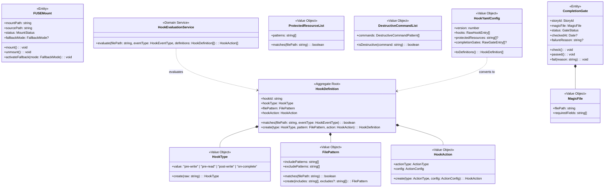

# ドメインモデル: fuse-hooks-engine

@story-id HF1-01
@story-id HF1-02
@story-id HF1-03
@story-id HF1-04
@story-id HF1-05
> **Unit ID**: fuse-hooks-engine
> **作成日**: 2026-03-20
> **最終更新**: 2026-03-20（Wave 2 初版）
> **Wave**: 2（ファイルシステムフックエンジン）
> **対応ストーリー**: HF1-01〜HF1-05
> **横断契約参照**: cross_cutting_decisions.md §2（Layer語彙）, §4（Shared Kernel最小化）, §6（集約降格）

---

## 1. Ownership / Import-Export

### このUnitが所有する概念

| 概念 | 分類 | 説明 |
|------|------|------|
| HookDefinition | 集約ルート | `.harness-hooks.yml` 1エントリを表す集約。HookType・FilePattern・HookAction（VO）を内包し、フックイベントのマッチングと実行アクション定義の整合性を保証する |
| FUSEMount | エンティティ | FUSEマウントポイント（仮想FSマウント境界）を表すエンティティ。プロジェクトルートに対するFUSE-T/libfuseのマウント状態・マウントオプション・フォールバックモードを管理する |
| CompletionGate | エンティティ | ストーリー完了条件を表すエンティティ。MagicFile（VO）の存在確認・タイムスタンプ・検証ステータスを管理し、DONE条件の充足を判定する |
| HookType | 値オブジェクト | フックイベント種別（`pre-write` / `pre-read` / `post-write` / `on-complete`）の宣言的表現 |
| FilePattern | 値オブジェクト | glob形式ファイルパターン。対象ファイルマッチング条件（include/excludeパターン）を保持する |
| HookAction | 値オブジェクト | フックが実行するアクション定義（blockWrite / allowRead / runShellScript / triggerCompletionCheck）の宣言的表現 |
| MagicFile | 値オブジェクト | 完了ゲート用マジックファイルのパスと検証ルール（ファイル名パターン・必須フィールド）を保持するVO |
| ProtectedResourceList | 値オブジェクト | PreReadブロック対象の保護リソースパス一覧。globパターンリストとして保持し、マッチング判定を行う |
| DestructiveCommandList | 値オブジェクト | シェルラッパーでブロック対象とする破壊的コマンド一覧（`rm -rf` / `git reset --hard` 等）とそのオプションパターンを保持する |
| HookYamlConfig | 値オブジェクト | `.harness-hooks.yml` ファイル全体のパース済み設定構造。HookDefinition[]への変換前の生構造を保持する |
| HookEvaluationService | ドメインサービス | HookDefinition集約を参照しつつ、FUSEイベント（write/read等）に対してマッチするHookDefinitionを探索し、実行すべきHookActionを決定する |

### 他Unitから受け取るShared Kernel

| 型名 | 所有Unit | 自Unitでの扱い | 変更可否 |
|------|---------|---------------|---------|
| HarnessError | harness-error | HookAction実行失敗・YAML解析エラー・フォールバック不可等のエラー表現に使用 | 読取専用 |
| HarnessErrorCode | harness-error | フックエンジン固有エラーコードの参照に使用 | 読取専用 |
| HarnessConfigV2 | config-foundation | フックエンジン設定（fuseEnabled / hookYamlPath / fallbackMode）の取得に使用 | 読取専用 |

### 他Unitへ公開する契約

| 契約 | 消費Unit | 内容 |
|------|---------|------|
| なし | — | Wave 2 初版では外部公開契約なし。将来的にHookEventは他Unitへのイベント通知として検討 |

---

## 2. Aggregate Boundary

### 結論: 集約3つ（HookDefinition / FUSEMount / CompletionGate）

横断契約§6の集約降格方針を参照しつつ、以下の分析により3集約を維持する。

### HookDefinitionを集約ルートとして維持する根拠

- **複合整合性**: HookType（フックイベント種別）・FilePattern（マッチ対象）・HookAction（実行アクション）の3つVOの複合整合性（例: `pre-read` フックに `blockWrite` アクションは不正）を保証する責務がある
- **ドメインロジックの存在**: `matches(filePath, eventType)` メソッドはFilePatternとHookTypeを組み合わせたマッチング判定であり、純粋なVOでは表現できない
- **永続化なし**: HookDefinitionはYAMLからの読み取りで都度生成され、`.harness-hooks.yml` の解析結果としてメモリ上のみに存在する

### FUSEMountをエンティティとして維持する根拠

- **状態管理**: `mounted` / `unmounted` / `fallback` という明確なライフサイクル状態を持つ
- **FUSE非利用時のフォールバック**: FUSE-T/libfuse が利用不可な環境（CI環境・Docker等）でのL1-L4フォールバック動作モードを管理する責務がある
- **識別性**: マウントポイントパス（`mountPath`）が識別子となる

**永続化なし**: FUSEMountは実行時のマウント状態をメモリ上で管理する。マウント状態の永続化はFuseHandlerPortに委譲する。

### CompletionGateをエンティティとして維持する根拠

- **状態遷移**: `pending` → `checking` → `passed` / `failed` という完了判定ライフサイクルがある
- **永続化の必要性**: MagicFileの存在確認結果とタイムスタンプを `.harness/completion-state.json` に永続化する
- **複合管理**: MagicFile（VO）とチェックタイムスタンプの整合性を集約内で管理する
- **識別性**: storyId（`StoryId`）が識別子となる

---

## 3. Model Classification

### 集約ルート / エンティティ

| モデル | 分類 | 識別子 | 永続化 | ライフサイクル |
|--------|------|--------|--------|--------------|
| HookDefinition | 集約ルート | hookId（自動採番UUID） | なし（.harness-hooks.yml から都度生成） | LoadHookConfigUseCase が生成 → HookEvaluationService で評価 |
| FUSEMount | エンティティ | mountPath（string） | なし（実行時メモリ上のみ） | マウント時生成 → 状態遷移 → アンマウント消滅 |
| CompletionGate | エンティティ | storyId（StoryId） | あり（`.harness/completion-state.json`） | ストーリー開始時生成 → check() → passed/failed |

### 値オブジェクト

| 値オブジェクト | 不変 | 値等価性 | 説明 |
|-------------|------|---------|------|
| HookType | ✓ | ✓ | `'pre-write' \| 'pre-read' \| 'post-write' \| 'on-complete'` |
| FilePattern | ✓ | ✓ | `includePatterns: string[]`（1件以上必須）, `excludePatterns: string[]`（省略可） |
| HookAction | ✓ | ✓ | `actionType: ActionType`, `config: ActionConfig`（アクション種別依存） |
| MagicFile | ✓ | ✓ | `filePath: string`（相対パス必須）, `requiredFields: string[]`（省略可） |
| ProtectedResourceList | ✓ | ✓ | `patterns: string[]`（globパターン一覧）, 空リスト可 |
| DestructiveCommandList | ✓ | ✓ | `commands: DestructiveCommandPattern[]`（コマンド名 + 危険オプションパターン一覧） |
| HookYamlConfig | ✓ | ✓ | `version: number`, `hooks: RawHookEntry[]`（YAML生構造）, `protectedResources?: string[]`, `completionGates?: RawGateEntry[]` |

### 補助型

| 型 | 説明 |
|---|------|
| HookEventType | `'write' \| 'read' \| 'delete' \| 'rename'`（FUSEカーネルイベント） |
| ActionType | `'block-write' \| 'allow-read' \| 'run-shell' \| 'trigger-completion-check'` |
| ActionConfig | Union型: `BlockWriteConfig \| AllowReadConfig \| RunShellConfig \| TriggerCompletionConfig` |
| FallbackMode | `'L1' \| 'L2' \| 'L3' \| 'L4'`（FUSE非利用時フォールバックレベル） |
| GateStatus | `'pending' \| 'checking' \| 'passed' \| 'failed'` |
| MountStatus | `'mounted' \| 'unmounted' \| 'fallback' \| 'error'` |
| DestructiveCommandPattern | `{ command: string; dangerousOptions: string[] }` |
| BlockWriteConfig | `{ reason: string; notifyUser: boolean }` |
| AllowReadConfig | `{ maxAccessCount?: number }` |
| RunShellConfig | `{ script: string; timeout?: number; failOnNonZero: boolean }` |
| TriggerCompletionConfig | `{ gateId: string }` |
| StoryId | Shared Kernel（traceability-model）からインポート |

### ドメインサービス

| サービス | 責務 | 参照するポート |
|---------|------|--------------|
| HookEvaluationService | FUSEイベント（filePath + HookEventType）に対してマッチするHookDefinition[]を探索し、実行すべきHookAction[]を返す。`evaluate(filePath: string, eventType: HookEventType, definitions: HookDefinition[]): HookAction[]` | なし（純粋ドメインロジック） |

---

## 4. Port Interfaces

### 入力ポート（外部→ドメイン）

| ポート名 | 責務 | 利用UseCase |
|---------|------|------------|
| HookConfigReaderPort | `.harness-hooks.yml` のファイル読み取りとHookYamlConfigへのパース。`read(yamlPath: string): Promise<Result<HookYamlConfig, HarnessError[]>>` | LoadHookConfigUseCase |
| FuseHandlerPort | FUSE-T/libfuseのpre-write/pre-readイベントハンドラー登録・解除（スタブインターフェース）。`register(mountPath: string, handlers: FuseHandlers): Promise<void>` | EvaluateHookEventUseCase |
| FallbackHandlerPort | FUSE非利用時のL1-L4フォールバック実装。`handlePreWrite(filePath: string): Promise<HookAction \| null>` / `handlePreRead(filePath: string): Promise<HookAction \| null>` | ExecuteFallbackHookUseCase |
| ShellWrapperPort | DestructiveCommandListとの照合・シェルスクリプト実行ラッパー。`execute(script: string, options: ShellOptions): Promise<ShellResult>` | EvaluateHookEventUseCase |
| CompletionGatePort | CompletionGateの永続化・読み取り（`.harness/completion-state.json`）。`load(storyId: StoryId): Promise<CompletionGate \| null>` / `save(gate: CompletionGate): Promise<void>` | CheckCompletionGateUseCase |

### 出力ポート（ドメイン→外部）

| ポート名 | 責務 | 利用UseCase |
|---------|------|------------|
| なし（Wave 2 初版） | — | — |

> **注**: FuseHandlerPortは実際のFUSEカーネルバインディングを行わない。実装はスタブ/アダプタで代替し、FUSE-T/libfuse固有のビルド依存は持たない。

---

## 5. Domain Rules and Invariants

### 不変条件

| INV | 対象 | 内容 |
|-----|------|------|
| INV-1 | HookDefinition | `hookType` は `HookType` の4種（pre-write / pre-read / post-write / on-complete）のいずれかであること |
| INV-2 | HookDefinition | `filePattern.includePatterns` は1件以上であること（空リストは不正） |
| INV-3 | HookDefinition | `hookAction.actionType` は `ActionType` の4種のいずれかであること |
| INV-4 | HookDefinition | `pre-read` フックに `block-write` アクションは割り当て不可（意味的不整合） |
| INV-5 | HookDefinition | `on-complete` フックには必ず `trigger-completion-check` アクションを割り当てること |
| INV-6 | FUSEMount | `status=mounted` の場合、`mountPath` が実際にマウントされた有効なパスであること |
| INV-7 | FUSEMount | `status=fallback` の場合、`fallbackMode` が `L1`〜`L4` のいずれかであること |
| INV-8 | CompletionGate | `status=passed` の場合、`checkedAt` タイムスタンプが非null であること |
| INV-9 | CompletionGate | `status=failed` の場合、`failureReason` が非null・非空文字であること |
| INV-10 | MagicFile | `filePath` はプロジェクトルートからの相対パス形式であること（絶対パス禁止） |
| INV-11 | FilePattern | `includePatterns` の全エントリは有効なglob形式であること |
| INV-12 | ProtectedResourceList | `patterns` の全エントリは有効なglob形式であること（空リストは許容） |
| INV-13 | DestructiveCommandList | `commands[].command` は非空文字列であること |

### HookDefinitionアクション整合性ルール

| HookType | 許可するActionType | 禁止するActionType |
|---------|-----------------|-----------------|
| pre-write | block-write, run-shell | allow-read, trigger-completion-check |
| pre-read | allow-read, run-shell | block-write, trigger-completion-check |
| post-write | run-shell, trigger-completion-check | block-write, allow-read |
| on-complete | trigger-completion-check | block-write, allow-read, run-shell |

### FUSEフォールバックレベル定義

FUSE-T/libfuse が利用不可な環境では、以下のフォールバックレベルで動作する。

| レベル | 実装方式 | 機能範囲 |
|--------|---------|---------|
| L1 | inotify/kqueue ファイル監視 | write/read イベントのみ検知。FUSEイベントと等価 |
| L2 | git pre-commitフック | コミット前のみブロック動作。書き込みリアルタイム制御不可 |
| L3 | シェルラッパー + コマンドエイリアス | rm/git等危険コマンドのみブロック。ファイル監視なし |
| L4 | 設定バリデーションのみ | フック機能なし。`.harness-hooks.yml` の構文チェックのみ実行 |

### CompletionGate状態遷移

```
[初期状態]
  status = 'pending'
  checkedAt = null
  failureReason = null
       |
       | check() 呼び出し（MagicFile存在確認開始）
       v
[チェック中]
  status = 'checking'
       |
       +--- MagicFile 存在 + requiredFields 充足 ---→ passed()
       |                                               status = 'passed'
       |                                               checkedAt = now
       |
       +--- MagicFile 不存在 または requiredFields 不足 ---→ fail(reason)
                                                               status = 'failed'
                                                               failureReason = reason

※ status=passed から check() の再呼び出しは禁止（INV-8: 再評価不可）
※ status=failed から check() の再呼び出しは許可（再チェック可能）
```

---

## 6. Domain Events

| イベント名 | 発行元 | トリガー | ペイロード |
|-----------|--------|---------|----------|
| HookConfigLoaded | LoadHookConfigUseCase | `.harness-hooks.yml` の正常ロード完了時 | `{ definitions: HookDefinition[], yamlPath: string }` |
| HookEventBlocked | EvaluateHookEventUseCase | PreWrite/PreReadフックがファイルI/Oをブロックした時 | `{ filePath: string, eventType: HookEventType, action: HookAction, reason: string }` |
| HookEventAllowed | EvaluateHookEventUseCase | フック評価の結果アクセスが許可された時 | `{ filePath: string, eventType: HookEventType }` |
| ShellHookExecuted | EvaluateHookEventUseCase | run-shellアクションの実行完了時 | `{ script: string, exitCode: number, stdout: string }` |
| DestructiveCommandBlocked | ShellWrapperAdapter | 破壊的コマンドの実行がブロックされた時 | `{ command: string, reason: string }` |
| CompletionGateChecked | CheckCompletionGateUseCase | 完了ゲートのチェック完了時 | `{ storyId: StoryId, status: GateStatus, failureReason?: string }` |
| FUSEMountStateChanged | FuseHandlerPort | FUSEマウント状態が変化した時 | `{ mountPath: string, previousStatus: MountStatus, newStatus: MountStatus }` |
| FallbackActivated | ExecuteFallbackHookUseCase | FUSE非利用時にフォールバックが起動した時 | `{ fallbackMode: FallbackMode, reason: string }` |

> **注**: Wave 2 初版ではイベント発行の実装は行わない。イベント定義のみを記載し、将来のイベント駆動アーキテクチャ移行（他Unitへのイベント通知等）に備える。

---

## 7. Class Diagram



---

## 8. Data Flow

### HF1-01（.harness-hooks.yml定義ロード）

```
[アプリケーション層: LoadHookConfigUseCase]
  引数: yamlPath: string
       |
       v
HookConfigReaderPort.read(yamlPath)
  → YAML読み取り・パース
  → HookYamlConfig（VO）生成（INV-11: glob形式検証）
  → Result<HookYamlConfig, HarnessError[]>
       |
       v
HookYamlConfig → HookDefinition[] 変換
  各 RawHookEntry に対して:
    HookType.create(entry.type)      → INV-1チェック
    FilePattern.create(entry.files)  → INV-2, INV-11チェック
    HookAction.create(entry.action)  → INV-3チェック
    HookDefinition.create(type, pattern, action) → INV-4, INV-5チェック
  → Result<HookDefinition[], HarnessError[]>
```

### HF1-02（FUSEパススルー評価）

```
[アプリケーション層: EvaluateHookEventUseCase]
  引数: filePath: string, eventType: HookEventType
       |
       v
FUSEMount.status チェック
  → status='mounted': FUSEハンドラー経由で評価
  → status='fallback': ExecuteFallbackHookUseCase に委譲
  → status='error': HarnessError 返却
       |（mounted時）
       v
HookEvaluationService.evaluate(filePath, eventType, definitions)
  FilePattern.matches(filePath) で各HookDefinitionをフィルタ
  HookType.matches(eventType)  で絞り込み
  → マッチしたHookAction[] を返す
       |
       v
各HookAction を実行:
  'block-write'  → ファイル書き込みをブロック（FUSE pre-write拒否）
  'allow-read'   → ファイル読み込みを許可（ProtectedResourceList照合）
  'run-shell'    → ShellWrapperPort.execute(script)
  'trigger-completion-check' → CheckCompletionGateUseCase に委譲
```

### HF1-03（PreReadブロック）

```
[アプリケーション層: EvaluateHookEventUseCase（pre-readイベント時）]
  filePath が ProtectedResourceList.matches(filePath) に合致するか確認
       |
       +--- 合致: FusePreReadHandlerAdapter でアクセスブロック（stub）
       |
       +--- 不合致: FallbackPreReadAdapter で通常read処理（フォールバック時）
```

### HF1-04（シェルラッパー）

```
[アプリケーション層: EvaluateHookEventUseCase（run-shellアクション時）]
  HookAction.config as RunShellConfig → script, timeout, failOnNonZero
       |
       v
ShellWrapperAdapter.execute(script, { timeout, failOnNonZero })
  DestructiveCommandList による危険コマンド検出
  → 危険コマンド検出: HarnessError（DESTRUCTIVE_COMMAND_BLOCKED）
  → 安全なスクリプト: シェル実行 → ShellResult { exitCode, stdout, stderr }
       |
       v（failOnNonZero=true かつ exitCode !== 0 の場合）
  → HarnessError（SHELL_HOOK_FAILED）
```

### HF1-05（完了ゲート）

```
[アプリケーション層: CheckCompletionGateUseCase]
  引数: storyId: StoryId
       |
       v
CompletionGatePort.load(storyId)
  → 存在なし: CompletionGate.create(storyId, magicFile) → status='pending'
  → 存在あり: 既存CompletionGate取得
       |
       v
CompletionGate.check()
  → status='checking' に遷移
  MagicFile存在確認（CompletionGateFileAdapterへ委譲）
    → 存在 + requiredFields充足: CompletionGate.passed() → status='passed'
    → 不存在 / フィールド不足:   CompletionGate.fail(reason) → status='failed'
       |
       v
CompletionGatePort.save(gate)
  → .harness/completion-state.json に永続化
  → GateStatus返却（passed / failed）
```

---

## 9. 設計判断記録

### D1: FuseHandlerPortはスタブインターフェースとして設計

実際のFUSE-T/libfuseバインディング（Rustバインディング・Cライブラリ）は実装コストが高く、CI環境での動作保証が困難なため、FuseHandlerPortはスタブインターフェースとして定義する。実FUSE実装はプロダクション向けの将来拡張として保留し、現行実装はFallbackHandlerPortによるL1-L4フォールバック動作で代替する。

### D2: FUSEMountをエンティティとして扱い、フォールバックモードを内包

FUSEMountは「現在のマウント状態」と「フォールバックレベル」を統一的に管理するエンティティとして設計する。これによりEvaluateHookEventUseCaseはFUSEMountの状態を確認するだけで、実FUSE／フォールバックのどちらで処理するかを決定できる（Strategy的な切り替え）。

### D3: HookEvaluationServiceはポート依存なし（純粋ドメインロジック）

HookDefinition[]に対するマッチング評価は純粋なドメインロジックであり、ファイルI/OやシステムAPIへの依存を持たない。これによりユニットテストでのモックコスト最小化とドメインロジックの高いテスタビリティを実現する。

### D4: CompletionGateの永続化ファイルを`.harness/completion-state.json`とする

完了ゲートの状態は複数の実行（コミット・CI等）をまたいで参照されるため永続化が必要。config-foundationの`.harness/`ディレクトリ慣例に従い、`completion-state.json`に格納する。

### D5: DestructiveCommandListはVOとして設計し、危険コマンドの宣言的管理を実現

破壊的コマンドの定義を`.harness-hooks.yml`の`destructiveCommands`セクションで宣言的に記述可能とし、VO`DestructiveCommandList`として保持する。ShellWrapperAdapterはこのVOを参照してコマンドブロック判定を行う。

### D6: INV-4/INV-5によりHookType×HookActionの整合性をドメイン層で強制

HookType（pre-read）に対するHookAction（block-write）の組み合わせ禁止をドメイン層のHookDefinition集約が検証することで、設定ファイルの意味的な誤りをアプリケーション層より早い段階で検出する。

---

## 10. 品質評価（engineering-perspective）

### ドメインスメルチェック

- **責務混在**: FUSEMountはマウント状態管理のみを担い、実FUSEバインディングはFuseHandlerPort（インフラ層）に委譲 → 問題なし
- **不適切なVO**: HookActionはアクション定義のみ保持し、実行はShellWrapperPort/CompletionGatePort（インフラ層）に委譲 → 正当な判断
- **境界不明確**: FallbackHandlerPortとFuseHandlerPortを明確に分離し、フォールバック動作の差し込み口を定義 → 境界明確
- **INV-4/INV-5によるアクション整合性**: HookDefinition集約内でHookType×HookActionの整合を強制 → 不変条件の適切な適用

### SOLID評価

- **SRP**: HookEvaluationServiceがマッチング評価に特化、CompletionGateが完了判定に特化 → 遵守
- **OCP**: 新HookTypeの追加はHookDefinitionのバリデーションテーブル拡張のみで対応可能 → 拡張に開いている
- **依存方向**: ドメイン層がポートを定義し、infrastructure層がPortを実装 → 遵守
- **インターフェース分離**: HookConfigReaderPort / FuseHandlerPort / FallbackHandlerPort / ShellWrapperPort / CompletionGatePortが責務別に分離 → 遵守

### シンプルさ評価

- 1集約ルート + 2エンティティ + 1ドメインサービス + 7VO という関心領域に対して適切な規模
- FuseHandlerPortをスタブ設計とすることで、FUSE依存なしにユニット全体のテストを実現
- L1-L4フォールバックをFallbackHandlerPort実装に閉じ込めることで、ドメイン層をフォールバック実装の詳細から分離

### リスク評価

| リスク | 評価 | 対応方針 |
|--------|------|---------|
| FUSE-T/libfuseの環境依存（macOS専用等） | 高 | FuseHandlerPortをスタブ設計とし、実FUSE実装を切り離す |
| L1-L4フォールバックの機能差（イベントキャプチャ精度） | 中 | FUSEMountのfallbackModeでレベルを明示し、各レベルの制限をドキュメント化 |
| `.harness-hooks.yml` YAML破損による全フック無効化 | 低 | ValidateHookYamlUseCaseで起動時バリデーションを実行し、破損時はL4フォールバックへ自動降格 |
| CompletionGate永続化ファイルのスキーマ進化 | 低 | CompletionGatePort実装がスキーマバージョン管理を担い、ドメイン層への影響を遮断 |

**評価結果**: 問題なし。設計を確定する。
