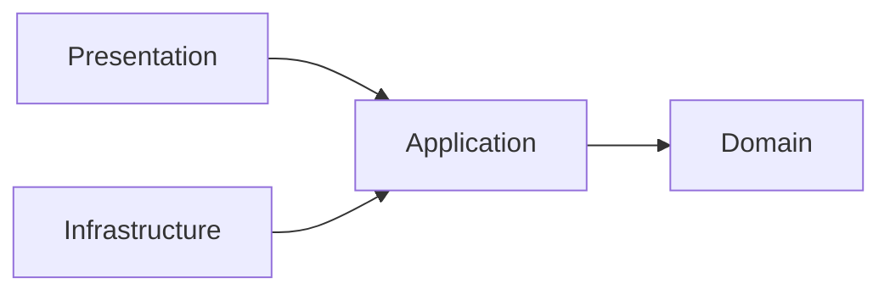

# 論理設計: fuse-hooks-engine

@story-id HF1-01
@story-id HF1-02
@story-id HF1-03
@story-id HF1-04
@story-id HF1-05
> **Unit ID**: fuse-hooks-engine
> **作成日**: 2026-03-20
> **対応ストーリー**: HF1-01, HF1-02, HF1-03, HF1-04, HF1-05
> **モード**: Unit横断設計（Phase 2）
> **前提ドキュメント**:
> - `docs/product/construction/fuse-hooks-engine/domain_model.md`
> - `docs/principles/architecture-philosophy.md`
> - `docs/inception/_shared/cross_cutting_decisions.md`

---

## 1. アーキテクチャ概要

### 1.1 層構成と責務

| 層 | 責務 | 主な構成要素 | 依存先 |
|----|------|-------------|--------|
| Domain | HookDefinition集約不変条件・HookType/FilePattern/HookAction等VOの値検証・HookEvaluationServiceドメインサービス・ポート定義（5本） | 集約ルート、エンティティ、値オブジェクト、ドメインサービス、ポートインターフェース | なし |
| Application | ドメインモデルを用いたユースケース調停（HF1-01〜HF1-05）、入出力DTOへの投影、FUSEモード/フォールバックモードの切り替え調停 | UseCase、DTO | Domain |
| Infrastructure | ドメインポート実装、YAML読み取り・パース、FUSEスタブアダプタ、L1-L4フォールバック実装、シェル実行、CompletionGate永続化 | Adapter、Stub | Application, Domain |
| Presentation | CLIハンドラー（`harness:hook-config`等）、出力フォーマッター、終了コード決定 | CLI handler、Formatter | Application, Domain |

### 1.2 依存方向



```text
domain <- application <- infrastructure
domain <- application <- presentation
```

- Domain層は外部I/Oに依存しない。集約・VO・ドメインサービスはポートインターフェースのみを参照する
- Application層はDomain調停に徹し、I/O実装を保持しない
- Infrastructure層は `domain/ports/` に定義されたポートインターフェースのみを実装する
- Presentation層はApplication層経由でのみDomainを利用する
- Shared Kernelのインポートは `scripts/harness/shared-kernel/` 経由のみとし、他Unitのドメイン内部ディレクトリを直接importしない

### 1.3 ディレクトリ構成（全ファイル一覧）

```text
scripts/harness/
└── fuse-hooks-engine/
    ├── domain/
    │   ├── types/
    │   │   ├── hook-event-type.ts            # HookEventType補助型
    │   │   ├── action-type.ts                # ActionType補助型
    │   │   ├── action-config.ts              # ActionConfig Union型・BlockWriteConfig等
    │   │   ├── fallback-mode.ts              # FallbackMode補助型
    │   │   ├── gate-status.ts                # GateStatus補助型
    │   │   ├── mount-status.ts               # MountStatus補助型
    │   │   └── destructive-command-pattern.ts # DestructiveCommandPattern型
    │   ├── aggregates/
    │   │   └── hook-definition.ts            # HookDefinition集約ルート
    │   ├── entities/
    │   │   ├── fuse-mount.ts                 # FUSEMountエンティティ
    │   │   └── completion-gate.ts            # CompletionGateエンティティ
    │   ├── value-objects/
    │   │   ├── hook-type.ts                  # HookType VO
    │   │   ├── file-pattern.ts               # FilePattern VO
    │   │   ├── hook-action.ts                # HookAction VO
    │   │   ├── magic-file.ts                 # MagicFile VO
    │   │   ├── protected-resource-list.ts    # ProtectedResourceList VO
    │   │   ├── destructive-command-list.ts   # DestructiveCommandList VO
    │   │   └── hook-yaml-config.ts           # HookYamlConfig VO
    │   ├── services/
    │   │   └── hook-evaluation-service.ts    # HookEvaluationServiceドメインサービス
    │   └── ports/
    │       ├── hook-config-reader-port.ts    # HookConfigReaderPort
    │       ├── fuse-handler-port.ts          # FuseHandlerPort（スタブ）
    │       ├── fallback-handler-port.ts      # FallbackHandlerPort
    │       ├── shell-wrapper-port.ts         # ShellWrapperPort
    │       └── completion-gate-port.ts       # CompletionGatePort
    ├── application/
    │   ├── dto/
    │   │   ├── load-hook-config-input.ts
    │   │   ├── load-hook-config-output.ts
    │   │   ├── evaluate-hook-event-input.ts
    │   │   ├── evaluate-hook-event-output.ts
    │   │   ├── check-completion-gate-input.ts
    │   │   ├── check-completion-gate-output.ts
    │   │   ├── execute-fallback-hook-input.ts
    │   │   ├── execute-fallback-hook-output.ts
    │   │   ├── validate-hook-yaml-input.ts
    │   │   └── validate-hook-yaml-output.ts
    │   └── usecases/
    │       ├── load-hook-config-usecase.ts        # HF1-01: .harness-hooks.yml ロード
    │       ├── evaluate-hook-event-usecase.ts     # HF1-02: FUSEパススルー評価
    │       ├── check-completion-gate-usecase.ts   # HF1-05: 完了ゲート確認
    │       ├── execute-fallback-hook-usecase.ts   # HF1-02〜04: フォールバック実行
    │       └── validate-hook-yaml-usecase.ts      # HF1-01: YAML検証のみ
    ├── infrastructure/
    │   ├── adapters/
    │   │   ├── yaml-hook-config-reader-adapter.ts     # HookConfigReaderPort実装（YAML読み取り）
    │   │   ├── fuse-pre-write-handler-adapter.ts      # FuseHandlerPort実装（スタブ）
    │   │   ├── fuse-pre-read-handler-adapter.ts       # FuseHandlerPort実装（スタブ）
    │   │   ├── fallback-pre-write-adapter.ts          # FallbackHandlerPort実装（L1-L4 pre-write）
    │   │   ├── fallback-pre-read-adapter.ts           # FallbackHandlerPort実装（L1-L4 pre-read）
    │   │   ├── shell-wrapper-adapter.ts               # ShellWrapperPort実装
    │   │   └── completion-gate-file-adapter.ts        # CompletionGatePort実装（JSON永続化）
    │   └── schema/
    │       └── completion-state-schema.ts             # .harness/completion-state.json スキーマ定義
    └── presentation/
        ├── dto/
        │   └── hook-engine-render-options.ts
        ├── formatters/
        │   ├── hook-config-formatter.ts
        │   └── completion-gate-formatter.ts
        └── handlers/
            ├── hook-config-handler.ts                 # `harness:hook-config` CLIハンドラー
            └── completion-gate-handler.ts             # `harness:gate-check` CLIハンドラー
```

---

## 2. Domain層設計

### 2.1 集約ルート: HookDefinition

#### 属性一覧

| 属性 | 型 | 説明 | 必須 |
|------|----|------|------|
| hookId | `string` | UUID形式の自動採番識別子 | Yes |
| hookType | `HookType` | フックイベント種別VO | Yes |
| filePattern | `FilePattern` | マッチ対象ファイルパターンVO | Yes |
| hookAction | `HookAction` | 実行アクション定義VO | Yes |
| description | `string \| null` | フック定義の説明（省略可） | No |

#### メソッド一覧

##### `static create(hookType: HookType, filePattern: FilePattern, hookAction: HookAction, description?: string): Result<HookDefinition, HarnessError[]>`

- 入力: `hookType: HookType`, `filePattern: FilePattern`, `hookAction: HookAction`, `description?: string`
- 出力: `Result<HookDefinition, HarnessError[]>`
- 処理フロー:
  1. INV-4チェック: `hookType.value === 'pre-read'` かつ `hookAction.actionType === 'block-write'` の場合エラー
  2. INV-5チェック: `hookType.value === 'on-complete'` かつ `hookAction.actionType !== 'trigger-completion-check'` の場合エラー
  3. 上記を通過した場合、hookId（UUID）を自動採番してHookDefinitionを生成
- 不変条件: INV-1〜INV-5

##### `matches(filePath: string, eventType: HookEventType): boolean`

- 入力: `filePath: string`, `eventType: HookEventType`
- 出力: `boolean`
- 処理フロー:
  1. `hookType.matchesEvent(eventType)` でイベント種別を確認する
  2. `filePattern.test(filePath)` でファイルパスがincludePatternsにマッチし、excludePatternsにマッチしないことを確認する
  3. 両方trueの場合にtrueを返す

##### `getAction(): HookAction`

- 出力: `HookAction`（内部保持のhookAction VOを返す）

#### バリデーションルール

| ルール | 内容 | 違反コード |
|--------|------|----------|
| INV-1 | hookTypeは4種のいずれか | `HOOK_INVALID_TYPE` |
| INV-2 | filePattern.includePatternsは1件以上 | `HOOK_EMPTY_INCLUDE_PATTERN` |
| INV-3 | hookAction.actionTypeは4種のいずれか | `HOOK_INVALID_ACTION_TYPE` |
| INV-4 | pre-readフックにblock-writeアクション不可 | `HOOK_ACTION_TYPE_MISMATCH` |
| INV-5 | on-completeフックはtrigger-completion-checkアクション必須 | `HOOK_ACTION_TYPE_MISMATCH` |

---

### 2.2 エンティティ: FUSEMount

#### 属性一覧

| 属性 | 型 | 説明 | 必須 |
|------|----|------|------|
| mountPath | `string` | マウントポイントパス（識別子） | Yes |
| status | `MountStatus` | `'mounted' \| 'unmounted' \| 'fallback' \| 'error'` | Yes |
| fallbackMode | `FallbackMode \| null` | フォールバック時のレベル（L1〜L4） | No（fallback時のみ非null） |
| mountOptions | `Record<string, unknown> \| null` | FUSEマウントオプション（stub用） | No |

#### メソッド一覧

##### `static create(mountPath: string): FUSEMount`

初期状態（status='unmounted'）のFUSEMountを生成する。

##### `mount(options?: Record<string, unknown>): void`

status='mounted'に遷移。INV-6: mountPathが有効なパスであることを確認。

##### `enterFallback(mode: FallbackMode): void`

status='fallback'に遷移。INV-7: modeがL1〜L4のいずれかであることを確認。

##### `isMounted(): boolean`

status === 'mounted'を返す。

##### `isFallback(): boolean`

status === 'fallback'を返す。

##### `getFallbackMode(): FallbackMode | null`

fallbackModeを返す。

---

### 2.3 エンティティ: CompletionGate

#### 属性一覧

| 属性 | 型 | 説明 | 必須 |
|------|----|------|------|
| storyId | `StoryId` | 識別子（traceability-modelのStoryId） | Yes |
| magicFile | `MagicFile` | 完了判定用マジックファイル定義VO | Yes |
| status | `GateStatus` | `'pending' \| 'checking' \| 'passed' \| 'failed'` | Yes |
| checkedAt | `string \| null` | 完了確認タイムスタンプ（ISO8601） | No（passed時のみ非null） |
| failureReason | `string \| null` | 失敗理由（failed時のみ非null） | No |

#### メソッド一覧

##### `static create(storyId: StoryId, magicFile: MagicFile): CompletionGate`

初期状態（status='pending'）のCompletionGateを生成。

##### `startCheck(): void`

status='checking'に遷移。

##### `passed(): void`

status='passed'に遷移。INV-8: checkedAt = new Date().toISOString() をセット。

##### `fail(reason: string): void`

status='failed'に遷移。INV-9: reasonが非空文字であることを確認。failureReasonをセット。

##### `isPassed(): boolean`

status === 'passed'を返す。

##### `canRecheck(): boolean`

status === 'failed'または status === 'pending'の場合にtrueを返す（passed状態での再チェック禁止）。

---

### 2.4 値オブジェクト

#### HookType

```typescript
type HookTypeValue = 'pre-write' | 'pre-read' | 'post-write' | 'on-complete';

class HookType {
  static create(value: string): Result<HookType, HarnessError>
  matchesEvent(eventType: HookEventType): boolean
  equals(other: HookType): boolean
  get value(): HookTypeValue
}
```

- `matchesEvent` マッピング:
  - `pre-write` ← `'write'` イベント（書き込み前）
  - `pre-read` ← `'read'` イベント（読み込み前）
  - `post-write` ← `'write'` イベント（書き込み後）
  - `on-complete` ← `'write'` イベント（マジックファイル書き込み）

#### FilePattern

```typescript
class FilePattern {
  static create(includePatterns: string[], excludePatterns?: string[]): Result<FilePattern, HarnessError>
  test(filePath: string): boolean   // includeにマッチ && excludeにマッチしない
  equals(other: FilePattern): boolean
  get includePatterns(): readonly string[]
  get excludePatterns(): readonly string[]
}
```

- INV-11: includePatterns の全エントリが有効なglob形式（picomatchで検証）

#### HookAction

```typescript
class HookAction {
  static create(actionType: string, config: ActionConfig): Result<HookAction, HarnessError>
  equals(other: HookAction): boolean
  get actionType(): ActionType
  get config(): ActionConfig
}
```

#### MagicFile

```typescript
class MagicFile {
  static create(filePath: string, requiredFields?: string[]): Result<MagicFile, HarnessError>
  equals(other: MagicFile): boolean
  get filePath(): string          // 相対パス必須（INV-10）
  get requiredFields(): readonly string[]
}
```

#### ProtectedResourceList

```typescript
class ProtectedResourceList {
  static create(patterns: string[]): Result<ProtectedResourceList, HarnessError>
  matches(filePath: string): boolean
  equals(other: ProtectedResourceList): boolean
  get patterns(): readonly string[]
}
```

#### DestructiveCommandList

```typescript
class DestructiveCommandList {
  static create(commands: DestructiveCommandPattern[]): Result<DestructiveCommandList, HarnessError>
  isDestructive(commandLine: string): boolean
  equals(other: DestructiveCommandList): boolean
  get commands(): readonly DestructiveCommandPattern[]
}
```

#### HookYamlConfig

```typescript
class HookYamlConfig {
  static create(raw: unknown): Result<HookYamlConfig, HarnessError[]>  // AJVスキーマバリデーション
  toHookDefinitions(): Result<HookDefinition[], HarnessError[]>
  get version(): number
  get hooks(): readonly RawHookEntry[]
  get protectedResources(): readonly string[]
  get completionGates(): readonly RawGateEntry[]
}
```

---

### 2.5 ドメインサービス: HookEvaluationService

```typescript
class HookEvaluationService {
  // ポート依存なし（純粋ドメインロジック）

  evaluate(
    filePath: string,
    eventType: HookEventType,
    definitions: HookDefinition[]
  ): HookAction[]

  // 実装フロー:
  // 1. definitions から matches(filePath, eventType) = true のものをフィルタ
  // 2. フィルタ結果の各定義から getAction() を収集
  // 3. HookAction[] を返す（空配列 = マッチなし = 通過）
}
```

---

## 3. Application層設計

### 3.1 LoadHookConfigUseCase（HF1-01）

**入力**: `LoadHookConfigInput { yamlPath: string }`

**出力**: `LoadHookConfigOutput { definitions: HookDefinitionDto[]; protectedResources: string[]; errors: HarnessErrorDto[] }`

**フロー**:
1. `HookConfigReaderPort.read(yamlPath)` で HookYamlConfig取得
2. `HookYamlConfig.toHookDefinitions()` でHookDefinition[]変換
3. 各HookDefinition を HookDefinitionDto にマッピング
4. エラーがあれば `errors` に集約して返す

**依存**: HookConfigReaderPort

---

### 3.2 EvaluateHookEventUseCase（HF1-02, HF1-03, HF1-04）

**入力**: `EvaluateHookEventInput { filePath: string; eventType: HookEventType; mountStatus: MountStatus; fallbackMode?: FallbackMode }`

**出力**: `EvaluateHookEventOutput { actions: HookActionDto[]; blocked: boolean; errors: HarnessErrorDto[] }`

**フロー**:
1. `mountStatus` が `'mounted'` かどうかを確認
   - `'mounted'`: FuseHandlerPort経由でイベント評価（スタブ）
   - `'fallback'`: `ExecuteFallbackHookUseCase` に委譲
   - `'error'`: エラー返却
2. HookEvaluationService.evaluate() でマッチするHookAction[]取得
3. 各HookActionを実行:
   - `block-write`: ブロック返却（`blocked=true`）
   - `run-shell`: ShellWrapperPort.execute()
   - `allow-read`: ProtectedResourceList照合
   - `trigger-completion-check`: CheckCompletionGateUseCaseに委譲

**依存**: FuseHandlerPort, ShellWrapperPort, HookEvaluationService, ExecuteFallbackHookUseCase, CheckCompletionGateUseCase

---

### 3.3 CheckCompletionGateUseCase（HF1-05）

**入力**: `CheckCompletionGateInput { storyId: string; magicFilePath: string; requiredFields?: string[] }`

**出力**: `CheckCompletionGateOutput { gateStatus: GateStatus; checkedAt: string | null; failureReason: string | null; errors: HarnessErrorDto[] }`

**フロー**:
1. `CompletionGatePort.load(storyId)` でCompletionGate取得（存在しなければ新規作成）
2. `CompletionGate.canRecheck()` で再チェック可否を確認
3. `CompletionGate.startCheck()` でstatus='checking'に遷移
4. MagicFileの存在確認（CompletionGateFileAdapterに委譲）
5. 存在 + requiredFields充足: `CompletionGate.passed()`
6. 不存在/フィールド不足: `CompletionGate.fail(reason)`
7. `CompletionGatePort.save(gate)` で永続化

**依存**: CompletionGatePort

---

### 3.4 ExecuteFallbackHookUseCase（HF1-02〜04フォールバック時）

**入力**: `ExecuteFallbackHookInput { filePath: string; eventType: HookEventType; fallbackMode: FallbackMode }`

**出力**: `ExecuteFallbackHookOutput { action: HookActionDto | null; errors: HarnessErrorDto[] }`

**フロー**:
1. `fallbackMode` に応じてFallbackHandlerPortに委譲:
   - `L1`: FallbackHandlerPort.handlePreWrite/handlePreRead（ファイル監視）
   - `L2`: git pre-commitフック経由（ShellWrapperPort経由）
   - `L3`: DestructiveCommandList照合のみ（ShellWrapperPort）
   - `L4`: HarnessError返却（フォールバック機能なし）

**依存**: FallbackHandlerPort, ShellWrapperPort

---

### 3.5 ValidateHookYamlUseCase（HF1-01 バリデーション専用）

**入力**: `ValidateHookYamlInput { yamlPath: string }`

**出力**: `ValidateHookYamlOutput { valid: boolean; errors: HarnessErrorDto[] }`

**フロー**:
1. `HookConfigReaderPort.read(yamlPath)` でYAML読み取り
2. バリデーションエラーのみを返す（HookDefinition生成は行わない）

**依存**: HookConfigReaderPort

---

## 4. Infrastructure層設計

### 4.1 YamlHookConfigReaderAdapter（HookConfigReaderPort実装）

- `js-yaml` でYAMLパース
- `ajv` でJSONスキーマバリデーション（`.harness-hooks.yml` スキーマ）
- パース成功: HookYamlConfig.create(raw) を呼び出してVOを生成
- パース失敗: HarnessError（HOOK_YAML_PARSE_ERROR）を返す

### 4.2 FusePreWriteHandlerAdapter / FusePreReadHandlerAdapter（FuseHandlerPortスタブ実装）

- **スタブ設計**: 実際のFUSEカーネルバインディングは行わない
- `register(mountPath, handlers)`: ハンドラーをメモリマップに登録するのみ
- `dispatch(filePath, eventType)`: 登録済みハンドラーを呼び出す（インプロセス実行）
- 将来の実FUSE実装への差し替えを考慮したインターフェース設計

### 4.3 FallbackPreWriteAdapter / FallbackPreReadAdapter（FallbackHandlerPort実装）

| フォールバックレベル | 実装方式 |
|------------------|---------|
| L1 | `chokidar` または `fs.watch` でファイル変更を監視。HookDefinition[]に対してマッチング実行 |
| L2 | `.git/hooks/pre-commit` スクリプトを生成・実行（ShellWrapperPort経由） |
| L3 | DestructiveCommandListとの照合のみ（シェルスクリプト生成なし） |
| L4 | 常にnullを返す（フォールバック機能なし、バリデーションのみ） |

### 4.4 ShellWrapperAdapter（ShellWrapperPort実装）

- DestructiveCommandListとの照合（`isDestructive(commandLine)` 呼び出し）
- 安全なコマンドのみ `child_process.exec()` で実行
- `timeout` 指定時はタイムアウト制御
- `failOnNonZero=true` かつ `exitCode !== 0` の場合: HarnessError（SHELL_HOOK_FAILED）

### 4.5 CompletionGateFileAdapter（CompletionGatePort実装）

- `.harness/completion-state.json` の読み書き（`fs/promises`）
- スキーマバリデーション（`ajv`）
- `load(storyId)`: JSONからCompletionGateエンティティを復元
- `save(gate)`: CompletionGateエンティティをJSONに変換して永続化

---

## 5. Presentation層設計

### 5.1 HookConfigHandler（`harness:hook-config` CLIコマンド）

| サブコマンド | UseCase | 説明 |
|------------|---------|------|
| `harness:hook-config load` | LoadHookConfigUseCase | `.harness-hooks.yml` のロードと表示 |
| `harness:hook-config validate` | ValidateHookYamlUseCase | `.harness-hooks.yml` の検証のみ |

### 5.2 CompletionGateHandler（`harness:gate-check` CLIコマンド）

| サブコマンド | UseCase | 説明 |
|------------|---------|------|
| `harness:gate-check <storyId>` | CheckCompletionGateUseCase | 指定ストーリーの完了ゲート確認 |

---

## 6. ストーリー別設計詳細

### HF1-01: .harness-hooks.yml定義ロード

**目的**: `.harness-hooks.yml` を読み込み、HookDefinition[]に変換する

**主要コンポーネント**:
- UseCase: `LoadHookConfigUseCase`, `ValidateHookYamlUseCase`
- Port: `HookConfigReaderPort`
- Adapter: `YamlHookConfigReaderAdapter`
- VO: `HookYamlConfig`, `HookType`, `FilePattern`, `HookAction`
- Handler: `HookConfigHandler`

**正常フロー**:
```
CLI: harness:hook-config load
  → HookConfigHandler
  → LoadHookConfigUseCase.execute({ yamlPath: '.harness-hooks.yml' })
  → YamlHookConfigReaderAdapter.read()
  → HookYamlConfig.create(raw)     ← AJVバリデーション
  → HookYamlConfig.toHookDefinitions()  ← INV-1〜5チェック
  → HookDefinitionDto[] → 標準出力
```

**異常フロー**:
- YAML構文エラー: `HOOK_YAML_PARSE_ERROR`
- INV違反: `HOOK_INVALID_TYPE` / `HOOK_EMPTY_INCLUDE_PATTERN` / `HOOK_ACTION_TYPE_MISMATCH`
- ファイル不存在: `HOOK_YAML_NOT_FOUND`

---

### HF1-02: FUSEパススルー評価

**目的**: FUSEイベント（write/read）に対してHookDefinitionをマッチングし、アクションを実行する

**主要コンポーネント**:
- UseCase: `EvaluateHookEventUseCase`
- DS: `HookEvaluationService`
- Port: `FuseHandlerPort`（スタブ）, `ShellWrapperPort`
- Adapter: `FusePreWriteHandlerAdapter`（スタブ）, `ShellWrapperAdapter`

**FUSE状態による分岐**:
```
FUSEMount.status
  'mounted'  → FuseHandlerPort（スタブ）経由でHookEvaluationService.evaluate()
  'fallback' → ExecuteFallbackHookUseCase（L1-L4フォールバック）
  'error'    → HarnessError（FUSE_MOUNT_ERROR）返却
```

---

### HF1-03: PreReadブロック

**目的**: 保護リソースへの読み取りアクセスをブロックする

**主要コンポーネント**:
- UseCase: `EvaluateHookEventUseCase`（pre-readイベント時）
- VO: `ProtectedResourceList`
- Adapter: `FusePreReadHandlerAdapter`（スタブ）, `FallbackPreReadAdapter`

**フロー**:
```
pre-readイベント発生
  → ProtectedResourceList.matches(filePath)
  → true:  FusePreReadHandlerAdapter.block()（スタブ）/ FallbackPreReadAdapter（フォールバック）
  → false: 通常read処理（パス）
```

---

### HF1-04: シェルラッパー

**目的**: HookActionの `run-shell` アクションを安全に実行する

**主要コンポーネント**:
- UseCase: `EvaluateHookEventUseCase`
- Port: `ShellWrapperPort`
- Adapter: `ShellWrapperAdapter`
- VO: `DestructiveCommandList`

**安全チェックフロー**:
```
HookAction.actionType === 'run-shell'
  → RunShellConfig.script 取得
  → DestructiveCommandList.isDestructive(script)
  → true:  DESTRUCTIVE_COMMAND_BLOCKED エラー
  → false: ShellWrapperPort.execute(script, { timeout, failOnNonZero })
           → ShellResult { exitCode, stdout, stderr }
```

---

### HF1-05: 完了ゲート

**目的**: ストーリー完了条件（マジックファイル存在）を確認し、ゲートステータスを更新する

**主要コンポーネント**:
- UseCase: `CheckCompletionGateUseCase`
- Entity: `CompletionGate`
- VO: `MagicFile`
- Port: `CompletionGatePort`
- Adapter: `CompletionGateFileAdapter`
- Handler: `CompletionGateHandler`

**完了判定フロー**:
```
harness:gate-check <storyId>
  → CompletionGateHandler
  → CheckCompletionGateUseCase.execute({ storyId, magicFilePath })
  → CompletionGatePort.load(storyId) または 新規作成
  → CompletionGate.startCheck()
  → MagicFile存在確認（fs.access）
    → 存在: MagicFile.requiredFields チェック
      → 全充足: CompletionGate.passed() → 'passed'
      → 不足:   CompletionGate.fail(reason) → 'failed'
    → 不存在: CompletionGate.fail('magic file not found') → 'failed'
  → CompletionGatePort.save(gate)
  → GateStatus 返却
```

---

## 7. 横断的関心事

### 7.1 エラー処理方針

| シナリオ | エラーコード | 処理 |
|---------|------------|------|
| YAML解析失敗 | `HOOK_YAML_PARSE_ERROR` | LoadHookConfigOutput.errors に含める。フォールバックモードへ自動降格（L4） |
| INV違反 | `HOOK_INVALID_TYPE` / `HOOK_ACTION_TYPE_MISMATCH` | Result.fail() で返却 |
| FUSEマウントエラー | `FUSE_MOUNT_ERROR` | FUSEMountをerror状態に遷移。フォールバックモードへ自動降格 |
| シェルスクリプト失敗 | `SHELL_HOOK_FAILED` | EvaluateHookEventOutput.errors に含める |
| 破壊的コマンド検出 | `DESTRUCTIVE_COMMAND_BLOCKED` | ブロック + 警告ログ出力 |
| CompletionGate永続化失敗 | `COMPLETION_GATE_IO_ERROR` | CheckCompletionGateOutput.errors に含める |

### 7.2 FUSEフォールバック自動降格

FUSEが利用不可な場合（CI環境・コンテナ等）、起動時に自動的にフォールバックモードを選択する。

```
起動時チェック（harness:hook-config load 実行時）:
  FUSE-T/libfuse 利用可否チェック
    → 利用可: FUSEMount.mount() → status='mounted'
    → 利用不可:
        inotify/kqueue 利用可否チェック
          → 利用可: FUSEMount.enterFallback('L1')
          → 利用不可:
              git hook 利用可否チェック
                → .git ディレクトリ存在: FUSEMount.enterFallback('L2')
                → 存在しない:
                    DestructiveCommandList 有効: FUSEMount.enterFallback('L3')
                    → 全て利用不可: FUSEMount.enterFallback('L4')
```

### 7.3 ESMインポートパス規約

- 全インポートパスは `.js` 拡張子を付与する（TypeScript ESM規約）
- Shared Kernelインポートは `scripts/harness/shared-kernel/` 経由のみ
- 例: `import { HookType } from '../domain/value-objects/hook-type.js'`
