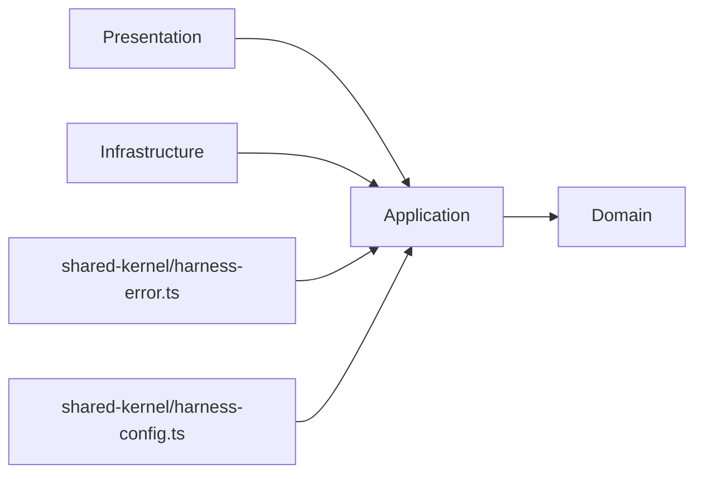
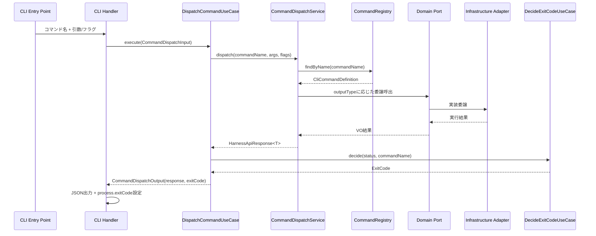
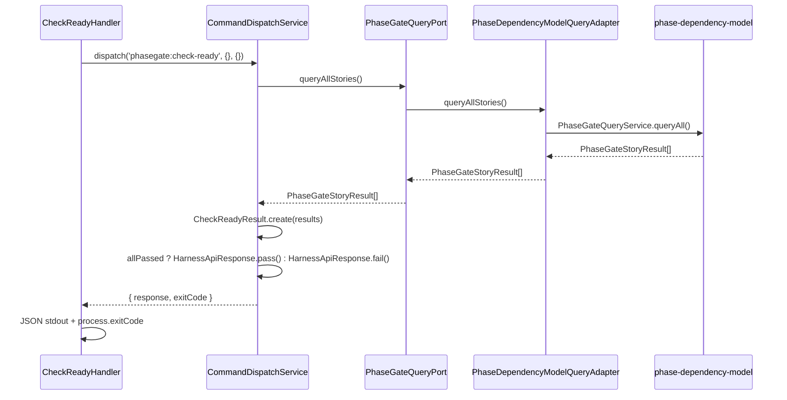
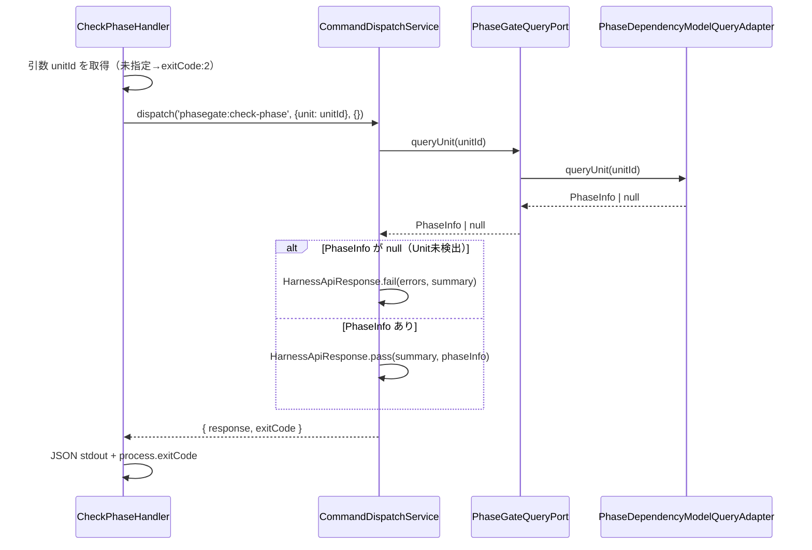
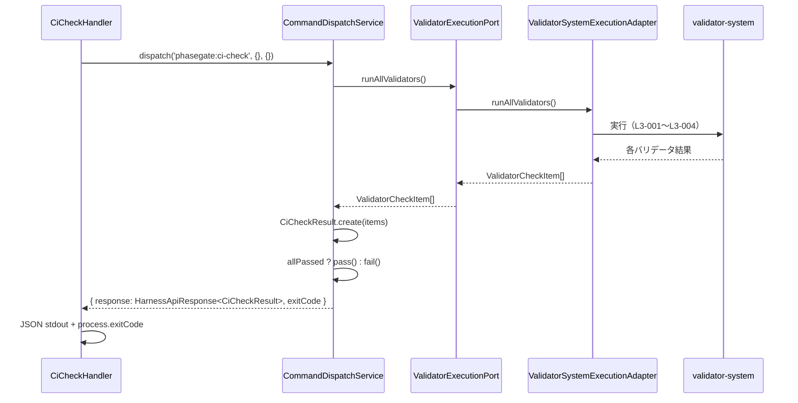
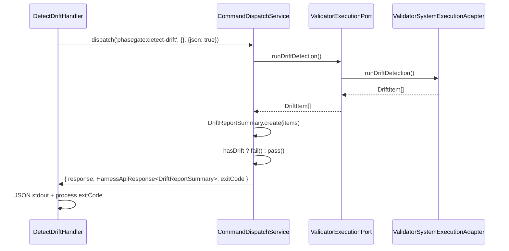
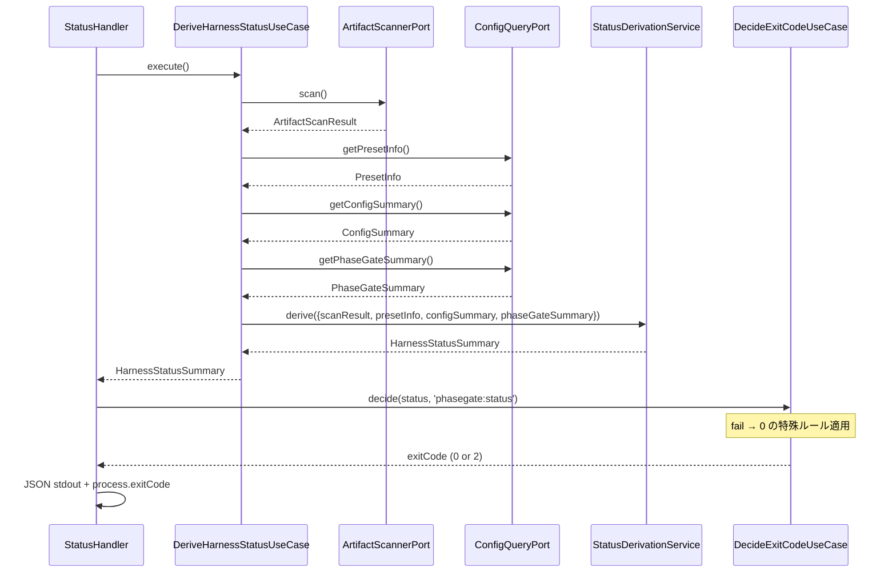
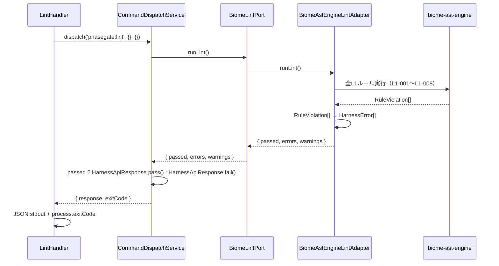
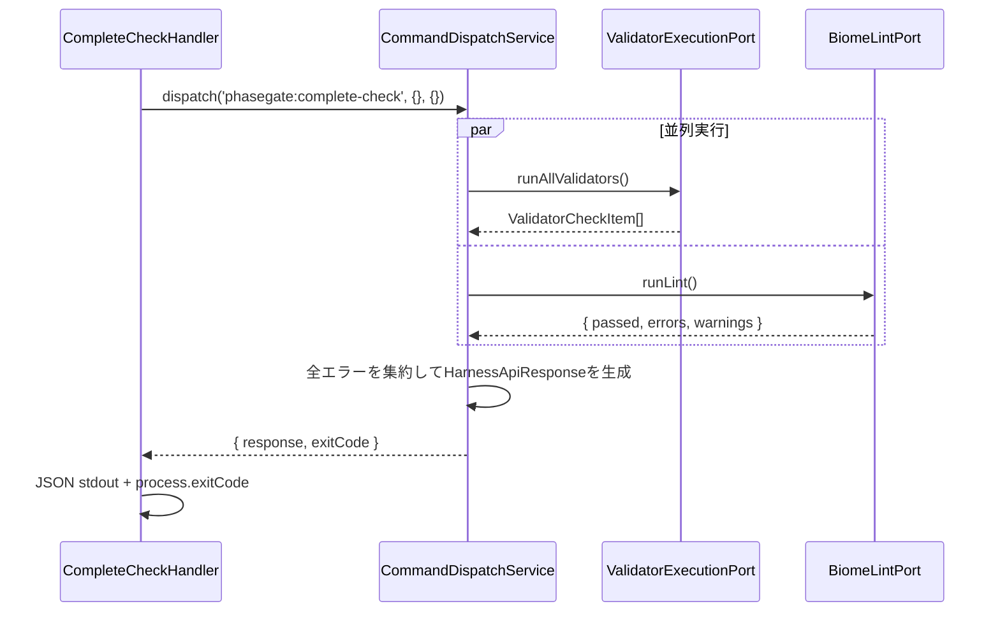
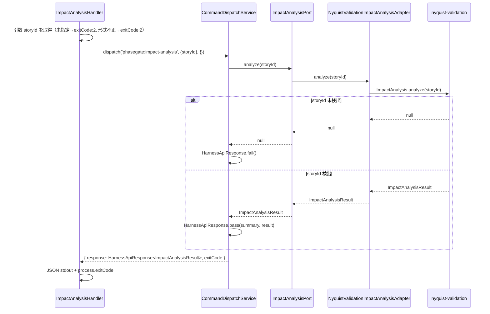

# 論理設計: harness-api

<!-- @work-item-id WI-090 -->
## WI-090 CLI Unknown Flag Contract

The harness-api command parser rejects unknown flags before dispatch and provides typo-oriented feedback for known alternatives. `phasegate init` therefore fails fast when a caller uses an unsupported option such as `--skill-set` instead of silently applying defaults.

<!-- @work-item-id WI-207 -->
## WI-207 Personal Install CLI Surface

The top-level `install` command accepts `--personal` as the local-only lifecycle intent. The CLI boundary validates the flag, forces Husky and CI target inclusion off for this mode, and delegates the personal target routing to the installation unit. The default `install` command remains the team/project install path.

<!-- @work-item-id WI-205 -->
## WI-205 Codex Hooks Feature Flag in CLI Output

The harness-api CLI boundary emits the non-deprecated Codex hooks feature flag name in every setup-guidance surface. `config:plan --intent codex-hooks` returns the user-level external action and command list using `codex features enable hooks`, and the `init --agent codex` next-steps output uses the same flag. The deprecated `codex_hooks` alias is never presented as the recommended command; project-local `.codex/hooks.json` remains the managed runtime artifact and is unchanged.

<!-- @work-item-id WI-091, WI-092 -->
## WI-091 / WI-092 Validator-System Dispatch Configuration

CLI dispatch resolves project config before creating validator-system modules, then threads effective layer enablement and path configuration into validation commands. Direct `phasegate:detect-drift` remains available while `validate --layer` honors user layer overrides.

<!-- @work-item-id WI-113 -->
## WI-113 Validate Format Parser Contract

The harness-api CLI boundary rejects unsupported `validate --format` values before dispatching to validator-system. The supported validate formats are `human`, `agent`, and `ci`; `json` is rejected until a schema is explicitly designed.

<!-- @work-item-id WI-149, WI-150 -->
## Public CLI Catalog Contract

The harness-api public surface distinguishes binary subcommands from package scripts. `phasegate:*` names are binary subcommands unless a project `package.json` defines the matching script. README documents common entry points; `docs/guide/cli-reference.md` is the exhaustive public catalog aligned with `phasegate --help`.

<!-- @work-item-id WI-184 -->
The `skills list` command renders the package skill catalog by scanning `skills/*/SKILL.md`, grouping entries across `core`, `aidlc`, `utility`, `guidance`, and `unknown`. The `skills info <name>` command resolves the same `SKILL.md` path helper, so list membership and info lookup share a catalog source.

@story-id H09-01
@story-id H09-02
@story-id H09-03
@story-id H09-04
@work-item-id WI-025
@work-item-id WI-112
@work-item-id WI-114
@work-item-id WI-126
`main.ts` は dedicated command `work-items:status` を公開し、dry-run/apply/fail-on-stale/json を traceability-model の command handler へ委譲する。`phasegate:status` とは別導線にし、既存 status API の JSON contract を壊さない。
@work-item-id WI-140
`work-items:status --apply` に `--allow-downgrade` と `--changed-only` を追加し、既定 apply policy を downgrade 拒否にする。`validate --layer L2` は validator-system の `L2-014` を通じて stale WI status を CI/pre-commit の fail signal として扱う。
@work-item-id WI-141
`commit-msg` は bypass trailer の構文・証跡を検証し、`bypass:audit --base <ref> [--head <ref>]` は push/CI の backstop として audited range の変更ファイルに pre-commit validation を再適用する。Git は `--no-verify` の痕跡を commit に保存しないため、PhaseGate は「gate failure を持つ差分が bypass trailer なしで到達した」状態を missing bypass evidence として扱う。
> **Unit ID**: harness-api

@work-item-id WI-148
`phasegate reconcile` / `phasegate update-skills` / `phasegate init` の command dispatch は `scripts/harness/main.ts` が所有する。WI-148 では `reconcile` を installation unit の handler へ委譲し、`update-skills` を互換 alias として同一 handler に接続し、`init` に deprecation warning を追加する。
> **作成日**: 2026-03-19
> **最終更新**: 2026-04-24（ISSUE-025 Codex/Claude 共有 skill 導線の setup 仕様を追記）
> **対応ストーリー**: H09-01, H09-02, H09-03, H09-04
> **モード**: Unit横断設計（Phase 2）
> **Wave**: 2（コア品質機構）
> **前提ドキュメント**:
> - `docs/product/construction/harness-api/domain_model.md`
> - `docs/product/units/integration_contract.md`
> - `docs/inception/_shared/cross_cutting_decisions.md`
> - `docs/principles/architecture-philosophy.md`

---

## 1. アーキテクチャ概要

### 1.1 層構成と責務

| 層 | 責務 | 主な構成要素 | 依存先 |
|----|------|-------------|--------|
| Domain | `CliCommandDefinition` の不変条件・名前一意性保証、`HarnessApiResponse<T>` のenvelopeルール（INV-3/INV-4）、ExitCode決定規則、`StatusDerivationService` による成果物健全性導出 | 値オブジェクト、ドメインサービス、ドメインポート | なし |
| Application | Domainモデルを使ったユースケース調停、コマンドレジストリ初期化、コマンドディスパッチ仲介、ExitCode決定の適用、HarnessStatusSummary導出の呼び出し | UseCase、DTO、Mapper | Domain |
| Infrastructure | Domainポート実装、6本のポートを各外部Unitへのアダプタとして実装、ファイルシステムスキャン、設定読取 | Adapter | Application, Domain |
| Presentation | 8コマンドのCLIハンドラー、引数パース、stdout JSON出力、process.exitCode設定。`harness-api` がトップレベルCLIコマンドの所有者 | CLI Handler、Output Formatter | Application, Domain |

### 1.2 依存方向

`cross_cutting_decisions.md §2` と `integration_contract.md §2.1` の正規語彙に合わせ、依存方向は以下に固定する。



```text
domain <- application <- infrastructure
domain <- application <- presentation
```

- Domain層は外部I/Oに依存しない
- Application層はDomainモデルの調停に徹し、I/O実装を持たない
- Infrastructure層は `domain/ports/` のみを実装し、CLIロジックを持たない
- Presentation層はApplication層経由でのみDomainを利用する
- Shared Kernelの公開入口は `scripts/harness/shared-kernel/harness-error.ts` および `scripts/harness/shared-kernel/harness-config.ts` のみとし、他Unitは内部ディレクトリを直接importしない

### 1.3 ディレクトリ構成（全ファイル一覧）

Wave 2 の harness-api 実装は `scripts/harness/harness-api/` 配下に4層で配置し、Cross-Unit Contract DTO のみ `scripts/harness/shared-kernel/harness-api.ts` へ再エクスポートする。

```text
scripts/harness/
├── shared-kernel/
│   └── harness-api.ts                          ← HarnessApiResponse<T> 公開入口
└── harness-api/
    ├── domain/
    │   ├── value-objects/
    │   │   ├── cli-command-definition.ts
    │   │   ├── harness-api-response.ts
    │   │   ├── check-ready-result.ts
    │   │   ├── phase-info.ts
    │   │   ├── ci-check-result.ts
    │   │   ├── drift-report-summary.ts
    │   │   ├── harness-status-summary.ts
    │   │   ├── artifact-scan-result.ts
    │   │   ├── layer-health.ts
    │   │   ├── command-input-spec.ts
    │   │   └── exit-code-spec.ts
    │   ├── services/
    │   │   ├── command-registry.ts
    │   │   ├── command-dispatch-service.ts
    │   │   └── status-derivation-service.ts
    │   └── ports/
    │       ├── validator-execution-port.ts
    │       ├── phase-gate-query-port.ts
    │       ├── biome-lint-port.ts
    │       ├── impact-analysis-port.ts
    │       ├── artifact-scanner-port.ts
    │       └── config-query-port.ts
    ├── application/
    │   ├── dto/
    │   │   ├── harness-api-response-contract.ts
    │   │   ├── command-dispatch-input.ts
    │   │   ├── command-dispatch-output.ts
    │   │   ├── initialize-registry-input.ts
    │   │   ├── registry-summary-output.ts
    │   │   ├── exit-code-decision-input.ts
    │   │   ├── exit-code-decision-output.ts
    │   │   └── status-derivation-input.ts
    │   ├── mappers/
    │   │   └── harness-api-response-mapper.ts
    │   └── usecases/
    │       ├── initialize-command-registry-usecase.ts
    │       ├── dispatch-command-usecase.ts
    │       ├── decide-exit-code-usecase.ts
    │       └── derive-harness-status-usecase.ts
    ├── infrastructure/
    │   └── adapters/
    │       ├── validator-system-execution-adapter.ts
    │       ├── phase-dependency-model-query-adapter.ts
    │       ├── biome-ast-engine-lint-adapter.ts
    │       ├── nyquist-validation-impact-analysis-adapter.ts
    │       ├── file-system-artifact-scanner-adapter.ts
    │       └── harness-config-query-adapter.ts
    └── presentation/
        ├── dto/
        │   └── cli-output-options.ts
        ├── formatters/
        │   └── harness-api-json-formatter.ts
        └── handlers/
            ├── check-ready-handler.ts
            ├── check-phase-handler.ts
            ├── ci-check-handler.ts
            ├── detect-drift-handler.ts
            ├── status-handler.ts
            ├── lint-handler.ts
            ├── complete-check-handler.ts
            └── impact-analysis-handler.ts
├── setup/
│   └── skill-deployer.ts                    ← init/update-skills 用のFS orchestration
```

テスト配置:

```text
scripts/harness/__tests__/
├── unit/
│   └── harness-api/
│       ├── domain/
│       │   ├── value-objects/
│       │   │   ├── cli-command-definition.test.ts
│       │   │   ├── harness-api-response.test.ts
│       │   │   ├── check-ready-result.test.ts
│       │   │   ├── phase-info.test.ts
│       │   │   ├── ci-check-result.test.ts
│       │   │   ├── drift-report-summary.test.ts
│       │   │   ├── harness-status-summary.test.ts
│       │   │   ├── artifact-scan-result.test.ts
│       │   │   └── layer-health.test.ts
│       │   └── services/
│       │       ├── command-registry.test.ts
│       │       ├── command-dispatch-service.test.ts
│       │       └── status-derivation-service.test.ts
│       ├── application/
│       │   └── usecases/
│       │       ├── initialize-command-registry-usecase.test.ts
│       │       ├── dispatch-command-usecase.test.ts
│       │       ├── decide-exit-code-usecase.test.ts
│       │       └── derive-harness-status-usecase.test.ts
│       └── presentation/
│           └── handlers/
│               ├── check-ready-handler.test.ts
│               ├── check-phase-handler.test.ts
│               ├── ci-check-handler.test.ts
│               ├── detect-drift-handler.test.ts
│               ├── status-handler.test.ts
│               ├── lint-handler.test.ts
│               ├── complete-check-handler.test.ts
│               └── impact-analysis-handler.test.ts
└── integration/
    └── harness-api/
        ├── command-dispatch-integration.test.ts
        ├── status-derivation-integration.test.ts
        └── shared-kernel-contract.test.ts
```

### 1.4 既存実装との接続方針

- 既存 `scripts/harness/cli/ci-check.ts` は Presentation 層の `CiCheckHandler` で段階的に置き換える。移行期は adapter 経由で既存実装を呼び出す
- 既存 `scripts/harness/cli/` 配下の個別スクリプトは Wave 2 Phase 2 完了後に削除対象とする
- Infrastructure 層の各 adapter は、対応 Unit の正式インターフェースが未確定の場合はスタブ実装を持ち、Unit完了後に差し替える

---

## 2. Domain層設計

### 1.5 Setup orchestration（ISSUE-025）

`phasegate init` / `update-skills` は CLI の setup オーケストレーションとして harness-api の責務に含める。ここでいう setup はドメイン概念ではなく、project filesystem への初期配置規則である。

`phasegate delegate-sonnet` は `phasegate.config.json` の `modelRouting.delegation` を尊重する。`none` の場合、`--help` と `--dry-run` は後方互換として許可し、通常実行は structured error `MODEL_DELEGATION_DISABLED` で拒否する。@work-item-id WI-219

#### 1.5.1 skill 配置の正

skill の実体は project root の `skills/` に配置し、agent ごとの公開面は symlink で表現する。

```text
skills/                  # 実体
.claude/skills -> ../skills   # Claude 有効時
.codex/skills  -> ../skills   # Codex 有効時
```

#### 1.5.2 `init --agent` ごとの成果物

| agent | skill 実体 | Claude 導線 | Codex 導線 | その他 |
|---|---|---|---|---|
| `claude` | `skills/` | `.claude/skills` | なし | `.claude/settings.json`, `.claude/scripts/*` |
| `codex` | `skills/` | なし | `.codex/skills` | `.codex/hooks.json` |
| `both` | `skills/` | `.claude/skills` | `.codex/skills` | 両方 |

#### 1.5.3 update-skills の再検証ルール

- `skills/` の実体は常に再配置する
- `.claude/settings.json` または `.claude/skills` が存在する場合のみ `.claude/skills` を再検証する
- `.codex/hooks.json` または `.codex/skills` が存在する場合のみ `.codex/skills` を再検証する

既存の通常ディレクトリや通常ファイルは破壊せず、正しい symlink が既にある場合は skip とする。

### 2.1 中心設計方針

`domain_model.md §2` の結論どおり、harness-api は集約を持たない。`CliCommandDefinition` はライフサイクルを持たない不変仕様定義であり、`cross_cutting_decisions.md §6` 集約降格方針に従って値オブジェクトパターンを採用する。ドメインの整合性（コマンド名の一意性）は `CommandRegistry` ドメインサービスが担う。

### 2.2 値オブジェクト群

#### 2.2.1 CliCommandDefinition

**責務**: CLIコマンドの不変仕様を表現する。登録時のみ生成され、実行時に状態を変えない。

| 属性 | 型 | 説明 | 必須 |
|------|----|------|------|
| commandName | `CommandName` | `harness:` プレフィックスを持つ一意のコマンド名 | Yes |
| description | `string` | コマンドの人間可読な説明文 | Yes |
| inputSpec | `CommandInputSpec` | 引数・フラグ定義 | Yes |
| outputType | `CommandOutputType` | コマンド出力型識別子 | Yes |
| exitCodes | `ExitCodeSpec` | 終了コード定義（pass/fail/error） | Yes |

**メソッド一覧**

##### `equals(other: CliCommandDefinition): boolean`

- 入力: `other: CliCommandDefinition`
- 出力: `boolean`
- 処理フロー:
  1. `commandName` の値比較を行う
  2. `outputType` の値比較を行う
  3. 全属性一致時のみ `true` を返す
- 例外: なし
- 不変条件: 生成後の値は変更されない

##### `requiresArg(argName: string): boolean`

- 入力: `argName: string`
- 出力: `boolean`
- 処理フロー: `inputSpec.args` から `required: true` の引数名を検索する
- 例外: なし

##### `hasFlag(flagName: string): boolean`

- 入力: `flagName: string`
- 出力: `boolean`
- 処理フロー: `inputSpec.flags` を検索する
- 例外: なし

**バリデーションルール**

- `commandName` は `^harness:[a-z][a-z0-9-]*$` 正規表現に一致すること
- `description` は空文字不可
- `outputType` は `CommandOutputType` の列挙値であること

#### 2.2.2 HarnessApiResponse\<T\>

**責務**: 全コマンドの出力に共通するenvelopeを表現する。`integration_contract.md §2.2` に定義されるCross-Unit Contract DTOの内部ドメイン表現。

| 属性 | 型 | 説明 | 必須 |
|------|----|------|------|
| status | `ResponseStatus` | `'pass' \| 'fail' \| 'error'` | Yes |
| errors | `readonly HarnessError[]` | エラー一覧（Shared Kernel型） | Yes |
| summary | `ResponseSummary` | `{ totalChecks, passed, failed, warnings }` | Yes |
| data | `T \| undefined` | コマンド固有のpayload | No |

**不変条件**

- `status === 'pass'` のとき、`errors` は空配列（INV-3）
- `status === 'fail' || status === 'error'` のとき、`errors.length >= 1`（INV-4）
- `summary.passed + summary.failed === summary.totalChecks`

**メソッド一覧**

##### `static pass<T>(summary: ResponseSummary, data?: T): HarnessApiResponse<T>`

- 入力: `summary`, optional `data`
- 出力: `HarnessApiResponse<T>`
- 処理フロー:
  1. `errors: []` を設定する
  2. `status: 'pass'` を設定する
  3. INV-3の充足を確認する
  4. `Object.freeze()` で凍結する
- 例外: なし

##### `static fail<T>(errors: readonly HarnessError[], summary: ResponseSummary, data?: T): HarnessApiResponse<T>`

- 入力: `errors`, `summary`, optional `data`
- 出力: `HarnessApiResponse<T>`
- 処理フロー:
  1. `errors.length >= 1` を確認する（違反時は `HarnessApiDomainError`）
  2. `status: 'fail'` を設定する
  3. `Object.freeze()` で凍結する
- 例外: `HarnessApiDomainError`（errors が空配列の場合）

##### `static error<T>(errors: readonly HarnessError[], summary: ResponseSummary): HarnessApiResponse<T>`

- 入力: `errors`, `summary`
- 出力: `HarnessApiResponse<T>`
- 処理フロー:
  1. `errors.length >= 1` を確認する
  2. `status: 'error'` を設定する
  3. `Object.freeze()` で凍結する
- 例外: `HarnessApiDomainError`

##### `toExitCode(): ExitCode`

- 入力: なし
- 出力: `0 | 1 | 2`
- 処理フロー:
  1. `status === 'pass'` → `0`
  2. `status === 'fail'` → `1`
  3. `status === 'error'` → `2`
- 例外: なし
- 不変条件: ExitCode決定ルール（INV-5）に従う

#### 2.2.3 CheckReadyResult

| 属性 | 型 | 説明 |
|------|----|------|
| stories | `readonly PhaseGateStoryResult[]` | ストーリー別Phase Gate通過状態 |
| allPassed | `boolean` | 全ストーリー通過の集計値 |

**不変条件**: `allPassed === stories.every(s => s.passed)`

**メソッド一覧**

##### `static create(stories: readonly PhaseGateStoryResult[]): CheckReadyResult`

- 処理フロー:
  1. `stories` を受け取る
  2. `allPassed` を `stories.every(s => s.passed)` で計算する
  3. `Object.freeze()` で凍結する

##### `getFailedStories(): readonly PhaseGateStoryResult[]`

- 出力: `passed === false` の要素一覧

#### 2.2.4 PhaseInfo

| 属性 | 型 | 説明 |
|------|----|------|
| unitId | `string` | Unit識別子 |
| currentLevel | `1 \| 2 \| 3` | Phase Dependency 現在Level |
| currentPhase | `string` | 現在フェーズ名（例: "domain-design"） |
| completedGates | `readonly string[]` | 通過済みゲート名一覧 |

**メソッド一覧**

##### `hasCompletedGate(gateName: string): boolean`

- 処理フロー: `completedGates.includes(gateName)` を返す

#### 2.2.5 CiCheckResult

| 属性 | 型 | 説明 |
|------|----|------|
| validatorResults | `readonly ValidatorCheckItem[]` | バリデータ別実行結果 |
| allPassed | `boolean` | 全バリデータ通過の集計値 |

**不変条件**

- `validatorResults.length >= 1`（INV-5）
- `allPassed === validatorResults.every(r => r.passed)`（INV-6）

**メソッド一覧**

##### `static create(validatorResults: readonly ValidatorCheckItem[]): CiCheckResult`

- 処理フロー:
  1. `validatorResults.length >= 1` を確認する（違反時は `HarnessApiDomainError`）
  2. `allPassed` を計算する
  3. `Object.freeze()` で凍結する
- 例外: `HarnessApiDomainError`

##### `getFailedValidators(): readonly ValidatorCheckItem[]`

- 出力: `passed === false` の要素一覧

##### `collectAllErrors(): readonly HarnessError[]`

- 出力: 全 `ValidatorCheckItem.errors` を平坦化した一覧

#### 2.2.6 DriftReportSummary

| 属性 | 型 | 説明 |
|------|----|------|
| drifts | `readonly ActionableDriftItem[]` | sampleLimit 件までの乖離サンプル。各項目に category / severity / nextAction を付与する |
| totalCount | `number` | 元の乖離件数 |
| rawDriftCount | `number` | `totalCount` と同じ元件数。出力圧縮時も保持する |
| sampleLimit | `number` | drifts[] に含める最大サンプル件数 |
| truncated | `boolean` | 元件数が sampleLimit を超えたか |
| categorySummaries | `readonly DriftCategorySummary[]` | category 別の件数・severity・推奨次アクション |
| actionPlan | `readonly DriftCategorySummary[]` | 件数順の上位 category summary |

**不変条件**: `create()` は `totalCount === drifts.length`（INV-7）を維持する。repository scale 出力用の `fromDrifts()` は `drifts[]` を sampleLimit 件へ圧縮し、`totalCount/rawDriftCount` に元件数を保持する。@work-item-id WI-114

**メソッド一覧**

##### `static create(props: DriftReportSummaryProps): DriftReportSummary`

- 処理フロー: `totalCount = drifts.length` で不変条件を充足させる

##### `static fromDrifts(drifts: readonly DriftItem[], sampleLimit = 20): DriftReportSummary`

- 処理フロー: raw drifts 全件から category summary / actionPlan を作り、`drifts[]` は sampleLimit 件に圧縮する
- L4 は WI-107 の advisory policy に従うため、drift 有無は gate failure ではなく warning count と action plan として返す

##### `hasDrift(): boolean`

- 処理フロー: `totalCount > 0` を返す

##### `filterByUnit(unitId: string): readonly DriftItem[]`

- 処理フロー: `drifts.filter(d => d.unit === unitId)` を返す

#### 2.2.7 HarnessStatusSummary

| 属性 | 型 | 説明 |
|------|----|------|
| layers | `readonly LayerHealth[]` | L1-L4各レイヤーの健全性 |
| phaseGateSummary | `PhaseGateSummary` | Phase Gate全体サマリー |
| presetInfo | `PresetInfo` | 有効プリセット情報 |
| configSummary | `ConfigSummary` | 設定サマリー |

**補助型**

| 型名 | 構造 | 説明 |
|------|------|------|
| `PhaseGateSummary` | `{ totalStories: number; passedStories: number; pendingStories: number }` | Phase Gate全体集計 |
| `PresetInfo` | `{ name: 'minimal' \| 'standard' \| 'strict'; enabledLayers: LayerId[] }` | プリセット詳細。`enabledLayers` は WI-096 以降、preset default と `layers.L?.enabled` override を合成した effective enabled layers |
| `ConfigSummary` | `{ configPath: string; lastModified: string; version: string }` | 設定ファイル情報 |

**メソッド一覧**

##### `getLayerHealth(layerId: LayerId): LayerHealth | undefined`

- 処理フロー: `layers.find(l => l.layerId === layerId)` を返す

##### `isAllLayersHealthy(): boolean`

- 処理フロー: `layers.every(l => !l.enabled || l.lastResult === 'pass')` を返す

#### 2.2.8 ArtifactScanResult

**責務**: `ArtifactScannerPort` が返すファイルシステムスキャンの中間結果。`StatusDerivationService` への入力型。

| 属性 | 型 | 説明 |
|------|----|------|
| scannedPaths | `readonly string[]` | スキャン対象パス一覧 |
| foundArtifacts | `readonly ArtifactPresence[]` | 成果物存在確認結果 |
| derivedLayerHealth | `readonly LayerHealth[]` | スキャン結果から導出された健全性（暫定） |

**補助型**

```
ArtifactPresence: {
  artifactType: string;      // 'design-doc' | 'test-file' | 'metadata' 等
  layerId: LayerId;          // 対応するレイヤーID
  present: boolean;
  lastModified?: string;     // ISO 8601
}
```

#### 2.2.9 LayerHealth

| 属性 | 型 | 説明 |
|------|----|------|
| layerId | `LayerId` | `'L1' \| 'L2' \| 'L3' \| 'L4'` |
| enabled | `boolean` | HarnessConfigV2 での有効/無効 |
| lastResult | `'pass' \| 'fail' \| 'unknown' \| undefined` | 直近実行結果 |

**メソッド一覧**

##### `isActionable(): boolean`

- 処理フロー: `enabled === true && lastResult !== 'unknown'` を返す

#### 2.2.10 CommandInputSpec

| 属性 | 型 | 説明 |
|------|----|------|
| args | `readonly ArgDef[]` | 位置引数定義 |
| flags | `readonly FlagDef[]` | フラグ定義 |

**補助型**

```
ArgDef: { name: string; type: 'string' | 'number'; required: boolean; description: string }
FlagDef: { name: string; shortName?: string; type: 'boolean' | 'string'; description: string }
```

#### 2.2.11 ExitCodeSpec

| 属性 | 型 | 説明 |
|------|----|------|
| pass | `0` | Pass時の終了コード（固定値） |
| fail | `1` | Fail時の終了コード（固定値） |
| error | `2` | Error時の終了コード（固定値） |

**バリデーションルール**: `phasegate:status` コマンドのみ `fail` が使われない（`domain_model.md §9 D5` 参照）。これはコマンド定義上の注記であり、型レベルでは全コマンド共通の `ExitCodeSpec` を使用する。

### 2.3 ドメインサービス

#### 2.3.1 CommandRegistry

**責務**: `CliCommandDefinition[]` の登録・管理・名前一意性保証（INV-1）。

**コンストラクタ依存**

- なし（空の内部Mapで初期化）

##### `registerCommand(definition: CliCommandDefinition): void`

- 入力: `definition: CliCommandDefinition`
- 出力: なし
- 処理フロー:
  1. `definition.commandName` の `harness:` プレフィックスを確認する
  2. 内部 `Map<string, CliCommandDefinition>` を検索し重複を確認する
  3. 重複がある場合は `DuplicateCommandNameError` を投げる
  4. Mapに登録する
- 例外: `DuplicateCommandNameError`
- 不変条件: 同一 `commandName` の登録は1つのみ（INV-1）

##### `findByName(commandName: CommandName): CliCommandDefinition`

- 入力: `commandName: CommandName`
- 出力: `CliCommandDefinition`
- 処理フロー:
  1. 内部Mapを検索する
  2. 存在しない場合は `CommandNotFoundError` を投げる
- 例外: `CommandNotFoundError`

##### `listAll(): readonly CliCommandDefinition[]`

- 入力: なし
- 出力: 登録済みコマンド定義一覧（commandName昇順）
- 処理フロー: 内部Map値を commandName 昇順でソートして返す
- 例外: なし
- 不変条件: 呼び出し側から変更できない readonly 配列を返す

##### `hasCommand(commandName: CommandName): boolean`

- 入力: `commandName`
- 出力: `boolean`
- 処理フロー: `Map.has(commandName)` を返す

##### `getCount(): number`

- 入力: なし
- 出力: 登録コマンド数
- 処理フロー: `Map.size` を返す

#### 2.3.2 CommandDispatchService

**責務**: CLI入力（コマンド名 + 引数/フラグ）を受け取り、対応するドメインポートに委譲し、`HarnessApiResponse<T>` を生成する。ExitCodeの決定も担う。

**コンストラクタ依存**

- `commandRegistry: CommandRegistry`
- `validatorExecutionPort: ValidatorExecutionPort`
- `phaseGateQueryPort: PhaseGateQueryPort`
- `biomeLintPort: BiomeLintPort`
- `impactAnalysisPort: ImpactAnalysisPort`
- `artifactScannerPort: ArtifactScannerPort`
- `configQueryPort: ConfigQueryPort`
- `statusDerivationService: StatusDerivationService`

##### `dispatch<T>(input: { commandName: CommandName; args: Record<string, string>; flags: Record<string, boolean | string> }): Promise<{ response: HarnessApiResponse<T>; exitCode: ExitCode }>`

- 入力: コマンド名・引数・フラグ
- 出力: `Promise<{ response: HarnessApiResponse<T>; exitCode: ExitCode }>`
- 処理フロー:
  1. `commandRegistry.findByName(commandName)` でコマンド定義を取得する
  2. `CommandNotFoundError` の場合は `HarnessApiResponse.error()` を生成して `exitCode: 2` で返す
  3. `definition.outputType` に応じてポートへ委譲する（§6参照）
  4. 委譲結果から `HarnessApiResponse<T>` を生成する
  5. `response.toExitCode()` でExitCodeを決定する
  6. `{ response, exitCode }` を返す
- 例外:
  - ポート呼び出し失敗時は `HarnessApiResponse.error()` でラップして返す（再スローしない）
  - `CommandNotFoundError` は内部で捕捉し error response に変換する
- 不変条件: 例外は必ず `HarnessApiResponse.error()` にラップされる。生の例外がPresentationに到達しない

**内部委譲ロジック（outputTypeごと）**

| outputType | 委譲先ポート | 主処理 |
|------------|-------------|--------|
| `'check-ready'` | `phaseGateQueryPort.queryAllStories()` | → `CheckReadyResult` → Pass/Fail判定 |
| `'check-phase'` | `phaseGateQueryPort.queryUnit(args.unit)` | → `PhaseInfo` → 単位未検出ならFail |
| `'ci-check'` | `validatorExecutionPort.runAllValidators()` | → `CiCheckResult` → Pass/Fail判定 |
| `'detect-drift'` | `validatorExecutionPort.runDriftDetection()` | → `DriftReportSummary` → advisory pass + warnings |
| `'status'` | `artifactScannerPort + configQueryPort + biomeLintPort + validatorExecutionPort` | → `StatusDerivationService.derive()` → Pass/Error のみ |
| `'lint'` | `biomeLintPort.runLint()` | → errors有無 → Pass/Fail判定 |
| `'complete-check'` | `validatorExecutionPort.runAllValidators() + biomeLintPort.runLint()` | → 全エラー集約 |
| `'impact-analysis'` | `impactAnalysisPort.analyze(args.storyId)` | → ストーリー未検出ならFail |

#### 2.3.3 StatusDerivationService

**責務**: `ArtifactScanResult` と設定情報を受け取り、レイヤー健全性を導出して `HarnessStatusSummary` を生成する純粋な計算処理。ポートに依存しない。

**コンストラクタ依存**

- なし（純粋な計算関数として設計）

##### `derive(input: { scanResult: ArtifactScanResult; presetInfo: PresetInfo; configSummary: ConfigSummary; phaseGateSummary: PhaseGateSummary; liveValidationByLayer?: Record<LayerId, LiveValidationState> }): HarnessStatusSummary`

- 入力: スキャン結果 + 設定情報
- 出力: `HarnessStatusSummary`
- 処理フロー:
  1. `scanResult.derivedLayerHealth` を受け取る
  2. `presetInfo.enabledLayers` と `derivedLayerHealth` を突合する
  3. `configurationState`（enabled/disabled）と `cachedArtifactState`（present/missing/unknown）を分離する
  4. `liveValidationByLayer` があれば `liveValidationState` として保持し、pass/fail は `lastResult` に優先反映する
  5. 無効なレイヤーは `enabled: false` とし、L4 skipped などの live state は別フィールドで保持する
  6. `HarnessStatusSummary` を構築して返す
- 例外: なし（純粋関数。I/O失敗は呼び出し元の `CommandDispatchService` が担う）
- 不変条件:
  - `LayerHealth.configurationState` は `presetInfo.enabledLayers` に基づく
  - `LayerHealth.cachedArtifactState` は artifact scan に基づく
  - `LayerHealth.liveValidationState` は lint / validator execution に基づく。@work-item-id WI-112
  - `lastResult` は後方互換の要約であり、live pass/fail を cached artifact より優先する

### 2.4 ドメインエラー

harness-api 固有のドメインエラーは以下を定義する。

| エラー名 | 投げるケース |
|---------|-------------|
| `HarnessApiDomainError` | Domain層基底エラー |
| `DuplicateCommandNameError` | 同一コマンド名の二重登録（INV-1違反） |
| `CommandNotFoundError` | 未登録コマンド名でのディスパッチ試行 |
| `InvalidCommandNameError` | `harness:` プレフィックス不正（INV-2違反） |
| `EmptyValidatorResultsError` | `CiCheckResult` 生成時に validatorResults が空（INV-5違反） |
| `InvalidResponseStatusError` | `HarnessApiResponse` 生成時のINV-3/INV-4違反 |

---

## 3. Domain層ポート設計

ポートは全て `scripts/harness/harness-api/domain/ports/` に定義し、Infrastructure層が実装する。

### 3.1 ValidatorExecutionPort

```typescript
export interface ValidatorExecutionPort {
  runL3Validators(): Promise<ValidatorCheckItem[]>;
  runDriftDetection(): Promise<DriftItem[]>;
  runAllValidators(): Promise<ValidatorCheckItem[]>;
}
```

| メソッド | 入力 | 出力 | 説明 |
|---------|------|------|------|
| `runL3Validators` | なし | `Promise<ValidatorCheckItem[]>` | L3バリデータ（security/performance/coverage/nyquist）を全件実行する |
| `runDriftDetection` | なし | `Promise<DriftItem[]>` | L4 drift-detect バリデータを実行し乖離リストを返す |
| `runAllValidators` | なし | `Promise<ValidatorCheckItem[]>` | L1-L4 全バリデータを実行する（complete-check用） |

### 3.2 PhaseGateQueryPort

```typescript
export interface PhaseGateQueryPort {
  queryAllStories(): Promise<PhaseGateStoryResult[]>;
  queryUnit(unitId: string): Promise<PhaseInfo | null>;
}
```

| メソッド | 入力 | 出力 | 説明 |
|---------|------|------|------|
| `queryAllStories` | なし | `Promise<PhaseGateStoryResult[]>` | 全ストーリーのPhase Gate通過状態を返す |
| `queryUnit` | `unitId: string` | `Promise<PhaseInfo \| null>` | 指定Unitのフェーズ情報を返す。未検出時は `null` |

### 3.3 BiomeLintPort

```typescript
export interface BiomeLintPort {
  runLint(): Promise<{
    passed: boolean;
    errors: HarnessError[];
    warnings: HarnessError[];
  }>;
}
```

| メソッド | 入力 | 出力 | 説明 |
|---------|------|------|------|
| `runLint` | なし | `Promise<{ passed, errors, warnings }>` | L1 Biome ASTバリデータ全ルールを実行し結果を返す |

### 3.4 ImpactAnalysisPort

```typescript
export interface ImpactAnalysisPort {
  analyze(storyId: string): Promise<ImpactAnalysisResult | null>;
}
```

| メソッド | 入力 | 出力 | 説明 |
|---------|------|------|------|
| `analyze` | `storyId: string` | `Promise<ImpactAnalysisResult \| null>` | storyId に紐づく影響テストケースを返す。ストーリー未検出時は `null` |

**補助型**: `ImpactAnalysisResult` は nyquist-validation が所有する型。harness-api はポートを通じて読取専用で参照する。

### 3.5 ArtifactScannerPort

```typescript
export interface ArtifactScannerPort {
  scan(): Promise<ArtifactScanResult>;
}
```

| メソッド | 入力 | 出力 | 説明 |
|---------|------|------|------|
| `scan` | なし | `Promise<ArtifactScanResult>` | `docs/` および `scripts/harness/` 配下を走査し成果物の存在状態を返す |

### 3.6 ConfigQueryPort

```typescript
export interface ConfigQueryPort {
  getPresetInfo(): Promise<PresetInfo>;
  getConfigSummary(): Promise<ConfigSummary>;
  getPhaseGateSummary(): Promise<PhaseGateSummary>;
}
```

| メソッド | 入力 | 出力 | 説明 |
|---------|------|------|------|
| `getPresetInfo` | なし | `Promise<PresetInfo>` | `HarnessConfigV2.project.preset` および有効レイヤー情報を返す |
| `getConfigSummary` | なし | `Promise<ConfigSummary>` | 設定ファイルパス・最終更新日・バージョン情報を返す |
| `getPhaseGateSummary` | なし | `Promise<PhaseGateSummary>` | Phase Gate全体集計を返す（phasegate:status 表示用） |

### 3.7 ポート設計上のルール

- ポートの戻り値はDomainが理解できる値オブジェクトかプリミティブに限定する
- ポートは実行エンジンの内部詳細（Biome CLI形式、validator実行コンテキスト等）を露出しない
- ポート呼び出しの成功・失敗は `CommandDispatchService` が制御し、Application層は再スローを行わない
- `null` 返却は「対象未検出（Fail）」を意味し、例外とは区別する

---

## 4. Application層設計

### 4.1 DTO / Mapper方針

| 要素 | 役割 |
|------|------|
| `HarnessApiResponseContract` | Cross-Unit Contract用 readonly DTO（agent-integration / ci-governance 消費） |
| `CommandDispatchInput` | Presentation層からUseCaseへの入力型 |
| `CommandDispatchOutput` | UseCaseからPresentationへの出力型（response + exitCode） |
| `InitializeRegistryInput` | コマンドレジストリ初期化用入力型 |
| `RegistrySummaryOutput` | 初期化完了後のサマリー出力型 |
| `ExitCodeDecisionInput` | ExitCode決定UseCase入力型 |
| `ExitCodeDecisionOutput` | ExitCode決定UseCase出力型 |
| `StatusDerivationInput` | ハーネス状態導出UseCase入力型 |
| `HarnessApiResponseMapper` | `HarnessApiResponse<T>` を Cross-Unit Contract DTO に変換 |

Cross-Unit Contract DTO（`HarnessApiResponseContract`）は Application層でのみ生成する。Domain層は内部VOを維持し、他Unitへ直接露出しない。

### 4.2 InitializeCommandRegistryUseCase（H09-01）

**責務**: 8コマンドの `CliCommandDefinition` を `CommandRegistry` に登録する。アプリケーション起動時に1回実行される。

**対応ストーリー**: H09-01「CLI Command Registryの構築・管理」

**コンストラクタ依存**

- `commandRegistry: CommandRegistry`

**入力**

`InitializeRegistryInput`

| 項目 | 型 | 必須 |
|------|----|------|
| commands | `readonly CliCommandDefinitionInput[]` | Yes |

`CliCommandDefinitionInput` は `CliCommandDefinition` 生成に必要な原始データ。

**出力**: `RegistrySummaryOutput`

| 項目 | 型 | 説明 |
|------|----|------|
| registeredCount | `number` | 登録成功コマンド数 |
| commandNames | `readonly CommandName[]` | 登録済みコマンド名一覧 |
| failedRegistrations | `readonly { commandName: string; reason: string }[]` | 登録失敗一覧（通常は空） |

**処理フロー**

1. `input.commands` を受け取る
2. 各コマンドに対して `CliCommandDefinition` を生成する
3. `commandRegistry.registerCommand()` を呼び出す
4. `DuplicateCommandNameError` が発生した場合は `failedRegistrations` に積み上げ処理を続ける
5. 登録完了後に `RegistrySummaryOutput` を返す

**例外**

- `InvalidCommandNameError`（コマンド名形式不正）
- `CliCommandDefinition` 生成失敗時の `HarnessApiDomainError`

**設計上の注意**

- このUseCaseは Composition Root から呼ばれる。アプリケーション起動時の1回限りの実行
- 重複登録は失敗ではなくサマリーに記録することで、起動失敗を防ぐ。ただし failedRegistrations が 1件以上の場合は呼び出し元がログ出力する

### 4.3 DispatchCommandUseCase（H09-02）

**責務**: CLI入力を受け取り、`CommandDispatchService` へ委譲してコマンドを実行する。結果をCross-Unit Contract DTOに変換する。

**対応ストーリー**: H09-02「コマンドディスパッチ」

**コンストラクタ依存**

- `commandDispatchService: CommandDispatchService`
- `responseMapper: HarnessApiResponseMapper`

**入力**

`CommandDispatchInput`

| 項目 | 型 | 必須 |
|------|----|------|
| commandName | `string` | Yes |
| args | `Record<string, string>` | No（既定は空オブジェクト） |
| flags | `Record<string, boolean \| string>` | No（既定は空オブジェクト） |

**出力**: `CommandDispatchOutput`

| 項目 | 型 | 説明 |
|------|----|------|
| response | `Readonly<HarnessApiResponseContract>` | Cross-Unit Contract DTO |
| exitCode | `ExitCode` | 決定済みExitCode |

**処理フロー**

1. `commandName` を `CommandName` として解釈する
2. `commandDispatchService.dispatch(input)` を呼ぶ
3. `responseMapper.toContract(response)` で Cross-Unit Contract DTO に変換する
4. `{ response: contract, exitCode }` を返す

**例外**

- `commandDispatchService` が error response を返す場合でも UseCase は例外を投げない
- UseCase はエラーを response として正常返却する（ExitCode 2 の場合も含む）

### 4.4 DecideExitCodeUseCase（H09-03）

**責務**: `HarnessApiResponse.status` と `phasegate:status` コマンドの特殊ルールを考慮してExitCodeを決定する。

**対応ストーリー**: H09-03「終了コード決定」

**コンストラクタ依存**

- なし（ルール適用のみの純粋なUseCase）

**入力**

`ExitCodeDecisionInput`

| 項目 | 型 | 必須 |
|------|----|------|
| status | `ResponseStatus` | Yes |
| commandName | `CommandName` | Yes |

**出力**: `ExitCodeDecisionOutput`

| 項目 | 型 | 説明 |
|------|----|------|
| exitCode | `ExitCode` | 決定されたExitCode |
| reason | `string` | 決定理由（デバッグ用） |

**処理フロー**

1. `commandName === 'phasegate:status'` かつ `status === 'fail'` の場合は `exitCode: 0` を返す（D5ルール）
2. それ以外は標準ExitCode決定ルールに従う：
   - `'pass'` → `0`
   - `'fail'` → `1`
   - `'error'` → `2`
3. `reason` に決定根拠を記述して返す

**例外**

- なし

**設計上の注意**

- `phasegate:status` の `fail` → `0` 変換は Domain層の `toExitCode()` ではなくこのUseCaseで行う。これにより `HarnessApiResponse.toExitCode()` の純粋性を維持する

### 4.5 DeriveHarnessStatusUseCase（H09-04）

**責務**: `ArtifactScannerPort` と `ConfigQueryPort` を呼び出し、`StatusDerivationService` を使って `HarnessStatusSummary` を生成する。

**対応ストーリー**: H09-04「成果物駆動の状態導出」

**コンストラクタ依存**

- `artifactScannerPort: ArtifactScannerPort`
- `configQueryPort: ConfigQueryPort`
- `statusDerivationService: StatusDerivationService`

**入力**

`StatusDerivationInput`（現時点ではパラメータなし。フィルタ条件が必要になった場合に拡張）

**出力**: `HarnessStatusSummary`

**処理フロー**

1. `artifactScannerPort.scan()` でファイルシステムをスキャンする
2. `configQueryPort.getPresetInfo()` でプリセット情報を取得する
3. `configQueryPort.getConfigSummary()` で設定サマリーを取得する
4. `configQueryPort.getPhaseGateSummary()` でPhase Gateサマリーを取得する
5. `statusDerivationService.derive({ scanResult, presetInfo, configSummary, phaseGateSummary })` を呼ぶ
6. `HarnessStatusSummary` を返す

**例外**

- `ArtifactScannerPort` 実行失敗 → `HarnessApiDomainError` としてラップ
- `ConfigQueryPort` 実行失敗 → 同上

**設計上の注意**

- ポート呼び出し失敗は全て `CommandDispatchService` が `HarnessApiResponse.error()` に変換するため、このUseCaseは失敗をスローして構わない
- `StatusDerivationService.derive()` は純粋関数であるため、このUseCaseにおける唯一のI/O境界はポート呼び出し部分のみ

### 4.6 HarnessApiResponseMapper

**責務**: Domain の `HarnessApiResponse<T>` を Cross-Unit Contract 用の readonly DTO に投影する。

**メソッド一覧**

##### `toContract<T>(response: HarnessApiResponse<T>): Readonly<HarnessApiResponseContract<T>>`

- 入力: `HarnessApiResponse<T>`
- 出力: `Readonly<HarnessApiResponseContract<T>>`
- 処理フロー:
  1. `status`, `errors`, `summary` を DTO に写像する
  2. `data` が存在する場合は `data` も写像する
  3. `Object.freeze()` で凍結する
- 例外: なし
- 不変条件: 投影後のDTOは readonly であり変更不可

---

## 5. Infrastructure層設計

### 5.1 ValidatorSystemExecutionAdapter

**ファイル**: `scripts/harness/harness-api/infrastructure/adapters/validator-system-execution-adapter.ts`

**実装ポート**: `ValidatorExecutionPort`

**利用ライブラリ**

- `validator-system` Composition Root（`createValidatorSystemModule()`）を動的importで呼び出す
- `config-foundation` の `LoadResolvedConfigUseCase` と `toValidatorSystemConfig()` で解決済み config を validator-system に注入する
- テスト用オーバーライド: コンストラクタに `IValidatorSystemStub` を渡すと実実装の代わりに使用される

<!-- @work-item-id WI-092 -->
**実装方針（Wave 2A 実装済み）**

- `runL3Validators()`: `createValidatorSystemModule(toValidatorSystemConfig(resolvedConfig)).runL3ValidatorsUseCase.execute({})` を呼び出し、`ValidationResultContract[]` を `ValidatorCheckItem[]` に変換して返す。L3-001〜L3-004の結果を含む
- `runAllValidators()`: 同じ config 注入済み module の `runFullValidationUseCase.execute({})` を呼び出し全バリデータ結果を集約する
- `runDriftDetection()`: 同じ config 注入済み module の `driftDetectionService.detect()` を呼び出し、`DriftReport[]` を `DriftItem[]` に変換して返す
- config 不在時は validator-system composition root の default config にフォールバックする。config が存在するが不正な場合は例外として扱う
- バリデータが投げる例外は `ValidatorCheckItem.passed = false` + `HarnessError` に変換してラップし、再スローしない
- 動的importを使用してCircular dependency を回避している

**外部I/O**

| I/O | 詳細 |
|-----|------|
| 読取 | `scripts/harness/` 配下のソースファイル群（validator実行対象） |
| 読取 | `phasegate.config.json`（バリデータ設定） |
| 呼出 | validator-system の実行エントリポイント |

### 5.2 PhaseDependencyModelQueryAdapter

**ファイル**: `scripts/harness/harness-api/infrastructure/adapters/phase-dependency-model-query-adapter.ts`

**実装ポート**: `PhaseGateQueryPort`

**利用ライブラリ**

- `traceability-model` Composition Root（`createTraceabilityModelModule()`）: 全ストーリーID取得
- `phase-dependency-model` Composition Root（`createPhaseDependencyModelModule()`）: Phase Gate チェック
- テスト用オーバーライド: コンストラクタに `IPhaseDependencyModelStub` を渡すと実実装の代わりに使用される

**実装方針（Wave 2A 実装済み）**

- `queryAllStories()`: traceability-model から全storyIdを取得し、phase-dependency-modelの `checkPhaseGateCommandHandler.execute({ targetLevel: 1, storyId })` を各storyIdに対して呼び出す。結果を `PhaseGateStoryResult[]` に変換する
- `queryUnit(unitId)`: `checkPhaseGateCommandHandler.execute({ targetLevel: 1, unitId })` を呼び出し、`PhaseInfo` に変換する。Phase Gateチェックが失敗（exitCode: 2）または例外の場合は `null` を返す
- 動的importを使用してCircular dependency を回避している

**外部I/O**

| I/O | 詳細 |
|-----|------|
| 読取 | `docs/inception/` 配下のPlan文書 |
| 呼出 | phase-dependency-model の PhaseGateQueryService |

### 5.3 BiomeAstEngineLintAdapter

**ファイル**: `scripts/harness/harness-api/infrastructure/adapters/biome-ast-engine-lint-adapter.ts`

**実装ポート**: `BiomeLintPort`

**利用ライブラリ**

- `biome-ast-engine` Composition Root（`createBiomeAstEngineModule()`）: `executeLintUseCase` を直接呼び出す
- テスト用オーバーライド: コンストラクタに `IBiomeLintStub` を渡すと実実装の代わりに使用される

**実装方針（Wave 2A 実装済み）**

- `runLint()`: `createBiomeAstEngineModule(rootDir).executeLintUseCase.execute()` を呼び出す（biome-ast-engine Composition Root が `executeLintUseCase` を公開している）
- biome-ast-engine の `RuleViolation` を adapter 内の `RuleViolation` インターフェースに変換する（フィールドマッピング: `ruleId`, `filePath`, `message`, `line`, `column`）
- `passed` は `violations.length === 0` で判定する
- 動的importを使用してCircular dependency を回避している

**外部I/O**

| I/O | 詳細 |
|-----|------|
| 読取 | `scripts/harness/` 配下の全TypeScriptファイル |
| 呼出 | biome-ast-engine の LintRunner または Biome CLI プロセス |

### 5.4 NyquistValidationImpactAnalysisAdapter

**ファイル**: `scripts/harness/harness-api/infrastructure/adapters/nyquist-validation-impact-analysis-adapter.ts`

**実装ポート**: `ImpactAnalysisPort`

**利用ライブラリ**

- `traceability-model` Composition Root（`createTraceabilityModelModule()`）: 全storyId取得
- `nyquist-validation` Composition Root（`createNyquistValidationModule()`）: インパクト分析
- テスト用オーバーライド: コンストラクタに `INyquistImpactAnalysisStub` を渡すと実実装の代わりに使用される

**実装方針（Wave 2A 実装済み）**

- `getStoryIds()`: traceability-model から全storyIdを取得して返す
- `analyze(storyId)`: `createNyquistValidationModule(deps).analyzeImpactUseCase.execute({ storyId, matrixFilePath: '.harness/requirement-test-matrix.json' })` を呼び出す
- ストーリーが `requirement-test-matrix.json` に存在しない場合、または例外が発生した場合は `null` を返す（エラーは再スローしない）
- `AnalyzeImpactOutput` を `ImpactAnalysisResult` にマッピングして返す
- 動的importを使用してCircular dependency を回避している

**外部I/O**

| I/O | 詳細 |
|-----|------|
| 読取 | `requirement-test-matrix.json` |
| 呼出 | nyquist-validation の ImpactAnalysis サービス |

### 5.5 FileSystemArtifactScannerAdapter

**ファイル**: `scripts/harness/harness-api/infrastructure/adapters/file-system-artifact-scanner-adapter.ts`

**実装ポート**: `ArtifactScannerPort`

**利用ライブラリ**

- `node:fs/promises`
- `fast-glob`（Glob パターンマッチング）

**実装方針**

- `scan()`: 以下のパスを走査して `ArtifactPresence[]` を生成する

| レイヤー | 成果物種別 | スキャンパス |
|---------|-----------|------------|
| L1 | 設計文書 | `docs/product/construction/*/` |
| L1 | ソースファイル | `scripts/harness/**/domain/` |
| L2 | テストファイル | `scripts/harness/__tests__/unit/` |
| L3 | 統合テストファイル | `scripts/harness/__tests__/integration/` |
| L4 | L4バリデータ設定 | `phasegate.config.json` の `layers.L4.enabled` |

- スキャン対象パスは `phasegate.config.json` の `paths.designDocs` を参照する
- I/O失敗時は `ArtifactScannerPort` レベルで例外を投げる（呼び出し元でラップ）

**外部I/O**

| I/O | 詳細 |
|-----|------|
| 読取 | `docs/product/construction/` 配下のMarkdown |
| 読取 | `scripts/harness/` 配下のTypeScript |
| 読取 | `phasegate.config.json` |

### 5.6 HarnessConfigQueryAdapter

<!-- @work-item-id WI-096 -->

**ファイル**: `scripts/harness/harness-api/infrastructure/adapters/harness-config-query-adapter.ts`

**実装ポート**: `ConfigQueryPort`

**利用ライブラリ**

- `config-foundation` が公開するインターフェース（Wave 1完了済み）
- `HarnessConfigV2`（Shared Kernel型）

**実装方針**

- `getPresetInfo()`: `HarnessConfigV2.project.preset` を読み取り、プリセット名と effective な有効レイヤー一覧を返す
  - `minimal`: L1のみ有効
  - `standard`: L1-L3有効
  - `strict`: L1-L4有効
  - `layers.L?.enabled` が明示されている場合は preset default に優先して合成する
- `getConfigSummary()`: `phasegate.config.json` のファイルパス・最終更新タイムスタンプ・スキーマバージョンを返す
- `getPhaseGateSummary()`: `phase-dependency-model` と連携して Phase Gate 全体集計を返す（Wave 2完了後）

**外部I/O**

| I/O | 詳細 |
|-----|------|
| 読取 | `phasegate.config.json` |
| 呼出 | config-foundation の ConfigQueryService |

---

## 6. Presentation層設計

### 6.1 前提

harness-api は `integration_contract.md §3.1` に定義される全8コマンドのトップレベルCLIコマンド所有者である。各CLIハンドラーは引数をパースし、`DispatchCommandUseCase` を経由してコマンドを実行し、`HarnessApiResponse<T>` を JSON で stdout に出力し、`process.exitCode` を設定する。

**共通ハンドラー設計原則**

- stdout には `HarnessApiResponse<T>` の JSON 文字列を1行で出力する
- stderr にはデバッグ情報・進捗情報のみを出力する（stdout は JSON のみ）
- 引数不正は `exitCode: 2` とし、`status: 'error'` の response を出力する
- Domain/Application層からの例外は全て `exitCode: 2` でラップする

**CLIOutputOptions（共通DTO）**

| フィールド | 型 | 説明 |
|-----------|----|----- |
| pretty | `boolean` | JSON pretty print (既定: false) |
| noColor | `boolean` | カラー出力無効 |
| quiet | `boolean` | stderr 出力抑制 |

### 6.2 CheckReadyHandler

**ファイル**: `scripts/harness/harness-api/presentation/handlers/check-ready-handler.ts`

**コマンド**: `phasegate:check-ready`

**役割**: 全ストーリーの Phase Gate 通過状態を取得し、JSON で出力する。

**引数・フラグ**

| 引数/フラグ | 必須 | 説明 |
|-----------|------|------|
| `--pretty` | No | JSON pretty print |
| `--quiet` | No | stderr 抑制 |

**処理フロー**

1. フラグをパースして `CLIOutputOptions` を構築する
2. `DispatchCommandUseCase.execute({ commandName: 'phasegate:check-ready', args: {}, flags: {} })` を呼ぶ
3. `HarnessApiJsonFormatter.format(response, options)` で JSON 文字列を生成する
4. `process.stdout.write(json + '\n')` で出力する
5. `process.exitCode = exitCode` を設定する

**終了コード**

| コード | 意味 |
|------|------|
| 0 | 全ストーリーのPhase Gate通過 |
| 1 | 未通過ストーリーが1件以上 |
| 2 | 実行エラー（ポート呼び出し失敗等） |

### 6.3 CheckPhaseHandler

**ファイル**: `scripts/harness/harness-api/presentation/handlers/check-phase-handler.ts`

**コマンド**: `phasegate:check-phase <unit>`

**役割**: 指定Unitの現在フェーズ情報を返す。

**引数・フラグ**

| 引数/フラグ | 必須 | 説明 |
|-----------|------|------|
| `<unit>` | Yes | Unit名（位置引数） |
| `--pretty` | No | JSON pretty print |

**処理フロー**

1. 位置引数 `unit` を取得する。未指定の場合は `exitCode: 2` で引数エラーを返す
2. `DispatchCommandUseCase.execute({ commandName: 'phasegate:check-phase', args: { unit }, flags: {} })` を呼ぶ
3. `PhaseGateQueryPort.queryUnit(unit)` が `null` を返した場合は `status: 'fail'`, `exitCode: 1`
4. JSON 形式で出力する

**終了コード**

| コード | 意味 |
|------|------|
| 0 | 指定Unitのフェーズ情報取得成功 |
| 1 | Unit未検出 |
| 2 | 引数不足または実行エラー |

### 6.4 CiCheckHandler

**ファイル**: `scripts/harness/harness-api/presentation/handlers/ci-check-handler.ts`

**コマンド**: `phasegate:ci-check`

**役割**: L3バリデータを全件実行し、統合結果を返す。CIパイプラインの主要ゲートコマンド。

**引数・フラグ**

| 引数/フラグ | 必須 | 説明 |
|-----------|------|------|
| `--pretty` | No | JSON pretty print |
| `--quiet` | No | stderr 抑制 |

**処理フロー**

1. `DispatchCommandUseCase.execute({ commandName: 'phasegate:ci-check', args: {}, flags: {} })` を呼ぶ
2. `CiCheckResult.allPassed` が `false` なら `exitCode: 1`
3. バリデータ別の Pass/Fail 詳細と `HarnessError[]` を含む JSON を出力する

**終了コード**

| コード | 意味 |
|------|------|
| 0 | 全L3バリデータ通過 |
| 1 | 1件以上のバリデータが失敗 |
| 2 | 実行エラー（バリデータ起動失敗等） |

### 6.5 DetectDriftHandler

**ファイル**: `scripts/harness/harness-api/presentation/handlers/detect-drift-handler.ts`

**コマンド**: `phasegate:detect-drift`

**役割**: 設計⇔コード双方向乖離を検出し、乖離レポートを返す。

**引数・フラグ**

| 引数/フラグ | 必須 | 説明 |
|-----------|------|------|
| `--json` | No | JSON形式で出力（既定はJSON） |
| `--pretty` | No | JSON pretty print |

**処理フロー**

1. `DispatchCommandUseCase.execute({ commandName: 'phasegate:detect-drift', args: {}, flags: { json: true } })` を呼ぶ
2. `DriftReportSummary.fromDrifts()` で raw drift を category / severity / nextAction 付きの圧縮サマリーへ変換する
3. 乖離がある場合も WI-107 の L4 advisory policy に従い `status='pass'` / exitCode 0 とし、`summary.warnings` に件数を載せる
4. sample drifts、categorySummaries、actionPlan を含む JSON を出力する

**終了コード**

| コード | 意味 |
|------|------|
| 0 | 乖離なし、または advisory drift を正常にレポートできた |
| 2 | 実行エラー |

### 6.6 StatusHandler

**ファイル**: `scripts/harness/harness-api/presentation/handlers/status-handler.ts`

**コマンド**: `phasegate:status`

**役割**: ハーネス全体の健全性サマリーを表示する。情報提供用コマンドであり Fail（exitCode: 1）を返さない。

**引数・フラグ**

| 引数/フラグ | 必須 | 説明 |
|-----------|------|------|
| `--pretty` | No | JSON pretty print |
| `--quiet` | No | stderr 抑制 |

**処理フロー**

1. artifact scan と config/preset を取得する
2. lint と L2-L4 validator execution を可能な範囲で実行し、live validation state を得る
3. `StatusDerivationService.derive()` で configuration / cached artifact / live validation を分けた `HarnessStatusSummary` を作る
4. `DecideExitCodeUseCase.execute({ status, commandName: 'phasegate:status' })` を呼ぶ（`fail` の場合も `0` を返す）
5. `HarnessStatusSummary`（レイヤー健全性/Phase Gate/プリセット/設定）を JSON で出力する

**終了コード**

| コード | 意味 |
|------|------|
| 0 | 状態情報取得成功（Failも含む — 状態表示の正常完了） |
| 2 | 実行エラー（ファイルシステム読取失敗等） |

**設計上の注意**: `phasegate:status` は Pass/Fail のゲートコマンドではなく情報表示コマンドである。レイヤー健全性が `'unknown'` や `'fail'` であっても、それは状態として正常に表示できており、exitCode は `0` となる（domain_model.md §9 D5）。

### 6.7 LintHandler

**ファイル**: `scripts/harness/harness-api/presentation/handlers/lint-handler.ts`

**コマンド**: `phasegate:lint`

**役割**: L1 Biome ASTバリデータを実行し、コード品質違反を報告する。

**引数・フラグ**

| 引数/フラグ | 必須 | 説明 |
|-----------|------|------|
| `--pretty` | No | JSON pretty print |
| `--quiet` | No | stderr 抑制 |

**処理フロー**

1. `DispatchCommandUseCase.execute({ commandName: 'phasegate:lint', args: {}, flags: {} })` を呼ぶ
2. `HarnessApiResponse.errors.length > 0` かつ severity `'error'` が存在すれば `exitCode: 1`
3. L1ルール別の違反一覧と `HarnessError[]` を含む JSON を出力する

**終了コード**

| コード | 意味 |
|------|------|
| 0 | L1違反なし（warning のみは Pass） |
| 1 | L1 error が1件以上 |
| 2 | 実行エラー（Biome起動失敗等） |

### 6.8 CompleteCheckHandler

**ファイル**: `scripts/harness/harness-api/presentation/handlers/complete-check-handler.ts`

**コマンド**: `phasegate:complete-check`

**役割**: L1-L4全バリデータを統合実行する。CI/CDの最終品質ゲートとして使用される。

**引数・フラグ**

| 引数/フラグ | 必須 | 説明 |
|-----------|------|------|
| `--pretty` | No | JSON pretty print |
| `--quiet` | No | stderr 抑制 |

**処理フロー**

1. `DispatchCommandUseCase.execute({ commandName: 'phasegate:complete-check', args: {}, flags: {} })` を呼ぶ
2. 内部では `ValidatorExecutionPort.runAllValidators()` と `BiomeLintPort.runLint()` の両方を実行する
3. いずれかで `error` 発生なら `exitCode: 1`
4. L1-L4各レイヤーの実行結果を含む JSON を出力する

**終了コード**

| コード | 意味 |
|------|------|
| 0 | L1-L4全バリデータ通過 |
| 1 | いずれかのレイヤーで違反検出 |
| 2 | 実行エラー |

### 6.9 ImpactAnalysisHandler

**ファイル**: `scripts/harness/harness-api/presentation/handlers/impact-analysis-handler.ts`

**コマンド**: `phasegate:impact-analysis <HXX-XX>`

**役割**: 指定ストーリーの変更影響テストケースを特定し、テスト実行対象を明示する。

**引数・フラグ**

| 引数/フラグ | 必須 | 説明 |
|-----------|------|------|
| `<HXX-XX>` | Yes | ストーリーID（位置引数、`HXX-XX` 形式） |
| `--pretty` | No | JSON pretty print |

**処理フロー**

1. 位置引数 `storyId` を取得する。未指定または形式不正の場合は `exitCode: 2`
2. `DispatchCommandUseCase.execute({ commandName: 'phasegate:impact-analysis', args: { storyId }, flags: {} })` を呼ぶ
3. `ImpactAnalysisPort.analyze(storyId)` が `null` を返した場合は `status: 'fail'`, `exitCode: 1`
4. 影響テストケース一覧を JSON で出力する

**終了コード**

| コード | 意味 |
|------|------|
| 0 | ストーリーが見つかり影響テストケースを返却 |
| 1 | ストーリーID未検出 |
| 2 | 引数不正または実行エラー |

### 6.10 HarnessApiJsonFormatter

**ファイル**: `scripts/harness/harness-api/presentation/formatters/harness-api-json-formatter.ts`

**役割**: `HarnessApiResponseContract<T>` を JSON 文字列に変換する。全ハンドラーが共用する。

**メソッド一覧**

##### `static format<T>(response: HarnessApiResponseContract<T>, options: CLIOutputOptions): string`

- 入力: Cross-Unit Contract DTO + 表示オプション
- 出力: JSON 文字列
- 処理フロー:
  1. `options.pretty` が `true` なら `JSON.stringify(response, null, 2)` を使用する
  2. `false` の場合は `JSON.stringify(response)` を使用する
  3. 必要に応じて末尾改行を追加する
- 例外: `JSON.stringify` が失敗する場合（循環参照等）は `HarnessApiDomainError`

---

## 7. データフロー

### 7.1 コマンド共通フロー



### 7.2 phasegate:check-ready フロー



### 7.3 phasegate:check-phase フロー



### 7.4 phasegate:ci-check フロー



### 7.5 phasegate:detect-drift フロー



### 7.6 phasegate:status フロー



### 7.7 phasegate:lint フロー



### 7.8 phasegate:complete-check フロー



### 7.9 phasegate:impact-analysis フロー



---

## 8. テスト方針

### 8.1 テスト対象 × テストレイヤー

| 対象 | ユニットテスト | 統合テスト | 契約テスト |
|------|---------------|-----------|-----------|
| Domain VO / Domain Service | Yes | No | No |
| Application UseCase | Yes | Yes | No |
| Infrastructure Adapter | No | Yes | No |
| Shared Kernel 公開面（HarnessApiResponse DTO） | No | No | Yes |
| Presentation Handler | Yes | Yes | No |

### 8.2 Domain層テスト方針

- `CliCommandDefinition`, `HarnessApiResponse<T>`, `CheckReadyResult`, `CiCheckResult`, `DriftReportSummary` を Small テストで検証する
- `CommandRegistry` は重複登録・未登録コマンドの異常系を必ず網羅する
- `CommandDispatchService` は全6ポートをテストダブルにし、outputType 別の委譲ロジックを網羅する
- `StatusDerivationService` は `ArtifactScanResult` の各パターン（全存在/一部欠落/全欠落）を検証する
- 主要異常系:
  - `DuplicateCommandNameError`（INV-1違反）
  - `InvalidResponseStatusError`（INV-3/INV-4違反）
  - `EmptyValidatorResultsError`（INV-5違反）
  - `CommandNotFoundError`（未登録コマンド）

### 8.3 Application層テスト方針

- `InitializeCommandRegistryUseCase`: 8コマンド全件登録の正常系と重複登録サマリーへの記録を検証する
- `DispatchCommandUseCase`: `CommandDispatchService` をモックし、Cross-Unit Contract DTO への投影を検証する
- `DecideExitCodeUseCase`: `phasegate:status` の `fail` → `0` 変換と標準ルールの両方を検証する
- `DeriveHarnessStatusUseCase`: ポートをモックし `StatusDerivationService.derive()` への委譲を検証する

### 8.4 Infrastructure層テスト方針

- `ValidatorSystemExecutionAdapter`: validator-system スタブまたはモックで `ValidatorCheckItem[]` 変換を検証する
- `PhaseDependencyModelQueryAdapter`: Phase Gate fixture で `queryUnit()` の `null` 返却（Unit未検出）を必ず検証する
- `BiomeAstEngineLintAdapter`: Biome lint 結果の `RuleViolation → HarnessError` 変換を検証する
- `FileSystemArtifactScannerAdapter`: 成果物あり/なしのファイル fixture でスキャン結果を検証する
- `HarnessConfigQueryAdapter`: `phasegate.config.json` の各プリセット設定での `PresetInfo` を検証する

### 8.5 Presentation層テスト方針

- 各ハンドラーは「引数不足 → exitCode: 2」「正常実行 → JSON stdout + exitCode: 0」「Fail → exitCode: 1」の3ケースを最低限網羅する
- `StatusHandler` は exitCode が `0` または `2` のみであることを確認する（`1` は返さない）
- `CheckPhaseHandler` / `ImpactAnalysisHandler` は位置引数未指定時の `exitCode: 2` を検証する
- `HarnessApiJsonFormatter` は `pretty` オプションの有無で出力形式が切り替わることを確認する

### 8.6 契約テスト方針

- `shared-kernel/harness-api.ts` の公開面（`HarnessApiResponse<T>` Contract）は add-only 互換を契約テストで保証する
- `agent-integration` と `ci-governance` が消費する JSON フィールド（`status`, `errors`, `summary`, `data`）の存在を固定テストで確認する

### 8.7 テスト規約適用

`testing-rules.md` に従い、以下を厳守する。

- テストケース名は日本語で記述する
- AAAコメントを明示する
- Act結果は `actual` 変数へ代入する
- UseCase テストではポートのみをモックし、Domainモデルはモックしない
- テストファイルには `// @story H09-0x` アノテーションを付与する

---

## 9. Shared Kernel公開設計

### 9.1 公開入口

唯一の公開入口は `scripts/harness/shared-kernel/harness-api.ts` とする。

### 9.2 公開内容

```typescript
// Cross-Unit Contract DTO（agent-integration / ci-governance が消費）
export interface HarnessApiResponseContract<T = unknown> {
  readonly status: 'pass' | 'fail' | 'error';
  readonly errors: readonly HarnessErrorContract[];
  readonly summary: {
    readonly totalChecks: number;
    readonly passed: number;
    readonly failed: number;
    readonly warnings: number;
  };
  readonly data?: T;
}

// 終了コード定義
export type ExitCode = 0 | 1 | 2;

// コマンド名型
export type CommandName = string;

// 型ガード
export function isHarnessApiResponse(value: unknown): value is HarnessApiResponseContract;
```

### 9.3 公開ルール

- add-only 互換を徹底し、既存フィールドの削除・改名・意味変更は禁止
- `readonly` と `Object.freeze()` を併用し、型レベルと実行時の双方で immutability を担保する
- `status` は `'pass' | 'fail' | 'error'` のみ。他の文字列は公開しない
- `errors` は `HarnessErrorContract[]`（harness-error の Shared Kernel型）への参照とする
- 内部Domain型（`HarnessApiResponse<T>` VO）は Shared Kernel に含めない

---

## 10. 設計判断記録

### LD-1: CliCommandを集約にしない判断（domain_model.md D1継承）

`domain_model.md §2` で確定した判断を継承する。`CliCommand` はライフサイクルを持たない不変仕様定義であり、集約降格方針（`cross_cutting_decisions.md §6`）に従って値オブジェクトパターンを採用する。論理設計上の追加判断: `CliCommandDefinition` の `equals()` 実装は `commandName` を同一性の基準とし、他属性の差分は無視しない（仕様変更時は再登録）。

### LD-2: StatusDerivationServiceを独立ドメインサービスにした理由（domain_model.md D2継承）

`domain_model.md §9 D2` の判断を継承し、論理設計で明確化する。`StatusDerivationService.derive()` は純粋関数として設計し、ポート依存をゼロにする。ポート呼び出しは `DeriveHarnessStatusUseCase` が担い、UseCaseが集めた全入力を `StatusDerivationService` に一度に渡す。これにより `StatusDerivationService` は `node:fs` や config-foundation への依存なしに単体テスト可能となる。

### LD-3: HarnessApiResponse\<T\>をgenericにした理由（domain_model.md D3継承）

`domain_model.md §9 D3` の判断を継承する。論理設計での追加判断: `HarnessApiResponse<T>` のDomain VO（内部型）とShared Kernel公開DTO（`HarnessApiResponseContract<T>`）を分離する。Domain VOは不変条件（INV-3/INV-4）を保証するファクトリメソッドを持ち、Shared Kernel DTOは readonly インターフェースのみを提供する。この分離により、Domain内部のVO変更が Cross-Unit Contract に影響しない。

### LD-4: CommandDispatchServiceのポート委譲パターン（domain_model.md D4継承）

`domain_model.md §9 D4` の判断を継承し、論理設計でポートインターフェースを具体化する。6本のポートは全て `domain/ports/` に定義し、テスト時に全ポートをモック化できる。加えて、`CommandDispatchService` はポート呼び出しの例外を再スローせず `HarnessApiResponse.error()` に変換する責務を持つ。これにより Presentation 層は例外処理を持たない薄い境界として設計できる。

### LD-5: phasegate:statusのExitCode設計（domain_model.md D5継承）

`domain_model.md §9 D5` の判断を継承する。論理設計での具体化: `DecideExitCodeUseCase` が `commandName === 'phasegate:status' && status === 'fail'` の場合に `exitCode: 0` に補正する責務を持つ。`HarnessApiResponse.toExitCode()` は標準ルールのみを実装し、コマンド固有の補正ロジックをUseCaseに分離することで、Domain VOの純粋性を維持する。

### LD-6: DispatchCommandUseCaseとDecideExitCodeUseCaseの分離

論理設計固有の判断。コマンドディスパッチとExitCode決定を別UseCaseに分離した。理由: (1) `phasegate:status` の特殊ExitCodeルール（D5）はディスパッチロジックとは独立した関心事である。(2) 将来のコマンド追加時にExitCode決定ルールを個別に変更できる。(3) `DecideExitCodeUseCase` は純粋関数として設計でき、ポート依存なしに単体テスト可能となる。

### LD-7: InitializeCommandRegistryUseCaseを独立UseCaseにする理由

論理設計固有の判断。8コマンドの初期登録を `DispatchCommandUseCase` に含めず独立させた。理由: (1) コマンドレジストリの初期化はアプリケーション起動時の1回限りの処理であり、ディスパッチの都度実行とは性質が異なる。(2) Composition Root が `InitializeCommandRegistryUseCase` を呼び出し、その後に `DispatchCommandUseCase` が使用可能になるという明確な初期化順序を表現できる。(3) 登録失敗をサマリーとして扱い起動失敗を防ぐポリシーは初期化ロジックに閉じるべき関心事である。

### LD-8: Infrastructure層アダプタのスタブ戦略

論理設計固有の判断。Wave 2の他Unit（validator-system, nyquist-validation）がまだ確定していない場合、Infrastructure層アダプタはスタブ実装を持つ。スタブはポートインターフェースを実装し、固定のフィクスチャデータを返す。本実装への差し替えは対応Unitの完了後に行い、その際アダプタ以外のレイヤー（Domain/Application/Presentation）は変更不要とする。これにより harness-api のUnit内テストを Wave 2の他Unit完了を待たずに開始できる。

### LD-9: completeCheckの並列実行設計

論理設計固有の判断。`phasegate:complete-check` では `ValidatorExecutionPort.runAllValidators()` と `BiomeLintPort.runLint()` を `Promise.all()` で並列実行する。理由: (1) 両ポートは互いに依存しないため並列実行が安全。(2) 全バリデータ直列実行に比べて実行時間を短縮できる。(3) 片方が失敗しても両方の結果を収集し集約してからFail判定する（`Promise.allSettled()` を使用する）。これにより「L1に問題があるのにL3の結果が不明」という不完全なレポートを防ぐ。

### LD-10: Shared Kernelへの公開範囲の絞り込み

論理設計固有の判断。`harness-api` の Shared Kernel 公開面を `HarnessApiResponseContract<T>` と型ガード関数のみに絞り込む。`CliCommandDefinition`, `CommandRegistry`, `CheckReadyResult` 等のドメイン型は公開しない。理由: (1) `agent-integration` と `ci-governance` が必要とするのはCLI出力のJSON構造（response envelope）のみ。(2) 内部ドメイン型を公開すると harness-api の内部変更が下流Unitのコンパイルエラーに波及する。(3) `cross_cutting_decisions.md §4` の Shared Kernel 最小化原則に従う。

### LD-11: `init --with-ci` は opt-in 配置に限定する

<!-- @work-item-id WI-031 -->

`phasegate init --with-ci` は GitHub Actions workflow の配置だけを追加する opt-in flag とする。通常の `init` では `.github/workflows/` を作成しない。

- 配置対象は `.github/workflows/aidlc-gate.yml` と `.github/workflows/consistency-check.yml` の 2 ファイル。
- 配置元は `docs/templates/ci/{aidlc-gate,consistency-check}.yml`。
- 既存 workflow がある場合は上書きせず skipped として扱う。
- `phasegate.config.json` を新規作成する場合のみ `ci.enabled: true` を書き込む。
- 既存 config は破壊的に更新しない。
- `--with-husky` とは独立して指定できる。

この配置処理は `setup/skill-deployer.ts` に集約し、`main.ts` は flag 解釈と結果表示だけを担う。

### LD-12: `init --with-ci` は agent context refresh workflow も配置する

<!-- @work-item-id WI-032 -->

WI-032 以降、`phasegate init --with-ci` の配置対象に `.github/workflows/agent-context-refresh.yml` を追加する。

- 配置元は `docs/templates/ci/agent-context-refresh.yml`。
- 既存 workflow がある場合は上書きせず skipped として扱う。
- `ci.enabled: true` の設定方針は WI-031 と同じく、新規 config 作成時のみ書き込む。
- workflow は `ci:auto-refresh-agent-context --apply` を呼び出し、agent context file の変更を PR 化する。
<!-- @work-item-id WI-012 -->
### WI-012: pre-commit implementation extension configuration

`phasegate pre-commit` treats staged implementation files by matching `preCommit.implementationExtensions` from the resolved config. When omitted, the default is `[".ts"]`, preserving the existing TypeScript-only behavior. The CLI passes the resolved extension list into `runPreCommit`; Markdown metadata detection remains independent and continues to target `docs/inception/` and `docs/product/`.

### WI-109: pre-commit config error boundary

`scripts/harness/integrations/pre-commit.ts` は harness-api の presentation entrypoint として config-foundation の composition root / application mapper を利用するが、config-foundation infrastructure の concrete error class には直接依存しない。設定ファイル未配置を許容する fallback 判定は `Error.name === "ConfigNotFoundError"` の境界で扱い、`file-system-config-repository` の具象 class import を避ける。これにより `phasegate:lint` の `no-layer-violation` は実際の production dependency と同じ方向で検出され、integration entrypoint が infrastructure repository を横断参照しない。@work-item-id WI-109

### WI-108: ci-check L2-L4 contract

`phasegate:ci-check` は README / CLI reference の full CI check 契約に合わせ、`ValidatorExecutionPort.runAllValidators()` を呼んで L2-L4 の validator 結果を `CiCheckResult` に集約する。L4 が config disabled の場合は validator-system 側の skip result をそのまま JSON `data.validatorResults[]` に残し、L3 のみの successful run を L2-L4 full check として報告しない。@work-item-id WI-108
<!-- @work-item-id WI-117, WI-118, WI-122, WI-139 -->
## G3 L4 Report Integration

`phasegate:detect-drift` and `validate --layer L4` expose G3 findings as advisory by default. A fail-on-warning caller may promote warnings to non-zero exit only after L4-001 precision, L4-002 semantics, L4-004/L4-005 operational policy, and WI-139 semantic drift coverage are all available in report payloads.

<!-- @work-item-id WI-162 -->
## WI-162 Handler Flow

`status-handler` dispatches to `DeriveHarnessStatusUseCase`, which gathers artifact scan, preset/config summary, phase-gate summary, hook health, baseline health, optional live validation state, and operational warnings before calling `StatusDerivationService.derive()`. The handler writes the response envelope to stdout and keeps exit code 0 for representable health states, including `fail` layer states.

`detect-drift-handler` dispatches through `ValidatorExecutionPort.runDriftDetection()`, maps raw drift items into `DriftReportSummary.fromDrifts()`, and returns category summaries plus sampled findings. Precision source and unit resolution warnings remain payload fields or operational warnings; they are not converted into hard failures unless the caller later runs a fail-on-warning validation path.

<!-- @work-item-id WI-155 -->
## WI-155 Work-Item Traceability In CLI Contracts

Harness API treats `Work-Item: WI-XXX` commit trailers, `@work-item-id WI-XXX` product annotations, and legacy `@story-id` records as separate evidence channels. CLI status and drift payloads may reference WI-derived metadata, but product reflection remains satisfied only by accumulated product docs carrying `@work-item-id`. Existing H/US annotations stay readable through WI `legacy_id`; new command contract sections must use Work Item IDs.

<!-- @work-item-id WI-177 -->
## WI-177 Agent Setup Planner Observable Contract

Harness API integration tests cover `setup:agent` as the observable CLI boundary for Claude Code setup. The contract includes generated Claude context that routes configured readiness into WI planning/product reflection/validation, and structured setup errors that preserve target-aware recovery fields for agents.
# WI-186 Health Command Gate Semantics

<!-- @work-item-id WI-186 -->

`phasegate:status` is an informational health command whose JSON verdict is derived from enabled layer live validation state. If an enabled layer reports live `fail` or `error`, the response `status` is `fail` and the layer `lastResult` also reflects failure. The command still follows the informational exit-code contract and exits 0 for `status=fail`; only runtime/command errors exit 2.

Gate commands remain explicit:

| Command | Coverage | Gate behavior |
| --- | --- | --- |
| `phasegate:complete-check` | lint + all validators | exits 1 on any lint/validator failure |
| `phasegate:check-ready` | story phase readiness | exits 1 on pending/failed stories |
| `validate --layer <Lx>` | requested validator layer | exits 1 on layer validation failure |
| `phasegate:status` | operational health summary | JSON `status` may fail, exit remains 0 for informational consumption |

## WI-189 CLI UX Consistency Contract

<!-- @work-item-id WI-189 -->

`main.ts` is the public CLI catalog boundary. Top-level help, subcommand help, and parser behavior must describe the same command signatures and flags.

`validate --format json` is supported as a compatibility alias for the existing CI JSON formatter. `validate --json` selects the same JSON output when `--format` is omitted. The command must not fatal on `json` while the global JSON flag is advertised.

Range audit commands must describe the actual checked input. `bypass:audit --base <ref> --head <ref>` audits changed files in the ref range; an empty range reports "No changed files in range" rather than staged-file wording.
## Retrofit And Public CLI Surface

<!-- @work-item-id WI-191, WI-195, WI-196 -->

- `config:plan` exposes retrofit escape hatches as reviewable plans: `retrofit-bootstrap` and `planning-mode-relax`. These intents return patch operations for `phasegate.config.json` and do not directly edit protected files.
- Main help includes `migrate work-items` when the subcommand remains invocable, and `migrate --help` describes `--dry-run|--apply`.
- `delegate-sonnet [...args]` accepts positional task text as a prompt-compatible pass-through path, matching the documented help contract.

<!-- @work-item-id WI-201 -->

The public CLI should add an apply variant for applicable config plans without weakening unknown-flag validation. `config:plan --intent retrofit-bootstrap --apply --json` is the intended managed mutation surface after dry-run review; unsupported flags such as `--output` must continue to fail with exit 2.

## Legacy Health Aliases

<!-- @work-item-id WI-197 -->

`status` and `complete-check` remain public compatibility aliases for `phasegate:status` and `phasegate:complete-check`. Alias dispatch uses the same handlers as the namespaced commands and emits a deprecation warning that names the canonical command. Unknown command handling remains unchanged for non-aliased input.

## WI-203 Canonical Complete Check Consumption

<!-- @work-item-id WI-203 -->

`phasegate:complete-check` remains the public canonical command for L2-L4 Complete Check. Internal consumers such as agent-integration must dispatch this command through the packaged CLI entrypoint or command registry rather than inventing a separate project-local wrapper requirement. This preserves the public CLI contract for package installs, source checkouts, and downstream projects initialized by `phasegate init`.

## WI-206 Full Mode Session CLI

<!-- @work-item-id WI-206 -->

The public CLI exposes `phasegate session begin` and `phasegate session end` as the managed surface for hook-visible Full Mode authorization. `session begin --mode full --unit <unit> --work-item <WI-XXX> --reason <text> --duration <ttl>` writes `.phasegate/session.json` with a finite expiry and the allowed full-mode layer categories. `session end --work-item <WI-XXX>` removes the marker and may refuse a mismatched work item. The command is intentionally explicit so agents can avoid hand-editing `quickMode.allowedCategories`.
## WI-213 Personal Doctor Flag Alias

<!-- @work-item-id WI-213 -->

The CLI accepts `doctor --personal` as a scope hint for personal-install diagnostics. Installation mode remains inferred from the manifest so project installs are not misclassified, but the flag is recognized to keep personal install guidance executable.

## WI-217 Scaffold Work Item Path Options

<!-- @work-item-id WI-217 -->

`scaffold-wi` keeps the existing positional contract, but adds explicit options for configured roots and caller-supplied IDs. `--id <work-item-id>` bypasses sequential `WI-XXX` allocation, and `--root <path>` selects the inception root; when omitted the command may use resolved `paths.inceptionDocs` for personal repositories while retaining `docs/inception` as the compatibility default.

## WI-123 Operational Transparency Status Contract

<!-- @work-item-id WI-123 -->

`phasegate:status` composes hook and baseline operational health alongside layer validation, keeping the transparency signal separate from validator pass/fail. `CommandDispatchService` reads `ConfigQueryPort.getHookHealth()` and `getBaselineHealth()` (both optional; missing providers degrade to the normal layer summary) and threads the results plus derived `operationalWarnings` into `StatusDerivationService.derive()`. `buildOperationalWarnings` emits `HOOK_SKIP_OBSERVED` when any hook skip count is non-zero, `BASELINE_SHA_MISMATCH` when snapshot entries diverge from current files, and `BASELINE_DEBT_HIGH` when grandfathered file count stays above threshold with a low removal rate. Each warning carries a copy-actionable `nextAction`. These fields are informational: hook skip records and baseline grandfather debt never change layer `lastResult` or gate exit code, and Codex native `apply_patch` pre-edit interception is reported with the L2 pre-commit backstop rather than treated as a hard failure.

## WI-143 WI-First Workflow Enforcement CLI Surface

<!-- @work-item-id WI-143 -->

Harness API exposes the WI-first workflow enforcement surface through `main.ts`. `scaffold-wi <unit|_cross> <story|issue|chore>` allocates the next sequential `WI-XXX` id by scanning existing `docs/inception/**/WI-NNN/description.md`, ensures `_shared` / `_cross` / `{unit}` inception roots exist, and writes a frontmatter-carrying `description.md` template. `emit-agent-rules` prints the `CLAUDE.md` / `AGENTS.md` WI workflow rule block to stdout so `init` / `update-skills` can inject it. `init --workflow standard|strict` validates the flag at the CLI boundary and, in `strict` mode, scaffolds inception roots and configures `quickMode.relaxedGates: []` / `allowedCategories: ["chore"]`. On `init` completion the CLI detects legacy plan files (`*_plan.md` or `codding_plan/` entries) that exist with zero WI directories and suggests `phasegate migrate work-items --apply`. `scaffold-wi` and `emit-agent-rules` exit 0 on success and exit 2 on invalid unit/type arguments.

## WI-250 Canonical Known-Command List

<!-- @work-item-id WI-250 -->

harness-api owns the authoritative catalog of top-level CLI command names as a dependency-free domain constant `KNOWN_HARNESS_COMMANDS` (`harness-api/domain/value-objects/known-harness-commands.ts`). This is the complete surface dispatched by the `switch (command)` in `main.ts`, including non-`phasegate:`-prefixed commands (`lint`, `init`, `baseline`, ...) that the `phasegate:`-only `CommandRegistry` cannot represent. Consumers outside harness-api — notably ci-governance's `HarnessApiCommandExistenceAdapter` — import this constant instead of re-hardcoding the list, so command-pointer existence checks stay aligned with the real CLI. A conformance test parses `main.ts`, extracts every `case "..."` label from the dispatch `switch`, and asserts set-equality with `KNOWN_HARNESS_COMMANDS`, so adding or removing a command in `main.ts` without updating the constant fails the gate (drift detection).

## WI-254 Integrity Pin CLI Commands

<!-- @work-item-id WI-254 -->

@story-id WI-254

harness-api の `main.ts` dispatch に `integrity:pin` / `integrity:verify` の 2 コマンドを追加する（ADR-030 §Decision.3.① の CLI 面）。両コマンドは `buildCiGovernance(rootDir, harnessRoot)` の `integrityHandler` を呼び、`integrity:pin` は指示搭載ファイル群の SHA-256 を `phasegate.integrity.json` に再計算・書き出し（`--dry-run` 対応）、`integrity:verify` は再計算して照合し drift 一覧を返す（drift ありで exit 2）。両コマンドは canonical 定数 `KNOWN_HARNESS_COMMANDS` に昇順維持で追加され、conformance テスト（`main.ts` の `case` ラベル集合と canonical 定数の集合一致）を満たす。追加を怠ると乖離検出ゲートが fail する。

## World command transport contract（ADR-037）

<!-- @work-item-id WI-284 -->

harness-api は`world:inspect`、`world:pin`、`world:derive`をtop-level canonical commandとして、main dispatch、help、`KNOWN_HARNESS_COMMANDS`へ同一集合で登録する。commandのdomain処理はworld-model handlerへ委譲し、harness-apiにWCR、snapshot、baseline / waiver policyを複製しない。

- `world:inspect`はread-only、`world:pin`はdefault previewで`--apply`時だけreview対象constraintsを更新、`world:derive`はdefault pureで`--write`時だけgenerated reportを保存する。`--apply`と`--write`を同一mutation flagに統合しない。
- human / JSONのprimary resultはstdout、usage / unsupported schema / unexpected process failureはstderrとする。JSONは単一`phasegate-world-cli/v1` envelopeとし、exit 1でもresultを保持する。
- exit 0はnon-blocking success、1はdomain / structural / policy finding、2はtrustworthy resultを生成できないinvocation / config / schema / I/O / hashing failureとする。
- `world.enabled: false`でもexplicit commandはdispatchする。automatic validator enablementはvalidator-system / configが所有する。

## WI-291 `world:inspect` transport wiring

<!-- @work-item-id WI-291 -->

@story-id H17-06

WM-11ではADR-037で予約した三commandのうち`world:inspect`だけをmain help / subcommand help / dispatch / `KNOWN_HARNESS_COMMANDS`へ同時登録する。mainはconfig-foundationの`LoadResolvedConfigUseCase`を通ったplain resolved inputをworld-model composition rootへ渡し、handler resultのstdout / stderr / exit codeをそのままprocess境界へ写像する。

invalid configはcanonical defaultsへfallbackせずworld handlerのexit 2とする。`world:pin` / `world:derive`のcase、help、known-command entryはWM-15まで作らない。harness-apiはfact抽出、Snapshot assembly、hard diagnostic分類を実装しない。

## WI-296 `world:pin` / `world:derive` transport wiring

<!-- @work-item-id WI-296 -->

@story-id H17-10

main help / subcommand help / dispatchと`KNOWN_HARNESS_COMMANDS`へpin / deriveを同時追加する。explicit `world:*`はconfig不在でもWorld canonical defaultsを使い、configが存在してinvalidならhandler failure adapter経由でexit 2にする。mainはhandlerのstdout / stderr / exit codeをそのままprocessへ写像し、mutation / policy判断を持たない。

## WI-300 Dedicated World mapper wiring

<!-- @work-item-id WI-300 -->

`loadWorldResolvedConfig()`は`LoadResolvedConfigUseCase`結果を`toWorldModelConfig()`へ渡し、inlineの3-field mappingを廃止する。config不在はundefinedとしてWorld canonical defaultsを使い、存在するinvalid configは従来どおりhandler exit 2へ写像する。`enabled:false`でexplicit dispatchをskipしない。
<!-- @work-item-id WI-305 -->

## WI-305: commit-msg composition

`runCommitMsgCli`だけがresolved World config、traceability staged observer、World pinned endpoint facade、validator declaration policyをcompositionする。native pre-commitとbypass auditには新しいGit observationを暗黙追加しない。declaration mismatchはnon-bypassable blocker、observation warningはexit codeを変えない。message / indexを信頼するlocal navigation aidでありL3 authorityではない旨を出力する。

## WI-306: attestation v2 top-level composition

<!-- @work-item-id WI-306 -->

@story-id H17-18

`phasegate:attest` dispatchはresolved World configでworld-modelを構築し、public `WorldSnapshotRootFacade`のplain root providerをattestation moduleへ注入する。Unit間のcompositionはmain境界だけに置き、attestationからworld-modelへのimportを禁止する。verify dispatchは保存document自身のversion admissionを使い、current World rootを再導出して過去evidenceを否定しない。
