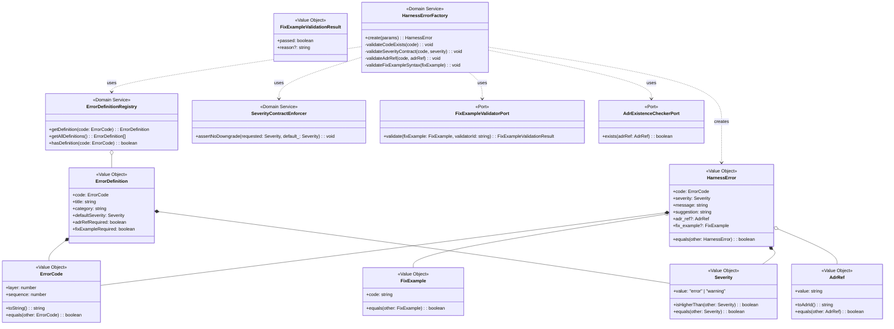

# ドメインモデル: harness-error

@story-id H06-01
@story-id H06-02
@story-id H06-03
> **Unit ID**: harness-error
> **作成日**: 2026-03-13
> **Wave**: 1（基盤構築）
> **対応ストーリー**: H06-01, H06-02, H06-03
> **横断契約参照**: cross_cutting_decisions.md §3（ErrorCode形式）, §4（Shared Kernel）

---

## 1. Ownership / Import-Export

### このUnitが所有する概念

| 概念 | 分類 | 説明 |
|------|------|------|
| HarnessError | 値オブジェクト（Shared Kernel） | 全バリデータのエラー報告フォーマット |
| ErrorCode | 値オブジェクト | L{n}-{nnn}形式のエラーコード |
| Severity | 値オブジェクト | error/warning + readonly契約 |
| FixExample | 値オブジェクト | 修正コード例 + 構文妥当性 |
| AdrRef | 値オブジェクト | ADR参照（ADR-{nnn}形式） |
| FixExampleValidationResult | 値オブジェクト | fix_example検証結果 |
| ErrorDefinition | 値オブジェクト | エラー定義（title/category/defaultSeverity/adrRef要件） |
| HarnessErrorFactory | ドメインサービス | HarnessError生成 + バリデーション |
| ErrorDefinitionRegistry | ドメインサービス | code→定義の対応管理 |
| SeverityContractEnforcer | ドメインサービス | severity格下げ防止 |
| FixExampleValidatorPort | ポートインターフェース | fix_example品質検証 |

### 他Unitから受け取るShared Kernel

なし（本Unitが最下流の共有基盤）

### 他Unitへ公開する契約

| 契約 | 消費Unit | 内容 |
|------|---------|------|
| HarnessError型 | 全Unit | `{ code, severity, message, suggestion, adr_ref?, fix_example? }` |

### Shared Kernel利用表

| 型名 | 所有Unit | 自Unitでの扱い | 変更可否 |
|------|---------|---------------|---------|
| HarnessError | **自Unit（定義元）** | Shared Kernelとして全Unitに提供 | 追加のみ許容、既存フィールドの変更・削除は禁止 |

---

## 2. Aggregate Boundary

### 結論: 集約なし

HarnessErrorは**リッチファクトリ付き不変値オブジェクト**として設計する。集約として扱わない。

### なぜ集約にしないのか

- **不変性**: HarnessErrorは生成後に一切変更されない
- **値等価性**: IDによる識別ではなく、全フィールドの値一致で等価判定
- **永続化不要**: データベースやファイルシステムへの永続化を想定しない（ログ出力・APIレスポンスの一部として消費されるのみ）
- **リポジトリの不自然さ**: 集約化するとHarnessErrorRepositoryが必要になるが、エラーは「発見→報告→消費」のフローであり永続化境界がない

### 集約に入れない概念

| 概念 | 理由 |
|------|------|
| ErrorDefinitionRegistry | カタログ型サービス。定義の管理はHarnessError個体の責務ではない |
| FixExampleValidatorPort | 外部バリデータ呼び出し。Infrastructure層へ委譲 |

---

## 3. Model Classification

### 値オブジェクト

| 値オブジェクト | 不変 | 値等価性 | 説明 |
|-------------|------|---------|------|
| **HarnessError** | ✅ | ✅ | 全フィールドの等価性で比較。生成後Object.freeze()で凍結。Shared Kernel |
| **ErrorCode** | ✅ | ✅ | `L{n}-{nnn}`形式。`layer`（L0〜L4）と`sequence`（nnn）のペア。横断契約§3準拠 |
| **Severity** | ✅ | ✅ | `"error" \| "warning"`。TypeScript readonly修飾子 + Object.freeze()の二重防御 |
| **FixExample** | ✅ | ✅ | 修正コード文字列。構文妥当性は生成時にファクトリで検証 |
| **AdrRef** | ✅ | ✅ | `ADR-{nnn}`形式の参照文字列。ADR実在性検証はファクトリで実施 |
| **FixExampleValidationResult** | ✅ | ✅ | 検証結果（passed/failed + 理由） |
| **ErrorDefinition** | ✅ | ✅ | `{ code, title, category, defaultSeverity, adrRefRequired, fixExampleRequired }` |

### ドメインサービス

| サービス | 責務 | 理由 |
|---------|------|------|
| **HarnessErrorFactory** | HarnessError生成 + 生成時バリデーション | 複数の値オブジェクトとErrorDefinitionRegistryを組み合わせた生成ロジック。単一VOの内部メソッドに収めると責務過多 |
| **ErrorDefinitionRegistry** | ErrorCode→ErrorDefinition対応管理 | カタログ型の参照サービス。title/category/defaultSeverity/adrRef要件を一元管理 |
| **SeverityContractEnforcer** | severity格下げ検出・防止 | 横断的な不変条件の強制。特定のVOに属さないドメインルール |

### ポートインターフェース

| ポート | 方向 | 理由 |
|--------|------|------|
| **FixExampleValidatorPort** | 外部→ドメイン | fix_example適用後のバリデータ通過検証はInfrastructure層アダプターが担当。ドメインではインターフェースのみ定義 |
| **AdrExistenceCheckerPort** | 外部→ドメイン | adr_ref参照先ADRの実在性検証。ファイルシステムアクセスはInfrastructure層 |

---

## 4. Invariants

### HarnessError生成時の不変条件

| # | 不変条件 | 検証タイミング |
|---|---------|-------------|
| INV-1 | ErrorCodeは`L{n}-{nnn}`形式に準拠する | HarnessErrorFactory生成時 |
| INV-2 | ErrorCodeはErrorDefinitionRegistryに登録済みである | HarnessErrorFactory生成時 |
| INV-3 | SeverityはErrorDefinitionのdefaultSeverityと一致する（格上げのみ許容、格下げ禁止） | HarnessErrorFactory生成時 + SeverityContractEnforcer |
| INV-4 | adr_refが指定される場合、`ADR-{nnn}`形式に準拠する | HarnessErrorFactory生成時 |
| INV-5 | ErrorDefinitionでadrRefRequired=trueのコードにはadr_refが必須 | HarnessErrorFactory生成時 |
| INV-6 | fix_exampleが指定される場合、構文的に妥当なコード片である | HarnessErrorFactory生成時（構文チェック） |
| INV-7 | ErrorDefinitionでfixExampleRequired=trueのコードにはfix_exampleが必須 | HarnessErrorFactory生成時 |
| INV-8 | 生成後のHarnessErrorは不変（Object.freeze適用） | HarnessErrorFactory生成直後 |

### Shared Kernelに対する前提条件

| 前提 | 内容 |
|------|------|
| 型安定性 | HarnessError型のインターフェースはWave 1開始前に確定済み。追加のみ許容 |
| ErrorCode拡張性 | L0〜L4、連番の上限なし。Future Unit（L0-xxx, L4-004〜）の追加が自然に行える |

---

## 5. Port Boundary

| 操作 | Port越し？ | 理由 |
|------|-----------|------|
| ErrorCode形式検証 | ❌ ドメイン内 | 正規表現による純粋な値検証 |
| ErrorDefinition参照 | ❌ ドメイン内 | インメモリのレジストリ参照 |
| Severity格下げ検証 | ❌ ドメイン内 | 値の比較ロジック |
| ADR実在性検証 | ✅ Port越し | ファイルシステムアクセスが必要 |
| fix_example構文検証 | ✅ Port越し | パーサー/バリデータの呼び出しが必要 |
| fix_example品質検証（バリデータ通過） | ✅ Port越し | 他Unitのバリデータ実行が必要。CI統合はApplication層から |

---

## 6. Archive Carry-over Exclusions

| 旧概念 | 旧出典 | 今回採用しない理由 | 置換先 |
|--------|--------|----------------|--------|
| HarnessError集約 | v0検討 | 不変・値等価性・永続化不要のため集約は不適切 | HarnessError値オブジェクト + HarnessErrorFactory |
| harness-dx Unit | v0 | v1ではharness-errorに統合。DX概念はerror体系に含まれる | harness-error Unit |
| 意味名ErrorCode | v0（L2-PHASE-GATE等） | 横断契約§3で`L{n}-{nnn}`形式に統一 | ErrorDefinitionRegistry.title/categoryで人間可読性を補完 |

---

## 7. State Transitions

HarnessErrorは不変値オブジェクトのため、**状態遷移なし**。

ErrorDefinitionのライフサイクルも固定（レジストリ登録時に確定、ランタイム変更なし）。

---

## 8. Domain Events

Wave 1ではドメインイベント基盤は構築しない。

将来的に以下のイベントが検討される：
- `ErrorDefinitionRegistered`: 新ErrorCodeの登録時
- `FixExampleValidationFailed`: fix_example品質検証失敗時（CI連携用）

---

## 9. Class Diagram

---

## 10. Open Questions（論理設計へ持ち越し）

| # | 質問 | 影響範囲 |
|---|------|---------|
| OQ-1 | ErrorDefinitionRegistryの初期データをハードコードするか、設定ファイルから読むか | Infrastructure層の実装方式 |
| OQ-2 | fix_example構文検証で許容するパーサーの範囲（TypeScript AST?正規表現?） | FixExampleValidatorPortアダプターの実装 |
