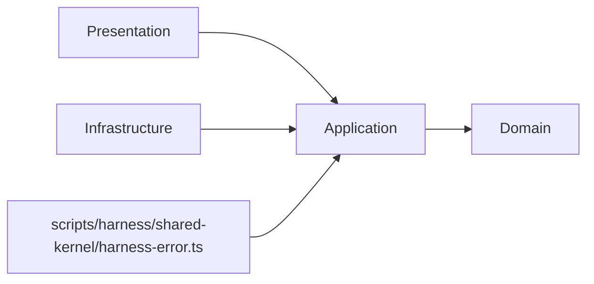

# 論理設計: harness-error

> **Unit ID**: harness-error
> **作成日**: 2026-03-13
> **対応ストーリー**: H06-01, H06-02, H06-03
> **モード**: Unit横断設計（Phase 2）
> **前提ドキュメント**:
> - `docs/inception/harness-error/logical_design_plan.md`
> - `docs/product/construction/harness-error/domain_model.md`
> - `docs/product/units/harness_error_unit.md`
> - `docs/product/units/integration_contract.md`
> - `docs/inception/_shared/cross_cutting_decisions.md`
> - `docs/principles/architecture-philosophy.md`
> - `docs/product/archive/construction/config_foundation/logical_design.md`

---

## 1. アーキテクチャ概要

### 1.1 層構成と責務

| 層 | 責務 | 主な構成要素 | 依存先 |
|----|------|-------------|--------|
| Domain | `HarnessError` の不変条件、`ErrorCode`/`Severity`/`AdrRef`/`FixExample` の値検証、エラー定義カタログ参照、severity格下げ禁止 | 値オブジェクト、ドメインサービス、ドメインポート | なし |
| Application | Domainモデルを使ったユースケース調停、Shared Kernel DTOへの投影、複数エラーの正規化、fix_example一括検証 | UseCase、DTO、Mapper | Domain |
| Infrastructure | Domainポート実装、既存 `scripts/harness/core/error-reporter.ts` 互換吸収、validator実行・ADR実在確認・静的レジストリ供給 | Adapter、Registry source | Application, Domain |
| Presentation | CLI入力パース、出力フォーマット選択、終了コード決定。`harness-api` / 既存CLIから呼ばれる薄い境界 | CLI handler、formatter | Application, Domain |

### 1.2 依存方向

`cross_cutting_decisions.md` と `integration_contract.md` の正規語彙に合わせ、依存方向は以下に固定する。



```text
domain <- application <- infrastructure
domain <- application <- presentation
```

- Domain層は外部I/Oに依存しない
- Application層はDomainモデルの調停に徹し、I/O実装を持たない
- Infrastructure層は `domain/ports/` のみを実装し、CLIロジックを持たない
- Presentation層はApplication層経由でのみ Domain を利用する
- Shared Kernelの公開入口は `scripts/harness/shared-kernel/harness-error.ts` のみとし、他Unitは内部ディレクトリを直接importしない

### 1.3 ディレクトリ構成（全ファイル一覧）

Wave 1 の harness-error 実装は `scripts/harness/harness-error/` 配下に4層で配置し、公開面のみ `scripts/harness/shared-kernel/harness-error.ts` へ再エクスポートする。

```text
scripts/harness/
├── shared-kernel/
│   └── harness-error.ts
└── harness-error/
    ├── domain/
    │   ├── harness-error.ts
    │   ├── errors/
    │   │   ├── harness-error-domain-error.ts
    │   │   ├── invalid-error-code-error.ts
    │   │   ├── unknown-error-definition-error.ts
    │   │   ├── severity-downgrade-violation-error.ts
    │   │   ├── missing-adr-ref-error.ts
    │   │   ├── adr-reference-not-found-error.ts
    │   │   ├── missing-fix-example-error.ts
    │   │   ├── invalid-fix-example-error.ts
    │   │   ├── empty-message-error.ts
    │   │   └── empty-suggestion-error.ts
    │   ├── value-objects/
    │   │   ├── error-code.ts
    │   │   ├── severity.ts
    │   │   ├── adr-ref.ts
    │   │   ├── fix-example.ts
    │   │   ├── error-definition.ts
    │   │   └── fix-example-validation-result.ts
    │   ├── services/
    │   │   ├── harness-error-factory.ts
    │   │   ├── error-definition-registry.ts
    │   │   └── severity-contract-enforcer.ts
    │   └── ports/
    │       ├── adr-existence-checker-port.ts
    │       └── fix-example-validator-port.ts
    ├── application/
    │   ├── dto/
    │   │   ├── harness-error-contract.ts
    │   │   ├── create-harness-error-input.ts
    │   │   ├── validator-issue-draft.ts
    │   │   ├── validate-fix-example-input.ts
    │   │   ├── validate-fix-example-output.ts
    │   │   ├── severity-contract-check-input.ts
    │   │   ├── error-definition-summary.ts
    │   │   └── list-error-definitions-query.ts
    │   ├── mappers/
    │   │   └── harness-error-contract-mapper.ts
    │   └── usecases/
    │       ├── create-harness-error-usecase.ts
    │       ├── normalize-validator-errors-usecase.ts
    │       ├── validate-fix-example-usecase.ts
    │       ├── validate-all-fix-examples-usecase.ts
    │       ├── assert-severity-contract-usecase.ts
    │       └── list-error-definitions-usecase.ts
    ├── infrastructure/
    │   ├── adapters/
    │   │   ├── file-system-adr-existence-checker-adapter.ts
    │   │   ├── type-script-snippet-syntax-adapter.ts
    │   │   ├── validator-execution-fix-example-validator-adapter.ts
    │   │   ├── validator-registry-bridge-adapter.ts
    │   │   └── legacy-error-reporter-adapter.ts
    │   └── registry/
    │       ├── build-error-definition-registry.ts
    │       ├── l1-error-definitions.ts
    │       ├── l2-error-definitions.ts
    │       ├── l3-error-definitions.ts
    │       ├── l4-error-definitions.ts
    │       └── validator-entrypoints.ts
    └── presentation/
        ├── dto/
        │   └── cli-render-options.ts
        ├── formatters/
        │   ├── human-harness-error-formatter.ts
        │   ├── agent-harness-error-formatter.ts
        │   └── ci-harness-error-formatter.ts
        └── handlers/
            ├── render-harness-errors-handler.ts
            ├── validate-fix-example-handler.ts
            ├── list-error-definitions-handler.ts
            └── assert-severity-contract-handler.ts
```

### 1.4 既存実装との接続方針

- 既存 [`scripts/harness/core/error-reporter.ts`](/Users/jumpei/dev/ALIDL_HARNESS/GSDLC_HARNESS/scripts/harness/core/error-reporter.ts) は Phase 1 では削除せず、`legacy-error-reporter-adapter.ts` で canonical 契約へ吸収する
- 既存 [`scripts/harness/cli/ci-check.ts`](/Users/jumpei/dev/ALIDL_HARNESS/GSDLC_HARNESS/scripts/harness/cli/ci-check.ts) の validator 実行結果は `NormalizeValidatorErrorsUseCase` 経由で `HarnessError[]` に正規化する
- `severity: "info"` は canonical 契約外のため、legacy adapter で `warning` にマップした上で以後の層へ渡す
- エラー定義カタログは Wave 1 ではコードベース静的定義とし、`infrastructure/registry/*.ts` から `ErrorDefinitionRegistry` を構築する

---

## 2. Domain層設計

### 2.1 中心モデル: HarnessError（集約なし、値オブジェクトとして設計）

`domain_model.md` の結論どおり、Wave 1 の harness-error は集約を持たない。永続化境界とライフサイクルを持たないため、`HarnessError` は「集約ルートの代替となる中心モデル」として不変値オブジェクトで定義する。

#### 属性一覧

| 属性 | 型 | 説明 | 必須 |
|------|----|------|------|
| code | `ErrorCode` | `L{n}-{nnn}` 形式の正規エラーコード | Yes |
| severity | `Severity` | `"error"` / `"warning"` のみ | Yes |
| message | `string` | 人間可読な説明。空文字不可 | Yes |
| suggestion | `string` | 修正方針。空文字不可 | Yes |
| adrRef | `AdrRef \| null` | 参照ADR。定義で必須な場合は省略不可 | No |
| fixExample | `FixExample \| null` | 修正コード例。定義で必須な場合は省略不可 | No |

#### メソッド一覧

##### `equals(other: HarnessError): boolean`

- 入力: `other: HarnessError`
- 出力: `boolean`
- 処理フロー:
  1. `code`, `severity`, `message`, `suggestion`, `adrRef`, `fixExample` を値比較する
  2. 全項目一致時のみ `true` を返す
- 例外: なし
- 不変条件: 生成後の値は変更されない

##### `hasAdrRef(): boolean`

- 入力: なし
- 出力: `boolean`
- 処理フロー: `adrRef !== null` を返す
- 例外: なし
- 不変条件: `adrRef` が存在する場合は常に `ADR-{nnn}` 形式

##### `hasFixExample(): boolean`

- 入力: なし
- 出力: `boolean`
- 処理フロー: `fixExample !== null` を返す
- 例外: なし
- 不変条件: `fixExample` が存在する場合は検証済みコード片である

##### `toContract(): Readonly<HarnessErrorContract>`

- 入力: なし
- 出力: Shared Kernel公開契約 `HarnessErrorContract`
- 処理フロー:
  1. `ErrorCode` / `Severity` / `AdrRef` / `FixExample` を文字列へ投影する
  2. `{ code, severity, message, suggestion, adr_ref, fix_example }` の平坦な DTO を生成する
  3. `Object.freeze()` で凍結し返却する
- 例外: なし
- 不変条件: 公開DTOの `severity` は readonly で変更不可

### 2.2 値オブジェクト群

#### 2.2.1 ErrorCode

| 属性 | 型 | 説明 |
|------|----|------|
| layer | `"L0"` \| `"L1"` \| `"L2"` \| `"L3"` \| `"L4"` | レイヤー識別子 |
| sequence | `string` | 3桁以上の連番 |
| value | `string` | `L{n}-{nnn}` の完全表現 |

**生成ルール**

- 正規表現 `^L[0-4]-[0-9]{3,}$` に一致すること
- `cross_cutting_decisions.md §3` に従い、意味名コードは受け付けない

**メソッド**

- `static create(raw: string): ErrorCode`
- `getLayer(): "L0" | "L1" | "L2" | "L3" | "L4"`
- `toString(): string`
- `equals(other: ErrorCode): boolean`

**バリデーションルール**

- 空文字、`L5-*`、`L2-PHASE-GATE` 形式は `InvalidErrorCodeError`
- 文字列正規化は行わない。入力値が正規形であることを要求する

#### 2.2.2 Severity

| 属性 | 型 | 説明 |
|------|----|------|
| value | `"error"` \| `"warning"` | 正規severity |
| rank | `2 \| 1` | `error=2`, `warning=1` の比較用内部値 |

**生成ルール**

- `"error"` または `"warning"` のみ許容
- legacy `"info"` は Domain 層へ持ち込まない

**メソッド**

- `static create(raw: "error" | "warning"): Severity`
- `isHigherThan(other: Severity): boolean`
- `equals(other: Severity): boolean`
- `toString(): "error" | "warning"`

**バリデーションルール**

- `"info"` や空文字は `SeverityDowngradeViolationError` ではなく入力不正として弾く
- `Object.freeze()` によりランタイム変更を禁止する

#### 2.2.3 AdrRef

| 属性 | 型 | 説明 |
|------|----|------|
| value | `string` | `ADR-{nnn}` 形式の参照値 |

**生成ルール**

- 正規表現 `^ADR-[0-9]{3}$` に一致すること

**メソッド**

- `static create(raw: string): AdrRef`
- `toString(): string`
- `equals(other: AdrRef): boolean`

**バリデーションルール**

- 形式違反は `MissingAdrRefError` の前段で `HarnessErrorDomainError` として失敗させる

#### 2.2.4 FixExample

| 属性 | 型 | 説明 |
|------|----|------|
| value | `string` | 修正コード片 |

**生成ルール**

- trim後に空文字でないこと
- 構文妥当性と validator 通過確認は `HarnessErrorFactory` または `ValidateFixExampleUseCase` が実施する

**メソッド**

- `static create(raw: string): FixExample`
- `toString(): string`
- `equals(other: FixExample): boolean`

**バリデーションルール**

- 生成時点では「空でないコード片」であることのみ保証する
- `HarnessError` に組み込む前に必ず `FixExampleValidatorPort` で検証する
- 文字列の改変や整形は Domain では行わない

#### 2.2.5 ErrorDefinition

| 属性 | 型 | 説明 |
|------|----|------|
| code | `ErrorCode` | 対象コード |
| title | `string` | 短い人間可読タイトル |
| category | `"phase_gate"` \| `"architecture"` \| `"dependency"` \| `"quality"` \| `"security"` \| `"performance"` \| `"consistency"` \| `"metadata"` | 分類 |
| defaultSeverity | `Severity` | 既定severity |
| adrRefRequired | `boolean` | ADR必須か |
| fixExampleRequired | `boolean` | fix_example必須か |
| defaultAdrRef | `AdrRef \| null` | 既定ADR |
| defaultFixExample | `FixExample \| null` | 既定fix_example |
| ownerValidatorId | `string` | 所有validator ID |

**生成ルール**

- `code` は必ず一意
- `ownerValidatorId` は `integration_contract.md §9` の validator ID に一致すること
- Wave 1 の公開エラー定義は `adrRefRequired=true`, `fixExampleRequired=true` を原則とする

**メソッド**

- `requiresAdrRef(): boolean`
- `requiresFixExample(): boolean`
- `resolveAdrRef(explicitAdrRef?: AdrRef): AdrRef | null`
- `resolveFixExample(explicitFixExample?: FixExample): FixExample | null`
- `equals(other: ErrorDefinition): boolean`

**バリデーションルール**

- `defaultAdrRef` を持つ場合も `adrRefRequired=false` にしてはならない
- `fixExampleRequired=true` の場合、`defaultFixExample` か explicit fix_example のいずれかが必要
- `defaultSeverity=warning` の定義に対して explicit `warning -> error` の格上げは許容する

#### 2.2.6 FixExampleValidationResult

| 属性 | 型 | 説明 |
|------|----|------|
| passed | `boolean` | 総合成否 |
| validatorId | `string` | 実行対象validator |
| reason | `string \| null` | 主たる失敗理由 |
| diagnostics | `readonly string[]` | 詳細理由一覧 |

**生成ルール**

- `passed=true` の場合、`reason` は `null`
- `passed=false` の場合、`diagnostics.length >= 1`

**メソッド**

- `static success(validatorId: string): FixExampleValidationResult`
- `static failure(validatorId: string, reason: string, diagnostics?: readonly string[]): FixExampleValidationResult`
- `equals(other: FixExampleValidationResult): boolean`

**バリデーションルール**

- 構文エラーと validator 再実行失敗を同時に持つ場合、`diagnostics` に両方保持する

### 2.3 ドメインサービス

#### 2.3.1 HarnessErrorFactory

**責務**: `ErrorDefinitionRegistry` と Domain ポートを組み合わせて `HarnessError` を生成する唯一の入口。

**コンストラクタ依存**

- `errorDefinitionRegistry: ErrorDefinitionRegistry`
- `severityContractEnforcer: SeverityContractEnforcer`
- `adrExistenceChecker: AdrExistenceCheckerPort`
- `fixExampleValidator: FixExampleValidatorPort`

##### `create(input: { code: ErrorCode; message: string; suggestion: string; validatorId: string; requestedSeverity?: Severity; adrRef?: AdrRef; fixExample?: string; }): Promise<HarnessError>`

- 入力: エラー生成に必要な最小情報
- 出力: `Promise<HarnessError>`
- 処理フロー:
  1. `message` と `suggestion` の空文字を検証する
  2. `errorDefinitionRegistry.getDefinition(code)` で定義を取得する
  3. `severityContractEnforcer.resolveEffectiveSeverity(requestedSeverity, definition.defaultSeverity)` を呼ぶ
  4. `definition.resolveAdrRef(adrRef)` で ADR を解決する
  5. `definition.adrRefRequired` の場合、ADR未指定なら `MissingAdrRefError`
  6. ADRがある場合、`adrExistenceChecker.exists()` で実在確認し、不在なら `AdrReferenceNotFoundError`
  7. `definition.resolveFixExample(input.fixExample ? FixExample.create(input.fixExample) : undefined)` で fix_example を解決する
  8. `definition.fixExampleRequired` の場合、fix_example 未指定なら `MissingFixExampleError`
  9. fix_example がある場合、`fixExampleValidator.validate({ validatorId: input.validatorId, errorCode: code, fixExample })` を呼び、失敗なら `InvalidFixExampleError`
  10. `HarnessError` を生成し `Object.freeze()` で凍結する
- 例外:
  - `UnknownErrorDefinitionError`
  - `SeverityDowngradeViolationError`
  - `MissingAdrRefError`
  - `AdrReferenceNotFoundError`
  - `MissingFixExampleError`
  - `InvalidFixExampleError`
  - `EmptyMessageError`
  - `EmptySuggestionError`
- 不変条件:
  - `INV-1`〜`INV-8` を全て満たすこと

#### 2.3.2 ErrorDefinitionRegistry

**責務**: code 単位の正規定義カタログ。人間可読情報、severity 契約、ADR/fix_example 必須性を一元管理する。

**コンストラクタ依存**

- `definitions: readonly ErrorDefinition[]`

##### `getDefinition(code: ErrorCode): ErrorDefinition`

- 入力: `code: ErrorCode`
- 出力: `ErrorDefinition`
- 処理フロー:
  1. 内部 `Map<string, ErrorDefinition>` を参照
  2. 一致する定義を返却
  3. 存在しない場合は `UnknownErrorDefinitionError`
- 例外: `UnknownErrorDefinitionError`
- 不変条件: 同一 code の重複登録禁止

##### `getAllDefinitions(): readonly ErrorDefinition[]`

- 入力: なし
- 出力: 定義一覧
- 処理フロー: 内部配列を code 昇順で返す
- 例外: なし
- 不変条件: 呼び出し側から変更できない readonly 配列を返す

##### `listByValidator(validatorId: string): readonly ErrorDefinition[]`

- 入力: `validatorId`
- 出力: 所有validatorに紐づく定義一覧
- 処理フロー: `ownerValidatorId` でフィルタし code 昇順で返す
- 例外: なし

##### `listByLayer(layer: "L0" | "L1" | "L2" | "L3" | "L4"): readonly ErrorDefinition[]`

- 入力: layer
- 出力: layer一致の定義一覧
- 処理フロー: `code.getLayer()` でフィルタする
- 例外: なし

##### `hasDefinition(code: ErrorCode): boolean`

- 入力: `code`
- 出力: `boolean`
- 処理フロー: 内部Mapの存在判定を返す
- 例外: なし

#### 2.3.3 SeverityContractEnforcer

**責務**: defaultSeverity に対する格下げを禁止し、許容される effective severity を返す。

**コンストラクタ依存**

- なし

##### `resolveEffectiveSeverity(requested: Severity | undefined, defaultSeverity: Severity): Severity`

- 入力: `requested`, `defaultSeverity`
- 出力: `Severity`
- 処理フロー:
  1. `requested` 未指定なら `defaultSeverity` を返す
  2. `requested.isHigherThan(defaultSeverity)` なら `requested` を返す
  3. `requested.equals(defaultSeverity)` なら `requested` を返す
  4. それ以外は `SeverityDowngradeViolationError`
- 例外: `SeverityDowngradeViolationError`
- 不変条件: `error -> warning` は常に拒否

##### `assertNoDowngrade(requested: Severity, defaultSeverity: Severity): void`

- 入力: `requested`, `defaultSeverity`
- 出力: なし
- 処理フロー: `resolveEffectiveSeverity()` を呼び、結果を破棄する
- 例外: `SeverityDowngradeViolationError`

### 2.4 ドメインイベント

#### 2.4.1 Wave 1 の結論

Wave 1 ではドメインイベント基盤を実装しない。`domain_model.md` に従い、`HarnessError` は不変値オブジェクトであり、イベントキューを持たない。

#### 2.4.2 将来予約するイベント

| イベント | 属性 | 用途 |
|---------|------|------|
| `ErrorDefinitionRegistered` | `code`, `title`, `ownerValidatorId`, `registeredAt` | 新規コード登録の監査 |
| `FixExampleValidationFailed` | `code`, `validatorId`, `reason`, `diagnostics`, `occurredAt` | CIでの失敗通知 |

---

## 3. Domain層ポート設計

ポートは全て `scripts/harness/harness-error/domain/ports/` に定義し、Infrastructure層が実装する。

### 3.1 AdrExistenceCheckerPort

```ts
export interface AdrExistenceCheckerPort {
  exists(adrRef: AdrRef): Promise<boolean>;
}
```

| メソッド | 入力 | 出力 | 説明 |
|---------|------|------|------|
| `exists` | `adrRef: AdrRef` | `Promise<boolean>` | `docs/ADR/` 配下に参照ADRが存在するか確認する |

### 3.2 FixExampleValidatorPort

```ts
export interface FixExampleValidatorPort {
  validate(input: {
    validatorId: string;
    errorCode: ErrorCode;
    fixExample: FixExample;
  }): Promise<FixExampleValidationResult>;
}
```

| メソッド | 入力 | 出力 | 説明 |
|---------|------|------|------|
| `validate` | `validatorId`, `errorCode`, `fixExample` | `Promise<FixExampleValidationResult>` | 構文妥当性確認と、適用後に validator が通過することの双方を検証する |

### 3.3 ポート設計上のルール

- Port の戻り値は Domain が理解できる値オブジェクトかプリミティブに限定する
- Port は validator の実行エンジンやファイルシステム API を露出しない
- Port 呼び出し順序は `HarnessErrorFactory` が制御し、Application 層は Port を直接叩かない

---

## 4. Application層設計

### 4.1 DTO / Mapper方針

| 要素 | 役割 |
|------|------|
| `HarnessErrorContract` | Shared Kernel公開用 readonly DTO |
| `ValidatorIssueDraft` | Infrastructure から受け取る正規化前の中間表現 |
| `HarnessErrorContractMapper` | `HarnessError` を `{ code, severity, message, suggestion, adr_ref, fix_example }` に投影 |

Shared Kernel DTO は Application 層でのみ生成する。Domain 層は内部 VO を維持し、他Unitへ直接露出しない。

### 4.2 CreateHarnessErrorUseCase

**責務**: 単一の error draft を canonical `HarnessErrorContract` へ変換する。

**コンストラクタ依存**

- `harnessErrorFactory: HarnessErrorFactory`
- `contractMapper: HarnessErrorContractMapper`

**入力**

`CreateHarnessErrorInput`

| 項目 | 型 | 必須 |
|------|----|------|
| code | `string` | Yes |
| message | `string` | Yes |
| suggestion | `string` | Yes |
| severity | `"error" \| "warning" \| undefined` | No |
| adrRef | `string \| undefined` | No |
| fixExample | `string \| undefined` | No |
| validatorId | `string` | Yes |

**出力**: `Readonly<HarnessErrorContract>`

**処理フロー**

1. `code` / `severity` / `adrRef` を各 VO に変換する
2. `harnessErrorFactory.create()` へ `validatorId` を含めて渡し `HarnessError` を生成する
3. `contractMapper.toReadonlyContract()` で Shared Kernel DTO に変換する
4. `Object.freeze()` 済みの DTO を返す

**例外**

- Domain 層の各生成例外
- 入力マッピング失敗時の `HarnessErrorDomainError`

### 4.3 NormalizeValidatorErrorsUseCase

**責務**: validatorごとの差分を除去し、複数エラーを一括で canonical 契約へ変換する。

**コンストラクタ依存**

- `createHarnessErrorUseCase: CreateHarnessErrorUseCase`

**入力**

`readonly ValidatorIssueDraft[]`

**出力**

```ts
{
  errors: readonly Readonly<HarnessErrorContract>[];
  summary: {
    total: number;
    errors: number;
    warnings: number;
  };
}
```

**処理フロー**

1. 入力配列を受け取る
2. 各 draft に対して `CreateHarnessErrorUseCase.execute()` を呼ぶ
3. code昇順、同コード内は入力順で安定ソートする
4. `summary` を計算する
5. readonly 配列で返す

**例外**

- 単一draftの変換に失敗した場合はその例外を送出する
- 部分成功は認めない。全件成功か全件失敗かの原子性を持つ

### 4.4 ValidateFixExampleUseCase

**責務**: 単一エラー定義の `fix_example` を検証する。

**コンストラクタ依存**

- `errorDefinitionRegistry: ErrorDefinitionRegistry`
- `fixExampleValidator: FixExampleValidatorPort`

**入力**

`ValidateFixExampleInput`

| 項目 | 型 | 必須 |
|------|----|------|
| code | `string` | Yes |
| overrideFixExample | `string \| undefined` | No |

**出力**

`ValidateFixExampleOutput`

| 項目 | 型 | 説明 |
|------|----|------|
| code | `string` | 対象コード |
| validatorId | `string` | 検証対象validator |
| passed | `boolean` | 成否 |
| diagnostics | `readonly string[]` | 詳細理由 |

**処理フロー**

1. `ErrorCode.create(code)` でVO化する
2. `errorDefinitionRegistry.getDefinition()` で定義を取得する
3. `overrideFixExample` があれば `FixExample.create()` し、なければ定義の `defaultFixExample` を使う
4. fix_example が解決できない場合は `MissingFixExampleError`
5. `fixExampleValidator.validate({ validatorId: definition.ownerValidatorId, errorCode, fixExample })` を呼ぶ
6. `ValidateFixExampleOutput` に投影する

**例外**

- `UnknownErrorDefinitionError`
- `MissingFixExampleError`
- Port実装の実行エラー

### 4.5 ValidateAllFixExamplesUseCase

**責務**: registry 全件または条件付きで `fix_example` を一括検証する。

**コンストラクタ依存**

- `errorDefinitionRegistry: ErrorDefinitionRegistry`
- `validateFixExampleUseCase: ValidateFixExampleUseCase`

**入力**

```ts
{
  layer?: "L0" | "L1" | "L2" | "L3" | "L4";
  validatorId?: string;
  failFast?: boolean;
}
```

**出力**

```ts
{
  results: readonly ValidateFixExampleOutput[];
  summary: {
    total: number;
    passed: number;
    failed: number;
  };
}
```

**処理フロー**

1. `errorDefinitionRegistry.getAllDefinitions()` で全件取得する
2. `layer` / `validatorId` でフィルタする
3. 各定義に対し `ValidateFixExampleUseCase.execute()` を呼ぶ
4. `failFast=true` の場合、最初の失敗で打ち切る
5. 集計して返す

**例外**

- 単体検証で起きる例外
- registry 構築失敗

### 4.6 AssertSeverityContractUseCase

**責務**: orchestration 層や CLI で severity の格下げが発生していないかを明示的に検証する。

**コンストラクタ依存**

- `errorDefinitionRegistry: ErrorDefinitionRegistry`
- `severityContractEnforcer: SeverityContractEnforcer`

**入力**

`SeverityContractCheckInput`

| 項目 | 型 | 必須 |
|------|----|------|
| code | `string` | Yes |
| requestedSeverity | `"error" \| "warning"` | Yes |

**出力**

```ts
{
  code: string;
  effectiveSeverity: "error" | "warning";
  violated: false;
}
```

**処理フロー**

1. `code` と `requestedSeverity` を VO 化する
2. `errorDefinitionRegistry.getDefinition()` で既定 severity を取得する
3. `severityContractEnforcer.resolveEffectiveSeverity()` を呼ぶ
4. 成功時は effective severity を返す

**例外**

- `SeverityDowngradeViolationError`
- `UnknownErrorDefinitionError`

### 4.7 ListErrorDefinitionsUseCase

**責務**: 他UnitやCIが参照する error definition カタログを返す。

**コンストラクタ依存**

- `errorDefinitionRegistry: ErrorDefinitionRegistry`

**入力**

`ListErrorDefinitionsQuery`

```ts
{
  layer?: "L0" | "L1" | "L2" | "L3" | "L4";
  validatorId?: string;
  category?: string;
}
```

**出力**: `readonly ErrorDefinitionSummary[]`

**処理フロー**

1. 定義一覧を取得する
2. 条件でフィルタする
3. DTOへ投影して返す

**例外**

- なし。0件ヒットは正常系として空配列を返す

---

## 5. Infrastructure層設計

### 5.1 FileSystemAdrExistenceCheckerAdapter

**実装ポート**: `AdrExistenceCheckerPort`

**利用ライブラリ**

- `node:fs/promises`
- `node:path`

**実装方針**

- `docs/ADR/` 配下を探索し、`ADR-{nnn}` と frontmatter `adr_id: "nnn"` の双方で一致確認する
- ファイル名一致だけでなく frontmatter も確認し、誤配置を防ぐ
- `false` を返すだけで例外は投げない。I/O失敗時のみ adapter 例外を返す

### 5.2 TypeScriptSnippetSyntaxAdapter

**役割**: `FixExampleValidatorPort` の内部協力要素。fix_example の構文妥当性を TypeScript Compiler API で検査する。

**利用ライブラリ**

- `typescript`

**実装方針**

- `ts.createSourceFile()` でコード片を仮想ファイルとしてパースする
- 単一文・複数文の双方を許容するため、必要に応じて wrapper 関数へ包む
- diagnostics が1件でもあれば構文失敗とする

**採用理由**

- `logical_design_plan.md` の第一候補どおり TypeScript Compiler API を採用し、正規表現ベース検証は採用しない

### 5.3 ValidatorRegistryBridgeAdapter

**役割**: validator ID と既存 validator 実行エントリポイントを結びつける。

**実装方針**

- `integration_contract.md §9` の validator ID を正として `validator-entrypoints.ts` に静的マップを持つ
- Wave 1 では既存 `scripts/harness/validators/*.ts` を直接参照する
- validator-system の正式 Registry が整備された段階でこの adapter の内部実装のみ差し替える

### 5.4 ValidatorExecutionFixExampleValidatorAdapter

**実装ポート**: `FixExampleValidatorPort`

**コンストラクタ依存**

- `syntaxAdapter: TypeScriptSnippetSyntaxAdapter`
- `validatorRegistryBridge: ValidatorRegistryBridgeAdapter`

**実装方針**

1. `syntaxAdapter` で構文妥当性を確認する
2. validatorごとの fixture / invalid sample を取得する
3. `fix_example` を適用した仮想入力を生成する
4. 対象 validator を再実行する
5. エラーが消失していれば `FixExampleValidationResult.success()` を返す
6. 失敗時は diagnostics を蓄積して `failure()` を返す

**設計上の注意点**

- validator再実行は deterministic な fixture に限定する
- Wave 1 では「対象コードの違反が消えること」を成功条件にし、他コードの警告追加は失敗に含める

### 5.5 LegacyErrorReporterAdapter

**役割**: 現行 [`scripts/harness/core/error-reporter.ts`](/Users/jumpei/dev/ALIDL_HARNESS/GSDLC_HARNESS/scripts/harness/core/error-reporter.ts) の豊富な旧 `HarnessError` を `ValidatorIssueDraft` に変換する。

**実装方針**

- 旧構造の `message.short`, `resolution.fixSuggestion`, `metadata.validator` 等を新 draft に写像する
- `severity: "info"` は canonical 契約外のため `warning` にマップする
- `category`, `location`, `context`, `resolution.docLinks` は draft 外の情報なので切り捨てるのではなく、必要に応じて `suggestion` 末尾へ圧縮する

### 5.6 ErrorDefinition Registry Source

**構成**

- `l1-error-definitions.ts`
- `l2-error-definitions.ts`
- `l3-error-definitions.ts`
- `l4-error-definitions.ts`
- `build-error-definition-registry.ts`

**実装方針**

- Wave 1 ではコードベース静的定義を採用する
- layer別ファイルに分割し、PR差分とレビュー単位を明確化する
- `build-error-definition-registry.ts` が重複 code / 欠落 ADR / 欠落 defaultFixExample を起動時検証する

---

## 6. Presentation層設計

### 6.1 前提

harness-error は `integration_contract.md §3` にあるトップレベル CLI コマンドの所有者ではない。トップレベルコマンドは主に harness-api が所有し、本Unitの Presentation 層はその内部から呼ばれる CLI handler / formatter を提供する。

### 6.2 RenderHarnessErrorsHandler

**ファイル**: `scripts/harness/harness-error/presentation/handlers/render-harness-errors-handler.ts`

**役割**

- `harness:lint`, `harness:complete-check`, `harness:ci-check` の出力整形
- human / agent / ci の3形式へ切り替え

**引数**

| 引数 | 必須 | 説明 |
|------|------|------|
| `--format <human|agent|ci>` | Yes | 出力形式 |
| `--input <path>` | No | 入力JSONファイル。省略時はstdin |
| `--fail-on-error` | No | `error` が1件でもあれば終了コード1 |

**処理**

1. 入力JSONを `HarnessErrorContract[]` として読み込む
2. `isHarnessError()` で構造検証する
3. formatter を選択して文字列化する
4. stdout へ出力する
5. `--fail-on-error` 指定時は `severity==="error"` の有無で終了コードを決定する

**終了コード**

| コード | 意味 |
|------|------|
| 0 | 出力成功、または warning のみ |
| 1 | `--fail-on-error` 指定かつ error を含む |
| 2 | 入力不正、JSON parse失敗、formatter実行失敗 |

### 6.3 ValidateFixExampleHandler

**ファイル**: `scripts/harness/harness-error/presentation/handlers/validate-fix-example-handler.ts`

**役割**

- CIから `ValidateAllFixExamplesUseCase` を呼ぶ入口
- 単一コード検証と全件検証を切り替える

**引数**

| 引数 | 必須 | 説明 |
|------|------|------|
| `--code <Lx-nnn>` | No | 単一コード検証 |
| `--layer <L1|L2|L3|L4>` | No | レイヤーフィルタ |
| `--validator-id <id>` | No | validatorフィルタ |
| `--fail-fast` | No | 最初の失敗で停止 |
| `--format <human|json>` | No | 表示形式。既定はhuman |

**処理**

1. `--code` 指定時は `ValidateFixExampleUseCase`
2. それ以外は `ValidateAllFixExamplesUseCase`
3. 結果を表形式または JSON で出力
4. failed 件数で終了コードを決定

**終了コード**

| コード | 意味 |
|------|------|
| 0 | 対象fix_exampleが全て妥当 |
| 1 | 1件以上失敗 |
| 2 | 実行環境エラー、validator実行失敗 |

### 6.4 ListErrorDefinitionsHandler

**ファイル**: `scripts/harness/harness-error/presentation/handlers/list-error-definitions-handler.ts`

**役割**

- エラー定義カタログの可視化
- CIや設計レビュー時の参照用

**引数**

| 引数 | 必須 | 説明 |
|------|------|------|
| `--layer <L1|L2|L3|L4>` | No | layerフィルタ |
| `--validator-id <id>` | No | validatorフィルタ |
| `--category <name>` | No | categoryフィルタ |
| `--format <table|json>` | No | 出力形式 |

**処理**

1. `ListErrorDefinitionsUseCase.execute()` を呼ぶ
2. table または JSON に整形して出力する

**終了コード**

| コード | 意味 |
|------|------|
| 0 | 1件以上ヒット |
| 1 | 0件ヒット |
| 2 | 実行エラー |

### 6.5 AssertSeverityContractHandler

**ファイル**: `scripts/harness/harness-error/presentation/handlers/assert-severity-contract-handler.ts`

**役割**

- H06-03 の severity 契約確認
- harness-api 側 DTO 変換や手動検証時のデバッグ入口

**引数**

| 引数 | 必須 | 説明 |
|------|------|------|
| `--code <Lx-nnn>` | Yes | 対象コード |
| `--requested-severity <error|warning>` | Yes | 要求severity |
| `--format <text|json>` | No | 出力形式 |

**処理**

1. `AssertSeverityContractUseCase.execute()` を呼ぶ
2. 成功時は effective severity を出力
3. `SeverityDowngradeViolationError` を捕捉した場合、違反内容と根拠ADRを出力する

**終了コード**

| コード | 意味 |
|------|------|
| 0 | 契約順守 |
| 1 | 格下げ違反 |
| 2 | 実行エラー |

### 6.6 Formatter設計

| Formatter | 用途 | 既存置換対象 |
|-----------|------|-------------|
| `HumanHarnessErrorFormatter` | 開発者向けコンソール表示 | 既存 `formatForHuman()` |
| `AgentHarnessErrorFormatter` | AIエージェント向け詳細テキスト | 既存 `formatForAgent()` |
| `CiHarnessErrorFormatter` | GitHub annotation JSON | 既存 `formatForCI()` |

Formatter は `HarnessErrorContract[]` のみを受け取り、Application/Infrastructure へ依存しない。

---

## 7. Shared Kernel公開設計

### 7.1 公開入口

唯一の公開入口は `scripts/harness/shared-kernel/harness-error.ts` とする。

### 7.2 公開内容

```ts
export type HarnessErrorSeverity = "error" | "warning";

export interface HarnessErrorContract {
  readonly code: string;
  readonly severity: HarnessErrorSeverity;
  readonly message: string;
  readonly suggestion: string;
  readonly adr_ref?: string;
  readonly fix_example?: string;
}

export function isHarnessError(value: unknown): value is HarnessErrorContract;
```

### 7.3 公開ルール

- add-only 互換を徹底し、既存フィールドの削除・改名・意味変更は禁止
- `readonly` と `Object.freeze()` を併用し、型レベルと実行時の双方で immutability を担保する
- `severity` は `"error" | "warning"` のみ。`"info"` は公開しない

---

## 8. テスト方針

### 8.1 テスト対象 × テストレイヤー

| 対象 | ユニットテスト | 統合テスト | 契約テスト |
|------|---------------|-----------|-----------|
| Domain VO / Domain Service | Yes | No | No |
| Application UseCase | Yes | Yes | No |
| Infrastructure Adapter | No | Yes | No |
| Shared Kernel公開面 | No | No | Yes |
| Presentation Handler / Formatter | Yes | Yes | No |

### 8.2 Domain層テスト方針

- `ErrorCode`, `Severity`, `AdrRef`, `FixExample`, `ErrorDefinition`, `FixExampleValidationResult` を Small テストで検証する
- `HarnessErrorFactory` は Port のみをテストダブルにし、Domain モデルは実体を使う
- 主要異常系:
  - `L{n}-{nnn}` 形式違反
  - 未登録 code
  - `error -> warning` 格下げ
  - ADR 必須違反 / ADR 不存在
  - fix_example 必須違反 / 構文不正 / validator 通過失敗

### 8.3 Application層テスト方針

- `CreateHarnessErrorUseCase` と `NormalizeValidatorErrorsUseCase` は readonly DTO 生成と summary 計算を検証する
- `ValidateAllFixExamplesUseCase` は fail-fast の有無と集計値を検証する
- `AssertSeverityContractUseCase` は H06-03 の violation シナリオを最優先で固定化する

### 8.4 Infrastructure層テスト方針

- `FileSystemAdrExistenceCheckerAdapter` は `docs/ADR/` fixture で frontmatter とファイル名の両一致を確認する
- `TypeScriptSnippetSyntaxAdapter` は構文正常 / 構文異常の代表例を fixture 化する
- `ValidatorExecutionFixExampleValidatorAdapter` は validator ごとの最小 fixture を用い、「適用前NG / 適用後OK」を検証する
- `LegacyErrorReporterAdapter` は旧 `severity: "info"` の `warning` 化を必ず検証する

### 8.5 Presentation層テスト方針

- formatter は同一入力に対し deterministic な文字列を返すことを確認する
- handler は引数不足、終了コード、stdout 形式を中粒度テストで検証する
- `RenderHarnessErrorsHandler` は `--fail-on-error` の有無で終了コードが変わることを確認する

### 8.6 テスト規約適用

`testing-rules.md` に従い、以下を厳守する。

- テストケース名は日本語で記述する
- AAAコメントを明示する
- Act結果は `actual` 変数へ代入する
- UseCase テストでは Port のみをモックし、Domain モデルはモックしない

---

## 9. ストーリーとの対応

### 9.1 H06-01 HarnessError基盤クラス定義

- `HarnessError`, `ErrorCode`, `Severity`, `AdrRef`, `FixExample`
- `HarnessErrorFactory`, `ErrorDefinitionRegistry`
- `CreateHarnessErrorUseCase`, `NormalizeValidatorErrorsUseCase`
- `shared-kernel/harness-error.ts`

### 9.2 H06-02 ErrorCode体系とレイヤー別分類

- `ErrorDefinition` の `category`, `ownerValidatorId`, `defaultSeverity`
- `l1-error-definitions.ts` 〜 `l4-error-definitions.ts`
- `ListErrorDefinitionsUseCase`
- `ValidateFixExampleUseCase`, `ValidateAllFixExamplesUseCase`

### 9.3 H06-03 エラー表示フォーマットとCLI統合

- `SeverityContractEnforcer`
- `AssertSeverityContractUseCase`
- `HumanHarnessErrorFormatter`, `AgentHarnessErrorFormatter`, `CiHarnessErrorFormatter`
- `RenderHarnessErrorsHandler`, `AssertSeverityContractHandler`

---

## 10. 設計上の決定事項

| 論点 | 決定 |
|------|------|
| ErrorDefinitionRegistryのデータ源 | Wave 1 はコードベース静的定義。`infrastructure/registry/*.ts` に分割配置 |
| fix_example構文検証 | TypeScript Compiler API を採用 |
| 旧 `severity: "info"` の扱い | legacy adapter で `warning` に変換し、canonical 契約には入れない |
| Presentation層の責務 | トップレベルCLI所有ではなく、harness-api/CI から利用される内部 handler / formatter を提供 |
