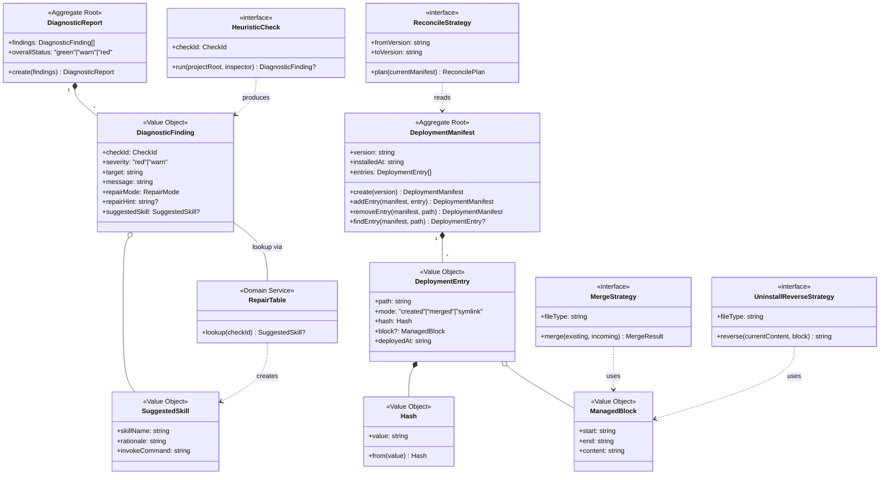

---
traceability:
  initial_creation: true
---

# Domain Model: installation

> **Unit ID**: installation
> **対応 WI**: WI-145 / WI-146 / WI-147 / WI-148 / WI-169 / WI-207 / WI-208 / WI-209
> **作成日**: 2026-05-11
> **承認済 Phase 1 計画**: `docs/inception/installation/domain_model_plan.md`

## 1. 集約一覧

### 1.1 DeploymentManifest (集約 root)

@work-item-id WI-145
- 役割: phasegate が deploy した全 file の状態記録、永続的 (`.phasegate/manifest.json` に保存)
- 内部 VO: `DeploymentEntry[]`
- 不変条件:
  - (a) `entries[].path` がユニーク — 同一 path の entry が 2 件以上存在してはならない
  - (b) `entry.mode == "merged"` ⇒ `entry.block != null` — merge mode には必ず managed block 識別子が付随する
  - (c) `entry.hash` は `sha256:<64 hex chars>` 形式 — prefix 付き sha256 文字列のみ受け付ける
  - (d) `version` は semver 形式 (例: `"0.145.0"`) — non-semver 文字列は拒否
- ライフサイクル: install で作成 → install / reconcile で更新 → uninstall で archive (`uninstalled-{ISO-timestamp}.json` に rename)
- API (pure functions, 新インスタンス返却):
  - `DeploymentManifest.create(version: string): DeploymentManifest`
  - `addEntry(manifest: DeploymentManifest, entry: DeploymentEntry): DeploymentManifest`
  - `removeEntry(manifest: DeploymentManifest, path: string): DeploymentManifest`
  - `findEntry(manifest: DeploymentManifest, path: string): DeploymentEntry | null`

### 1.2 DiagnosticReport (集約 root)

@work-item-id WI-145
- 役割: doctor / install / uninstall / reconcile の 1 回実行で出力される検査結果、一過性 (永続化しない)
- 内部 VO: `DiagnosticFinding[]`
- 不変条件:
  - (a) `findings[].checkId` がユニーク — 同一 checkId の finding が 2 件以上存在してはならない
  - (b) `finding.repairMode == "ai-assisted"` ⇒ `finding.suggestedSkill != null` — ai-assisted には必ず SuggestedSkill を付与する
  - (c) `findings` に severity == "red" が 1 件でもあれば `overallStatus = "red"` — red finding がひとつでも存在すると全体ステータスが red になる
  - (d) `overallStatus` は `findings` から derive される (constructor で計算固定、外部注入不可) — warn only なら `"warn"`、findings が空なら `"green"`
- ライフサイクル: doctor / install / reconcile などの operation 内で factory `create()` で生成し、return value として 1 回使用して破棄
- API:
  - `DiagnosticReport.create(findings: DiagnosticFinding[]): DiagnosticReport` — overallStatus を自動計算して固定

---

## 2. Value Objects 一覧

### 2.1 DeploymentEntry

@work-item-id WI-145
- フィールド:
  ```
  {
    path: string            // プロジェクト相対パス (e.g. ".claude/settings.json")
    mode: "created" | "merged" | "symlink"
    hash: Hash              // sha256 prefix 付き VO
    block?: ManagedBlock    // mode == "merged" の場合のみ存在
    deployedAt: string      // ISO 8601 タイムスタンプ (e.g. "2026-05-11T00:00:00.000Z")
  }
  ```
- equality: `path` 一致のみ (Phase 1 計画書 Q4 承認) — hash や mode の変更は「同 path entry の差し替え」として扱う
- immutability: 全フィールドを TypeScript `readonly` で記述 + constructor で `Object.freeze(this)` を適用

### 2.2 DiagnosticFinding

@work-item-id WI-145
- フィールド:
  ```
  {
    checkId: CheckId
    severity: "red" | "warn"
    target: string                    // 検査対象 path (e.g. ".claude/settings.json")
    message: string                   // 人間可読の検出内容
    repairMode: RepairMode
    repairHint: string | null         // mechanical 時のコピペ可能なコマンド hint (e.g. "npx phasegate install --apply")。それ以外は null
    suggestedSkill: SuggestedSkill | null   // repairMode == "ai-assisted" の場合は非 null (不変条件)
  }
  ```
- 制約: `repairMode == "ai-assisted"` ⇒ `suggestedSkill != null` (constructor で検証し違反時は例外)
- severity と repairMode は独立次元 (Phase 1 計画書 Q5 承認) — 4 象限全てが有効な組み合わせ
- immutability: 全フィールドを TypeScript `readonly` + constructor で `Object.freeze(this)`

### 2.3 RepairMode

@work-item-id WI-145
- 型: `"mechanical" | "ai-assisted" | "manual"` (3 値 enum-like VO)
- 意味:
  - `mechanical`: phasegate 自身が機械的に修復可能 (e.g. `phasegate install --force` で解消できる)
  - `ai-assisted`: skill 経由で AI に作業委譲推奨 (e.g. user 改変済みファイルへの merge 位置判定、settings.json の構造的不在 + user 改変が複合している場合)
  - `manual`: 人間判断が必須 (e.g. CI workflow の意味的競合、symlink の cascade 影響範囲)
- immutability: TypeScript literal type により変更不可

### 2.4 SuggestedSkill

@work-item-id WI-145
- フィールド:
  ```
  {
    skillName: string       // invoke する skill 名 (e.g. "phasegate-config-doctor")
    rationale: string       // AI 委譲を推奨する理由説明
    invokeCommand: string   // コピペ可能な skill 起動コマンド (e.g. "npx phasegate install --force")
  }
  ```
- 用途: `ai-assisted` finding に同梱し、doctor / install / uninstall / reconcile 出力で「次にこの skill を起動してください」を示す
- immutability: 全フィールドを TypeScript `readonly` + constructor で `Object.freeze(this)`

### 2.5 Hash

@work-item-id WI-145
- 形式: `sha256:<64 hex chars>` の prefix 付き文字列 (Phase 1 計画書 Q3 承認)
  - 例: `"sha256:a665a45920422f9d417e4867efdc4fb8a04a1f3fff1fa07e998e86f7f7a27ae3"`
  - 正規表現: `/^sha256:[0-9a-f]{64}$/`
- 設計意図: prefix により将来のハッシュアルゴリズム切替 (sha512 等) に対応できる
- factory: `Hash.from(value: string): Hash` — 形式を検証してインスタンス化、不正形式は例外
- domain 層は IO を持たない: hash の計算は application layer の `HashCalculatorPort` アダプター経由で行う。`Hash.from` は既に計算済みの文字列を受け取るのみ
- immutability: TypeScript `readonly` + constructor で `Object.freeze(this)`

### 2.6 ManagedBlock

@work-item-id WI-146
- フィールド:
  ```
  {
    start: string   // block の開始マーカー文字列
    end: string     // block の終了マーカー文字列
    content: string // phasegate が管理する block 内容
  }
  ```
- 用途: `merged` mode の entry が、対象ファイル内のどの区間を phasegate が管理するかを示す
- 具体例:
  - `.husky/pre-commit` など shell script: `{ start: "# === phasegate managed (BEGIN) ===", end: "# === phasegate managed (END) ===", content: <shell スクリプト断片> }`
  - `.claude/settings.json` / `.codex/hooks.json` など JSON: `{ start: "phasegate-managed-start", end: "phasegate-managed-end", content: <hooks 設定 JSON 部分文字列> }`
- immutability: 全フィールドを TypeScript `readonly` + constructor で `Object.freeze(this)`

### 2.6.1 Personal Install Mode

@work-item-id WI-207
@work-item-id WI-208
@work-item-id WI-209

- 役割: team repository に個人だけが PhaseGate を導入する lifecycle variant。
- team-owned file: `package.json`, `AGENTS.md`, `CLAUDE.md`, `.husky/*`, `.github/workflows/*`, `.gitignore`。
- personal artifact: `.phasegate-local/phasegate.config.json`, real agent runtime artifacts under `.claude/` / `.codex/`, `.git/info/exclude` の PhaseGate managed block, `.phasegate/manifest.json`。
- personal sandbox: PhaseGate config fallback is parked under `.phasegate-local/` so team-owned project root files remain untouched.
- agent runtime surface: Claude Code / Codex discovery requires project-local `.claude/settings.json`, `.claude/skills/`, `.codex/hooks.json`, and `.codex/skills/`.
- real runtime artifact: personal mode creates agent runtime surface entries as regular files/directories, not symlink shims.
- 不変条件:
  - install plan / apply に team-owned file を含めない。
  - `.gitignore` は touch せず、local ignore は `.git/info/exclude` に限定する。
  - `--agent claude` は `.claude/settings.json` と `.claude/skills/` を local-only real runtime artifact として自動初期化する。
  - `--agent codex` は `.codex/hooks.json` と `.codex/skills/` を local-only real runtime artifact として自動初期化する。
  - 既存の non-PhaseGate `.claude/*` / `.codex/*` は上書きせず manual review として扱う。
  - GitHub CLI 認証、repo secrets、hosted CI state は personal apply target に含めない。
  - uninstall は manifest-managed personal artifact のみを撤去し、team-owned file bytes を変化させない。

### 2.7 CheckId

@work-item-id WI-145
@work-item-id WI-169
- 型: 10 種の文字列 literal union。WI-145 の setup target checks に WI workflow drift check を追加した現行 doctor contract。

```typescript
type CheckId =
  | "claude-hook-missing"
  | "codex-hook-missing"
  | "husky-pre-commit-missing"
  | "husky-commit-msg-missing"
  | "husky-pre-push-missing"
  | "ci-workflow-missing"
  | "package-json-devdep-missing"
  | "claude-skills-symlink"
  | "codex-skills-symlink"
  | "wi-workflow-drift"
```

- 各 CheckId と対応する severity のデフォルト値:

| CheckId | デフォルト severity |
|---|---|
| `claude-hook-missing` | red |
| `codex-hook-missing` | red |
| `husky-pre-commit-missing` | red |
| `husky-commit-msg-missing` | red |
| `husky-pre-push-missing` | warn |
| `ci-workflow-missing` | warn |
| `package-json-devdep-missing` | red |
| `claude-skills-symlink` | red |
| `codex-skills-symlink` | red |
| `wi-workflow-drift` | red |

---

## 3. Domain Service / 静的レジストリ

### 3.1 RepairTable

@work-item-id WI-145
- 分類: domain class (Phase 1 計画書 Q2 承認)
- 責務: `CheckId → SuggestedSkill | null` の静的ルックアップ
- API: `RepairTable.lookup(checkId: CheckId): SuggestedSkill | null`
- 内部実装: `readonly Map<CheckId, SuggestedSkill>` でハードコード (9 entries)
- 将来拡張: WI-148 で user-config による override が必要になった場合、API を変えずに拡張できる設計

CheckId → SuggestedSkill マッピング表 (10 件):

@work-item-id WI-153
@work-item-id WI-169

| CheckId | skillName | rationale | invokeCommand |
|---|---|---|---|
| `claude-hook-missing` | `phasegate-config-doctor` | 既存設定にユーザーのカスタマイズがある場合、merge 位置と保持方針の判断が必要です。 | `invoke /phasegate-config-doctor` |
| `codex-hook-missing` | `phasegate-config-doctor` | 既存設定にユーザーのカスタマイズがある場合、merge 位置と保持方針の判断が必要です。 | `invoke /phasegate-config-doctor` |
| `husky-pre-commit-missing` | `phasegate-config-doctor` | 既存設定にユーザーのカスタマイズがある場合、merge 位置と保持方針の判断が必要です。 | `invoke /phasegate-config-doctor` |
| `husky-commit-msg-missing` | `phasegate-config-doctor` | 既存設定にユーザーのカスタマイズがある場合、merge 位置と保持方針の判断が必要です。 | `invoke /phasegate-config-doctor` |
| `husky-pre-push-missing` | null | mechanical repair hint を優先する。 | null |
| `ci-workflow-missing` | `phasegate-toolkit-guide` | 既存 CI workflow との意味的な競合は人間の判断が必要です。 | `invoke /phasegate-toolkit-guide` |
| `package-json-devdep-missing` | null | mechanical repair hint を優先する。 | null |
| `claude-skills-symlink` | null | symlink 再作成は mechanical repair として扱う。 | null |
| `codex-skills-symlink` | null | symlink 再作成は mechanical repair として扱う。 | null |
| `wi-workflow-drift` | null | `_shared` ad-hoc plan drift は `migrate work-items` で機械的に解消できないため、doctor は no-op repair hint を出さない。 | null |

`SuggestedSkill.invokeCommand` は skill 起動 hint であり、CLI が自動実行するコマンドではない。mechanical finding は `repairHint` を優先する。

<!-- @work-item-id WI-187 -->
`wi-workflow-drift` は red finding だが、ad-hoc plan に対する修復契約は `repairMode: "manual"` / `repairHint: null` とする。`migrate work-items --apply` は旧 issue/H-ID directory を WI layout に移す migration であり、`docs/inception/_shared/**/*_plan.md` から WI id、unit、type、severity を推測しない。doctor が no-op command を提示すると agent automation が `doctor -> repairHint -> doctor` のループに入るため、解消不能な drift は copy-paste repair hint として出力しない。

### 3.2 HeuristicCheck (interface, domain layer 配置)

@work-item-id WI-145
- 分類: domain interface (実装は application layer の 9 クラス)
- 責務: 1 種の heuristic check を実行し `DiagnosticFinding | null` を返す

```typescript
interface HeuristicCheck {
  readonly checkId: CheckId;
  run(projectRoot: string, inspector: FileInspectorPort): Promise<DiagnosticFinding | null>;
}
```

- 9 実装 (application layer) は `RunDoctorDiagnosticsUseCase` が `HeuristicCheck[]` として保持してループ (もしくは `Promise.all` で並列) 実行する
- `FileInspectorPort` は application layer で定義される port interface — ファイルシステムへの読み取りアクセスを抽象化、`run` の引数として渡される (横断 logical_design.md §4 と同期)
- `run` 戻り値 `null` は「問題なし (pass)」を表し、検出ありの場合は `DiagnosticFinding` を返す

### 3.3 MergeStrategy\<T\> (interface, domain layer 配置)

@work-item-id WI-146
- 分類: domain interface (具体実装は WI-146 で application layer に配置)
- 責務: deploy 先の種別ごとに既存ファイルへの structured merge 戦略を定義

```typescript
interface MergeStrategy<T> {
  readonly fileType: "json" | "shell" | "yaml-add" | "package-json";
  merge(existing: T | null, incoming: T): MergeResult<T>;
}
```

- 4 実装: JSON merge (settings.json / hooks.json 用) / shell merge (husky scripts 用) / YAML add (workflows 用) / package.json merge
- > [TODO: Opus review] `MergeResult<T>` の構造は WI-146 logical_design で詳細化

### 3.4 UninstallReverseStrategy (interface, domain layer 配置)

@work-item-id WI-147
- 分類: domain interface (具体実装は WI-147 で application layer に配置)
- 責務: manifest entry の mode 別 reverse-op (managed block の除去 / ファイル削除) を定義

```typescript
interface UninstallReverseStrategy {
  readonly fileType: "json" | "shell" | "yaml-add" | "package-json";
  reverse(currentContent: string, block: ManagedBlock): string;
}
```

- reverse() は変更後のファイル内容文字列を返す pure function
- ファイルシステムへの書き込みは infrastructure layer が担当

### 3.5 ReconcileStrategy (interface, domain layer 配置)

@work-item-id WI-148
- 分類: domain interface (具体実装は WI-148 で application layer に配置)
- 責務: version upgrade 時に managed block のみを update するための戦略を定義

```typescript
interface ReconcileStrategy {
  readonly fromVersion: string;
  readonly toVersion: string;
  plan(currentManifest: DeploymentManifest): ReconcilePlan;
}
```

- `ReconcilePlan` は「各 entry に対して skip / replace / refuse (ai-assisted) / add の判定結果一覧」を表す VO
- > [TODO: Opus review] `ReconcilePlan` の構造は WI-148 logical_design で詳細化

---

## 4. 状態遷移表

### 4.1 DeploymentManifest の状態遷移

| 操作 | 前状態 | 後状態 | RepairMode | 担当 WI |
|---|---|---|---|---|
| `phasegate install --apply` (初回) | nil (manifest なし) | `version: "X", entries: [...]` 新規作成 | mechanical | WI-146 |
| `phasegate install --apply` (再実行, hash 変化なし) | existing | no-op (同一内容で skip) | mechanical | WI-146 |
| `phasegate install --apply` (再実行, hash 変化あり, user 改変あり) | existing | refuse — ai-assisted entry は更新しない | ai-assisted | WI-146 |
| `phasegate install --force` | existing | 全 entries を再生成、backup 取得 | mechanical | WI-146 |
| `phasegate uninstall --apply` (hash 一致) | existing | nil (manifest を `uninstalled-{timestamp}.json` に rename) | mechanical | WI-147 |
| `phasegate uninstall --apply` (hash mismatch) | existing | refuse (force なし) / backup → nil (force あり) | ai-assisted | WI-147 |
| `phasegate reconcile --apply` (managed block hash 一致) | `version: "X"` | no-op | mechanical | WI-148 |
| `phasegate reconcile --apply` (managed block hash 異なる, 周囲 simple) | `version: "X"` | `version: "Y"`, managed block のみ更新 | mechanical | WI-148 |
| `phasegate reconcile --apply` (managed block hash 異なる, 周囲 complex) | `version: "X"` | refuse (ai-assisted) / backup → `version: "Y"` (force あり) | ai-assisted | WI-148 |

### 4.2 DiagnosticFinding の severity × RepairMode マトリクス

(独立次元、Phase 1 計画書 Q5 承認)

| | mechanical | ai-assisted | manual |
|---|---|---|---|
| **red** | 機械的修復可能な重大欠落 (e.g. hook script が完全に消失 → `install --force` で即時解消可能) | red flag だが user 改変との両立判断が必要 (e.g. settings.json の構造的不在 + user 独自 hook が複合している) | red flag だが人間の意味的判断が必須 (e.g. CI workflow の semantic conflict) |
| **warn** | 軽微で機械的に直せる (e.g. skills symlink の不整合 → `install --force` で再作成) | 警告レベルで AI 委譲推奨 (e.g. husky script に user logic が混在し managed block 位置が曖昧) | 警告レベルで人間判断 (e.g. `package.json` scripts 任意領域への間接的影響の確認) |

---

## 5. Mermaid: 集約と Strategy interface の関係



---

## 6. 設計判断の根拠 (Phase 1 計画書 Q&A 反映)

| Q | 採用 | 根拠 |
|---|---|---|
| Q1 | a (DiagnosticReport を集約 root) | 不変条件 (red 1 件で overallStatus=red) を root の factory で保証。将来 InstallReport / UninstallReport 等との共通基底として集約パターンが活きる。TypeScript readonly + Object.freeze() で value tuple とほぼ同等の immutability を維持しつつ不変条件を集約できる |
| Q2 | b (RepairTable を domain class) | 将来 user-config override (WI-148 で検討) 時に API を変えずに拡張可能。TypeScript class + readonly Map でユニットテストで lookup ロジックを独立して検証しやすい。c (DI) は本 WI スコープでは overkill |
| Q3 | a (sha256, prefix 付き) | Node.js `crypto` モジュール標準で依存追加なし。deploy file は config + hook script で kbyte オーダー、sha256 で性能問題なし。衝突耐性が user 改変検出の信頼性に必要。`sha256:` prefix により将来の alg 切替余地を持つ |
| Q4 | a (path equality) | 集約 root (DeploymentManifest) が `entries[].path` ユニークという不変条件を持ち、一貫性を保てる。hash や mode の更新は「同 path entry の差し替え」として扱う方が直感的。`removeEntry(manifest, path)` など path-based API と一貫する |
| Q5 | a (severity / RepairMode 独立次元) | 「red かつ ai-assisted」(settings.json 構造的不在 + user 改変) や「warn かつ manual」(CI workflow 意味的競合) など 4 象限全てが有効な meaning を持つ。直交させた方が finding の表現力が高く、doctor 出力の情報密度が上がる。不変条件は `repairMode == "ai-assisted"` ⇒ `suggestedSkill != null` のみで済む |

---

## 7. 開発者向け備考

- 全 VO / 集約 root / domain service ファイルに `// @unit installation` と `// @layer domain` を必ず先頭に記載
- factory function は class static `create(...)` / `from(...)` を推奨。constructor の直接呼び出しはテスト以外禁止
- domain 層は **IO を持たない**:
  - Hash の計算は application port (`HashCalculatorPort`) 経由で行う。`Hash.from` は計算済みの文字列を受け取るのみ (計算を行わない)
  - ファイルシステムアクセスは `FileInspectorPort` / `ManifestRepositoryPort` 経由で application layer が担当
- ドメインイベント発行なし (Phase 1 計画書 §3.5)
- `HarnessError` (harness-error unit 所有) を再利用。新規 Shared Kernel は導入しない
- `DeploymentManifest.addEntry` / `removeEntry` / `findEntry` は pure function (新インスタンス返却) — 直接変更しない
- `DiagnosticReport.create` の `overallStatus` 計算ルール: findings に `severity == "red"` が 1 件でも存在 → `"red"` / `severity == "warn"` が 1 件以上で red なし → `"warn"` / findings が空または全て pass → `"green"`
- 新規実装は `scripts/harness/installation/{domain,application,infrastructure,presentation}/` 配下に Clean Architecture 4 層で配置する (installation_unit.md §6 制約)

<!-- @work-item-id WI-174 -->
## 8. Agent Context File Target Model

Agent context files are modeled as deployment entries with a markdown managed-block strategy.

| Concept | Meaning |
|---|---|
| Markdown managed block | The text between `<!-- phasegate:managed-section:start -->` and `<!-- phasegate:managed-section:end -->`. |
| User-owned context | Any text outside PhaseGate markers. Install/reconcile/uninstall must preserve it. |
| Lesson pointer block | The `AGENTS.md` section between `<!-- phasegate:lesson-pointers:start -->` and `<!-- phasegate:lesson-pointers:end -->`; owned by ci-governance, not installation. |
| Singular `AGENT.md` | Unsupported as a managed target; user-owned if present. |

The deployment manifest records `AGENTS.md` and `CLAUDE.md` using the same hash/change detection rules as other merged targets. A hash mismatch requires ai-assisted or forced handling before replacing a managed section.

<!-- @work-item-id WI-176 -->
## 9. Agent Readiness DTO

`AgentReadinessEntry` is a setup planning DTO, not a persisted deployment model.

| Field | Type | Meaning |
|---|---|---|
| `agent` | `claude \| codex \| shared` | Readiness row identity |
| `status` | `configured \| planned \| manual \| not-applicable \| unknown` | Local setup state using the same vocabulary as setup completeness |
| `evidence` | `string[]` | Local evidence or planned target explanation |
| `nextAction` | `string \| null` | Command or manual instruction when work remains |
| `risk` | `string \| null` | External or residual caveat |

Readiness rows are derived from local file checks. They do not persist to `.phasegate/manifest.json`, and they do not replace `doctor` diagnostics.

### Agent-scoped doctor report

`phasegate doctor` may run with an optional agent scope. The default `both` scope preserves full-install diagnostics. A single-agent scope (`claude` or `codex`) keeps shared targets applicable while marking the unselected agent's hook and skill-link findings as not applicable to the selected readiness path. Scoped-out findings are still present in JSON for explanation, but they do not contribute to `overallStatus` or `exitCode`. @work-item-id WI-178

### Scoped-out repair applicability

@work-item-id WI-179

Scoped-out findings are diagnostic context, not selected-agent repair work. Their JSON representation suppresses `repairHint` and `suggestedSkill`, then adds `repairHintApplicability: "only-if-agent-selected"` so agents can explain that repair guidance only becomes actionable if the user chooses that agent. Applicable findings use `repairHintApplicability: "applicable"` and keep the existing repair contract.

### Effective repair applicability fields

@work-item-id WI-180

Doctor JSON exposes whether each finding is repair work for the current scope. Applicable `findings[]` set `currentScopeRepairTarget: true`, `repairHintApplicability: "applicable"`, and `repairModeApplicability: "applicable"`. Scoped-out findings set `currentScopeRepairTarget: false`, preserve original `repairMode` as diagnostic context, and mark both `repairHintApplicability` and `repairModeApplicability` as `"only-if-agent-selected"`.

## Protected Lifecycle Target Marker

<!-- @work-item-id WI-199 -->

`UninstallPlanItem` includes `protected: boolean`. The marker is derived from PhaseGate's protected lifecycle target list and is present in JSON output for both dry-run and apply results. Protected entries remain normal plan items for review, but changed protected entries also satisfy the force-required refusal predicate during apply.

## Complete Check Wrapper Target Classification

<!-- @work-item-id WI-203 -->

`scripts/harness/cli/complete-check.ts` is not a PhaseGate managed setup target. The installation domain classifies hook JSON, agent context files, Husky hooks, CI workflows, skills, package metadata, and manifest entries as managed artifacts, while built-in harness commands remain package-owned runtime behavior. If a downstream project intentionally creates a wrapper under `scripts/harness/cli/`, that file is user-owned extension content.
