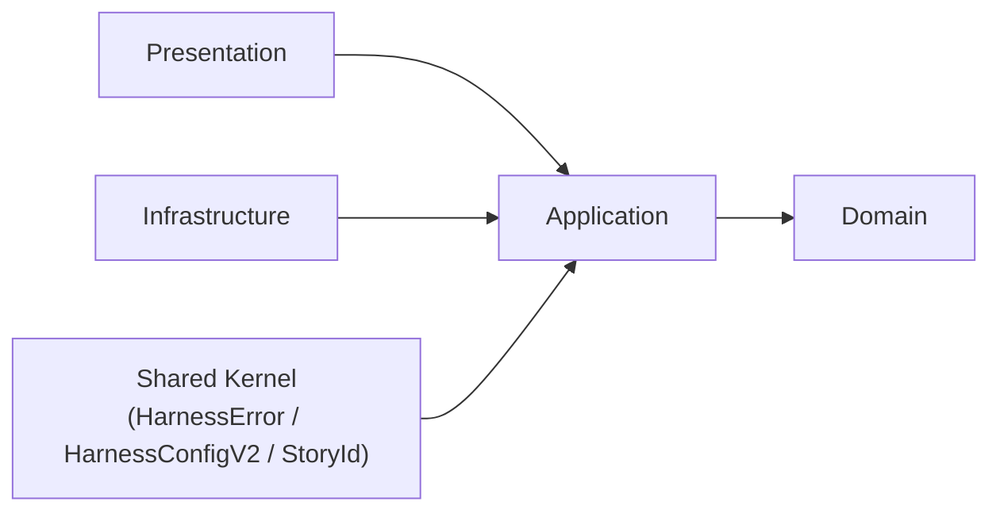
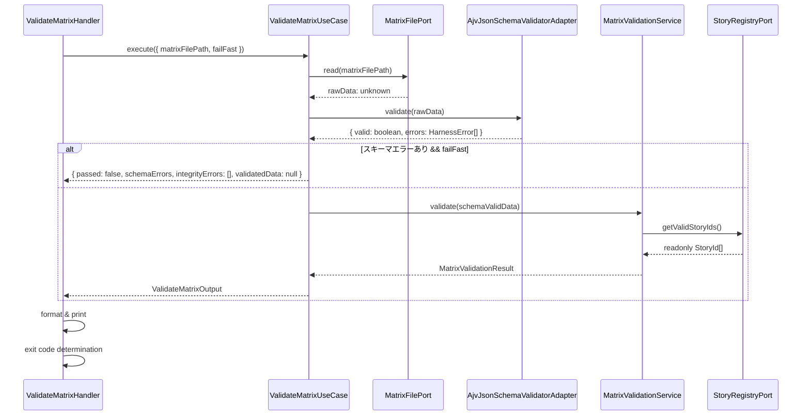
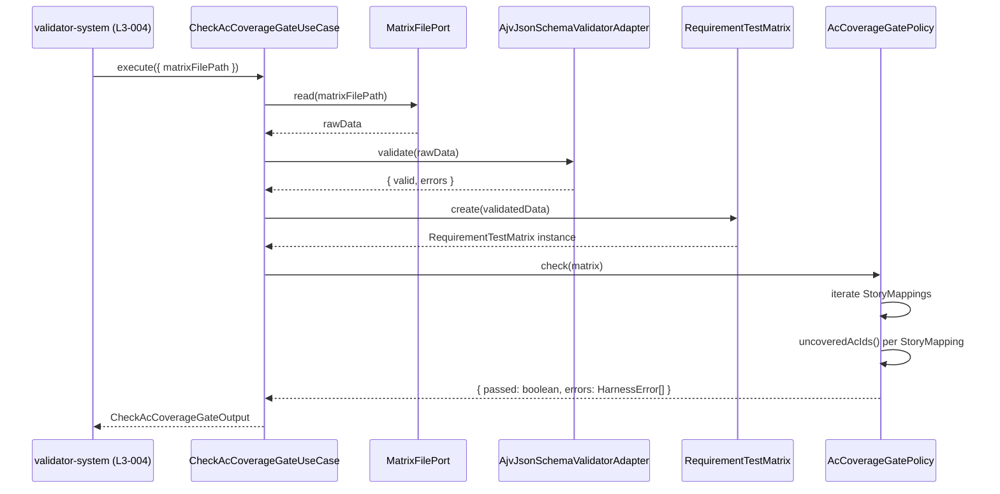
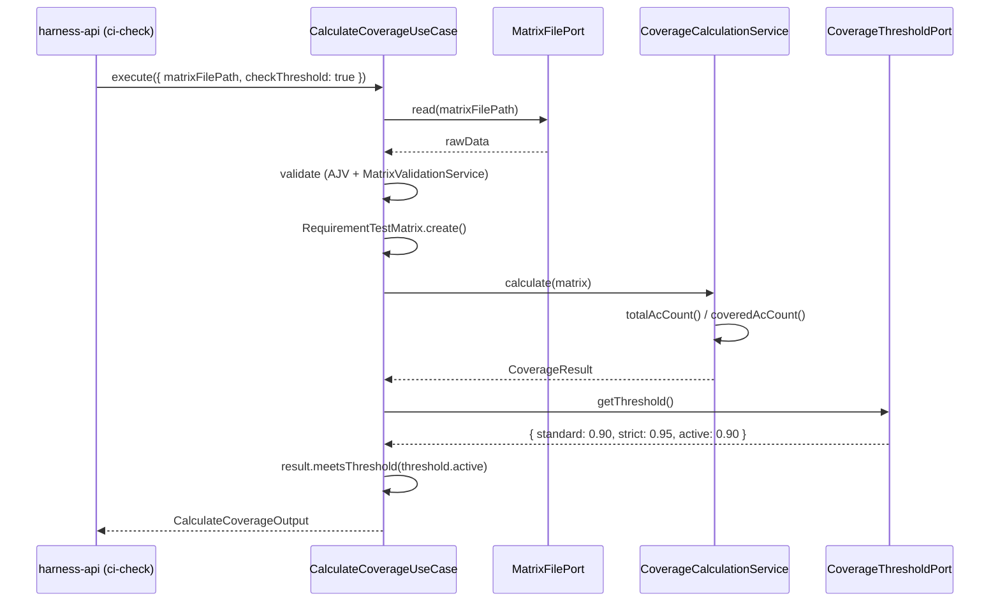
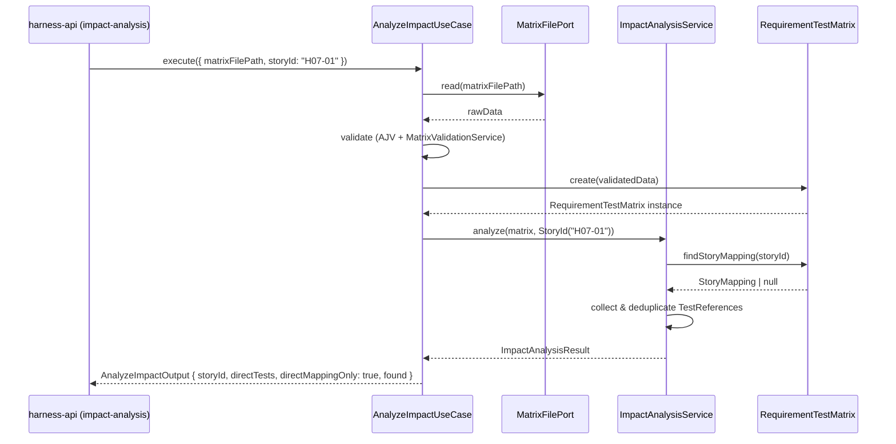

# 論理設計: nyquist-validation

@story-id H07-01
@story-id H07-02
@story-id H07-03
@story-id H07-04
> **Unit ID**: nyquist-validation
> **作成日**: 2026-03-19
> **対応ストーリー**: H07-01, H07-02, H07-03, H07-04
> **モード**: Unit横断設計（Phase 2）
> **前提ドキュメント**:
> - `docs/product/construction/nyquist-validation/domain_model.md`
> - `docs/product/units/integration_contract.md`
> - `docs/inception/_shared/cross_cutting_decisions.md`
> - `docs/principles/architecture-philosophy.md`
> - `docs/product/construction/harness-error/logical_design.md`（フォーマット参照）

---

## 1. アーキテクチャ概要

### 1.1 層構成と責務

| 層 | 責務 | 主な構成要素 | 依存先 |
|----|------|-------------|--------|
| Domain | `RequirementTestMatrix` 集約の不変条件管理、`StoryMapping`/`AcMapping`/`TestReference` の値検証、AC網羅率算出ロジック、テストケース逆引きロジック、AC網羅ゲート判定ポリシー、matrixバリデーションサービス | 集約、エンティティ、値オブジェクト、ドメインサービス、ドメインポート | なし（Shared Kernel型のみ消費） |
| Application | ユースケース調停、Domain モデルから公開契約 DTO への投影、JSONスキーマバリデーション指示、外部コンシューマーへの ImpactAnalysisResult / CoverageResult の生成 | UseCase、DTO、Mapper | Domain |
| Infrastructure | Domainポート実装、requirement-test-matrix.json ファイルI/O、StoryRegistryPort（traceability-model アダプタ）、CoverageThresholdPort（config-foundation アダプタ）、JSONスキーマバリデーション実行 | Adapter、SchemaValidator | Application, Domain |
| Presentation | CLIハンドラー、出力フォーマット選択、終了コード決定。`harness-api` / `phasegate:ci-check` / `phasegate:impact-analysis` コマンドから呼ばれる薄い境界 | CLI handler、formatter | Application, Domain |

### 1.2 依存方向

`cross_cutting_decisions.md §2` と `integration_contract.md` の正規語彙に合わせ、依存方向は以下に固定する。



```text
domain <- application <- infrastructure
domain <- application <- presentation
```

- Domain 層は外部 I/O に依存しない
- Application 層は Domain モデルの調停に徹し、I/O 実装を持たない
- Infrastructure 層は `domain/ports/` のみを実装し、CLIロジックを持たない
- Presentation 層は Application 層経由でのみ Domain を利用する
- Shared Kernel（`HarnessError`, `HarnessConfigV2`, `StoryId`）は Application 層で消費する。Domain 内部では値オブジェクト変換を経由する

### 1.3 ディレクトリ構成（全ファイル一覧）

Wave 2 の nyquist-validation 実装は `scripts/harness/nyquist-validation/` 配下に4層で配置し、他Unitへ公開する契約インターフェースは `scripts/harness/shared-kernel/nyquist-validation.ts` へ再エクスポートする。また、requirement-test-matrix.jsonのJSONスキーマは `docs/contracts/requirement-test-matrix.schema.json` に配置する。

```text
scripts/harness/
├── shared-kernel/
│   └── nyquist-validation.ts          # 公開契約エクスポート（AcCoverageGatePolicy, ImpactAnalysisResult等）
└── nyquist-validation/
    ├── domain/
    │   ├── aggregates/
    │   │   └── requirement-test-matrix.ts          # 集約ルート
    │   ├── entities/
    │   │   └── story-mapping.ts                    # ストーリー単位エンティティ
    │   ├── value-objects/
    │   │   ├── ac-mapping.ts                       # AC ID → TestReference[]
    │   │   ├── test-reference.ts                   # ファイルパス + テスト種別
    │   │   ├── coverage-result.ts                  # AC網羅率算出結果
    │   │   └── impact-analysis-result.ts           # テストケース逆引き結果
    │   ├── services/
    │   │   ├── ac-coverage-gate-policy.ts          # ACマッピング完了判定ロジック
    │   │   ├── matrix-validation-service.ts        # JSONスキーマ＋storyId整合性確認
    │   │   ├── coverage-calculation-service.ts     # AC網羅率算出
    │   │   └── impact-analysis-service.ts          # テストケース逆引き
    │   ├── errors/
    │   │   ├── nyquist-domain-error.ts             # ドメイン基底エラー
    │   │   ├── invalid-ac-id-format-error.ts       # AC-{n}形式違反
    │   │   ├── duplicate-story-mapping-error.ts    # storyId重複
    │   │   ├── invalid-test-type-error.ts          # testType形式違反
    │   │   ├── empty-file-path-error.ts            # filePath空文字
    │   │   ├── story-not-found-error.ts            # storyId未検出
    │   │   └── matrix-validation-failed-error.ts  # スキーマバリデーション失敗
    │   └── ports/
    │       ├── matrix-file-port.ts                 # ファイルI/Oポート
    │       ├── story-registry-port.ts              # StoryId一覧取得ポート
    │       └── coverage-threshold-port.ts          # 閾値設定取得ポート
    ├── application/
    │   ├── dto/
    │   │   ├── validate-matrix-input.ts            # H07-01入力
    │   │   ├── validate-matrix-output.ts           # H07-01出力
    │   │   ├── check-ac-coverage-gate-input.ts     # H07-02入力
    │   │   ├── check-ac-coverage-gate-output.ts    # H07-02出力
    │   │   ├── calculate-coverage-input.ts         # H07-03入力
    │   │   ├── calculate-coverage-output.ts        # H07-03出力
    │   │   ├── analyze-impact-input.ts             # H07-04入力
    │   │   └── analyze-impact-output.ts            # H07-04出力
    │   ├── mappers/
    │   │   ├── coverage-result-mapper.ts           # CoverageResult → DTO
    │   │   └── impact-analysis-result-mapper.ts    # ImpactAnalysisResult → DTO
    │   └── usecases/
    │       ├── validate-matrix-usecase.ts          # H07-01: スキーマ＋整合性バリデーション
    │       ├── check-ac-coverage-gate-usecase.ts   # H07-02: AcCoverageGatePolicyチェック
    │       ├── calculate-coverage-usecase.ts       # H07-03: AC網羅率算出
    │       └── analyze-impact-usecase.ts           # H07-04: 直接テストケース逆引き
    ├── infrastructure/
    │   ├── adapters/
    │   │   ├── file-system-matrix-file-adapter.ts          # MatrixFilePort実装
    │   │   ├── traceability-model-story-registry-adapter.ts # StoryRegistryPort実装
    │   │   ├── config-foundation-coverage-threshold-adapter.ts # CoverageThresholdPort実装
    │   │   └── ajv-json-schema-validator-adapter.ts        # JSONスキーマバリデーション
    │   └── schema/
    │       └── matrix-schema-loader.ts                     # docs/contracts/requirement-test-matrix.schema.json ロード
    └── presentation/
        ├── dto/
        │   └── cli-render-options.ts
        ├── formatters/
        │   ├── human-matrix-formatter.ts                   # 開発者向けコンソール表示
        │   ├── agent-matrix-formatter.ts                   # AIエージェント向け詳細テキスト
        │   └── json-matrix-formatter.ts                    # JSON出力（CI用）
        └── handlers/
            ├── validate-matrix-handler.ts                  # matrix.json バリデーション
            ├── check-ac-coverage-gate-handler.ts           # ACカバレッジゲート判定
            ├── calculate-coverage-handler.ts               # 網羅率算出（phasegate:ci-check用）
            └── analyze-impact-handler.ts                   # テスト逆引き（phasegate:impact-analysis用）
```

**JSONスキーマ配置（外部参照用）**

```text
docs/contracts/
└── requirement-test-matrix.schema.json   # requirement-test-matrix.jsonのJSONスキーマ（外部参照用）
```

### 1.4 他Unitとの接続方針

- `traceability-model` の `StoryId` は Shared Kernel として Application 層で消費する。`StoryRegistryPort` 経由で有効 storyId 一覧を取得する
- `harness-error` の `HarnessError` はバリデーションエラーの出力フォーマットとして Application 層で使用する
- `config-foundation` の `HarnessConfigV2` から `coverageThreshold` 設定を取得する。`CoverageThresholdPort` が抽象化境界として機能する
- `validator-system` の L3-004（nyquist バリデータ）は `AcCoverageGatePolicy` インターフェースを呼び出す。このインターフェースは `shared-kernel/nyquist-validation.ts` から公開する
- `harness-api` の `phasegate:impact-analysis <HXX-XX>` コマンドは `ImpactAnalysisResult` 契約を消費する

---

## 2. Domain層設計

### 2.1 集約ルート: RequirementTestMatrix

`domain_model.md` の結論どおり、`RequirementTestMatrix` を集約ルートとして採用する。requirement-test-matrix.json というI/O境界・StoryMapping エンティティの整合性保証・ストーリー実装ごとの変更ライフサイクルの3点から集約ルートが適切と判断した（D1参照）。

#### 属性一覧

| 属性 | 型 | 説明 | 必須 |
|------|----|------|------|
| storyMappings | `readonly StoryMapping[]` | 内包するストーリーマッピング一覧 | Yes |

#### メソッド一覧

##### `static create(data: ValidatedMatrixData): RequirementTestMatrix`

- 入力: JSONスキーマ検証済みの生データ
- 出力: `RequirementTestMatrix`
- 処理フロー:
  1. `data.storyMappings` を `StoryMapping.create()` で変換する
  2. storyId の一意性（INV-1）を検証する。重複があれば `DuplicateStoryMappingError`
  3. 各 `StoryMapping` 内の `AcMapping` の `acId` 形式（INV-2）を検証する
  4. 全 `TestReference.testType` が `unit | it | scenario`（INV-3）であることを確認する
  5. 全 `TestReference.filePath` が空文字でない（INV-4）ことを確認する
  6. `Object.freeze()` で凍結し返却する
- 例外:
  - `DuplicateStoryMappingError`
  - `InvalidAcIdFormatError`
  - `InvalidTestTypeError`
  - `EmptyFilePathError`
- 不変条件: INV-1〜INV-4 をすべて満たすこと

##### `findStoryMapping(storyId: StoryId): StoryMapping | null`

- 入力: `storyId: StoryId`
- 出力: `StoryMapping | null`
- 処理フロー: 内部配列から storyId が一致する StoryMapping を返す。不在の場合は `null`
- 例外: なし
- 不変条件: storyId が一致するものは集約内に高々1件

##### `getAllStoryMappings(): readonly StoryMapping[]`

- 入力: なし
- 出力: `readonly StoryMapping[]`
- 処理フロー: 内部配列を storyId 昇順で返す
- 例外: なし
- 不変条件: 呼び出し側から変更できない readonly 配列を返す

##### `totalAcCount(): number`

- 入力: なし
- 出力: `number`
- 処理フロー: 全 `StoryMapping` の `AcMapping` 数を合計して返す
- 例外: なし

##### `coveredAcCount(): number`

- 入力: なし
- 出力: `number`
- 処理フロー: 全 `StoryMapping` の `AcMapping` のうち `testReferences.length > 0` のものを数える
- 例外: なし

### 2.2 エンティティ: StoryMapping

#### 属性一覧

| 属性 | 型 | 説明 | 必須 |
|------|----|------|------|
| storyId | `StoryId` | ストーリー識別子（Shared Kernel） | Yes |
| acMappings | `readonly AcMapping[]` | AC単位のテスト参照マッピング一覧 | Yes |

#### メソッド一覧

##### `static create(data: { storyId: string; acMappings: RawAcMapping[] }): StoryMapping`

- 入力: 生JSONデータ
- 出力: `StoryMapping`
- 処理フロー:
  1. `StoryId.create(data.storyId)` で VO 化する
  2. `data.acMappings` を `AcMapping.create()` で変換する
  3. `acId` の形式（`AC-{n}` 正規表現）を検証する
  4. `Object.freeze()` で凍結する
- 例外:
  - `InvalidAcIdFormatError`
  - `InvalidTestTypeError`
  - `EmptyFilePathError`

##### `findAcMapping(acId: string): AcMapping | null`

- 入力: `acId: string`
- 出力: `AcMapping | null`
- 処理フロー: 内部配列から acId が一致する AcMapping を返す
- 例外: なし

##### `uncoveredAcIds(): readonly string[]`

- 入力: なし
- 出力: `readonly string[]`
- 処理フロー: `testReferences.length === 0` の `AcMapping` の `acId` 一覧を返す
- 例外: なし

##### `equals(other: StoryMapping): boolean`

- 入力: `other: StoryMapping`
- 出力: `boolean`
- 処理フロー: `storyId` の値比較。storyId が等しければ同一エンティティ
- 例外: なし

### 2.3 値オブジェクト群

#### 2.3.1 AcMapping

| 属性 | 型 | 説明 |
|------|----|------|
| acId | `string` | `AC-{n}` 形式（n は1以上の正整数） |
| testReferences | `readonly TestReference[]` | このACに紐づくテスト参照一覧 |

**生成ルール**

- 正規表現 `^AC-[1-9][0-9]*$` に一致すること。ゼロパディング不可
- `cross_cutting_decisions.md §1` に従い、`HXX-XX.AC-N` の複合識別子で一意に特定可能

**メソッド**

- `static create(raw: { acId: string; testReferences: RawTestReference[] }): AcMapping`
- `isCovered(): boolean` — `testReferences.length > 0`
- `equals(other: AcMapping): boolean`
- `toString(): string`

**バリデーションルール**

- `AC-0` や `AC-01` などゼロパディングは `InvalidAcIdFormatError`
- `testReferences` は空配列を許容する（未カバー状態を表現するため）

#### 2.3.2 TestReference

| 属性 | 型 | 説明 |
|------|----|------|
| filePath | `string` | テストファイルの相対パス。空文字不可 |
| testType | `'unit' \| 'it' \| 'scenario'` | テスト種別 |

**生成ルール**

- `filePath` は trim 後に空文字でないこと
- `testType` は `unit | it | scenario` の3値のみ

**メソッド**

- `static create(raw: { filePath: string; testType: string }): TestReference`
- `equals(other: TestReference): boolean`
- `toString(): string`

**バリデーションルール**

- `filePath` が空文字の場合は `EmptyFilePathError`
- `testType` が3値以外の場合は `InvalidTestTypeError`
- ファイルの実在確認は Domain 層では行わない（Infrastructure 層の責務）

#### 2.3.3 CoverageResult

| 属性 | 型 | 説明 |
|------|----|------|
| coveredAcCount | `number` | カバー済みAC数（testReferences.length > 0 のもの） |
| totalAcCount | `number` | 全AC数（全StoryMappingの集計） |
| rate | `number` | 網羅率（0.0〜1.0。coveredAcCount / totalAcCount） |
| uncoveredAcIds | `readonly string[]` | 未カバーACの識別子一覧 |

**生成ルール**

- `totalAcCount === 0` の場合は `rate = 1.0`（全AC網羅済みとみなす）
- `rate` は小数点以下4桁で保持する（パーセンテージ表示は Presentation 層の責務）

**メソッド**

- `static calculate(matrix: RequirementTestMatrix): CoverageResult`
- `meetsThreshold(threshold: number): boolean` — `rate >= threshold`
- `equals(other: CoverageResult): boolean`
- `toPercentage(): number` — `Math.floor(rate * 10000) / 100` でパーセンテージ化

**バリデーションルール**

- `rate` は 0.0〜1.0 の範囲外を設定不可
- `coveredAcCount > totalAcCount` は構築禁止

#### 2.3.4 ImpactAnalysisResult

| 属性 | 型 | 説明 |
|------|----|------|
| storyId | `StoryId` | 対象ストーリー識別子（Shared Kernel） |
| directTests | `readonly TestReference[]` | 直接マッピングされたテスト参照一覧 |
| directMappingOnly | `true` | v1は直接マッピングのみを返すことを型で表明するフラグ |

**生成ルール**

- `directMappingOnly` は常に `true`（型レベルで固定値）
- `directTests` は重複なしの一覧（同一ファイルパスの重複を除去する）

**メソッド**

- `static create(storyId: StoryId, directTests: readonly TestReference[]): ImpactAnalysisResult`
- `isEmpty(): boolean` — `directTests.length === 0`
- `equals(other: ImpactAnalysisResult): boolean`

**バリデーションルール**

- `storyId` は必須。null / undefined 不可
- 間接影響分析（依存要素を介した波及）は v1 スコープ外（D4参照）

### 2.4 ドメインサービス

#### 2.4.1 AcCoverageGatePolicy

**責務**: RequirementTestMatrix を受け取り、全ACがテスト参照を持つかを判定する。validator-system の L3-004（nyquist バリデータ）が実行主体として呼び出す公開ポリシー。

**コンストラクタ依存**: なし（純粋なドメインロジック）

##### `check(matrix: RequirementTestMatrix): { passed: boolean; errors: HarnessError[] }`

- 入力: `matrix: RequirementTestMatrix`
- 出力: `{ passed: boolean; errors: HarnessError[] }`
- 処理フロー:
  1. `matrix.getAllStoryMappings()` で全 StoryMapping を取得する
  2. 各 StoryMapping の `uncoveredAcIds()` を呼び出す
  3. 未カバー AC が0件なら `{ passed: true, errors: [] }` を返す
  4. 未カバー AC が1件以上ある場合、各 AC につき HarnessError（code: `L3-004`、severity: `error`）を生成する
  5. `{ passed: false, errors: [...] }` を返す
- 例外: なし（失敗は `errors` 配列で表現する）
- 不変条件: `passed=true` のとき `errors` は空配列

**公開インターフェース**（`shared-kernel/nyquist-validation.ts` にエクスポート）

```typescript
export interface AcCoverageGatePolicy {
  check(matrix: RequirementTestMatrix): { passed: boolean; errors: HarnessError[] };
}
```

#### 2.4.2 MatrixValidationService

**責務**: requirement-test-matrix.json の JSONスキーマバリデーションと、`StoryRegistryPort` から取得した有効 storyId 一覧との整合性確認。@story アノテーション整合性は validator-system の L2-002 に委ねる（D5参照）。

**コンストラクタ依存**

- `storyRegistryPort: StoryRegistryPort`

##### `validate(rawData: unknown): Promise<MatrixValidationResult>`

- 入力: JSON ファイルから読み込んだ生データ
- 出力: `Promise<MatrixValidationResult>`
- 処理フロー:
  1. `rawData` の型構造を検証する（JSONスキーマ適合確認は Application 層の AjvJsonSchemaValidatorAdapter が担当。本サービスは Schema 適合済みデータを受け取る想定）
  2. `storyRegistryPort.getValidStoryIds()` で有効 storyId 一覧を取得する
  3. `rawData.storyMappings` 内の各 `storyId` が有効 storyId 一覧に含まれるかを確認する
  4. 不正な storyId があれば `HarnessError[]`（code: `L3-004`）に変換する
  5. 全件正常なら `{ passed: true, errors: [], validatedData: rawData }` を返す
  6. エラーがあれば `{ passed: false, errors: [...], validatedData: null }` を返す
- 例外:
  - `StoryRegistryPort` の I/O 失敗時はポート例外を上位へ伝播する
- 不変条件: `passed=true` のとき `validatedData` は非 null

##### `MatrixValidationResult`

```typescript
type MatrixValidationResult =
  | { passed: true; errors: []; validatedData: ValidatedMatrixData }
  | { passed: false; errors: HarnessError[]; validatedData: null };
```

#### 2.4.3 CoverageCalculationService

**責務**: `RequirementTestMatrix` から `CoverageResult` を算出する。コードカバレッジ閾値（90%/95%）との対比は validator-system の L3-003 が担当（D2参照）。

**コンストラクタ依存**: なし（純粋な算出ロジック）

##### `calculate(matrix: RequirementTestMatrix): CoverageResult`

- 入力: `matrix: RequirementTestMatrix`
- 出力: `CoverageResult`
- 処理フロー:
  1. `matrix.totalAcCount()` で全AC数を取得する
  2. `matrix.coveredAcCount()` でカバー済みAC数を取得する
  3. `totalAcCount === 0` の場合は `rate = 1.0`
  4. `uncoveredAcIds` を収集する（全 StoryMapping の `uncoveredAcIds()` を結合）
  5. `CoverageResult` を構築して返す
- 例外: なし
- 不変条件: `rate` は 0.0〜1.0 の範囲内

#### 2.4.4 ImpactAnalysisService

**責務**: 指定された storyId に対して requirement-test-matrix.json に直接マッピングされた TestReference[] を逆引きする。v1 では直接マッピングのみ（D4参照）。

**コンストラクタ依存**: なし（純粋な逆引きロジック）

##### `analyze(matrix: RequirementTestMatrix, storyId: StoryId): ImpactAnalysisResult`

- 入力: `matrix: RequirementTestMatrix`, `storyId: StoryId`
- 出力: `ImpactAnalysisResult`
- 処理フロー:
  1. `matrix.findStoryMapping(storyId)` で StoryMapping を検索する
  2. 存在しない場合は `ImpactAnalysisResult.create(storyId, [])` を返す（空結果）
  3. 存在する場合は全 AcMapping の testReferences を結合する
  4. filePath 単位で重複を除去する
  5. `ImpactAnalysisResult.create(storyId, deduplicatedTests)` を返す
- 例外: なし（storyId 未検出は空結果で表現する）
- 不変条件: `directMappingOnly` は常に `true`

### 2.5 ドメインエラー一覧

| エラークラス | 基底クラス | 発生条件 |
|------------|-----------|---------|
| `NyquistDomainError` | `Error` | ドメインエラーの基底。直接使用しない |
| `InvalidAcIdFormatError` | `NyquistDomainError` | `AC-{n}` 形式違反（`AC-0`, `AC-01`, `AC-` 等） |
| `DuplicateStoryMappingError` | `NyquistDomainError` | 集約内に同一 storyId の StoryMapping が2件以上 |
| `InvalidTestTypeError` | `NyquistDomainError` | `testType` が `unit \| it \| scenario` 以外 |
| `EmptyFilePathError` | `NyquistDomainError` | `filePath` が空文字または空白のみ |
| `StoryNotFoundError` | `NyquistDomainError` | ストーリー未検出（ImpactAnalysisService 経由での強制取得時） |
| `MatrixValidationFailedError` | `NyquistDomainError` | JSONスキーマバリデーション失敗 |

---

## 3. Domain層ポート設計

ポートは全て `scripts/harness/nyquist-validation/domain/ports/` に定義し、Infrastructure 層が実装する。

### 3.1 MatrixFilePort

```typescript
export interface MatrixFilePort {
  read(filePath: string): Promise<unknown>;
  write(filePath: string, data: ValidatedMatrixData): Promise<void>;
}
```

| メソッド | 入力 | 出力 | 説明 |
|---------|------|------|------|
| `read` | `filePath: string` | `Promise<unknown>` | requirement-test-matrix.json を読み込み、JSONパース済みの生データを返す |
| `write` | `filePath: string`, `data: ValidatedMatrixData` | `Promise<void>` | バリデーション済みデータを requirement-test-matrix.json へ書き込む |

### 3.2 StoryRegistryPort

```typescript
export interface StoryRegistryPort {
  getValidStoryIds(): Promise<readonly StoryId[]>;
}
```

| メソッド | 入力 | 出力 | 説明 |
|---------|------|------|------|
| `getValidStoryIds` | なし | `Promise<readonly StoryId[]>` | traceability-model から有効なStoryIdの一覧を取得する |

### 3.3 CoverageThresholdPort

```typescript
export interface CoverageThresholdPort {
  getThreshold(): Promise<{ standard: number; strict: number; active: number }>;
}
```

| メソッド | 入力 | 出力 | 説明 |
|---------|------|------|------|
| `getThreshold` | なし | `Promise<{ standard: number; strict: number; active: number }>` | `HarnessConfigV2` から coverageThreshold 設定を取得する。`standard=0.90`, `strict=0.95`。`active` は現在の preset に応じた実効閾値 |

### 3.4 ポート設計上のルール

- Port の戻り値は Domain が理解できる値オブジェクトかプリミティブに限定する
- Port は実装の詳細（ファイルシステム API、traceability-model の内部構造）を露出しない
- `StoryRegistryPort` は `StoryId` 型を返す。文字列配列ではなく型安全な Shared Kernel 型を使用する

---

## 4. Application層設計

### 4.1 DTO / Mapper方針

| 要素 | 役割 |
|------|------|
| `ValidateMatrixInput` / `ValidateMatrixOutput` | H07-01: matrixファイルパスと検証結果 |
| `CheckAcCoverageGateInput` / `CheckAcCoverageGateOutput` | H07-02: AcCoverageGatePolicy の呼び出しと結果 |
| `CalculateCoverageInput` / `CalculateCoverageOutput` | H07-03: 網羅率算出と CoverageResult の公開 DTO |
| `AnalyzeImpactInput` / `AnalyzeImpactOutput` | H07-04: storyId と ImpactAnalysisResult の公開 DTO |
| `CoverageResultMapper` | `CoverageResult` を `CalculateCoverageOutput` に投影 |
| `ImpactAnalysisResultMapper` | `ImpactAnalysisResult` を `AnalyzeImpactOutput` に投影 |

Domain モデルは内部 VO を維持し、他 Unit へ直接露出しない。公開 DTO は Application 層でのみ生成する。

### 4.2 ValidateMatrixUseCase（H07-01）

**責務**: requirement-test-matrix.json の JSONスキーマバリデーションと storyId 整合性確認を行い、バリデーション結果を返す。

**コンストラクタ依存**

- `matrixFilePort: MatrixFilePort`
- `matrixValidationService: MatrixValidationService`
- `ajvValidator: AjvJsonSchemaValidatorAdapter`（Infrastructureアダプタ。ポートを介して注入）

**入力**

`ValidateMatrixInput`

| 項目 | 型 | 必須 | 説明 |
|------|----|------|------|
| matrixFilePath | `string` | Yes | requirement-test-matrix.json のファイルパス |
| failFast | `boolean` | No | 最初のエラーで打ち切るかどうか。既定は `false` |

**出力**

`ValidateMatrixOutput`

| 項目 | 型 | 説明 |
|------|----|------|
| passed | `boolean` | バリデーション総合成否 |
| errors | `readonly HarnessError[]` | 検出されたバリデーションエラー |
| schemaErrors | `readonly HarnessError[]` | JSONスキーマ違反のみ抽出 |
| integrityErrors | `readonly HarnessError[]` | storyId整合性違反のみ抽出 |
| validatedData | `ValidatedMatrixData \| null` | 検証済みデータ（`passed=true` 時のみ非 null） |

**処理フロー**

1. `matrixFilePort.read(input.matrixFilePath)` で生データを読み込む
2. `ajvValidator.validate(rawData)` で JSONスキーマバリデーションを実行する
3. スキーマ違反がある場合、`HarnessError[]` に変換して `schemaErrors` に格納する
4. `input.failFast=true` かつスキーマエラーがある場合は即時 `{ passed: false, errors, schemaErrors, integrityErrors: [], validatedData: null }` を返す
5. スキーマ適合データを `matrixValidationService.validate()` に渡し storyId 整合性を確認する
6. 整合性エラーがある場合は `integrityErrors` に格納する
7. `schemaErrors` と `integrityErrors` を結合して `errors` とする
8. `errors.length === 0` なら `passed=true`、それ以外は `false`
9. 結果を `ValidateMatrixOutput` として返す

**例外**

- `matrixFilePort.read()` でのI/Oエラー（ファイル不在、パース失敗）
- `storyRegistryPort.getValidStoryIds()` での外部エラー

### 4.3 CheckAcCoverageGateUseCase（H07-02）

**責務**: `AcCoverageGatePolicy` を呼び出し、AC網羅ゲートの通過/不通過を判定する。validator-system の L3-004 が呼び出すユースケース。

**コンストラクタ依存**

- `matrixFilePort: MatrixFilePort`
- `ajvValidator: AjvJsonSchemaValidatorAdapter`
- `matrixValidationService: MatrixValidationService`
- `acCoverageGatePolicy: AcCoverageGatePolicy`

**入力**

`CheckAcCoverageGateInput`

| 項目 | 型 | 必須 | 説明 |
|------|----|------|------|
| matrixFilePath | `string` | Yes | requirement-test-matrix.json のファイルパス |

**出力**

`CheckAcCoverageGateOutput`

| 項目 | 型 | 説明 |
|------|----|------|
| passed | `boolean` | AC網羅ゲート通過有無 |
| errors | `readonly HarnessError[]` | 未カバーACのHarnessError一覧 |
| matrix | `RequirementTestMatrix` | 構築された集約インスタンス（デバッグ用参照） |

**処理フロー**

1. `matrixFilePort.read(input.matrixFilePath)` で生データを読み込む
2. `ajvValidator.validate(rawData)` で JSONスキーマを確認する（スキーマ違反は即 `passed=false`）
3. `matrixValidationService.validate(schemaValidData)` で storyId 整合性を確認する（整合性エラーは即 `passed=false`）
4. `RequirementTestMatrix.create(validatedData)` で集約を構築する
5. `acCoverageGatePolicy.check(matrix)` を呼び出す
6. 結果を `CheckAcCoverageGateOutput` に投影して返す

**例外**

- I/O 失敗、スキーマパース失敗
- `RequirementTestMatrix.create()` の不変条件違反（INV-1〜INV-4）

### 4.4 CalculateCoverageUseCase（H07-03）

**責務**: `CoverageCalculationService` によるAC網羅率算出。`phasegate:ci-check` コマンドが利用する。

**コンストラクタ依存**

- `matrixFilePort: MatrixFilePort`
- `ajvValidator: AjvJsonSchemaValidatorAdapter`
- `matrixValidationService: MatrixValidationService`
- `coverageCalculationService: CoverageCalculationService`
- `coverageThresholdPort: CoverageThresholdPort`

**入力**

`CalculateCoverageInput`

| 項目 | 型 | 必須 | 説明 |
|------|----|------|------|
| matrixFilePath | `string` | Yes | requirement-test-matrix.json のファイルパス |
| checkThreshold | `boolean` | No | 閾値チェックを行うか。既定は `false` |

**出力**

`CalculateCoverageOutput`

| 項目 | 型 | 説明 |
|------|----|------|
| coveredAcCount | `number` | カバー済みAC数 |
| totalAcCount | `number` | 全AC数 |
| ratePercent | `number` | 網羅率（パーセンテージ表示、小数点以下2桁） |
| uncoveredAcIds | `readonly string[]` | 未カバーACのID一覧 |
| threshold | `number \| null` | 適用された閾値（`checkThreshold=true` の場合のみ非 null） |
| meetsThreshold | `boolean \| null` | 閾値充足有無（`checkThreshold=true` の場合のみ非 null） |

**処理フロー**

1. `matrixFilePort.read()` → `ajvValidator.validate()` → `matrixValidationService.validate()` → `RequirementTestMatrix.create()` の順に実行する
2. `coverageCalculationService.calculate(matrix)` で `CoverageResult` を算出する
3. `input.checkThreshold=true` の場合は `coverageThresholdPort.getThreshold()` で閾値を取得し、`result.meetsThreshold(threshold.active)` を評価する
4. `CoverageResultMapper.toOutput(result, threshold)` で DTO に投影して返す

**例外**

- I/O失敗、スキーマ違反、不変条件違反
- `coverageThresholdPort.getThreshold()` の設定読み込み失敗

### 4.5 AnalyzeImpactUseCase（H07-04）

**責務**: `ImpactAnalysisService` による直接テストケース逆引き。`phasegate:impact-analysis <HXX-XX>` コマンドが利用する。

**コンストラクタ依存**

- `matrixFilePort: MatrixFilePort`
- `ajvValidator: AjvJsonSchemaValidatorAdapter`
- `matrixValidationService: MatrixValidationService`
- `impactAnalysisService: ImpactAnalysisService`

**入力**

`AnalyzeImpactInput`

| 項目 | 型 | 必須 | 説明 |
|------|----|------|------|
| matrixFilePath | `string` | Yes | requirement-test-matrix.json のファイルパス |
| storyId | `string` | Yes | 逆引き対象のストーリーID（HXX-XX形式） |

**出力**

`AnalyzeImpactOutput`

| 項目 | 型 | 説明 |
|------|----|------|
| storyId | `string` | 対象ストーリーID |
| directTests | `readonly TestReferenceDto[]` | 直接マッピングされたテスト参照 |
| directMappingOnly | `true` | v1は直接マッピングのみ（型レベルで固定） |
| found | `boolean` | storyId が matrix に存在するか |

**TestReferenceDto**

```typescript
interface TestReferenceDto {
  readonly filePath: string;
  readonly testType: 'unit' | 'it' | 'scenario';
}
```

**処理フロー**

1. `matrixFilePort.read()` → `ajvValidator.validate()` → `matrixValidationService.validate()` → `RequirementTestMatrix.create()` の順に実行する
2. `StoryId.create(input.storyId)` で VO 化する（書式違反は即エラー）
3. `impactAnalysisService.analyze(matrix, storyId)` で `ImpactAnalysisResult` を取得する
4. `ImpactAnalysisResultMapper.toOutput(result)` で DTO に投影して返す
5. `result.isEmpty()` の場合は `found=false` を設定する

**例外**

- I/O失敗、スキーマ違反、不変条件違反
- `storyId` の書式違反

---

## 5. Infrastructure層設計

### 5.1 FileSystemMatrixFileAdapter

**実装ポート**: `MatrixFilePort`

**ファイルパス**: `scripts/harness/nyquist-validation/infrastructure/adapters/file-system-matrix-file-adapter.ts`

**利用ライブラリ**

- `node:fs/promises`
- `node:path`

**実装方針**

- `fs.readFile()` でファイルを UTF-8 で読み込み、`JSON.parse()` でパースする
- JSON パース失敗は `MatrixValidationFailedError` にラップして上位へ伝播する
- `write()` は `JSON.stringify(data, null, 2)` + `fs.writeFile()` で書き込む
- ファイルパスは絶対パスを要求する。相対パスの解決はアダプタ呼び出し側の責務

### 5.2 TraceabilityModelStoryRegistryAdapter

**実装ポート**: `StoryRegistryPort`

**ファイルパス**: `scripts/harness/nyquist-validation/infrastructure/adapters/traceability-model-story-registry-adapter.ts`

**利用モジュール**

- `scripts/harness/shared-kernel/traceability-model.ts`（traceability-model Unit の公開面）

**実装方針**

- `traceability-model` の `StoryId` 一覧取得 API を呼び出す
- 取得した storyId 文字列配列を `StoryId.create()` でVO化して返す
- `traceability-model` の実装が未完成の Wave 2 初期は、`user_stories.md` をパースして storyId 一覧を取得するフォールバック実装を用意する

### 5.3 ConfigFoundationCoverageThresholdAdapter

**実装ポート**: `CoverageThresholdPort`

**ファイルパス**: `scripts/harness/nyquist-validation/infrastructure/adapters/config-foundation-coverage-threshold-adapter.ts`

**利用モジュール**

- `scripts/harness/shared-kernel/config-foundation.ts`（config-foundation Unit の公開面）

**実装方針**

- `HarnessConfigV2` から `layers.L3.coverageThreshold` を読み取る
- `project.preset` に応じて `active` 閾値を決定する（`standard=0.90`, `strict=0.95`, `minimal=0.80`）
- 設定ファイル読み込み失敗時はデフォルト値（`standard=0.90`）にフォールバックする

**設定マッピング**

| preset | active 閾値 |
|--------|------------|
| minimal | 0.80 |
| standard | 0.90 |
| strict | 0.95 |

### 5.4 AjvJsonSchemaValidatorAdapter

**役割**: `docs/contracts/requirement-test-matrix.schema.json` を使って Ajv でJSONスキーマバリデーションを実行する。

**ファイルパス**: `scripts/harness/nyquist-validation/infrastructure/adapters/ajv-json-schema-validator-adapter.ts`

**利用ライブラリ**

- `ajv ^10.0.0`（`integration_contract.md §1` の外部依存として確認済み）

**実装方針**

- `Ajv({ allErrors: true })` でインスタンスを生成し、全エラーを収集する
- スキーマは `matrix-schema-loader.ts` 経由で `docs/contracts/requirement-test-matrix.schema.json` を読み込む
- バリデーション失敗時は Ajv エラーを `HarnessError[]`（code: `L3-004`, severity: `error`）に変換する
- アダプタは Application UseCase から直接呼ばれる（ポートを介さない Infrastructure 内部実装として扱う）

**Ajv エラー → HarnessError 変換ルール**

| Ajv keyword | HarnessError.message パターン |
|-------------|------------------------------|
| `required` | `storyMappings[{n}].acMappings[{m}].acId が必須フィールドです` |
| `type` | `{field} の型が不正です。期待: {expected}` |
| `pattern` | `{field} の値 '{value}' が形式 '{pattern}' に一致しません` |
| `enum` | `{field} の値 '{value}' は許容値（{enum}）のいずれでもありません` |

### 5.5 MatrixSchemaLoader

**ファイルパス**: `scripts/harness/nyquist-validation/infrastructure/schema/matrix-schema-loader.ts`

**役割**: `docs/contracts/requirement-test-matrix.schema.json` をロードし、Ajv に渡せる形式で提供する。

**実装方針**

- `fs.readFile()` + `JSON.parse()` でスキーマを読み込む
- スキーマファイルの絶対パスは `node:path` + `__dirname` で解決する
- スキーマは起動時に1回だけロードし、以降はキャッシュを返す（シングルトンパターン）

---

## 6. Presentation層設計

### 6.1 前提

nyquist-validation は `integration_contract.md §3.1` にあるトップレベル CLI コマンドの直接所有者ではない。`phasegate:ci-check` と `phasegate:impact-analysis` は `harness-api` が所有し、本 Unit の Presentation 層はその内部から呼ばれる CLI handler / formatter を提供する。

### 6.2 ValidateMatrixHandler

**ファイル**: `scripts/harness/nyquist-validation/presentation/handlers/validate-matrix-handler.ts`

**役割**: H07-01 対応。requirement-test-matrix.json のバリデーションを単独で実行し、結果を表示する。CI 手動検証・開発者デバッグ用。

**引数**

| 引数 | 必須 | 説明 |
|------|------|------|
| `--matrix-file <path>` | Yes | requirement-test-matrix.json のパス |
| `--fail-fast` | No | 最初のエラーで打ち切る |
| `--format <human\|json>` | No | 出力形式。既定は `human` |

**処理**

1. `ValidateMatrixUseCase.execute(input)` を呼ぶ
2. エラー一覧をフォーマッターで整形して stdout へ出力する
3. 終了コードを決定する

**終了コード**

| コード | 意味 |
|--------|------|
| 0 | バリデーション成功 |
| 1 | バリデーションエラーあり |
| 2 | ファイルI/Oエラー、実行環境エラー |

### 6.3 CheckAcCoverageGateHandler

**ファイル**: `scripts/harness/nyquist-validation/presentation/handlers/check-ac-coverage-gate-handler.ts`

**役割**: H07-02 対応。validator-system の L3-004 が内部的に呼び出すハンドラー。AC網羅ゲート判定結果を構造化して返す。

**引数**

| 引数 | 必須 | 説明 |
|------|------|------|
| `--matrix-file <path>` | Yes | requirement-test-matrix.json のパス |
| `--format <human\|json>` | No | 出力形式。既定は `json`（CI連携のため） |

**処理**

1. `CheckAcCoverageGateUseCase.execute(input)` を呼ぶ
2. 結果を `HarnessApiResponse` エンベロープでラップして出力する
3. 終了コードを決定する

**終了コード**

| コード | 意味 |
|--------|------|
| 0 | AC網羅ゲート通過（全ACにテスト参照あり） |
| 1 | AC網羅ゲート不通過（未カバーACあり） |
| 2 | 実行エラー |

### 6.4 CalculateCoverageHandler

**ファイル**: `scripts/harness/nyquist-validation/presentation/handlers/calculate-coverage-handler.ts`

**役割**: H07-03 対応。`phasegate:ci-check` コマンド内から AC 網羅率を算出して表示する。

**引数**

| 引数 | 必須 | 説明 |
|------|------|------|
| `--matrix-file <path>` | Yes | requirement-test-matrix.json のパス |
| `--check-threshold` | No | 閾値チェックを行う |
| `--format <human\|json>` | No | 出力形式。既定は `human` |

**処理**

1. `CalculateCoverageUseCase.execute(input)` を呼ぶ
2. 網羅率をフォーマッターで整形して stdout へ出力する
3. `--check-threshold` 指定かつ閾値未達の場合は終了コード 1

**終了コード**

| コード | 意味 |
|--------|------|
| 0 | 算出成功（閾値チェックあり場合は閾値充足） |
| 1 | 閾値未達（`--check-threshold` 指定時のみ） |
| 2 | ファイルI/Oエラー、実行環境エラー |

### 6.5 AnalyzeImpactHandler

**ファイル**: `scripts/harness/nyquist-validation/presentation/handlers/analyze-impact-handler.ts`

**役割**: H07-04 対応。`phasegate:impact-analysis <HXX-XX>` コマンドの実行ロジックを担う。

**引数**

| 引数 | 必須 | 説明 |
|------|------|------|
| `--matrix-file <path>` | Yes | requirement-test-matrix.json のパス |
| `--story-id <HXX-XX>` | Yes | 逆引き対象のストーリーID |
| `--format <human\|json>` | No | 出力形式。既定は `human` |

**処理**

1. `AnalyzeImpactUseCase.execute(input)` を呼ぶ
2. テスト参照一覧をフォーマッターで整形して stdout へ出力する
3. `found=false`（storyId 未検出）の場合は終了コード 1

**終了コード**

| コード | 意味 |
|--------|------|
| 0 | 正常。テスト参照あり（空でも正常） |
| 1 | storyId が matrix に未検出 |
| 2 | ファイルI/Oエラー、storyId 書式違反、実行環境エラー |

### 6.6 Formatter設計

| Formatter | ファイルパス | 用途 |
|-----------|-------------|------|
| `HumanMatrixFormatter` | `presentation/formatters/human-matrix-formatter.ts` | 開発者向けコンソール表示。カラー対応、テーブル形式 |
| `AgentMatrixFormatter` | `presentation/formatters/agent-matrix-formatter.ts` | AIエージェント向け詳細テキスト。構造化された自然言語 |
| `JsonMatrixFormatter` | `presentation/formatters/json-matrix-formatter.ts` | JSON出力（CI / harness-api 連携用） |

Formatter は `CalculateCoverageOutput` / `AnalyzeImpactOutput` / `ValidateMatrixOutput` のみを受け取り、Application / Infrastructure へ依存しない。

### 6.7 CLIレンダリングオプション

**ファイル**: `scripts/harness/nyquist-validation/presentation/dto/cli-render-options.ts`

```typescript
export interface CliRenderOptions {
  readonly format: 'human' | 'agent' | 'json';
  readonly verbose: boolean;
  readonly color: boolean;
}
```

---

## 7. データフロー

### 7.1 H07-01: requirement-test-matrix.json バリデーション



### 7.2 H07-02: AC網羅ゲート判定（L3-004 nyquist バリデータ）



### 7.3 H07-03: AC網羅率算出（phasegate:ci-check 用）



### 7.4 H07-04: テストケース逆引き（phasegate:impact-analysis 用）



---

## 8. テスト方針

### 8.1 テスト対象 × テストレイヤー

| 対象 | ユニットテスト | 統合テスト | 契約テスト |
|------|---------------|-----------|-----------|
| Domain 集約 / エンティティ / VO | Yes | No | No |
| Domain サービス（AcCoverageGatePolicy 等） | Yes | No | No |
| Application UseCase | Yes | Yes | No |
| Infrastructure Adapter | No | Yes | No |
| Shared Kernel 公開面（AcCoverageGatePolicy インターフェース） | No | No | Yes |
| Presentation Handler / Formatter | Yes | Yes | No |

**テスト配置**

- ユニットテスト: `scripts/harness/__tests__/unit/nyquist-validation/`
- 統合テスト: `scripts/harness/__tests__/integration/nyquist-validation/`

### 8.2 Domain 層テスト方針

- `RequirementTestMatrix.create()` の不変条件（INV-1〜INV-4）を各異常系ごとにテストする
- `AcMapping.create()` は `AC-0`, `AC-01`, `AC-` 等の形式違反を網羅する
- `TestReference.create()` は `testType` 3値と空文字 filePath の正常・異常系を確認する
- `CoverageResult.calculate()` は `totalAcCount=0`、全カバー、部分カバー、未カバーの4ケースを確認する
- `AcCoverageGatePolicy.check()` は全カバー時と未カバー時の両パスをテストする
- `ImpactAnalysisService.analyze()` は storyId 存在・不在・重複除去の3ケースを確認する

### 8.3 Application 層テスト方針

- `ValidateMatrixUseCase` は Port をテストダブルにし、スキーマエラー・整合性エラー・`failFast` フラグの挙動を検証する
- `CheckAcCoverageGateUseCase` は AC 未カバー時に `passed=false` かつ適切な `HarnessError[]` が返ることを確認する
- `CalculateCoverageUseCase` は `checkThreshold=true` と閾値充足/未達の両パスを検証する
- `AnalyzeImpactUseCase` は storyId 存在/不在と `found` フラグの挙動を検証する
- UseCase テストでは Port のみをモックし、Domain モデルはモックしない

### 8.4 Infrastructure 層テスト方針

- `FileSystemMatrixFileAdapter` は有効 JSON ファイル・不正 JSON・ファイル不在の3ケースを fixture で検証する
- `AjvJsonSchemaValidatorAdapter` は有効なマトリクス JSON・必須フィールド欠落・型不正・パターン違反の各ケースを検証する
- `ConfigFoundationCoverageThresholdAdapter` は `preset` ごとに `active` 閾値が正しく返ることを確認する

### 8.5 Presentation 層テスト方針

- Formatter は同一入力に対し deterministic な文字列を返すことを確認する
- Handler は引数不足・終了コード・stdout 形式を中粒度テストで検証する
- `AnalyzeImpactHandler` は `found=false` 時に終了コード 1 が返ることを確認する

### 8.6 テスト規約適用

`testing-rules.md` に従い、以下を厳守する。

- テストケース名は日本語で記述する
- AAA コメント（Arrange / Act / Assert）を明示する
- Act 結果は `actual` 変数へ代入する
- UseCase テストでは Port のみをモックし、Domain モデルはモックしない
- テストファイルには `// @story HXX-XX` アノテーションを付与する

---

## 9. ストーリーとの対応

### 9.1 H07-01: requirement-test-matrix.json スキーマ＋storyId整合性バリデーション

- `RequirementTestMatrix`（集約ルート）、`StoryMapping`（エンティティ）、`AcMapping`、`TestReference`（VO）
- `MatrixValidationService`（storyId 整合性確認）
- `AjvJsonSchemaValidatorAdapter`（JSONスキーマバリデーション）
- `ValidateMatrixUseCase`
- `ValidateMatrixHandler`
- `docs/contracts/requirement-test-matrix.schema.json`（JSONスキーマ定義）

### 9.2 H07-02: AC網羅率ゲート判定（L3-004 nyquist バリデータが呼び出す）

- `AcCoverageGatePolicy`（公開ドメインサービス）
- `CheckAcCoverageGateUseCase`
- `CheckAcCoverageGateHandler`
- `shared-kernel/nyquist-validation.ts`（`AcCoverageGatePolicy` インターフェース公開）

### 9.3 H07-03: AC網羅率算出（phasegate:ci-check 用）

- `CoverageResult`（VO）、`CoverageCalculationService`（ドメインサービス）
- `CoverageThresholdPort` → `ConfigFoundationCoverageThresholdAdapter`
- `CalculateCoverageUseCase`
- `CalculateCoverageHandler`

### 9.4 H07-04: 直接テストケース逆引き（phasegate:impact-analysis 用）

- `ImpactAnalysisResult`（VO）、`ImpactAnalysisService`（ドメインサービス）
- `AnalyzeImpactUseCase`
- `AnalyzeImpactHandler`
- `shared-kernel/nyquist-validation.ts`（`ImpactAnalysisResult` 契約公開）

---

## 10. Shared Kernel公開設計

### 10.1 公開入口

唯一の公開入口は `scripts/harness/shared-kernel/nyquist-validation.ts` とする。

### 10.2 公開内容

```typescript
// validator-system (L3-004) が消費するACカバレッジゲートポリシーインターフェース
export interface AcCoverageGatePolicy {
  check(matrix: RequirementTestMatrix): { passed: boolean; errors: HarnessError[] };
}

// harness-api (phasegate:impact-analysis) が消費するテストケース逆引き結果
export interface ImpactAnalysisResult {
  readonly storyId: StoryId;
  readonly directTests: readonly TestReference[];
  readonly directMappingOnly: true;
}

// TestReference の公開型（harness-api, skill-quality が消費）
export interface TestReference {
  readonly filePath: string;
  readonly testType: 'unit' | 'it' | 'scenario';
}

// RequirementTestMatrix スキーマ（skill-quality の test-coverage-checker が消費）
export interface RequirementTestMatrixSchema {
  readonly storyMappings: readonly {
    readonly storyId: string;
    readonly acMappings: readonly {
      readonly acId: string;
      readonly testReferences: readonly {
        readonly filePath: string;
        readonly testType: 'unit' | 'it' | 'scenario';
      }[];
    }[];
  }[];
}
```

### 10.3 公開ルール

- add-only 互換を徹底し、既存フィールドの削除・改名・意味変更は禁止
- `readonly` と `Object.freeze()` を併用し、型レベルと実行時の双方で immutability を担保する
- `AcCoverageGatePolicy` インターフェースは Domain サービスクラスから分離して公開する。実装クラス自体は外部非公開

---

## 11. 設計判断記録

本セクションは `domain_model.md` のD1〜D5を継承し、論理設計固有の判断（LD-1〜LD-6）を追記する。

### 継承: D1 — RequirementTestMatrixを集約ルートに維持した理由

横断契約§6の集約降格方針を参照しつつも、以下3点からRequirementTestMatrixは集約ルートが適切と判断した。（1）requirement-test-matrix.jsonというI/O境界を持つ（biome-ast-engineのようなステートレス計算処理ではなくファイル永続化を持つ）、（2）StoryMappingエンティティの整合性（同一storyIdの一意性）を保証する責務がある、（3）ストーリー実装ごとに変更ライフサイクルを持つ。

### 継承: D2 — CoverageResultの責務範囲を絞った理由

当初CoverageResultに「コードカバレッジ閾値との対比」を含めることを検討したが、コードカバレッジ閾値の比較はvalidator-systemのL3-003の責務と判断し分離した。本UnitのCoverageResultはAC網羅率のみを担当する。harness-apiのci-checkコマンドが2つの結果（AC網羅率 + コードカバレッジ）を統合して出力する。

### 継承: D3 — AcMapping.acIdのフォーマット決定

`AC-{n}` 形式（1始まり、ゼロパディングなし）を採用。不変条件として n は1以上の正整数。正規表現 `^AC-[1-9][0-9]*$` で検証する。

### 継承: D4 — ImpactAnalysisServiceをv1直接マッピング限定にした理由

H07-04のimpact-analysisの「間接影響分析」（依存する設計要素を介したテスト波及）は実装複雑度が高く、v1スコープでは不要。`directMappingOnly: true`フラグで将来の拡張ポイントを明示しつつ、v1はrequirement-test-matrix.jsonに登録された直接マッピングのみを返す設計を採用した。

### 継承: D5 — @storyアノテーション整合性の責務分離

MatrixValidationServiceの責務範囲をJSONスキーマとstoryId一覧照合に限定し、ファイルシステム上の`@story`アノテーションとの突き合わせはvalidator-systemのL2-002（metadata）バリデータに委ねた。実装複雑度の抑制と責務分離の両立を図る。

### LD-1: ValidateMatrixUseCaseにおけるスキーマ検証の責務配置

**論点**: JSONスキーマバリデーションを Domain 層・Application 層・Infrastructure 層のどこに配置するか。

**決定**: `AjvJsonSchemaValidatorAdapter` を Infrastructure 層に置き、Application UseCase から直接参照するポート不要の内部実装として扱う。

**根拠**: JSONスキーマバリデーションはライブラリ（Ajv）への依存を含み、Domain 層・Application 層からは分離する必要がある。一方、スキーマは公開契約（`docs/contracts/requirement-test-matrix.schema.json`）であり、Infrastructure アダプタとして定義することで UseCase テスト時はスキーマバリデーションをモック可能にする。Port を介さないのはスキーマバリデーターの挿げ替え需要が低いため、オーバーエンジニアリングを避ける判断とした。

### LD-2: MatrixValidationServiceの配置層（Domain vs Application）

**論点**: `MatrixValidationService` を Domain 層と Application 層のどちらに配置するか。

**決定**: Domain 層に配置する。

**根拠**: `MatrixValidationService` は storyId の整合性という**ドメインルール**を表現するサービスである。`StoryRegistryPort` への依存を持つため外部 I/O を含むが、ポートパターンによって Domain 層の純粋性を保ちつつ外部依存を抽象化できる。Application 層に配置した場合、UseCase がドメインルールの判断ロジックを持つことになり責務が曖昧になる。Domain サービスがポートを持つパターンは `harness-error` の `HarnessErrorFactory` でも採用済みの方針と一致する。

### LD-3: AjvのallErrors設定とfailFastオプションの両立

**論点**: Ajv の `allErrors: true` 設定と UseCase の `failFast` オプションは矛盾しないか。

**決定**: Ajv は常に `allErrors: true` で実行し、UseCase 層の `failFast` はスキーマエラーが「1件でも存在したら storyId 整合性確認をスキップする」制御として実装する。

**根拠**: スキーマエラーがある状態で storyId 整合性確認を行うと、パース失敗データで不正なアクセスが発生するリスクがある。`failFast` は「最初のエラー一件で中断する」のではなく「スキーマエラー段階で整合性確認フェーズをスキップする」セマンティクスとして定義する。これにより、スキーマエラーは全件収集しつつ、整合性確認の不要な二次エラーを防ぐ。

### LD-4: ImpactAnalysisResultの「storyId未検出」の表現方法

**論点**: 指定した storyId が matrix に存在しない場合、例外を投げるべきか空結果を返すべきか。

**決定**: `ImpactAnalysisService.analyze()` は空の `ImpactAnalysisResult`（`directTests: []`）を返す。`found` フラグは Application UseCase の `AnalyzeImpactOutput` DTO で表現する。終了コード 1 は Presentation Handler が `found=false` を検出して設定する。

**根拠**: Domain サービスが「未検出」を例外で表現すると、呼び出し元が try-catch を強制される。impact-analysis はユーザーが storyId を手動入力するコマンドであり、未検出は想定内の通常系（ユーザーエラー）である。例外は「予期しない異常」に限定し、想定内の結果は戻り値で表現するという DDD 原則に従う。

### LD-5: CoverageThresholdPortのフォールバック設計

**論点**: `phasegate.config.json` が存在しない場合や設定が不完全な場合の挙動をどう定義するか。

**決定**: `ConfigFoundationCoverageThresholdAdapter` はデフォルト値（`standard=0.90`）にフォールバックする。フォールバック発生時は `HarnessError`（severity: `warning`）を生成してログに記録する（直接エラー終了はしない）。

**根拠**: 設定ファイルが不完全な場合にコマンドが即座に失敗すると、開発者体験が悪化する。閾値チェックは保守的なデフォルト値で継続できるため、警告を出しつつ処理を続行する。設定ファイルのバリデーション強制は `config-foundation` Unit の責務であり、nyquist-validation はその結果を受け取るだけとする。

### LD-6: JSONスキーマ配置を docs/contracts/ とした理由

**論点**: requirement-test-matrix.json のJSONスキーマをどこに配置するか。`scripts/harness/nyquist-validation/` 内部か `docs/contracts/` か。

**決定**: `docs/contracts/requirement-test-matrix.schema.json` に配置する。

**根拠**: `integration_contract.md §2.2` において `RequirementTestMatrix Schema` は nyquist-validation が所有しつつ複数の Unit（skill-quality の test-coverage-checker、harness-api、regression-suite）が参照するクロスユニット契約として定義されている。スクリプトコードの内部に隠蔽するのではなく、`docs/contracts/` という外部参照可能な場所に配置することで、他 Unit が安定した参照パスでスキーマを取得できる。また、スキーマ変更時の影響範囲が明確になり、変更差分のレビューが容易になる。

## Matrix Auto-Generation CLI

<!-- @work-item-id WI-125, WI-131 -->

`phasegate:generate-matrix` は `docs/product/user_stories.md` と test files の metadata から `.harness/requirement-test-matrix.json` を生成する。生成後に `validate --layer L3` または Nyquist handler が同じ matrix を読む。

処理順序:

1. `MarkdownRequirementSourceAdapter` が `HNN-NN` heading と `AC-N` 行を読む。
2. `TypeScriptTestReferenceSourceAdapter` が `@story` / test name / file path を読む。
3. `GenerateRequirementTestMatrixUseCase` が AC ごとの test reference を構築し、既存 matrix の手動 reference を保持する。
4. `EvaluateRequirementIntentCoverageUseCase` が generated mapping を `observed`, `weakly-observed`, `unobserved` に分類する。
5. `GenerateMatrixHandler` が matrix と report を出力する。

未知 story の test は matrix に入れず `orphanTests` として報告する。AC に対応する test がない場合は `missingTests` として報告する。
