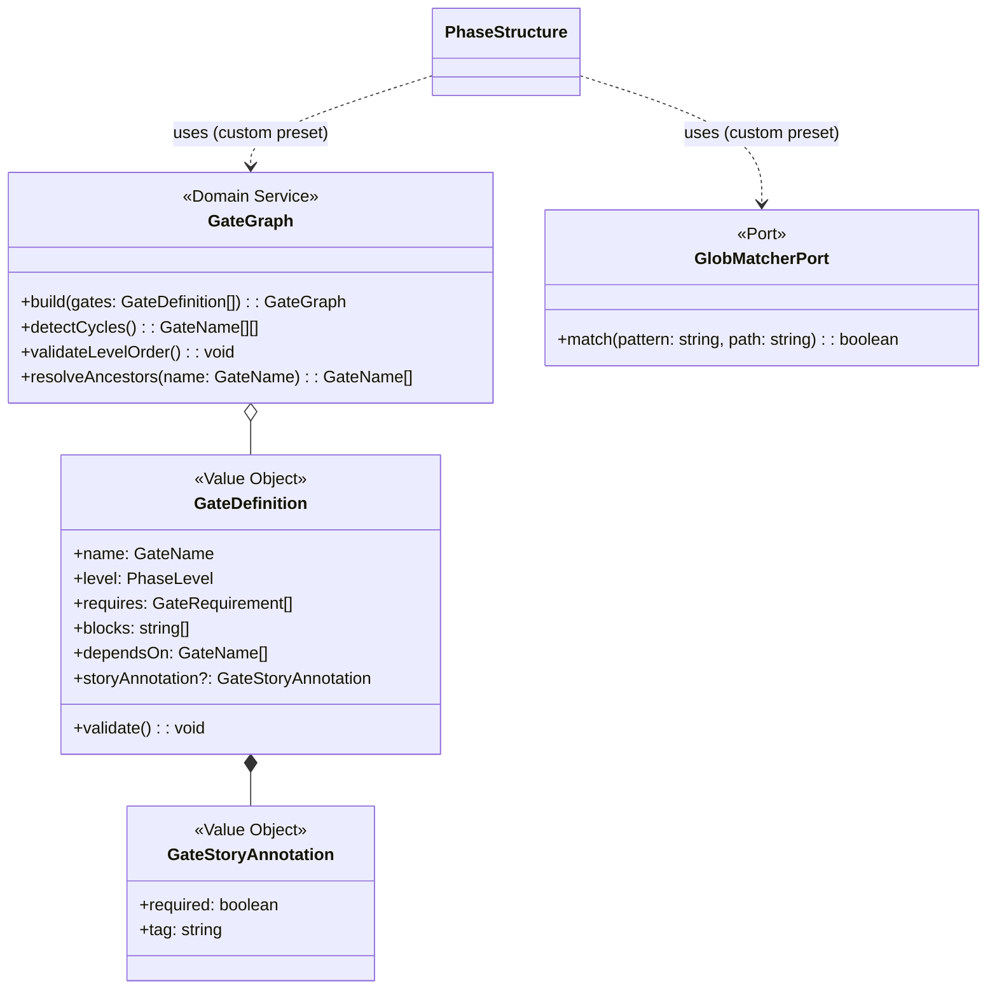

# ドメインモデル: phase-dependency-model

@story-id H02-01
@story-id H02-02
@story-id H02-03
@story-id H02-04
@story-id H02-05
@story-id H02-06
@story-id H02-07
> **Unit ID**: phase-dependency-model
> **作成日**: 2026-03-13
> **最終更新**: 2026-04-24（H02-07 / ISSUE-026 Phase C-4 legacy annotation compatibility 反映）
> **Wave**: 1（基盤構築）
> **対応ストーリー**: H02-01, H02-02, H02-03, H02-04, H02-05, H02-06, H02-07
> **対応Issue**: ISSUE-001, ISSUE-026
> **横断契約参照**: cross_cutting_decisions.md §5（所有権）, §6（集約降格）

---

## 1. Ownership / Import-Export

### このUnitが所有する概念

| 概念 | 分類 | 説明 |
|------|------|------|
| PhaseStructure | 集約ルート | 3層フェーズ構造全体 |
| PhaseLevel | 値オブジェクト | Level 1/2/3 |
| PhaseNode | 値オブジェクト | フェーズノード（スキル名 + 成果物） |
| PhaseDependency | 値オブジェクト | フェーズ間の前提条件関係 |
| PlanEvidence | 値オブジェクト | plan文書存在・QAセクション充足の検証結果 |
| PlanningMode | 値オブジェクト | interactive/embedded-qa/manual（正規定義を所有） |
| PhaseGateResult | 値オブジェクト | phase-gate検証結果 |
| PhaseCustomizationPolicy | 値オブジェクト | カスタマイズルールのポリシー |
| CustomRule | 値オブジェクト | カスタムルール定義 |
| Artifact | 値オブジェクト | 成果物ファイルの定義 |

### 他Unitから受け取るShared Kernel

| 型名 | 所有Unit | 自Unitでの扱い | 変更可否 |
|------|---------|---------------|---------|
| HarnessError | harness-error | phase-gate違反時のエラー出力 | 読取専用 |
| HarnessConfigV2 | config-foundation | phaseDependenciesセクションの**構造**を受け取り、**意味論**を検証 | 読取専用 |

### 他Unitへ公開する契約

| 契約 | 消費Unit | 内容 |
|------|---------|------|
| Phase Dependency 3層構造 | validator-system, regression-suite | Level 1→2→3の前提条件・成果物定義 |
| PlanningMode正規型定義 | harness-api | interactive/embedded-qa/manualの型・意味 |
| PhaseInfo | harness-api | check-phase応答用のフェーズ状態情報 |
| PhaseGateValidator IF | validator-system | L2 phase-gateバリデータの検証ロジック |

---

## 2. Aggregate Boundary

### 結論: 単一集約（PhaseStructure）

3層フェーズ構造全体をPhaseStructure集約で管理する。

### なぜ集約にするのか

- **Level間制約**: Level 2→Level 1、Level 3→Level 2の前提条件が本ドメインの中核不変条件。単一集約で一貫性を保証
- **整合性境界**: Level 1のフェーズ未完了時にLevel 2を開始できないという制約は、3つのLevelが同一集約内でないと保証できない
- **ライフサイクル**: プロジェクト全体のフェーズ進行という明確なライフサイクルがある

### 集約に入れない概念

| 概念 | 理由 |
|------|------|
| PhaseDependencyCustomization（v0） | HarnessConfigV2内の設定値であり独立ライフサイクルなし。PhaseCustomizationPolicy VOに降格 |
| PlanDocument（v0） | ファイルシステム状態の読み取り結果。PlanEvidence VOに降格 |

---

## 3. Model Classification

### 集約

| 集約ルート | 説明 |
|-----------|------|
| **PhaseStructure** | 3層フェーズ構造全体。Level 1（inception/_shared）→ Level 2（inception/{unit}）→ Level 3（inception/{unit}/{HXX-XX}）の前提条件・成果物定義を一体管理 |

### 値オブジェクト

| 値オブジェクト | 不変 | 値等価性 | 説明 |
|-------------|------|---------|------|
| **PhaseLevel** | ✅ | ✅ | `1 \| 2 \| 3`。Level 1=product-wide, Level 2=unit-level, Level 3=story-level |
| **PhaseNode** | ✅ | ✅ | `{ skillName, artifacts[], level }` フェーズノード |
| **PhaseDependency** | ✅ | ✅ | `{ from: PhaseNode, to: PhaseNode, type }` 前提条件関係 |
| **PlanEvidence** | ✅ | ✅ | `{ exists, qaComplete, planningModeMatch }` plan文書の証跡。ファイルシステム状態の読み取り結果 |
| **PlanningMode** | ✅ | ✅ | `"interactive" \| "embedded-qa" \| "manual"`。本Unitが正規定義を所有。`manual` は retrofit 用で plan 文書の QA 証跡を要求しない（`requiresQaSection()` / `requiresAnsweredQa()` とも false）<!-- @work-item-id WI-191 --> |
| **PhaseGateResult** | ✅ | ✅ | `{ passed, blockers[], warnings[] }` 検証結果 |
| **PhaseCustomizationPolicy** | ✅ | ✅ | `{ rules[], overrideEnabled }` HarnessConfigV2.phaseDependenciesから構築。デフォルトフローの緩和不可制約はPhaseStructureの不変条件としてハードコード |
| **CustomRule** | ✅ | ✅ | `{ targetPhase, condition, action }` カスタムルール定義 |
| **Artifact** | ✅ | ✅ | `{ name, path, required }` 成果物ファイル定義 |

### ドメインサービス

なし — PhaseStructure集約自体が検証ロジックを持ち、ドメインサービスへの流出を防止。

### ポートインターフェース

| ポート | 方向 | 理由 |
|--------|------|------|
| **ArtifactExistenceCheckerPort** | 外部→ドメイン | 成果物ファイルの存在確認（ファイルシステムアクセス） |
| **PlanDocumentReaderPort** | 外部→ドメイン | plan文書の存在 + QAセクション読み取り |
| **PhaseConfigProviderPort** | 外部→ドメイン | HarnessConfigV2.phaseDependenciesの取得 |
| **StoryReflectionFileSystemPort** | 外部→ドメイン | inception の reflection 対象ID列挙、product アノテーション検出、cross WI の `affects` 判定、source-touch 判定（`storyTouchesUnitLayer(storyId, unitId, layer)`）。H02-07以降は `_cross/WI-*` の `legacy_id` を旧 `@issue-id` 互換として扱う。WI-115以降、legacy_id 照合は product パスから推定した unit context（unit WI + cross WI）にスコープし、同一 legacy_id が複数 WI に一致する場合は曖昧として不一致扱いにする（恣意的な WI への誤解決をしない） |

<!-- @work-item-id WI-115 -->

#### Layer-aware reflection requirement（WI-246）

<!-- @work-item-id WI-246 -->

- **Source-touch**: WI のコミット（`.husky/commit-msg` が強制する `Work-Item:` trailer で機械的に紐付く）が `scripts/harness/{unit}/{layer}/` 配下のソースファイルを変更した事実。git 履歴由来で自己申告に依存しない。
- cross WI の `domain_model.md` 反映要求は、その WI に source-touch(domain) が実在する場合のみ発火する。domain 層を触れた cross WI は引き続き反映を要求される（anti-gutting）。`logical_design.md` 反映要求は unit 全レイヤーを写像するため無条件に維持。
- `affects:` が空/未定義の cross WI は「影響 unit なし」としてどの unit にも反映要求を発火しない。
- source-touch 判定が不能（WI に紐付くコミットが履歴に存在しない）の場合は「touch なし」として扱う。この規則は要求の除去方向にのみ作用する。
- unit-local WI の要求判定は layer-aware 化の影響を受けない。

---

## 4. Invariants

### PhaseStructure集約の不変条件

| # | 不変条件 | 検証タイミング |
|---|---------|-------------|
| INV-1 | Level 2開始にはLevel 1の前提成果物が全て存在する | phase-gate検証時 |
| INV-2 | Level 3開始にはLevel 2の前提成果物が全て存在する | phase-gate検証時 |
| INV-3 | Level間依存は緩和不可（ハードコード制約） | PhaseCustomizationPolicy適用時 |
| INV-4 | PlanningMode=interactive時、plan文書にQAセクションが存在する | phase-gate検証時 |
| INV-5 | PlanningMode=embedded-qa時、plan文書の対話的Q&Aが完了している | phase-gate検証時 |
| INV-6 | カスタムルール（override: true）でも、Level間依存とTDD最低保証は緩和不可 | PhaseCustomizationPolicy適用時 |
| INV-7 | override: trueが適用された場合、監査ペイロードが返される | PhaseCustomizationPolicy適用時 |
| INV-8 | scope.storyId提供時、Level 3ノードの成果物をresolve(scope)で解決し、解決済みパスの存在をチェック対象とする（コンテキスト依存required） | phase-gate検証時（ISSUE-001追加） |
| INV-9 | scope.storyId未提供時、Level 3ノードのrequired=false成果物はチェックをスキップする（既存動作維持） | phase-gate検証時（ISSUE-001追加） |
| INV-10 | 全 Level の成果物 path は `paths.designDocs` / `paths.inceptionDocs` を解決元とする `{designDocsRoot}` / `{inceptionDocsRoot}` プレースホルダで構築され、`Artifact.resolve(scope, pathRoots)` 時に config の値で展開される（pathRoots 省略時は `docs/product/construction` / `docs/inception` のデフォルト値で展開し、後方互換挙動を維持） | phase-gate検証時（WI-085 / ADR-016 追加） |

### Shared Kernelに対する前提条件

| 前提 | 内容 |
|------|------|
| HarnessConfigV2.phaseDependencies | 構造定義はconfig-foundation所有。意味論・不変条件は本Unit所有 |
| HarnessConfigV2.planningMode | 構造定義はconfig-foundation所有。正規型定義は本Unit所有 |

---

## 5. Port Boundary

| 操作 | Port越し？ | 理由 |
|------|-----------|------|
| Level間依存の検証 | ❌ ドメイン内 | 集約の不変条件チェック |
| PlanningMode妥当性検証 | ❌ ドメイン内 | 値の比較ロジック |
| PhaseCustomizationPolicy適用 | ❌ ドメイン内 | ポリシー適用ロジック |
| 成果物ファイル存在確認 | ✅ Port越し | ファイルシステムアクセス |
| plan文書QAセクション読み取り | ✅ Port越し | Markdownファイル解析 |
| phaseDependencies設定取得 | ✅ Port越し | HarnessConfigV2読み取り |

---

## 6. Archive Carry-over Exclusions

| 旧概念 | 旧出典 | 今回採用しない理由 | 置換先 |
|--------|--------|----------------|--------|
| PhaseDependencyCustomization集約 | v0検討 | HarnessConfigV2内の設定値。独立ライフサイクルなし | PhaseCustomizationPolicy VO |
| PlanDocument独立エンティティ | v0検討 | ファイルシステム状態の読み取り結果。独自ライフサイクルなし | PlanEvidence VO |
| DependencyOverrideAppliedイベント | v0検討 | Wave 1ではドメインイベント基盤不要 | 監査ペイロードをApplication層でログ化 |

---

## 7. State Transitions

PhaseStructure集約自体に状態フィールドはないが、phase-gate検証の結果は以下のフローで決定される:

```
checkPhaseGate(targetLevel, evidence, scope?)
    ├── 前提Level成果物チェック（required=true のもの）
    │   ├── 全存在 → 次へ
    │   └── 欠損あり → PhaseGateResult(passed=false, blockers=[...])
    ├── コンテキスト依存成果物チェック（ISSUE-001追加）
    │   ├── scope.storyId未提供 → スキップ（既存動作維持）
    │   └── scope.storyId提供時:
    │       ├── Level 3ノードの成果物を resolve(scope) でパス解決
    │       ├── 解決済みパスの存在チェック → 未完了ノードを特定
    │       └── 未完了ノードに依存するノード → ブロック
    ├── PlanEvidence検証（Level 2以降）
    │   ├── plan文書存在 + QA充足 → 次へ
    │   └── 不足 → PhaseGateResult(passed=false, blockers=[...])
    ├── PhaseCustomizationPolicy適用
    │   ├── override=true + 緩和不可制約に抵触 → PhaseGateResult(passed=false)
    │   ├── override=true + 許容範囲 → PhaseGateResult(passed=true, auditPayload)
    │   └── override=false → PhaseGateResult(passed=true)
    └── PhaseGateResult(passed=true)
```

---

## 8. Domain Events

Wave 1ではドメインイベント基盤は構築しない。

監査記録はPhaseGateResult内の`auditPayload`フィールドとしてドメインから返し、Application層がログ化する。

---

## 9. Class Diagram

```mermaid
classDiagram
    class PhaseStructure {
        <<Aggregate Root>>
        -levels: Map~PhaseLevel, PhaseNode[]~
        -dependencies: PhaseDependency[]
        -customizationPolicy: PhaseCustomizationPolicy
        +checkPhaseGate(targetLevel: PhaseLevel, evidence: Map, scope?: Scope): PhaseGateResult
        +getPhaseNodes(level: PhaseLevel): PhaseNode[]
        +getDependencies(from: PhaseNode): PhaseDependency[]
        +applyCustomization(policy: PhaseCustomizationPolicy): void
    }

    class PhaseLevel {
        <<Value Object>>
        +value: 1 | 2 | 3
        +isHigherThan(other: PhaseLevel): boolean
    }

    class PhaseNode {
        <<Value Object>>
        +skillName: string
        +artifacts: Artifact[]
        +level: PhaseLevel
    }

    class PhaseDependency {
        <<Value Object>>
        +from: PhaseNode
        +to: PhaseNode
        +type: "requires" | "recommends"
    }

    class PlanEvidence {
        <<Value Object>>
        +exists: boolean
        +qaComplete: boolean
        +planningModeMatch: boolean
    }

    class PlanningMode {
        <<Value Object>>
        +value: "interactive" | "embedded-qa"
    }

    class PhaseGateResult {
        <<Value Object>>
        +passed: boolean
        +blockers: string[]
        +warnings: string[]
        +auditPayload?: Record~string, unknown~
    }

    class PhaseCustomizationPolicy {
        <<Value Object>>
        +rules: CustomRule[]
        +overrideEnabled: boolean
    }

    class CustomRule {
        <<Value Object>>
        +targetPhase: PhaseLevel
        +condition: string
        +action: string
    }

    class Artifact {
        <<Value Object>>
        +name: string
        +path: string
        +required: boolean
    }

    class ArtifactExistenceCheckerPort {
        <<Port>>
        +exists(artifact: Artifact): boolean
    }

    class PlanDocumentReaderPort {
        <<Port>>
        +readEvidence(node: PhaseNode, mode: PlanningMode): PlanEvidence
    }

    class PhaseConfigProviderPort {
        <<Port>>
        +getCustomizationPolicy(): PhaseCustomizationPolicy
        +getPathRoots(): {designDocsRoot, inceptionDocsRoot}
    }

    PhaseStructure *-- PhaseLevel
    PhaseStructure o-- PhaseNode
    PhaseStructure o-- PhaseDependency
    PhaseStructure *-- PhaseCustomizationPolicy
    PhaseNode *-- PhaseLevel
    PhaseNode o-- Artifact
    PhaseDependency *-- PhaseNode
    PhaseCustomizationPolicy o-- CustomRule
    CustomRule *-- PhaseLevel
    PhaseStructure ..> PhaseGateResult : produces
    PhaseStructure ..> PlanEvidence : uses
    PhaseStructure ..> ArtifactExistenceCheckerPort : uses
    PhaseStructure ..> PlanDocumentReaderPort : uses
```

---

## 10. Open Questions（論理設計へ持ち越し）

| # | 質問 | 影響範囲 |
|---|------|---------|
| OQ-1 | PhaseNode一覧のハードコード vs 設定ファイル定義 | Infrastructure層設計 |
| OQ-2 | Quick ModeのrelaxedGatesとPhaseCustomizationPolicyの関係 | config-foundationとの連携設計 |

---

## 11. Phase B 拡張: Configurable Gates（configurable_phase_gate_plan §5）

> **追加日**: 2026-04-05（configurable_phase_gate_plan Phase B）
> **対応計画書**: `docs/inception/_shared/configurable_phase_gate_plan.md` §5 / B-2〜B-4

### 11.1 追加概念

| 概念 | 分類 | 説明 |
|------|------|------|
| **GateDefinition** | 値オブジェクト | `custom` プリセット用のゲート定義。`name` / `level` / `requires[]` / `blocks[]` / `dependsOn[]` / `storyAnnotation?` を保持 |
| **GateGraph** | ドメインサービス | `GateDefinition[]` から DAG を構築し、循環依存・レベル順序違反・未知の `dependsOn` 参照を検出 |
| **GateName** | 値オブジェクト | `^[a-z][a-z0-9-]*$`（kebab-case）の識別子 |
| **GateStoryAnnotation** | 値オブジェクト | `{ required: boolean, tag: string }`。Level 3 のゲートにのみ付与可能（不変条件 INV-10） |

### 11.2 GateDefinition の構造

```typescript
interface GateDefinition {
  readonly name: GateName;              // kebab-case 識別子
  readonly level: PhaseLevel;           // 1 | 2 | 3
  readonly requires: ReadonlyArray<{
    readonly path: string;              // 成果物パス（unit/story プレースホルダ可）
    readonly required: boolean;         // true=必須、false=警告のみ
  }>;
  readonly blocks: ReadonlyArray<string>;       // Write 対象を決定する glob パターン（省略時はプリセット既定）
  readonly dependsOn: ReadonlyArray<GateName>;  // 依存する先行ゲート
  readonly storyAnnotation?: GateStoryAnnotation; // Level 3 のみ
}
```

### 11.3 追加する不変条件

| # | 不変条件 | 検証タイミング | 検証場所 |
|---|---------|-------------|---------|
| INV-10 | `storyAnnotation` を持つ `GateDefinition` は `level === 3` でなければならない | GateDefinition 構築時 | ドメイン層（VO コンストラクタ） |
| INV-11 | `GateGraph` は循環依存を含んではならない | custom プリセット config ロード時 | GateGraph ドメインサービス |
| INV-12 | `dependsOn` で参照されるゲートはすべて同一 `GateGraph` 内に存在しなければならない | custom プリセット config ロード時 | GateGraph ドメインサービス |
| INV-13 | `GateDefinition.level` は `dependsOn` で参照される先行ゲートの `level` 以上でなければならない（レベル逆行禁止） | custom プリセット config ロード時 | GateGraph ドメインサービス |
| INV-14 | `GateName` は同一 `GateGraph` 内で一意でなければならない | GateGraph 構築時 | GateGraph ドメインサービス |

### 11.4 PhaseStructure の拡張

`PhaseStructure` 集約は、`PhaseCustomizationPolicy.preset === 'custom'` の場合、従来のハードコード `PhaseNode[]` ではなく `GateDefinition[]` から動的にフェーズノード群を構築する:

```
PhaseStructure.fromGates(gates: GateDefinition[]): PhaseStructure
  ├── GateGraph.build(gates) で DAG 検証（INV-11〜14）
  ├── 各 GateDefinition を PhaseNode に変換
  │   ├── skillName: gate.name
  │   ├── artifacts: gate.requires.map(r => Artifact(r.path, r.required))
  │   └── level: gate.level
  └── PhaseDependency を gate.dependsOn から構築
```

既存の `full` / `standard` / `minimal` プリセットの挙動は INV-1〜9 の従来フローを維持する（`fromPresetRules(policy)` 経路）。`custom` のみ `fromGates(gates)` 経路を通る。

### 11.5 新規ポート

| ポート | 方向 | 理由 |
|--------|------|------|
| **GlobMatcherPort** | 外部→ドメイン | `gate.blocks[]` と Write 対象パスのマッチング。picomatch 実装を infrastructure で提供 |

ドメイン層は glob ライブラリに直接依存せず、`GlobMatcherPort.match(pattern, path): boolean` インターフェースのみを参照する。

### 11.6 Class Diagram 追補


<!-- @work-item-id WI-138 -->
## G4 Traceability Graph Boundary

`phase-dependency-model` continues to own phase ordering and prerequisite semantics. WI-138 consumes phase/product reflection evidence as graph edges only; it does not move phase-gate rule evaluation out of phase-dependency-model.
