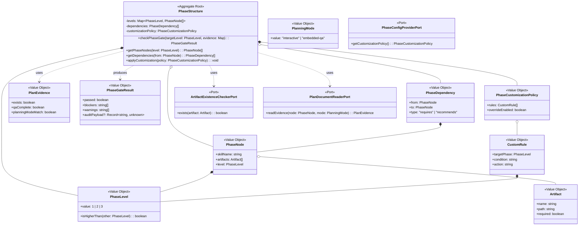

# ドメインモデル: phase-dependency-model

> **Unit ID**: phase-dependency-model
> **作成日**: 2026-03-13
> **Wave**: 1（基盤構築）
> **対応ストーリー**: H02-01, H02-02, H02-03
> **横断契約参照**: cross_cutting_decisions.md §5（所有権）, §6（集約降格）

---

## 1. Ownership / Import-Export

### このUnitが所有する概念

| 概念 | 分類 | 説明 |
|------|------|------|
| PhaseStructure | 集約ルート | 3層フェーズ構造全体 |
| PhaseLevel | 値オブジェクト | Level 1/2/3 |
| PhaseNode | 値オブジェクト | フェーズノード（スキル名 + 成果物） |
| PhaseDependency | 値オブジェクト | フェーズ間の前提条件関係 |
| PlanEvidence | 値オブジェクト | plan文書存在・QAセクション充足の検証結果 |
| PlanningMode | 値オブジェクト | interactive/embedded-qa（正規定義を所有） |
| PhaseGateResult | 値オブジェクト | phase-gate検証結果 |
| PhaseCustomizationPolicy | 値オブジェクト | カスタマイズルールのポリシー |
| CustomRule | 値オブジェクト | カスタムルール定義 |
| Artifact | 値オブジェクト | 成果物ファイルの定義 |

### 他Unitから受け取るShared Kernel

| 型名 | 所有Unit | 自Unitでの扱い | 変更可否 |
|------|---------|---------------|---------|
| HarnessError | harness-error | phase-gate違反時のエラー出力 | 読取専用 |
| HarnessConfigV2 | config-foundation | phaseDependenciesセクションの**構造**を受け取り、**意味論**を検証 | 読取専用 |

### 他Unitへ公開する契約

| 契約 | 消費Unit | 内容 |
|------|---------|------|
| Phase Dependency 3層構造 | validator-system, regression-suite | Level 1→2→3の前提条件・成果物定義 |
| PlanningMode正規型定義 | harness-api | interactive/embedded-qaの型・意味 |
| PhaseInfo | harness-api | check-phase応答用のフェーズ状態情報 |
| PhaseGateValidator IF | validator-system | L2 phase-gateバリデータの検証ロジック |

---

## 2. Aggregate Boundary

### 結論: 単一集約（PhaseStructure）

3層フェーズ構造全体をPhaseStructure集約で管理する。

### なぜ集約にするのか

- **Level間制約**: Level 2→Level 1、Level 3→Level 2の前提条件が本ドメインの中核不変条件。単一集約で一貫性を保証
- **整合性境界**: Level 1のフェーズ未完了時にLevel 2を開始できないという制約は、3つのLevelが同一集約内でないと保証できない
- **ライフサイクル**: プロジェクト全体のフェーズ進行という明確なライフサイクルがある

### 集約に入れない概念

| 概念 | 理由 |
|------|------|
| PhaseDependencyCustomization（v0） | HarnessConfigV2内の設定値であり独立ライフサイクルなし。PhaseCustomizationPolicy VOに降格 |
| PlanDocument（v0） | ファイルシステム状態の読み取り結果。PlanEvidence VOに降格 |

---

## 3. Model Classification

### 集約

| 集約ルート | 説明 |
|-----------|------|
| **PhaseStructure** | 3層フェーズ構造全体。Level 1（inception/_shared）→ Level 2（inception/{unit}）→ Level 3（inception/{unit}/{HXX-XX}）の前提条件・成果物定義を一体管理 |

### 値オブジェクト

| 値オブジェクト | 不変 | 値等価性 | 説明 |
|-------------|------|---------|------|
| **PhaseLevel** | ✅ | ✅ | `1 \| 2 \| 3`。Level 1=product-wide, Level 2=unit-level, Level 3=story-level |
| **PhaseNode** | ✅ | ✅ | `{ skillName, artifacts[], level }` フェーズノード |
| **PhaseDependency** | ✅ | ✅ | `{ from: PhaseNode, to: PhaseNode, type }` 前提条件関係 |
| **PlanEvidence** | ✅ | ✅ | `{ exists, qaComplete, planningModeMatch }` plan文書の証跡。ファイルシステム状態の読み取り結果 |
| **PlanningMode** | ✅ | ✅ | `"interactive" \| "embedded-qa"`。本Unitが正規定義を所有 |
| **PhaseGateResult** | ✅ | ✅ | `{ passed, blockers[], warnings[] }` 検証結果 |
| **PhaseCustomizationPolicy** | ✅ | ✅ | `{ rules[], overrideEnabled }` HarnessConfigV2.phaseDependenciesから構築。デフォルトフローの緩和不可制約はPhaseStructureの不変条件としてハードコード |
| **CustomRule** | ✅ | ✅ | `{ targetPhase, condition, action }` カスタムルール定義 |
| **Artifact** | ✅ | ✅ | `{ name, path, required }` 成果物ファイル定義 |

### ドメインサービス

なし — PhaseStructure集約自体が検証ロジックを持ち、ドメインサービスへの流出を防止。

### ポートインターフェース

| ポート | 方向 | 理由 |
|--------|------|------|
| **ArtifactExistenceCheckerPort** | 外部→ドメイン | 成果物ファイルの存在確認（ファイルシステムアクセス） |
| **PlanDocumentReaderPort** | 外部→ドメイン | plan文書の存在 + QAセクション読み取り |
| **PhaseConfigProviderPort** | 外部→ドメイン | HarnessConfigV2.phaseDependenciesの取得 |

---

## 4. Invariants

### PhaseStructure集約の不変条件

| # | 不変条件 | 検証タイミング |
|---|---------|-------------|
| INV-1 | Level 2開始にはLevel 1の前提成果物が全て存在する | phase-gate検証時 |
| INV-2 | Level 3開始にはLevel 2の前提成果物が全て存在する | phase-gate検証時 |
| INV-3 | Level間依存は緩和不可（ハードコード制約） | PhaseCustomizationPolicy適用時 |
| INV-4 | PlanningMode=interactive時、plan文書にQAセクションが存在する | phase-gate検証時 |
| INV-5 | PlanningMode=embedded-qa時、plan文書の対話的Q&Aが完了している | phase-gate検証時 |
| INV-6 | カスタムルール（override: true）でも、Level間依存とTDD最低保証は緩和不可 | PhaseCustomizationPolicy適用時 |
| INV-7 | override: trueが適用された場合、監査ペイロードが返される | PhaseCustomizationPolicy適用時 |

### Shared Kernelに対する前提条件

| 前提 | 内容 |
|------|------|
| HarnessConfigV2.phaseDependencies | 構造定義はconfig-foundation所有。意味論・不変条件は本Unit所有 |
| HarnessConfigV2.planningMode | 構造定義はconfig-foundation所有。正規型定義は本Unit所有 |

---

## 5. Port Boundary

| 操作 | Port越し？ | 理由 |
|------|-----------|------|
| Level間依存の検証 | ❌ ドメイン内 | 集約の不変条件チェック |
| PlanningMode妥当性検証 | ❌ ドメイン内 | 値の比較ロジック |
| PhaseCustomizationPolicy適用 | ❌ ドメイン内 | ポリシー適用ロジック |
| 成果物ファイル存在確認 | ✅ Port越し | ファイルシステムアクセス |
| plan文書QAセクション読み取り | ✅ Port越し | Markdownファイル解析 |
| phaseDependencies設定取得 | ✅ Port越し | HarnessConfigV2読み取り |

---

## 6. Archive Carry-over Exclusions

| 旧概念 | 旧出典 | 今回採用しない理由 | 置換先 |
|--------|--------|----------------|--------|
| PhaseDependencyCustomization集約 | v0検討 | HarnessConfigV2内の設定値。独立ライフサイクルなし | PhaseCustomizationPolicy VO |
| PlanDocument独立エンティティ | v0検討 | ファイルシステム状態の読み取り結果。独自ライフサイクルなし | PlanEvidence VO |
| DependencyOverrideAppliedイベント | v0検討 | Wave 1ではドメインイベント基盤不要 | 監査ペイロードをApplication層でログ化 |

---

## 7. State Transitions

PhaseStructure集約自体に状態フィールドはないが、phase-gate検証の結果は以下のフローで決定される:

```
checkPhaseGate(targetLevel, artifacts)
    ├── 前提Level成果物チェック
    │   ├── 全存在 → 次へ
    │   └── 欠損あり → PhaseGateResult(passed=false, blockers=[...])
    ├── PlanEvidence検証（Level 2以降）
    │   ├── plan文書存在 + QA充足 → 次へ
    │   └── 不足 → PhaseGateResult(passed=false, blockers=[...])
    ├── PhaseCustomizationPolicy適用
    │   ├── override=true + 緩和不可制約に抵触 → PhaseGateResult(passed=false)
    │   ├── override=true + 許容範囲 → PhaseGateResult(passed=true, auditPayload)
    │   └── override=false → PhaseGateResult(passed=true)
    └── PhaseGateResult(passed=true)
```

---

## 8. Domain Events

Wave 1ではドメインイベント基盤は構築しない。

監査記録はPhaseGateResult内の`auditPayload`フィールドとしてドメインから返し、Application層がログ化する。

---

## 9. Class Diagram



---

## 10. Open Questions（論理設計へ持ち越し）

| # | 質問 | 影響範囲 |
|---|------|---------|
| OQ-1 | PhaseNode一覧のハードコード vs 設定ファイル定義 | Infrastructure層設計 |
| OQ-2 | Quick ModeのrelaxedGatesとPhaseCustomizationPolicyの関係 | config-foundationとの連携設計 |
