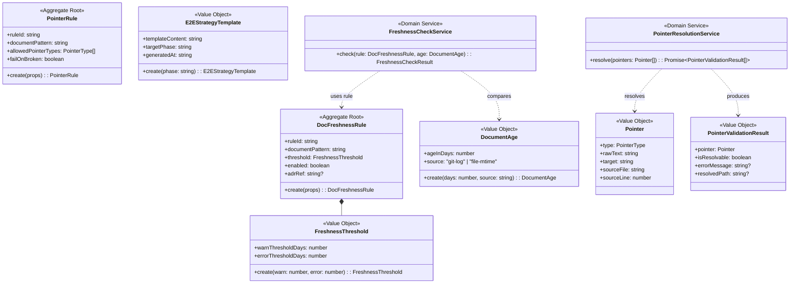

# ドメインモデル: phase2-extensions

> **Unit ID**: phase2-extensions
> **作成日**: 2026-03-20
> **最終更新**: 2026-03-20（初版）
> **Wave**: 2（Phase 2 拡張バリデータ）
> **対応ストーリー**: HF2-01〜HF2-03
> **横断契約参照**: cross_cutting_decisions.md §2（Layer語彙）, §4（Shared Kernel最小化）, §6（集約降格）

---

## 1. Ownership / Import-Export

### このUnitが所有する概念

| 概念 | 分類 | 説明 |
|------|------|------|
| DocFreshnessRule | 集約ルート | 設計文書の鮮度チェックルール定義。FreshnessThreshold（VO）を内包し、対象ドキュメントパターンと閾値の整合性を管理する |
| PointerRule | 集約ルート | ドキュメント内ポインタのバリデーションルール定義。Pointer（VO）の参照先実在検証ポリシーを管理する |
| FreshnessThreshold | 値オブジェクト | 文書鮮度の許容期間（日数）定義。warnThresholdDays（警告）とerrorThresholdDays（エラー）の2段階閾値を保持する |
| DocumentAge | 値オブジェクト | 対象文書の最終更新からの経過日数。Git logを一次情報源とし、フォールバックとしてファイルmtimeを使用 |
| Pointer | 値オブジェクト | ドキュメント内に記述されたポインタ参照。PointerType（file-path / url）と参照先テキストを保持する |
| PointerValidationResult | 値オブジェクト | 個別ポインタの検証結果。isResolvable・errorMessage・resolvedPathを保持する |
| E2EStrategyTemplate | 値オブジェクト | E2Eテスト戦略テンプレートの内容定義。templateContent（Markdown文字列）とtargetPhase（対象フェーズ名）を保持する |
| FreshnessCheckService | ドメインサービス | DocumentAge取得・FreshnessThreshold比較によるDocFreshnessRuleの鮮度判定。`check(rule, documentAge): FreshnessCheckResult` |
| PointerResolutionService | ドメインサービス | Pointer[]の参照先実在検証オーケストレーション。`resolve(pointers): Promise<PointerValidationResult[]>` |

### 他Unitから受け取るShared Kernel

| 型名 | 所有Unit | 自Unitでの扱い | 変更可否 |
|------|---------|---------------|---------|
| HarnessError | harness-error | FreshnessCheckResult・PointerValidationResultのエラー表現に使用 | 読取専用 |
| HarnessErrorCode | harness-error | ドメインルール違反・検証エラーのコードとして使用 | 読取専用 |
| HarnessConfigV2 | config-foundation | FreshnessConfigPortを通じて鮮度閾値設定を参照 | 読取専用 |

### 他Unitへ公開する契約

このUnitは現時点で他Unitへの公開契約を持たない。Phase 2バリデータとしての役割に閉じた設計とする。

---

## 2. Aggregate Boundary

### 結論: 集約ルート3つ（DocFreshnessRule / PointerRule / InitialCreationExpirationRule）

横断契約§6の集約降格方針を参照しつつ、以下の分析により2集約を維持する構成とした。

### DocFreshnessRuleを集約ルートとして維持する根拠

- **複合整合性**: documentPattern（対象ファイルGlobパターン）とFreshnessThreshold（warnThresholdDays / errorThresholdDays）の複合整合性（warn < error の関係）を保証する責務がある
- **ドメインロジックの存在**: FreshnessCheckServiceがDocFreshnessRuleを参照して鮮度判定を実行する。ルールの有効性（enabled/disabled）・パターン・閾値の組み合わせはドメインロジックであり、純粋なVOでは表現できない
- **複数ルール管理**: プロジェクトは複数のDocFreshnessRuleを持てる（ADR文書は14日、設計文書は30日など）。各ルールは独立したライフサイクルを持つ

**永続化なし**: DocFreshnessRule集約はHarnessConfigV2からFreshnessConfigPortを通じて都度ロードされる。独立したリポジトリポートは不要とする。

### PointerRuleを集約ルートとして維持する根拠

- **ポリシー管理**: 検証対象のドキュメントパターン・許容するPointerType・エラー時の動作（failOnBroken）の整合性を集約内で管理する責務がある
- **ドメインルール内包**: failOnBrokenフラグとPointerType制限の組み合わせによる検証方針はドメインルールとして集約内に閉じるべき
- **拡張性**: 将来的にURLチェック（Phase 2スコープ外）を追加する際、PointerRule集約の設定として自然に収容できる

**永続化なし**: PointerRuleもHarnessConfigV2から都度ロードされる構成とする。

@story-id HF2-04
### InitialCreationExpirationRuleを集約ルートとして新設する根拠

- **独立した責務**: `initial_creation: true` 付き文書の失効判定は DocFreshnessRule（最終更新日基準）と意味論が異なる。起点（初回コミット日）・追加指標（コミット回数）・対象絞り込み（frontmatter フラグ付きのみ）すべてが異なるため、同一集約への統合は凝集度を下げる
- **複合整合性**: `daysThreshold`（日数閾値）と `commitCountThreshold`（コミット回数閾値）と `evaluationMode`（'or' / 'and'）の組み合わせで失効判定を一意化する責務がある
- **ドメインロジックの存在**: `InitialCreationExpirationCheckService` が集約を参照して判定する。ルールの enabled 状態・閾値の組み合わせ・評価モードはドメインロジックで、VOでは表現できない

**永続化なし**: DocFreshnessRule / PointerRule と同様に HarnessConfigV2 から `InitialCreationExpirationConfigPort` 経由で都度ロードする。

---

## 3. Model Classification

### 集約ルート

| 集約ルート | 識別子 | 永続化 | ライフサイクル |
|-----------|--------|--------|--------------|
| DocFreshnessRule | ruleId（`string`） | なし（HarnessConfigV2から都度ロード） | FreshnessConfigPortが生成 → FreshnessCheckServiceが鮮度判定に使用 |
| PointerRule | ruleId（`string`） | なし（HarnessConfigV2から都度ロード） | PointerConfigPortが生成 → PointerResolutionServiceが検証に使用 |
| InitialCreationExpirationRule | ruleId（`string`） | なし（HarnessConfigV2から都度ロード） | InitialCreationExpirationConfigPortが生成 → InitialCreationExpirationCheckServiceが失効判定に使用 |

### 値オブジェクト

| 値オブジェクト | 不変 | 値等価性 | 説明 |
|-------------|------|---------|------|
| FreshnessThreshold | ✓ | ✓ | `warnThresholdDays: number`（1以上）, `errorThresholdDays: number`（warnThresholdDays超）。2段階の閾値を保持する |
| DocumentAge | ✓ | ✓ | `ageInDays: number`（0以上）, `source: 'git-log' \| 'file-mtime'`。取得元情報を保持する |
| Pointer | ✓ | ✓ | `type: PointerType`, `rawText: string`（元テキスト）, `target: string`（参照先）。正規表現抽出結果を保持する |
| PointerValidationResult | ✓ | ✓ | `pointer: Pointer`, `isResolvable: boolean`, `errorMessage: string \| null`, `resolvedPath: string \| null` |
| E2EStrategyTemplate | ✓ | ✓ | `templateContent: string`（Markdown本文）, `targetPhase: string`, `generatedAt: string`（ISO 8601） |
| InitialCreationAge | ✓ | ✓ | `ageInDays: number`（0以上、初回コミット日からの経過日数）, `commitCount: number`（1以上、累積コミット回数）, `source: 'git-log' \| 'file-mtime'` |

### 補助型

| 型 | 説明 |
|---|------|
| PointerType | `'file-path' \| 'url'`（Phase 2初期は`file-path`のみ検証対象） |
| FreshnessCheckResult | `{ ruleId: string, documentPath: string, ageInDays: number, level: 'ok' \| 'warn' \| 'error', message: string }` |
| FreshnessLevel | `'ok' \| 'warn' \| 'error'` |
| DocumentScanResult | `{ documentPath: string, scannedAt: string }` |
| Phase2ExtensionsDomainError | このUnit固有のドメイン例外クラス（HarnessErrorを内包） |

### ドメインサービス

| サービス | 責務 | 参照するポート |
|---------|------|--------------|
| FreshnessCheckService | DocFreshnessRuleとDocumentAgeを比較してFreshnessCheckResultを算出。`check(rule: DocFreshnessRule, documentAge: DocumentAge): FreshnessCheckResult` | なし（純粋計算） |
| PointerResolutionService | Pointer[]に対してポート経由で実在性を検証し、PointerValidationResult[]を返す。`resolve(pointers: Pointer[]): Promise<PointerValidationResult[]>` | PointerResolverPort |
| InitialCreationExpirationCheckService | InitialCreationExpirationRuleとInitialCreationAgeから失効判定を行う。`check(rule: InitialCreationExpirationRule, age: InitialCreationAge, documentPath: string): InitialCreationExpirationResult` | なし（純粋計算） |

---

## 4. Port Interfaces

### 入力ポート（外部→ドメイン）

| ポート名 | 責務 | 利用サービス/集約 |
|---------|------|-----------------|
| DocumentAgePort | Git log（`git log --format=%ai -1 <path>`）でmtime取得。Gitコマンドがなければファイルmtimeにフォールバック。`getAge(documentPath: string): Promise<DocumentAge>` | アプリケーション層（CheckDocFreshnessUseCase） |
| DocumentScannerPort | Globパターンに基づいてドキュメントファイル一覧を取得。`scan(pattern: string): Promise<string[]>` | アプリケーション層（CheckDocFreshnessUseCase） |
| PointerExtractorPort | ドキュメントファイルから正規表現でPointer[]を抽出。`extract(documentPath: string): Promise<Pointer[]>` | アプリケーション層（ValidateDocPointersUseCase） |
| PointerResolverPort | PointerType='file-path'のtargetパスがプロジェクト内に実在するか確認（`node:fs`使用）。`resolve(pointer: Pointer): Promise<boolean>` | PointerResolutionService |
| FreshnessConfigPort | HarnessConfigV2からDocFreshnessRule[]を読み込む。`loadRules(): Promise<DocFreshnessRule[]>` | アプリケーション層（CheckDocFreshnessUseCase） |
| InitialCreationExpirationConfigPort | HarnessConfigV2からInitialCreationExpirationRule[]を読み込む。`loadInitialCreationExpirationRules(): Promise<InitialCreationExpirationRule[]>` | アプリケーション層（CheckInitialCreationExpirationUseCase） |
| FrontmatterReaderPort | md ファイルの frontmatter を読み込み `initial_creation` フラグを返す。`read(documentPath: string): Promise<{ initialCreation: boolean }>` | CheckInitialCreationExpirationUseCase |
| InitialCreationAgePort | 初回追加コミット日とコミット回数を取得。`getInitialCreationAge(documentPath: string): Promise<InitialCreationAge>` | CheckInitialCreationExpirationUseCase |

### 出力ポート（ドメイン→外部）

このUnitは現時点で出力ポートを持たない。UseCase結果はアプリケーション層がPresentationに返却する。

---

## 5. Domain Rules and Invariants

### 不変条件

| INV | 対象 | 内容 |
|-----|------|------|
| INV-1 | DocFreshnessRule | `ruleId` は空文字列不可（一意識別子として必須） |
| INV-2 | DocFreshnessRule | `documentPattern` は空文字列不可（Globパターンとして有効な文字列であること） |
| INV-3 | DocFreshnessRule | `FreshnessThreshold.warnThresholdDays` は1以上の正整数であること |
| INV-4 | DocFreshnessRule | `FreshnessThreshold.errorThresholdDays` は `warnThresholdDays` を超えること（warn < error の順序保証） |
| INV-5 | DocumentAge | `ageInDays` は0以上の数値であること（負値は不正） |
| INV-6 | PointerRule | `ruleId` は空文字列不可 |
| INV-7 | PointerRule | `documentPattern` は空文字列不可 |
| INV-8 | Pointer | `rawText` は空文字列不可 |
| INV-9 | Pointer | `target` は空文字列不可 |
| INV-10 | E2EStrategyTemplate | `templateContent` は空文字列不可 |
| INV-11 | E2EStrategyTemplate | `targetPhase` は空文字列不可 |
| INV-12 | FreshnessThreshold | `warnThresholdDays` と `errorThresholdDays` はともに1以上の正整数であること |

### FreshnessCheckServiceの判定ルール

```
DocumentAge.ageInDays と FreshnessThreshold の比較:

  ageInDays < warnThresholdDays → level: 'ok'
  warnThresholdDays <= ageInDays < errorThresholdDays → level: 'warn'
  ageInDays >= errorThresholdDays → level: 'error'
```

### DocumentAge取得の優先順位（Git log優先・mtimeフォールバック）

```
1. child_process.execSync('git log --format=%ai -1 <path>')
     → 出力あり: ISO 8601形式の最終コミット日時をパース → DocumentAge(source='git-log')
     → 出力なし / Gitリポジトリ外: フォールバック

2. フォールバック: node:fs の stat().mtimeMs
     → DocumentAge(source='file-mtime')
```

### Pointer抽出の正規表現パターン（Phase 2初期）

Phase 2初期はMarkdownドキュメント内のファイルパスリンク（`[text](path)` 形式、または `docs/` `scripts/` で始まる相対パス参照）を抽出対象とする。URLチェック（`http://` / `https://` 始まり）はPhase 2スコープ外とし、PointerType='url'は抽出するが実在検証はスキップする。

### PointerResolutionServiceの検証スコープ

Phase 2初期: PointerType='file-path' のみ実在確認を実施。PointerType='url' は `isResolvable=true` を返し検証をスキップする（URLチェック未実装）。

---

## 6. Domain Events

| イベント名 | 発行元 | トリガー | ペイロード |
|-----------|--------|---------|----------|
| FreshnessCheckCompleted | CheckDocFreshnessUseCase | 全ルールの鮮度チェック完了時 | `{ results: FreshnessCheckResult[], totalDocuments: number, staleCount: number }` |
| DocumentStaleDetected | FreshnessCheckService | 個別文書の鮮度閾値超過検出時 | `{ documentPath: string, ageInDays: number, level: FreshnessLevel, ruleId: string }` |
| PointerValidationCompleted | ValidateDocPointersUseCase | 全ルールのポインタ検証完了時 | `{ results: PointerValidationResult[], totalPointers: number, brokenCount: number }` |
| BrokenPointerDetected | PointerResolutionService | リンク切れ検出時 | `{ pointer: Pointer, errorMessage: string, documentPath: string }` |
| E2ETemplateGenerated | GenerateE2ETemplateUseCase | テンプレート生成完了時 | `{ targetPhase: string, outputPath: string }` |

> **注**: 初版ではイベント発行の実装は行わない。イベント定義のみを記載し、将来のイベント駆動アーキテクチャ移行に備える。

---

## 7. Class Diagram



---

## 8. Data Flow

### HF2-01（設計文書鮮度チェック）

```
[アプリケーション層: CheckDocFreshnessUseCase]
  引数: なし（設定からルールを全取得）
       |
       v
FreshnessConfigPort.loadRules()
  → DocFreshnessRule[]取得（HarnessConfigV2から）
       |
       v（各ルールに対してループ）
DocumentScannerPort.scan(rule.documentPattern)
  → 対象ファイルパス[]取得（Globマッチング）
       |
       v（各ドキュメントに対してループ）
DocumentAgePort.getAge(documentPath)
  → Git log → DocumentAge(source='git-log')
  → フォールバック → DocumentAge(source='file-mtime')
       |
       v
FreshnessCheckService.check(rule, documentAge)
  → FreshnessThresholdとageInDaysを比較
  → FreshnessCheckResult { level: 'ok'|'warn'|'error', ... }
       |
       v
[全ルール・全ドキュメントの結果を集約]
→ FreshnessCheckResult[]をPresentationへ返却
```

### HF2-02（ドキュメントポインタ実在検証）

```
[アプリケーション層: ValidateDocPointersUseCase]
  引数: なし（設定からルールを全取得）
       |
       v
PointerConfigPort.loadRules()
  → PointerRule[]取得
       |
       v（各ルールに対してループ）
DocumentScannerPort.scan(rule.documentPattern)
  → 対象ファイルパス[]取得
       |
       v（各ドキュメントに対してループ）
PointerExtractorPort.extract(documentPath)
  → Pointer[]取得（正規表現でMarkdownリンク・パス参照を抽出）
       |
       v
PointerResolutionService.resolve(pointers)
  → 各Pointerに対してPointerResolverPort.resolve(pointer)
    - type='file-path': node:fsでパス実在確認
    - type='url': スキップ（isResolvable=true）
  → PointerValidationResult[]
       |
       v
[broken Pointerを集約]
→ PointerValidationResult[]をPresentationへ返却
```

### HF2-03（E2Eテスト戦略テンプレート生成）

```
[アプリケーション層: GenerateE2ETemplateUseCase]
  引数: targetPhase: string
       |
       v
E2EStrategyTemplate.create(targetPhase)
  → テンプレート内容をフェーズ名から生成
  → E2EStrategyTemplate（VO）構築
  → 不変条件チェック（INV-10, INV-11）
       |
       v
[出力]
→ E2EStrategyTemplate.templateContent をPresentationへ返却
   （Markdownファイルとして書き出すかはPresentation層が決定）
```

---

## 9. 設計判断記録

### D1: DocFreshnessRuleはHarnessConfigV2から都度ロード（独立リポジトリなし）

鮮度チェックルール設定はHarnessConfigV2（config-foundation）に集中管理されており、phase2-extensions独自の永続化ストアは不要と判断した。FreshnessConfigPortがHarnessConfigV2から必要なルール設定を取得・変換してDocFreshnessRule集約を構築する。

### D2: Git log優先・mtimeフォールバックの二重取得戦略

CIサーバー環境ではGit historyが利用可能なため、`git log --format=%ai -1 <path>` を一次情報源とする。ローカル開発環境でGitリポジトリ外の場合（稀なケース）はファイルmtimeにフォールバックする。DocumentAge VOがsourceフィールドで取得元を明示することで、ログ出力時の診断を容易にする。

### D3: Phase 2初期はfile-pathのみ実在確認（URLチェックは将来対応）

URLの実在確認にはネットワークアクセスが必要であり、CIパイプラインの速度・信頼性への影響が大きい。Phase 2初期はfile-path（プロジェクト内相対パス）の実在確認に限定し、URLはPointerType='url'として抽出のみ行い検証はスキップする。URLチェック実装時はPointerResolverPort実装を差し替えることで対応できる（OCP準拠）。

### D4: E2EStrategyTemplateはVOとして設計（集約不要）

E2Eテスト戦略テンプレートは「生成する」という操作のみを持ち、状態遷移・複数VOの整合性保証・永続化のいずれも不要なため、VOとして設計する。GenerateE2ETemplateUseCaseが直接E2EStrategyTemplate.create()を呼び出す構成とし、集約ルートへの格上げは不要とした。

### D5: PointerResolutionServiceはドメインサービスとして配置

Pointer[]の検証はPointerResolverPort（外部依存）への委譲が必要であり、純粋なドメイン計算ではない。しかしPointerRule集約の責務外（複数Pointerの並列検証オーケストレーション）であるため、ドメインサービス（PointerResolutionService）として配置する。これはci-governanceのPointerValidatorと同じパターンを採用している。

---

## 10. 品質評価（engineering-perspective）

### ドメインスメルチェック

- **責務混在**: FreshnessCheckServiceは純粋計算のみ（ポート依存なし）、PointerResolutionServiceはPointerResolverPortのみに依存 → 明確な責務分離
- **不適切なVO**: E2EStrategyTemplateは状態遷移なし・値等価性あり → VOとして適切
- **境界不明確**: Phase 2スコープ外（URLチェック）をPointerType='url'でモデル化し、将来の実装差し替えを明示 → 境界明確
- **INV-4（warn < error順序）の強制**: FreshnessThreshold生成時に検証し、違反はPhase2ExtensionsDomainErrorとして早期失敗 → 不変条件の適切な強制

### SOLID評価

- **SRP**: FreshnessCheckService（鮮度計算）/ PointerResolutionService（実在確認オーケストレーション）が単一責務を維持
- **OCP**: URLチェック追加時はPointerResolverPort実装の追加のみで対応可能
- **依存方向**: ドメイン層がポートを定義、infrastructure層がPortを実装 → 遵守
- **インターフェース分離**: DocumentAgePort / DocumentScannerPort / PointerExtractorPort / PointerResolverPort / FreshnessConfigPort が責務別に分離 → 遵守

### シンプルさ評価

- 2集約・2ドメインサービス・5VO という適切な規模
- DocFreshnessRule・PointerRuleの永続化なし設計により、リポジトリポートを排除
- E2EStrategyTemplateをVOとすることで、集約数を最小化

### リスク評価

| リスク | 評価 | 対応方針 |
|--------|------|---------|
| Git logコマンドの実行失敗（CIサーバー設定依存） | 低 | DocumentAgePortがmtimeフォールバックを実装。DocumentAge.sourceで取得元を明示しログで診断可能 |
| 正規表現によるPointer抽出の網羅性 | 中 | Phase 2初期はMarkdown標準形式（`[text](path)`）に限定。エッジケースはUnit Testで網羅的に検証 |
| HarnessConfigV2への設定追加（config-foundationスキーマ変更） | 低 | FreshnessConfigPortがアダプタとして吸収。ドメインモデルへの影響を遮断 |
<!-- @work-item-id WI-122 -->
## WI-122 Pointer And Freshness Semantics

`PointerRule` owns operational pointer policy through `owner` and per semantic pointer type `pointerPolicies`. Pointer reports distinguish `reference`, `implementation`, `adr`, `product-doc`, and `external-url`.

`FreshnessCheckResult` distinguishes stable aging from `stale-after-source-change` and carries a next action for operational triage.

<!-- @work-item-id WI-164 -->
## WI-164 Pointer Freshness Contract

Pointer freshness is an operational contract shared with validator-system `L4-004` and `L4-005`.

| Concept | Contract |
|---|---|
| `owner` | Unit or workflow responsible for repairing the pointer/freshness policy result. |
| Semantic pointer type | `reference`, `implementation`, `adr`, `product-doc`, or `external-url`. |
| Source document | Document path where the pointer or freshness rule was observed. |
| Severity | `ok`, `warn`, or `error` at phase2 level; mapped to validator `warning` or `error` by validator-system. |
| Next action | Human/agent repair instruction, carried through report formatting. |

External URL pointers are skipped by default because URL checking requires network access and can make CI nondeterministic. `allowedPointerTypes` and `failOnBroken` are compatibility configuration concepts; the current semantic model interprets them through per-type policy so product-doc/ADR pointers can fail while implementation/reference pointers warn.
