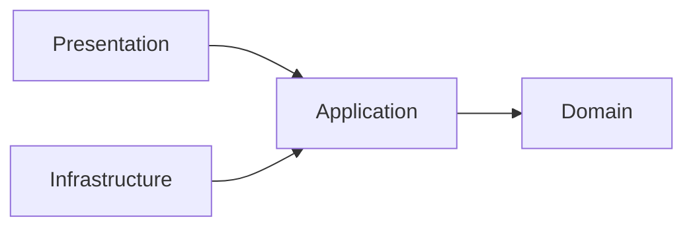
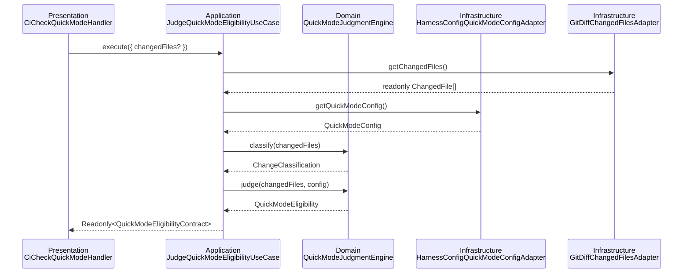
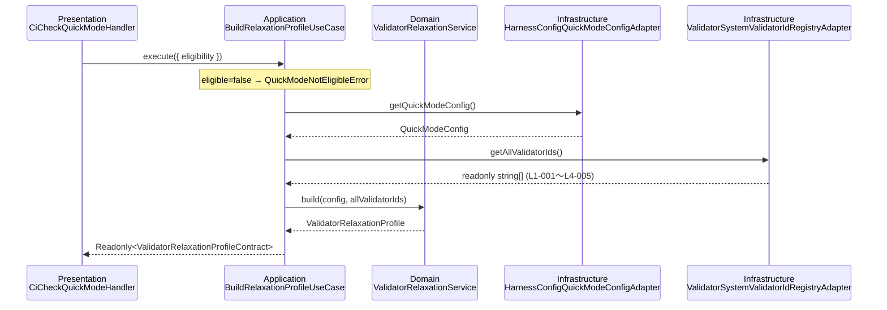
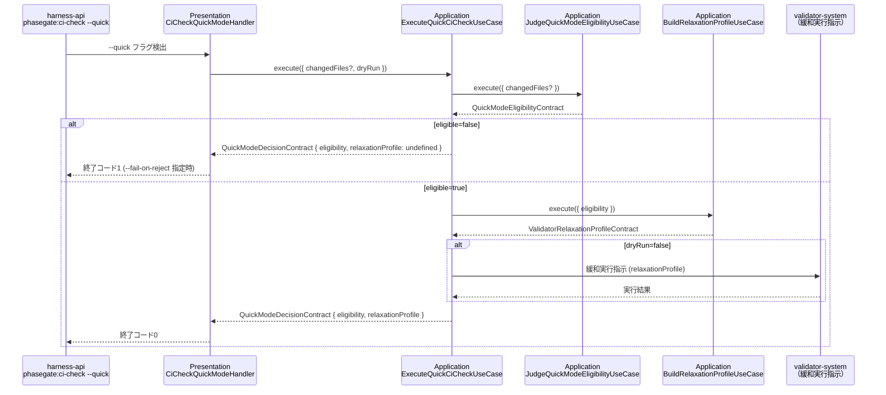

# 論理設計: quick-mode

## WI-086 / WI-087 Quick Mode Hook Visibility

<!-- @work-item-id WI-086, WI-087 -->

Quick Mode remains a narrow bypass for low-risk categories while hook execution still emits an observable allow/deny outcome. This avoids silent no-op behavior when workspace detection or hook configuration changes the target file set.

@work-item-id WI-140
Quick Mode の validator ID registry / relaxation profile は `L2-013 cli-e2e-test-existence`, `L2-014 work-item-status-staleness`, `L2-015 contract-traceability-coverage` を正規 L2 validator として含める。既定の maintainedLayers では L2-014 を維持し、L2-013 / L2-015 は Quick Mode の緩和対象として明示的に skipped に入れる。

@story-id H10-01
@story-id H10-02
@story-id H10-03
> **Unit ID**: quick-mode
> **作成日**: 2026-03-19
> **対応ストーリー**: H10-01, H10-02, H10-03
> **Wave**: 2（コア品質機構）
> **前提ドキュメント**:
> - `docs/product/construction/quick-mode/domain_model.md`
> - `docs/product/units/integration_contract.md`
> - `docs/inception/_shared/cross_cutting_decisions.md`
> - `docs/principles/architecture-philosophy.md`

---

## 1. アーキテクチャ概要

### 1.1 層構成と責務

| 層 | 責務 | 主な構成要素 | 依存先 |
|----|------|-------------|--------|
| Domain | `QuickModeJudgmentEngine` による変更分類・拒否ルール評価、`ValidatorRelaxationService` による緩和プロファイル生成、各値オブジェクトの不変条件保持 | 値オブジェクト、ドメインサービス、ドメインポート | なし |
| Application | ストーリー単位のユースケース調停。ChangedFile[] の受け取りから `QuickModeDecision` の組立まで。Shared Kernel DTOへの投影 | UseCase、DTO、Mapper | Domain |
| Infrastructure | ドメインポートの実装。git diff解析による `ChangedFile[]` 供給、`HarnessConfigV2` からの設定読み取り、`ValidatorIdRegistry` への問い合わせ | Adapter | Application, Domain |
| Presentation | `phasegate:ci-check --quick` の引数解析、Quick Mode判定結果の出力整形、終了コード決定。harness-api から呼ばれる薄い境界 | CLI handler、formatter | Application, Domain |

### 1.2 依存方向

`cross_cutting_decisions.md §2` のレイヤー語彙と `integration_contract.md §2` の Layer依存方向に従い、依存方向を以下に固定する。



```text
domain <- application <- infrastructure
domain <- application <- presentation
```

- Domain層は外部I/Oに依存しない（純粋な計算処理）
- Application層はDomainモデルの調停に徹し、I/O実装を持たない
- Infrastructure層は `domain/ports/` のみを実装し、CLIロジックを持たない
- Presentation層はApplication層経由でのみDomainを利用する
- quick-modeが公開する契約は `scripts/harness/shared-kernel/quick-mode.ts` から再エクスポートする

### 1.3 ディレクトリ構成（全ファイル一覧）

Wave 2の quick-mode 実装は `scripts/harness/quick-mode/` 配下に4層で配置し、公開面のみ `scripts/harness/shared-kernel/quick-mode.ts` へ再エクスポートする。

```text
scripts/harness/
├── shared-kernel/
│   └── quick-mode.ts
└── quick-mode/
    ├── domain/
    │   ├── value-objects/
    │   │   ├── quick-mode-config.ts
    │   │   ├── changed-file.ts
    │   │   ├── change-category.ts
    │   │   ├── change-classification.ts
    │   │   ├── quick-mode-eligibility.ts
    │   │   ├── validator-relaxation-profile.ts
    │   │   └── quick-mode-decision.ts
    │   ├── types/
    │   │   ├── change-kind.ts
    │   │   └── rejection-rule.ts
    │   ├── services/
    │   │   ├── quick-mode-judgment-engine.ts
    │   │   ├── comment-only-diff-detector.ts
    │   │   └── validator-relaxation-service.ts
    │   └── ports/
    │       ├── changed-files-port.ts
    │       ├── quick-mode-config-port.ts
    │       └── validator-id-registry-port.ts
    ├── application/
    │   ├── dto/
    │   │   ├── quick-mode-decision-contract.ts
    │   │   ├── quick-mode-eligibility-contract.ts
    │   │   ├── validator-relaxation-profile-contract.ts
    │   │   ├── judge-quick-mode-eligibility-input.ts
    │   │   ├── build-relaxation-profile-input.ts
    │   │   └── execute-quick-ci-check-input.ts
    │   ├── mappers/
    │   │   └── quick-mode-decision-contract-mapper.ts
    │   └── usecases/
    │       ├── judge-quick-mode-eligibility-usecase.ts
    │       ├── build-relaxation-profile-usecase.ts
    │       └── execute-quick-ci-check-usecase.ts
    ├── infrastructure/
    │   └── adapters/
    │       ├── git-diff-changed-files-adapter.ts
    │       ├── harness-config-quick-mode-config-adapter.ts
    │       └── validator-system-validator-id-registry-adapter.ts
    └── presentation/
        ├── dto/
        │   └── quick-mode-render-options.ts
        ├── formatters/
        │   ├── human-quick-mode-formatter.ts
        │   ├── agent-quick-mode-formatter.ts
        │   └── json-quick-mode-formatter.ts
        └── handlers/
            └── ci-check-quick-mode-handler.ts
```

テスト配置:

```text
scripts/harness/__tests__/
├── unit/
│   └── quick-mode/
│       ├── domain/
│       │   ├── value-objects/
│       │   │   ├── quick-mode-config.test.ts
│       │   │   ├── changed-file.test.ts
│       │   │   ├── change-category.test.ts
│       │   │   ├── change-classification.test.ts
│       │   │   ├── quick-mode-eligibility.test.ts
│       │   │   ├── validator-relaxation-profile.test.ts
│       │   │   └── quick-mode-decision.test.ts
│       │   └── services/
│       │       ├── quick-mode-judgment-engine.test.ts
│       │       └── validator-relaxation-service.test.ts
│       └── application/
│           ├── usecases/
│           │   ├── judge-quick-mode-eligibility-usecase.test.ts
│           │   ├── build-relaxation-profile-usecase.test.ts
│           │   └── execute-quick-ci-check-usecase.test.ts
│           └── mappers/
│               └── quick-mode-decision-contract-mapper.test.ts
└── integration/
    └── quick-mode/
        ├── git-diff-changed-files-adapter.test.ts
        ├── harness-config-quick-mode-config-adapter.test.ts
        └── validator-system-validator-id-registry-adapter.test.ts
```

---

## 2. Domain層設計

### 2.1 ステートレス設計の方針

`domain_model.md §2`・`cross_cutting_decisions.md §6` に従い、quick-mode は集約を持たない。ドメインロジックは値オブジェクトとドメインサービスで完結する純粋な計算処理であり、永続化境界を必要としない。

- `QuickModeJudgmentEngine`: `ChangedFile[] + QuickModeConfig → QuickModeEligibility` の変換
- `CommentOnlyDiffDetector`: `ChangedFile.beforeContent/afterContent` からコメント・空白のみの差分を判定
- `ValidatorRelaxationService`: `QuickModeConfig + ValidatorId[] → ValidatorRelaxationProfile` の変換
- 両サービスとも副作用なし。ポートへのアクセスは Application 層が調停する

<!-- @work-item-id WI-015 -->
### 2.3 コメントのみ API パス編集の扱い

`QuickModeJudgmentEngine` は分類時に `CommentOnlyDiffDetector` を先に評価する。`*port.ts` / `*adapter.ts` でも、content 付きの差分がコメント・空白のみなら `docs` として扱い、`API_CONTRACT` 拒否対象から除外する。content がない変更は従来通り path-only の `api` 判定を維持する。

### 2.2 値オブジェクト群

#### 2.2.1 QuickModeConfig

`HarnessConfigV2.quickMode` セクションから生成される設定値オブジェクト。

| 属性 | 型 | 説明 |
|------|----|------|
| allowedCategories | `readonly ChangeCategory[]` | Quick Mode適用を許可するカテゴリ一覧 |
| maintainedLayers | `readonly string[]` | Quick Mode実行時も維持するレイヤーID（例: `["L1", "L2-002", "L2-003", "L3-001"]`） |
| relaxedGates | `readonly string[]` | 緩和するゲートID（例: `["L2-001", "L3-002", "L3-003", "L3-004", "L4"]`） |

**生成ルール**

- `allowedCategories` は空でないこと。空配列は `QuickModeConfigError`
- `maintainedLayers` と `relaxedGates` の和集合が全 ValidatorId を超えてはならない
- `Object.freeze()` で凍結する

**メソッド**

- `static create(raw: { allowedCategories: string[]; maintainedLayers: string[]; relaxedGates: string[] }): QuickModeConfig`
- `isAllowed(category: ChangeCategory): boolean`
- `isMaintained(validatorId: string): boolean`
- `isRelaxed(validatorId: string): boolean`
- `equals(other: QuickModeConfig): boolean`

**バリデーションルール**

- `allowedCategories` に `'domain'` / `'api'` / `'feature'` は含められない（これらは常に拒否対象のため設定不可）
- ランタイム不正は `QuickModeConfigError` として domain 内エラーとする

#### 2.2.2 ChangedFile

変更ファイル1件を表す値オブジェクト。

| 属性 | 型 | 説明 |
|------|----|------|
| filePath | `string` | ワークスペース相対パス（例: `scripts/harness/quick-mode/domain/services/quick-mode-judgment-engine.ts`） |
| changeKind | `ChangeKind` | `'CREATE' \| 'MODIFY' \| 'DELETE'` |

**生成ルール**

- `filePath` は空文字でないこと。末尾スラッシュを含まないこと
- `changeKind` は `ChangeKind` の正規値のみ許容する

**メソッド**

- `static create(filePath: string, changeKind: ChangeKind): ChangedFile`
- `isUnder(directoryPrefix: string): boolean` — `filePath` が指定ディレクトリ配下か判定
- `hasExtension(ext: string): boolean` — 拡張子一致判定
- `matchesPattern(pattern: string): boolean` — glob/suffix パターン一致判定
- `equals(other: ChangedFile): boolean`

**バリデーションルール**

- `cross_cutting_decisions.md §4` の方針に従い、`FilePath` をShared Kernelに載せないためローカル VO として定義する
- ファイルパスの正規化（`.` / `..` 解決）は Adapter 側で実施し、Domain は正規化済みパスを受け取る

#### 2.2.3 ChangeCategory

変更カテゴリを表す列挙型に近い値オブジェクト。

| 値 | 説明 |
|----|------|
| `'bugfix'` | 既存実装ファイルの修正（domain/以外, changeKind=MODIFY） |
| `'docs'` | `docs/` 配下のファイル変更 |
| `'test'` | `__tests__/` 配下 or `*.test.ts` or `*.spec.ts` |
| `'config'` | `*.config.json` / `*.config.ts` / `phasegate.config.json` |
| `'feature'` | 新規実装ファイル追加（domain/ / port/ 以外, changeKind=CREATE） |
| `'domain'` | `domain/` 配下のファイル（CREATE / MODIFY / DELETE） |
| `'api'` | Port/Adapterインターフェースファイル（`*port.ts`, `*adapter.ts`） |

**メソッド**

- `static fromString(raw: string): ChangeCategory`
- `isQuickModeRejectable(): boolean` — `'domain' | 'feature' | 'api'` を返す
- `toString(): string`
- `equals(other: ChangeCategory): boolean`

**バリデーションルール**

- 上記7値以外は `UnknownChangeCategoryError`
- 大文字・小文字は区別しない（正規化して比較する）

#### 2.2.4 ChangeClassification

`ChangedFile[]` の分類結果を表す値オブジェクト。

| 属性 | 型 | 説明 |
|------|----|------|
| dominantCategory | `ChangeCategory \| null` | 最高リスクカテゴリ（拒否対象が含まれる場合に非null） |
| categorizedFiles | `ReadonlyMap<string, readonly ChangedFile[]>` | カテゴリ別ファイル一覧（ChangeCategory.toString() をキーとする） |
| totalFiles | `number` | 変更ファイル総数 |

**生成ルール**

- `QuickModeJudgmentEngine` 内部で生成する。直接インスタンス化は禁止
- `dominantCategory` はリスク順（`api` > `domain` > `feature` > `bugfix` / `test` / `docs` / `config`）で最高値を選択する
- 1つのファイルが複数カテゴリに該当する場合は最高リスクカテゴリに分類する

**メソッド**

- `getFiles(category: ChangeCategory): readonly ChangedFile[]`
- `hasCategory(category: ChangeCategory): boolean`
- `hasAnyRejectable(): boolean` — `'domain' | 'feature' | 'api'` のいずれかが含まれるか
- `equals(other: ChangeClassification): boolean`

#### 2.2.5 QuickModeEligibility

Quick Mode適用可否の判定結果。

| 属性 | 型 | 説明 |
|------|----|------|
| eligible | `boolean` | Quick Mode適用可否 |
| reason | `string` | 判定理由の人間可読説明 |
| rejectionRule | `RejectionRule \| undefined` | 拒否時の根拠ルール識別子 |
| rejectedFiles | `readonly ChangedFile[] \| undefined` | 拒否の原因となったファイル一覧 |

**補助型 RejectionRule**

```text
'MIXED_CHANGES' | 'NEW_DOMAIN' | 'API_CONTRACT'
```

**生成ルール**

- `eligible=true` の場合は `rejectionRule` / `rejectedFiles` は `undefined`
- `eligible=false` の場合は `rejectionRule` と `rejectedFiles` の両方が必須
- `Object.freeze()` で凍結する

**ファクトリメソッド**

- `static eligible(reason: string): QuickModeEligibility`
- `static rejected(rule: RejectionRule, reason: string, rejectedFiles: readonly ChangedFile[]): QuickModeEligibility`
- `isEligible(): boolean`
- `equals(other: QuickModeEligibility): boolean`

**不変条件**

- `INV-E1`: `eligible=true` のとき `rejectionRule === undefined` かつ `rejectedFiles === undefined`
- `INV-E2`: `eligible=false` のとき `rejectionRule !== undefined` かつ `rejectedFiles.length >= 1`
- `INV-E3`: `reason` は空文字でないこと

#### 2.2.6 ValidatorRelaxationProfile

Quick Mode時のバリデータ実行構成を表す値オブジェクト。

| 属性 | 型 | 説明 |
|------|----|------|
| levelDependencyRelaxed | `false` | Level間依存の非緩和保証（常に `false`） |
| l1 | `{ all: true }` | L1は全維持 |
| l2 | `{ maintained: readonly string[]; skipped: readonly string[] }` | L2の維持/スキップ宣言 |
| l3 | `{ maintained: readonly string[]; skipped: readonly string[] }` | L3の維持/スキップ宣言 |
| l4 | `{ all: false }` | L4は全スキップ |
| phaseExecution | `{ twoPhaseRequired: false }` | 2-Phase Execution緩和 |

**デフォルト緩和プロファイル**（設定がデフォルト値の場合）:

| レイヤー | 維持 | スキップ |
|---------|------|---------|
| L1 | 全8ルール（L1-001〜L1-008） | なし |
| L2 | L2-002（metadata）, L2-003（test-quality） | L2-001（phase-gate） |
| L3 | L3-001（security） | L3-002（performance）, L3-003（coverage）, L3-004（nyquist） |
| L4 | なし | 全5ルール（L4-001〜L4-005） |

**生成ルール**

- `levelDependencyRelaxed` は型システムで `false` リテラル型を指定し、`true` を代入不可にする
- `l2.maintained` と `l2.skipped` の和集合が `["L2-001", "L2-002", "L2-003", "L2-013", "L2-014", "L2-015"]` と一致すること
- `l3.maintained` と `l3.skipped` の和集合が `["L3-001", "L3-002", "L3-003", "L3-004"]` と一致すること
- `Object.freeze()` を再帰的に適用する

**メソッド**

- `static createDefault(): ValidatorRelaxationProfile`
- `static create(params: { l2: { maintained: string[]; skipped: string[] }; l3: { maintained: string[]; skipped: string[] } }): ValidatorRelaxationProfile`
- `isMaintained(validatorId: string): boolean`
- `isSkipped(validatorId: string): boolean`
- `equals(other: ValidatorRelaxationProfile): boolean`

**不変条件**

- `INV-P1`: `levelDependencyRelaxed` は常に `false`
- `INV-P2`: `l1.all` は常に `true`（L1緩和は禁止）
- `INV-P3`: `l4.all` は常に `false`（L4は全スキップ）
- `INV-P4`: `phaseExecution.twoPhaseRequired` は常に `false`
- `INV-P5`: `l2.maintained ∪ l2.skipped = {L2-001, L2-002, L2-003, L2-013, L2-014, L2-015}`
- `INV-P6`: `l3.maintained ∪ l3.skipped = {L3-001, L3-002, L3-003, L3-004}`

#### 2.2.7 QuickModeDecision

最終判定の複合値オブジェクト。

| 属性 | 型 | 説明 |
|------|----|------|
| eligibility | `QuickModeEligibility` | 適用可否判定結果 |
| relaxationProfile | `ValidatorRelaxationProfile \| undefined` | 緩和プロファイル（eligible=trueの場合のみ非undefined） |

**ファクトリメソッド**

- `static approved(eligibility: QuickModeEligibility, profile: ValidatorRelaxationProfile): QuickModeDecision`
- `static rejected(eligibility: QuickModeEligibility): QuickModeDecision`
- `isApproved(): boolean`
- `equals(other: QuickModeDecision): boolean`

**不変条件**

- `INV-D1`: `eligibility.eligible=false` のとき `relaxationProfile === undefined`
- `INV-D2`: `eligibility.eligible=true` のとき `relaxationProfile !== undefined`

### 2.3 ドメインサービス

#### 2.3.1 QuickModeJudgmentEngine

**責務**: `ChangedFile[]` を `ChangeClassification` に変換し、3拒否ルールを評価して `QuickModeEligibility` を返す。

**コンストラクタ依存**

- なし（純粋な計算処理）

##### `classify(changedFiles: readonly ChangedFile[]): ChangeClassification`

- 入力: `changedFiles: readonly ChangedFile[]`
- 出力: `ChangeClassification`
- 処理フロー:
  1. 空配列の場合は空の `ChangeClassification` を返す（`dominantCategory=null`）
  2. 各 `ChangedFile` に対し `filePath` と `changeKind` のパターンマッチングを実行してカテゴリを決定する
  3. カテゴリ別に `Map<string, ChangedFile[]>` を構築する
  4. リスク順（`api` > `domain` > `feature` > その他）で `dominantCategory` を決定する
  5. `ChangeClassification` を生成して返す
- 例外: なし
- 不変条件: 決定論的（同一入力に対して同一出力）

##### `judge(changedFiles: readonly ChangedFile[], config: QuickModeConfig): QuickModeEligibility`

- 入力: `changedFiles: readonly ChangedFile[]`, `config: QuickModeConfig`
- 出力: `QuickModeEligibility`
- 処理フロー:
  1. `classify(changedFiles)` を呼び `ChangeClassification` を取得する
  2. **MIXED_CHANGES評価**: `allowedCategories` 外のカテゴリが含まれる場合は `QuickModeEligibility.rejected('MIXED_CHANGES', ...)` を返す
  3. **NEW_DOMAIN評価**: `domain/` 配下かつ `changeKind=CREATE` のファイルが含まれる場合は `QuickModeEligibility.rejected('NEW_DOMAIN', ...)` を返す
  4. **API_CONTRACT評価**: `*port.ts` / `*adapter.ts` の変更が含まれる場合は `QuickModeEligibility.rejected('API_CONTRACT', ...)` を返す
  5. 全ルールを通過した場合は `QuickModeEligibility.eligible(...)` を返す
- 例外: `QuickModeConfigError`（設定不正の場合）
- 不変条件:
  - 評価順序は `MIXED_CHANGES → NEW_DOMAIN → API_CONTRACT` の固定順
  - 3拒否ルールは `config.allowedCategories` で上書きできない（ハードコード）

#### 2.3.2 ValidatorRelaxationService

**責務**: `QuickModeConfig` と全 `ValidatorId[]` から `ValidatorRelaxationProfile` を生成する。

**コンストラクタ依存**

- なし（純粋な計算処理）

##### `build(config: QuickModeConfig, allValidatorIds: readonly string[]): ValidatorRelaxationProfile`

- 入力: `config: QuickModeConfig`, `allValidatorIds: readonly string[]`
- 出力: `ValidatorRelaxationProfile`
- 処理フロー:
  1. `allValidatorIds` から L2 の ID 一覧（`L2-*`）を抽出する
  2. `config.isMaintained(id)` で各 L2 ID を振り分け、maintained / skipped リストを構築する
  3. `allValidatorIds` から L3 の ID 一覧（`L3-*`）を抽出する
  4. `config.isMaintained(id)` で各 L3 ID を振り分け、maintained / skipped リストを構築する
  5. `levelDependencyRelaxed: false`, `l1: { all: true }`, `l4: { all: false }`, `phaseExecution: { twoPhaseRequired: false }` を固定値として設定する
  6. `ValidatorRelaxationProfile.create({ l2: { maintained, skipped }, l3: { maintained, skipped } })` を返す
- 例外: なし。分類できない ID は無視する
- 不変条件:
  - `INV-P1` 〜 `INV-P6` を満たすこと
  - L1 / L4 の設定は `config` によらず固定値

### 2.4 ドメインイベント

Wave 2 ではドメインイベント基盤を実装しない。`domain_model.md §2` に従い、quick-mode はステートレスな判定エンジンであり、イベントキューを持たない。

---

## 3. Domain層ポート設計

ポートは全て `scripts/harness/quick-mode/domain/ports/` に定義し、Infrastructure層が実装する。

### 3.1 ChangedFilesPort

```typescript
export interface ChangedFilesPort {
  getChangedFiles(): Promise<readonly ChangedFile[]>;
}
```

| メソッド | 入力 | 出力 | 説明 |
|---------|------|------|------|
| `getChangedFiles` | なし | `Promise<readonly ChangedFile[]>` | git diff（staged または HEAD比較）から変更ファイル一覧を取得する |

**設計上の注意点**

- Domain は git の存在を知らない。ポートのみを介して `ChangedFile[]` を受け取る
- 戻り値は Domain が理解できる `ChangedFile` の readonly 配列に限定する
- git が利用不可な環境では空配列を返すのではなく Adapter 例外を投げる

### 3.2 QuickModeConfigPort

```typescript
export interface QuickModeConfigPort {
  getQuickModeConfig(): Promise<QuickModeConfig>;
}
```

| メソッド | 入力 | 出力 | 説明 |
|---------|------|------|------|
| `getQuickModeConfig` | なし | `Promise<QuickModeConfig>` | `HarnessConfigV2.quickMode` セクションを読み取り、`QuickModeConfig` VO を生成して返す |

**設計上の注意点**

- `HarnessConfigV2` の解析は Adapter 側で実施する
- `quickMode` セクションが存在しない場合はデフォルト設定（`allowedCategories: ['bugfix', 'docs', 'test', 'config']`）を返す

### 3.3 ValidatorIdRegistryPort

```typescript
export interface ValidatorIdRegistryPort {
  getAllValidatorIds(): Promise<readonly string[]>;
}
```

| メソッド | 入力 | 出力 | 説明 |
|---------|------|------|------|
| `getAllValidatorIds` | なし | `Promise<readonly string[]>` | validator-system が公開する全 ValidatorId（L1-001〜L4-005）の一覧を返す |

**設計上の注意点**

- quick-mode は `integration_contract.md §9` のバリデータID一覧を静的に知らない。`ValidatorIdRegistryPort` 経由で参照することで validator-system への実装時依存を避ける
- 戻り値は `readonly string[]`。内部ソートは Adapter 側に委ねる

### 3.4 ValidatorExecutionPort

```typescript
export interface ValidatorExecutionPort {
  executeWithProfile(profile: ValidatorRelaxationProfileContract): Promise<void>;
}
```

| メソッド | 入力 | 出力 | 説明 |
|---------|------|------|------|
| `executeWithProfile` | `profile: ValidatorRelaxationProfileContract` | `Promise<void>` | validator-system に緩和プロファイルを渡して検証を実行する |

**設計上の注意点**

- `dryRun=false` の場合のみ呼ばれる。`dryRun=true` の場合は `ExecuteQuickCiCheckUseCase` がこのポートを呼ばない
- このポートの実装（Adapter）は validator-system の公開インターフェースに依存する。Wave 2 では stub または静的実装を許容する
- ポートの戻り値は `void`。実行結果（pass/fail）の取得は将来拡張として予約する

### 3.5 ポート設計上のルール

- Port の戻り値は Domain が理解できる値オブジェクトかプリミティブに限定する
- Port は git API / ファイルシステム / validator-system モジュールを露出しない
- Port 呼び出しの制御は Application 層の UseCase が行い、Domain サービスは Port を直接参照しない

---

## 4. Application層設計

### 4.1 DTO / Mapper方針

| 要素 | 役割 |
|------|------|
| `QuickModeDecisionContract` | Shared Kernel公開用 readonly DTO（harness-api向け） |
| `QuickModeEligibilityContract` | eligibility の公開 DTO |
| `ValidatorRelaxationProfileContract` | validator-system向け緩和プロファイル公開 DTO |
| `QuickModeDecisionContractMapper` | `QuickModeDecision` を `QuickModeDecisionContract` に投影 |

Shared Kernel DTO は Application 層でのみ生成する。Domain 層は内部 VO を維持し、他 Unit へ直接露出しない。

### 4.2 JudgeQuickModeEligibilityUseCase（H10-01対応）

**責務**: `ChangedFile[]` を受け取り、Quick Mode適用可否を判定して `QuickModeEligibility` の DTO を返す。

**コンストラクタ依存**

- `changedFilesPort: ChangedFilesPort`
- `quickModeConfigPort: QuickModeConfigPort`
- `judgmentEngine: QuickModeJudgmentEngine`

**入力**

`JudgeQuickModeEligibilityInput`

| 項目 | 型 | 必須 | 説明 |
|------|----|------|------|
| changedFiles | `readonly { filePath: string; changeKind: string }[] \| undefined` | No | 明示的なファイル指定。省略時はポート経由で自動取得 |

**出力**: `Readonly<QuickModeEligibilityContract>`

```typescript
interface QuickModeEligibilityContract {
  readonly eligible: boolean;
  readonly reason: string;
  readonly rejectionRule?: 'MIXED_CHANGES' | 'NEW_DOMAIN' | 'API_CONTRACT';
  readonly rejectedFiles?: readonly { filePath: string; changeKind: string }[];
}
```

**処理フロー**

1. `changedFiles` が明示指定されている場合は `ChangedFile.create()` で VO 化する。未指定の場合は `changedFilesPort.getChangedFiles()` を呼ぶ
2. `quickModeConfigPort.getQuickModeConfig()` で設定を取得する
3. `judgmentEngine.judge(changedFiles, config)` を呼び `QuickModeEligibility` を取得する
4. `QuickModeDecisionContractMapper.toEligibilityContract()` で DTO に変換する
5. `Object.freeze()` 済みの DTO を返す

**例外**

- `UnknownChangeCategoryError`（ファイルカテゴリが不明の場合）
- `QuickModeConfigError`（設定不正の場合）
- Port 呼び出し失敗

### 4.3 BuildRelaxationProfileUseCase（H10-02対応）

**責務**: `eligible=true` が確定した場合に `ValidatorRelaxationProfile` を生成して返す。H10-02 は H10-01 の後続処理として呼ばれる。

**コンストラクタ依存**

- `quickModeConfigPort: QuickModeConfigPort`
- `validatorIdRegistryPort: ValidatorIdRegistryPort`
- `relaxationService: ValidatorRelaxationService`

**入力**

`BuildRelaxationProfileInput`

| 項目 | 型 | 必須 | 説明 |
|------|----|------|------|
| eligibility | `QuickModeEligibilityContract` | Yes | H10-01 の出力。eligible=false の場合は即時エラー |

**出力**: `Readonly<ValidatorRelaxationProfileContract>`

```typescript
interface ValidatorRelaxationProfileContract {
  readonly levelDependencyRelaxed: false;
  readonly l1: { readonly all: true };
  readonly l2: {
    readonly maintained: readonly string[];
    readonly skipped: readonly string[];
  };
  readonly l3: {
    readonly maintained: readonly string[];
    readonly skipped: readonly string[];
  };
  readonly l4: { readonly all: false };
  readonly phaseExecution: { readonly twoPhaseRequired: false };
}
```

**処理フロー**

1. `eligibility.eligible === false` の場合は `QuickModeNotEligibleError` を投げる
2. `quickModeConfigPort.getQuickModeConfig()` で設定を取得する
3. `validatorIdRegistryPort.getAllValidatorIds()` で全 ValidatorId を取得する
4. `relaxationService.build(config, allValidatorIds)` で `ValidatorRelaxationProfile` を生成する
5. `QuickModeDecisionContractMapper.toRelaxationProfileContract()` で DTO に変換する
6. `Object.freeze()` を再帰的に適用して返す

**例外**

- `QuickModeNotEligibleError`（`eligible=false` の eligibility を受け取った場合）
- Port 呼び出し失敗

**`INV-D1` / `INV-D2` 適用**: eligible=false の入力に対してプロファイルを生成しない保証はこの UseCase が担う

### 4.4 ExecuteQuickCiCheckUseCase（H10-03対応）

**責務**: `phasegate:ci-check --quick` の実行フロー全体を調停する。H10-01（適用可否判定）→ H10-02（緩和プロファイル生成）→ validator-system への緩和指示の流れを統合する。

**コンストラクタ依存**

- `judgeQuickModeEligibilityUseCase: JudgeQuickModeEligibilityUseCase`
- `buildRelaxationProfileUseCase: BuildRelaxationProfileUseCase`
- `contractMapper: QuickModeDecisionContractMapper`
- `validatorExecutionPort: ValidatorExecutionPort`

**入力**

`ExecuteQuickCiCheckInput`

| 項目 | 型 | 必須 | 説明 |
|------|----|------|------|
| changedFiles | `readonly { filePath: string; changeKind: string }[] \| undefined` | No | 明示的なファイル指定。省略時は自動取得 |
| dryRun | `boolean` | No | `true` の場合、緩和プロファイルを生成するが validator-system へは実際に指示しない |

**出力**: `Readonly<QuickModeDecisionContract>`

```typescript
interface QuickModeDecisionContract {
  readonly eligibility: QuickModeEligibilityContract;
  readonly relaxationProfile?: ValidatorRelaxationProfileContract;
}
```

**処理フロー**

1. `judgeQuickModeEligibilityUseCase.execute({ changedFiles })` を呼び `eligibility` を取得する
2. `eligibility.eligible === false` の場合は `QuickModeDecisionContract { eligibility, relaxationProfile: undefined }` を返す
3. `eligibility.eligible === true` の場合は `buildRelaxationProfileUseCase.execute({ eligibility })` を呼び `relaxationProfile` を取得する
4. `dryRun=false` の場合は `relaxationProfile` を validator-system の緩和実行インターフェースへ渡す（H10-03 の主要責務）
5. `contractMapper.toDecisionContract({ eligibility, relaxationProfile })` で統合 DTO を生成する
6. 返却する

**例外**

- `JudgeQuickModeEligibilityUseCase` / `BuildRelaxationProfileUseCase` が投げる例外
- validator-system への緩和指示失敗（Infrastructure 経由）

**設計判断**: `dryRun` フラグによる副作用の制御は Application 層で行い、validator-system の実行制御ロジックを Presentation 層に漏洩させない

---

## 5. Infrastructure層設計

### 5.1 GitDiffChangedFilesAdapter

**実装ポート**: `ChangedFilesPort`

**ファイルパス**: `scripts/harness/quick-mode/infrastructure/adapters/git-diff-changed-files-adapter.ts`

**利用ライブラリ**

- `node:child_process` (execSync / spawnSync)
- `node:path`

**実装方針**

- `git diff --name-status --cached HEAD` を実行し、staged 変更ファイル一覧を取得する
- 出力の各行を `<kind>\t<path>` 形式でパースし、`ChangedFile.create()` に変換する
- `M → MODIFY`, `A → CREATE`, `D → DELETE`, `R → MODIFY`（rename は移動先のみ）のマッピングを行う
- git が利用不可（`git: command not found` / 非 git ディレクトリ）の場合は `GitNotAvailableError` を投げる
- ファイルパスは workspace root からの相対パスに正規化する（`../` 等を解決する）

**外部I/O詳細**

| I/O | 詳細 |
|-----|------|
| 入力 | `git diff --name-status --cached HEAD` の stdout |
| 出力 | `readonly ChangedFile[]` |
| 失敗 | 非 git ディレクトリ: `GitNotAvailableError` / git コマンド失敗: `GitCommandError` |

### 5.2 HarnessConfigQuickModeConfigAdapter

**実装ポート**: `QuickModeConfigPort`

**ファイルパス**: `scripts/harness/quick-mode/infrastructure/adapters/harness-config-quick-mode-config-adapter.ts`

**利用ライブラリ**

- `node:fs/promises`
- `node:path`

**実装方針**

- `phasegate.config.json` を読み取り、`HarnessConfigV2` 型として JSON パースする
- `HarnessConfigV2.quickMode` セクションを取得する
- `quickMode` セクションが存在しない場合はデフォルト値（`allowedCategories: ['bugfix', 'docs', 'test', 'config']`, `maintainedLayers: ['L1', 'L2-002', 'L2-003', 'L3-001']`, `relaxedGates: ['L2-001', 'L3-002', 'L3-003', 'L3-004', 'L4']`）を使用する
- `QuickModeConfig.create()` に変換して返す

**外部I/O詳細**

| I/O | 詳細 |
|-----|------|
| 入力 | `phasegate.config.json`（workspace root） |
| 出力 | `QuickModeConfig` |
| 失敗 | ファイル不在: `HarnessConfigNotFoundError` / JSON パース失敗: `HarnessConfigParseError` |

### 5.3 ValidatorSystemValidatorIdRegistryAdapter

**実装ポート**: `ValidatorIdRegistryPort`

**ファイルパス**: `scripts/harness/quick-mode/infrastructure/adapters/validator-system-validator-id-registry-adapter.ts`

**利用ライブラリ**

- なし（静的定義またはモジュール参照）

**実装方針**

- Wave 2 では validator-system の確定 ID 一覧（L1-001〜L4-005）を静的定義として保持する
- validator-system の正式 Registry が整備された段階でこの Adapter の内部実装のみを差し替える
- 静的リストは `L1-001, L1-002, ..., L1-008, L2-001, L2-002, L2-003, L2-013, L2-014, L2-015, L3-001, L3-002, L3-003, L3-004, L4-001, L4-002, L4-003, L4-004, L4-005` で構成する

**外部I/O詳細**

| I/O | 詳細 |
|-----|------|
| 入力 | なし（静的定義） |
| 出力 | `readonly string[]`（ValidatorId一覧） |
| 失敗 | なし（静的定義は常に成功） |

---

## 6. Presentation層設計

### 6.1 前提

quick-mode は `integration_contract.md §3.1` のトップレベル CLI コマンドの所有者ではない。`phasegate:ci-check --quick` コマンドは harness-api が所有し、本 Unit の Presentation 層はその内部から呼ばれる CLI handler / formatter を提供する。

### 6.2 CiCheckQuickModeHandler

**ファイル**: `scripts/harness/quick-mode/presentation/handlers/ci-check-quick-mode-handler.ts`

**役割**

- `phasegate:ci-check --quick` フラグを受け取り、`ExecuteQuickCiCheckUseCase` を呼ぶ入口
- 判定結果（`QuickModeDecisionContract`）を指定フォーマットで出力する
- 終了コードを決定する

**引数**

| 引数 | 必須 | 説明 |
|------|------|------|
| `--quick` | Yes | Quick Mode フラグ（本 handler の呼び出し前提条件） |
| `--files <paths...>` | No | 明示的なファイル指定。省略時は git diff から自動取得 |
| `--dry-run` | No | 緩和プロファイルの生成のみ。validator-system への実行指示なし |
| `--format <human\|agent\|json>` | No | 出力形式。既定は `human` |
| `--fail-on-reject` | No | `eligible=false` の場合に終了コード1を返す（CI用途） |

**処理フロー**

1. `--files` の有無に応じて `ExecuteQuickCiCheckInput` を構築する
2. `executeQuickCiCheckUseCase.execute(input)` を呼ぶ
3. `--format` に応じて formatter を選択する
4. 判定結果を stdout に出力する
5. `--fail-on-reject` と `eligibility.eligible` の組み合わせで終了コードを決定する

**終了コード**

| コード | 意味 |
|------|------|
| 0 | Quick Mode適用承認（eligible=true）または `--fail-on-reject` 未指定 |
| 1 | `--fail-on-reject` 指定かつ `eligible=false`（Quick Mode拒否） |
| 2 | 入力不正、Port実行失敗、UseCase例外 |

### 6.3 Formatter設計

| Formatter | 用途 | 出力先 |
|-----------|------|--------|
| `HumanQuickModeFormatter` | 開発者向けコンソール表示（eligibility / rejection reason / profile summary） | stdout |
| `AgentQuickModeFormatter` | AIエージェント向け詳細テキスト（rejectedFiles / skipped validators の詳細） | stdout |
| `JsonQuickModeFormatter` | JSON出力（`QuickModeDecisionContract` を整形して出力） | stdout |

**Formatter共通ルール**

- Formatter は `QuickModeDecisionContract` のみを受け取り、Application / Infrastructure へ依存しない
- 同一入力に対して決定論的な文字列を返す
- 出力は改行コード `\n` で終端する

#### 6.3.1 HumanQuickModeFormatter 出力例

```text
Quick Mode 判定: ✗ 拒否
ルール: MIXED_CHANGES
理由: allowedCategories外のファイルが含まれています
拒否対象ファイル:
  - scripts/harness/quick-mode/domain/value-objects/changed-file.ts (domain, MODIFY)
```

```text
Quick Mode 判定: ✓ 承認
緩和プロファイル:
  L1: 全維持 (L1-001〜L1-008)
  L2: 維持=[L2-002, L2-003] / スキップ=[L2-001]
  L3: 維持=[L3-001] / スキップ=[L3-002, L3-003, L3-004]
  L4: 全スキップ
  2-Phase Execution: 緩和済み
```

---

## 7. データフロー

### 7.1 H10-01: Quick Mode適用可否判定フロー



### 7.2 H10-02: ValidatorRelaxationProfile生成フロー



### 7.3 H10-03: phasegate:ci-check --quick 統合フロー



---

## 8. 設計判断記録

### LD-1: 集約なしの判断（domain_model.md D1 継承）

**論点**: quick-mode に集約を設けるかどうか。

**判断**: 集約なし（ドメインサービス + 値オブジェクトのみ）。

**根拠**:
- `domain_model.md D1` と `cross_cutting_decisions.md §6` の集約降格方針に準拠する
- quick-mode のドメインは「変更ファイル群を分類し、適用可否を判定し、緩和プロファイルを生成する」純粋な計算処理である
- 永続化境界、ライフサイクル管理、整合性境界のいずれも存在しない
- `QuickModeConfig` は `HarnessConfigV2` から毎回再生成され、独立したライフサイクルを持たない
- 集約を設けると不要なファクトリ / リポジトリ層が発生し、実質的な計算処理を複雑化する

**影響**: 全処理は UseCase が Port 経由で Domain サービスを呼ぶシンプルな直線フローとなる。

---

### LD-2: 3拒否ルールのハードコード（domain_model.md D2 継承）

**論点**: `MIXED_CHANGES` / `NEW_DOMAIN` / `API_CONTRACT` の3拒否ルールを `allowedCategories` 設定で上書き可能にするかどうか。

**判断**: ハードコード（設定上書き不可）。

**根拠**:
- `domain_model.md D2` の判断を論理設計レベルで引き継ぐ
- `cross_cutting_decisions.md K6`「ゲート緩和圧力への防波堤」対応: 設定で緩和可能にすると将来的に Quick Mode の品質保証が形骸化するリスクがある
- `QuickModeJudgmentEngine.judge()` 内の `MIXED_CHANGES → NEW_DOMAIN → API_CONTRACT` 評価ロジックは private な実装詳細として外部に露出しない
- 論理設計の追加判断: これら3拒否ルールは `ChangeCategory.isQuickModeRejectable()` を介して間接的に参照し、カテゴリ定義とルール評価の関心分離を維持する

**影響**: `QuickModeConfig.allowedCategories` に `'domain' | 'api' | 'feature'` を含めようとした場合は `QuickModeConfig.create()` の生成時点でエラーとなる（二重防護）。

---

### LD-3: ChangedFile.filePath のローカルVO化（domain_model.md D3 継承）

**論点**: `ChangedFile.filePath` を Shared Kernel の `FilePath` 型として統一するかどうか。

**判断**: quick-mode ローカルの `string` 値オブジェクトとして定義する。

**根拠**:
- `domain_model.md D3` と `cross_cutting_decisions.md §4`（Shared Kernel最小化）に準拠する
- quick-mode の `ChangedFile.filePath` は `getLayer()` 等の意味論が不要で、パスマッチングのための string 値で十分
- biome-ast-engine の `FilePath` に依存すると Wave 2 → Wave 1 への後方依存が発生する
- 論理設計の追加判断: `ChangedFile.matchesPattern()` / `isUnder()` / `hasExtension()` はドメインの関心に必要な最小メソッドとして定義し、パス操作の意味論を `ChangedFile` に局所化する

**影響**: Infrastructure の `GitDiffChangedFilesAdapter` が workspace 相対パスへの正規化責務を持つ。Domain は正規化済みパスのみを受け取る。

---

### LD-4: QuickModeDecision 複合VO の2段階構造（domain_model.md D4 継承）

**論点**: `QuickModeEligibility` と `ValidatorRelaxationProfile` を一括生成するか、2段階に分けるか。

**判断**: 2段階構造（`JudgeQuickModeEligibilityUseCase` → `BuildRelaxationProfileUseCase`）とし、`QuickModeDecision` は最終的な統合 VO とする。

**根拠**:
- `domain_model.md D4` の判断を UseCase 設計レベルで具体化する
- `eligible=false` の判定が先に分かれば、コストの高い `ValidatorRelaxationService.build()` を呼ぶ必要がない（早期終了の最適化）
- `phasegate:status` コマンド（harness-api 所有）が eligibility だけを表示したいユースケースに対し、`JudgeQuickModeEligibilityUseCase` を単独で呼べる柔軟性を持つ
- `ExecuteQuickCiCheckUseCase`（H10-03）が2つの UseCase を調停することで、Application 層の責務分担が明確になる
- 論理設計の追加判断: `BuildRelaxationProfileUseCase` は `QuickModeNotEligibleError` を明示的に投げることで、`eligible=false` の eligibility を渡した場合の誤用を型安全に防止する

**影響**: H10-01 / H10-02 / H10-03 は対応する UseCase に1対1でマッピングされる。テストは各 UseCase を独立して記述できる。

---

### LD-5: ValidatorRelaxationProfile の固定フィールド型（論理設計固有）

**論点**: `levelDependencyRelaxed` / `l1.all` / `l4.all` / `phaseExecution.twoPhaseRequired` を `boolean` 型で定義するか、リテラル型（`false` / `true`）で定義するか。

**判断**: TypeScript リテラル型で定義する（`levelDependencyRelaxed: false` など）。

**根拠**:
- `domain_model.md §6` の構造定義を型システムで強制することで、設定ミスをコンパイル時に検出できる
- `ValidatorRelaxationProfile` の `INV-P1` 〜 `INV-P4` をランタイム検証だけでなく型レベルでも保証する
- validator-system がこの型を消費する際に、`profile.levelDependencyRelaxed === true` の分岐が不要になる（型的に到達不能）
- 将来 L4 スキップを緩和したい要求が来た場合に型変更という明示的な契約変更を必要とする設計的防護になる

**影響**: `ValidatorRelaxationProfile.create()` の実装で `levelDependencyRelaxed` / `l1` / `l4` / `phaseExecution` は引数に含めず、固定値として生成する。

---

### LD-6: Presentation層の`dryRun`フラグ設計（論理設計固有）

**論点**: `--dry-run` の制御を Presentation 層で行うか、UseCase 層で行うか。

**判断**: `dryRun` は `ExecuteQuickCiCheckInput` のフィールドとして Application 層の UseCase が受け取り、Presentation 層は単純に変換して渡す。

**根拠**:
- Presentation 層が validator-system への実行制御ロジックを保持すると、unit テストで Presentation 層まで含めた統合テストが必要になる
- UseCase が `dryRun` を受け取ることで、validator-system への実行指示の有無を Application 層の純粋なロジックとして記述できる
- `dryRun=true` のテストシナリオを UseCase 単体でカバーできる
- `integration_contract.md §3.3` の終了コード規約（0/1/2）は Presentation 層の Handler が決定するため、UseCase は終了コードを知らなくてよい

**影響**: `CiCheckQuickModeHandler` は `--dry-run` フラグを `ExecuteQuickCiCheckInput.dryRun` に変換するだけの薄い変換層となる。

---

### LD-7: ValidatorIdRegistryPort の静的実装（論理設計固有）

**論点**: `ValidatorIdRegistryPort` の Adapter を validator-system のモジュールに依存させるか、静的定義で実装するか。

**判断**: Wave 2 では validator-system の確定 ID 一覧（L1-001〜L4-005）を静的定義として `ValidatorSystemValidatorIdRegistryAdapter` に保持する。

**根拠**:
- validator-system の正式 Registry API が Wave 2 内で順次整備されるため、API 確定前から quick-mode の実装を開始できる
- Port / Adapter のパターンにより、validator-system の正式 Registry が整備された段階で Adapter の内部実装のみを差し替えられる（quick-mode の Domain / Application は変更不要）
- `integration_contract.md §2.2` の「Validator ID Registry」契約が確定 ID を明示しているため、静的定義の正確性は契約で担保される
- 静的定義は `ValidatorSystemValidatorIdRegistryAdapter` の `private` 定数として保持し、外部に露出しない

**影響**: quick-mode のテストは Adapter のモック化が不要（静的な `getAllValidatorIds()` は常に成功する）。validator-system 側の実装変更が quick-mode のテストに影響しない。

---

### LD-8: ChangeCategory分類の優先度とパターン定義（論理設計固有）

**論点**: 1つのファイルが複数のカテゴリ条件に一致する場合の処理をどう決定するか。

**判断**: リスク優先度（`api` > `domain` > `feature` > `bugfix` > `test` > `config` > `docs`）の高い方に一意に分類する。

**根拠**:
- `domain_model.md §3`「ChangeClassification分類ロジック」の分類条件は互いに排他的でないため、優先度ルールが必要
- 例: `scripts/harness/quick-mode/domain/ports/changed-files-port.ts` は `domain/` 配下（domain カテゴリ）かつ `*port.ts`（api カテゴリ）の両条件に一致する → `api` として分類
- Quick Mode の品質保護の観点からは、より高リスクのカテゴリへの分類が安全側に倒れる判断
- 分類優先度は `QuickModeJudgmentEngine.classify()` のプライベートロジックとして管理し、公開インターフェースは変えない

**影響**: `ChangedFile` 自体はカテゴリを持たない（VO は filePath と changeKind のみ）。カテゴリ決定は `QuickModeJudgmentEngine.classify()` の責務。これによりカテゴリ決定ルールの変更が `ChangedFile` に影響しない。

---

## 9. ストーリーとの対応

### 9.1 H10-01 Quick Mode適用可否判定

**対象コンポーネント**:

- `ChangedFile`, `ChangeCategory`, `ChangeClassification`
- `QuickModeConfig`, `QuickModeEligibility`
- `QuickModeJudgmentEngine`（`classify()` / `judge()`）
- `ChangedFilesPort`, `QuickModeConfigPort`
- `JudgeQuickModeEligibilityUseCase`
- `GitDiffChangedFilesAdapter`
- `HarnessConfigQuickModeConfigAdapter`
- `QuickModeEligibilityContract`

**受入条件の要点**:

- `ChangedFile[]` が `allowedCategories` 内のみで構成される場合は `eligible=true` を返す
- `allowedCategories` 外（domain/api/feature）が1件でも含まれる場合は `eligible=false, rejectionRule=MIXED_CHANGES` を返す
- `domain/` 配下に `changeKind=CREATE` が含まれる場合は `eligible=false, rejectionRule=NEW_DOMAIN` を返す
- `*port.ts` / `*adapter.ts` の変更が含まれる場合は `eligible=false, rejectionRule=API_CONTRACT` を返す
- 評価順序: `MIXED_CHANGES → NEW_DOMAIN → API_CONTRACT`

### 9.2 H10-02 ValidatorRelaxationProfile生成

**対象コンポーネント**:

- `ValidatorRelaxationProfile`
- `ValidatorRelaxationService`（`build()`）
- `ValidatorIdRegistryPort`
- `BuildRelaxationProfileUseCase`
- `ValidatorSystemValidatorIdRegistryAdapter`
- `ValidatorRelaxationProfileContract`

**受入条件の要点**:

- `eligible=true` の場合のみ `ValidatorRelaxationProfile` を生成する
- `eligible=false` の入力を受け取った場合は `QuickModeNotEligibleError` を投げる
- 生成されるプロファイルは `INV-P1` 〜 `INV-P6` を全て満たすこと
- デフォルト設定の場合: L1全維持 / L2-001・L2-013・L2-015スキップ、L2-002・L2-003・L2-014維持 / L3-001維持・L3-002〜L3-004スキップ / L4全スキップ

### 9.3 H10-03 phasegate:ci-check --quick統合

**対象コンポーネント**:

- `QuickModeDecision`
- `ExecuteQuickCiCheckUseCase`
- `CiCheckQuickModeHandler`
- `HumanQuickModeFormatter`, `AgentQuickModeFormatter`, `JsonQuickModeFormatter`
- `QuickModeDecisionContract`
- `QuickModeDecisionContractMapper`

**受入条件の要点**:

- `phasegate:ci-check --quick` が呼ばれた際に H10-01 → H10-02 の順で処理を実行する
- `eligible=false` の場合は `--fail-on-reject` フラグに応じて終了コード1を返す
- `eligible=true` かつ `dryRun=false` の場合は validator-system に緩和プロファイルを渡す
- `--format human|agent|json` に応じて判定結果を整形して stdout に出力する
- `QuickModeDecisionContract` は harness-api の `phasegate:status` コマンドが消費する型と互換性を持つこと

---

## 10. テスト方針

### 10.1 テスト対象 × テストレイヤー

| 対象 | ユニットテスト | 統合テスト | 契約テスト |
|------|---------------|-----------|-----------|
| Domain VO | Yes | No | No |
| Domain Service (JudgmentEngine / RelaxationService) | Yes | No | No |
| Application UseCase | Yes | Yes（Port経由） | No |
| Infrastructure Adapter | No | Yes | No |
| Shared Kernel公開面 | No | No | Yes |
| Presentation Handler / Formatter | Yes | Yes | No |

### 10.2 Domain層テスト方針

- `ChangedFile`, `ChangeCategory`, `QuickModeConfig`, `ValidatorRelaxationProfile` を Small テストで検証する
- `QuickModeJudgmentEngine` は境界値（allowedCategories の境界、ファイルパスパターン）と3拒否ルールの組み合わせを網羅する
- 主要異常系:
  - `allowedCategories` に `'domain'` を指定した `QuickModeConfig` 生成の失敗
  - `eligible=false` の `QuickModeDecision` で `relaxationProfile` が `undefined` であること
  - `ValidatorRelaxationProfile` の `levelDependencyRelaxed=false` が不変であること
  - 空の `ChangedFile[]` に対して `eligible=true` が返ること
- テスト名は日本語。`target` / `context` / `describe` / `it` 構造。AAA パターン

### 10.3 Application層テスト方針

- `JudgeQuickModeEligibilityUseCase`: Port をテストダブルに置き換え、3拒否ルールの各パターンを検証する
- `BuildRelaxationProfileUseCase`: `eligible=false` 入力の早期失敗と、デフォルト設定でのプロファイル内容を検証する
- `ExecuteQuickCiCheckUseCase`: `dryRun=true` / `dryRun=false` の分岐と、`eligible=false` 時の `relaxationProfile=undefined` を検証する
- UseCase テストでは Port のみをモックし、Domain サービス・値オブジェクトは実体を使う

### 10.4 Infrastructure層テスト方針

- `GitDiffChangedFilesAdapter`: git diff 出力の fixture（M/A/D/R 各パターン）を用い、`ChangedFile` 変換を検証する
- `HarnessConfigQuickModeConfigAdapter`: `quickMode` セクション有り / 無しの `phasegate.config.json` fixture を用い、デフォルト値のフォールバックを検証する
- `ValidatorSystemValidatorIdRegistryAdapter`: 静的定義の ID 一覧が `integration_contract.md §9` と一致することを検証する

### 10.5 Presentation層テスト方針

- formatter は同一入力に対して deterministic な文字列を返すことを確認する
- `CiCheckQuickModeHandler` は `--fail-on-reject` / `--dry-run` / `--format` 各フラグの組み合わせと終了コードを検証する
- handler は `ExecuteQuickCiCheckUseCase` のテストダブルを使い、Unit テストとして記述する

### 10.6 テスト規約適用

`testing-rules.md` に従い、以下を厳守する。

- テストケース名は日本語で記述する
- AAA コメント（Arrange / Act / Assert）を明示する
- Act 結果は `actual` 変数へ代入する
- UseCase テストでは Port のみをモックし、Domain モデルはモックしない
- テスト配置: ユニットテスト `scripts/harness/__tests__/unit/quick-mode/`、統合テスト `scripts/harness/__tests__/integration/quick-mode/`
# Layer Status Semantics Reflection

@work-item-id WI-151

Quick Mode documentation consumes layer status semantics for CI decisions. Disabled or skipped layers are not failures, warning-only L4 findings are advisory unless warning strictness is enabled, and `ci-check --quick --fail-on-reject --dry-run --files` must be documented as the public quick CI path.
