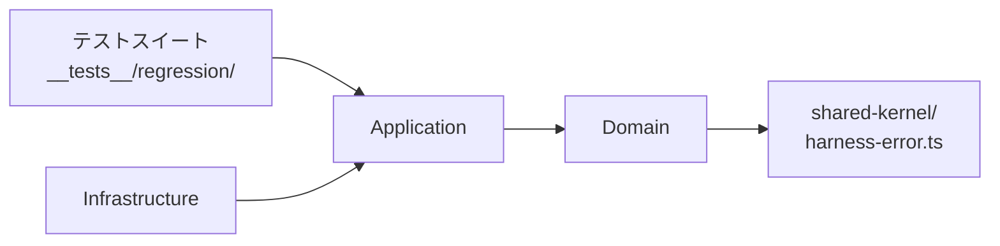

# 論理設計: regression-suite

@story-id H14-01
@story-id H14-02
@story-id H14-03
@story-id H15-01
@story-id H15-02
> **Unit ID**: regression-suite
> **作成日**: 2026-03-19
> **対応ストーリー**: H14-01, H14-02, H14-03, H15-01, H15-02
> **モード**: Unit横断設計（Phase 2）
> **前提ドキュメント**:
> - `docs/product/construction/regression-suite/domain_model.md`
> - `docs/product/units/regression-suite_unit.md`
> - `docs/product/units/integration_contract.md`
> - `docs/inception/_shared/cross_cutting_decisions.md`
> - `docs/principles/architecture-philosophy.md`

---

## 1. アーキテクチャ概要

### 1.1 層構成と責務

**重要前提**: regression-suite は「テストを実行するUnit」ではなく「テストスイートの仕様・実行契約を管理するUnit」である。ApplicationテストスイートはVitest workspaceの外部テストファイルとして実装される（通常のUnit実装ファイルとは別）。

| 層 | 責務 | 主な構成要素 | 依存先 |
|----|------|-------------|--------|
| Domain | V0TestMigration集約の状態遷移管理、回帰テスト定義VO群の不変条件保証、ドメインサービス（RegressionRunner/MigrationAnalyzer/ImportGuardService）のオーケストレーション、ポート定義 | 集約ルート、値オブジェクト、ドメインサービス、ドメインポート | なし |
| Application | ドメインモデルを使ったユースケース調停、TestExecutionSummaryの生成と公開、MigrationMappingの永続化指示、CiGateConfigの構成管理 | UseCase、DTO、Mapper | Domain |
| Infrastructure | ドメインポート実装、TestRunnerPort（Vitest 3.0.0 実行）、MigrationMappingRepositoryPort（v0_v1_test_mapping.md I/O）、ImportAnalyzerPort（biome-ast-engine連携）、外部Unitとのアダプタ | Adapter | Application, Domain |
| テストスイート（Presentation代替） | 通常のCLI Presentation層の代わりに、4種のVitest外部テストスイートファイルとして実装。各スイートはユースケースを呼び出し、TestExecutionSummaryを生成してCIゲートへ出力 | k-requirements, gng-gate, agent-independence, v0-migration | Application, Domain |

- Domain層は外部I/Oに依存しない
- Application層はDomainモデルの調停に徹し、I/O実装を持たない
- Infrastructure層は `domain/ports/` のみを実装し、テストスイートロジックを持たない
- テストスイートはApplication層経由でのみDomainを利用する

### 1.2 依存方向



```text
domain <- application <- infrastructure
domain <- application <- テストスイート
```

Cross-Unit Contract（消費方向）:
- regression-suite → validator-system: ValidatorIdRegistryPort（K1回帰テスト）
- regression-suite → phase-dependency-model: PhaseGateResult（K2/K14回帰テスト）
- regression-suite → traceability-model: メタデータ仕様（K3.5回帰テスト）
- regression-suite → config-foundation: PresetIdRegistry（K13回帰テスト）
- regression-suite → biome-ast-engine: BiomeAstAnalysisResult（K3回帰テスト）
- regression-suite → ci-governance: PointerEntry/AGENTS.md Schema（K9回帰テスト）
- regression-suite → nyquist-validation: RequirementTestMatrix Schema（Nyquist回帰テスト）
- regression-suite → harness-api: HarnessApiResponse DTO（CIゲート統合）

### 1.3 ディレクトリ構成（全ファイル一覧）

```text
scripts/harness/
└── regression-suite/
    ├── domain/
    │   ├── aggregates/
    │   │   └── v0-test-migration.ts
    │   ├── value-objects/
    │   │   ├── suite-id.ts
    │   │   ├── regression-suite-definition.ts
    │   │   ├── k-requirement-test.ts
    │   │   ├── gng-condition-test.ts
    │   │   ├── agent-independence-test.ts
    │   │   ├── migration-mapping.ts
    │   │   ├── ci-gate-config.ts
    │   │   ├── test-execution-summary.ts
    │   │   ├── biome-modification-spec.ts
    │   │   ├── v0-test-id.ts
    │   │   ├── v1-test-path.ts
    │   │   ├── coverage-rate.ts
    │   │   ├── import-violation.ts
    │   │   ├── test-failure-detail.ts
    │   │   └── skip-reason.ts
    │   ├── services/
    │   │   ├── regression-runner.ts
    │   │   ├── migration-analyzer.ts
    │   │   └── import-guard-service.ts
    │   └── ports/
    │       ├── suite-registry-port.ts
    │       ├── test-runner-port.ts
    │       ├── v0-spec-reader-port.ts
    │       ├── import-analyzer-port.ts
    │       ├── config-query-port.ts
    │       ├── migration-mapping-repository-port.ts
    │       └── ci-gate-result-writer-port.ts
    ├── application/
    │   ├── dto/
    │   │   ├── run-regression-suite-input.ts
    │   │   ├── run-regression-suite-output.ts
    │   │   ├── analyze-migration-input.ts
    │   │   ├── analyze-migration-output.ts
    │   │   ├── migrate-v0-tests-input.ts
    │   │   ├── migrate-v0-tests-output.ts
    │   │   ├── configure-ci-gate-input.ts
    │   │   └── configure-ci-gate-output.ts
    │   ├── mappers/
    │   │   ├── test-execution-summary-mapper.ts
    │   │   └── migration-mapping-mapper.ts
    │   └── usecases/
    │       ├── run-k-requirements-regression-usecase.ts
    │       ├── run-k14-k15-regression-usecase.ts
    │       ├── run-agent-independence-guard-usecase.ts
    │       ├── run-gng-gate-regression-usecase.ts
    │       ├── analyze-v0-migration-usecase.ts
    │       ├── migrate-v0-tests-usecase.ts
    │       └── configure-ci-gate-usecase.ts
    └── infrastructure/
        ├── adapters/
        │   ├── vitest-test-runner-adapter.ts
        │   ├── file-system-v0-spec-reader-adapter.ts
        │   ├── biome-ast-import-analyzer-adapter.ts
        │   ├── markdown-migration-mapping-repository-adapter.ts
        │   ├── harness-config-query-adapter.ts
        │   ├── json-ci-gate-result-writer-adapter.ts
        │   └── static-suite-registry-adapter.ts
        └── registry/
            ├── k-requirements-suite-definition.ts
            ├── gng-gate-suite-definition.ts
            ├── agent-independence-suite-definition.ts
            └── v0-migration-suite-definition.ts

scripts/harness/__tests__/integration/regression-suite/
├── k-requirements/
│   ├── k1-validator-regression.test.ts
│   ├── k2-phase-gate-regression.test.ts
│   ├── k3-biome-ast-regression.test.ts
│   ├── k3_5-metadata-regression.test.ts
│   ├── k4-test-quality-regression.test.ts
│   ├── k5-ddd-skill-regression.test.ts
│   ├── k6-two-phase-execution-regression.test.ts
│   ├── k7-document-split-regression.test.ts
│   ├── k8-cascade-updater-regression.test.ts
│   ├── k9-agent-lesson-regression.test.ts
│   ├── k10-security-performance-regression.test.ts
│   ├── k11-drift-detection-regression.test.ts
│   ├── k12-consistency-checker-regression.test.ts
│   ├── k13-config-regression.test.ts
│   ├── k14-phase-dependency-regression.test.ts
│   └── k15-plan-document-regression.test.ts
├── gng-gate/
│   ├── gng4-yolo-skip-permissions-regression.test.ts
│   ├── gng5-two-phase-execution-regression.test.ts
│   └── gng8-default-off-regression.test.ts
├── agent-independence/
│   └── core-module-import-guard.test.ts
└── v0-migration/
    └── v0-migration-suite.test.ts
```

---

## 2. Domain層設計

### 2.1 集約ルート: V0TestMigration

`domain_model.md` の結論どおり、V0TestMigration は状態遷移・識別子・I/O境界の3要素を満たす正当な集約ルートである。

#### 識別子

`V0TestId`（v0テストファイルの相対パスをラップしたVO）

#### 属性一覧

| 属性 | 型 | 説明 | 必須 |
|------|----|------|------|
| v0TestId | `V0TestId` | v0テストファイルの相対パス識別子 | Yes |
| migrationStatus | `MigrationStatus` | `pending` / `migrated` / `modified` / `skipped` | Yes |
| v1TestPath | `V1TestPath \| null` | migrated/modified時は必須 | 条件付き |
| biomeModificationSpec | `BiomeModificationSpec \| null` | modified時は必須 | 条件付き |
| skipReason | `SkipReason \| null` | skipped時は必須 | 条件付き |

#### メソッド一覧

##### `migrate(v1TestPath: V1TestPath): void`

- 入力: `v1TestPath: V1TestPath`
- 出力: なし
- 処理フロー:
  1. `migrationStatus === 'pending'` を確認する。pendingでなければ HarnessError（INV-1違反）
  2. `migrationStatus = 'migrated'` に遷移する
  3. `v1TestPath` を設定する
  4. `biomeModificationSpec = null`、`skipReason = null` とする
- 例外: `MigrationAlreadyCompletedError`（INV-1）
- 不変条件: INV-1、INV-4

##### `migrateWithModification(v1TestPath: V1TestPath, biomeSpec: BiomeModificationSpec): void`

- 入力: `v1TestPath: V1TestPath`、`biomeSpec: BiomeModificationSpec`
- 出力: なし
- 処理フロー:
  1. `migrationStatus === 'pending'` を確認する。pendingでなければ HarnessError（INV-2違反）
  2. `migrationStatus = 'modified'` に遷移する
  3. `v1TestPath`、`biomeModificationSpec` を設定する
  4. `skipReason = null` とする
- 例外: `MigrationAlreadyCompletedError`（INV-2）
- 不変条件: INV-2、INV-4、INV-5

##### `skip(reason: SkipReason): void`

- 入力: `reason: SkipReason`
- 出力: なし
- 処理フロー:
  1. `migrationStatus === 'pending'` を確認する。pendingでなければ HarnessError（INV-3違反）
  2. `migrationStatus = 'skipped'` に遷移する
  3. `skipReason` を設定する
  4. `v1TestPath = null`、`biomeModificationSpec = null` とする
- 例外: `MigrationAlreadyCompletedError`（INV-3）
- 不変条件: INV-3

##### `toMigrationMapping(): MigrationMapping`

- 入力: なし
- 出力: `MigrationMapping`（読み取り専用VO）
- 処理フロー:
  1. `migrationStatus === 'migrated' || migrationStatus === 'modified'` であることを確認する
  2. `MigrationMapping` を生成して返す
  3. `pending` / `skipped` 状態での呼び出しはドメインエラー
- 例外: `InvalidMigrationStateError`（pending/skipped状態での呼び出し時）
- 不変条件: INV-4

### 2.2 値オブジェクト群

#### 2.2.1 SuiteId

| 属性 | 型 | 説明 |
|------|----|------|
| value | `'k-requirements' \| 'gng-gate' \| 'v0-migration' \| 'agent-independence'` | スイート識別子の正規値 |

**生成ルール**

- 4値のいずれかであること（INV-7）
- `Object.freeze()` で不変性を保証する

**メソッド**

- `static create(raw: string): SuiteId`
- `equals(other: SuiteId): boolean`
- `toString(): string`

**バリデーションルール**

- 4値以外は `InvalidSuiteIdError`

#### 2.2.2 RegressionSuiteDefinition

| 属性 | 型 | 説明 |
|------|----|------|
| suiteId | `SuiteId` | スイート識別子 |
| testCases | `ReadonlyArray<KRequirementTest \| GngConditionTest \| AgentIndependenceTest>` | テストケース一覧（1件以上必須） |
| description | `string` | スイートの説明 |

**生成ルール**

- `testCases` は1件以上（INV-6）
- 不変の宣言集合として生成後に変更不可

**メソッド**

- `static create(suiteId: SuiteId, testCases: ..., description: string): RegressionSuiteDefinition`
- `equals(other: RegressionSuiteDefinition): boolean`

**バリデーションルール**

- `testCases` 空は `EmptyTestCasesError`

#### 2.2.3 KRequirementTest

| 属性 | 型 | 説明 |
|------|----|------|
| kNumber | `string` | K番号（'K1'〜'K15' / 'K3.5' を含む） |
| targetUnit | `string` | 対象Unit ID（例: 'biome-ast-engine'） |
| verificationCondition | `string` | 検証条件（アサーション仕様テキスト） |

**生成ルール**

- `kNumber` は INV-11 の K1〜K15（K3.5を含む）の範囲内
- `targetUnit` は非空文字列
- `verificationCondition` は非空文字列

**メソッド**

- `static create(kNumber: string, targetUnit: string, verificationCondition: string): KRequirementTest`
- `equals(other: KRequirementTest): boolean`

**バリデーションルール**

- K16以上は `InvalidKNumberError`（INV-11）

#### 2.2.4 GngConditionTest

| 属性 | 型 | 説明 |
|------|----|------|
| gngNumber | `'GNG-4' \| 'GNG-5' \| 'GNG-8'` | GNG番号 |
| targetUnit | `string` | 対象Unit ID |
| verificationCondition | `string` | 検証条件テキスト |

**生成ルール**

- `gngNumber` は `GNG-4` / `GNG-5` / `GNG-8` のいずれか（INV-12）

**メソッド**

- `static create(gngNumber: string, targetUnit: string, verificationCondition: string): GngConditionTest`
- `equals(other: GngConditionTest): boolean`

**バリデーションルール**

- GNG-4/5/8以外は `InvalidGngNumberError`（INV-12）

#### 2.2.5 AgentIndependenceTest

| 属性 | 型 | 説明 |
|------|----|------|
| targetModule | `string` | 検証対象coreモジュールパス |
| forbiddenPatterns | `ReadonlyArray<string>` | 禁止importパターン（1件以上必須） |
| allowedPaths | `ReadonlyArray<string>` | 例外的に許容するパスパターン（Adapter層） |

**生成ルール**

- `forbiddenPatterns` は1件以上（INV-10）
- `targetModule` は非空文字列

**メソッド**

- `static create(targetModule: string, forbiddenPatterns: string[], allowedPaths?: string[]): AgentIndependenceTest`
- `equals(other: AgentIndependenceTest): boolean`

**バリデーションルール**

- `forbiddenPatterns` 空は `EmptyForbiddenPatternsError`（INV-10）

#### 2.2.6 MigrationMapping

| 属性 | 型 | 説明 |
|------|----|------|
| v0TestId | `V0TestId` | v0テスト識別子 |
| v1TestPath | `V1TestPath` | v1テスト実装パス |
| migrationStatus | `'migrated' \| 'modified'` | 完了済みステータスのみ |
| biomeModification | `BiomeModificationSpec \| null` | modified時は存在 |

**生成ルール**

- V0TestMigration集約の `toMigrationMapping()` からのみ生成する
- `migrationStatus` は `migrated` / `modified` のみ（pending/skippedは不可）
- 読み取り専用VO

**メソッド**

- `equals(other: MigrationMapping): boolean`

#### 2.2.7 CiGateConfig

| 属性 | 型 | 説明 |
|------|----|------|
| requiredSuiteIds | `ReadonlyArray<SuiteId>` | 必須スイートID一覧 |
| coverageThreshold | `number` | カバレッジ閾値（0超〜100以下） |
| executionMode | `ExecutionMode` | `'parallel' \| 'sequential'` |

**生成ルール**

- `coverageThreshold` は 0より大きく 100以下（INV-8）
- `requiredSuiteIds` は1件以上

**メソッド**

- `static create(requiredSuiteIds: SuiteId[], coverageThreshold: number, executionMode: ExecutionMode): CiGateConfig`
- `isRequired(suiteId: SuiteId): boolean`
- `equals(other: CiGateConfig): boolean`

**バリデーションルール**

- `coverageThreshold` 範囲外は `InvalidCoverageThresholdError`（INV-8）

#### 2.2.8 TestExecutionSummary

| 属性 | 型 | 説明 |
|------|----|------|
| passedCount | `number` | 通過件数 |
| failedCount | `number` | 失敗件数 |
| skippedCount | `number` | スキップ件数 |
| totalCount | `number` | 総件数（3者の合計と一致） |
| coverageRate | `CoverageRate \| null` | カバレッジ率 |
| failures | `ReadonlyArray<TestFailureDetail>` | 個別失敗詳細 |

**生成ルール**

- `passedCount + failedCount + skippedCount === totalCount`（INV-9）
- `failures.length === failedCount`

**メソッド**

- `static create(passed: number, failed: number, skipped: number, coverageRate?: CoverageRate, failures?: TestFailureDetail[]): TestExecutionSummary`
- `isPassedGate(threshold: number): boolean`
- `equals(other: TestExecutionSummary): boolean`

**バリデーションルール**

- 合計不一致は `TestCountIntegrityError`（INV-9）

#### 2.2.9 BiomeModificationSpec

| 属性 | 型 | 説明 |
|------|----|------|
| targetApi | `string` | ESLint固有API名（移行前） |
| replacementApi | `string` | Biome対応API名（移行後） |
| modificationReason | `string` | 修正理由テキスト |

**生成ルール**

- 全フィールドは非空文字列
- `targetApi !== replacementApi` であること

**メソッド**

- `static create(targetApi: string, replacementApi: string, reason: string): BiomeModificationSpec`
- `equals(other: BiomeModificationSpec): boolean`

### 2.3 補助型一覧

| 型 | 定義 | ファイル |
|----|------|---------|
| `MigrationStatus` | `'pending' \| 'migrated' \| 'modified' \| 'skipped'` | `value-objects/migration-status.ts`（domain内） |
| `V0TestId` | v0テストファイル相対パスをラップしたVO | `value-objects/v0-test-id.ts` |
| `V1TestPath` | v1テスト実装ファイルの相対パスをラップしたVO | `value-objects/v1-test-path.ts` |
| `CoverageRate` | 0〜100の number をラップしたVO | `value-objects/coverage-rate.ts` |
| `ImportViolation` | 違反import情報（modulePath/forbiddenPackage/violationMessage）を保持するVO | `value-objects/import-violation.ts` |
| `TestFailureDetail` | 個別テスト失敗情報（testCaseId/errorMessage/stackTrace?）を保持するVO | `value-objects/test-failure-detail.ts` |
| `SkipReason` | `'out-of-scope' \| 'orchestration-migrated'` | `value-objects/skip-reason.ts`（domain内） |
| `ExecutionMode` | `'parallel' \| 'sequential'` | `value-objects/execution-mode.ts`（domain内） |

### 2.4 ドメインサービス

#### 2.4.1 RegressionRunner

**責務**: SuiteId → RegressionSuiteDefinition取得 → testCase実行委譲 → TestExecutionSummary生成・CiGateConfig適用を担う。

**コンストラクタ依存**

- `suiteRegistryPort: SuiteRegistryPort`
- `testRunnerPort: TestRunnerPort`
- `importGuardService: ImportGuardService`
- `configQueryPort: ConfigQueryPort`
- `ciGateResultWriterPort: CiGateResultWriterPort`

**主要メソッド**

##### `execute(suiteId: SuiteId, ciGateConfig: CiGateConfig): Promise<TestExecutionSummary>`

- 入力: `suiteId: SuiteId`、`ciGateConfig: CiGateConfig`
- 出力: `Promise<TestExecutionSummary>`
- 処理フロー:
  1. `SuiteRegistryPort.getDefinition(suiteId)` で定義を取得する
  2. スイート種別に応じてテストを実行する
     - k-requirements/gng-gate/v0-migration: `TestRunnerPort.runSuite(testCases)` に委譲する
     - agent-independence: `ImportGuardService.verify(agentIndependenceTest)` に委譲する
  3. 結果を `TestExecutionSummary` に集約する（INV-9 整合性チェック）
  4. `CiGateConfig.coverageThreshold` と照合して go/no-go を判定する
  5. `CiGateResultWriterPort.write(suiteId, summary)` で結果を出力する
  6. `TestExecutionSummary` を返す
- 例外: `SuiteDefinitionNotFoundError`、`TestRunnerPortError`

#### 2.4.2 MigrationAnalyzer

**責務**: v0テスト仕様143件の移行対象フィルタリング・Biome修正必要性判定・スキップ対象判定を行い、判定結果をV0TestMigration集約のメソッドに委譲する。

**コンストラクタ依存**

- `v0SpecReaderPort: V0SpecReaderPort`
- `migrationMappingRepositoryPort: MigrationMappingRepositoryPort`

**主要メソッド**

##### `analyzeAll(): Promise<readonly V0TestMigration[]>`

- 入力: なし
- 出力: `Promise<readonly V0TestMigration[]>`（状態遷移済みの集約一覧）
- 処理フロー:
  1. `V0SpecReaderPort.readAll()` で V0TestId[] 143件を取得する
  2. 各 V0TestId に対して分析を実行する:
     a. v1スコープ外 → `V0TestMigration.skip('out-of-scope')`
     b. オーケストレーション移管済み → `V0TestMigration.skip('orchestration-migrated')`
     c. Biome修正不要 → `V0TestMigration.migrate(v1TestPath)`
     d. Biome修正必要 → `BiomeModificationSpec` 生成 → `V0TestMigration.migrateWithModification(v1TestPath, biomeSpec)`
  3. 各集約を `MigrationMappingRepositoryPort.save()` で永続化する
  4. 全件の V0TestMigration[] を返す
- 例外: `V0SpecReadError`、`MigrationPersistenceError`

#### 2.4.3 ImportGuardService

**責務**: AgentIndependenceTest定義に基づき、対象coreモジュールのimport解析結果を `ImportAnalyzerPort` から受け取り、`ImportViolation[]` を返す。

**コンストラクタ依存**

- `importAnalyzerPort: ImportAnalyzerPort`

**主要メソッド**

##### `verify(test: AgentIndependenceTest): Promise<ImportViolation[]>`

- 入力: `test: AgentIndependenceTest`
- 出力: `Promise<ImportViolation[]>`
- 処理フロー:
  1. `ImportAnalyzerPort.analyzeImports(test.targetModule)` でimport解析結果を取得する
  2. `test.forbiddenPatterns` に一致するimportを抽出する
  3. `test.allowedPaths` に一致するパスはスキップする（Adapter層の例外的許容）
  4. 残りを `ImportViolation[]` として返す（空配列 = 違反なし）
- 例外: `ImportAnalysisPortError`
- 不変条件: forbiddenPatterns に一致し allowedPaths に含まれないimportのみを違反として報告する

### 2.5 ドメインポート定義

ポートは全て `scripts/harness/regression-suite/domain/ports/` に定義し、Infrastructure層が実装する。

| ポート名 | 方向 | 責務 | 利用ドメインオブジェクト | ファイル |
|---------|------|------|----------------------|---------|
| SuiteRegistryPort | 外部→ドメイン | SuiteId に対応する RegressionSuiteDefinition の取得 | RegressionRunner | `suite-registry-port.ts` |
| TestRunnerPort | ドメイン→外部 | testCase定義に基づくVitest実行・CoverageRate計算・TestFailureDetail一覧返却 | RegressionRunner | `test-runner-port.ts` |
| V0SpecReaderPort | 外部→ドメイン | v0テスト仕様ファイルの読み取り（V0TestId[] 143件） | MigrationAnalyzer | `v0-spec-reader-port.ts` |
| ImportAnalyzerPort | 外部→ドメイン | 指定coreモジュールのimport文解析結果返却 | ImportGuardService | `import-analyzer-port.ts` |
| ConfigQueryPort | 外部→ドメイン | HarnessConfigV2からcoverageThreshold・CI設定取得 | RegressionRunner | `config-query-port.ts` |
| MigrationMappingRepositoryPort | ドメイン→外部 | V0TestMigration集約の永続化（`v0_v1_test_mapping.md`読み書き） | MigrationAnalyzer、V0TestMigration集約 | `migration-mapping-repository-port.ts` |
| CiGateResultWriterPort | ドメイン→外部 | CIゲート統合用テスト結果出力（suiteId・TestExecutionSummary） | RegressionRunner | `ci-gate-result-writer-port.ts` |

---

## 3. Application層設計

### 3.1 DTO / Mapper方針

| 要素 | 役割 | ファイル |
|------|------|---------|
| `RunRegressionSuiteInput` | テストスイート実行の入力DTO（suiteId・overrideCoverageThreshold?） | `dto/run-regression-suite-input.ts` |
| `RunRegressionSuiteOutput` | テストスイート実行の出力DTO（TestExecutionSummary投影・gateResult） | `dto/run-regression-suite-output.ts` |
| `AnalyzeMigrationInput` | v0移行分析の入力DTO | `dto/analyze-migration-input.ts` |
| `AnalyzeMigrationOutput` | v0移行分析の出力DTO（totalCount/migratedCount/modifiedCount/skippedCount） | `dto/analyze-migration-output.ts` |
| `MigrateV0TestsInput` | v0移行実行の入力DTO | `dto/migrate-v0-tests-input.ts` |
| `MigrateV0TestsOutput` | v0移行実行の出力DTO（MigrationMapping[]投影） | `dto/migrate-v0-tests-output.ts` |
| `ConfigureCiGateInput` | CIゲート設定の入力DTO（requiredSuiteIds・coverageThreshold・executionMode） | `dto/configure-ci-gate-input.ts` |
| `ConfigureCiGateOutput` | CIゲート設定の出力DTO（CiGateConfig投影） | `dto/configure-ci-gate-output.ts` |
| `TestExecutionSummaryMapper` | TestExecutionSummary → 公開DTO への投影 | `mappers/test-execution-summary-mapper.ts` |
| `MigrationMappingMapper` | MigrationMapping[] → 公開DTO への投影 | `mappers/migration-mapping-mapper.ts` |

### 3.2 H14-01: RunKRequirementsRegressionUseCase

**対応ストーリー**: H14-01（K1-K13回帰テスト整備）

**責務**: K1-K13のk-requirementsスイートを実行し、TestExecutionSummaryを返す。

**コンストラクタ依存**

- `regressionRunner: RegressionRunner`
- `ciGateConfig: CiGateConfig`
- `summaryMapper: TestExecutionSummaryMapper`

**入力**: `RunRegressionSuiteInput`（suiteId: 'k-requirements'）

**出力**: `RunRegressionSuiteOutput`

**処理フロー**

1. `SuiteId.create('k-requirements')` で識別子を生成する
2. `RegressionRunner.execute(suiteId, ciGateConfig)` を呼ぶ
3. 返却された `TestExecutionSummary` を `summaryMapper.toOutput()` で投影する
4. `RunRegressionSuiteOutput` を返す

**例外**

- ドメイン層の各例外
- `SuiteDefinitionNotFoundError`

### 3.3 H14-02: RunK14K15RegressionUseCase / RunAgentIndependenceGuardUseCase

**対応ストーリー**: H14-02（K14-K15回帰テスト + エージェント非依存ガード）

#### RunK14K15RegressionUseCase

**責務**: K14（Phase Dependency Model 3層構造）・K15（plan文書なしのPhase 2移行拒否）の回帰テストをk-requirementsスイートのサブセットとして実行する。

**コンストラクタ依存**

- `regressionRunner: RegressionRunner`
- `ciGateConfig: CiGateConfig`
- `summaryMapper: TestExecutionSummaryMapper`

**入力**: `RunRegressionSuiteInput`（suiteId: 'k-requirements'、kNumberFilter: ['K14', 'K15']）

**出力**: `RunRegressionSuiteOutput`

#### RunAgentIndependenceGuardUseCase

**責務**: agent-independenceスイートを実行し、coreモジュールのimport違反を検出する。

**コンストラクタ依存**

- `regressionRunner: RegressionRunner`
- `ciGateConfig: CiGateConfig`
- `summaryMapper: TestExecutionSummaryMapper`

**入力**: `RunRegressionSuiteInput`（suiteId: 'agent-independence'）

**出力**: `RunRegressionSuiteOutput`（`failures` にImportViolation由来のTestFailureDetailが含まれる）

**処理フロー**

1. `SuiteId.create('agent-independence')` で識別子を生成する
2. `RegressionRunner.execute(suiteId, ciGateConfig)` を呼ぶ
   - 内部で `ImportGuardService.verify()` が呼ばれる
   - ImportViolation[] は TestFailureDetail[] に変換される
3. `summaryMapper.toOutput()` で投影する

### 3.4 H14-03: RunGngGateRegressionUseCase

**対応ストーリー**: H14-03（Go/No-Go Gate品質側3条件回帰テスト）

**責務**: GNG-4/GNG-5/GNG-8 の gng-gate スイートを実行し、TestExecutionSummaryを返す。

**コンストラクタ依存**

- `regressionRunner: RegressionRunner`
- `ciGateConfig: CiGateConfig`
- `summaryMapper: TestExecutionSummaryMapper`

**入力**: `RunRegressionSuiteInput`（suiteId: 'gng-gate'）

**出力**: `RunRegressionSuiteOutput`

**処理フロー**

1. `SuiteId.create('gng-gate')` で識別子を生成する
2. `RegressionRunner.execute(suiteId, ciGateConfig)` を呼ぶ
3. 返却された `TestExecutionSummary` を投影して返す

### 3.5 H15-01: AnalyzeV0MigrationUseCase / MigrateV0TestsUseCase

**対応ストーリー**: H15-01（v0 143テスト仕様のv1再実装）

#### AnalyzeV0MigrationUseCase

**責務**: v0テスト仕様143件の移行対象分析を実行し、分析結果サマリーを返す。

**コンストラクタ依存**

- `migrationAnalyzer: MigrationAnalyzer`

**入力**: `AnalyzeMigrationInput`（dryRun: boolean）

**出力**: `AnalyzeMigrationOutput`（totalCount/migratedCount/modifiedCount/skippedCount）

**処理フロー**

1. `MigrationAnalyzer.analyzeAll()` を呼ぶ
2. 返却された V0TestMigration[] から各ステータスのカウントを集計する
3. `AnalyzeMigrationOutput` に投影して返す

#### MigrateV0TestsUseCase

**責務**: v0テスト仕様143件の実際の移行処理を実行し、MigrationMappingを永続化する。

**コンストラクタ依存**

- `migrationAnalyzer: MigrationAnalyzer`
- `mappingMapper: MigrationMappingMapper`

**入力**: `MigrateV0TestsInput`（confirmExecute: boolean）

**出力**: `MigrateV0TestsOutput`（mappings: MigrationMapping[]投影）

**処理フロー**

1. `confirmExecute === false` の場合は AnalyzeV0MigrationUseCase を呼びドライランのみ実行する
2. `confirmExecute === true` の場合は `MigrationAnalyzer.analyzeAll()` を呼ぶ
3. 返却された V0TestMigration[] から `migrated` / `modified` のものを `toMigrationMapping()` で変換する
4. `mappingMapper.toOutputList()` で投影して返す

### 3.6 H15-02: ConfigureCiGateUseCase

**対応ストーリー**: H15-02（v1再実装テストのCIゲート化）

**責務**: CIゲートの設定を構築し、CiGateConfigを生成して返す。

**コンストラクタ依存**

- `configQueryPort: ConfigQueryPort`

**入力**: `ConfigureCiGateInput`（requiredSuiteIds: string[]・coverageThreshold?: number・executionMode?: string）

**出力**: `ConfigureCiGateOutput`（CiGateConfig投影）

**処理フロー**

1. `ConfigQueryPort.getCoverageThreshold()` でデフォルトの閾値を取得する
2. `coverageThreshold` が入力に指定されていない場合はデフォルト値を使用する
3. 各入力を VO に変換し `CiGateConfig` を生成する（INV-8 チェック）
4. `ConfigureCiGateOutput` に投影して返す

**例外**

- `InvalidCoverageThresholdError`（INV-8）
- `InvalidSuiteIdError`

---

## 4. Infrastructure層設計

### 4.1 VitestTestRunnerAdapter

**実装ポート**: `TestRunnerPort`

**ファイル**: `infrastructure/adapters/vitest-test-runner-adapter.ts`

**利用ライブラリ**: `vitest 3.0.0 workspace API`

**実装方針**

- Vitest 3.0.0 の workspace 機能を使って各スイートを独立したテストファイルとして実行する
- `testCases` 定義からVitest実行設定を生成し、`runSuite()` を呼び出す
- カバレッジは Vitest の coverage provider 経由で `CoverageRate` として取得する
- 各テストケースの失敗情報を `TestFailureDetail` に変換して返す
- `ExecutionMode` に応じて `pool: 'threads'`（parallel）または `pool: 'forks'`（sequential）を切り替える

### 4.2 FileSystemV0SpecReaderAdapter

**実装ポート**: `V0SpecReaderPort`

**ファイル**: `infrastructure/adapters/file-system-v0-spec-reader-adapter.ts`

**利用ライブラリ**: `node:fs/promises`、`fast-glob`

**実装方針**

- `scripts/__tests__/` 配下の `*.test.ts` ファイル一覧を fast-glob でスキャンする
- 各ファイルパスを `V0TestId` に変換して返す
- 143件のスキャン対象パターンは設定ファイルから読み込む

### 4.3 BiomeAstImportAnalyzerAdapter

**実装ポート**: `ImportAnalyzerPort`

**ファイル**: `infrastructure/adapters/biome-ast-import-analyzer-adapter.ts`

**利用ライブラリ**: biome-ast-engine（Cross-Unit Contract経由）

**実装方針**

- biome-ast-engine の `BiomeAstAnalysisResult` Contract を消費してimport情報を取得する
- 指定された `targetModule` パスのimport一覧を解析し、importパッケージ名を返す
- biome-ast-engine が未実装の場合は Node.js AST パース（`@swc/core`等）でフォールバックする

### 4.4 MarkdownMigrationMappingRepositoryAdapter

**実装ポート**: `MigrationMappingRepositoryPort`

**ファイル**: `infrastructure/adapters/markdown-migration-mapping-repository-adapter.ts`

**利用ライブラリ**: `node:fs/promises`、`node:path`

**実装方針**

- `docs/product/construction/regression-suite/domain_model.md` をMarkdownテーブルとして読み書きする
- V0TestMigration集約の状態（v0TestId・v1TestPath・migrationStatus・biomeModification）をテーブル行として永続化する
- `save()` は集約1件分の行を追記または上書きする
- `findAll()` はテーブル全行をパースして V0TestMigration 集約に復元する
- `findById()` は指定 V0TestId の行を返す

### 4.5 HarnessConfigQueryAdapter

**実装ポート**: `ConfigQueryPort`

**ファイル**: `infrastructure/adapters/harness-config-query-adapter.ts`

**利用ライブラリ**: config-foundation（Shared Kernel: HarnessConfigV2）

**実装方針**

- `HarnessConfigV2` の `layers.L3.coverageThreshold` を `coverageThreshold` として返す
- `phasegate.config.json` の読み取りはconfig-foundationのポートに委譲する

### 4.6 JsonCiGateResultWriterAdapter

**実装ポート**: `CiGateResultWriterPort`

**ファイル**: `infrastructure/adapters/json-ci-gate-result-writer-adapter.ts`

**利用ライブラリ**: `node:fs/promises`

**実装方針**

- `TestExecutionSummary` を JSON にシリアライズして CI 出力ディレクトリに書き出す
- HarnessApiResponse形式（`{ status, errors[], summary }`）のエンベロープでラップする
- CI連携のために stdout にも summary を出力する
- `gateResult`（go/no-go）と `coverageRate` を含むレポートを生成する

### 4.7 StaticSuiteRegistryAdapter

**実装ポート**: `SuiteRegistryPort`

**ファイル**: `infrastructure/adapters/static-suite-registry-adapter.ts`

**実装方針**

- スイート定義は `infrastructure/registry/` 内の各スイート定義ファイルをハードコードで読み込む
- 4種のスイートID（k-requirements/gng-gate/agent-independence/v0-migration）に対応した `RegressionSuiteDefinition` を返す
- Wave 2後半（Phase A）では k-requirements/gng-gate/agent-independence の3スイートを実装し、Wave 3（Phase B）で v0-migration を追加する

### 4.8 Registry Source

**構成**

| ファイル | 内容 |
|---------|------|
| `infrastructure/registry/k-requirements-suite-definition.ts` | K1-K15の KRequirementTest[] 定義（各Unitへの対応付け含む） |
| `infrastructure/registry/gng-gate-suite-definition.ts` | GNG-4/GNG-5/GNG-8の GngConditionTest[] 定義 |
| `infrastructure/registry/agent-independence-suite-definition.ts` | coreモジュールパス・禁止パターン・許可パスの AgentIndependenceTest[] 定義 |
| `infrastructure/registry/v0-migration-suite-definition.ts` | v0_v1_test_mapping.md から動的に生成した MigrationMapping[] ベースの定義（Phase B） |

---

## 5. テストスイート構成

通常のPresentation層の代わりに、4つのVitest外部テストスイートファイルが `scripts/harness/__tests__/integration/regression-suite/` 配下に配置される。各スイートはApplication層のユースケースを呼び出し、TestExecutionSummaryをCIゲートへ出力する。

### 5.1 k-requirements（K1-K15回帰テスト）

**配置**: `scripts/harness/__tests__/integration/regression-suite/k-requirements/`

**役割**: Wave 1-2の全6+5 Unitが対象。各K要件に対応する独立したテストファイルを配置する。

| テストファイル | K番号 | 対象Unit | 検証内容 |
|-------------|-------|---------|---------|
| `k1-validator-regression.test.ts` | K1 | validator-system | L1-L4各レイヤーのバリデータ正常動作。ValidatorIdRegistryPort経由で全バリデータを列挙して実行 |
| `k2-phase-gate-regression.test.ts` | K2 | phase-dependency-model | phase-gate 3層構造検証。PhaseGateResult Contract消費 |
| `k3-biome-ast-regression.test.ts` | K3 | biome-ast-engine | Biome AST解析（importグラフ + 循環依存）の動作確認。BiomeAstAnalysisResult Contract消費 |
| `k3_5-metadata-regression.test.ts` | K3.5 | traceability-model | @unit/@layer/@story-idメタデータ強制の動作確認 |
| `k4-test-quality-regression.test.ts` | K4 | validator-system | テスト品質ルール（AAA/actual/no-domain-mock等）の回帰テスト |
| `k5-ddd-skill-regression.test.ts` | K5 | skill-quality | DDD設計スキル群（SKILL.md構造）の回帰テスト。SkillValidationResult消費 |
| `k6-two-phase-execution-regression.test.ts` | K6 | phase-dependency-model | 2-Phase Execution維持の回帰テスト |
| `k7-document-split-regression.test.ts` | K7 | traceability-model | Document Split（inception/product分離）の回帰テスト |
| `k8-cascade-updater-regression.test.ts` | K8 | skill-quality | Cascade Updater動作の回帰テスト |
| `k9-agent-lesson-regression.test.ts` | K9 | ci-governance | Agent-Lesson System回帰テスト。AGENTS.md PointerEntry構造（ci-governanceが所有するSchema）を検証 |
| `k10-security-performance-regression.test.ts` | K10 | validator-system | Security/Performance検出の回帰テスト |
| `k11-drift-detection-regression.test.ts` | K11 | validator-system | Drift Detection回帰テスト |
| `k12-consistency-checker-regression.test.ts` | K12 | validator-system | Consistency Checker回帰テスト |
| `k13-config-regression.test.ts` | K13 | config-foundation | Config単一原則（Preset ID Registry検証）回帰テスト |
| `k14-phase-dependency-regression.test.ts` | K14 | phase-dependency-model | Phase Dependency Model 3層構造・Level間依存強制の回帰テスト |
| `k15-plan-document-regression.test.ts` | K15 | phase-dependency-model | plan文書なしのPhase 2移行拒否の回帰テスト |

**K9 特記事項**: K9回帰テストでは ci-governance が所有する AGENTS.md Schema（PointerEntry構造）を参照する。PointerEntry の `{ key: string, type: 'command' | 'file', ref: string }` 構造の整合性と、Dead Pointer禁止不変条件をCIパイプライン上で継続的に検証する。

### 5.2 gng-gate（Go/No-Go Gate品質側3条件）

**配置**: `scripts/harness/__tests__/integration/regression-suite/gng-gate/`

**役割**: Go/No-Go Gate品質側3条件の継続的な回帰保証。

| テストファイル | GNG番号 | 検証内容 |
|-------------|---------|---------|
| `gng4-yolo-skip-permissions-regression.test.ts` | GNG-4 | `--yolo`/`--skip-permissions` フラグ不採用の検証（deny listとhooksが完全維持されていること） |
| `gng5-two-phase-execution-regression.test.ts` | GNG-5 | 2-Phase Execution維持の検証（設計スキルの人間承認ゲートが存在すること） |
| `gng8-default-off-regression.test.ts` | GNG-8 | GSD由来機能のデフォルトOFF検証（`harnesses.*` フィールドが `false`/`disabled` であること） |

### 5.3 agent-independence（エージェント非依存ガード）

**配置**: `scripts/harness/__tests__/integration/regression-suite/agent-independence/`

**役割**: K14/K15 非交渉要件として、coreモジュール（domain/application層）がエージェント固有API（`@anthropic-ai/claude-code`等）を import していないことを継続的に保証する。

| テストファイル | 検証内容 |
|-------------|---------|
| `core-module-import-guard.test.ts` | `scripts/harness/*/domain/` および `scripts/harness/*/application/` 配下の全ファイルに対して、禁止importパターンが存在しないことを検証。`ImportGuardService.verify()` を経由した `RunAgentIndependenceGuardUseCase` を呼び出す |

**注意**: agent-integration の `FallbackVerificationService` とは検証文脈・目的が異なる。本スイートは「K14/K15が常に成立し続けること」のCIパイプライン継続保証が目的である（§7 D3 参照）。

### 5.4 v0-migration（v0テスト仕様のv1再実装）

**配置**: `scripts/harness/__tests__/integration/regression-suite/v0-migration/`

**役割**: Phase B（H15）で整備。v0テスト仕様143件のv1再実装テストが全件通過することを検証し、カバレッジ90%閾値を適用する。

| テストファイル | 検証内容 |
|-------------|---------|
| `v0-migration-suite.test.ts` | `MigrateV0TestsUseCase` を呼び出し、v0_v1_test_mapping.md の全MigrationMappingに対してv1テスト実装が存在・通過することを検証。coverage 90%閾値適用 |

---

## 6. データフロー図

### 6.1 H14-01: RunKRequirementsRegressionUseCase

```
[CIパイプライン / テストスイートファイル: k-requirements/]
  SuiteId: 'k-requirements'
  CiGateConfig: { requiredSuiteIds: ['k-requirements', 'gng-gate', 'agent-independence'], coverageThreshold: 90 }
       ↓
RunKRequirementsRegressionUseCase.execute(input)
  ├── SuiteId.create('k-requirements')
  └── RegressionRunner.execute(suiteId, ciGateConfig)
        │
        ├── SuiteRegistryPort.getDefinition('k-requirements')
        │   → RegressionSuiteDefinition {
        │       suiteId: 'k-requirements',
        │       testCases: KRequirementTest[] (K1〜K15 / 16件)
        │     }
        │
        ├── TestRunnerPort.runSuite(testCases)
        │   → Vitest 3.0.0 workspace で各テストケースを実行
        │   → 各K要件テストで対象UnitのCross-Unit Contractを参照:
        │     K1: ValidatorIdRegistryPort → バリデータ正常動作確認
        │     K2/K14: PhaseGateResult → 3層構造検証
        │     K3: BiomeAstAnalysisResult → AST解析結果確認
        │     K3.5: @unit/@layer メタデータ仕様確認
        │     K9: PointerEntry構造（ci-governance AGENTS.md Schema）確認
        │     K13: PresetIdRegistry → Config単一原則確認
        │   → TestFailureDetail[] + CoverageRate
        │
        ├── TestExecutionSummary 生成（INV-9 整合性チェック）
        ├── CiGateConfig.coverageThreshold との照合 → go/no-go
        └── CiGateResultWriterPort.write('k-requirements', summary)
             → CI結果JSON出力
       ↓
RunRegressionSuiteOutput {
  suiteId: 'k-requirements',
  passedCount, failedCount, totalCount, coverageRate,
  gateResult: 'go' | 'no-go',
  failures: TestFailureDetail[]
}
```

### 6.2 H14-02: RunAgentIndependenceGuardUseCase

```
[CIパイプライン / テストスイートファイル: agent-independence/]
  SuiteId: 'agent-independence'
       ↓
RunAgentIndependenceGuardUseCase.execute(input)
  └── RegressionRunner.execute(suiteId, ciGateConfig)
        │
        ├── SuiteRegistryPort.getDefinition('agent-independence')
        │   → RegressionSuiteDefinition {
        │       testCases: AgentIndependenceTest[] (coreモジュール一覧)
        │     }
        │
        ├── AgentIndependenceTest ごとに ImportGuardService.verify(test)
        │     ├── ImportAnalyzerPort.analyzeImports(test.targetModule)
        │     │   → biome-ast-engine経由でimport一覧取得
        │     ├── forbiddenPatterns との照合（@anthropic-ai/claude-code 等）
        │     ├── allowedPaths フィルタリング（Adapter層は除外）
        │     └── ImportViolation[] を返す
        │
        ├── ImportViolation[] → TestFailureDetail[] への変換
        ├── TestExecutionSummary 生成
        └── CiGateResultWriterPort.write('agent-independence', summary)
       ↓
RunRegressionSuiteOutput {
  suiteId: 'agent-independence',
  passedCount, failedCount,
  failures: [{ testCaseId, errorMessage: 'Forbidden import detected: ...', ... }]
}
```

### 6.3 H14-03: RunGngGateRegressionUseCase

```
[CIパイプライン / テストスイートファイル: gng-gate/]
  SuiteId: 'gng-gate'
       ↓
RunGngGateRegressionUseCase.execute(input)
  └── RegressionRunner.execute(suiteId, ciGateConfig)
        │
        ├── SuiteRegistryPort.getDefinition('gng-gate')
        │   → RegressionSuiteDefinition {
        │       testCases: GngConditionTest[] [
        │         GNG-4: yolo/skip-permissions 不採用検証
        │         GNG-5: 2-Phase Execution 人間承認ゲート存在検証
        │         GNG-8: デフォルトOFF 検証（harnesses.* = false）
        │       ]
        │     }
        │
        ├── TestRunnerPort.runSuite(testCases)
        │   → 各GNG条件テストを実行
        │   → TestFailureDetail[] + CoverageRate
        │
        ├── TestExecutionSummary 生成
        └── CiGateResultWriterPort.write('gng-gate', summary)
       ↓
RunRegressionSuiteOutput {
  suiteId: 'gng-gate',
  passedCount, failedCount, totalCount: 3
}
```

### 6.4 H15-01: AnalyzeV0MigrationUseCase + MigrateV0TestsUseCase

```
[移行作業トリガー（手動実行）]
       ↓
AnalyzeV0MigrationUseCase.execute({ dryRun: true })
  └── MigrationAnalyzer.analyzeAll()
        ├── V0SpecReaderPort.readAll()
        │   → V0TestId[] (143件) ─ scripts/__tests__/**/*.test.ts をスキャン
        │
        └── 各V0TestId に対して分析:
              ├── v1スコープ外判定 → V0TestMigration.skip('out-of-scope')
              ├── オーケストレーション移管済み判定 → V0TestMigration.skip('orchestration-migrated')
              ├── Biome修正不要 → V0TestMigration.migrate(v1TestPath)
              └── Biome修正必要 → BiomeModificationSpec生成
                                → V0TestMigration.migrateWithModification(v1TestPath, biomeSpec)
       ↓
AnalyzeMigrationOutput {
  totalCount: 143,
  migratedCount: N,
  modifiedCount: M,
  skippedCount: K
}
       ↓（人間レビュー・確認後）
MigrateV0TestsUseCase.execute({ confirmExecute: true })
  └── MigrationAnalyzer.analyzeAll()
      （全V0TestMigration集約を生成・状態遷移）
        │
        ├── 各V0TestMigration に対して MigrationMappingRepositoryPort.save(migration)
        │   → docs/product/construction/regression-suite/domain_model.md に永続化
        │
        └── migrated/modified のものを toMigrationMapping() で変換
       ↓
MigrateV0TestsOutput {
  mappings: MigrationMapping[] (migrated + modified件のみ)
}
```

### 6.5 H15-02: ConfigureCiGateUseCase + v0-migrationスイート実行

```
[H15-02: CIゲート化]
       ↓
ConfigureCiGateUseCase.execute({
  requiredSuiteIds: ['k-requirements', 'gng-gate', 'agent-independence', 'v0-migration'],
  coverageThreshold: 90,
  executionMode: 'parallel'
})
  ├── ConfigQueryPort.getCoverageThreshold() → 90（standard preset）
  └── CiGateConfig.create(requiredSuiteIds, 90, 'parallel')
       ↓
ConfigureCiGateOutput { ciGateConfig: CiGateConfig }
       ↓
RunKRequirementsRegressionUseCase / RunGngGateRegressionUseCase /
RunAgentIndependenceGuardUseCase の全スイート + v0-migration スイート実行
  └── v0-migration スイート:
        RegressionRunner.execute('v0-migration', ciGateConfig)
          ├── SuiteRegistryPort.getDefinition('v0-migration')
          │   → MigrationMappingRepositoryPort.findAll() から RegressionSuiteDefinition 生成
          ├── TestRunnerPort.runSuite(testCases)
          │   → v0_v1_test_mapping.md の全MigrationMapping に対して
          │     v1テスト実装ファイルの存在確認・実行
          │   → coverage 90%閾値適用
          └── CiGateResultWriterPort.write('v0-migration', summary)
       ↓
全4スイートの TestExecutionSummary → CI統合レポート
```

---

## 7. 設計判断記録

### D1: Phase A/B段階性をドメインモデルで表現しない理由

Phase A（H14: k-requirements/gng-gate/agent-independence）と Phase B（H15: v0-migration）という段階性は、配備・実装スケジュールの関心事であり、ドメインの業務ルールではない。

ドメインモデルでは4種の `SuiteId` と対応する `RegressionSuiteDefinition` を独立したVOとして並置し、どの SuiteId をいつ実行するかは infrastructure/Application層が担う（`CiGateConfig.requiredSuiteIds` でPhase Aスコープを宣言）。これにより、Phase Bへの移行時にドメインモデルの変更なく `requiredSuiteIds` に `'v0-migration'` を追加するだけで対応できる。

`StaticSuiteRegistryAdapter` は Phase A 段階では v0-migration スイートを返さず、Phase B で追加する設計にすることで、ドメイン層は一切変更されない。ドメインモデルに段階性を持ち込むと「Phase A状態」「Phase B状態」というメタ状態が発生し、ドメインの本質的な複雑さ（何を検証するか・どう移行するか）が段階性の複雑さに埋没する。

### D2: regression-suiteの「実装」と「テストスイート」の二重構造

regression-suite は他の Unit と異なる特徴を持つ。通常の Unit は `domain/`, `application/`, `infrastructure/`, `presentation/` の4層に実装ファイルを持ち、`__tests__/unit/`, `__tests__/integration/` にテストファイルを持つ。

regression-suite の場合:
- **通常のUnit実装**: `scripts/harness/regression-suite/` 配下に4層で配置（他Unitと同一構造）
- **テストスイートファイル**: `scripts/harness/__tests__/integration/regression-suite/` 配下にVitest外部テストファイルとして配置（Presentation層代替）

テストスイートファイルは regression-suite Unit の「公開インターフェース」であると同時に、CIパイプラインが直接実行するVitest workspaceのテストファイルでもある。この二重構造は「テストスイートの仕様を管理する」というドメイン責務と「テストを実際に実行してCIゲートを制御する」というインフラ責務を明確に分離する設計判断に基づく。

この設計により:
1. `RunKRequirementsRegressionUseCase` 等のユースケースはドメインモデルとして純粋にテスト可能
2. テストスイートファイル（`.test.ts`）はApplication層のユースケースを呼び出すシン境界として機能
3. CIパイプラインはテストスイートファイルを直接 `pnpm test --project regression-*` で実行する

### D3: ImportGuardServiceとagent-integrationのFallbackVerificationServiceの文脈分離

**ImportGuardService（regression-suite）の文脈**:
- 目的: 「K14/K15が常に成立し続けること」をCIパイプライン上で回帰的に継続検証する
- 検証対象: `AgentIndependenceTest.targetModule` に指定されたcoreモジュール一覧（全域的なimportガード）
- 検出ルール: `forbiddenPatterns` に一致するimportが存在する場合、`ImportViolation` として報告する
- 実行タイミング: CIパイプラインの agent-independence スイート実行時（継続的回帰）

**FallbackVerificationService（agent-integration）の文脈**:
- 目的: 「Hook Adapterがエージェント非依存で動作可能か（フォールバック仕様との整合性）」を確認する（H11-01 CLI/FSフォールバック保証）
- 検証対象: `FallbackCapabilitySpec` に宣言されたcoreモジュール群（宣言との整合性チェック）
- 検出ルール: `FallbackCapabilitySpec.noAgentApiImports=true` 宣言との整合性を検証する
- 実行タイミング: H11-01 フォールバック仕様の整合性確認時

両者は同一の `ImportAnalyzerPort` インターフェースを参照するが、**ドメインルールの主語・目的・検証コンテキストが根本的に異なる**。同一コードに統合してはならない。統合すると「継続的回帰テスト」と「フォールバック仕様検証」という2つの異なる業務ルールが混在し、どちらかの変更が他方に意図せず影響を与えるリスクが生じる。

---

## 8. テスト方針

### 8.1 テスト対象 × テストレイヤー

| 対象 | ユニットテスト | 統合テスト | 回帰テスト（外部スイート） |
|------|---------------|-----------|-------------------------|
| Domain VO / 集約 | Yes | No | No |
| Domain Service（RegressionRunner等） | Yes | Yes | No |
| Application UseCase | Yes | Yes | No |
| Infrastructure Adapter | No | Yes | No |
| テストスイートファイル | No | No | Yes（CIパイプライン直接実行） |

### 8.2 Domain層テスト方針

`scripts/harness/__tests__/unit/regression-suite/` 配下に配置する。

- V0TestMigration集約: `pending → migrated/modified/skipped` の各遷移、二重遷移禁止（INV-1〜3）、整合性（INV-4〜5）を検証する
- 値オブジェクト群: 不変条件（INV-6〜12）を Small テストで検証する
- `RegressionRunner`: Port をテストダブルにし、スイート種別ごとの実行委譲ロジックを検証する
- `ImportGuardService`: `forbiddenPatterns`/`allowedPaths` のマッチングロジックを検証する
- `MigrationAnalyzer`: スキップ判定ロジック・Biome修正必要性判定を検証する

### 8.3 Application層テスト方針

- 各 UseCase は Port のみをモックし、Domain モデルは実体を使う
- Phase A スイート（k-requirements/gng-gate/agent-independence）の実行フローを全件テストする
- `ConfigureCiGateUseCase` は INV-8（coverageThreshold 範囲）違反シナリオを必ず検証する

### 8.4 Infrastructure層テスト方針

- `MarkdownMigrationMappingRepositoryAdapter`: fixture の `v0_v1_test_mapping.md` を用いて、読み書きの round-trip を検証する
- `StaticSuiteRegistryAdapter`: 4スイートの定義が正しく返ることを確認する
- `VitestTestRunnerAdapter`: Vitest workspace 実行の設定生成を検証する（実際のテスト実行は別）

### 8.5 テスト規約適用

`testing-rules.md` に従い、以下を厳守する。

- テストケース名は日本語で記述する
- AAAコメントを明示する
- Act結果は `actual` 変数へ代入する
- UseCase テストでは Port のみをモックし、Domain モデルはモックしない
- テストファイルに `// @unit regression-suite`、`// @layer {適切な層名}` を必ず記載する

---

## 9. ストーリーとの対応

### 9.1 H14-01 K1-K13回帰テスト整備

- `KRequirementTest`（K1〜K13）
- `RegressionSuiteDefinition`（suiteId: 'k-requirements'）
- `RunKRequirementsRegressionUseCase`
- `k-requirements/k1-*.test.ts` 〜 `k-requirements/k13-*.test.ts`
- `StaticSuiteRegistryAdapter`（k-requirements 定義）
- `VitestTestRunnerAdapter`

### 9.2 H14-02 K14-K15回帰テスト + エージェント非依存ガード

- `KRequirementTest`（K14/K15）
- `AgentIndependenceTest`
- `ImportGuardService`
- `ImportAnalyzerPort`、`BiomeAstImportAnalyzerAdapter`
- `RunK14K15RegressionUseCase`、`RunAgentIndependenceGuardUseCase`
- `k-requirements/k14-*.test.ts`、`k-requirements/k15-*.test.ts`
- `agent-independence/core-module-import-guard.test.ts`

### 9.3 H14-03 Go/No-Go Gate品質側3条件回帰テスト

- `GngConditionTest`（GNG-4/GNG-5/GNG-8）
- `RegressionSuiteDefinition`（suiteId: 'gng-gate'）
- `RunGngGateRegressionUseCase`
- `gng-gate/gng4-*.test.ts`、`gng-gate/gng5-*.test.ts`、`gng-gate/gng8-*.test.ts`

### 9.4 H15-01 v0 143テスト仕様のv1再実装

- `V0TestMigration`集約（状態遷移）
- `MigrationAnalyzer`、`MigrationMapping`、`BiomeModificationSpec`
- `V0SpecReaderPort`、`MigrationMappingRepositoryPort`
- `FileSystemV0SpecReaderAdapter`、`MarkdownMigrationMappingRepositoryAdapter`
- `AnalyzeV0MigrationUseCase`、`MigrateV0TestsUseCase`
- `v0-migration/v0-migration-suite.test.ts`（Phase B）

### 9.5 H15-02 v1再実装テストのCIゲート化

- `CiGateConfig`（requiredSuiteIds に 'v0-migration' を追加）
- `ConfigureCiGateUseCase`
- `CiGateResultWriterPort`、`JsonCiGateResultWriterAdapter`
- `StaticSuiteRegistryAdapter`（v0-migration 定義を追加）
# Public CLI and Report Path Reflection

@work-item-id WI-150
@work-item-id WI-158

Regression-suite public commands are developer/regression binary subcommands. Suite result JSON is written under fixed `reports/regression/`; this output is not controlled by `reporting.outputDir`.

## WI-307 World public CLI regression contract

<!-- @work-item-id WI-307 -->

@story-id H17-19

regression-suiteの外部E2E suiteはharness-apiのcanonical `KNOWN_HARNESS_COMMANDS`とactual `main.ts` processを使い、`world:inspect` / `world:pin` / `world:derive`のpublic transport contractを固定する。対象はcommand presence、`phasegate-world-cli/v1` discriminator、command field、exit 0 / 1 / 2であり、World domain entity、WCR evaluator、baseline policyを複製しない。temp corpusとversioned declarationを実filesystemで組み立て、control mutation failure時の非書込みも境界contractとして確認する。
