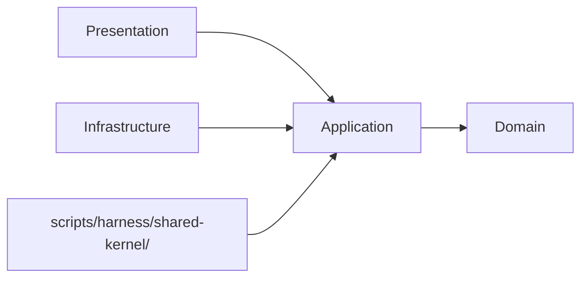

# 論理設計: skill-quality

## WI-036 Git Commit Executor Hardening

<!-- @work-item-id WI-036 -->

Skill-quality commit execution invokes `git commit` through an argument-array executor. Commit messages derived from agent workflow text are treated as argv values, preventing shell expansion of backticks, command substitutions, or separator characters.

## WI-181 Packaged Cascade Runtime Dependency

<!-- @work-item-id WI-181 -->

`ApplyCascadeUpdateUseCase` receives file discovery through `FileSystemPort.glob`; the Node composition root implements that port with `tinyglobby`. Because `skill:apply-cascade-update` is a packaged runtime command, `tinyglobby` is part of the npm runtime dependency contract rather than a dev-only/transitive dependency.

## WI-188 Coverage Check Prerequisite Guard

<!-- @work-item-id WI-188 -->

`skill:check-coverage --story` validates the requested story against `.harness/requirement-test-matrix.json` before code coverage execution. Unknown story IDs return a story-not-found error. Story entries with zero mapped tests return a deterministic skipped/no-tests code coverage result and do not invoke Vitest. When a coverage summary is absent, the coverage runner requires local `node_modules/vitest`; missing dependency produces guidance instead of invoking `npx`.

@story-id H12-01
@story-id H12-02
@story-id H12-03
@story-id H12-04
@story-id H12-05
@story-id H12-06
> **Unit ID**: skill-quality

<!-- @work-item-id WI-184 -->
The public `phasegate skills list` flow consumes the skill-quality catalog source by scanning `skills/*/SKILL.md`, then groups entries using the setup skill category map. `skills info <name>` resolves the same `SKILL.md` path helper, so listing and detail lookup cannot drift to separate catalog definitions.
> **作成日**: 2026-03-19
> **対応ストーリー**: H12-01, H12-02, H12-03, H12-04, H12-05, H12-06
> **モード**: Unit横断設計（Phase 2）
> **前提ドキュメント**:
> - `docs/product/construction/skill-quality/domain_model.md`
> - `docs/product/units/skill_quality_unit.md`
> - `docs/product/units/integration_contract.md`
> - `docs/inception/_shared/cross_cutting_decisions.md`
> - `docs/principles/architecture-philosophy.md`
> - `docs/product/construction/ci-governance/domain_model.md`

---

## §1 アーキテクチャ概要

### 1.1 層構成と責務

| 層 | 責務 | 主な構成要素 | 依存先 |
|----|------|-------------|--------|
| Domain | PlanCheckerLoop・LessonArtifact の不変条件、VO群の値検証、ドメインサービスのビジネスロジック、11本のポートインターフェース定義 | 集約ルート（2）、値オブジェクト（14）、ドメインサービス（5）、ポート（11） | なし |
| Application | Domain モデルを使ったユースケース調停、ストーリー単位の処理フロー制御、DTO 定義と Mapper 変換 | UseCase（7）、DTO、Mapper | Domain |
| Infrastructure | Domain ポート実装、外部 I/O（git / ファイルシステム / JSON スキーマ / カバレッジツール / バリデータ）との接続 | Adapter（11） | Application, Domain |
| Presentation | CLI ハンドラー、引数パース、終了コード決定。harness-api から呼ばれる薄い境界 | CLI handler（6） | Application, Domain |

### 1.2 依存方向

`cross_cutting_decisions.md §2` と `integration_contract.md` の正規語彙に合わせ、依存方向は以下に固定する。



```text
domain <- application <- infrastructure
domain <- application <- presentation
```

- Domain 層は外部 I/O に依存しない
- Application 層は Domain モデルの調停に徹し、I/O 実装を持たない
- Infrastructure 層は `domain/ports/` のみを実装し、CLI ロジックを持たない
- Presentation 層は Application 層経由でのみ Domain を利用する
- LessonArtifact スキーマは `docs/contracts/lesson-artifact.schema.json` 経由でのみ参照し、ci-governance ドメイン層を直接 import しない

### 1.3 ディレクトリ構成（全ファイル一覧）

```text
scripts/harness/skill-quality/
├── domain/
│   ├── aggregates/
│   │   ├── plan-checker-loop.ts
│   │   └── lesson-artifact.ts
│   ├── value-objects/
│   │   ├── commit-message.ts
│   │   ├── tdd-cycle.ts
│   │   ├── commit-readiness.ts
│   │   ├── coverage-report.ts
│   │   ├── requirement-coverage-result.ts
│   │   ├── code-coverage-result.ts
│   │   ├── loop-attempt.ts
│   │   ├── lesson.ts
│   │   ├── lesson-fingerprint.ts
│   │   ├── source-context.ts
│   │   ├── cascade-update-target.ts
│   │   ├── cascade-update-result.ts
│   │   ├── skill-structure.ts
│   │   └── skill-validation-result.ts
│   ├── types/
│   │   ├── loop-status.ts
│   │   ├── tdd-phase.ts
│   │   ├── section-name.ts
│   │   ├── unit-name.ts
│   │   ├── iso-date-string.ts
│   │   └── validation-violation.ts
│   ├── services/
│   │   ├── atomic-commit-service.ts
│   │   ├── lesson-collector.ts
│   │   ├── lesson-deduplicator.ts
│   │   ├── cascade-update-service.ts
│   │   └── skill-structure-validator.ts
│   └── ports/
│       ├── commit-executor-port.ts
│       ├── l1-validator-port.ts
│       ├── l2-validator-port.ts
│       ├── lesson-source-reader-port.ts
│       ├── lesson-artifact-writer-port.ts
│       ├── lesson-artifact-schema-port.ts
│       ├── requirement-test-matrix-port.ts
│       ├── validator-id-registry-port.ts
│       ├── config-query-port.ts
│       ├── coverage-runner-port.ts
│       └── skill-file-reader-port.ts
├── application/
│   ├── dto/
│   │   ├── execute-tdd-cycle-input.ts
│   │   ├── execute-tdd-cycle-output.ts
│   │   ├── check-coverage-input.ts
│   │   ├── check-coverage-output.ts
│   │   ├── run-plan-checker-loop-input.ts
│   │   ├── run-plan-checker-loop-output.ts
│   │   ├── collect-lessons-input.ts
│   │   ├── collect-lessons-output.ts
│   │   ├── write-lesson-artifact-input.ts
│   │   ├── write-lesson-artifact-output.ts
│   │   ├── apply-cascade-update-input.ts
│   │   ├── apply-cascade-update-output.ts
│   │   ├── validate-skill-structure-input.ts
│   │   └── validate-skill-structure-output.ts
│   ├── mappers/
│   │   ├── coverage-report-mapper.ts
│   │   ├── lesson-artifact-mapper.ts
│   │   └── cascade-update-result-mapper.ts
│   └── usecases/
│       ├── execute-tdd-cycle-usecase.ts
│       ├── check-coverage-usecase.ts
│       ├── run-plan-checker-loop-usecase.ts
│       ├── collect-lessons-usecase.ts
│       ├── write-lesson-artifact-usecase.ts
│       ├── apply-cascade-update-usecase.ts
│       └── validate-skill-structure-usecase.ts
├── infrastructure/
│   └── adapters/
│       ├── git-commit-executor-adapter.ts
│       ├── l1-biome-validator-adapter.ts
│       ├── l2-validator-system-adapter.ts
│       ├── file-system-lesson-source-reader-adapter.ts
│       ├── file-system-lesson-artifact-writer-adapter.ts
│       ├── ajv-lesson-artifact-schema-adapter.ts
│       ├── file-system-requirement-test-matrix-adapter.ts
│       ├── validator-id-registry-bridge-adapter.ts
│       ├── harness-config-query-adapter.ts
│       ├── vitest-coverage-runner-adapter.ts
│       └── file-system-skill-file-reader-adapter.ts
└── presentation/
    └── handlers/
        ├── execute-tdd-cycle-handler.ts
        ├── check-coverage-handler.ts
        ├── run-plan-checker-loop-handler.ts
        ├── collect-lessons-handler.ts
        ├── apply-cascade-update-handler.ts
        └── validate-skill-structure-handler.ts
```

---

## §2 Domain 層設計

### 2.1 集約ルート

#### 2.1.1 PlanCheckerLoop

`domain_model.md §4（D4）` の設計判断に従い、セッション内一時データだが状態遷移の整合性責務を担う集約ルートとして維持する。

**属性一覧**

| 属性 | 型 | 説明 | 必須 |
|------|----|------|------|
| id | `string` | セッション識別子（UUID） | Yes |
| status | `LoopStatus` | 現在の状態（`RUNNING` / `PASSED` / `FAILED_EXCEEDED`） | Yes |
| loopHistory | `readonly LoopAttempt[]` | 試行記録一覧（最大3件） | Yes |
| maxRetries | `3` | 最大再試行回数（固定値） | Yes |

**メソッド一覧**

##### `static create(): PlanCheckerLoop`

- 入力: なし
- 出力: `PlanCheckerLoop`（status=RUNNING, loopHistory=[]）
- 処理フロー:
  1. `id` を UUID で生成する
  2. `status=RUNNING`, `loopHistory=[]`, `maxRetries=3` で初期化する
  3. `Object.freeze()` せずミュータブルなインスタンスを返す（状態遷移のため）
- 例外: なし
- 不変条件: `maxRetries` は常に 3（INV-4）

##### `addAttempt(attempt: LoopAttempt): void`

- 入力: `attempt: LoopAttempt`
- 出力: なし（副作用: loopHistory に追記）
- 処理フロー:
  1. INV-3 チェック: `status` が `PASSED` または `FAILED_EXCEEDED` なら `HarnessError` をスロー
  2. INV-1 チェック: `loopHistory.length >= maxRetries(3)` なら `HarnessError` をスロー
  3. `loopHistory` に `attempt` を追加する
  4. `attempt.gaps` が空（`[]`）なら `this.complete()` を自動呼び出す
  5. `attempt.gaps` が非空かつ `loopHistory.length === maxRetries` なら `this.fail()` を自動呼び出す
- 例外:
  - `LOOP_ALREADY_COMPLETED`: status が終了済みの場合（INV-3）
  - `LOOP_MAX_RETRIES_EXCEEDED`: loopHistory が上限に達している場合（INV-1）
- 不変条件: INV-1, INV-2, INV-3

##### `complete(): void`（内部メソッド）

- 入力: なし
- 出力: なし
- 処理フロー:
  1. INV-2 チェック: 最後の `LoopAttempt.gaps` が空でなければ `HarnessError` をスロー
  2. `status = 'PASSED'` に遷移する
- 例外: `LOOP_GAPS_NOT_EMPTY`（INV-2）

##### `fail(): void`（内部メソッド）

- 入力: なし
- 出力: なし
- 処理フロー:
  1. `status = 'FAILED_EXCEEDED'` に遷移する
- 例外: なし

**バリデーションルール**

| INV | 内容 | 違反時 |
|-----|------|--------|
| INV-1 | `loopHistory.length <= maxRetries(3)` | `addAttempt()` で `HarnessError` |
| INV-2 | `PASSED` 遷移は最後の `gaps=[]` 時のみ | `complete()` で `HarnessError` |
| INV-3 | `PASSED`/`FAILED_EXCEEDED` 後は `addAttempt()` 不可 | `HarnessError` |
| INV-4 | `maxRetries` は `3` 固定 | コンストラクタで `3` 以外は `HarnessError` |

---

#### 2.1.2 LessonArtifact

`domain_model.md §4（D3）` の設計判断に従い、重複なし不変条件と JSON ファイル I/O 境界を担う集約ルートとして維持する。

**属性一覧**

| 属性 | 型 | 説明 | 必須 |
|------|----|------|------|
| storyId | `StoryId` | 対応ストーリー ID（Shared Kernel） | Yes |
| lessons | `readonly Lesson[]` | 教訓エントリ一覧（重複なし） | Yes |
| fingerprintSet | `ReadonlySet<string>` | 重複検出用 fingerprint 集合（内部管理） | Yes |

**メソッド一覧**

##### `static create(storyId: StoryId): LessonArtifact`

- 入力: `storyId: StoryId`
- 出力: `LessonArtifact`（lessons=[]）
- 処理フロー:
  1. INV-6 チェック: `storyId` が非空かつ `HXX-XX` 形式であることを検証する
  2. `lessons=[]`, `fingerprintSet=new Set()` で初期化する
- 例外: `INVALID_STORY_ID`（INV-6）

##### `addLesson(lesson: Lesson): void`

- 入力: `lesson: Lesson`
- 出力: なし（副作用: lessons に追記）
- 処理フロー:
  1. INV-5 チェック: `fingerprintSet` に `lesson.fingerprint.value` が存在する場合は `HarnessError` をスロー
  2. `lessons` に `lesson` を追加する
  3. `fingerprintSet` に `lesson.fingerprint.value` を追加する
- 例外: `DUPLICATE_LESSON_FINGERPRINT`（INV-5）
- 不変条件: INV-5

##### `toJson(): LessonArtifactJson`

- 入力: なし
- 出力: `LessonArtifactJson`（ci-governance スキーマ準拠の JSON 構造）
- 処理フロー:
  1. `storyId`, `lessons[]` を ci-governance スキーマ形式へ変換する
  2. 各 `Lesson` を `{ lessonId, source, content, tags, timestamp }` に投影する
  3. `Object.freeze()` 済みオブジェクトを返す
- 例外: なし
- 不変条件: 出力形式は `docs/contracts/lesson-artifact.schema.json` に準拠

**バリデーションルール**

| INV | 内容 | 違反時 |
|-----|------|--------|
| INV-5 | `lessons` 内の `LessonFingerprint` は一意 | `addLesson()` で `HarnessError` |
| INV-6 | `storyId` は非空かつ `HXX-XX` 形式 | `create()` で `HarnessError` |
| INV-7 | `lessonId`（artifact 識別子）は一意 | `LessonArtifactWriterPort` 実装レベルで保証 |

---

### 2.2 値オブジェクト

#### 2.2.1 CommitMessage

**属性一覧**

| 属性 | 型 | 説明 | 必須 |
|------|----|------|------|
| unit | `UnitName` | ハーネス Unit 識別子 | Yes |
| storyId | `StoryId` | 対応ストーリー ID | Yes |
| description | `string` | コミット内容の簡潔な説明 | Yes |

**メソッド一覧**

##### `static create(unit: UnitName, storyId: StoryId, description: string): CommitMessage`

- 入力: `unit`, `storyId`, `description`
- 出力: `CommitMessage`
- 処理フロー:
  1. INV-8 チェック: `unit`, `storyId`, `description` がいずれも非空文字列であることを検証する
  2. `Object.freeze()` で凍結して返す
- 例外: `EMPTY_COMMIT_FIELD`（INV-8）

##### `format(): string`

- 入力: なし
- 出力: `string`（`feat({unit}/{storyId}): {description}` 形式）
- 処理フロー: テンプレートに属性を当てはめて文字列を生成する
- 例外: なし
- 不変条件: INV-9（生成時に検証済みのため実行時違反なし）

##### `equals(other: CommitMessage): boolean`

- 入力: `other: CommitMessage`
- 出力: `boolean`
- 処理フロー: `unit`, `storyId`, `description` の全フィールドを値比較する
- 例外: なし

**バリデーションルール**

| INV | 内容 |
|-----|------|
| INV-8 | `unit`・`storyId`・`description` はいずれも非空文字列 |
| INV-9 | `format()` 結果は `feat({unit}/{storyId}): {description}` パターンに準拠 |

---

#### 2.2.2 TddCycle

**属性一覧**

| 属性 | 型 | 説明 | 必須 |
|------|----|------|------|
| phase | `TddPhase` | 現在フェーズ（`RED` / `GREEN` / `REFACTOR`） | Yes |
| passed | `boolean` | フェーズ合格フラグ | Yes |

**メソッド一覧**

##### `static create(phase: TddPhase, passed: boolean): TddCycle`

- 入力: `phase`, `passed`
- 出力: `TddCycle`
- 処理フロー: `Object.freeze()` で凍結して返す
- 例外: なし

##### `isReadyForCommit(): boolean`

- 入力: なし
- 出力: `boolean`
- 処理フロー: `phase === 'REFACTOR' && passed === true` を返す
- 例外: なし

##### `equals(other: TddCycle): boolean`

- 入力: `other: TddCycle`
- 出力: `boolean`
- 処理フロー: `phase`, `passed` を値比較する
- 例外: なし

---

#### 2.2.3 CommitReadiness

**属性一覧**

| 属性 | 型 | 説明 | 必須 |
|------|----|------|------|
| ready | `boolean` | commit 実行可否フラグ | Yes |
| violations | `readonly ValidationViolation[]` | L1+L2 違反詳細一覧 | Yes |

**メソッド一覧**

##### `static go(): CommitReadiness`

- 入力: なし
- 出力: `CommitReadiness`（ready=true, violations=[]）
- 処理フロー: `Object.freeze()` で凍結して返す

##### `static noGo(violations: readonly ValidationViolation[]): CommitReadiness`

- 入力: `violations: readonly ValidationViolation[]`
- 出力: `CommitReadiness`（ready=false, violations）
- 処理フロー: `violations.length >= 1` を検証後 `Object.freeze()` で凍結して返す
- 例外: `EMPTY_VIOLATIONS`（violations が空の場合）

##### `equals(other: CommitReadiness): boolean`

- 入力: `other: CommitReadiness`
- 出力: `boolean`
- 処理フロー: `ready`, `violations[]` を値比較する
- 例外: なし

---

#### 2.2.4 CoverageReport

**属性一覧**

| 属性 | 型 | 説明 | 必須 |
|------|----|------|------|
| requirementCoverage | `RequirementCoverageResult` | 要件カバレッジ結果 | Yes |
| codeCoverage | `CodeCoverageResult` | コードカバレッジ結果 | Yes |

**メソッド一覧**

##### `static create(requirementCoverage: RequirementCoverageResult, codeCoverage: CodeCoverageResult): CoverageReport`

- 入力: `requirementCoverage`, `codeCoverage`
- 出力: `CoverageReport`
- 処理フロー:
  1. INV-12 チェック: 両引数が非 null であることを検証する
  2. `Object.freeze()` で凍結して返す
- 例外: `INVALID_COVERAGE_REPORT`（INV-12）

##### `meetsThreshold(requirementThreshold: number, codeThreshold: number): boolean`

- 入力: `requirementThreshold: number`（0-100）, `codeThreshold: number`（0-100）
- 出力: `boolean`
- 処理フロー:
  1. `requirementCoverage.coverageRate >= requirementThreshold` を判定する
  2. `codeCoverage.lineCoverage >= codeThreshold` を判定する
  3. 両方を満たす場合のみ `true` を返す
- 例外: なし

##### `equals(other: CoverageReport): boolean`

- 入力: `other: CoverageReport`
- 出力: `boolean`
- 処理フロー: `requirementCoverage`, `codeCoverage` を値比較する
- 例外: なし

**バリデーションルール**

| INV | 内容 |
|-----|------|
| INV-12 | `requirementCoverage` と `codeCoverage` はいずれも非 null |

---

#### 2.2.5 RequirementCoverageResult

**属性一覧**

| 属性 | 型 | 説明 | 必須 |
|------|----|------|------|
| total | `number` | 総要件数 | Yes |
| covered | `number` | カバー済み要件数 | Yes |
| uncoveredIds | `readonly string[]` | 未カバー要件 ID 一覧 | Yes |

**メソッド一覧**

##### `static create(total: number, covered: number, uncoveredIds: readonly string[]): RequirementCoverageResult`

- 入力: `total`, `covered`, `uncoveredIds`
- 出力: `RequirementCoverageResult`
- 処理フロー:
  1. `total >= 0`, `covered >= 0`, `covered <= total` を検証する
  2. `uncoveredIds.length === total - covered` を検証する
  3. `Object.freeze()` で凍結して返す
- 例外: `INVALID_REQUIREMENT_COVERAGE`

##### `get coverageRate(): number`

- 入力: なし
- 出力: `number`（0-100 のパーセンテージ）
- 処理フロー: `total === 0 ? 100 : (covered / total) * 100` を返す

---

#### 2.2.6 CodeCoverageResult

**属性一覧**

| 属性 | 型 | 説明 | 必須 |
|------|----|------|------|
| lineCoverage | `number` | 行カバレッジ率（0-100） | Yes |
| branchCoverage | `number` | 分岐カバレッジ率（0-100） | Yes |
| functionCoverage | `number` | 関数カバレッジ率（0-100） | Yes |

**メソッド一覧**

##### `static create(line: number, branch: number, fn: number): CodeCoverageResult`

- 入力: `line`, `branch`, `fn`（各 0-100）
- 出力: `CodeCoverageResult`
- 処理フロー: 各値が 0-100 の範囲内であることを検証後 `Object.freeze()` で凍結
- 例外: `INVALID_COVERAGE_RANGE`

##### `equals(other: CodeCoverageResult): boolean`

- 入力: `other: CodeCoverageResult`
- 出力: `boolean`
- 処理フロー: 3 フィールドを値比較する

---

#### 2.2.7 LoopAttempt

**属性一覧**

| 属性 | 型 | 説明 | 必須 |
|------|----|------|------|
| attemptNumber | `number` | 試行番号（1 始まり） | Yes |
| coverageRate | `number` | この試行のカバレッジ率（0-100） | Yes |
| gaps | `readonly string[]` | 未達項目一覧（空なら合格） | Yes |
| revision | `string` | 修正指示テキスト | Yes |

**メソッド一覧**

##### `static create(attemptNumber: number, coverageRate: number, gaps: readonly string[], revision: string): LoopAttempt`

- 入力: `attemptNumber`, `coverageRate`, `gaps`, `revision`
- 出力: `LoopAttempt`
- 処理フロー: `attemptNumber >= 1`, `coverageRate 0-100` を検証後 `Object.freeze()` で凍結
- 例外: `INVALID_LOOP_ATTEMPT`

##### `isPassed(): boolean`

- 入力: なし
- 出力: `boolean`
- 処理フロー: `gaps.length === 0` を返す

---

#### 2.2.8 Lesson

**属性一覧**

| 属性 | 型 | 説明 | 必須 |
|------|----|------|------|
| lessonId | `string` | UUID 形式の識別子 | Yes |
| content | `string` | 教訓内容テキスト（非空） | Yes |
| sourceContext | `SourceContext` | 発生元情報 | Yes |
| fingerprint | `LessonFingerprint` | 重複検出用ハッシュ | Yes |
| tags | `readonly LessonCategory[]` | 分類タグ | Yes |
| timestamp | `ISODateString` | 作成日時 | Yes |

**メソッド一覧**

##### `static create(content: string, sourceContext: SourceContext, tags: readonly LessonCategory[]): Lesson`

- 入力: `content`, `sourceContext`, `tags`
- 出力: `Lesson`
- 処理フロー:
  1. INV-11 チェック: `content` が非空文字列であることを検証する
  2. `lessonId` を UUID で生成する
  3. `LessonFingerprint.fromContent(content)` で fingerprint を生成する（INV-11）
  4. `timestamp` を現在時刻の ISO 8601 形式で設定する
  5. `Object.freeze()` で凍結して返す
- 例外: `EMPTY_LESSON_CONTENT`（INV-11）

##### `equals(other: Lesson): boolean`

- 入力: `other: Lesson`
- 出力: `boolean`
- 処理フロー: `fingerprint.equals(other.fingerprint)` で比較する（content 正規化後の同一性）

**バリデーションルール**

| INV | 内容 |
|-----|------|
| INV-11 | `content` は非空文字列、`fingerprint` は content 正規化後の SHA-256 ハッシュと一致 |

---

#### 2.2.9 LessonFingerprint

**属性一覧**

| 属性 | 型 | 説明 | 必須 |
|------|----|------|------|
| value | `string` | SHA-256 ハッシュ値（16 進数 64 文字） | Yes |

**メソッド一覧**

##### `static fromContent(content: string): LessonFingerprint`

- 入力: `content: string`
- 出力: `LessonFingerprint`
- 処理フロー:
  1. content を正規化する（Unicode NFC → 全角スペース→半角変換 → 連続空白→単一空白 → `trim()`）
  2. 正規化済み content の SHA-256 ハッシュを生成する（Node.js `crypto.createHash('sha256')`）
  3. 16 進数ダイジェスト文字列を `value` として `Object.freeze()` で凍結して返す
- 例外: なし

##### `equals(other: LessonFingerprint): boolean`

- 入力: `other: LessonFingerprint`
- 出力: `boolean`
- 処理フロー: `value === other.value` を返す

---

#### 2.2.10 SourceContext

**属性一覧**

| 属性 | 型 | 説明 | 必須 |
|------|----|------|------|
| description | `string` | 発生元記述（ファイルパスまたはコンテキスト説明） | Yes |

**メソッド一覧**

##### `static create(description: string): SourceContext`

- 入力: `description: string`
- 出力: `SourceContext`
- 処理フロー: `description` が非空であることを検証後 `Object.freeze()` で凍結
- 例外: `EMPTY_SOURCE_CONTEXT`

##### `equals(other: SourceContext): boolean`

- 入力: `other: SourceContext`
- 出力: `boolean`
- 処理フロー: `description === other.description` を返す

---

#### 2.2.11 CascadeUpdateTarget

**属性一覧**

| 属性 | 型 | 説明 | 必須 |
|------|----|------|------|
| filePath | `string` | 更新対象ファイルのプロジェクト相対パス | Yes |
| storyIdTag | `string` | 付与する `@story-id HXX-XX` 形式のタグ文字列 | Yes |

**メソッド一覧**

##### `static create(filePath: string, storyId: StoryId): CascadeUpdateTarget`

- 入力: `filePath`, `storyId`
- 出力: `CascadeUpdateTarget`
- 処理フロー:
  1. `filePath` が非空文字列であることを検証する
  2. `storyIdTag = '@story-id ' + storyId.value` を生成する
  3. `Object.freeze()` で凍結して返す
- 例外: `EMPTY_FILE_PATH`

##### `equals(other: CascadeUpdateTarget): boolean`

- 入力: `other: CascadeUpdateTarget`
- 出力: `boolean`
- 処理フロー: `filePath`, `storyIdTag` を値比較する

---

#### 2.2.12 CascadeUpdateResult

**属性一覧**

| 属性 | 型 | 説明 | 必須 |
|------|----|------|------|
| updatedCount | `number` | 更新済みファイル数 | Yes |
| appliedStoryIds | `readonly string[]` | 付与された story-id タグ一覧 | Yes |
| errors | `readonly string[]` | エラーメッセージ一覧 | Yes |

**メソッド一覧**

##### `static create(updatedCount: number, appliedStoryIds: readonly string[], errors: readonly string[]): CascadeUpdateResult`

- 入力: `updatedCount`, `appliedStoryIds`, `errors`
- 出力: `CascadeUpdateResult`
- 処理フロー: `updatedCount >= 0` を検証後 `Object.freeze()` で凍結
- 例外: `INVALID_UPDATED_COUNT`

##### `hasErrors(): boolean`

- 入力: なし
- 出力: `boolean`
- 処理フロー: `errors.length > 0` を返す

---

#### 2.2.13 SkillStructure

`domain_model.md §3 INV-10` の設計判断に従い、ドメイン層でハードコードされた VO 定数として定義する。

**属性一覧**

| 属性 | 型 | 説明 | 必須 |
|------|----|------|------|
| requiredSections | `readonly SectionName[]` | 必須セクション名一覧（変更不可） | Yes |

**定数値**

```
requiredSections = [
  'frontmatter',
  'purpose',
  'inputs',
  'outputs',
  'prerequisites',
  'executionFlow'
]
```

**メソッド一覧**

##### `static default(): SkillStructure`（定数アクセサ）

- 入力: なし
- 出力: `SkillStructure`（requiredSections=定数値）
- 処理フロー: キャッシュ済みの `Object.freeze()` されたインスタンスを返す
- 例外: なし
- 不変条件: INV-10（実行時変更不可）

##### `getMissingSections(actualSections: readonly SectionName[]): readonly SectionName[]`

- 入力: `actualSections: readonly SectionName[]`
- 出力: 欠落セクション名一覧（`SectionName[]`）
- 処理フロー: `requiredSections.filter(s => !actualSections.includes(s))` を返す
- 例外: なし

**バリデーションルール**

| INV | 内容 |
|-----|------|
| INV-10 | `requiredSections` は変更不可（ドメイン層でハードコード）かつ 1 件以上 |

---

#### 2.2.14 SkillValidationResult

**属性一覧**

| 属性 | 型 | 説明 | 必須 |
|------|----|------|------|
| passed | `boolean` | 検証合否 | Yes |
| missingSection | `readonly SectionName[]` | 欠落セクション名一覧 | Yes |
| actualSections | `readonly SectionName[]` | 実際のセクション名一覧 | Yes |

**メソッド一覧**

##### `static passed(actualSections: readonly SectionName[]): SkillValidationResult`

- 入力: `actualSections`
- 出力: `SkillValidationResult`（passed=true, missingSection=[]）
- 処理フロー: `Object.freeze()` で凍結して返す

##### `static failed(missingSection: readonly SectionName[], actualSections: readonly SectionName[]): SkillValidationResult`

- 入力: `missingSection`, `actualSections`
- 出力: `SkillValidationResult`（passed=false）
- 処理フロー: `missingSection.length >= 1` を検証後 `Object.freeze()` で凍結
- 例外: `EMPTY_MISSING_SECTIONS`

##### `equals(other: SkillValidationResult): boolean`

- 入力: `other: SkillValidationResult`
- 出力: `boolean`
- 処理フロー: `passed`, `missingSection[]`, `actualSections[]` を値比較する

---

### 2.3 ドメインサービス

#### 2.3.1 AtomicCommitService

**責務**: `TddCycle` 評価 → `CommitMessage` 生成 → L1+L2 事前検証 → `CommitReadiness` 判定 → `CommitExecutorPort` 経由で commit 実行をオーケストレートする。

**コンストラクタ依存**

- `commitExecutorPort: CommitExecutorPort`
- `l1ValidatorPort: L1ValidatorPort`
- `l2ValidatorPort: L2ValidatorPort`

##### `execute(tddCycle: TddCycle, commitMessage: CommitMessage): Promise<CommitReadiness>`

- 入力: `tddCycle`, `commitMessage`
- 出力: `Promise<CommitReadiness>`
- 処理フロー:
  1. `tddCycle.isReadyForCommit()` が `false` なら `HarnessError: TDD_CYCLE_INCOMPLETE` をスロー
  2. `l1ValidatorPort.validate(commitMessage)` → `ValidationViolation[]` を取得する
  3. L1 違反がある場合: `CommitReadiness.noGo(violations)` を返す（commit 実行しない）
  4. `l2ValidatorPort.validate(commitMessage)` → `ValidationViolation[]` を取得する
  5. L2 違反がある場合: `CommitReadiness.noGo(violations)` を返す
  6. L1+L2 が全て通過した場合: `commitExecutorPort.commit(commitMessage)` を実行する
  7. `CommitReadiness.go()` を返す
- 例外:
  - `TDD_CYCLE_INCOMPLETE`: phase が `REFACTOR` でないか `passed=false` の場合
  - Port 実装の実行エラー
- 不変条件: TDD サイクルが REFACTOR+passed=true の場合のみ commit を実行する

---

#### 2.3.2 LessonCollector

**責務**: `[Agent-Lesson]` タグ付きエントリを `LessonSourceReaderPort` から収集し `Lesson[]` を生成する。

**コンストラクタ依存**

- `lessonSourceReaderPort: LessonSourceReaderPort`

##### `collect(sources: readonly string[]): Promise<Lesson[]>`

- 入力: `sources: readonly string[]`（収集対象のソースパスまたは識別子一覧）
- 出力: `Promise<Lesson[]>`（重複を含む可能性あり）
- 処理フロー:
  1. `sources` の各要素に対して `lessonSourceReaderPort.read(source)` を呼び出す
  2. 返却された `RawLessonEntry[]` から `[Agent-Lesson]` タグを持つエントリを抽出する
  3. 各エントリを `Lesson.create(content, sourceContext, tags)` で生成する
  4. 全ソースの `Lesson[]` をフラットにして返す
- 例外: Port 実装の読み取りエラー
- 不変条件: 生成した `Lesson` は INV-11（content 非空・fingerprint 一致）を満たす

---

#### 2.3.3 LessonDeduplicator

**責務**: `LessonFingerprint` による重複 `Lesson` の検出と統合を行う。ポート依存なしの純粋計算。

**コンストラクタ依存**: なし

##### `deduplicate(lessons: readonly Lesson[]): readonly Lesson[]`

- 入力: `lessons: readonly Lesson[]`（重複を含む可能性あり）
- 出力: `readonly Lesson[]`（重複なし）
- 処理フロー:
  1. `fingerprint.value` をキーとした `Map<string, Lesson>` を構築する
  2. 同一 fingerprint が既に存在する場合: 先着の `Lesson` を優先（後発を破棄）
  3. 全ての一意な `Lesson` を配列に変換して返す
- 例外: なし
- 不変条件:
  - 戻り値の各 `Lesson.fingerprint` は一意
  - 入力の順序から先着を優先する（安定性保証）

---

#### 2.3.4 CascadeUpdateService

**責務**: `@story-id HXX-XX` 付与対象ファイルの特定ロジックと付与処理をオーケストレートする。

**コンストラクタ依存**

- `validatorIdRegistryPort: ValidatorIdRegistryPort`
- `configQueryPort: ConfigQueryPort`

##### `resolve(storyId: StoryId): Promise<readonly CascadeUpdateTarget[]>`

- 入力: `storyId: StoryId`
- 出力: `Promise<readonly CascadeUpdateTarget[]>`
- 処理フロー:
  1. `configQueryPort.getCascadeUpdateTargetPatterns()` → ターゲットパターン一覧を取得する
  2. `validatorIdRegistryPort.list()` → `ValidatorId[]` を取得する（更新対象特定に使用）
  3. ターゲットパターンと `ValidatorId[]` から更新対象ファイルを特定する（純粋計算）
  4. 各ファイルに対して `CascadeUpdateTarget.create(filePath, storyId)` を生成する
  5. `CascadeUpdateTarget[]` を返す
- 例外: Port 実装の読み取りエラー

---

#### 2.3.5 SkillStructureValidator

**責務**: `SkillStructure`（VO 定数）と SKILL.md 実体を比較し、`SkillValidationResult` を生成する。

**コンストラクタ依存**

- `skillFileReaderPort: SkillFileReaderPort`

##### `validate(skillFilePath: string): Promise<SkillValidationResult>`

- 入力: `skillFilePath: string`（SKILL.md のファイルパス）
- 出力: `Promise<SkillValidationResult>`
- 処理フロー:
  1. `skillFileReaderPort.read(skillFilePath)` → `rawContent: string` を取得する
  2. `rawContent` からセクション名一覧（`actualSections: SectionName[]`）を抽出する
  3. `SkillStructure.default().getMissingSections(actualSections)` で欠落セクションを算出する
  4. `missingSection.length === 0` なら `SkillValidationResult.passed(actualSections)` を返す
  5. `missingSection.length > 0` なら `SkillValidationResult.failed(missingSection, actualSections)` を返す
- 例外: `SKILL_FILE_NOT_FOUND`（Port 実装でファイルが存在しない場合）

---

### 2.4 ポート定義

全ポートは `scripts/harness/skill-quality/domain/ports/` に定義し、Infrastructure 層が実装する。

#### 2.4.1 CommitExecutorPort

| メソッド | 入力 | 出力 | 説明 |
|---------|------|------|------|
| `commit` | `commitMessage: CommitMessage` | `Promise<void>` | git commit を実行する |

#### 2.4.2 L1ValidatorPort

| メソッド | 入力 | 出力 | 説明 |
|---------|------|------|------|
| `validate` | `commitMessage: CommitMessage` | `Promise<readonly ValidationViolation[]>` | L1 バリデーター（Biome AST ルール）を実行し、違反一覧を返す |

#### 2.4.3 L2ValidatorPort

| メソッド | 入力 | 出力 | 説明 |
|---------|------|------|------|
| `validate` | `commitMessage: CommitMessage` | `Promise<readonly ValidationViolation[]>` | L2 バリデーター（validator-system）を実行し、違反一覧を返す |

#### 2.4.4 LessonSourceReaderPort

| メソッド | 入力 | 出力 | 説明 |
|---------|------|------|------|
| `read` | `source: string` | `Promise<readonly RawLessonEntry[]>` | ソースコード・コミットメッセージ・設計文書から `[Agent-Lesson]` タグ付きエントリを読み取る |

#### 2.4.5 LessonArtifactWriterPort

| メソッド | 入力 | 出力 | 説明 |
|---------|------|------|------|
| `write` | `lessonArtifact: LessonArtifact` | `Promise<void>` | `LessonArtifact` を ci-governance スキーマ準拠の JSON ファイルとして `.harness/lesson-artifacts/{lessonId}.json` に出力する |

#### 2.4.6 LessonArtifactSchemaPort

| メソッド | 入力 | 出力 | 説明 |
|---------|------|------|------|
| `validate` | `json: unknown` | `Promise<readonly ValidationViolation[]>` | `docs/contracts/lesson-artifact.schema.json` を使って入力 JSON をバリデーションし、違反一覧を返す。ci-governance スキーマ変更の波及をドメイン層で遮断する |

#### 2.4.7 RequirementTestMatrixPort

| メソッド | 入力 | 出力 | 説明 |
|---------|------|------|------|
| `read` | `storyId: StoryId` | `Promise<RequirementTestMatrix>` | nyquist-validation が定義する `requirement-test-matrix.json` を読み取り、該当ストーリーのマトリックスを返す |

#### 2.4.8 ValidatorIdRegistryPort

| メソッド | 入力 | 出力 | 説明 |
|---------|------|------|------|
| `list` | なし | `Promise<readonly string[]>` | validator-system の Validator ID Registry から有効な ValidatorId 一覧を取得する。`CascadeUpdateService` の更新対象特定に使用する |

#### 2.4.9 ConfigQueryPort

| メソッド | 入力 | 出力 | 説明 |
|---------|------|------|------|
| `getCoverageThreshold` | なし | `Promise<{ requirement: number; code: number }>` | `HarnessConfigV2` から要件カバレッジ・コードカバレッジの閾値を取得する |
| `isAgentLessonCollectionEnabled` | なし | `Promise<boolean>` | `HarnessConfigV2.harnesses.agentLessonCollection` を取得する |
| `getCascadeUpdateTargetPatterns` | なし | `Promise<readonly string[]>` | カスケード更新対象のファイルパターン一覧を取得する |

#### 2.4.10 CoverageRunnerPort

| メソッド | 入力 | 出力 | 説明 |
|---------|------|------|------|
| `run` | `storyId: StoryId` | `Promise<CodeCoverageResult>` | Vitest 等のカバレッジツールを実行し、`CodeCoverageResult` を返す |

#### 2.4.11 SkillFileReaderPort

| メソッド | 入力 | 出力 | 説明 |
|---------|------|------|------|
| `read` | `filePath: string` | `Promise<string>` | 指定パスの SKILL.md ファイル内容を文字列で返す |
| `exists` | `filePath: string` | `Promise<boolean>` | 指定パスのファイルが存在するか確認する |

---

## §3 Application 層設計

### 3.1 DTO / Mapper 方針

| 要素 | 役割 |
|------|------|
| `ExecuteTddCycleInput/Output` | H12-01 TDD サイクル実行の入出力 DTO |
| `CheckCoverageInput/Output` | H12-02 カバレッジ検証の入出力 DTO |
| `RunPlanCheckerLoopInput/Output` | H12-03 Plan-Checker Loop 実行の入出力 DTO |
| `CollectLessonsInput/Output` | H12-04 Lesson 収集の入出力 DTO |
| `WriteLessonArtifactInput/Output` | H12-04 Lesson Artifact 書き出しの入出力 DTO |
| `ApplyCascadeUpdateInput/Output` | H12-05 Cascade Update 実行の入出力 DTO |
| `ValidateSkillStructureInput/Output` | H12-06 SKILL.md 構造検証の入出力 DTO |
| `CoverageReportMapper` | `CoverageReport` を外部公開用 DTO へ投影 |
| `LessonArtifactMapper` | `LessonArtifact` を JSON 出力形式へ投影 |
| `CascadeUpdateResultMapper` | `CascadeUpdateResult` を CLI 出力形式へ投影 |

---

### 3.2 ExecuteTddCycleUseCase（H12-01）

**責務**: TDD サイクル状態と commit 情報を受け取り、L1+L2 事前検証を経て Atomic Commit を実行する。

**コンストラクタ依存**

- `atomicCommitService: AtomicCommitService`

**入力**: `ExecuteTddCycleInput`

| 項目 | 型 | 必須 |
|------|----|------|
| unit | `string` | Yes |
| storyId | `string` | Yes |
| description | `string` | Yes |
| phase | `"RED" \| "GREEN" \| "REFACTOR"` | Yes |
| passed | `boolean` | Yes |

**出力**: `ExecuteTddCycleOutput`

| 項目 | 型 | 説明 |
|------|----|------|
| ready | `boolean` | commit 実行可否 |
| violations | `readonly ValidationViolation[]` | 検証違反一覧 |
| committedMessage | `string \| null` | 実行されたコミットメッセージ（commit 成功時） |

**処理フロー**

1. `input.storyId` を `StoryId`、`input.unit` を `UnitName` にバリデーション変換する
2. `TddCycle.create(input.phase, input.passed)` で VO を生成する
3. `CommitMessage.create(unitName, storyId, input.description)` で VO を生成する
4. `atomicCommitService.execute(tddCycle, commitMessage)` を呼ぶ
5. `CommitReadiness` を `ExecuteTddCycleOutput` に投影して返す

**例外**

- Domain 層の各生成例外
- `AtomicCommitService` の実行例外

---

### 3.3 CheckCoverageUseCase（H12-02）

**責務**: 要件カバレッジ（RequirementTestMatrix 参照）とコードカバレッジ（CoverageRunner 実行）を統合し、`CoverageReport` を生成する。

**コンストラクタ依存**

- `requirementTestMatrixPort: RequirementTestMatrixPort`
- `coverageRunnerPort: CoverageRunnerPort`
- `configQueryPort: ConfigQueryPort`

**入力**: `CheckCoverageInput`

| 項目 | 型 | 必須 |
|------|----|------|
| storyId | `string` | Yes |

**出力**: `CheckCoverageOutput`

| 項目 | 型 | 説明 |
|------|----|------|
| coverageReport | `CoverageReport` | 統合カバレッジ結果 |
| meetsThreshold | `boolean` | 閾値判定結果 |
| requirementThreshold | `number` | 要件カバレッジ閾値 |
| codeThreshold | `number` | コードカバレッジ閾値 |

**処理フロー**

1. `configQueryPort.getCoverageThreshold()` → 閾値を取得する
2. `requirementTestMatrixPort.read(storyId)` → `RequirementTestMatrix` を取得する
3. `RequirementTestMatrix` から `RequirementCoverageResult` を算出する
4. `coverageRunnerPort.run(storyId)` → `CodeCoverageResult` を取得する
5. `CoverageReport.create(requirementCoverage, codeCoverage)` で統合する
6. `coverageReport.meetsThreshold(threshold)` で閾値判定する
7. `CheckCoverageOutput` に投影して返す

---

### 3.4 RunPlanCheckerLoopUseCase（H12-03）

**責務**: `PlanCheckerLoop` の生成からループ実行・終了判定までを調停する。最大 3 回の Plan 検証→修正ループを制御する。

**コンストラクタ依存**

- `planCheckExecutorPort: PlanCheckExecutorPort`（外部 Plan 検証ツール・ルール実行を委譲）
- `configQueryPort: ConfigQueryPort`

**入力**: `RunPlanCheckerLoopInput`

| 項目 | 型 | 必須 |
|------|----|------|
| planDocument | `string` | Yes |
| storyId | `string` | Yes |

**出力**: `RunPlanCheckerLoopOutput`

| 項目 | 型 | 説明 |
|------|----|------|
| status | `LoopStatus` | 最終状態（`PASSED` / `FAILED_EXCEEDED`） |
| loopHistory | `readonly LoopAttempt[]` | 全試行記録 |
| escalationRequired | `boolean` | `FAILED_EXCEEDED` 時に true |

**処理フロー**

1. `PlanCheckerLoop.create()` でループインスタンスを生成する
2. ループ開始（`status === 'RUNNING'` の間繰り返す）:
   a. `planCheckExecutorPort.evaluate(planDocument, previousAttempts)` → `{ coverageRate, gaps }` を取得する
   b. `LoopAttempt.create(attemptNumber, coverageRate, gaps, revision)` を生成する
   c. `planCheckerLoop.addAttempt(attempt)` を呼ぶ（内部で状態遷移）
3. `status === 'FAILED_EXCEEDED'` の場合: `escalationRequired=true` で返す
4. `status === 'PASSED'` の場合: `escalationRequired=false` で返す
5. `RunPlanCheckerLoopOutput` に投影して返す

**例外**

- `LOOP_MAX_RETRIES_EXCEEDED`: INV-1 違反（異常系）
- `PlanCheckExecutorPort` の実行エラー

---

### 3.5 CollectLessonsUseCase（H12-04 前半）

**責務**: ソースから `[Agent-Lesson]` タグを収集し、重複排除した `Lesson[]` を返す。

**コンストラクタ依存**

- `lessonCollector: LessonCollector`
- `lessonDeduplicator: LessonDeduplicator`
- `configQueryPort: ConfigQueryPort`

**入力**: `CollectLessonsInput`

| 項目 | 型 | 必須 |
|------|----|------|
| sources | `readonly string[]` | Yes（収集対象パスまたは識別子） |

**出力**: `CollectLessonsOutput`

| 項目 | 型 | 説明 |
|------|----|------|
| lessons | `readonly Lesson[]` | 重複排除済み Lesson 一覧 |
| totalCollected | `number` | 収集件数（重複含む） |
| deduplicatedCount | `number` | 排除された重複件数 |

**処理フロー**

1. `configQueryPort.isAgentLessonCollectionEnabled()` が `false` なら空の `lessons=[]` を返す
2. `lessonCollector.collect(sources)` → `Lesson[]`（重複含む）を取得する
3. `lessonDeduplicator.deduplicate(lessons)` → `Lesson[]`（重複なし）を生成する
4. 統計を計算して `CollectLessonsOutput` に投影して返す

---

### 3.6 WriteLessonArtifactUseCase（H12-04 後半）

**責務**: `Lesson[]` から `LessonArtifact` 集約を構築し、ci-governance スキーマ準拠を検証後に JSON ファイルとして出力する。

**コンストラクタ依存**

- `lessonArtifactSchemaPort: LessonArtifactSchemaPort`
- `lessonArtifactWriterPort: LessonArtifactWriterPort`

**入力**: `WriteLessonArtifactInput`

| 項目 | 型 | 必須 |
|------|----|------|
| storyId | `string` | Yes |
| lessons | `readonly Lesson[]` | Yes |

**出力**: `WriteLessonArtifactOutput`

| 項目 | 型 | 説明 |
|------|----|------|
| outputPath | `string` | 出力ファイルパス |
| lessonCount | `number` | 出力 Lesson 件数 |

**処理フロー**

1. `LessonArtifact.create(storyId)` で集約を生成する
2. `lessons` を順に `lessonArtifact.addLesson(lesson)` で追加する（INV-5 チェック）
3. `lessonArtifact.toJson()` で JSON 構造に変換する
4. `lessonArtifactSchemaPort.validate(json)` → ci-governance スキーマ準拠を検証する
5. 違反がある場合: `HarnessError: LESSON_ARTIFACT_SCHEMA_VIOLATION` をスロー
6. `lessonArtifactWriterPort.write(lessonArtifact)` → JSON ファイルを出力する
7. `WriteLessonArtifactOutput` に投影して返す

---

### 3.7 ApplyCascadeUpdateUseCase（H12-05）

**責務**: 完了ストーリー ID に基づき更新対象ファイルを特定し、`@story-id HXX-XX` タグを付与する。

**コンストラクタ依存**

- `cascadeUpdateService: CascadeUpdateService`
- `fileSystemPort: FileSystemPort`（Infrastructure 層から注入）

**入力**: `ApplyCascadeUpdateInput`

| 項目 | 型 | 必須 |
|------|----|------|
| storyId | `string` | Yes |

**出力**: `ApplyCascadeUpdateOutput`

| 項目 | 型 | 説明 |
|------|----|------|
| updatedCount | `number` | 更新済みファイル数 |
| appliedStoryIds | `readonly string[]` | 付与されたタグ一覧 |
| errors | `readonly string[]` | エラーメッセージ一覧 |

**処理フロー**

1. `cascadeUpdateService.resolve(storyId)` → `CascadeUpdateTarget[]` を取得する
2. 各 target に対して:
   a. `fileSystemPort.read(target.filePath)` → ファイル内容を取得する
   b. `@story-id` タグを適切な位置に付与した更新内容を生成する
   c. `fileSystemPort.write(target.filePath, updatedContent)` → ファイルを書き込む
3. 成功・失敗を集計して `CascadeUpdateResult.create(...)` を生成する
4. `ApplyCascadeUpdateOutput` に投影して返す

---

### 3.8 ValidateSkillStructureUseCase（H12-06）

**責務**: 指定された SKILL.md ファイルの構造を検証し、`SkillValidationResult` を返す。

**コンストラクタ依存**

- `skillStructureValidator: SkillStructureValidator`

**入力**: `ValidateSkillStructureInput`

| 項目 | 型 | 必須 |
|------|----|------|
| skillFilePath | `string` | Yes |

**出力**: `ValidateSkillStructureOutput`

| 項目 | 型 | 説明 |
|------|----|------|
| result | `SkillValidationResult` | 検証結果 |

**処理フロー**

1. `skillStructureValidator.validate(input.skillFilePath)` を呼ぶ
2. `ValidateSkillStructureOutput` に投影して返す

**例外**

- `SKILL_FILE_NOT_FOUND`: ファイルが存在しない場合

---

## §4 Infrastructure 層設計

全アダプターは `scripts/harness/skill-quality/infrastructure/adapters/` に配置する。

### 4.1 GitCommitExecutorAdapter

**実装ポート**: `CommitExecutorPort`

**ファイル**: `git-commit-executor-adapter.ts`

**利用ライブラリ**: `node:child_process`

**実装方針**

- `commitMessage.format()` の文字列を `git commit -m` に渡して実行する
- git コマンドの終了コードを確認し、非 0 の場合は `HarnessError: GIT_COMMIT_FAILED` をスロー
- ワーキングディレクトリの検出はプロセスの `cwd()` を使用する

---

### 4.2 L1BiomeValidatorAdapter

**実装ポート**: `L1ValidatorPort`

**ファイル**: `l1-biome-validator-adapter.ts`

**利用ライブラリ**: `@biomejs/biome`（CLI 経由または API）

**実装方針**

- biome-ast-engine の L1 ルール群を実行し、違反を `ValidationViolation[]` に変換する
- integration_contract.md §9（L1-001〜L1-008）のルール ID を `ruleId` に使用する
- 対象ファイルはコミット対象のステージング済みファイルに限定する

---

### 4.3 L2ValidatorSystemAdapter

**実装ポート**: `L2ValidatorPort`

**ファイル**: `l2-validator-system-adapter.ts`

**実装方針**

- validator-system の L2 バリデーター（L2-001〜L2-003）を呼び出す
- 違反結果を `ValidationViolation[]` に変換して返す
- Wave 2 が未確定の間はインターフェースのみ定義し、モック実装でテストを進める

---

### 4.4 FileSystemLessonSourceReaderAdapter

**実装ポート**: `LessonSourceReaderPort`

**ファイル**: `file-system-lesson-source-reader-adapter.ts`

**利用ライブラリ**: `node:fs/promises`, `fast-glob`

**実装方針**

- ファイルパスを受け取り、`[Agent-Lesson]` タグ（`<!-- [Agent-Lesson] ... -->` 形式）を正規表現で抽出する
- コミットメッセージの場合は `git log` 出力からタグを抽出する
- `RawLessonEntry[]` として `{ content, sourceContext }` を返す

---

### 4.5 FileSystemLessonArtifactWriterAdapter

**実装ポート**: `LessonArtifactWriterPort`

**ファイル**: `file-system-lesson-artifact-writer-adapter.ts`

**利用ライブラリ**: `node:fs/promises`, `node:path`

**実装方針**

- 出力先ディレクトリ: `.harness/lesson-artifacts/`（設定ファイルで上書き可能）
- ファイル名: `{lessonId}.json`
- `lessonArtifact.toJson()` の結果を `JSON.stringify(json, null, 2)` で書き込む
- ディレクトリが存在しない場合は `mkdir -p` 相当で作成する

---

### 4.6 AjvLessonArtifactSchemaAdapter

**実装ポート**: `LessonArtifactSchemaPort`

**ファイル**: `ajv-lesson-artifact-schema-adapter.ts`

**利用ライブラリ**: `ajv ^10.0.0`, `node:fs/promises`

**実装方針**

- `docs/contracts/lesson-artifact.schema.json` をファイルシステムから読み取る
- `Ajv` インスタンスでスキーマをコンパイルし、入力 JSON を検証する
- 違反がある場合は `Ajv` のエラー情報を `ValidationViolation[]` に変換して返す
- ci-governance のスキーマ変更は本アダプターの内部実装変更のみで対応可能（ドメイン層への波及なし）

---

### 4.7 FileSystemRequirementTestMatrixAdapter

**実装ポート**: `RequirementTestMatrixPort`

**ファイル**: `file-system-requirement-test-matrix-adapter.ts`

**利用ライブラリ**: `node:fs/promises`

**実装方針**

- `requirement-test-matrix.json` のデフォルトパスは設定から取得する
- JSON をパースし、`storyId` でフィルタして `RequirementTestMatrix` を返す
- ファイルが存在しない場合は `HarnessError: MATRIX_FILE_NOT_FOUND` をスロー

---

### 4.8 ValidatorIdRegistryBridgeAdapter

**実装ポート**: `ValidatorIdRegistryPort`

**ファイル**: `validator-id-registry-bridge-adapter.ts`

**実装方針**

- validator-system の Validator ID Registry インターフェースを呼び出す
- validator-system の確定 ID（L1-001〜L4-006）を静的マップとしてフォールバックで保持する。@work-item-id WI-156
- validator-system の正式 Registry が整備されたらアダプター内部実装のみ差し替える

---

### 4.9 HarnessConfigQueryAdapter

**実装ポート**: `ConfigQueryPort`

**ファイル**: `harness-config-query-adapter.ts`

**実装方針**

- `config-foundation` の `HarnessConfigV2` 取得インターフェースを利用する
- `getCoverageThreshold()`: `layers.L3.coverageThreshold` と要件カバレッジ閾値を返す
- `isAgentLessonCollectionEnabled()`: `harnesses.agentLessonCollection` を返す
- `getCascadeUpdateTargetPatterns()`: `harnesses.cascadeUpdate` が `true` の場合にデフォルトパターンを返す

---

### 4.10 VitestCoverageRunnerAdapter

**実装ポート**: `CoverageRunnerPort`

**ファイル**: `vitest-coverage-runner-adapter.ts`

**利用ライブラリ**: `node:child_process`

**実装方針**

- `vitest run --coverage` を `storyId` に対応するテストファイルで実行する
- カバレッジ出力（JSON 形式）を解析して `CodeCoverageResult` に変換する
- テスト実行失敗は `HarnessError: COVERAGE_RUN_FAILED` としてスロー

---

### 4.11 FileSystemSkillFileReaderAdapter

**実装ポート**: `SkillFileReaderPort`

**ファイル**: `file-system-skill-file-reader-adapter.ts`

**利用ライブラリ**: `node:fs/promises`

**実装方針**

- `filePath` を受け取り `readFile(filePath, 'utf-8')` で内容を返す
- `exists()`: `access()` で存在確認し `boolean` を返す
- ファイルが存在しない場合は `exists()` が `false` を返す（例外は投げない）

---

## §5 Presentation 層設計

全ハンドラーは `scripts/harness/skill-quality/presentation/handlers/` に配置する。本 Unit の Presentation 層は harness-api / 外部オーケストレーターから呼ばれる薄い CLI ハンドラーを提供する。

### 5.1 ExecuteTddCycleHandler

**ファイル**: `execute-tdd-cycle-handler.ts`

**コマンド**: `harness:skill-quality:tdd-cycle`

**引数**

| 引数 | 必須 | 説明 |
|------|------|------|
| `--unit <name>` | Yes | Unit 識別子 |
| `--story-id <HXX-XX>` | Yes | ストーリー ID |
| `--description <text>` | Yes | コミット説明文 |
| `--phase <RED\|GREEN\|REFACTOR>` | Yes | TDD フェーズ |
| `--passed` | No | フェーズ合格フラグ（デフォルト: false） |

**処理**

1. 引数をパースして `ExecuteTddCycleInput` を構築する
2. `ExecuteTddCycleUseCase.execute()` を呼ぶ
3. `ready=true` なら commit 成功メッセージと commit message を出力する
4. `ready=false` なら violations を出力して終了コード 1 で終了する

**終了コード**

| コード | 意味 |
|--------|------|
| 0 | commit 実行成功 |
| 1 | L1/L2 検証違反または TDD サイクル不完全 |
| 2 | 実行エラー |

---

### 5.2 CheckCoverageHandler

**ファイル**: `check-coverage-handler.ts`

**コマンド**: `harness:skill-quality:check-coverage`

**引数**

| 引数 | 必須 | 説明 |
|------|------|------|
| `--story-id <HXX-XX>` | Yes | ストーリー ID |
| `--format <human\|json>` | No | 出力形式（デフォルト: human） |

**処理**

1. `CheckCoverageUseCase.execute()` を呼ぶ
2. `CoverageReport` を指定形式で出力する
3. `meetsThreshold=false` の場合は未カバー項目を詳細出力する

**終了コード**

| コード | 意味 |
|--------|------|
| 0 | 閾値達成 |
| 1 | 閾値未達 |
| 2 | 実行エラー |

---

### 5.3 RunPlanCheckerLoopHandler

**ファイル**: `run-plan-checker-loop-handler.ts`

**コマンド**: internal handler only; no public package script is currently exposed for this plan-checker loop. Public documentation must not advertise `harness:skill-quality:plan-checker` as an npm script unless `package.json` adds it. <!-- @work-item-id WI-149, WI-150 -->

**引数**

| 引数 | 必須 | 説明 |
|------|------|------|
| `--plan-file <path>` | Yes | Plan 文書のファイルパス |
| `--story-id <HXX-XX>` | Yes | ストーリー ID |

**処理**

1. `RunPlanCheckerLoopUseCase.execute()` を呼ぶ
2. 各ループ試行の結果（attempt 番号・カバレッジ率・gaps）を出力する
3. `status=PASSED` なら成功メッセージを出力する
4. `escalationRequired=true` なら人間への警告メッセージを出力して終了コード 1 で終了する

**終了コード**

| コード | 意味 |
|--------|------|
| 0 | PASSED（3 回以内に閾値達成） |
| 1 | FAILED_EXCEEDED（エスカレーション必要） |
| 2 | 実行エラー |

---

### 5.4 CollectLessonsHandler

**ファイル**: `collect-lessons-handler.ts`

**コマンド**: `harness:skill-quality:collect-lessons`

**引数**

| 引数 | 必須 | 説明 |
|------|------|------|
| `--story-id <HXX-XX>` | Yes | ストーリー ID |
| `--sources <paths...>` | Yes | 収集対象パスまたは識別子（複数指定可） |
| `--write-artifact` | No | Lesson Artifact の書き出しを実行するフラグ |

**処理**

1. `CollectLessonsUseCase.execute()` を呼ぶ
2. 収集統計（収集件数・重複排除件数）を出力する
3. `--write-artifact` 指定時: `WriteLessonArtifactUseCase.execute()` を呼び、出力パスを表示する

**終了コード**

| コード | 意味 |
|--------|------|
| 0 | 収集成功（0 件も正常） |
| 1 | スキーマ違反または書き出し失敗 |
| 2 | 実行エラー |

---

### 5.5 ApplyCascadeUpdateHandler

**ファイル**: `apply-cascade-update-handler.ts`

**コマンド**: `harness:skill-quality:cascade-update`

**引数**

| 引数 | 必須 | 説明 |
|------|------|------|
| `--story-id <HXX-XX>` | Yes | 完了ストーリー ID |
| `--dry-run` | No | 実際の書き込みを行わずに対象ファイル一覧を表示する |

**処理**

1. `ApplyCascadeUpdateUseCase.execute()` を呼ぶ
2. 更新ファイル数・付与タグ一覧を出力する
3. エラーがある場合は詳細を出力する

**終了コード**

| コード | 意味 |
|--------|------|
| 0 | 全ファイル更新成功 |
| 1 | 部分失敗（errors 非空） |
| 2 | 実行エラー |

---

### 5.6 ValidateSkillStructureHandler

**ファイル**: `validate-skill-structure-handler.ts`

**コマンド**: `harness:skill-quality:validate-skill`

**引数**

| 引数 | 必須 | 説明 |
|------|------|------|
| `--skill-file <path>` | Yes | SKILL.md のファイルパス |
| `--format <human\|json>` | No | 出力形式（デフォルト: human） |

**処理**

1. `ValidateSkillStructureUseCase.execute()` を呼ぶ
2. `passed=true` なら合格メッセージを出力する
3. `passed=false` なら欠落セクション一覧と期待される構造を出力する

**終了コード**

| コード | 意味 |
|--------|------|
| 0 | 構造検証合格 |
| 1 | 必須セクション欠落 |
| 2 | ファイル不存在または実行エラー |

---

## §6 データフロー図（各ストーリー）

### H12-01: Atomic Git Commits + TDD 品質契約

```
[CLI 入力: --unit / --story-id / --description / --phase / --passed]
  ExecuteTddCycleHandler
         ↓
  ExecuteTddCycleInput（DTO）
         ↓
  ExecuteTddCycleUseCase
    ├── TddCycle.create(phase, passed)
    ├── CommitMessage.create(unit, storyId, description)
    └── AtomicCommitService.execute(tddCycle, commitMessage)
            ├── TddCycle.isReadyForCommit() チェック
            │     └── false → HarnessError: TDD_CYCLE_INCOMPLETE
            ├── L1ValidatorPort.validate(commitMessage)
            │     └── violations 非空 → CommitReadiness.noGo(violations)
            ├── L2ValidatorPort.validate(commitMessage)
            │     └── violations 非空 → CommitReadiness.noGo(violations)
            └── CommitExecutorPort.commit(commitMessage)
                  └── CommitReadiness.go()
         ↓
  ExecuteTddCycleOutput { ready, violations, committedMessage }
         ↓
[CLI 出力: commit 成功メッセージ または 違反詳細]
```

---

### H12-02: Nyquist Validation 統合（カバレッジ検証）

```
[CLI 入力: --story-id]
  CheckCoverageHandler
         ↓
  CheckCoverageInput（DTO）
         ↓
  CheckCoverageUseCase
    ├── ConfigQueryPort.getCoverageThreshold()
    │     → { requirement: 100, code: 80 }
    ├── RequirementTestMatrixPort.read(storyId)
    │     → RequirementTestMatrix（nyquist-validation 所有）
    │     → RequirementCoverageResult { total, covered, uncoveredIds[] }
    └── CoverageRunnerPort.run(storyId)
          → CodeCoverageResult { lineCoverage, branchCoverage, functionCoverage }
         ↓
  CoverageReport.create(requirementCoverage, codeCoverage)
  CoverageReport.meetsThreshold(requirementThreshold, codeThreshold)
         ↓
  CheckCoverageOutput { coverageReport, meetsThreshold, thresholds }
         ↓
[CLI 出力: カバレッジ合否 + 未カバー項目一覧]
```

---

### H12-03: Plan-Checker Loop 統合（実装準備度検証）

```
[CLI 入力: --plan-file / --story-id]
  RunPlanCheckerLoopHandler
         ↓
  RunPlanCheckerLoopInput（DTO）
         ↓
  RunPlanCheckerLoopUseCase
    PlanCheckerLoop.create()
      → status=RUNNING, loopHistory=[]
    [ループ: status=RUNNING の間]
         ↓
      PlanCheckExecutorPort.evaluate(planDocument, previousAttempts)
        → { coverageRate, gaps }
         ↓
      LoopAttempt.create(attemptNumber, coverageRate, gaps, revision)
      PlanCheckerLoop.addAttempt(attempt)
        ├── gaps=[]    → PlanCheckerLoop.complete() → status=PASSED
        ├── gaps!=[], length<3 → status=RUNNING（継続）
        └── gaps!=[], length==3 → PlanCheckerLoop.fail() → status=FAILED_EXCEEDED
    [ループ終了]
         ↓
  RunPlanCheckerLoopOutput { status, loopHistory, escalationRequired }
         ↓
[CLI 出力: PASSED → 計画承認済み / FAILED_EXCEEDED → 人間へのエスカレーション警告]
```

---

### H12-04: Agent-Lesson System（Lesson Artifact 出力）

```
[CLI 入力: --story-id / --sources / --write-artifact]
  CollectLessonsHandler
         ↓
  CollectLessonsInput（DTO）
         ↓
  CollectLessonsUseCase
    ├── ConfigQueryPort.isAgentLessonCollectionEnabled()
    │     └── false → lessons=[] を返す（早期終了）
    └── LessonCollector.collect(sources)
          └── LessonSourceReaderPort.read(source) × N
              → [Agent-Lesson] タグ付きエントリ抽出
              → Lesson.create(content, sourceContext, tags)
         ↓（重複含む Lesson[]）
  LessonDeduplicator.deduplicate(lessons)
    → LessonFingerprint 生成 → 重複除去
         ↓（重複なし Lesson[]）
  CollectLessonsOutput { lessons, totalCollected, deduplicatedCount }

  [--write-artifact フラグ時]
         ↓
  WriteLessonArtifactUseCase
    LessonArtifact.create(storyId)
    Lesson[] → lessonArtifact.addLesson(lesson) × N（INV-5 チェック）
    lessonArtifact.toJson()
    LessonArtifactSchemaPort.validate(json)
      → 違反あり → HarnessError: LESSON_ARTIFACT_SCHEMA_VIOLATION
    LessonArtifactWriterPort.write(lessonArtifact)
      → .harness/lesson-artifacts/{lessonId}.json 出力
         ↓
  WriteLessonArtifactOutput { outputPath, lessonCount }
         ↓
[出力: LessonArtifact JSON（ci-governance LessonArtifact Schema 準拠）]
```

---

### H12-05: Cascade Updater 拡張（@story-id 自動付与）

```
[CLI 入力: --story-id / --dry-run]
  ApplyCascadeUpdateHandler
         ↓
  ApplyCascadeUpdateInput（DTO）
         ↓
  ApplyCascadeUpdateUseCase
    CascadeUpdateService.resolve(storyId)
      ├── ConfigQueryPort.getCascadeUpdateTargetPatterns()
      ├── ValidatorIdRegistryPort.list() → ValidatorId[]
      └── 対象ファイル特定ロジック（純粋計算）
          → CascadeUpdateTarget[] { filePath, storyIdTag: '@story-id HXX-XX' }
         ↓
    [各 CascadeUpdateTarget]
    FileSystemPort.read(target.filePath)
    → @story-id HXX-XX タグ付与処理
    FileSystemPort.write(target.filePath, updatedContent)
         ↓
  CascadeUpdateResult { updatedCount, appliedStoryIds, errors }
         ↓
  ApplyCascadeUpdateOutput
         ↓
[CLI 出力: 更新結果サマリー（更新ファイル数・付与タグ一覧・エラー一覧）]
```

---

### H12-06: SKILL.md 構造維持検証

```
[CLI 入力: --skill-file]
  ValidateSkillStructureHandler
         ↓
  ValidateSkillStructureInput（DTO）
         ↓
  ValidateSkillStructureUseCase
    SkillStructureValidator.validate(skillFilePath)
      ├── SkillFileReaderPort.read(skillFilePath)
      │     → rawContent: string
      ├── rawContent からセクション名一覧を抽出
      │     → actualSections: SectionName[]
      └── SkillStructure.default().getMissingSections(actualSections)
            → missingSection: SectionName[]
              ├── missingSection.length === 0
              │     → SkillValidationResult.passed(actualSections)
              └── missingSection.length > 0
                    → SkillValidationResult.failed(missingSection, actualSections)
         ↓
  ValidateSkillStructureOutput { result: SkillValidationResult }
         ↓
[CLI 出力: 合格メッセージ または 欠落セクション一覧 + 期待される構造]
```

---

## §7 設計判断記録

### LD-1: FileSystemPort を Application 層で直接扱う設計判断

`ApplyCascadeUpdateUseCase` は `FileSystemPort`（ファイル読み書き）を Application 層のコンストラクタ依存として直接注入する。`CascadeUpdateService` はターゲット特定ロジック（純粋計算）のみを担い、ファイル I/O は UseCase 層で行う。

この設計判断の根拠: ファイル I/O はインフラ層の責務であり、Domain サービス（`CascadeUpdateService`）に直接持ち込まない。一方、UseCase は複数のドメインサービス・ポートを調停する役割を担うため、`FileSystemPort` は UseCase がオーケストレーションする外部 I/O として位置付ける。これは harness-error の `HarnessErrorFactory` がポートを直接注入する設計と同じ方針である。

### LD-2: PlanCheckExecutorPort はドメイン層に定義せず Application 層で扱う

`domain_model.md §4（Port 一覧）` には `PlanCheckExecutorPort` が記載されているが、論理設計では Application 層の `RunPlanCheckerLoopUseCase` に注入される Infrastructure ポートとして扱う。

理由: `PlanCheckExecutorPort` は外部の Plan 検証ツール実行（外部ルール実行）を委譲するポートであり、その結果（`coverageRate/gaps`）は UseCase が `LoopAttempt` を生成して `PlanCheckerLoop` に渡す。Domain 層は `PlanCheckerLoop` と `LoopAttempt` の整合性責務のみを持ち、外部ツールとの接続は UseCase が担う方がレイヤーの責務が明確になる。

### LD-3: FileSystemPort を CascadeUpdateService から分離した根拠

`domain_model.md §3（ドメインサービス一覧）` では `CascadeUpdateService` が `FileSystemPort` を参照するとあるが、論理設計では `CascadeUpdateService` はターゲット特定の純粋計算のみを担い、ファイル I/O は Application 層（`ApplyCascadeUpdateUseCase`）に移動した。

この変更の根拠: `CascadeUpdateService` のテスタビリティを最大化するため、副作用（ファイル I/O）をドメインサービスから排除する。`domain_model.md §3` の「副作用はポート経由」という記述は維持しつつ、具体的なポートの呼び出し責務を UseCase に委譲する。`LessonDeduplicator` がポート依存なしの純粋計算でテスタビリティが高い（`domain_model.md §8`）ことと同じ設計哲学を `CascadeUpdateService` の resolve ロジックにも適用する。apply ロジックは UseCase が担う。

### LD-4: LessonArtifact のストーリー横断集約方針

`WriteLessonArtifactUseCase` は 1 ストーリー 1 ファイル（`{lessonId}.json`）の出力方針とする。複数ストーリーの Lesson を 1 ファイルに統合する責務は ci-governance の `LessonAggregator` が担う（Cross-Unit Contract に従い本 Unit の責務外）。

### LD-5: Section 名の抽出ルールを Infrastructure 実装に委ねる判断

`SkillStructureValidator` の `SkillFileReaderPort.read()` で取得した `rawContent` からセクション名を抽出する処理は、ドメインサービス内で行う（`rawContent.match(/#+ .+/g)` のような軽量な抽出）。ただし、SKILL.md の具体的な見出しフォーマット（Markdown の `##` / `###` 記法等）への依存はドメイン層に持ち込まず、`SectionName` の正規化ルールはドメインサービス内の定数として管理する。

### LD-6: CollectLessons と WriteLessonArtifact を別 UseCase に分割した判断

H12-04 の機能を `CollectLessonsUseCase` と `WriteLessonArtifactUseCase` の 2 ユースケースに分割した。

分割の理由:
- 収集のみを行い artifact を書き出さない利用パターンに対応する（dry-run 相当）
- `LessonDeduplicator` の純粋計算結果を UseCase 間で受け渡す境界として DTO を活用できる
- 各 UseCase のテストが独立して行えるためテスタビリティが向上する
- Handler 側で `--write-artifact` フラグにより両 UseCase の組み合わせを制御できる

### LD-7: PlanCheckExecutorPort のアーキテクチャ位置付け

`RunPlanCheckerLoopUseCase` が依存する `PlanCheckExecutorPort` は Infrastructure 層アダプター（`plan-check-executor-adapter.ts`）が実装する。ただし本設計では Infrastructure アダプターファイル一覧に明示的に含めなかった。理由: plan-checker の外部ツール・ルール実行は Wave 3 の実装詳細であり、具体的な外部依存（nyquist-validation の coverageRate 算出ロジック等）が確定した段階でアダプターを追加する。Domain ポートとしてインターフェースのみを先行定義し、モック実装でテストを進める方針とする。

---

## §8 テスト方針

### 8.1 テスト対象 × テストレイヤー

| 対象 | ユニットテスト | 統合テスト | 契約テスト |
|------|---------------|-----------|-----------|
| Domain VO（CommitMessage 等 14 種） | Yes | No | No |
| Domain 集約（PlanCheckerLoop / LessonArtifact） | Yes | No | No |
| Domain サービス（AtomicCommitService 等） | Yes（Port モック） | No | No |
| LessonDeduplicator（純粋計算） | Yes（モックなし） | No | No |
| Application UseCase | Yes（Port モック） | Yes | No |
| Infrastructure Adapter | No | Yes | No |
| Presentation Handler | Yes | Yes | No |
| LessonArtifact JSON 出力面 | No | No | Yes（ci-governance スキーマ） |

### 8.2 Domain 層テスト方針

- 集約のメソッド（`addAttempt()`, `addLesson()` 等）は正常系と全不変条件違反を網羅する
- `LessonFingerprint.fromContent()` は content 正規化の代表例（全角スペース・連続空白・大文字小文字）を fixture 化する
- `PlanCheckerLoop` の状態遷移（RUNNING → PASSED / RUNNING → FAILED_EXCEEDED）をシナリオテストで検証する
- `AtomicCommitService` は L1/L2 Port のみをモックし、`CommitMessage`・`TddCycle` は実体を使う

### 8.3 Application 層テスト方針

- 各 UseCase は依存する Port のみをテストダブルにし、Domain モデルは実体を使う（`testing-rules.md` 準拠）
- `CheckCoverageUseCase` は閾値境界値（ちょうど達成・1 未満）を重点的にテストする
- `RunPlanCheckerLoopUseCase` は 1 回 PASSED / 3 回 FAILED_EXCEEDED のシナリオを固定化する
- `WriteLessonArtifactUseCase` はスキーマ違反時の `HarnessError` スローを確認する

### 8.4 テスト規約適用

`testing-rules.md` に従い、以下を厳守する。

- テストケース名は日本語で記述する
- AAA コメントを明示する
- Act 結果は `actual` 変数へ代入する
- UseCase テストでは Port のみをモックし、Domain モデルはモックしない

---

## §9 ストーリーとの対応

### H12-01 story-implementor Atomic Git Commits + TDD 品質契約

- `CommitMessage`, `TddCycle`, `CommitReadiness`（VO）
- `AtomicCommitService`（ドメインサービス）
- `CommitExecutorPort`, `L1ValidatorPort`, `L2ValidatorPort`（ポート）
- `ExecuteTddCycleUseCase`（ユースケース）
- `GitCommitExecutorAdapter`, `L1BiomeValidatorAdapter`, `L2ValidatorSystemAdapter`（アダプター）
- `ExecuteTddCycleHandler`（ハンドラー）

### H12-02 test-coverage-checker Nyquist Validation 統合

- `CoverageReport`, `RequirementCoverageResult`, `CodeCoverageResult`（VO）
- `RequirementTestMatrixPort`, `CoverageRunnerPort`, `ConfigQueryPort`（ポート）
- `CheckCoverageUseCase`（ユースケース）
- `FileSystemRequirementTestMatrixAdapter`, `VitestCoverageRunnerAdapter`, `HarnessConfigQueryAdapter`（アダプター）
- `CheckCoverageHandler`（ハンドラー）

### H12-03 implementation-readiness-checker Plan-Checker Loop 統合

- `PlanCheckerLoop`（集約ルート）
- `LoopAttempt`（VO）
- `RunPlanCheckerLoopUseCase`（ユースケース）
- `RunPlanCheckerLoopHandler`（ハンドラー）

### H12-04 Agent-Lesson System（lesson artifact 出力）

- `LessonArtifact`（集約ルート）
- `Lesson`, `LessonFingerprint`, `SourceContext`（VO）
- `LessonCollector`, `LessonDeduplicator`（ドメインサービス）
- `LessonSourceReaderPort`, `LessonArtifactWriterPort`, `LessonArtifactSchemaPort`（ポート）
- `CollectLessonsUseCase`, `WriteLessonArtifactUseCase`（ユースケース）
- `FileSystemLessonSourceReaderAdapter`, `FileSystemLessonArtifactWriterAdapter`, `AjvLessonArtifactSchemaAdapter`（アダプター）
- `CollectLessonsHandler`（ハンドラー）

### H12-05 Cascade Updater 拡張

- `CascadeUpdateTarget`, `CascadeUpdateResult`（VO）
- `CascadeUpdateService`（ドメインサービス）
- `ValidatorIdRegistryPort`, `ConfigQueryPort`（ポート）
- `ApplyCascadeUpdateUseCase`（ユースケース）
- `ValidatorIdRegistryBridgeAdapter`（アダプター）
- `ApplyCascadeUpdateHandler`（ハンドラー）

### H12-06 スキル SKILL.md 構造維持検証

- `SkillStructure`, `SkillValidationResult`（VO）
- `SkillStructureValidator`（ドメインサービス）
- `SkillFileReaderPort`（ポート）
- `ValidateSkillStructureUseCase`（ユースケース）
- `FileSystemSkillFileReaderAdapter`（アダプター）
- `ValidateSkillStructureHandler`（ハンドラー）

### WI-032 Agent context refresh との境界

<!-- @work-item-id WI-032 -->

skill-quality は lesson artifact の生成責務に留まり、AGENTS.md / CLAUDE.md を直接更新しない。`ci:auto-refresh-agent-context` は ci-governance 側で lesson artifact を読み取り、AGENTS.md pointer と CLAUDE.md 標準セクションを更新する。これにより lesson 収集と agent context 配布の責務を分離する。

### G2 Test Quality / Nyquist Integration Boundary

<!-- @work-item-id WI-125, WI-129, WI-130 -->

skill-quality consumes L2 test-quality and Nyquist signals instead of duplicating their validators. `test-coverage-checker` and `implementation-readiness-checker` may use the generated requirement-test matrix and requirement coverage report as input, while semantic AAA, assertion strength, and matrix generation remain owned by validator-system / nyquist-validation.

### WI-155 Reflection Annotation Policy

<!-- @work-item-id WI-155 -->

Skill-quality tools may read legacy `@story-id` annotations to preserve old cascade-updater behavior, but generated or refreshed product sections must emit `@work-item-id WI-XXX`. This keeps skill output compatible with the current metadata validator without erasing historical H/US IDs.

<!-- @work-item-id WI-171, WI-172, WI-173 -->
## P3 Setup Guidance Skill Reflection

`phasegate-toolkit-guide` points users and agents to getting-started, recipes, troubleshooting, setup artifacts, and CLI reference before answering onboarding questions. `phasegate-config-doctor` uses `setup:agent` and `config:plan` as read-only planning inputs when a request involves setup repair or configuration change.

Skill-quality remains responsible for bundled skill content and structure validation, not for mutating `AGENTS.md` or `CLAUDE.md` directly.

<!-- @work-item-id WI-156 -->
## WI-156 Validator Registry Bridge Refresh

The skill-quality fallback validator ID bridge includes `L4-006` so planning and coverage workflows that read the static fallback do not silently omit the skill catalog drift guardrail.

<!-- @work-item-id WI-176 -->
## WI-176 Claude Code Setup Guidance in Skills

`phasegate-toolkit-guide` and `phasegate-config-doctor` should treat `setup:agent --agent claude --dry-run --json` as the first diagnostic command for Claude Code setup questions. Skill guidance may explain `plan.agentReadiness`, but file mutation remains owned by setup / installation commands.

The skills should preserve the distinction between local readiness and manual external actions so an agent does not claim hosted CI, Codex user-level hooks, or team policy acceptance as complete from local files alone.

<!-- @work-item-id WI-177 -->
## WI-177 Post-Readiness Skill Routing

`phasegate-toolkit-guide` should answer read-only questions about Claude Code readiness and point to the shortest post-readiness workflow once `claude` and `shared` rows are configured. `phasegate-config-doctor` should handle setup repair, managed target conflicts, and structured install errors by reading `target`, `operation`, `code`, `likelyCause`, `recovery`, and `partialChanges`.

For Claude-only or Codex-only setup, guidance skills should distinguish scoped doctor readiness from full doctor diagnostics. A full `doctor` red finding for an unselected agent is not a selected-agent readiness failure; agents should prefer `phasegate doctor --agent <selected>` when the user's setup intentionally selected one agent. @work-item-id WI-178

Both skills route agents away from repeated setup once local readiness is complete and toward WI planning, product reflection, validation, and commit preparation.

<!-- @work-item-id WI-179 -->
## WI-179 Scoped-Out Repair Guidance in Skills

`phasegate-toolkit-guide` and `phasegate-config-doctor` should treat `scopedOutFindings[].repairHint: null` and `scopedOutFindings[].suggestedSkill: null` as intentional suppression, not missing data. `repairHintApplicability: "only-if-agent-selected"` means the agent may mention the unselected-agent context, but should not propose that repair unless the user asks to enable that agent.

<!-- @work-item-id WI-180 -->
## WI-180 Scoped-Out Effective Repair Guidance in Skills

`phasegate-toolkit-guide` and `phasegate-config-doctor` should prefer `currentScopeRepairTarget` and `repairModeApplicability` over raw `repairMode` when deciding whether to suggest repair. Scoped-out findings with `currentScopeRepairTarget: false` are explanatory context even when the original `repairMode` is mechanical.
