# ドメインモデル: traceability-model

<!-- @work-item-id WI-115 -->
## WI-115 Legacy Identifier Semantics

`legacy_id` is a historical alias in WI frontmatter. It is not globally unique by default; consumers that resolve legacy annotations must use an applicable unit scope or treat duplicate aliases as ambiguous.

@story-id H03-01
@story-id H03-02
@story-id H03-03
@story-id H03-04
@story-id H03-05
@story-id H03-06
@story-id H03-07
@story-id H03-08
@work-item-id WI-126
`WorkItemStatusInput` / `WorkItemStatusReport` / `WorkItemStatusEvidence` を追加する。derived status は current status に依存せず、inception artifacts、product reflection、implementation annotation、test annotation から計算する。`fix` は `implemented` で完了可能、`chore` は `drafted` で完結する。
<!-- @work-item-id WI-135 -->
`WorkItemStatusReport` treats decision-placement advisory rollout as product reflection evidence when affected traceability docs describe confidence, evidence, suggested owner zone, and non-hard-fail semantics.
> **Unit ID**: traceability-model
> **作成日**: 2026-03-13
> **最終更新**: 2026-04-24（H03-08 / ISSUE-026 Phase B-3 WI migration apply 反映）
> **Wave**: 1（基盤構築）
> **対応ストーリー**: H03-01, H03-02, H03-03, H03-04, H03-05, H03-06, H03-07, H03-08
> **横断契約参照**: cross_cutting_decisions.md §1（Story ID）, §2（Layer語彙）, §4（Shared Kernel）

---

## 1. Ownership / Import-Export

### このUnitが所有する概念

| 概念 | 分類 | 説明 |
|------|------|------|
| StoryId | 値オブジェクト（Shared Kernel） | HXX-XX形式のストーリー識別子 |
| TraceabilityChain | 値オブジェクト | ファイル起点の不変逆引きチェーン |
| MetadataTag | 値オブジェクト | @unit/@layer/@story-id/@storyタグ |
| UnitReference | 値オブジェクト | @unit値とunit定義の参照 |
| LayerReference | 値オブジェクト | @layer値（横断契約§2の正規語彙に準拠） |
| StoryReference | 値オブジェクト | @story値とuser_stories.mdの参照 |
| StoryIdAnnotation | 値オブジェクト | 設計文書の@story-id HXX-XXアノテーション |
| ChainLink | 値オブジェクト | チェーンの各リンク |
| MetadataValidationResult | 値オブジェクト | バリデーション結果 |
| MetadataValidator | ドメインサービス | ファイル横断のメタデータ整合性検証 |
| StoryIdAliasResolver | ドメインサービス | v0 US-XXX → v1 HXX-XX 別名解決 |
| TraceabilityChainBuilder | ドメインサービス | 逆引きチェーン構築 |
| WorkItemMigrationPlan | 値オブジェクト | 旧issueレイアウトからWIレイアウトへの移行候補一覧 |
| WorkItemMigrationPlanner | ドメインサービス | `ISSUE-XXX` から `WI-XXX` への移行計画を生成 |
| WorkItemMigrationApplyResult | 値オブジェクト | WI移行applyの適用済み/スキップ/警告/blocked状態 |

<!-- @work-item-id WI-187 -->
`WorkItemMigrationPlan` candidates are limited to legacy work-item directories whose identity can be derived without guessing user intent. `_shared/**/*_plan.md` files are not migration candidates because they do not encode a WI id, owning unit, type, severity, or `description.md` frontmatter. This boundary is part of the doctor repair contract: installation doctor must not advertise `migrate work-items --apply` as a repair for `_shared` ad-hoc plan drift.

### 他Unitから受け取るShared Kernel

| 型名 | 所有Unit | 自Unitでの扱い | 変更可否 |
|------|---------|---------------|---------|
| HarnessError | harness-error | L2-002エラーのフォーマット | 読取専用 |

### 他Unitへ公開する契約

| 契約 | 消費Unit | 内容 |
|------|---------|------|
| StoryId型（Shared Kernel） | nyquist-validation, skill-quality, harness-api | HXX-XX形式の正規ストーリーID |
| @unit/@layerメタデータ仕様 | biome-ast-engine, validator-system, skill-quality | メタデータアノテーション仕様 |
| MetadataValidator IF | validator-system | L2 metadataバリデータの検証ロジック |

### Shared Kernel利用表

| 型名 | 所有Unit | 自Unitでの扱い | 変更可否 |
|------|---------|---------------|---------|
| StoryId | **自Unit（定義元）** | Shared Kernelとして提供。HXX-XX正規形式 | 追加のみ許容 |
| HarnessError | harness-error | メタデータ検証エラーの出力に使用 | 読取専用 |

---

## 2. Aggregate Boundary

### 結論: 集約なし

traceability-modelは検証スナップショットを扱うドメインであり、集約よりドメインサービス+値オブジェクトが自然。

### なぜ集約にしないのか

- **TraceabilityChain**: ファイル起点の検証スナップショット。永続化や状態遷移が不要。毎回新規構築される
- **StoryId**: Shared Kernelとして提供される純粋な値オブジェクト。IDによる識別対象ではない
- **メタデータ検証**: ファイル横断の静的解析。検証結果は消費されるのみ

### 集約に入れない概念

| 概念 | 理由 |
|------|------|
| TraceabilityChain（v0集約候補） | 検証スナップショットであり所有権境界がない。ファイル起点の不変VOに降格 |

---

## 3. Model Classification

### 値オブジェクト

| 値オブジェクト | 不変 | 値等価性 | 説明 |
|-------------|------|---------|------|
| **StoryId** | ✅ | ✅ | `HXX-XX`形式（例: H01-01）。Shared Kernel。横断契約§1準拠 |
| **TraceabilityChain** | ✅ | ✅ | `{ origin: FilePath, links: ChainLink[] }`。ファイル起点の逆引きチェーン |
| **MetadataTag** | ✅ | ✅ | `{ type: "@unit"\|"@layer"\|"@story-id"\|"@story", value: string }` |
| **UnitReference** | ✅ | ✅ | `{ unitName, resolved: boolean }`。@unit値がunit定義に存在するか |
| **LayerReference** | ✅ | ✅ | `{ layerName: LayerName, valid: boolean }`。横断契約§2の正規語彙に準拠 |
| **StoryReference** | ✅ | ✅ | `{ storyId: StoryId, resolved: boolean }`。user_stories.mdに存在するか |
| **StoryIdAnnotation** | ✅ | ✅ | `{ storyId: StoryId, lineNumber, context }`。設計文書内の@story-id |
| **ChainLink** | ✅ | ✅ | `{ from, to, linkType, resolved }`。チェーンの各リンク |
| **MetadataValidationResult** | ✅ | ✅ | `{ valid, errors: HarnessError[], warnings: HarnessError[] }` |

### ドメインサービス

| サービス | 責務 | 理由 |
|---------|------|------|
| **MetadataValidator** | ファイル横断でメタデータの整合性検証。L2では「直接リンクの整合性」のみ | 複数ファイル・複数メタデータ種別の横断検証。単一VOの責務ではない |
| **StoryIdAliasResolver** | v0 US-XXX → v1 HXX-XX の別名解決 | StoryCatalogPort経由でマッピング取得。StoryId VOの責務過多を回避 |
| **TraceabilityChainBuilder** | FilePath起点で逆引きチェーンを構築しTraceabilityChain VOを返す | 複数ファイルシステム操作とメタデータ解析の組み合わせ |

### ポートインターフェース

| ポート | 方向 | 理由 |
|--------|------|------|
| **StoryCatalogPort** | 外部→ドメイン | user_stories.mdからストーリーID一覧 + v0マッピングを取得。Markdown解析はInfrastructure層 |
| **UnitDefinitionPort** | 外部→ドメイン | Unit定義一覧の取得（@unit値の検証用） |
| **MetadataReaderPort** | 外部→ドメイン | ソースコード・設計文書からメタデータタグを読み取り |
| **DesignDocumentPort** | 外部→ドメイン | 設計文書の@story-idアノテーション読み取り |

---

## 4. Invariants

### メタデータ検証の不変条件

| # | 不変条件 | 検証タイミング |
|---|---------|-------------|
| INV-1 | StoryIdは`HXX-XX`形式に準拠する（横断契約§1） | StoryId生成時 |
| INV-2 | @unitの値はunit定義に存在する | L2 metadata検証時 |
| INV-3 | @layerの値は`domain/application/infrastructure/presentation`のいずれか（横断契約§2） | L2 metadata検証時 |
| INV-4 | @story-idの値はuser_stories.mdに存在するストーリーIDである | L2 metadata検証時 |
| INV-5 | @storyの値はuser_stories.mdに存在するストーリーIDである | L2 metadata検証時 |
| INV-6 | 設計文書の累積更新箇所には@story-id HXX-XXが付与されている（初回作成時は免除） | L2 metadata検証時 |
| INV-7 | 初回作成の判定はフロントマターの明示フラグによる（@story-id 0個=初回の誤判定を防止） | L2 metadata検証時 |

### Shared Kernelに対する前提条件

| 前提 | 内容 |
|------|------|
| StoryId正規形式 | HXX-XX形式。v0 US-XXXは deprecated/read-only |
| Layer正規語彙 | domain/application/infrastructure/presentation。v0のport/usecase/controllerは@layerタグに使用不可 |

---

## 5. Port Boundary

| 操作 | Port越し？ | 理由 |
|------|-----------|------|
| StoryId形式検証 | ❌ ドメイン内 | 正規表現による純粋な値検証 |
| LayerReference語彙検証 | ❌ ドメイン内 | 固定リスト参照 |
| TraceabilityChain構築ロジック | ❌ ドメイン内 | リンク接続の純粋ロジック |
| user_stories.md解析 | ✅ Port越し（StoryCatalogPort） | Markdownファイル解析 |
| Unit定義一覧取得 | ✅ Port越し（UnitDefinitionPort） | ファイルシステムアクセス |
| ソースコードからメタデータ読み取り | ✅ Port越し（MetadataReaderPort） | ファイル解析 |
| 設計文書から@story-id読み取り | ✅ Port越し（DesignDocumentPort） | Markdownファイル解析 |

---

## 6. Archive Carry-over Exclusions

| 旧概念 | 旧出典 | 今回採用しない理由 | 置換先 |
|--------|--------|----------------|--------|
| TraceabilityChain集約 | v0検討 | 検証スナップショットであり所有権境界がない | TraceabilityChain VO + TraceabilityChainBuilder |
| US-XXX正規形式 | v0 | v1ではHXX-XX形式に統一（横断契約§1） | StoryId VO（HXX-XX）+ StoryIdAliasResolver |
| port/usecase/controller語彙 | v0 architecture-philosophy | v1ではdomain/application/infrastructure/presentationに統一（横断契約§2） | LayerName VO |

---

## 7. State Transitions

traceability-modelには状態遷移を持つエンティティ・集約が存在しない。

MetadataValidator実行フローは以下の通り（データフロー）：

```
MetadataReaderPort → MetadataTag[]
  → MetadataValidator.validate(tags, unitDefs, storyCatalog)
    ├── @unit検証: UnitDefinitionPort参照
    ├── @layer検証: 正規語彙リスト照合
    ├── @story-id検証: StoryCatalogPort参照
    └── @story検証: StoryCatalogPort参照
  → MetadataValidationResult
```

TraceabilityChainBuilder実行フロー:

```
FilePath起点
  → MetadataReaderPort → @unit取得
  → UnitDefinitionPort → construction/{unit}/ 特定
  → DesignDocumentPort → @story-id HXX-XX取得
  → StoryCatalogPort → inception/{unit}/{HXX-XX}/ 特定
  → TraceabilityChain(links=[...])
```

---

## 8. Domain Events

Wave 1ではドメインイベント基盤は構築しない。

---

## 9. Class Diagram

> **外部参照型**: `HarnessError`（harness-error所有）、`FilePath`（Unit内ローカルVO、各Unitが独自定義）

```mermaid
classDiagram
    class HarnessError {
        <<External: harness-error>>
    }

    class FilePath {
        <<Value Object>>
        +value: string
    }

    class StoryId {
        <<Value Object / Shared Kernel>>
        +value: string
        +getEpic(): string
        +getSequence(): string
        +equals(other: StoryId): boolean
    }

    class TraceabilityChain {
        <<Value Object>>
        +origin: FilePath
        +links: ChainLink[]
        +isComplete(): boolean
        +getBrokenLinks(): ChainLink[]
    }

    class MetadataTag {
        <<Value Object>>
        +type: "@unit" | "@layer" | "@story-id" | "@story"
        +value: string
    }

    class UnitReference {
        <<Value Object>>
        +unitName: string
        +resolved: boolean
    }

    class LayerReference {
        <<Value Object>>
        +layerName: string
        +valid: boolean
    }

    class StoryReference {
        <<Value Object>>
        +storyId: StoryId
        +resolved: boolean
    }

    class StoryIdAnnotation {
        <<Value Object>>
        +storyId: StoryId
        +lineNumber: number
        +context: string
    }

    class ChainLink {
        <<Value Object>>
        +from: string
        +to: string
        +linkType: "unit" | "design" | "story" | "inception"
        +resolved: boolean
    }

    class MetadataValidationResult {
        <<Value Object>>
        +valid: boolean
        +errors: HarnessError[]
        +warnings: HarnessError[]
    }

    class MetadataValidator {
        <<Domain Service>>
        +validate(tags: MetadataTag[], unitNames: string[], storyIds: StoryId[]): MetadataValidationResult
        -validateUnit(tag: MetadataTag): UnitReference
        -validateLayer(tag: MetadataTag): LayerReference
        -validateStoryId(tag: MetadataTag): StoryReference
    }

    class StoryIdAliasResolver {
        <<Domain Service>>
        +resolve(legacyId: string): StoryId?
        +isLegacyFormat(id: string): boolean
    }

    class TraceabilityChainBuilder {
        <<Domain Service>>
        +build(origin: FilePath): TraceabilityChain
    }

    class StoryCatalogPort {
        <<Port>>
        +getAllStoryIds(): StoryId[]
        +getAliasMap(): Map~string, StoryId~
        +exists(id: StoryId): boolean
    }

    class UnitDefinitionPort {
        <<Port>>
        +getAllUnitNames(): string[]
        +exists(name: string): boolean
    }

    class MetadataReaderPort {
        <<Port>>
        +readTags(file: FilePath): MetadataTag[]
    }

    class DesignDocumentPort {
        <<Port>>
        +readAnnotations(file: FilePath): StoryIdAnnotation[]
    }

    TraceabilityChain o-- ChainLink
    StoryReference *-- StoryId
    StoryIdAnnotation *-- StoryId
    MetadataValidator ..> MetadataTag : validates
    MetadataValidator ..> UnitReference : produces
    MetadataValidator ..> LayerReference : produces
    MetadataValidator ..> StoryReference : produces
    MetadataValidator ..> MetadataValidationResult : returns
    MetadataValidator ..> StoryCatalogPort : uses
    MetadataValidator ..> UnitDefinitionPort : uses
    StoryIdAliasResolver ..> StoryCatalogPort : uses
    TraceabilityChainBuilder ..> MetadataReaderPort : uses
    TraceabilityChainBuilder ..> DesignDocumentPort : uses
    TraceabilityChainBuilder ..> TraceabilityChain : creates
```



---

## 10. Open Questions（論理設計へ持ち越し）

| # | 質問 | 影響範囲 |
|---|------|---------|
| OQ-1 | StoryCatalogPortの初期データ読み込みタイミング（起動時一括 vs 遅延） | パフォーマンス設計 |
| OQ-2 | L2 metadata検証とL4 drift-detect検証の境界をどう実装で分離するか | validator-systemとの連携 |

<!-- @work-item-id WI-132, WI-133, WI-136, WI-138 -->
## G4 Traceability Inputs

`traceability-model` remains the owner of WI/status metadata semantics. G4 consumes a narrow `TraceabilityGraphSlice` so validator-system can report affected Unit reflection gaps, implementation/test WI mismatches, and public-doc/contract sync smells without taking ownership of WI frontmatter parsing.

WI-133 boundary coverage uses the same observation-link semantics so boundary cases derived from contracts can be tied back to test observations without introducing a separate traceability graph.

<!-- @work-item-id WI-160 -->
## WI-160 TraceabilityGraphSlice Contract

`TraceabilityGraphSlice` is the traceability-model projection consumed by `L2-015`. It keeps WI identity, affected Units, product reflection, implementation evidence, test evidence, and public-doc sync state in one narrow model. validator-system may report graph gaps, but traceability-model remains the owner of WI frontmatter parsing and legacy ID resolution.

Severity policy for WI-133 boundary coverage is implemented as validator policy behavior. It is not a separate public config schema field unless config-foundation explicitly adds one.
