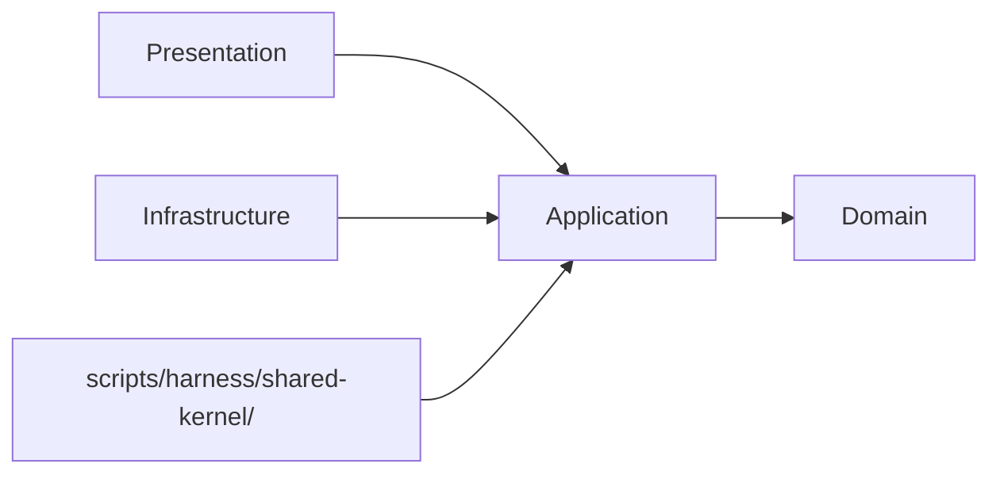
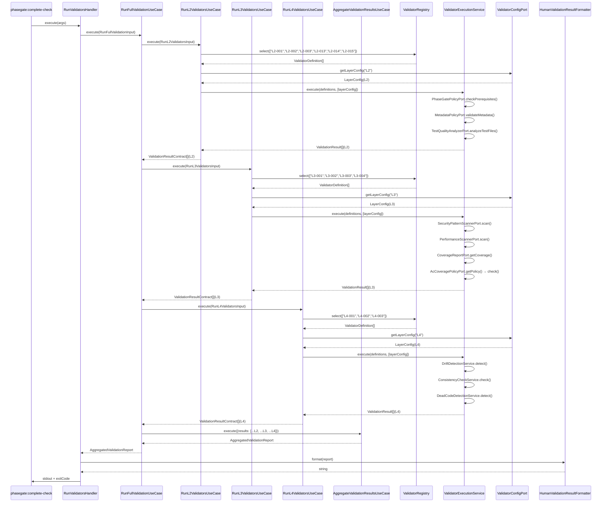
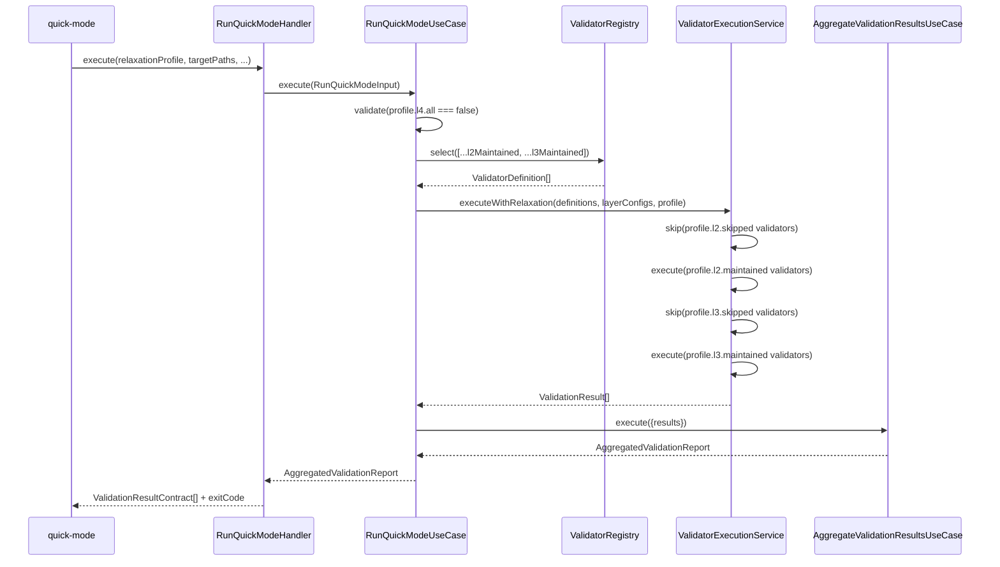
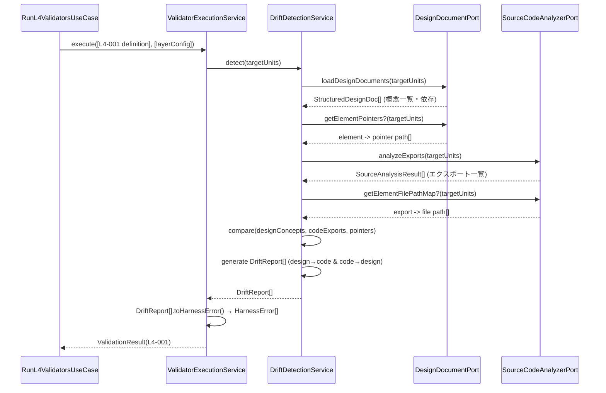

# 論理設計: validator-system

## WI-085 / WI-091 / WI-092 / WI-093 Runtime Configuration Threading

<!-- @work-item-id WI-085, WI-091, WI-092, WI-093 -->

Validator-system module construction accepts effective configuration from harness-api and pre-commit entry points. Layer enablement, design document roots, and validator catalog defaults are resolved before validators execute so CLI, hook, and status paths report the same operational surface.

<!-- @work-item-id WI-113 -->
## WI-113 Validate Format Boundary

`validate` accepts only `human`, `agent`, and `ci` output formats. Unsupported values such as `json` are rejected at the CLI boundary before validator execution so every layer selection follows the same fail-fast contract.

<!-- @work-item-id WI-185 -->
L4 document freshness and pointer validators consume phase2-extensions through project-root scan semantics. Validator-system must treat zero-document L4 outputs from packaged downstream execution as meaningful only when the caller project truly has no matching docs; default phase2 document scans use downstream `docs/**/*.md` with configured exclusions rather than the installed package tree.

<!-- @work-item-id WI-186 -->
Layer validation results are the gate source for `validate --layer <Lx>` and for live layer state consumed by harness-api status. When a live enabled layer reports fail/error, downstream health summaries must not convert that signal to a passing top-level JSON verdict.

<!-- @work-item-id WI-114 -->
## WI-114 Drift Signal Producer Contract

L4 drift detection remains the producer of raw drift items. Repository-scale compaction and advisory response assembly are owned by harness-api, but validator-system output preserves category data needed for downstream severity and next-action summaries.

@story-id H08-01
@story-id H08-02
@story-id H08-03
@story-id H08-04
@story-id H08-05
@story-id H08-06
@work-item-id WI-126
status mismatch policy は validator-system から利用可能な fail signal として扱う。既定は advisory report、CI/L2 相当の検出では `--fail-on-stale` により stale WI status を exit code 1 として扱う。
@work-item-id WI-140
`L2-014 work-item-status-staleness` を追加し、標準 `validate --layer L2` 経路で stale WI status を fail signal にする。validator-system は `WorkItemStatusPolicyPort` 経由で traceability-model の report を取得し、stale report を `L2-014` error として返す。local report は advisory、pre-commit / CI が消費する L2 validation は fail policy とする。
@work-item-id WI-129
`L2-003 test-quality` は language/framework adapter が `TestCaseStructure` を生成し、validator policy が test case 単位で AAA・単一Act・Act観測・domain mock 方針を評価する二段構成とする。
@work-item-id WI-130
Assertion quality は adapter が `SemanticAssertion` に変換し、validator policy が `AssertionTarget` と `AssertionStrength` で弱い観測を warning に分類する。
> **Unit ID**: validator-system
> **作成日**: 2026-03-19
> **対応ストーリー**: H08-01, H08-02, H08-03, H08-04, H08-05, H08-06
> **モード**: Unit横断設計（Phase 2）
> **前提ドキュメント**:
> - `docs/product/construction/validator-system/domain_model.md`
> - `docs/product/units/integration_contract.md`
> - `docs/inception/_shared/cross_cutting_decisions.md`
> - `docs/principles/architecture-philosophy.md`

---

## 1. アーキテクチャ概要

### 1.1 層構成と責務

| 層 | 責務 | 主な構成要素 | 依存先 |
|----|------|-------------|--------|
| Domain | `ValidatorDefinition` の不変定義、`ValidatorId` 検証、`ValidationResult` スナップショット生成、L4サービス群（乖離検出・整合性検証・デッドコード検出）、全ポートインターフェース | 値オブジェクト8種、ドメインサービス5種、ドメインポート12種 | なし |
| Application | UseCase調停。各バリデータ実行ロジックをストーリー単位で整理。LayerConfig取得とValidatorDefinition選択の組み合わせ。quick-mode緩和プロファイル適用。ValidationResult[]の統合集約 | UseCase6種（H08-01〜H08-06対応）、DTO、Mapper | Domain |
| Infrastructure | Domainポート実装。外部システム（ファイルシステム・AST解析・カバレッジレポート・外部ポリシー）とのアダプタ群 | Adapter11種 | Application, Domain |
| Presentation | CLIハンドラー。harness-apiから呼ばれる薄いバリデーション実行境界。出力フォーマット・終了コード決定 | CLIハンドラー3種、フォーマッター | Application, Domain |

### 1.2 依存方向

`cross_cutting_decisions.md §2` と `integration_contract.md §2.1` の正規語彙に合わせ、依存方向は以下に固定する。



```text
domain <- application <- infrastructure
domain <- application <- presentation
```

- Domain層は外部I/Oに依存しない
- Application層はDomainモデルの調停に徹し、I/O実装を持たない
- Infrastructure層は `domain/ports/` のみを実装し、CLIロジックを持たない
- Presentation層はApplication層経由でのみDomainを利用する
- Shared Kernel（`HarnessError`, `HarnessConfigV2`, `StoryId`）は読取専用で参照し、所有Unitの公開入口のみを通じてimportする

### 1.3 ディレクトリ構成（全ファイル一覧）

validator-systemの実装は `scripts/harness/validator-system/` 配下に4層で配置する。公開契約（ValidatorRegistryインターフェース・ValidationResult Contract）は `scripts/harness/shared-kernel/validator-system.ts` へ再エクスポートする。

```text
scripts/harness/
├── shared-kernel/
│   └── validator-system.ts          # ValidatorRegistry I/F + ValidationResult Contract 再エクスポート
└── validator-system/
    ├── domain/
    │   ├── value-objects/
    │   │   ├── validator-id.ts                  # L{n}-{nnn} 形式VO + ValidatorId定数一覧
    │   │   ├── validator-definition.ts           # バリデータ不変定義VO
    │   │   ├── validation-rule.ts               # ルール定義VO（ルール名・エラーテンプレート）
    │   │   ├── validation-result.ts             # 実行結果スナップショットVO
    │   │   ├── layer-config.ts                  # L2/L3/L4設定VO（enabled/thresholds/strictOnly）
    │   │   ├── drift-report.ts                  # 設計⇔コード乖離検出結果VO
    │   │   ├── consistency-report.ts            # 文書間レイヤー整合性検証結果VO
    │   │   └── dead-code-report.ts              # 未使用エクスポート・到達不能コード検出結果VO
    │   ├── services/
    │   │   ├── validator-registry.ts            # 全バリデータ定義カタログ管理・選択実行I/F
    │   │   ├── validator-execution-service.ts   # 順次実行・ValidationResult[]集約
    │   │   └── l4/
    │   │       ├── drift-detection-service.ts   # 設計⇔コード双方向乖離検出（L4-001）
    │   │       ├── consistency-check-service.ts # 文書間レイヤー整合性検証（L4-002）
    │   │       └── dead-code-detection-service.ts # 未使用コード検出（L4-003）
    │   └── ports/
    │       ├── validator-config-port.ts         # HarnessConfigV2からLayerConfig取得
    │       ├── phase-gate-policy-port.ts        # phase-dependency-model Phase Gate前提条件
    │       ├── metadata-policy-port.ts          # traceability-model メタデータ検証仕様
    │       ├── test-quality-analyzer-port.ts    # AAAパターン・命名規約解析（L2-003）
    │       ├── security-pattern-scanner-port.ts # セキュリティパターン検出（L3-001）
    │       ├── performance-scanner-port.ts      # パフォーマンス問題検出（L3-002）
    │       ├── coverage-report-port.ts          # テストカバレッジレポート取得（L3-003）
    │       ├── ac-coverage-policy-port.ts       # nyquist-validation AcCoverageGatePolicy（L3-004）
    │       ├── ac-bound-coverage-policy-port.ts # AC-bound coverage（L3-005, fail-closed, default-OFF）
    │       ├── design-document-port.ts          # 設計文書構造化データ読み取り（L4-001, L4-002）
    │       ├── source-code-analyzer-port.ts     # AST解析結果取得（L4-001, L4-003）
    │       ├── source-analysis-port.ts          # biome-ast-engine ImportGraph相当データ（L4-003）
    │       └── adr-reference-port.ts            # adr-foundation ADR実在性確認（L4-002）
    ├── application/
    │   ├── dto/
    │   │   ├── run-l2-validators-input.ts       # H08-01 UseCase入力DTO
    │   │   ├── run-l3-validators-input.ts       # H08-02 UseCase入力DTO
    │   │   ├── run-l4-validators-input.ts       # H08-03 UseCase入力DTO
    │   │   ├── run-quick-mode-input.ts          # H08-04 UseCase入力DTO
    │   │   ├── aggregate-results-input.ts       # H08-05 UseCase入力DTO
    │   │   ├── run-full-validation-input.ts     # H08-06 UseCase入力DTO
    │   │   ├── validation-result-contract.ts    # 公開契約DTO
    │   │   ├── validator-relaxation-profile.ts  # quick-mode 緩和プロファイルDTO
    │   │   └── aggregated-validation-report.ts  # 統合集約レポートDTO
    │   ├── mappers/
    │   │   └── validation-result-contract-mapper.ts  # ValidationResult → Contract変換
    │   └── use-cases/
    │       ├── run-l2-validators-usecase.ts     # H08-01: L2バリデータ実行
    │       ├── run-l3-validators-usecase.ts     # H08-02: L3バリデータ実行
    │       ├── run-l4-validators-usecase.ts     # H08-03: L4バリデータ実行
    │       ├── run-quick-mode-usecase.ts        # H08-04: Quickモード緩和実行
    │       ├── aggregate-validation-results-usecase.ts  # H08-05: バリデータ結果統合集約
    │       └── run-full-validation-usecase.ts   # H08-06: フルバリデーション実行
    ├── infrastructure/
    │   └── adapters/
    │       ├── harness-config-validator-config-adapter.ts   # ValidatorConfigPort実装
    │       ├── phase-dependency-phase-gate-policy-adapter.ts # PhaseGatePolicyPort実装
    │       ├── traceability-metadata-policy-adapter.ts       # MetadataPolicyPort実装
    │       ├── biome-ast-test-quality-analyzer-adapter.ts   # TestQualityAnalyzerPort実装
    │       ├── file-system-security-pattern-scanner-adapter.ts # SecurityPatternScannerPort実装
    │       ├── ast-performance-scanner-adapter.ts           # PerformanceScannerPort実装
    │       ├── json-coverage-report-adapter.ts              # CoverageReportPort実装
    │       ├── nyquist-ac-coverage-policy-adapter.ts        # AcCoveragePolicyPort実装
    │       ├── nyquist-ac-bound-coverage-policy-adapter.ts  # AcBoundCoveragePolicyPort実装（L3-005, fail-closed）
    │       ├── markdown-design-document-adapter.ts          # DesignDocumentPort実装
    │       ├── biome-ast-source-code-analyzer-adapter.ts    # SourceCodeAnalyzerPort実装
    │       ├── import-graph-source-analysis-adapter.ts      # SourceAnalysisPort実装
    │       └── adr-foundation-reference-adapter.ts         # AdrReferencePort実装
    └── presentation/
        ├── handlers/
        │   ├── run-validators-handler.ts        # バリデータ実行 CLIハンドラー
        │   ├── run-quick-mode-handler.ts        # Quickモード実行 CLIハンドラー
        │   └── report-validation-results-handler.ts # 結果レポート CLIハンドラー
        └── formatters/
            ├── human-validation-result-formatter.ts   # 開発者向けコンソール表示
            ├── agent-validation-result-formatter.ts   # AIエージェント向け詳細テキスト
            └── ci-validation-result-formatter.ts      # CI/GitHub Actions向けJSON
```

### 1.4 L2-003 Adapter / Policy Split

<!-- @work-item-id WI-129, WI-130 -->

`TestQualityAnalyzerPort` の責務は、対象ファイルから `TestCaseStructure` を抽出し、L2-003 の policy violation を `HarnessErrorLike` として返すことである。TypeScript/Vitest 実装は `BiomeAstTestQualityAnalyzerAdapter` に置くが、検査 contract は以下の runner-independent policy とする。

1. 各 test case に Arrange / Act / Assert の意味構造が存在する。
2. unit/integration test の Act は1つだけである。
3. Assert は Act が生成した observation、または state / emitted event / persisted effect / error contract / interaction を観測する。
4. domain layer test では domain/internal dependency replacement を禁止する。
5. lifecycle/E2E test は複数 Act を許可するが、Act ごとの Assert が読める構造を要求する。
6. weak truthiness / snapshot only / length only / interaction only / bare error assertion は warning とする。

弱い assertion の分類は adapter constructor option で差し替え可能にし、既定 policy は weak truthiness / snapshot only / length only / interaction only を warning とする。

Quick Mode では従来どおり `L2-003` を maintained validator として扱い、relaxation の対象にしない。

---

## 2. Domain層設計

### 2.1 値オブジェクト群

#### 2.1.1 ValidatorId

**責務**: L2-001〜L4-005の15バリデータを識別する不変値オブジェクト。

| 属性 | 型 | 説明 |
|------|----|------|
| layer | `"L2"` \| `"L3"` \| `"L4"` | バリデータが属するレイヤー |
| sequence | `string` | 3桁連番（"001"〜"003"等） |
| value | `string` | `L{n}-{nnn}` の完全表現 |

**有効ID定数**

| ValidatorId | バリデータ名 | 実行タイミング |
|-------------|------------|--------------|
| `L2-001` | phase-gate | Pre-commit |
| `L2-002` | metadata | Pre-commit |
| `L2-003` | test-quality | Pre-commit |
| `L2-014` | work-item-status-staleness | Pre-commit / CI |
| `L3-001` | security | CI |
| `L3-002` | performance | CI |
| `L3-003` | coverage | CI |
| `L3-004` | nyquist | CI |
| `L3-005` | ac-bound-coverage | CI（default-OFF, opt-in, fail-closed） |
| `L4-001` | drift-detect | Scheduled |
| `L4-002` | consistency-check | Scheduled |
| `L4-003` | dead-code | Scheduled |
| `L4-004` | doc-freshness | Scheduled |
| `L4-005` | pointer-validation | Scheduled |

**生成ルール**

- 正規表現 `/^L[2-4]-\d{3}$/` に一致すること
- 有効IDは上記12種のみ。未登録IDは現行バージョンでは無効
- `cross_cutting_decisions.md §3` に従い、意味名（`"phase-gate"` 等）は識別子として使用しない

**メソッド**

- `static create(raw: string): ValidatorId` — 形式検証。無効値は `InvalidValidatorIdError`
- `static fromName(name: string): ValidatorId` — バリデータ名（"phase-gate"等）から逆引き
- `getLayer(): "L2" | "L3" | "L4"` — レイヤー識別子を返す
- `getName(): string` — バリデータ名称（"phase-gate"等）を返す
- `toString(): string` — "L2-001"等の完全表現を返す
- `equals(other: ValidatorId): boolean` — 値等価性の比較

**バリデーションルール**

- L2-001〜L4-005以外は `InvalidValidatorIdError`
- 大文字・小文字の正規化は行わない。入力値が正規形であることを要求する

---

#### 2.1.2 ValidatorDefinition

**責務**: 個々のバリデータの不変定義を保持するVO。biome-ast-engineの`RuleDefinition`パターンに準拠。

| 属性 | 型 | 説明 |
|------|----|------|
| validatorId | `ValidatorId` | バリデータ識別子 |
| layer | `"L2"` \| `"L3"` \| `"L4"` | 属するレイヤー |
| name | `string` | バリデータ名称（"phase-gate"等） |
| description | `string` | 検証内容の説明 |
| rules | `readonly ValidationRule[]` | 適用するルール定義一覧 |
| enabledCondition | `"always"` \| `"layerEnabled"` \| `"strictOnly"` | 有効化条件 |
| externalPolicyRef | `string \| null` | 外部ポリシー参照識別子（L2-001/L2-002/L3-004のみ） |
| executionPhase | `"pre-commit"` \| `"ci"` \| `"scheduled"` | 実行フェーズ |

**生成ルール**

- `validatorId.getLayer()` と `layer` フィールドが一致すること
- `externalPolicyRef` を持つ場合、ValidatorRegistryが実行時にPortを通じてポリシーを解決すること（INV-3準拠）
- `enabledCondition === "strictOnly"` の場合、`LayerConfig.strictOnly === false` 環境でスキップされること（INV-4準拠）

**メソッド**

- `requiresExternalPolicy(): boolean` — `externalPolicyRef !== null` を返す
- `isStrictOnly(): boolean` — `enabledCondition === "strictOnly"` を返す
- `equals(other: ValidatorDefinition): boolean` — `validatorId` の値等価性で比較

**バリデーションルール**

- `rules` は空配列不可（最低1ルール必要）
- `executionPhase` は `layer` 属性から自動的に決定可能（L2→"pre-commit", L3→"ci", L4→"scheduled"）

---

#### 2.1.3 ValidationRule

**責務**: バリデータが適用する個々のルールの不変定義。

| 属性 | 型 | 説明 |
|------|----|------|
| ruleName | `string` | ルール識別名（例: "aaa-pattern", "hardcoded-secret"） |
| description | `string` | ルール説明 |
| errorTemplate | `{ code: string; severity: "error" \| "warning"; messageTemplate: string; suggestionTemplate: string }` | エラー生成テンプレート |
| fixExample | `string \| null` | 修正コード例 |

**メソッド**

- `buildErrorCode(): string` — `errorTemplate.code` を返す
- `equals(other: ValidationRule): boolean` — `ruleName` の等価性で比較

---

#### 2.1.4 ValidationResult

**責務**: バリデータ実行結果のスナップショットVO。不変性が保証される。

| 属性 | 型 | 説明 |
|------|----|------|
| validatorId | `ValidatorId` | 実行したバリデータのID |
| passed | `boolean` | 検証の成否 |
| errors | `readonly HarnessError[]` | 検出されたエラー一覧（Shared Kernel型） |
| durationMs | `number` | 実行時間（ミリ秒） |
| skipped | `boolean` | enabled=falseによるスキップ |

**不変条件**

- `passed === true` の場合、`errors` は空配列（INV-5）
- `HarnessError.code` フィールドにはバリデータID相当のErrorCodeを使用（INV-6）
- `durationMs >= 0`（INV-7）
- `skipped === true` の場合、`passed === true` かつ `errors` は空配列（INV-8）

**ファクトリメソッド**

- `static pass(validatorId: ValidatorId, durationMs: number): ValidationResult` — 成功スナップショット
- `static fail(validatorId: ValidatorId, errors: readonly HarnessError[], durationMs: number): ValidationResult` — 失敗スナップショット
- `static skip(validatorId: ValidatorId): ValidationResult` — スキップスナップショット（`durationMs: 0`）
- `static failure(validatorId: ValidatorId, errors: HarnessError[], durationMs: number): ValidationResult` — `fail` の別名

**メソッド**

- `hasErrors(): boolean` — `errors.length > 0` を返す
- `errorCount(): number` — エラー件数を返す
- `equals(other: ValidationResult): boolean` — `validatorId` + `passed` + `errors` の値等価性

---

#### 2.1.5 LayerConfig

**責務**: HarnessConfigV2から注入されるL2/L3/L4の実行設定VO。

| 属性 | 型 | 説明 |
|------|----|------|
| layer | `"L2"` \| `"L3"` \| `"L4"` | 対象レイヤー |
| enabled | `boolean` | レイヤー全体の有効化フラグ |
| validatorIds | `readonly string[]` | 有効なバリデータID文字列一覧 |
| thresholds | `Record<string, number>` | バリデータ固有の閾値（例: `coverageThreshold: 90`） |
| strictOnly | `boolean` | strictプリセット限定フラグ |
| preset | `"minimal"` \| `"standard"` \| `"strict"` | 適用プリセット |

**生成ルール**

- `enabled === false` の場合、このLayerConfigを持つバリデータは全てスキップされる（INV-8）
- `thresholds` のキーはバリデータ固有の閾値名（INV-9）
- `strictOnly === true` かつ `preset !== "strict"` の場合は自動スキップ対象

**メソッド**

- `isValidatorEnabled(validatorId: ValidatorId): boolean` — 当該バリデータが有効か判定
- `getThreshold(key: string): number | null` — 閾値取得。未定義は `null`
- `equals(other: LayerConfig): boolean` — 全フィールドの値等価性

---

#### 2.1.6 DriftReport

**責務**: 設計文書とコード実装の双方向乖離検出結果VO（L4-001専用）。

| 属性 | 型 | 説明 |
|------|----|------|
| direction | `"design→code"` \| `"code→design"` | 乖離の方向（INV-10） |
| unitName | `string` | 乖離が発生したUnit名 |
| element | `string` | 乖離のある要素名（クラス名・インターフェース名等） |
| recommendation | `string` | 推奨アクション |
| location | `{ designDoc?: string; sourceFile?: string }` | 乖離箇所のファイルパス |

**生成ルール**

- `direction === "design→code"`: 設計文書に存在するがコードに存在しない
- `direction === "code→design"`: コードに存在するが設計文書に存在しない

**メソッド**

- `toHarnessError(): HarnessError` — L4-001エラーとして変換。`code: "L4-001"` 固定
- `equals(other: DriftReport): boolean` — 全フィールドの値等価性

---

#### 2.1.7 ConsistencyReport

**責務**: 設計文書間のレイヤー整合性検証結果VO（L4-002専用）。

| 属性 | 型 | 説明 |
|------|----|------|
| mismatchPairs | `readonly { expected: string; actual: string; location: string }[]` | 不整合ペア一覧 |
| checkTargets | `readonly string[]` | 検証対象文書の相対パス一覧 |
| checkedAt | `string` | 検証実行日時（ISO 8601形式） |

**メソッド**

- `hasMismatches(): boolean` — `mismatchPairs.length > 0` を返す
- `mismatchCount(): number` — 不整合件数を返す
- `toHarnessErrors(): readonly HarnessError[]` — 各不整合をL4-002エラーとして変換

---

#### 2.1.8 DeadCodeReport

**責務**: 未使用エクスポートおよび到達不能コードの検出結果VO（L4-003専用）。

| 属性 | 型 | 説明 |
|------|----|------|
| unusedExports | `readonly string[]` | 未使用エクスポートの識別子一覧（"filePath::exportName"形式） |
| unreachableCode | `readonly { filePath: string; range: { startLine: number; endLine: number } }[]` | 到達不能コードの位置情報一覧 |
| gcRecommended | `boolean` | strictプリセット時のGC推奨フラグ |

**メソッド**

- `hasDeadCode(): boolean` — `unusedExports.length > 0 || unreachableCode.length > 0`
- `toHarnessErrors(): readonly HarnessError[]` — L4-003エラーとして変換

---

### 2.2 ドメインサービス

#### 2.2.1 ValidatorRegistry

**責務**: L2-L4の15バリデータ定義のカタログ管理と選択実行インターフェースの提供。`domain_model.md §D1` に従い、biome-ast-engineの`RuleDefinitionRegistry`パターンを踏襲する。

**コンストラクタ依存**

- `definitions: readonly ValidatorDefinition[]` — L2-L4の15定義の静的リスト

##### `getDefinition(validatorId: ValidatorId): ValidatorDefinition`

- 入力: `validatorId: ValidatorId`
- 出力: `ValidatorDefinition`
- 処理フロー:
  1. 内部 `Map<string, ValidatorDefinition>` を参照する
  2. 一致する定義を返却する
  3. 存在しない場合は `UnknownValidatorError`
- 例外: `UnknownValidatorError`
- 不変条件: 同一validatorIdの重複登録禁止

##### `getAllDefinitions(): readonly ValidatorDefinition[]`

- 入力: なし
- 出力: 全定義一覧（validatorId昇順）
- 処理フロー: 内部配列をvalidatorId昇順で返す
- 例外: なし
- 不変条件: 呼び出し側から変更できないreadonly配列を返す

##### `listByLayer(layer: "L2" | "L3" | "L4"): readonly ValidatorDefinition[]`

- 入力: `layer`
- 出力: 該当レイヤーのバリデータ定義一覧
- 処理フロー: `definition.layer` でフィルタしvalidatorId昇順で返す
- 例外: なし

##### `select(validatorIds: readonly ValidatorId[]): readonly ValidatorDefinition[]`

- 入力: `validatorIds` — 実行対象のID一覧
- 出力: 対応する `ValidatorDefinition[]`
- 処理フロー: 各IDに対して `getDefinition()` を呼び、順序を保持して返す
- 例外: `UnknownValidatorError`（IDが無効の場合）
- 用途: harness-api / quick-modeが消費するValidatorRegistry選択実行APIの入口

##### `hasDefinition(validatorId: ValidatorId): boolean`

- 入力: `validatorId`
- 出力: `boolean`
- 処理フロー: 内部Mapの存在判定を返す
- 例外: なし

---

#### 2.2.2 ValidatorExecutionService

**責務**: 指定された `ValidatorDefinition[]` を順次実行し、`ValidationResult[]` を集約するオーケストレーター。

**コンストラクタ依存**

- `validatorConfigPort: ValidatorConfigPort` — LayerConfig取得
- `phaseGatePolicyPort: PhaseGatePolicyPort` — L2-001専用
- `metadataPolicyPort: MetadataPolicyPort` — L2-002専用
- `testQualityAnalyzerPort: TestQualityAnalyzerPort` — L2-003専用
- `securityPatternScannerPort: SecurityPatternScannerPort` — L3-001専用
- `performanceScannerPort: PerformanceScannerPort` — L3-002専用
- `coverageReportPort: CoverageReportPort` — L3-003専用
- `acCoveragePolicyPort: AcCoveragePolicyPort` — L3-004専用
- `driftDetectionService: DriftDetectionService` — L4-001専用
- `consistencyCheckService: ConsistencyCheckService` — L4-002専用
- `deadCodeDetectionService: DeadCodeDetectionService` — L4-003専用

##### `execute(definitions: readonly ValidatorDefinition[], layerConfigs: readonly LayerConfig[]): Promise<readonly ValidationResult[]>`

- 入力: 実行対象の `ValidatorDefinition[]` と対応する `LayerConfig[]`
- 出力: `Promise<readonly ValidationResult[]>`
- 処理フロー:
  1. 各 `ValidatorDefinition` について `LayerConfig.isValidatorEnabled()` を確認する
  2. `enabled === false` の場合 `ValidationResult.skip()` を生成する
  3. `enabledCondition === "strictOnly"` かつ `LayerConfig.strictOnly === false` の場合はスキップする
  4. 実行対象のバリデータを `validatorId.getLayer()` で分岐し、対応Portを呼び出す
  5. 各バリデータの実行時間を `Date.now()` で計測する
  6. 結果を `ValidationResult.pass()` または `ValidationResult.fail()` で生成する
  7. 全件の `ValidationResult[]` を入力順で返す
- 例外:
  - `ValidatorExecutionError` — 実行時エラー（Port実装の失敗等）
  - 個別バリデータの例外はキャッチしてエラー内包の `ValidationResult.fail()` に変換する
- 不変条件: `ValidationResult[]` の順序は入力 `definitions[]` の順序と一致する

##### `executeWithRelaxation(definitions: readonly ValidatorDefinition[], layerConfigs: readonly LayerConfig[], profile: ValidatorRelaxationProfile): Promise<readonly ValidationResult[]>`

- 入力: 実行対象定義、LayerConfig、緩和プロファイル
- 出力: `Promise<readonly ValidationResult[]>`
- 処理フロー:
  1. `profile` の `skipped` バリデータIDに含まれる定義はスキップする
  2. `profile` の `maintained` バリデータIDに含まれる定義のみ通常実行する
  3. `profile.phaseExecution.twoPhaseRequired === false` の場合はPhase Gate検証をスキップする
  4. `execute()` の内部ロジックを緩和条件付きで実行する
- 用途: H08-04 RunQuickModeUseCase から呼ばれる

---

#### 2.2.3 DriftDetectionService

**責務**: 設計文書（domain_model.md等）とソースコード実装の双方向乖離検出。`DriftReport[]` を生成する（L4-001）。

**コンストラクタ依存**

- `designDocumentPort: DesignDocumentPort` — 設計文書の構造化データ取得
- `sourceCodeAnalyzerPort: SourceCodeAnalyzerPort` — ソースコードAST解析結果取得

##### `detect(targetUnits?: readonly string[]): Promise<readonly DriftReport[]>`

- 入力: `targetUnits` — 対象Unit名の一覧（省略時は全Unit）
- 出力: `Promise<readonly DriftReport[]>`
- 処理フロー:
  1. `designDocumentPort.loadDesignDocuments(targetUnits)` で設計文書の概念一覧を取得する
  2. `sourceCodeAnalyzerPort.analyzeExports(targetUnits)` でコードのエクスポート一覧を取得する
  3. 設計文書に存在しコードに存在しない概念を `"design→code"` 方向の `DriftReport` として生成する
  4. コードに存在し設計文書に存在しない概念を `"code→design"` 方向の `DriftReport` として生成する
  5. 全 `DriftReport` を direction昇順・unitName昇順で返す
- 例外:
  - `DesignDocumentReadError` — 設計文書の読み取り失敗
  - `SourceCodeAnalysisError` — AST解析失敗
- 不変条件: `DriftReport.direction` は `"design→code"` または `"code→design"` のみ（INV-10）

---

#### 2.2.4 ConsistencyCheckService

**責務**: 設計文書間（domain_model.md, logical_design.md等）のレイヤー整合性検証。`ConsistencyReport` を生成する（L4-002）。

**コンストラクタ依存**

- `designDocumentPort: DesignDocumentPort` — 設計文書の構造化データ取得
- `adrReferencePort: AdrReferencePort` — ADR実在性確認

##### `check(targetDocs?: readonly string[]): Promise<ConsistencyReport>`

- 入力: `targetDocs` — 検証対象文書パスの一覧（省略時は全設計文書）
- 出力: `Promise<ConsistencyReport>`
- 処理フロー:
  1. `designDocumentPort.loadDesignDocuments()` で文書の構造化データを取得する
  2. 各文書のレイヤー依存方向を `cross_cutting_decisions.md §2` の規約と照合する
  3. `adrReferencePort.exists()` で文書が参照するADRの実在性を確認する
  4. 不整合を `mismatchPairs` として収集する
  5. `ConsistencyReport` を生成して返す
- 例外:
  - `DesignDocumentReadError`
  - `AdrReferenceCheckError`
- 不変条件: 検証結果は検証実行時のスナップショットであり、以後の文書変更を反映しない

---

#### 2.2.5 DeadCodeDetectionService

**責務**: 未使用エクスポートおよび到達不能コードの検出。`DeadCodeReport` を生成する（L4-003）。biome-ast-engineとは `SourceAnalysisPort` を通じて疎結合を維持する（`domain_model.md §D4`）。

**コンストラクタ依存**

- `sourceAnalysisPort: SourceAnalysisPort` — ImportGraph相当の構造化データ取得

##### `detect(strictMode: boolean): Promise<DeadCodeReport>`

- 入力: `strictMode` — GC推奨の有効化フラグ
- 出力: `Promise<DeadCodeReport>`
- 処理フロー:
  1. `sourceAnalysisPort.getImportGraph()` でImportGraph相当データを取得する
  2. エクスポートされているが他ファイルからimportされていない識別子を `unusedExports` として収集する
  3. 制御フロー解析で到達不能なコードブロックを `unreachableCode` として収集する
  4. `strictMode === true` の場合 `gcRecommended = true` を設定する
  5. `DeadCodeReport` を生成して返す
- 例外:
  - `SourceAnalysisError`

---

### 2.3 ドメインポート設計

全ポートは `scripts/harness/validator-system/domain/ports/` に定義し、Infrastructure層が実装する。

#### 2.3.1 ValidatorConfigPort

```typescript
export interface ValidatorConfigPort {
  getLayerConfig(layer: "L2" | "L3" | "L4"): Promise<LayerConfig>;
}
```

| メソッド | 入力 | 出力 | 説明 |
|---------|------|------|------|
| `getLayerConfig` | `layer` | `Promise<LayerConfig>` | `HarnessConfigV2` の `layers.L2/L3/L4` から `LayerConfig` VO を構築して返す |

---

#### 2.3.2 PhaseGatePolicyPort

```typescript
export interface PhaseGatePolicyPort {
  checkPrerequisites(context: { unitName: string; currentPhase: string }): Promise<{
    satisfied: boolean;
    violations: readonly HarnessError[];
  }>;
}
```

| メソッド | 入力 | 出力 | 説明 |
|---------|------|------|------|
| `checkPrerequisites` | `unitName`, `currentPhase` | `Promise<{ satisfied, violations }>` | phase-dependency-modelのPhaseGate前提条件を確認し、違反を `HarnessError[]` で返す |

---

#### 2.3.3 MetadataPolicyPort

```typescript
export interface MetadataPolicyPort {
  validateMetadata(context: {
    filePath: string;
    fileContent: string;
  }): Promise<{
    passed: boolean;
    errors: readonly HarnessError[];
  }>;
}
```

| メソッド | 入力 | 出力 | 説明 |
|---------|------|------|------|
| `validateMetadata` | `filePath`, `fileContent` | `Promise<{ passed, errors }>` | `@unit/@layer/@story-id` メタデータの完全性を検証する。`StoryId` 照合はtraceability-model経由 |

---

#### 2.3.4 TestQualityAnalyzerPort

```typescript
export interface TestQualityAnalyzerPort {
  analyzeTestFiles(targetPaths: readonly string[]): Promise<{
    results: readonly {
      filePath: string;
      passed: boolean;
      violations: readonly HarnessError[];
    }[];
  }>;
}
```

| メソッド | 入力 | 出力 | 説明 |
|---------|------|------|------|
| `analyzeTestFiles` | `targetPaths` | `Promise<{ results[] }>` | AAAパターン・`actual`命名規約・single-act・no-domain-mock・describe-it規約を検証する |

---

#### 2.3.5 SecurityPatternScannerPort

```typescript
export interface SecurityPatternScannerPort {
  scan(targetPaths: readonly string[]): Promise<{
    passed: boolean;
    findings: readonly HarnessError[];
  }>;
}
```

| メソッド | 入力 | 出力 | 説明 |
|---------|------|------|------|
| `scan` | `targetPaths` | `Promise<{ passed, findings }>` | ハードコード秘密情報・SQLインジェクションパターン等を検出する |

---

#### 2.3.6 PerformanceScannerPort

```typescript
export interface PerformanceScannerPort {
  scan(targetPaths: readonly string[], thresholds: Record<string, number>): Promise<{
    passed: boolean;
    findings: readonly HarnessError[];
  }>;
}
```

| メソッド | 入力 | 出力 | 説明 |
|---------|------|------|------|
| `scan` | `targetPaths`, `thresholds` | `Promise<{ passed, findings }>` | ループ内await、N+1クエリ、bundleSizeLimitを検出する。`thresholds.bundleSizeLimit` を参照 |

---

#### 2.3.7 CoverageReportPort

```typescript
export interface CoverageReportPort {
  getCoverage(): Promise<{
    overallCoverage: number;
    perFileCoverage: readonly { filePath: string; coverage: number }[];
  }>;
}
```

| メソッド | 入力 | 出力 | 説明 |
|---------|------|------|------|
| `getCoverage` | なし | `Promise<{ overallCoverage, perFileCoverage }>` | Vitestのカバレッジレポート（JSON形式）から全体・ファイル別カバレッジを返す |

---

#### 2.3.8 AcCoveragePolicyPort

```typescript
export interface AcCoveragePolicyPort {
  getPolicy(): Promise<AcCoverageGatePolicy>;
}

// nyquist-validationが所有する契約インターフェース
export interface AcCoverageGatePolicy {
  check(matrix: RequirementTestMatrix): { passed: boolean; errors: HarnessError[] };
}
```

| メソッド | 入力 | 出力 | 説明 |
|---------|------|------|------|
| `getPolicy` | なし | `Promise<AcCoverageGatePolicy>` | nyquist-validationの `AcCoverageGatePolicy` インスタンスを取得する。L3-004がこのポリシーを使ってAC網羅率を検証する |

---

#### 2.3.9 DesignDocumentPort

```typescript
export interface DesignDocumentPort {
  loadDesignDocuments(targetUnits?: readonly string[]): Promise<readonly {
    unitName: string;
    docPath: string;
    concepts: readonly { name: string; type: "class" | "interface" | "type" | "value-object" | "service"; pointers?: readonly string[] }[];
    layerDependencies: readonly { from: string; to: string }[];
    adrRefs: readonly string[];
  }[]>;
  getElementPointers?(targetUnits?: readonly string[]): Promise<Record<string, readonly string[]>>;
}
```

| メソッド | 入力 | 出力 | 説明 |
|---------|------|------|------|
| `loadDesignDocuments` | `targetUnits?` | `Promise<StructuredDesignDoc[]>` | Markdownの設計文書を解析し、概念一覧・レイヤー依存・ADR参照を構造化して返す |
| `getElementPointers` | `targetUnits?` | `Promise<Record<string, readonly string[]>>` | WI-095 / ADR-018: 見出し単位の `pointers` block から設計要素→実装ファイルpathの明示対応を返す |

---

#### 2.3.10 SourceCodeAnalyzerPort

```typescript
export interface SourceCodeAnalyzerPort {
  analyzeExports(targetUnits?: readonly string[]): Promise<readonly {
    unitName: string;
    filePath: string;
    exports: readonly { name: string; type: "class" | "interface" | "type" | "function" | "const" }[];
    imports: readonly { source: string; name: string }[];
  }[]>;
  getElementFilePathMap?(targetUnits?: readonly string[]): Promise<Record<string, readonly string[]>>;
}
```

| メソッド | 入力 | 出力 | 説明 |
|---------|------|------|------|
| `analyzeExports` | `targetUnits?` | `Promise<SourceAnalysisResult[]>` | ソースコードのAST解析からエクスポート・import一覧を取得する。L4-001乖離検出とL4-003デッドコード検出で使用 |
| `getElementFilePathMap` | `targetUnits?` | `Promise<Record<string, readonly string[]>>` | WI-095 / ADR-018: export要素名から定義ファイルpathを返し、design pointer照合に使う |

---

#### 2.3.11 SourceAnalysisPort

```typescript
export interface SourceAnalysisPort {
  getImportGraph(): Promise<{
    nodes: readonly { filePath: string; exports: readonly string[] }[];
    edges: readonly { from: string; to: string; importedNames: readonly string[] }[];
  }>;
}
```

| メソッド | 入力 | 出力 | 説明 |
|---------|------|------|------|
| `getImportGraph` | なし | `Promise<ImportGraphData>` | biome-ast-engineのImportGraph相当の構造化データを返す。`domain_model.md §D4` の疎結合方針に従い、直接importは行わない |

---

#### 2.3.12 AdrReferencePort

```typescript
export interface AdrReferencePort {
  exists(adrRef: string): Promise<boolean>;
  getMetadata(adrRef: string): Promise<{
    adrId: string;
    title: string;
    status: "Proposed" | "Accepted" | "Deprecated" | "Superseded";
  } | null>;
}
```

| メソッド | 入力 | 出力 | 説明 |
|---------|------|------|------|
| `exists` | `adrRef` | `Promise<boolean>` | `ADR-{nnn}` 形式のADRが実在するか確認する |
| `getMetadata` | `adrRef` | `Promise<metadata \| null>` | ADRのフロントマターから基本情報を取得する |

---

## 3. Application層設計

### 3.1 DTO / Mapper方針

| 要素 | 役割 |
|------|------|
| `ValidationResultContract` | Shared Kernel公開用readonly DTO (`{ validatorId, passed, errors: HarnessError[], durationMs }`) |
| `ValidatorRelaxationProfile` | quick-modeから受け取る緩和指示DTO |
| `AggregatedValidationReport` | H08-05が生成する統合集約レポートDTO |
| `ValidationResultContractMapper` | `ValidationResult` → `ValidationResultContract` 変換 |

Shared KernelのDTOはApplication層でのみ生成する。Domain層は内部VOを維持し、他Unitへ直接露出しない。

### 3.2 ValidationResultContract（公開契約DTO）

```typescript
// H08-01〜H08-06が生成し、harness-api・quick-modeが消費する
export interface ValidationResultContract {
  readonly validatorId: string;
  readonly passed: boolean;
  readonly errors: readonly HarnessError[];
  readonly durationMs: number;
  readonly skipped?: boolean;
}
```

### 3.3 ValidatorRelaxationProfile（quick-modeからの緩和指示）

```typescript
// quick-modeが生成し、H08-04 RunQuickModeUseCaseが消費する
export interface ValidatorRelaxationProfile {
  readonly levelDependencyRelaxed: false;
  readonly l1: { readonly all: true };
  readonly l2: {
    readonly maintained: readonly string[];  // 実行するバリデータID
    readonly skipped: readonly string[];    // スキップするバリデータID
  };
  readonly l3: {
    readonly maintained: readonly string[];
    readonly skipped: readonly string[];
  };
  readonly l4: { readonly all: false };    // L4は常にスキップ
  readonly phaseExecution: { readonly twoPhaseRequired: false };
}
```

---

### 3.4 UseCase詳細

#### 3.4.1 H08-01: RunL2ValidatorsUseCase

**対応ストーリー**: H08-01（L2バリデータ実行）

**責務**: phase-gate（L2-001）・metadata（L2-002）・test-quality（L2-003）・CLI E2E coverage（L2-013）・WI status staleness（L2-014）・contract traceability coverage（L2-015）の6バリデータをPre-commit文脈で実行し、`ValidationResultContract[]` を返す。

<!-- @work-item-id WI-156 -->
#### L4-006: skill-catalog-drift

`L4-006 skill-catalog-drift` is a scheduled documentation drift guardrail. `RunL4ValidatorsUseCase` invokes `SkillCatalogDriftService` through the file-system adapter when `L4-006` is enabled. The adapter reads:

- actual skill directories from first-level `skills/*/SKILL.md`
- maintained total declarations in README / DEVELOPMENT / public guide / `skills/README.md`
- category heading counts in `docs/guide/skills-overview.md`

Any mismatch is returned as a warning `ValidationResultContract` error with code `L4-006` and a remediation that tells maintainers to update either the skill catalog or the documented count in the same release change.

**コンストラクタ依存**

- `validatorRegistry: ValidatorRegistry`
- `validatorExecutionService: ValidatorExecutionService`
- `validatorConfigPort: ValidatorConfigPort`
- `contractMapper: ValidationResultContractMapper`

**入力DTO**: `RunL2ValidatorsInput`

| 項目 | 型 | 必須 | 説明 |
|------|----|------|------|
| validatorIds | `readonly string[] \| undefined` | No | 実行対象バリデータID。省略時は全L2（L2-001, L2-002, L2-003, L2-013, L2-014, L2-015） |
| targetPaths | `readonly string[]` | Yes | 検証対象ファイルパス一覧 |
| unitName | `string` | Yes | 検証対象Unit名（Phase Gate確認用） |
| currentPhase | `string` | Yes | 現在フェーズ（Phase Gate確認用） |

**出力**: `Promise<readonly ValidationResultContract[]>`

**処理フロー**

1. `validatorIds` が指定された場合、`ValidatorId.create()` でVO化する。省略時はL2全定義を取得する
2. `validatorRegistry.select(validatorIds)` で `ValidatorDefinition[]` を取得する
3. `validatorConfigPort.getLayerConfig("L2")` で `LayerConfig` を取得する
4. `validatorExecutionService.execute(definitions, [layerConfig])` でバリデータを実行する
5. 結果を `contractMapper.toContract()` で変換する
6. `readonly ValidationResultContract[]` で返す

**例外**

- `InvalidValidatorIdError` — 無効なバリデータIDが指定された場合
- `UnknownValidatorError` — 存在しないバリデータIDが指定された場合
- `ValidatorExecutionError` — バリデータ実行中のI/Oエラー等

---

#### 3.4.2 H08-02: RunL3ValidatorsUseCase

**対応ストーリー**: H08-02（L3バリデータ実行）

**責務**: security（L3-001）・performance（L3-002）・coverage（L3-003）・nyquist（L3-004）・ac-bound-coverage（L3-005）のバリデータをCI文脈で実行し、`ValidationResultContract[]` を返す。

**コンストラクタ依存**

- `validatorRegistry: ValidatorRegistry`
- `validatorExecutionService: ValidatorExecutionService`
- `validatorConfigPort: ValidatorConfigPort`
- `contractMapper: ValidationResultContractMapper`
- `acBoundCoveragePolicyPort?: AcBoundCoveragePolicyPort` — L3-005専用（省略可、未配線時は L3-005 は評価されず skip）

**入力DTO**: `RunL3ValidatorsInput`

| 項目 | 型 | 必須 | 説明 |
|------|----|------|------|
| validatorIds | `readonly string[] \| undefined` | No | 実行対象バリデータID。省略時は全L3（L3-001〜L3-004。L3-005 は default-OFF なので config で明示有効化した場合のみ） |
| targetPaths | `readonly string[]` | Yes | 検証対象ファイルパス一覧 |
| coverageReportPath | `string \| undefined` | No | カバレッジレポートJSONパス（L3-003専用） |
| requirementMatrixPath | `string \| undefined` | No | RequirementTestMatrixパス（L3-004専用） |
| acBoundStories | `readonly string[] \| undefined` | No | L3-005 のスコープ対象 story-id 配列（`layers.L3.acBoundStories`）。省略時 `[]` |

**L3-005（ac-bound-coverage, fail-closed, default-OFF）ノート**

- L3-004 と同じ override ブロック方式で実装する（`overrideMap` に unskipped な L3-005 がある場合のみ `AcBoundCoveragePolicyPort.checkAcBoundCoverage()` を呼ぶ）。
- **fail-closed**: matrix 不在 / parse 不能 / スコープ内の in-scope story に ac-binding を欠く AC が 1 つでもあれば FAIL。
- **scope**: `acBoundStories`（story-id 配列）のみを検査対象とし、スコープ外 story の AC は無視する。
- **default-OFF**: `DEFAULT_CONFIG.layers.L3.validators` にも standard/strict プリセットにも含めない。config で明示的に `L3-005`（または alias `ac-bound-coverage`）を有効化した場合のみ発火する。
- 未有効化時は L3-004 と同様、`select(['L3-005'])` は解決可能だが skip 結果を返す。

**出力**: `Promise<readonly ValidationResultContract[]>`

**処理フロー**

1. `validatorIds` の処理は H08-01 と同様
2. `validatorRegistry.select()` で L3 の `ValidatorDefinition[]` を取得する
3. `validatorConfigPort.getLayerConfig("L3")` で `LayerConfig` を取得する
4. `LayerConfig.enabled === false` の場合、全定義をスキップして空の `ValidationResultContract[]` を返す
5. `L3-002`（performance）の `enabledCondition === "strictOnly"` かつ `LayerConfig.strictOnly === false` の場合、L3-002のみスキップする
6. `validatorExecutionService.execute()` でバリデータを実行する
7. 結果を変換して返す

**例外**

- H08-01と同様の例外種別
- `CoverageReportReadError` — カバレッジレポートが存在しない場合

---

#### 3.4.3 H08-03: RunL4ValidatorsUseCase

**対応ストーリー**: H08-03（L4バリデータ実行）

<!-- @work-item-id WI-033 -->
**責務**: drift-detect（L4-001）・consistency-check（L4-002）・dead-code（L4-003）・doc-freshness（L4-004）・pointer-validation（L4-005）・skill-catalog-drift（L4-006）の6バリデータをScheduled文脈で実行し、`ValidationResultContract[]` を返す。@work-item-id WI-156

**コンストラクタ依存**

- `validatorRegistry: ValidatorRegistry`
- `validatorExecutionService: ValidatorExecutionService`
- `validatorConfigPort: ValidatorConfigPort`
- `contractMapper: ValidationResultContractMapper`

**入力DTO**: `RunL4ValidatorsInput`

| 項目 | 型 | 必須 | 説明 |
|------|----|------|------|
| validatorIds | `readonly string[] \| undefined` | No | 実行対象バリデータID。省略時は全L4（L4-001〜L4-006） |
| targetUnits | `readonly string[] \| undefined` | No | 対象Unitフィルタ（省略時は全Unit） |
| strictMode | `boolean` | No | strictプリセット判定フラグ（L4-003のgcRecommended制御） |
| forceLayerEnabled | `boolean` | No | 明示的な `validate --layer L4` 実行時に、デフォルト無効のL4を一時的に実行する |

**出力**: `Promise<readonly ValidationResultContract[]>`

**処理フロー**

1. `validatorIds` の処理は H08-01 と同様
2. `validatorConfigPort.getLayerConfig("L4")` で `LayerConfig` を取得する
3. `L4-003`（dead-code）の `enabledCondition === "strictOnly"` を確認する
4. `LayerConfig.thresholds` から `schedule` 設定を参照する
5. `validatorExecutionService.execute()` を呼ぶ。L4-001はDriftDetectionService、L4-002はConsistencyCheckService、L4-003はDeadCodeDetectionService、L4-004/L4-005はphase2-extensionsの既存use case、L4-006はSkillCatalogDriftServiceに委譲される
6. 結果を変換して返す

**例外**

- H08-01と同様の例外種別
- `DesignDocumentReadError`
- `SourceCodeAnalysisError`

---

#### 3.4.4 H08-04: RunQuickModeUseCase

**対応ストーリー**: H08-04（Quickモード時の緩和実行）

**責務**: quick-modeから受け取った `ValidatorRelaxationProfile` に従い、指定されたバリデータのみを緩和条件で実行する。L4は常にスキップ。twoPhaseRequiredが無効化される。

**コンストラクタ依存**

- `validatorRegistry: ValidatorRegistry`
- `validatorExecutionService: ValidatorExecutionService`
- `validatorConfigPort: ValidatorConfigPort`
- `contractMapper: ValidationResultContractMapper`

**入力DTO**: `RunQuickModeInput`

| 項目 | 型 | 必須 | 説明 |
|------|----|------|------|
| relaxationProfile | `ValidatorRelaxationProfile` | Yes | quick-modeから受け取る緩和指示 |
| targetPaths | `readonly string[]` | Yes | 検証対象ファイルパス一覧 |
| unitName | `string` | Yes | 対象Unit名 |
| currentPhase | `string` | Yes | 現在フェーズ |

**出力**: `Promise<readonly ValidationResultContract[]>`

**処理フロー**

1. `relaxationProfile.l4.all === false` を検証する（不変条件：L4は常にスキップ）
2. L2の `maintained` バリデータIDを `ValidatorId.create()` でVO化する
3. L3の `maintained` バリデータIDをVO化する
4. `validatorRegistry.select([...l2Maintained, ...l3Maintained])` で実行対象定義を取得する
5. L2・L3の `LayerConfig` を取得する
6. `validatorExecutionService.executeWithRelaxation(definitions, layerConfigs, profile)` を呼ぶ
7. `profile.l2.skipped` と `profile.l3.skipped` のバリデータはスキップ扱いの `ValidationResult` を生成する
8. 全結果を変換して返す

**例外**

- `InvalidRelaxationProfileError` — `relaxationProfile` の不変条件違反（例: L4が `all: false` でない）
- H08-01と同様のバリデータ実行例外

---

#### 3.4.5 H08-05: AggregateValidationResultsUseCase

**対応ストーリー**: H08-05（バリデータ結果の統合集約）

**責務**: 複数のUseCaseが返す `ValidationResultContract[]` を受け取り、統合集約レポートを生成する。全体の pass/fail 判定・サマリー算出・エラー一覧の重複排除を担う。

**コンストラクタ依存**

- なし（純粋な集約ロジック）

**入力DTO**: `AggregateResultsInput`

| 項目 | 型 | 必須 | 説明 |
|------|----|------|------|
| results | `readonly ValidationResultContract[]` | Yes | 集約対象の結果一覧 |
| failOnWarning | `boolean` | No | warningをfailと同等に扱うか（既定: false） |

**出力**: `AggregatedValidationReport`

```typescript
export interface AggregatedValidationReport {
  readonly overallPassed: boolean;
  readonly totalValidators: number;
  readonly passedValidators: number;
  readonly failedValidators: number;
  readonly skippedValidators: number;
  readonly allErrors: readonly HarnessError[];
  readonly summary: {
    readonly totalErrors: number;
    readonly totalWarnings: number;
    readonly errorsByLayer: Record<"L2" | "L3" | "L4", number>;
  };
  readonly results: readonly ValidationResultContract[];
}
```

**処理フロー**

1. `results` を受け取り全件を集計する
2. `skipped === true` の件数を `skippedValidators` として計上する
3. `passed === false` の件数を `failedValidators` として計上する
4. 全 `errors` を収集し、`HarnessError.code` で重複排除しつつ `allErrors` を生成する
5. `failOnWarning === true` の場合、warningを含む結果も `failedValidators` に計上する
6. `overallPassed = failedValidators === 0` として全体の成否を決定する
7. `errorsByLayer` を各エラーの `code` フィールドのレイヤープレフィックスで集計する
8. `AggregatedValidationReport` を `Object.freeze()` で凍結して返す

**例外**

- なし。0件入力は正常系として空の集計結果を返す

---

#### 3.4.6 H08-06: RunFullValidationUseCase

**対応ストーリー**: H08-06（フルバリデーション実行 / complete-check）

**責務**: L2・L3・L4の全バリデータを統合実行するオーケストレーターUseCase。harness-apiの `phasegate:complete-check` コマンドから直接呼ばれる。各レイヤーのUseCaseを順次実行し、`AggregateValidationResultsUseCase` で統合する。

**コンストラクタ依存**

- `runL2ValidatorsUseCase: RunL2ValidatorsUseCase`
- `runL3ValidatorsUseCase: RunL3ValidatorsUseCase`
- `runL4ValidatorsUseCase: RunL4ValidatorsUseCase`
- `aggregateValidationResultsUseCase: AggregateValidationResultsUseCase`

**入力DTO**: `RunFullValidationInput`

| 項目 | 型 | 必須 | 説明 |
|------|----|------|------|
| targetPaths | `readonly string[]` | Yes | 検証対象ファイルパス一覧 |
| unitName | `string` | Yes | 対象Unit名 |
| currentPhase | `string` | Yes | 現在フェーズ |
| targetUnits | `readonly string[] \| undefined` | No | L4対象Unitフィルタ |
| includeL4 | `boolean` | No | L4バリデータ含む（既定: true） |
| failOnWarning | `boolean` | No | warningをfailと同等に扱うか（既定: false） |
| coverageReportPath | `string \| undefined` | No | カバレッジレポートJSONパス |
| requirementMatrixPath | `string \| undefined` | No | RequirementTestMatrixパス |

**出力**: `Promise<AggregatedValidationReport>`

**処理フロー**

1. `RunL2ValidatorsUseCase.execute()` でL2バリデータを実行する
2. `RunL3ValidatorsUseCase.execute()` でL3バリデータを実行する
3. `includeL4 === true` の場合、`RunL4ValidatorsUseCase.execute()` でL4バリデータを実行する
4. L2・L3・L4の全結果を `[...l2Results, ...l3Results, ...l4Results]` に結合する
5. `AggregateValidationResultsUseCase.execute({ results, failOnWarning })` で統合集約する
6. `AggregatedValidationReport` を返す

**例外**

- 各UseCaseが送出する例外を上位に伝播する
- 部分失敗は認めない。いずれかのUseCaseが例外を投げた場合は全体が失敗する

---

## 4. Infrastructure層設計

### 4.1 HarnessConfigValidatorConfigAdapter

**実装ポート**: `ValidatorConfigPort`

**ファイル**: `scripts/harness/validator-system/infrastructure/adapters/harness-config-validator-config-adapter.ts`

**外部I/O**

- `scripts/harness/shared-kernel/config-foundation.ts` からの `HarnessConfigV2` 読み取り
- `phasegate.config.json` ファイルの参照（config-foundation経由）

**実装方針**

- `HarnessConfigV2.layers.L2/L3/L4` のJSONデータを `LayerConfig` VOに変換する
- `preset` フィールドから `strictOnly` フラグを導出する（`preset === "strict"` の場合のみ `true`）
- `HarnessConfigV2.harnesses.bundleSizeLimit` を `L3-002` の `thresholds.bundleSizeLimit` にマッピングする
- `HarnessConfigV2.harnesses.deadCodeGC` を `L4-003` の `thresholds` に反映する

---

### 4.2 PhaseDependencyPhaseGatePolicyAdapter

**実装ポート**: `PhaseGatePolicyPort`

**ファイル**: `scripts/harness/validator-system/infrastructure/adapters/phase-dependency-phase-gate-policy-adapter.ts`

**外部I/O**

- phase-dependency-modelの公開インターフェース（`scripts/harness/shared-kernel/phase-dependency-model.ts`）
- `docs/inception/{unit}/` 配下のPlan文書の存在確認（ファイルシステム）

**実装方針**

- phase-dependency-modelの `PhaseStructure` から Phase Gate前提条件を取得する
- Level 1→2→3の前提条件充足を確認し、違反を `HarnessError` (`L2-001`) として返す
- Plan文書の存在チェックはファイルシステムアクセスで実施する
- `K15` の要件（Plan文書の必須生成）をここで強制する

---

### 4.3 TraceabilityMetadataPolicyAdapter

**実装ポート**: `MetadataPolicyPort`

**ファイル**: `scripts/harness/validator-system/infrastructure/adapters/traceability-metadata-policy-adapter.ts`

**外部I/O**

- traceability-modelの公開インターフェース（`scripts/harness/shared-kernel/traceability-model.ts`）
- ファイルの正規表現スキャン（`@unit/@layer/@story-id/@story` アノテーション検出）

**実装方針**

- `StoryId`（traceability-model所有）を使って `@story-id HXX-XX` 形式の書式検証と参照解決を行う
- `@unit/@layer` の有効値を `cross_cutting_decisions.md §2` のレイヤー語彙で検証する
- 検証失敗は `L2-002` ErrorCodeのエラーを返す
- バイナリファイルや自動生成ファイル（`.gitignore` 等）は検証対象外とする

---

### 4.4 BiomeAstTestQualityAnalyzerAdapter

**実装ポート**: `TestQualityAnalyzerPort`

**ファイル**: `scripts/harness/validator-system/infrastructure/adapters/biome-ast-test-quality-analyzer-adapter.ts`

**外部I/O**

- ファイルシステム（テストファイル読み取り）

**実装方針**

- テストファイルを読み取り、`testing-rules.md` 準拠チェックを正規表現ベースで実施する
- `it()` / `test()` 呼び出しの第1引数が日本語を含まない場合に違反を報告する（Unicode範囲: U+3040-U+9FAF）
- `expect()` を使用しているが `const actual` 宣言が存在しないファイルに違反を報告する
- 検証失敗は `L2-003` ErrorCodeのエラーを返す

---

### 4.5 FileSystemSecurityPatternScannerAdapter

**実装ポート**: `SecurityPatternScannerPort`

**ファイル**: `scripts/harness/validator-system/infrastructure/adapters/file-system-security-pattern-scanner-adapter.ts`

**外部I/O**

- ファイルシステム（ソースファイル読み取り）
- 正規表現パターンマッチング

**実装方針**

- ハードコードされた秘密情報（APIキー・パスワード等）のパターンを静的定義として保持する
- SQLインジェクションに脆弱な文字列結合パターンを検出する
- パターンマッチは行単位で行い、`filePath:lineNumber` 形式で位置情報を付与する
- 検証失敗は `L3-001` ErrorCodeのエラーを返す

---

### 4.6 AstPerformanceScannerAdapter

**実装ポート**: `PerformanceScannerPort`

**ファイル**: `scripts/harness/validator-system/infrastructure/adapters/ast-performance-scanner-adapter.ts`

**外部I/O**

- ファイルシステム（ソースファイル読み取り・サイズ取得）
- TypeScript Compiler API（`ts.createProgram`）
- `LayerConfig.thresholds.bundleSizeLimit` の参照

**実装方針**

- TypeScript Compiler API を使用して AST を構築し、ループノード（for/while/do/for-in/for-of）の直下に `await` 式が存在するか検出する（関数・アロー関数境界を越えない）
- `bundleSizeLimit` 閾値チェックはファイルシステムの `stat().size` で確認する
- `enabledCondition === "strictOnly"` のルールは `strictOnly === false` 環境でスキップする
- 検証失敗は `L3-002` ErrorCodeのエラーを返す

---

### 4.7 JsonCoverageReportAdapter

**実装ポート**: `CoverageReportPort`

**ファイル**: `scripts/harness/validator-system/infrastructure/adapters/json-coverage-report-adapter.ts`

**外部I/O**

- Vitest生成のカバレッジレポートJSON（`coverage/coverage-summary.json`等）
- ファイルシステム

**実装方針**

- Vitestが出力するIstanbul形式のJSONを解析して全体カバレッジとファイル別カバレッジを返す
- カバレッジレポートが存在しない場合は `CoverageReportNotFoundError` を返す
- `layerConfig.thresholds.coverageThreshold` との比較はPort実装内では行わず、Application層（UseCase）が判定する

---

### 4.8 NyquistAcCoveragePolicyAdapter

**実装ポート**: `AcCoveragePolicyPort`

**ファイル**: `scripts/harness/validator-system/infrastructure/adapters/nyquist-ac-coverage-policy-adapter.ts`

**外部I/O**

- nyquist-validationの公開インターフェース（`scripts/harness/shared-kernel/nyquist-validation.ts`）

**実装方針**

- nyquist-validationの `AcCoverageGatePolicy` インスタンスを `getPolicy()` 経由で取得する
- `domain_model.md §D2` のexternalPolicyRefパターンに従い、PolicyオブジェクトをDomainに渡して `check()` を呼ぶ
- `RequirementTestMatrix` はApplication層（RunL3ValidatorsUseCase）が提供する

---

### 4.8b NyquistAcBoundCoveragePolicyAdapter（L3-005）

**実装ポート**: `AcBoundCoveragePolicyPort`

**ファイル**: `scripts/harness/validator-system/infrastructure/adapters/nyquist-ac-bound-coverage-policy-adapter.ts`

**外部I/O**

- nyquist-validation の generate-matrix usecase（`createNyquistValidationModule().generateMatrixUseCase.execute({ write:false })`）— L4-007 の `NyquistAcLevelTraceabilityAdapter` と同じ matrix 生成方式。
- 有効 storyId は traceability-model の StoryCatalog から取得（L3-004 adapter と同じ REAL registry 方式）。

**実装方針**

- `checkAcBoundCoverage({ matrixFilePath?, acBoundStories })` を実装する。
- **fail-closed**: matrix が生成できない / parse 不能 / 例外時は例外を握り潰さず `passed:false` を返す（L3-004 adapter と同じ fail-closed 方針。L4-007 の fail-open とは対照的）。
- 各 `storyId ∈ acBoundStories` について、matrix 上の当該 story の linked AC を走査し、**testReferences に `binding:"ac"` を 1 件も持たない AC（fileFallbackOnly）が 1 つでもあれば FAIL**。
- `acBoundStories` に含まれない story は完全に無視する（out-of-scope）。
- `acBoundStories` が空配列のときは検査対象が無いため PASS（スコープ空 = 検査すべき in-scope AC が存在しない）。

---

### 4.9 MarkdownDesignDocumentAdapter

**実装ポート**: `DesignDocumentPort`

<!-- @work-item-id WI-095 -->

**ファイル**: `scripts/harness/validator-system/infrastructure/adapters/markdown-design-document-adapter.ts`

**外部I/O**

- `docs/product/construction/{unit}/domain_model.md` 等の設計文書（ファイルシステム）
- `HarnessConfigV2.paths.designDocs` で設計文書ディレクトリを解決

**実装方針**

- `domain_model.md §D3` の方針に従い、Markdownパースはこのアダプタが担当する
- 見出し（`##`）・コードブロック（` ```typescript `）・テーブルから概念名とレイヤー依存を抽出する
- WI-095 / ADR-018: 見出し直下から `<!-- pointers: path -->` または `<pointers><li相当の - path</pointers>` を抽出し、設計要素と実装ファイルpathの明示対応として扱う
- `ADR-{nnn}` 形式の参照を `adrRefs` として収集する
- 解析結果をキャッシュして同一文書の複数回読み取りを回避する

---

### 4.10 BiomeAstSourceCodeAnalyzerAdapter

**実装ポート**: `SourceCodeAnalyzerPort`

**ファイル**: `scripts/harness/validator-system/infrastructure/adapters/biome-ast-source-code-analyzer-adapter.ts`

**外部I/O**

- biome-ast-engineのAST解析結果
- `scripts/harness/{unit}/` 配下のソースファイル（ファイルシステム）

**実装方針**

- TypeScript Compiler API（`ts.createProgram`）を使用してエクスポート識別子を AST レベルで正確に抽出する
- エクスポートの種別（`class` / `interface` / `type` / `function` / `const`）を AST ノード型から判定する
- Unit 配下のソースファイルを再帰列挙し、全ファイルを一度に program に渡してバッチ解析する
- L4-001（乖離検出）とL4-003（デッドコード検出）が共通して利用する

---

### 4.11 ImportGraphSourceAnalysisAdapter

**実装ポート**: `SourceAnalysisPort`

**ファイル**: `scripts/harness/validator-system/infrastructure/adapters/import-graph-source-analysis-adapter.ts`

**外部I/O**

- biome-ast-engineのImportGraph（`scripts/harness/shared-kernel/biome-ast-engine.ts` 経由）

**実装方針**

- biome-ast-engineのImportGraphデータを `SourceAnalysisPort` の返却型にマッピングする
- `domain_model.md §D4` の疎結合方針に従い、biome-ast-engineの内部型を直接露出しない
- ImportGraphが未構築の場合は空グラフを返す（バリデータはスキップ扱いにはしない）

---

### 4.12 AdrFoundationReferenceAdapter

**実装ポート**: `AdrReferencePort`

**ファイル**: `scripts/harness/validator-system/infrastructure/adapters/adr-foundation-reference-adapter.ts`

**外部I/O**

- adr-foundationの公開インターフェース（`scripts/harness/shared-kernel/adr-foundation.ts`）
- `docs/ADR/` 配下のADRファイル（ファイルシステム）

**実装方針**

- adr-foundationの既存 `exists()` / `getMetadata()` APIを委譲して利用する
- ADRのフロントマターから `status` を読み取り、`Deprecated`/`Superseded` の場合は警告を含めた結果を返す

---

## 5. Presentation層設計

### 5.1 前提

validator-systemは `integration_contract.md §3.1` にあるトップレベルCLIコマンドの所有者ではない。トップレベルコマンド（`phasegate:ci-check`, `phasegate:complete-check`, `phasegate:detect-drift`等）はharness-apiが所有し、本Unitの Presentation層はその内部から呼ばれるCLIハンドラー・フォーマッターを提供する。

### 5.2 RunValidatorsHandler

**ファイル**: `scripts/harness/validator-system/presentation/handlers/run-validators-handler.ts`

**役割**

- `phasegate:ci-check` および `phasegate:complete-check` の実行ロジック担当
- RunL2ValidatorsUseCase / RunL3ValidatorsUseCase / RunL4ValidatorsUseCase の順次実行
- AggregateValidationResultsUseCase による統合集約
- 出力フォーマット選択と終了コード決定

**引数**

| 引数 | 必須 | 説明 |
|------|------|------|
| `--layer <L2\|L3\|L4\|all>` | No | 実行レイヤー。省略時は `all` |
| `--validator-ids <id,...>` | No | カンマ区切りのバリデータID絞り込み |
| `--target-paths <path,...>` | No | 検証対象パス。省略時はプロジェクト全体 |
| `--unit <name>` | No | 対象Unit名（L2 Phase Gate用） |
| `--phase <name>` | No | 現在フェーズ（L2 Phase Gate用） |
| `--format <human\|agent\|ci>` | No | 出力形式。既定は `human` |
| `--fail-on-warning` | No | warningをfailと同等に扱うか |
| `--no-l4` | No | L4バリデータをスキップ |

**処理フロー**

1. 引数をパースして `RunFullValidationInput` に変換する
2. `RunFullValidationUseCase.execute()` を呼ぶ
3. `AggregatedValidationReport` を受け取る
4. 指定フォーマットのFormatterで文字列化する
5. stdoutへ出力する
6. `overallPassed` の値で終了コードを決定する

**終了コード**

| コード | 意味 |
|--------|------|
| 0 | 全バリデータ通過 |
| 1 | 1件以上のバリデータ失敗 |
| 2 | 実行エラー（I/O失敗・設定不正等） |

---

### 5.3 RunQuickModeHandler

**ファイル**: `scripts/harness/validator-system/presentation/handlers/run-quick-mode-handler.ts`

**役割**

- `harness:quick-check`（quick-modeが所有するCLIコマンドの実行ロジック担当）
- quick-modeから渡される `ValidatorRelaxationProfile` を受け取り `RunQuickModeUseCase` に委譲

**引数**

| 引数 | 必須 | 説明 |
|------|------|------|
| `--relaxation-profile <json>` | Yes | `ValidatorRelaxationProfile` のJSON文字列 |
| `--target-paths <path,...>` | Yes | 検証対象パス |
| `--unit <name>` | Yes | 対象Unit名 |
| `--phase <name>` | Yes | 現在フェーズ |
| `--format <human\|agent\|ci>` | No | 出力形式。既定は `human` |

**処理フロー**

1. `--relaxation-profile` を `ValidatorRelaxationProfile` として解析する
2. `RunQuickModeUseCase.execute()` を呼ぶ
3. 結果をフォーマットして出力する
4. 終了コードを決定する

**終了コード**

| コード | 意味 |
|--------|------|
| 0 | 緩和実行後に全バリデータ通過 |
| 1 | 1件以上のバリデータ失敗 |
| 2 | 実行エラー（プロファイル不正・I/O失敗等） |

---

### 5.4 ReportValidationResultsHandler

**ファイル**: `scripts/harness/validator-system/presentation/handlers/report-validation-results-handler.ts`

**役割**

- 既存の `ValidationResultContract[]` JSONをstdinまたはファイルから読み込み、集約レポートを出力する
- CI環境でのパイプライン処理（バリデータ実行と結果表示の分離）をサポートする

**引数**

| 引数 | 必須 | 説明 |
|------|------|------|
| `--input <path>` | No | 入力JSONファイルパス。省略時はstdin |
| `--format <human\|agent\|ci\|json>` | No | 出力形式。既定は `human` |
| `--fail-on-warning` | No | warningをfailと同等に扱うか |

**処理フロー**

1. 入力JSONを `ValidationResultContract[]` として読み込む
2. `isValidationResultContract()` 型ガードで構造検証する
3. `AggregateValidationResultsUseCase.execute()` を呼ぶ
4. 結果をフォーマットして出力する
5. `overallPassed` の値で終了コードを決定する

**終了コード**

RunValidatorsHandlerと同一。

---

### 5.5 Formatter設計

| Formatter | 用途 | 出力形式 |
|-----------|------|---------|
| `HumanValidationResultFormatter` | 開発者向けコンソール表示 | カラーテキスト（バリデータ別 PASS/FAIL 表示） |
| `AgentValidationResultFormatter` | AIエージェント向け詳細テキスト | 修正提案・fix_example付きテキスト |
| `CiValidationResultFormatter` | GitHub Actions向けアノテーション | GitHub Actionsアノテーション形式JSON |

全Formatterは `AggregatedValidationReport` を受け取り、Application/Infrastructureに依存しない。

---

## 6. データフロー

### 6.1 フルバリデーション実行（H08-06）のシーケンス



### 6.2 Quickモード実行（H08-04）のシーケンス



### 6.3 L4 乖離検出（H08-03内部）のシーケンス

<!-- @work-item-id WI-095 -->



---

## 7. 設計判断記録

### LD-1: VOパターンの採用（domain_model.md §D1 継承）

**論点**: `Validator` を集約ルートにするか、VOに降格するか。

**決定**: ValidatorDefinition VO + ValidatorRegistry（ドメインサービス）の組み合わせを採用する。

**根拠**:
- `enabled` 状態は `HarnessConfigV2` から導出される外部依存値であり、独立したライフサイクルを持たない
- biome-ast-engineの `RuleDefinition` VO + `RuleDefinitionRegistry` ドメインサービスパターンが先例として確立済み
- `cross_cutting_decisions.md §6` の集約降格方針に合致する
- 永続化境界・状態遷移が不要なため、集約の複雑性コストを支払う必要がない

**影響**: ValidatorRegistry.select() が公開APIとなり、harness-apiとquick-modeが消費する契約の安定点となる。

---

### LD-2: externalPolicyRefパターン（domain_model.md §D2 継承）

**論点**: L2-001（phase-gate）・L2-002（metadata）・L3-004（nyquist）は他Unitのポリシーロジックを実行する。どこにロジックを置くか。

**決定**: `ValidatorDefinition.externalPolicyRef?: string` で宣言的に記録し、ValidatorExecutionServiceが実行時にPortを通じてポリシーを解決するパターンを採用する。

**根拠**:
- ロジックの重複を避けるため、各Unitが定義したポリシーをvalidator-systemが実行する「実行委譲」パターンが最適
- PortはDomain層に定義し、Infrastructure層が具体的なUnit連携を実装するため、Domain層がUnit間依存を持たずに済む
- `AcCoverageGatePolicy`（nyquist-validation所有）と `PhaseGatePolicyPort`（validator-system所有）の責務が明確に分離される

**影響**: L3-004の実行ロジックはnyquist-validationが所有し、validator-systemはPort経由で呼び出すのみ。validator-systemはnyquist-validationの内部実装に依存しない。

---

### LD-3: L4バリデータのDomain/Infraレイヤー分離（domain_model.md §D3 継承）

**論点**: DriftDetectionService（L4-001）はMarkdownパースとコード比較を伴う。どこにロジックを置くか。

**決定**: Domain層は「何を比較するか（DriftReport の不変条件・乖離の定義）」を持つ。実際のMarkdownパースとファイル読み取りはInfrastructure層の `MarkdownDesignDocumentAdapter` が担当する。

**根拠**:
- `domain_model.md §D3` の方針に従い、DomainはデータI/Oに依存しない
- `DesignDocumentPort` と `SourceCodeAnalyzerPort` を定義することでDomain層はデータ構造の比較ロジックのみを持つ
- テスト容易性：DriftDetectionServiceはPortをモックするだけでI/Oなしにテスト可能

**影響**: MarkdownDesignDocumentAdapterが唯一のMarkdownパース担当となり、設計文書の形式変更時の影響範囲が局所化される。

<!-- @work-item-id WI-095 -->

### LD-7: L4 drift-detect の design pointers

**論点**: 設計要素名と code export 名の完全一致だけに依存すると、移行中のリネームや業務概念名と実装型名の差で false positive が起きる。

**決定**: ADR-018 に従い、設計見出し直下の `pointers` block で実装ファイル path を明示できるようにする。`DriftDetectionService` は名前一致に加えて、`DesignDocumentPort.getElementPointers()` と `SourceCodeAnalyzerPort.getElementFilePathMap()` が提供された場合に path 対応を OR 条件として扱う。

**影響**: optional port のため既存アダプタやモックは後方互換を維持する。pointer が一致した設計要素と code export は、名前が異なっても design→code / code→design の双方で drift とみなさない。

---

### LD-4: DeadCodeDetectionServiceとbiome-ast-engineの疎結合（domain_model.md §D4 継承）

**論点**: L4-003（dead-code）はImportGraphを使うが、biome-ast-engineに直接依存するかどうか。

**決定**: `SourceAnalysisPort` を通じてImportGraph相当の構造化データを受け取り、biome-ast-engineへの直接importを回避する。

**根拠**:
- `domain_model.md §D4` の疎結合方針に完全準拠
- biome-ast-engineの内部型変更がvalidator-systemのDomain層に影響しない
- `ImportGraphSourceAnalysisAdapter` がインピーダンスマッチングを担当することで、将来的にbiome-ast-engine以外のImportGraph実装にも対応できる

**影響**: biome-ast-engineのImportGraph型が変更されても、`ImportGraphSourceAnalysisAdapter` の内部実装変更のみで対処可能。Domain/Applicationのテストに影響しない。

---

### LD-5: ValidationResultのskippedフラグ設計

**論点**: `LayerConfig.enabled === false` のバリデータはどのように表現するか。「結果なし」か「スキップ済み」か。

**決定**: `ValidationResult` に `skipped: boolean` フラグを追加し、`ValidationResult.skip()` ファクトリメソッドでスキップスナップショットを生成する。スキップは `passed: true, errors: [], skipped: true` として表現する。

**根拠**:
- harness-apiの `HarnessApiResponse.summary` で `skippedValidators` を正確に計上するために必要
- AggregateValidationResultsUseCaseがスキップと通過を区別してサマリーを生成できる
- `integration_contract.md §3.1` の `phasegate:status` コマンドが「どのバリデータが無効化されているか」を報告するために必要

**影響**: ValidationResultContract（公開契約）に `skipped?: boolean` フィールドを追加。harness-apiはこのフィールドを参照してサマリーを構成する。

---

### LD-6: RunFullValidationUseCaseの失敗原子性

**論点**: L2・L3・L4の一部で例外が発生した場合、残りのバリデータを実行するか。

**決定**: 部分失敗を認めない。いずれかのUseCaseが例外を投げた場合は全体が失敗する。ただしバリデータの実行失敗（`ValidationResult.fail()`）と実行時例外（`ValidatorExecutionError`）を区別する。

**根拠**:
- バリデータが「エラーを検出した」（正常な失敗）と「実行できなかった」（実行時エラー）は意味が異なる
- 実行時エラーは `ValidatorExecutionService` 内でキャッチして `ValidationResult.fail()` に変換する設計により、UseCaseレベルでは例外が伝播しない
- Port実装の致命的なI/Oエラー（ファイルシステム不到達等）のみが例外として上位に伝播する

**影響**: Infrastructure層アダプタはI/O失敗を適切なドメイン例外に変換する責任を持つ。Application層は Domain例外のみを処理すれば良い。

---

### LD-7: ValidatorRelaxationProfileの不変条件強制

**論点**: quick-modeから受け取る `ValidatorRelaxationProfile` の整合性チェックをどこで行うか。

**決定**: `RunQuickModeUseCase.execute()` の先頭で `profile.l4.all === false` を必須チェックし、違反時は `InvalidRelaxationProfileError` を投げる。他のフィールドの整合性（`maintained` と `skipped` の排他性等）もここで検証する。

**根拠**:
- `ValidatorRelaxationProfile` はquick-modeが所有する外部契約DTOのため、Domain層内では型システムが保証できない
- Application層のUseCaseが入力DTOの不変条件を検証する責任を持つ（Domain層のVOに変換する前に検証）
- 早期失敗により、部分的に緩和された状態でのバリデータ実行を防ぐ

**影響**: `InvalidRelaxationProfileError` は Application層のドメイン例外として定義する。Presentation層ハンドラーはこの例外を終了コード2として扱う。

---

### LD-8: 公開契約の安定性保証

**論点**: `ValidationResultContract` と `ValidatorRegistry` インターフェースはharness-apiとquick-modeが消費する。どのように安定性を保証するか。

**決定**: 以下のルールを設計判断として明示する。
1. `ValidationResultContract` はadd-only互換とし、既存フィールドの削除・改名・意味変更を禁止する
2. `ValidatorRegistry.select()` のシグネチャは `ValidatorId[]` → `ValidatorDefinition[]` から変更しない
3. 公開入口は `scripts/harness/shared-kernel/validator-system.ts` のみとし、他Unitは内部ディレクトリを直接importしない

**根拠**:
- Wave 2で複数Unitが並列開発されるため、インターフェースの早期安定化が必要
- `integration_contract.md §2.2` の `Validator ID Registry` 契約が validator-system を参照する全Unit（harness-api, quick-mode, config-foundation等）に影響する
- Shared Kernel最小化原則（`cross_cutting_decisions.md §4`）に従い、公開面を最小限に保つ

**影響**: validator-systemの内部実装（ドメインサービスのロジック変更等）は契約を破らない限り自由に変更できる。ConsumerはShared Kernel経由のみで参照するため、内部リファクタリングの影響を受けない。

---

## 8. テスト方針

### 8.1 テスト対象 × テストレイヤー

| 対象 | ユニットテスト | 統合テスト | 契約テスト |
|------|---------------|-----------|-----------|
| Domain VO | Yes | No | No |
| ドメインサービス（ValidatorRegistry等） | Yes | No | No |
| L4ドメインサービス（DriftDetection等） | Yes（Portモック） | No | No |
| Application UseCase | Yes（Portモック） | Yes | No |
| Infrastructure Adapter | No | Yes（外部依存fixture） | No |
| Shared Kernel公開面 | No | No | Yes |
| Presentation Handler / Formatter | Yes | Yes | No |

### 8.2 テスト配置

- ユニットテスト: `scripts/harness/__tests__/unit/validator-system/`
- 統合テスト: `scripts/harness/__tests__/integration/validator-system/`

### 8.3 テスト規約（testing-rules.md 準拠）

- テストケース名は日本語で記述する
- AAAコメントを明示する（`// Arrange`, `// Act`, `// Assert`）
- Act結果は `actual` 変数へ代入する
- UseCaseテストではPortのみをモックし、Domain VOはモックしない
- テストヘルパーの `target`（テスト対象）・`context`（テストダブル）構造を使用する

### 8.4 Domain層テスト方針

- `ValidatorId.create()` の有効値・無効値境界を網羅する（L2-001〜L4-005の15種とそれ以外）
- `ValidationResult.pass()` / `.fail()` / `.skip()` の不変条件（INV-5〜INV-8）を各ファクトリメソッドで検証する
- `LayerConfig.isValidatorEnabled()` の `strictOnly` 分岐を全ケース検証する
- `DriftReport.direction` がINV-10に従うことを生成テストで確認する

### 8.5 Application層テスト方針

- 各UseCaseはPortをテストダブルにし、正常系・異常系・スキップ系の3パターンを必ず検証する
- `RunQuickModeUseCase` は `profile.l4.all === false` 違反の早期失敗を必ず検証する
- `AggregateValidationResultsUseCase` は全Pass・一部Fail・全Skip・failOnWarning有効の4シナリオを検証する
- `RunFullValidationUseCase` はL2・L3・L4の順次実行と統合集約の連鎖を統合テストで確認する

### 8.6 Infrastructure層テスト方針

- `HarnessConfigValidatorConfigAdapter` は `minimal`/`standard`/`strict` プリセット別に `LayerConfig` の変換を確認する
- `JsonCoverageReportAdapter` はIstanbul形式JSONのfixture（正常・空・不正形式）で検証する
- `MarkdownDesignDocumentAdapter` は代表的な設計文書（domain_model.md等）をfixtureとして概念抽出を確認する
- `ImportGraphSourceAnalysisAdapter` はbiome-ast-engine依存を隔離し、mockデータで変換ロジックのみを検証する

### 8.7 Presentation層テスト方針

- Formatterは同一 `AggregatedValidationReport` 入力に対してdeterministicな文字列を返すことを確認する
- `RunValidatorsHandler` は `--fail-on-warning` の有無で終了コードが変わることを確認する
- `RunQuickModeHandler` は不正な `--relaxation-profile` JSON受信時に終了コード2を返すことを確認する

---

## 9. 実装変更記録（Wave 2A: H08-07/H08-08/H08-09）

### 9.1 ValidatorId 値オブジェクト拡張

**変更日**: 2026-03-22
**変更理由**: Wave 2A で L1-017（ITテスト内部モック検出）/ L1-018（スタブコメント残存検出）/ L2-013（CLIコマンドE2Eテスト存在チェック）の3バリデータが追加実装されたが、`ValidatorId.create()` がこれらIDを拒否していた。

**変更内容**:
- パターン `^L[2-4]-\d{3}$` → `^L[1-4]-\d{3}$` に拡張（L1レイヤー対応）
- `layer` フィールド型を `'L2' | 'L3' | 'L4'` → `'L1' | 'L2' | 'L3' | 'L4'` に拡張
- `VALIDATOR_NAME_MAP` に以下3エントリを追加:
  - `'L1-017': 'it-test-mock-detection'`
  - `'L1-018': 'stub-comment-detection'`
  - `'L2-013': 'cli-e2e-test-existence'`

**影響ファイル**: `scripts/harness/validator-system/domain/value-objects/validator-id.ts`

### WI-110 / WI-111: L2-013 ownership and CLI E2E coverage matching

`L2-013 cli-e2e-test-existence` は public CLI 契約に対する pre-commit/CI 前段の coverage signal であり、L1 AST/runtime hygiene ではなく L2 validator として実行する。`RunL1ValidatorsUseCase` は L1-017 / L1-018 のみを返し、`RunL2ValidatorsUseCase` が registry / LayerConfig 上の `L2-013` を実行する。これにより `validate --layer L1` の出力に `L2-*` ID が混入しない。@work-item-id WI-110

CLI coverage matching は E2E test file の path だけではなく file content を読み、`run('command')` / `runInCwd(..., 'command')` / help usage / unknown-command assertion を coverage evidence として扱う。`phasegate:*` package-script style command と direct CLI command は別 command として登録し、実在しない legacy alias は registry から外す。true missing command のみ `missing` として fail し、曖昧な evidence は `limitation` として report に分離できる entry shape を維持する。consumer project に CLI E2E suite が存在しない場合、L2-013 は PhaseGate self-repository coverage rule を適用せず `limitation` として扱い、package 利用者の L2 gate を誤って失敗させない。@work-item-id WI-111

### 9.2 テストファイルのシンタックス修正

**変更日**: 2026-03-22
**変更理由**: Wave 2A のコード生成時に、`.ts` ファイル末尾に `@story-id H08-07` が裸のJavaScript式として挿入されていた（TypeScriptパースエラーの原因）。

**変更内容**: 44ファイルの末尾の裸の `@story-id H08-07` を `// @story-id H08-07`（コメント）に変換。traceability-model の `SourceMetadataParser` が期待するコメント形式（`// @story-id` または `* @story-id`）に合致する。

**影響ファイル**: validator-system / nyquist-validation 配下の16ソースファイル + 28テストファイル
<!-- @work-item-id WI-141 -->
Validator failures exposed to bypass audit are classified into non-bypassable and conditional blocker classes. Metadata, test-quality, and work-item-status-staleness failures are non-bypassable; known phase-gate debt, environment failures, and documented false positives may be accepted only with complete bypass trailers and evidence.

### WI-124 / WI-128: registry and L4 operational policy

The validator-system registry is the source used by CI template generation for validator IDs. CI consumers must not maintain a duplicate stub list of L2-L4 validators. @work-item-id WI-124

L4-004 `doc-freshness` and L4-005 `pointer-validation` are registered validators. `validate --layer L4` is the canonical explicit execution path; `p2:*` freshness/pointer commands remain compatibility entry points. `validate --layer all` and `phasegate:ci-check` honor disabled L4 as skipped unless project config/preset enables L4. @work-item-id WI-128

### WI-125 / WI-131: Nyquist Generation and Intent Coverage Integration

<!-- @work-item-id WI-125, WI-131 -->

validator-system continues to own L2/L3 gate orchestration and consumes Nyquist outputs through the existing `NyquistAcCoveragePolicyAdapter`. Matrix generation and intent coverage are implemented in nyquist-validation and exposed through `phasegate:generate-matrix`; validator-system treats the generated matrix as L3 input and does not duplicate product-doc or test-metadata extraction.
<!-- @work-item-id WI-117 -->
## WI-117 Drift Precision

`DriftDetectionService` uses `getElementRecords()` when available and falls back to legacy element lists. `MarkdownDesignDocumentAdapter` reads multiple construction docs, and `BiomeAstSourceCodeAnalyzerAdapter` prefers `@unit` metadata over path-derived Unit names while extracting direct exports, re-exports, wildcard re-exports, and default exports.

<!-- @work-item-id WI-118 -->
## WI-118 Consistency Semantics

`ConsistencyCheckService` interprets typed product-doc annotations rather than assuming every document should share one layer value. Unknown layer vocabulary, Unit mismatches, and missing ADR references are L4-002 advisory findings with location / expected / actual / next-action data.

<!-- @work-item-id WI-122 -->
## WI-122 Docs Validator Semantics

Validator-system consumes doc freshness and pointer validation as L4 advisory report semantics. Pointer/freshness outputs preserve owner, semantic pointer type, source document, severity, and next action so L4-004/L4-005 can align with the same fail-on-warning policy as other L4 reports.

<!-- @work-item-id WI-139 -->
## WI-139 Semantic Drift Service

`SemanticDriftService` is a higher-level report producer above L4-001. It checks design-code-test behavior coverage without replacing structural drift detection.

<!-- @work-item-id WI-132, WI-133, WI-136, WI-137, WI-138 -->
## G4 L2-015 Contract Traceability Flow

`RunL2ValidatorsUseCase` executes `L2-015` when enabled by `LayerConfig`.

1. `ContractTraceabilityPolicyPort.collect(targetPaths)` extracts opt-in contract and observation records.
2. `ContractTraceabilityCoverageService.check()` produces findings for missing required behavior tests, missing Port adapter contract tests, missing boundary tests, incomplete error contracts, state machine inconsistencies, and traceability graph gaps.
3. Findings are mapped to `ValidationResult.fail(ValidatorId.create('L2-015'), errors, 0)`.
4. No findings yields an explicit pass result.

`FileSystemContractTraceabilityPolicyAdapter` currently reads `@phasegate-contract id=... kind=... behaviors=... boundary=...` and `@phasegate-observation covers=... kind=...` annotations from target paths. Future extractors can feed the same port from AST, Markdown, config schema, or staged-change analysis.

<!-- @work-item-id WI-159, WI-160, WI-161, WI-164 -->
## P1 Execution And JSON Contract Reconciliation

`RunL2ValidatorsUseCase` resolves default IDs from `ValidatorRegistry.listByLayer("L2")`, so the default set is the registered catalog, not a hard-coded `L2-001..L2-003` subset. `RunFullValidationUseCase` receives `targetLayers`; when the caller asks for exactly `["L4"]`, it passes `forceLayerEnabled=true` so explicit `validate --layer L4` runs even if config disables L4. Aggregate/all execution leaves disabled L4 as skipped.

Quick Mode receives a relaxation profile from the quick-mode Unit. That profile is validator-ID based: skipped/maintained lists are compared to exact IDs. Validator-system does not expand `"L2"` shorthand; an invalid or partial relaxation profile fails before execution.

`L2-015` consumes `PublicContract`, `BoundaryCase`, `ErrorContract`, `StateMachineModel`, and `TraceabilityGraphSlice` records through `ContractTraceabilityPolicyPort`. Findings map to standard `ValidationResultContract` fields plus `kind`, `subject`, and `sourcePath`.

`L4-004` and `L4-005` are bridged from phase2-extensions. They map freshness and pointer outputs into `ValidationResult.fail()` only when non-ok results or execution errors exist; otherwise they return explicit pass results. Broken pointer findings are warnings unless the underlying execution error declares error severity.
## G5 Semantic Analysis Validators

<!-- @work-item-id WI-119, WI-120, WI-121, WI-134, WI-135 -->

L3/L4 semantic validators use lightweight static analysis as operational signals:

- L3-001 security scanning detects structured token families, keyword-context secrets, allowlisted fixtures, and redacted findings.
- L3-002 performance scanning detects file-size thresholds, await-in-loop, synchronous I/O, and suppressible accepted batch/migration cases.
- L4-003 dead-code scanning consumes a real import/export graph and reports reviewable unused export candidates.
- L4-002 architecture semantic analysis treats side-effect capability boundaries and decision placement as preset-driven policies separate from import direction checks.
- Decision-placement rollout is advisory first: findings include evidence, confidence, and suggested owner zone before any hard gate behavior.
# Layer Status Semantics Reflection

@work-item-id WI-151

Validator-system owns the meaning of layer validator outcomes. Public documentation must distinguish configured layer enablement, cached artifact availability, and live validation result. L2-013 `cli-e2e-test-existence` is part of the L2 public validator table.
## WI-213 Personal Validator Inputs

<!-- @work-item-id WI-213 -->

Personal install config points validator document roots at `.phasegate-local/product/construction` and `.phasegate-local/inception`. This keeps personal validator execution local-only instead of requiring team-owned `docs/product` and `docs/inception` directories.

## WI-217 Personal Inception/Product Consistency

<!-- @work-item-id WI-217 -->

L4-002 must treat resolved documentation roots as first-class inputs. When `paths.inceptionDocs` and `paths.designDocs` are available, the validator discovers `description.md` work items under the inception root, extracts each frontmatter `id`, scans product construction markdown for `@work-item-id` annotations, and reports missing product reflection as an L4-002 finding instead of skipping the validator. A skip is valid only when no supported inception root exists or no work-item descriptions can be read, and the result must expose that reason in all output formats.

## WI-212 Language-Aware Validator Dispatch

<!-- @work-item-id WI-212 -->

Validator-system owns `ValidatorLanguageRegistry`, which maps `validatorId + language` to supported, generic, or unsupported capability. Existing TypeScript-backed validators register their current adapters for `typescript`; Markdown and product-document validators register as generic. Aggregation includes skipped unsupported-language results with a machine-readable reason so multi-language projects can distinguish unsupported coverage from failing validation.

## WI-222 / HF2-05 L4-007 AC-level traceability (advisory)

<!-- @work-item-id WI-222 -->

@story-id HF2-05

L4-007（`ac-level-traceability`）は AC 単位トレーサビリティを advisory として surface する L4 バリデータである。以下の 3 つの不変条件を満たす:

- **default-OFF**: registry には登録するが、`DEFAULT_CONFIG.layers.L4.validators`（および standard/strict の enabled validator set）には **含めない**。runtime では enabled set に無いため常に `skipped=true` になる（`ci-check --json` で確認済み）。ci-governance の scheduled-audit metadata（`ValidatorIdRegistryAdapter.listForPreset`）からも `ADVISORY_DEFAULT_OFF_IDS` で除外する。
- **advisory-only（warning-only）**: `AcLevelTraceabilityService` は fileFallbackOnly な AC と orphanAcTags を **warning severity の finding にのみ変換し、error は一切出さない**。`fileFallbackOnly=0` かつ orphanAcTags 空なら PASS。finding があっても `failOnWarning=false`（既定）では overall gate は PASS のまま（ADR-019 §5: advisory は non-blocking）。
- **attestation-trust-excluded**: attestation の `GranularityDerivationService.derive()` は静的 `KNOWN_LIMITATIONS_REGISTRY`（**L3-004 のみ** を keys に持つ whitelist）だけから granularity を再導出する。L4-007 を含む他の validator は導出で完全に無視されるため、L4-007 は **構造上 attestation trust に一切影響しない**（明示的な除外リストではなく、L3-004 のみを真実の源とする whitelist 方式による除外）。この不変性は default-OFF + warning-only によっても二重に担保される。

データフロー: `RunL4ValidatorsUseCase` の L4-007 override ブロックが（enabled かつ非 skip のときのみ）`AcLevelTraceabilityPort.collect()` を呼ぶ。実装 `NyquistAcLevelTraceabilityAdapter` は nyquist-validation の generate-matrix usecase を write:false で実行し、matrix report から `acLevelCoverage` / `orphanAcTags` を取得、matrix から fileFallbackOnly な AC（testReferences に `binding:"ac"` が 1 件も無い linked AC）を算出して snapshot を返す。収集失敗時は empty snapshot（fail-open、advisory のため CI を落とさない）。
