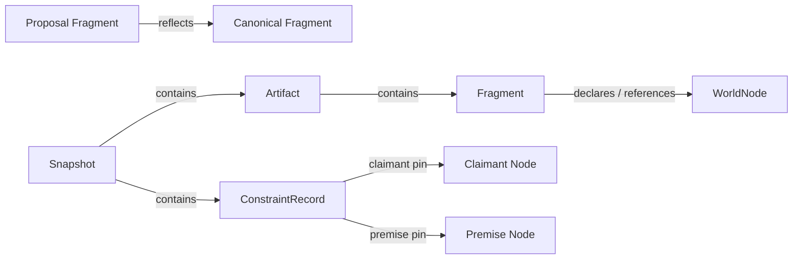

---
traceability:
  initial_creation: true
---

# Domain Model: world-model

<!-- @work-item-id WI-285 -->

> **Unit ID**: world-model  
> **作成日**: 2026-07-16  
> **対応ストーリー**: H17-02, H17-04, H17-05, H17-06, H17-07, H17-09  
> **決定根拠**: ADR-031〜035

---

## 1. Domain boundary

world-modelはowner Unitのplain projectionからWorld-local factを組み立て、canonical Snapshotと明示的な構造制約の評価を返す。事実のownerではなくfederated read modelであり、Story / WorkItem / TestReference / evidence / integrityのdomain modelを複製しない。

domain層はfilesystem、Markdown parser、clock、Git、`node:crypto`、他Unit型を知らない。入力はWorld-local value、出力はimmutable domain valueとし、I/Oとanti-corruption変換は外側の層が担う。

## 2. Model classification

### 2.1 Entity / Aggregate

| Model | 分類 | Identity / boundary | 責務 |
|---|---|---|---|
| `WorldNode` | Entity | `WorldNodeId` | Artifact / Fragment / WorkItem / SourceFile / TestReference / ExplicitClaim等のWorld-local factを保持 |
| `Artifact` | Entity projection | artifact node ID | artifactKind、corpusRole、PathKey、content digest、owner provenanceを保持 |
| `Fragment` | Entity projection | fragment node ID | parent artifact、declared / legacy locator、content range digestを保持 |
| `ConstraintRecord` | Entity | constraint node ID | typed directed fact、両endpointのNodePin、宣言provenanceを保持 |
| `Snapshot` | Aggregate / immutable derived output | snapshot node ID | node、edge、diagnosticと三rootの導出境界。保存stateではない |
| `ObligationReport` | immutable derived output | `evaluationId` | current evaluation、baseline、waiver、debtから毎回導出。集約stateとして更新しない |

`Artifact` / `Fragment`は別identityを持つWorldNode specializationであり、同じcontent digestでも統合しない。`Snapshot`は一実行の決定的projectionで、repositoryに保存された前回Snapshotを更新するaggregateではない。

### 2.2 Value Objects

| Value Object | Canonical form | Invariant |
|---|---|---|
| `WorldNodeId` | `pgw:v1:<node-type>:...` | node typeごとのschemaでparseし、opaque string比較する |
| `PathKey` | project-relative POSIX path | absolute / drive letter / backslash / `..`を拒否。caseとUnicode code pointを保持 |
| `DeclaredKey` | project-global key（推奨`<unit>.<concept>`） | 同一node type / corpus role内で一意 |
| `Sha256Digest` | `sha256:<64 lowercase hex>` | algorithm prefixとhex長・caseを生成時に検証 |
| `ContentDigest` | `Sha256Digest` wrapper | node content projectionのdigest。identityとは別 |
| `CorpusRole` | owner-defined corpus role（designでは`product` / `inception`） | product / inceptionを区別し、artifact kindと混同しない |
| `ArtifactKind` | `design-document | source | generated-artifact | external-declaration` | lifecycle ownershipを表す |
| `FragmentLocator` | declared keyまたはlegacy whole-file | heading text / orderをidentityにしない |
| `WorldEdge` | `{ type, claimantId, premiseId, provenance }` | directionを保持し、endpointを暗黙入替しない |
| `NodePin` | `{ nodeId, observedDigest }` | node IDとcontent digestの組を必須とする |
| `ExtractionDiagnostic` | `{ code, subject, path, line?, payload }` | findingと混ぜず、stable sort可能なpayloadを持つ |
| `ChangeProvenance` | `{ baselineSnapshotId?, currentSnapshotId, changedCandidates }` | 因果を主張せず、比較候補だけを表す |
| `ViolationFingerprint` | rulesetを含むcanonical violation identity | `constraintId`と別。observed digest / cardinality driftで新fingerprint |
| `EvaluationId` | `pgw:v1:evaluation:sha256:<64 lowercase hex>` | corpus / constraint / policy inputsの評価identity。finding / exit codeを含めない |
| `SchemaVersion` | owner-defined literal | unknown valueをfallbackせずadmission errorにする |
| `ExtractorVersion` | extractor contract version | corpus root preimageに含める |
| `RulesetVersion` | WCR semantic version | constraint rootとevaluation IDの双方へ含める |

## 3. Identity schema

`WorldNodeId`はADR-032の`pgw:v1` schemaを正本とし、domain factoryは次のnode typeを区別する。

| Node type | 形式（概念表記） | Identity source |
|---|---|---|
| Artifact | `pgw:v1:artifact:<artifact-kind>:<corpus-role>:<path-key>` | kind + role + canonical path |
| Fragment | `pgw:v1:fragment:<corpus-role>:<declared-key>`、またはlegacy whole-file locator | explicit markerを優先。heading非依存 |
| WorkItem | `pgw:v1:work-item:<owner-id>` | traceability owner DTOのcanonical ID |
| SourceFile | `pgw:v1:source-file:<path-key>` | canonical project-relative path |
| TestReference | `pgw:v1:test-reference:<owner-defined-tuple>` | matrix owner DTOのcanonical tuple |
| ExplicitClaim | `pgw:v1:explicit-claim:<declared-key>` | explicit declaration |
| Constraint | `pgw:v1:constraint:<declared-key>` | reviewed constraint declaration |
| Snapshot | `pgw:v1:snapshot:sha256:<64-lowercase-hex>` | canonical corpus root |

file identityとfragment identityは分離する。explicit fragment markerは`<!-- @world-fragment-id <DeclaredKey> -->`、proposal / canonical relationはinception側の`<!-- @world-reflects product:<DeclaredKey> -->`で宣言する。legacy fileはwhole-file Fragmentを一つ生成し、`@world-fragment-migration complete`宣言後はfallbackを禁止する。

rename / moveは旧path missing + 新path addedとして観測し、continuityはsingle-hop explicit aliasだけで表す。alias chainを推論せず、duplicate ID / alias ambiguityではwinnerを選ばない。

## 4. Fact graph

World factはtyped directed edgeとして保存する。



directionは宣言の意味を保持する。一方、constraint evaluationはclaimant / premise双方のexistence、identity、digestを対称に検査する。edge directionとendpoint-symmetric validationを同一概念にしない。

## 5. Snapshot and roots

### 5.1 Snapshot

```text
Snapshot {
  schemaVersion,
  extractorVersion,
  nodes: WorldNode[],
  edges: WorldEdge[],
  diagnostics: ExtractionDiagnostic[],
  corpusRoot,
  constraintRoot?,
  evaluationId?
}
```

canonical JSONはobject keyをrecursive sortし、ordered arrayは順序を保持、set-valued collectionはowner-defined stable keyでsortしてからserializeする。`undefined`、sparse array、NaN、Infinity、bigintはcanonicalization errorとする。

textはstrict UTF-8として読み、CRLF / lone CRをLFへ正規化する。Unicode normalization、trailing whitespace除去、final newline補完、BOM除去は行わない。symlinkはfollowせずlink target factとして観測する。case-fold collision、invalid UTF-8、root外pathはdiagnosticとする。

### 5.2 Root preimages

| Root | Input | Exclusion |
|---|---|---|
| `corpusRoot` | owner-projected nodes / edges / diagnostics、schemaVersion、extractorVersion、corpus config digest | generatedAt、absolute root、mtime、Git SHA、output path、root自身、obligation report |
| `constraintRoot` | constraint / claim / alias declaration projection、pins、rulesetVersion、constraint config digest | formatting、array enumeration order、root自身 |
| `evaluationId` | corpusRoot、constraintRoot、rulesetVersion、schemaVersion、evaluation config digest、policyInputsDigest、`policyAsOfDate` | findings / obligation order、report formatting、generatedAt、ID自身 |

`rulesetVersion`をconstraintRootとevaluationIdの双方に含め、false stabilityより再評価を選ぶ。config digestはcorpus / constraint / evaluation scopeへ分ける。

## 6. Constraint model

```text
ConstraintRecord {
  constraintId: WorldNodeId,
  relationType,
  claimant: NodePin,
  premise: NodePin,
  applicableRuleIds: sorted non-empty WCR ID set,
  declarationProvenance,
  schemaVersion
}
```

機械評価はexistence、ID uniqueness、explicit reference、declared dependency、digest equalityに限定する。`refines`は明示ID宣言だけをfact化し、prose similarityやheadingから意味関係を推論しない。

### WCR ruleset

| Rule ID | Domain meaning |
|---|---|
| WCR-001 | malformed / inadmissible declarationを評価前に隔離する |
| WCR-002 | endpointがcurrent Snapshotに存在しない |
| WCR-003 | baselineにはexact endpointが存在しcurrentではmissing（valid aliasなし） |
| WCR-004 | explicit rename continuity / alias宣言が無効 |
| WCR-005 | canonical node IDが複数candidateへ解決し一意でない |
| WCR-006 | explicit reference / `refines` targetまたはrelationが解決しない |
| WCR-007 | explicit `depends-on` endpointまたはdependency relationが解決しない |
| WCR-008 | endpoint対pin、またはexplicit content-equals endpoint間のdigest不一致 |

initial evaluationにbaseline Snapshotがないmissing endpointはWCR-002であり、deletionとは呼ばない。aliasなしrenameはremoved + addedで、WCR-004にしない。

## 7. Obligation and policy projection

domain evaluationはpolicy-free `ConstraintEvaluation`を返す。application層がversioned external declarationsをadmitし、次のderived projectionを組み立てる。

| Input / output | Semantics |
|---|---|
| Adoption baseline | 同一ruleset内のclosed fingerprint set。新規追加禁止、返済済みentryの削除のみ |
| Waiver | exact fingerprint、理由、期限、WI traceabilityを持つreview済み例外 |
| Explicit semantic debt | explicit debt IDを持つ人の宣言。structural obligationとは別種 |
| Obligation report | immutable derived output。`repaid`をcurrent evaluationから計算し保存しない |

constraint IDは宣言のidentity、violation fingerprintは観測されたviolationのidentityである。rulesetVersion変更時は旧baselineを暗黙移行せず、同一rulesetのfingerprint再測定とreviewを要求する。WCR-001とmalformed policy inputはwaiveできない。

## 8. Domain services

| Service | Input | Output / responsibility |
|---|---|---|
| `WorldNodeIdentityFactory` | owner DTO identity / PathKey / locator | typed `WorldNodeId`またはidentity diagnostic |
| `TextContentNormalizer` | raw bytes | strict UTF-8 + LF canonical contentまたはdiagnostic |
| `CanonicalJsonSerializer` | supported domain projection | deterministic UTF-8 canonical bytes |
| `SnapshotBuilder` | extracted nodes / edges / diagnostics、versions、config digest | immutable Snapshot preimage |
| `SnapshotRootDeriver` | canonical bytes + `WorldHashingPort` | corpusRoot / constraintRoot / evaluationId |
| `ConstraintEvaluator` | Snapshot + admitted ConstraintRecord[] | policy-free WCR findings |
| `ChangeProvenanceBuilder` | baseline? + current Snapshot | changed candidates（因果主張なし） |
| `ViolationFingerprintDeriver` | canonical violation projection | ruleset-bound fingerprint |
| `ObligationDerivationService` | evaluation + admitted policy inputs + as-of date | immutable obligation report |

## 9. Domain invariants

1. Snapshot構成要素はimmutableで、同一semantic inputからbyte-identical rootを返す。
2. hashing providerは`Uint8Array -> Sha256Digest`のconsumer-owned portだけであり、domainがprovider型を参照しない。
3. hard extraction diagnosticがある場合、trustworthy Snapshot / evaluationを成功扱いしない。
4. duplicate node / declaration / aliasにwinnerを設けない。
5. generated artifactのvolatile field除外はowner-defined projectionでのみ行い、unknown fieldを汎用的にdropしない。
6. attestation projectionはraw signatureを除外しverification statusを含める。
7. obligation report、waiver残日数表示、absolute pathをroot / fingerprintへ混ぜない。
8. semantic debt declaration/importとstructural obligationを別categoryとして表示し、後者をsemantic debtの「再発見」と表現しない。

## 10. Implementation status

本書はWM-06〜17で実装予定のdomain contractである。WM-05時点では`scripts/harness/world-model/`実装やWCR validator登録の完了を主張しない。

---

## 11. WI-286 hashing provider boundary reflection

<!-- @work-item-id WI-286 -->

@story-id H17-01

ADR-033どおり、World domainは将来consumer-owned `WorldHashingPort`だけに依存する。provider contractはattestation public facadeの`Sha256Capability.hashBytes(Uint8Array)`であり、World-local adapterがplain digestを`Sha256Digest`へ変換する。

WM-06ではprovider facadeをattestation側へ実装し、World domain source / VO / port実装はWM-07へ残す。attestation `Digest`、`ContentHasherPort`、concrete crypto adapterをWorld domainへ持ち込まない。

## 12. WI-287 identity / canonical Snapshot implementation

<!-- @work-item-id WI-287 -->

@story-id H17-02

WM-07は`WorldNodeId`、`PathKey`、`DeclaredKey`、`Sha256Digest`、`CorpusRole`、`ArtifactKind`、`EvaluationId`をWorld-local VOとして実装する。`WorldNodeId`はADR-032のArtifact / Fragment / legacy Fragment / WorkItem / SourceFile / TestReference / ExplicitClaim / Constraint / Snapshot全形式をtype別factoryとround-trip parserで検証する。Story / AC payloadの意味検証はownerへ残し、Worldはopaque percent-encoded scalarとして扱う。

`WorldNode`、`Edge`、`ExtractionDiagnostic`はcanonical projectionを持ち、`Snapshot`はsorted nodes / edges / diagnostics、`corpusRoot`、Snapshot IDとoptional constraint / evaluation root boundaryをimmutableに保持する。`SnapshotRootDeriver`はplain constraint projectionも受けられるが、ConstraintRecord / WCR semanticsは実装しない。

`CanonicalJsonSerializer`はJSON data model外の値をfail-closedで拒否し、`TextContentNormalizer`はfatal UTF-8 + LF transport normalizationだけを行う。domainは`WorldHashingPort`以外のruntime capabilityに依存せず、filesystem、`node:crypto`、他Unit型をimportしない。

## 13. WI-289 design corpus fact projection

<!-- @work-item-id WI-289 -->

@story-id H17-04

product / inception / ADR / Unit definitionは`design-document` Artifactとして抽出し、corpus roleをそれぞれ`product / inception / adr`へ固定する。bytesが同じproduct canonicalとinception proposalをdigestでdeduplicateせず、path + roleの別identityとして保持する。

explicit Fragmentはrole + DeclaredKeyだけをidentityとし、artifact path、heading text / level / order、line、digestはlocator attributesへ置く。markerなしはlegacy whole-file、markerありcompletionなしはmixed、valid completionありはexplicit stateとする。duplicate ID、case-fold collision、malformed / orphan marker、unsupported inputにはwinnerを設けずExtractionDiagnosticへ変換する。

traceability public DTOはWorkItem node、Unit owner、Story catalog attributeへ投影する。provider diagnosticはcode / subject / paths / messageをlossless payloadとして保持し、Story / ACの新しいWorld identityやprovider domain modelを複製しない。

## 14. WI-290 runtime / generated owner projection

<!-- @work-item-id WI-290 -->

@story-id H17-05

implementation / test TypeScriptは別`sourceKind`を持つSourceFileとして一度だけ抽出し、Unit / layer / WorkItem metadataをattributesへ保持する。test sourceのStory / AC bindingは推論せず、matrix ownerのTestReference tupleだけを`pgw:v1:test-reference` nodeへ変換する。

matrix / attestationは`generated-artifact × generated`、integrity manifestは`external-declaration × external` Artifactとする。matrix `generatedAt`、attestation producedAt / producer / gitCommit / signature / self digest、git sourceを含み得るderived `inputDigest`をowner projectionで除外し、verification statusを含める。integrity path / raw digest declarationは保持するが、stable claim IDがないためExplicitClaim nodeを生成しない。

optional provider file不在は`not-present`、存在するunsupported schema / field、parse / verification failureはhard ExtractionDiagnosticとし、invalid inputをempty Artifactへlaunderしない。

## 15. WI-291 assembled Snapshot / inspection projection

<!-- @work-item-id WI-291 -->

@story-id H17-06

全extractor resultを`WorldFactBatch`としてapplication境界で統合する。global node ID duplicateはcandidate全除外、edge canonical tupleはdedup、admitted nodeに存在しないendpointを持つedgeは除外して`missing-edge-endpoint` diagnosticへ変換する。identityやcontinuityのwinnerをassemblyで推論しない。

Snapshotは`phasegate-world-snapshot/v1`、semantic corpus config digestとversioned extractor semanticsをpreimageに含める。plain `WorldInspectionDto`はroot / counts / inventory / stable node / edge / diagnostic projectionを返し、domain型、absolute checkout root、clock、`generatedAt`を公開しない。`not-present`以外のExtractionDiagnosticをhardと数えるが、exit policyはpresentationに残す。

## Matrix coverage lifecycle fact

<!-- @work-item-id WI-292 -->

matrix 1.2のStory projectionはcoverageStatusとordered coverageLifecycleを保持する。1.0 / 1.1 field省略はrequiredへ正規化する。WorldはL3 blocking policyを複製せずowner factとして観測する。

## WI-293 ConstraintRecord / WCR evaluator implementation

<!-- @work-item-id WI-293 -->

@story-id H17-07

`ConstraintRecord`はwell-formedなtyped directed factだけを表し、claimant / premise `NodePin`、sorted applicable WCR IDs、declaration provenanceをimmutableに保持する。malformed inputは別の`MalformedConstraintDeclaration`としてWCR-001へ変換し、部分recordを生成しない。

`ConstraintEvaluator`はcurrent / optional baseline Snapshot、explicit single-hop alias、constraint declaration由来relationを入力に、WCR-001〜008のpolicy-free findingをstable sortして返す。endpoint resolutionはmalformed、duplicate、exact、alias、deletion、missingのprecedenceを守り、unresolved endpointへdigest findingを重ねない。`ChangeProvenance`はsnapshot差とcandidateだけを表し、renameやcauseを推論しない。

## WI-294 Versioned control declaration admission

<!-- @work-item-id WI-294 -->

@story-id H17-08

4つのexternal declarationはversioned envelopeを通じてadmitする。`AdoptionBaseline`はruleset / source roots / adoption provenanceとclosed sorted fingerprint entry、`WorldWaiver`はexact fingerprint / reason / exclusive expiry / WI / renewal link、`SemanticDebtDeclaration`はexplicit debt ID / semantic kind / owner / introduced WI / sorted node referencesを保持する。

supported constraints envelope内の各recordは`ConstraintRecord`または`MalformedConstraintDeclaration`のどちらかへ全量変換する。duplicate constraint IDは全candidate no-winnerとしてWCR-001入力へ隔離する。baseline fingerprint、waiver ID / fingerprint、debt IDのduplicateはpolicy document全体をinvalidとし、任意candidateを採用しない。ci-governanceのpath / SHA-1 baselineは別owner identityであり、World adoption baselineへ暗黙importしない。

## WI-295 Fingerprint / obligation derivation

<!-- @work-item-id WI-295 -->

@story-id H17-09

`ViolationFingerprintDeriver`はWCR findingをruleset-bound semantic preimageへ変換し、constraint identityとは別の`pgw:v1:violation-fingerprint:sha256:*`を導出する。subject、両pin、rule-owned expected / observedを含め、locator、message、evaluation / policy stateを除外する。duplicate observationはcandidate cardinalityとsorted content-digest multisetを保持する。

`PolicyInputsDigestDeriver`はbaseline / waivers / semantic debts / effective dateをcanonicalizeし、`ObligationDerivationService`はsame-ruleset baselineとの集合差、exclusive waiver expiry、WCR-001 non-waivable、ruleset mismatchをclassification / diagnosticへ変換する。reportはstructural / repaid / declared semantic debt / policy diagnosticを別collectionで保持し、blocking policyを含めない。

## WI-296 Pin candidate / CLI verdict

<!-- @work-item-id WI-296 -->

@story-id H17-10

`PinCandidate`はconstraint ID、claimant / premise role、stable node ID、before / after digest、changed flagだけを持つ。exact一件またはvalid single-hop alias target一件だけを解決し、missing / duplicate / ambiguous inputにwinnerを作らない。

derive CLI verdictはimmutable reportからsuccess / domain finding / execution failureを区別する。new / invalid structural obligation、repaid cleanup、policy diagnosticはfinding、adopted / waived / declared semantic debtだけならsuccessとする。validator severity / blocking booleanは持たない。
## WI-297: Synthetic mutation comparison model

<!-- @work-item-id WI-297 -->

CP-3 mutation fixtureはbaseline/current Snapshotを明示pairとして扱う。baseline SnapshotはWCR-003とnon-causal ChangeProvenanceだけに使い、World adoption baselineとは相互変換しない。baselineなしはinitial evaluationでWCR-002、valid explicit aliasは`resolved-via-alias`でfindingなし、invalid aliasだけをWCR-004とする。
## WI-298: Self-repo adoption inventory

<!-- @work-item-id WI-298 -->

`MeasuredViolationInventory`は承認済みrulesetで実測したunique fingerprint集合とrule / corpus kind / owner Unit集計を表す。`AdoptionBaseline`はcandidate evaluation provenanceとreview済みclosed entry setを持つexternal declarationであり、current finding、repaid state、semantic debtを保存しない。explicit semantic debtは別collectionとしてimportし、structural violationを抑止しない。

## WI-300 Resolved World application config

<!-- @work-item-id WI-300 -->

Worldはconfig-foundationのdomain型をimportせず、plain `WorldResolvedConfigInput`をconsumer-owned application DTOとして受ける。corpus、provider input、declaration、output、sessionStartの全path / limitはproviderで検証済みだが、World境界でもPathKeyによるfail-closed validationを維持する。`enabled`はautomatic integration hintでありdomain evaluationの意味を変えない。
