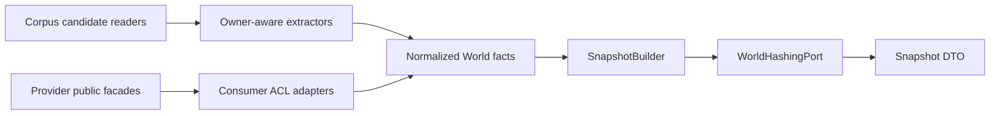

---
traceability:
  initial_creation: true
---

# Logical Design: world-model

<!-- @work-item-id WI-285 -->

> **Unit ID**: world-model  
> **作成日**: 2026-07-16  
> **対応ストーリー**: H17-01〜H17-12  
> **Architecture**: Clean Architecture / consumer-owned anti-corruption layer

---

## 1. Design goals

- provider Unitのownershipを維持し、World-local domainへplain DTOだけを取り込む。
- canonicalization、hashing、WCR evaluationをI/Oから分離し、同一入力でbyte-identicalにする。
- inspection、pin mutation、obligation report writeの副作用境界をcommandごとに明示する。
- validator-systemへpolicy-free evaluationを公開し、gate policyをworld-modelへ持ち込まない。

## 2. Planned package structure

```text
scripts/harness/world-model/
├── domain/
│   ├── entities/
│   ├── value-objects/
│   ├── services/
│   └── rules/
├── application/
│   ├── ports/
│   ├── use-cases/
│   └── dto/
├── infrastructure/
│   ├── extractors/
│   ├── adapters/
│   ├── repositories/
│   └── serialization/
├── presentation/
│   └── cli/
└── public.ts
```

実ファイル名は実装WIで確定するが、全sourceに`@unit world-model`と4層の`@layer`を付ける。`public.ts`はplain DTO / handler / facadeだけをexportし、domain objectやadapterを公開しない。

## 3. Layer responsibilities

| Layer | Responsibilities | Must not depend on |
|---|---|---|
| domain | identity、canonical semantic projection、Snapshot、WCR、fingerprint、obligation derivation | filesystem、CLI、config schema、clock、Git、`node:crypto`、他Unit |
| application | use case orchestration、consumer-owned ports、input admission、transaction / write intent | provider infrastructure、presentation、concrete repository |
| infrastructure | filesystem / Markdown / JSON extractor、provider ACL adapter、repository、atomic writer、hash adapter | presentation。provider deep importは禁止 |
| presentation | flag parse、human / JSON presenter、stdout / stderr result | concrete infrastructureを直接newしない |

依存方向は`presentation / infrastructure -> application -> domain`。top-level composition-rootだけがconcrete adapterをportへbindする。

## 4. Application use cases

### 4.1 BuildSnapshot

```text
BuildSnapshotInput { projectRoot, resolvedWorldConfig, requestedScope }
  -> CorpusSourcePort群からowner projectionを取得
  -> consumer-owned adapterでWorld factsへ変換
  -> identity / content / extraction diagnosticを組立
  -> canonical bytesとcorpusRootを導出
  -> BuildSnapshotResult { snapshot?, diagnostics }
```

hard diagnosticでtrustworthy Snapshotを構築できない場合は失敗resultを返す。absolute `projectRoot`はI/O解決だけに使い、domain projectionへ渡さない。

### 4.2 InspectWorld

`BuildSnapshot`を呼び、node / edge count、artifact kind、corpus role、diagnostic、corpusRootをstable ID順のDTOで返す。declaration / report repositoryへwriteしない。constraint fileがなくても実行可能。

### 4.3 EvaluateConstraints

current Snapshotとadmitted constraintsを受け、`ConstraintEvaluator`でpolicy-free WCR findingを生成する。baseline / waiver / debtによるblocking分類をdomain findingへ埋め込まない。

### 4.4 DeriveObligations

Snapshot、constraint evaluation、adoption baseline、waiver、explicit debt、`policyAsOfDate`からfingerprint / classification / immutable reportを導出する。defaultはpureで、`writeReport=true`のapplication intentがある場合だけ`ObligationReportWriterPort`を呼ぶ。保存済みreportはinputとして読まない。

### 4.5 PinConstraints

endpoint selectorを一意解決しcurrent content digestから`ConstraintRecord` candidateとdiffを返す。default previewはwriteしない。`apply=true`時だけadmitted current declarationへatomic updateを要求する。missing / duplicate / ambiguous alias / malformed declarationではwriteしない。

## 5. Consumer-owned ports

### 5.1 Provider read ports

| Port | Provider public contract | World adapter responsibility |
|---|---|---|
| `TraceabilityWorldReadPort` | traceability-model plain Unit / Story / AC / WorkItem DTO | owner ID / provenanceをWorld nodeへ変換。owner parserを複製しない |
| `MatrixWorldReadPort` | nyquist-validation Story / AC / TestReference projection | stable tupleとsemantic fieldsだけを変換 |
| `AttestationEvidenceReadPort` | attestation evidence / verification projection | signature / producedAt / Git commitを除外、outcome / verificationを保持 |
| `IntegrityDeclarationReadPort` | ci-governance target / digest declaration DTO | instruction corpus factsへ変換 |
| `WorldHashingPort` | attestation public SHA-256 capability | plain digestをWorld-local `Sha256Digest`へ変換 |

provider facade未実装時は対応owner WIでpublic facadeを追加する。world-modelからprovider domain / infrastructure / composition-rootをdeep importしてはならない。

### 5.2 World-owned I/O ports

| Port | Operation | Side effect |
|---|---|---|
| `DesignCorpusPort` | product / inception / ADR file candidateとraw bytes取得 | read-only |
| `SourceCorpusPort` | source / test candidateとraw bytes取得 | read-only |
| `ResolvedWorldConfigPort` | validated / resolved `world` config取得 | read-only |
| `ConstraintDeclarationRepositoryPort` | constraints load、candidate atomic apply | apply時のみwrite |
| `AdoptionBaselineRepositoryPort` | baseline load | read-only |
| `WaiverRepositoryPort` | waiver load | read-only |
| `SemanticDebtRepositoryPort` | debt declaration load | read-only |
| `ObligationReportWriterPort` | raw reportのtemp + atomic rename | derive `--write`時のみ |
| `PolicyClockPort` | explicit `policyAsOfDate`供給 | timeをsemantic inputとして固定 |

repositoryはschemaVersionをadmitし、unknown schema / malformed envelopeをempty扱いしない。constraint record malformedはWCR-001、document envelopeを解釈不能な場合はexecution/config errorへ分類する。

## 6. Infrastructure adapters

### 6.1 Extractor pipeline



extractorはartifact kind / corpus roleを入口で付与する。Markdownはexplicit fragment markerとlegacy whole-file fallbackを区別し、heading text / orderをIDへ使わない。generated artifactはowner-defined projectionを使い、generic unknown-field dropをしない。

filesystem traversalはproject-relative PathKeyへ変換し、lexical root escape、invalid UTF-8、case-fold collision、symlinkをdiagnosticにする。symlink targetをfollowしない。

### 6.2 Hash adapter

world-model内のadapterはconsumer-owned `WorldHashingPort`をattestation public SHA-256 capabilityへ接続する。attestation内部の`NodeCryptoContentHasherAdapter` / port / VOをimportせず、world-modelで新しい`node:crypto` SHA-256 call siteを作らない。

### 6.3 Declaration repositories

| Repository | Canonical file | Schema |
|---|---|---|
| constraints | `phasegate.world-constraints.json` | `phasegate-world-constraints/v1` |
| adoption baseline | `phasegate.world-baseline.json` | `phasegate-world-adoption-baseline/v1` |
| waivers | `phasegate.world-waivers.json` | `phasegate-world-waivers/v1` |
| explicit debts | `phasegate.world-debts.json` | `phasegate-world-debts/v1` |

全pathはproject root固定。duplicate record ID / fingerprintにwinnerを選ばない。JSON formattingとinput array orderはsemantic identityへ含めない。

## 7. Presentation and CLI contract

### 7.1 Commands

| Command | Default mode | Explicit mutation / write | Success / domain / execution |
|---|---|---|---|
| `world:inspect` | read-only | なし | 0 / 1 hard diagnostic / 2 trustworthy resultなし |
| `world:pin` | preview-only | `--apply`でconstraintsをatomic update | 0 / 1 unresolved・ambiguous・malformed / 2 usage・schema・I/O |
| `world:derive` | pure/read-only | `--write [--out <path>]`でreport write | 0 / 1 blocking obligation / 2 usage・schema・I/O |

`--apply`はreviewed declaration mutation、`--write`はgenerated report persistenceであり、相互代替しない。`--out`単独はexit 2。report既定先は`.harness/world-obligations.json`で、write failureもexit 2。

### 7.2 Output

- defaultはhuman、`--json`は`--format json`のalias。
- stdoutにはprimary resultだけを出す。JSONは単一`phasegate-world-cli/v1` envelopeとしANSI / progressを混ぜない。
- expected domain failure（exit 1）もstdoutへ完全resultを出す。
- humanのusage / config / schema / unexpected execution failureはstderr。JSON expected errorはstdout envelope。
- stable node ID / diagnostic code / PathKey / line / canonical payload順でsortし、`generatedAt`をCLI envelopeへ入れない。

### 7.3 Config

top-level keyは`world`。config-foundationがschema validationとpreset / source deep mergeを行ったresolved configだけを受け取る。`world.enabled`はautomatic gateについてdefault falseだが、明示`world:*` commandは実行可能。config無指定時のcorpus rootはproject root配下のowner-defined既定corpusとし、absolute pathをsemantic identityへ含めない。unknown schema / config keyはfail-closed exit 2。

## 8. Public facade and validator integration

`world-model/public.ts`は次のplain contractだけを公開する予定である。

```text
WorldInspectionDto
WorldSnapshotDto
WorldExtractionDiagnosticDto
WorldConstraintEvaluationDto
WorldObligationReportDto
WorldCommandHandler
WorldEvaluationFacade
```

validator-system infrastructure adapterが`WorldEvaluationFacade`を消費してvalidation resultへ写像する。L2-017 / L3-008のregistry登録、severity、blocking policyはWM-19 / WM-20でvalidator-systemが行う。world-modelはvalidator-systemをimportしない。

## 9. Composition root

top-level compositionは次を行う。

1. owner public facadeをworld-model infrastructure adapterへ注入する。
2. attestation public SHA capabilityを`WorldHashingPort`へbindする。
3. config / filesystem / declaration / clock / writer adapterをuse caseへbindする。
4. `world:*` handlerをharness command dispatchへ登録する。
5. Phase CではWorld public evaluation facadeをvalidator-system adapterへbindする。

composition-root以外でconcrete adapterを生成しない。attestation v2へ`worldSnapshotRoot`を渡す将来連携はcompositionがprimitive inputを注入し、Unit間循環を作らない。

## 10. Milestone allocation

| Story / WM | Design increment |
|---|---|
| H17-01 / WM-06 | public SHA capabilityと両consumer adapter |
| H17-02 / WM-07 | identity、canonicalization、Snapshot roots |
| H17-03 / WM-08 | traceability read DTO facade / ACL |
| H17-04 / WM-09 | design corpus extractors |
| H17-05 / WM-10 | source / matrix / attestation / integrity extractors |
| H17-06 / WM-11 | graph assembly、InspectWorld、`world:inspect` |
| H17-07 / WM-12 | ConstraintRecord、WCR evaluator |
| H17-08 / WM-13 | four external declaration repositories |
| H17-09 / WM-14 | fingerprint、policy classification、report schema |
| H17-10 / WM-15 | pin / derive handlersとatomic write |
| H17-11 / WM-16 | mutation / determinism integration coverage |
| H17-12 / WM-17 | clean self-repo実測、adoption baseline、ratchet |

## 11. Implementation status

本書は実装予定のlogical contractである。WM-05時点ではcommand登録、provider facade、schema、repository、testの実装済みを主張しない。

---

## 12. WI-286 public hashing provider integration

<!-- @work-item-id WI-286 -->

@story-id H17-01

future world-model infrastructure adapterはattestation root barrelから`Sha256Capability`だけを受け、application/domainのconsumer-owned `WorldHashingPort`へ変換する。

```text
attestation public index
  -> Sha256Capability / plain sha256 string
  -> world-model infrastructure adapter
  -> WorldHashingPort
  -> World-local Sha256Digest
```

WM-06はprovider facadeまでを実装し、world-model source、composition-root、`node:crypto` call siteを追加しない。consumer adapterはWorld domain primitiveと同時に後続WIで実装する。
