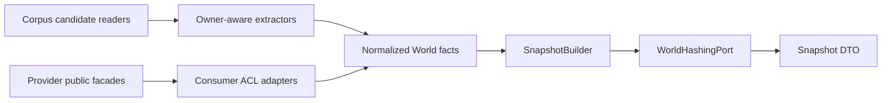

---
traceability:
  initial_creation: true
---

# Logical Design: world-model

<!-- @work-item-id WI-285 -->

> **Unit ID**: world-model  
> **作成日**: 2026-07-16  
> **対応ストーリー**: H17-01〜H17-12  
> **Architecture**: Clean Architecture / consumer-owned anti-corruption layer

---

## 1. Design goals

- provider Unitのownershipを維持し、World-local domainへplain DTOだけを取り込む。
- canonicalization、hashing、WCR evaluationをI/Oから分離し、同一入力でbyte-identicalにする。
- inspection、pin mutation、obligation report writeの副作用境界をcommandごとに明示する。
- validator-systemへpolicy-free evaluationを公開し、gate policyをworld-modelへ持ち込まない。

## 2. Planned package structure

```text
scripts/harness/world-model/
├── domain/
│   ├── entities/
│   ├── value-objects/
│   ├── services/
│   └── rules/
├── application/
│   ├── ports/
│   ├── use-cases/
│   └── dto/
├── infrastructure/
│   ├── extractors/
│   ├── adapters/
│   ├── repositories/
│   └── serialization/
├── presentation/
│   └── cli/
└── public.ts
```

実ファイル名は実装WIで確定するが、全sourceに`@unit world-model`と4層の`@layer`を付ける。`public.ts`はplain DTO / handler / facadeだけをexportし、domain objectやadapterを公開しない。

## 3. Layer responsibilities

| Layer | Responsibilities | Must not depend on |
|---|---|---|
| domain | identity、canonical semantic projection、Snapshot、WCR、fingerprint、obligation derivation | filesystem、CLI、config schema、clock、Git、`node:crypto`、他Unit |
| application | use case orchestration、consumer-owned ports、input admission、transaction / write intent | provider infrastructure、presentation、concrete repository |
| infrastructure | filesystem / Markdown / JSON extractor、provider ACL adapter、repository、atomic writer、hash adapter | presentation。provider deep importは禁止 |
| presentation | flag parse、human / JSON presenter、stdout / stderr result | concrete infrastructureを直接newしない |

依存方向は`presentation / infrastructure -> application -> domain`。top-level composition-rootだけがconcrete adapterをportへbindする。

## 4. Application use cases

### 4.1 BuildSnapshot

```text
BuildSnapshotInput { projectRoot, resolvedWorldConfig, requestedScope }
  -> CorpusSourcePort群からowner projectionを取得
  -> consumer-owned adapterでWorld factsへ変換
  -> identity / content / extraction diagnosticを組立
  -> canonical bytesとcorpusRootを導出
  -> BuildSnapshotResult { snapshot?, diagnostics }
```

hard diagnosticでtrustworthy Snapshotを構築できない場合は失敗resultを返す。absolute `projectRoot`はI/O解決だけに使い、domain projectionへ渡さない。

### 4.2 InspectWorld

`BuildSnapshot`を呼び、node / edge count、artifact kind、corpus role、diagnostic、corpusRootをstable ID順のDTOで返す。declaration / report repositoryへwriteしない。constraint fileがなくても実行可能。

### 4.3 EvaluateConstraints

current Snapshotとadmitted constraintsを受け、`ConstraintEvaluator`でpolicy-free WCR findingを生成する。baseline / waiver / debtによるblocking分類をdomain findingへ埋め込まない。

### 4.4 DeriveObligations

Snapshot、constraint evaluation、adoption baseline、waiver、explicit debt、`policyAsOfDate`からfingerprint / classification / immutable reportを導出する。defaultはpureで、`writeReport=true`のapplication intentがある場合だけ`ObligationReportWriterPort`を呼ぶ。保存済みreportはinputとして読まない。

### 4.5 PinConstraints

endpoint selectorを一意解決しcurrent content digestから`ConstraintRecord` candidateとdiffを返す。default previewはwriteしない。`apply=true`時だけadmitted current declarationへatomic updateを要求する。missing / duplicate / ambiguous alias / malformed declarationではwriteしない。

## 5. Consumer-owned ports

### 5.1 Provider read ports

| Port | Provider public contract | World adapter responsibility |
|---|---|---|
| `TraceabilityWorldReadPort` | traceability-model plain Unit / Story / AC / WorkItem DTO | owner ID / provenanceをWorld nodeへ変換。owner parserを複製しない |
| `MatrixWorldReadPort` | nyquist-validation Story / AC / TestReference projection | stable tupleとsemantic fieldsだけを変換 |
| `AttestationEvidenceReadPort` | attestation evidence / verification projection | signature / producedAt / Git commitを除外、outcome / verificationを保持 |
| `IntegrityDeclarationReadPort` | ci-governance target / digest declaration DTO | instruction corpus factsへ変換 |
| `WorldHashingPort` | attestation public SHA-256 capability | plain digestをWorld-local `Sha256Digest`へ変換 |

provider facade未実装時は対応owner WIでpublic facadeを追加する。world-modelからprovider domain / infrastructure / composition-rootをdeep importしてはならない。

### 5.2 World-owned I/O ports

| Port | Operation | Side effect |
|---|---|---|
| `DesignCorpusPort` | product / inception / ADR file candidateとraw bytes取得 | read-only |
| `SourceCorpusPort` | source / test candidateとraw bytes取得 | read-only |
| `ResolvedWorldConfigPort` | validated / resolved `world` config取得 | read-only |
| `ConstraintDeclarationRepositoryPort` | constraints load、candidate atomic apply | apply時のみwrite |
| `AdoptionBaselineRepositoryPort` | baseline load | read-only |
| `WaiverRepositoryPort` | waiver load | read-only |
| `SemanticDebtRepositoryPort` | debt declaration load | read-only |
| `ObligationReportWriterPort` | raw reportのtemp + atomic rename | derive `--write`時のみ |
| `PolicyClockPort` | explicit `policyAsOfDate`供給 | timeをsemantic inputとして固定 |

repositoryはschemaVersionをadmitし、unknown schema / malformed envelopeをempty扱いしない。constraint record malformedはWCR-001、document envelopeを解釈不能な場合はexecution/config errorへ分類する。

## 6. Infrastructure adapters

### 6.1 Extractor pipeline



extractorはartifact kind / corpus roleを入口で付与する。Markdownはexplicit fragment markerとlegacy whole-file fallbackを区別し、heading text / orderをIDへ使わない。generated artifactはowner-defined projectionを使い、generic unknown-field dropをしない。

filesystem traversalはproject-relative PathKeyへ変換し、lexical root escape、invalid UTF-8、case-fold collision、symlinkをdiagnosticにする。symlink targetをfollowしない。

### 6.2 Hash adapter

world-model内のadapterはconsumer-owned `WorldHashingPort`をattestation public SHA-256 capabilityへ接続する。attestation内部の`NodeCryptoContentHasherAdapter` / port / VOをimportせず、world-modelで新しい`node:crypto` SHA-256 call siteを作らない。

### 6.3 Declaration repositories

| Repository | Canonical file | Schema |
|---|---|---|
| constraints | `phasegate.world-constraints.json` | `phasegate-world-constraints/v1` |
| adoption baseline | `phasegate.world-baseline.json` | `phasegate-world-adoption-baseline/v1` |
| waivers | `phasegate.world-waivers.json` | `phasegate-world-waivers/v1` |
| explicit debts | `phasegate.world-debts.json` | `phasegate-world-debts/v1` |

全pathはproject root固定。duplicate record ID / fingerprintにwinnerを選ばない。JSON formattingとinput array orderはsemantic identityへ含めない。

## 7. Presentation and CLI contract

### 7.1 Commands

| Command | Default mode | Explicit mutation / write | Success / domain / execution |
|---|---|---|---|
| `world:inspect` | read-only | なし | 0 / 1 hard diagnostic / 2 trustworthy resultなし |
| `world:pin` | preview-only | `--apply`でconstraintsをatomic update | 0 / 1 unresolved・ambiguous・malformed / 2 usage・schema・I/O |
| `world:derive` | pure/read-only | `--write [--out <path>]`でreport write | 0 / 1 blocking obligation / 2 usage・schema・I/O |

`--apply`はreviewed declaration mutation、`--write`はgenerated report persistenceであり、相互代替しない。`--out`単独はexit 2。report既定先は`.harness/world-obligations.json`で、write failureもexit 2。

### 7.2 Output

- defaultはhuman、`--json`は`--format json`のalias。
- stdoutにはprimary resultだけを出す。JSONは単一`phasegate-world-cli/v1` envelopeとしANSI / progressを混ぜない。
- expected domain failure（exit 1）もstdoutへ完全resultを出す。
- humanのusage / config / schema / unexpected execution failureはstderr。JSON expected errorはstdout envelope。
- stable node ID / diagnostic code / PathKey / line / canonical payload順でsortし、`generatedAt`をCLI envelopeへ入れない。

### 7.3 Config

top-level keyは`world`。config-foundationがschema validationとpreset / source deep mergeを行ったresolved configだけを受け取る。`world.enabled`はautomatic gateについてdefault falseだが、明示`world:*` commandは実行可能。config無指定時のcorpus rootはproject root配下のowner-defined既定corpusとし、absolute pathをsemantic identityへ含めない。unknown schema / config keyはfail-closed exit 2。

## 8. Public facade and validator integration

`world-model/public.ts`は次のplain contractだけを公開する予定である。

```text
WorldInspectionDto
WorldSnapshotDto
WorldExtractionDiagnosticDto
WorldConstraintEvaluationDto
WorldObligationReportDto
WorldCommandHandler
WorldEvaluationFacade
```

validator-system infrastructure adapterが`WorldEvaluationFacade`を消費してvalidation resultへ写像する。L2-017 / L3-008のregistry登録、severity、blocking policyはWM-19 / WM-20でvalidator-systemが行う。world-modelはvalidator-systemをimportしない。

## 9. Composition root

top-level compositionは次を行う。

1. owner public facadeをworld-model infrastructure adapterへ注入する。
2. attestation public SHA capabilityを`WorldHashingPort`へbindする。
3. config / filesystem / declaration / clock / writer adapterをuse caseへbindする。
4. `world:*` handlerをharness command dispatchへ登録する。
5. Phase CではWorld public evaluation facadeをvalidator-system adapterへbindする。

composition-root以外でconcrete adapterを生成しない。attestation v2へ`worldSnapshotRoot`を渡す将来連携はcompositionがprimitive inputを注入し、Unit間循環を作らない。

## 10. Milestone allocation

| Story / WM | Design increment |
|---|---|
| H17-01 / WM-06 | public SHA capabilityと両consumer adapter |
| H17-02 / WM-07 | identity、canonicalization、Snapshot roots |
| H17-03 / WM-08 | traceability read DTO facade / ACL |
| H17-04 / WM-09 | design corpus extractors |
| H17-05 / WM-10 | source / matrix / attestation / integrity extractors |
| H17-06 / WM-11 | graph assembly、InspectWorld、`world:inspect` |
| H17-07 / WM-12 | ConstraintRecord、WCR evaluator |
| H17-08 / WM-13 | four external declaration repositories |
| H17-09 / WM-14 | fingerprint、policy classification、report schema |
| H17-10 / WM-15 | pin / derive handlersとatomic write |
| H17-11 / WM-16 | mutation / determinism integration coverage |
| H17-12 / WM-17 | clean self-repo実測、adoption baseline、ratchet |

## 11. Implementation status

本書は実装予定のlogical contractである。WM-05時点ではcommand登録、provider facade、schema、repository、testの実装済みを主張しない。

---

## 12. WI-286 public hashing provider integration

<!-- @work-item-id WI-286 -->

@story-id H17-01

future world-model infrastructure adapterはattestation root barrelから`Sha256Capability`だけを受け、application/domainのconsumer-owned `WorldHashingPort`へ変換する。

```text
attestation public index
  -> Sha256Capability / plain sha256 string
  -> world-model infrastructure adapter
  -> WorldHashingPort
  -> World-local Sha256Digest
```

WM-06はprovider facadeまでを実装し、world-model source、composition-root、`node:crypto` call siteを追加しない。consumer adapterはWorld domain primitiveと同時に後続WIで実装する。

## 13. Phase 0 ADR constraints

<!-- @work-item-id WI-281 -->

world-modelは他Unitの上位正本ではなくfederated read modelである。事実組立と明示constraint評価だけを所有し、traceability ID / lifecycle、matrix、attestation evidence、integrity、validator blocking policyを複製しない。providerのpublic plain DTOをconsumer-owned infrastructure adapterでWorld-local factへ変換し、product canonicalとinception proposal / delta、design / source / generated / external declarationのartifact roleをidentity上も分離する。

<!-- @work-item-id WI-282 -->

全node identityはversioned `pgw:v1` schemaに従い、path-based Artifact / SourceFileとDeclaredKey-based Fragmentを分離する。heading text / order / line / digestからidentityやrenameを推論せず、duplicateはno-winner、continuityはsingle-hop explicit aliasだけとする。Markdown fragmentは`@world-fragment-id`、legacy whole-fileはwhole-file → mixed → explicitのratchet、proposal / canonicalのexact mappingは`@world-reflects`でのみ表す。

<!-- @work-item-id WI-283 -->

Snapshotはowner-aware leaf digestから`corpusRoot`、`constraintRoot`、`evaluationId`を別preimageで導出する。canonical JSONはrecursive key sort、semantic setのstable sort、ordered array保持、UTF-8 / no whitespaceとし、textはCRLF / CRだけをLFへ正規化してUnicode normalizationを行わない。absolute / volatile / self fieldsを除外し、schema / extractor / ruleset versionとscope別resolved config digestを含める。hashingはconsumer-owned `WorldHashingPort`からattestation public `Sha256Capability`へadaptする。

<!-- @work-item-id WI-284 -->

constraintはtyped directed factと両endpoint pinを保持しつつendpoint-symmetricに評価し、機械ruleをexistence、uniqueness、explicit reference、declared dependency、digest equalityの`WCR-001`〜`WCR-008`へ限定する。evaluation DTOはpolicy-free、obligationは毎回derived、adoption baseline / waiver / semantic debtはversioned external declaration、reportは非信頼generated artifactとする。CLI / config / persistenceは§7〜9の`world:*`、exit 0/1/2、`world` config、root control files、`.harness/world-obligations.json`契約に従う。

## WI-293 pure constraint domain

<!-- @work-item-id WI-293 -->

@story-id H17-07

WM-12は`domain/{entities,value-objects,services}`だけへConstraintRecord、NodePin、ChangeProvenance、WCR evaluatorを追加する。Snapshot candidate resolutionと明示alias / relationはplain domain inputで受け、repository parser / schema / composition / CLIを先取りしない。

incremental評価はclaimant / premiseいずれのchanged node IDでもrecordをscheduleし、affected recordの旧findingをcurrent findingで置換後canonical sortする。full評価と同じcurrent inputではserialized resultが一致する。`@world-reflects`由来edgeを`refines` relation inputへ変換しない。

## 14. WI-287 pure domain implementation

<!-- @work-item-id WI-287 -->

@story-id H17-02

最初のworld-model sourceは`domain/{value-objects,entities,services,ports}`だけへ配置する。依存flowは`entities -> canonical projection -> SnapshotRootDeriver -> CanonicalJsonSerializer / WorldHashingPort`で、hash provider injectionはservice boundaryに限定する。

WM-07はthree-rootのcanonical preimage / hashing境界を実装するが、constraint / claim / aliasはID付きplain canonical projectionとしてだけ受ける。declaration admission、WCR evaluation、policyは後続WMが追加する。filesystem、owner adapter、public facade、`index.ts`、composition-root、CLIは作らない。

set-valued nodes / edges / diagnostics / declarationsはderiverがcopy-sortし、serializerはordered arrayを保持する。text normalizerはmarkerやproseを解釈せず、strict UTF-8 decodeとCRLF / CR → LFだけを行う。fragment range / owner projectionはextractorの責務として残す。

## 15. WI-289 design corpus extractor adapters

<!-- @work-item-id WI-289 -->

@story-id H17-04

`infrastructure/adapters/`へproduct / proposal / ADR / Unit専用extractor、共通Markdown extractor、traceability ACL、cross-corpus coordinatorを追加する。4 scope adapterはfilesystem root / corpus role / canonical Unit exclusionだけを持ち、marker parseとWorld fact生成を共通化する。

coordinatorはtraceability-model public `index.ts`のplain facadeだけをreadし、candidate集合へWorkItem / Unit / Story owner indexを供給する。same-role Fragment duplicate、case-fold path collision、unknown WorkItem、missing / invalid `@world-reflects` endpointをno-winnerで解決し、final node / edge / diagnosticをstable tuple orderで返す。

WM-09ではextractor classを直接testし、`world-model/composition-root.ts`と`index.ts`は作成・変更しない。WM-11が全extractorをapplication use caseへ配線する。

## 16. WI-290 runtime / evidence extractor adapters

<!-- @work-item-id WI-290 -->

@story-id H17-05

source metadata / test source / matrix / attestation / integrity manifest extractorを`infrastructure/adapters/`へ分離する。shared TypeScript scannerは`__tests__` predicateでimplementation / testを排他的に分類し、shared JSON supportはoptional presence、strict parse、exact owner field admissionを提供する。

matrixはnyquist public `RequirementTestMatrixDto`、attestationはpublic `AttestationDocument` / verify handlerだけをACL入力にする。World側はcanonical owner projectionをhashしてgenerated / external ArtifactとTestReference nodeを返し、provider内部型をimportしない。

WM-10もcomposition-root / index / CLIを変更せず、WM-11がWM-09 / 10 extractorを統合する。

## 17. WI-291 graph assembly / inspect CLI

<!-- @work-item-id WI-291 -->

@story-id H17-06

`BuildSnapshotUseCase`は`WorldFactSourcePort`から全factを読み、global no-winner admission後に`SnapshotRootDeriver`へ渡す。`InspectWorldUseCase`はSnapshotをplain deterministic DTOへ変換し、`WorldInspectCommandHandler`がhuman / JSONとexit 0 / 1 / 2を適用する。

`composition-root.ts`はattestation public `createSha256Capability()`をconsumer-owned hashing adapterへ、traceability public facadeをdesign ACLへ、public attestation verify handlerをevidence extractorへbindする。`index.ts`はplain inspection contract、handler、module factoryだけを公開し、provider内部型を再exportしない。

config不在はADR-037 canonical defaults、存在時はconfig-foundation `LoadResolvedConfigUseCase`のresolved plain inputを使う。WM-18前は既存`paths.designDocs` / `paths.inceptionDocs` / L3 matrix pathだけを写像し、`world` schemaを先取りしない。resolved design rootがcanonical `docs/product`外なら置換せず追加scopeとし、scope別traceability plain DTOをstable dedupしてowner indexへ統合する。invalid configはfallbackせずexit 2。main help / dispatchと`KNOWN_HARNESS_COMMANDS`を同時更新し、pin / deriveは未登録のままにする。

## WI-292 Matrix 1.2 projection

<!-- @work-item-id WI-292 -->

matrix extractorは1.2のcoverageStatus / lifecycleをexact owner fieldとしてadmitしsemantic projectionへ含める。旧versionはrequiredへ正規化する。projection意味変更をrootへ反映するためWorld compositionのextractorVersionを`phasegate-world-extractor/v2`へ進める。

## WI-294 Control repository boundary

<!-- @work-item-id WI-294 -->

@story-id H17-08

application層がconstraints / adoption baseline / waivers / semantic debtsのrepository portを所有し、infrastructure adapterがcanonical root file、strict JSON parse、published schema admission、domain mappingを実装する。read resultは`absent | loaded | invalid`を明示し、file不在だけをcanonical emptyへ変換する。存在するunknown schema、schemaVersion欠落、parse / I/O failureはvalueなしのinvalid resultとしてfail-closedに保つ。

constraintsはsupported envelopeとrecord admissionを分離し、malformed / duplicate recordをWCR-001 inputとしてlosslessに保持する。policy declarationはdocument単位でschema / duplicate identityを検査する。replace portはcomplete JSONをsame-directory temp fileへwriteしてatomic renameするが、mutation use case、`--apply`判断、composition bindはWM-15へ残す。

## WI-295 Derive obligations application integration

<!-- @work-item-id WI-295 -->

@story-id H17-09

`DeriveObligationsUseCase`はpolicy repositoryをloadし、invalid resultをemptyへfallbackせずreportなしのfail-closed resultへする。valid inputではpolicyInputsDigestを先に導出し、既存`SnapshotRootDeriver`の`phasegate-world-evaluation/v1` preimageへ渡してevaluation IDを確定した後、current findingのfingerprint / classification / reportを構築する。

use caseはreport read portを持たない。pure modeはcanonical bytesを返すだけ、write modeは同一bytesを`ObligationReportWriterPort`へ渡す。filesystem adapterは`.harness/world-obligations.json`をtemp + atomic renameで置換する。composition-rootはWM-13 repositoriesとwriterをbindするが、presentation handler / main dispatchはWM-15へ残す。

## WI-296 Pin / derive command wiring

<!-- @work-item-id WI-296 -->

@story-id H17-10

`PinConstraintEndpointUseCase`はSnapshotとconstraint repositoryだけを消費し、default preview、明示apply時だけcomplete admitted constraints documentをatomic replaceする。`DeriveWorldObligationsUseCase`はSnapshot、constraintRoot、WCR evaluationをWM-14 use caseへ接続し、injectable policy dateをsemantic inputとして渡す。

`WorldPinCommandHandler` / `WorldDeriveCommandHandler`はADR-037のflag、human / JSON、stdout / stderr、exit 0/1/2を実装する。composition-rootがhandlerまで配線し、mainはhelp / dispatchだけを追加する。presentationはbaseline / waiver policyやfingerprintを再計算しない。
## WI-297: Fixture comparison and deterministic policy clock

<!-- @work-item-id WI-297 -->

`DeriveWorldObligationsUseCase`はoptional comparison Snapshotを受け、current evaluationへ`baselineSnapshot`と`ChangeProvenance.between(baseline,current)`を同時に渡す。CLIはcomparisonを暗黙発見せずinitial semanticsを維持する。compositionは`PolicyDatePort`の既定system UTC dateを持つが、E2Eは固定date実装を注入してwaiver exclusive boundaryを決定的に検証できる。
## WI-298: Self-repo measurement and adoption

<!-- @work-item-id WI-298 -->

final tracked corpusと再生成matrixからbaselineなしcandidateを二重deriveし、byte-identicalなunique fingerprint集合だけを`phasegate.world-baseline.json`へ採用する。適用後はcurrent structural setとbaseline entryをexact比較し、全件`adopted-legacy`、new / repaid / policy diagnostic 0を要求する。baseline生成に保存reportや推測件数を使わない。

## WI-300 World config consumption

<!-- @work-item-id WI-300 -->

composition rootはdedicated config-foundation mapperのplain DTOを受け、extractor root / input path、4 control repository path、obligation report既定pathへ配線する。config pathはcorpus / constraint / evaluation digestの該当scopeへ含める。explicit handlersは`enabled:false`でも生成し、automatic gate enablementはvalidator-systemに残す。

## WI-301 Validator admission consumer contract

<!-- @work-item-id WI-301 -->

validator-systemのL2 infrastructure adapterは`world-model/index.ts`の`createWorldModelModule`からpure `deriveWorldObligationsUseCase`を呼び、`writeReport:false`のplain observationだけを消費する。World domain / repositoryへのdeep importと、保存reportをgate inputにすることを禁止する。world-modelはseverity、blocking、L2 skipを所有せず、L3-008のclean re-derivationもこのWIでは実装しない。

## WI-302 Authoritative consumer contract

<!-- @work-item-id WI-302 -->

validator-systemのL3 infrastructure adapterもpublic `createWorldModelModule`だけを消費し、呼出しごとにcurrent corpusとversioned constraints / baseline / waiver / debtをpure modeで再導出する。world-modelは`structuralObligations`とdiagnosticのplain projectionを返すが、L3 severity / blocking / skipを決めない。generated obligation reportはwriter outputだけでread portを持たず、L3 adapterはreport pathにも依存しない。

## WI-304 SessionStart public query consumer contract

<!-- @work-item-id WI-304 -->

agent-integration infrastructure adapterはpublic `createWorldModelModule`からpure derive resultだけを観測する。world-modelはsession prompt、entry cap、priority、fail-open文言を所有せず、agent-integrationがstable rule / ID / classification / countへACL投影する。保存reportは引き続きread portを持たず、waiver reason、semantic debt prose、subject / evidence detailsをSessionStart consumerへ公開しない。
<!-- @work-item-id WI-305 -->

## WI-305: pinned endpoint public projection

application facadeはconstraint repositoryのread resultからclaimant / premiseのexplicit fragment pinだけをplain DTOへ投影する。不在はavailable empty、invalid control inputはfixed diagnostic code付きunavailableとし、repository port、`ConstraintRecord`、`NodePin`、digest VOをpublic APIへ露出しない。blocking policyとcommit message解釈はworld-model外に置く。

## WI-306: snapshot root public facade

<!-- @work-item-id WI-306 -->

@story-id H17-18

`WorldSnapshotRootFacade`はcurrent `BuildSnapshotUseCase`を実行し、versioned plain DTO `{ schemaVersion, worldSnapshotRoot }`だけを返す。consumerへSnapshot / Sha256Digest VOを露出しない。attestation v2 compositionはtop-levelでこのfacadeをproviderへadaptする。attestation owner projectionはv1 / v2を受理するがv2の`worldSnapshotRoot`をsemantic projectionから除外し、self-referenceを作らない。
