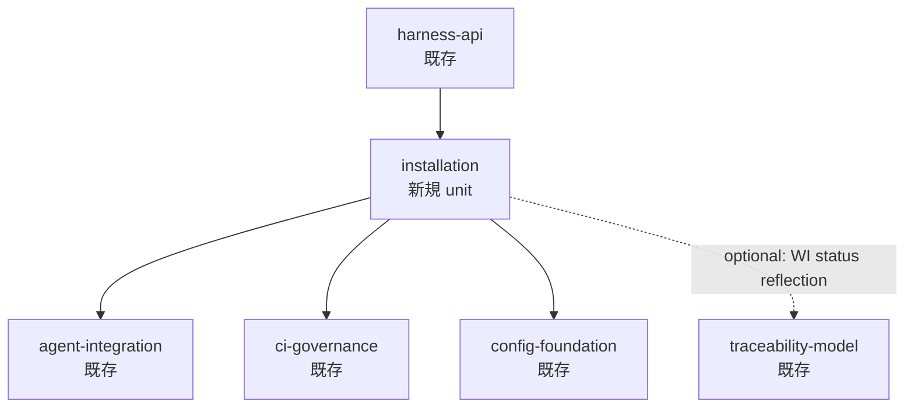

---
traceability:
  initial_creation: true
---

# Unit定義: installation

> **Unit ID**: installation
> **作成日**: 2026-05-11
> **Wave**: 3（品質防御メタ層 / install/uninstall idempotency）
> **対応 WI**: WI-144 (umbrella), WI-145〜148 (sub-WIs)
> **過渡期注記**: 本 unit は WI taxonomy 移行期 (WI-026 進行中) に新規追加された。担当ストーリーは `user_stories.md` の legacy H-XX ID ではなく、WI-145〜148 を直接参照する (Phase 1 計画書 Q1=b 採用)。

---

## 1. 概要

phasegate 自身の **deploy 状態管理・構造健全性検査・既存ファイルへの structured merge・clean uninstall・version upgrade 追従** を担当する境界づけられたコンテキスト。WI-144 (umbrella) が特定した「インストール成功 / 機能無効」という二重状態問題——phasegate が `✓ Harness vX initialized` を返すのに 1 件もチェックが走らない inert installation——を根絶するために新設される。

本 unit が単一の Bounded Context として成立する理由は、manifest schema / `RepairMode` / `SuggestedSkill` が WI-145〜148 全 sub-WI で共有されるユビキタス言語であり、install・uninstall・reconcile のいずれかが変わると manifest schema にも波及するため変更単位が密結合であることによる（Phase 1 計画書 §2 凝集性基準 4 観点すべてが「同一 unit」を示唆）。別 unit に分散させると Shared Kernel に `RepairMode` / `DeploymentManifest` を出す必要があり Shared Kernel が肥大化する。既存の `validator-system` が複数の L2/L3 validator を集約する前例と同種の設計判断。

新規実装は `scripts/harness/installation/{domain,application,infrastructure,presentation}/` 配下に Clean Architecture 4 層で配置する。既存 `scripts/harness/setup/skill-deployer.ts` は `// @unit harness-api` のまま legacy 互換維持とし、WI-148 完了後の整理は別 WI に委ねる（Phase 1 計画書 Q2=b 採用）。

---

## 2. 担当ストーリー (WI 表記)

| WI ID | タイトル | 優先度 |
|---|---|---|
| WI-145 | Deployment manifest と silent-failure doctor | Must |
| WI-146 | `phasegate install` — 既存ファイルへの structured merge | Must |
| WI-147 | `phasegate uninstall` — manifest-driven clean removal | Must |
| WI-148 | `phasegate reconcile` + `init` deprecation | Should |

---

## 3. 機能要件

### 3.1 Deployment manifest 生成・読込

@work-item-id WI-145
- `.phasegate/manifest.json` の JSON schema 確定: `version` / `installedAt` / `entries[]` (path / mode / block / hash)
- `mode`: `"created"` (phasegate が新規作成) / `"merged"` (既存ファイルに managed block を追加)
- `block`: merged 時の block 識別子（uninstall 時の block 除去 key）
- `hash`: deploy 時点のコンテンツ hash（user 改変検出用）
- `loadManifest(projectRoot)`: 既存 manifest を読む。無ければ `null`。壊れた JSON には明確な error を投げる
- `saveManifest(projectRoot, manifest)`: atomic write (tmp → rename) — 書き込み中 crash で manifest が壊れない
- `addEntry(manifest, entry)` / `removeEntry(manifest, path)`: in-memory 操作
- 既存 `init` / `update-skills` を本 manifest API に最小改修で書き込み対応（既存挙動は変えず、manifest 書き出しのみ追加）

**受け入れ基準（要約）**: schema が domain value object として定義され JSON round-trip が壊れない。`saveManifest` が atomic。既存 `init` が manifest を書き出す。

### 3.2 Silent-failure doctor 検査

@work-item-id WI-145
9 種の heuristic check を domain ports 経由で実行し `DiagnosticReport` に集約:

| Check ID | Heuristic | 重大度 |
|---|---|---|
| claude-hook-missing | `.claude/settings.json` に `"npx phasegate hook"` 文字列が無い | red |
| codex-hook-missing | `.codex/hooks.json` に `"npx phasegate hook"` 文字列が無い | red |
| husky-pre-commit-missing | `.husky/pre-commit` に `phasegate lint` または `phasegate check-phase-gate` が無い | red |
| husky-commit-msg-missing | `.husky/commit-msg` に `phasegate commit-msg` が無い | red |
| husky-pre-push-missing | `.husky/pre-push` に `phasegate bypass:audit` が無い | warn |
| ci-workflow-missing | `.github/workflows/` に phasegate workflow file が無い | warn |
| package-json-devdep-missing | `package.json` の `devDependencies` に `phasegate` が無い | red |
| claude-skills-symlink | `.claude/skills` が phasegate `skills/` を指していない | red |
| codex-skills-symlink | `.codex/skills` が phasegate `skills/` を指していない | red |

`npx phasegate doctor`: 全 check を実行し、red flag が 1 件でもあれば非ゼロ exit。出力形式は human (デフォルト) / json (`--json`)。各 red flag に修復コマンド hint を併記。`--strict` で warn も非ゼロ exit に昇格。

**受け入れ基準（要約）**: `inert-install` fixture に対し非ゼロ exit。`full-install` に対しゼロ exit。`--json` が構造化レポートを返す。各 check に修復 hint が含まれる。

### 3.3 AI 委譲経路

@work-item-id WI-145
install / uninstall / reconcile で機械的に解決できないケース（user 改変済みファイルの merge 位置判定等）の domain 第一級表現:

- `RepairMode = "mechanical" | "ai-assisted" | "manual"` value object
- `SuggestedSkill = { skillName, rationale, invokeCommand }` value object
- `RepairTable`: checkId → SuggestedSkill 静的マッピング (domain layer)、9 種 check 全件に対し skill 推奨を定義
- 各 `HeuristicCheck` 内で `repairMode` を判定（file 存在 / template 互換 / user 改変有無）
- doctor / install / uninstall / reconcile 出力に `repairMode` ラベルと skill 起動 hint を含める
- `repairMode != mechanical` finding が 1 件でも存在すれば warn 扱い（`--strict` 時 fail）
- doctor 自身は skill を自動起動しない（hint 提示までで、skill 起動は user が判断）

**受け入れ基準（要約）**: `DiagnosticFinding.repairMode` が 3 値で判定される。`ai-assisted` に `SuggestedSkill.invokeCommand` hint が出力される。`RepairTable` が domain layer に静的テーブルとして実装される。

### 3.4 既存ファイルへの structured merge

@work-item-id WI-146
各 deploy 先に対して merge 戦略を実装する `MergeStrategy<T>` 抽象化:

- **JSON merge strategy** (`.claude/settings.json` / `.codex/hooks.json`): `hooks` block の各 matcher に phasegate command entry を array append（既存 entries 保持、重複 dedupe）。`permissions.deny` も union merge
- **Shell script merge strategy** (`.husky/pre-commit` / `commit-msg` / `pre-push`): 末尾に `# === phasegate managed (BEGIN) ===` 〜 `# === phasegate managed (END) ===` block を追記。既存 block があれば差分置換
- **YAML add strategy** (`.github/workflows/*.yml`): 既存 workflow と coexist する別 file 名 (`phasegate-aidlc-gate.yml` 等) で配置
- **package.json merge strategy**: `devDependencies.phasegate` を semver で追加（既存があれば update）、`scripts.phasegate:*` helper alias を追加（既存があれば append のみ）

`npx phasegate install --dry-run`: 各 deploy 先について「missing / will-merge / will-skip / will-overwrite」と diff を表示。`RepairMode` も判定して表示。
`npx phasegate install --apply`: merge を実行し結果を `.phasegate/manifest.json` に `mode: "merged"` で記録。`ai-assisted` 判定 deploy 先は refuse し skill 起動 hint を出力。
`npx phasegate install --force`: managed block を再生成（backup を `.phasegate/backups/{timestamp}/` に取る）。ai-assisted も強制実行。
既存 `init` は内部実装を `install` に委譲（非破壊互換）。

**受け入れ基準（要約）**: 既存 `.claude/settings.json` / `.codex/hooks.json` / `.husky/*` / `package.json` / `.github/workflows/` に merge される。idempotent (2 回実行で hash 変わらず)。force 時 backup 取得。

### 3.5 Clean uninstall

@work-item-id WI-147
manifest の各 entry を mode 別に reverse-op:

- **`created`**: hash 一致を確認後 file 削除。hash mismatch は `--force` なしで refuse（warn + backup snapshot）
- **`merged`**: managed block のみ削除（JSON の phasegate hooks entry 除去、shell の BEGIN/END block 削除、`package.json` の devDep・scripts 削除）。user 部分は保持
- 空になった phasegate-only directory は cascade 削除。user file がある directory は保持
- manifest が無い場合: doctor で heuristic 検出 → 「manual cleanup が必要」を案内

`npx phasegate uninstall --dry-run`: 削除対象 entry 一覧と reverse-op diff を表示。`RepairMode` も判定。
`npx phasegate uninstall --apply`: 実行。`ai-assisted` 判定 entry は refuse し skill 起動 hint を出力。
`npx phasegate uninstall --force`: hash mismatch / ai-assisted も強制削除（backup 取得）。
完了後 `.phasegate/manifest.json` を `.phasegate/uninstalled-{ISO-timestamp}.json` に rename。

**受け入れ基準（要約）**: `created` 削除・`merged` block 除去・user 部分保持。uninstall 後 doctor が「未導入」と判定。reverse merge logic (JSON / shell / package.json) が単体テストでカバー。

### 3.6 Version upgrade reconcile

@work-item-id WI-148
manifest の各 entry について現バージョンの template と managed block の hash を比較し、差分 update:

- `merged` で hash 一致 → skip
- `merged` で hash 異なる・周囲シンプル → block のみ replace、user 部分保持 (`mechanical`)
- `merged` で hash 異なる・周囲 complex → refuse + skill 起動 hint (`ai-assisted`, `--force` で強行)
- `created` で hash 同一 → template に追従して上書き (`mechanical`)
- `created` で hash 異なる (user 改変あり) → warn + skip (`ai-assisted`, `--force` で上書き、backup 取得)
- manifest に無い新版 deploy 先 → install と同じく追加配置 (`mechanical`)

`npx phasegate reconcile --dry-run` / `--apply` / `--force`。
既存 `update-skills` は `reconcile` への alias として残す（互換維持）。
reconcile が 2 回連続実行で no-op になる（idempotent）。

**受け入れ基準（要約）**: managed block update・user 部分保持。`update-skills` alias 動作。idempotent。

### 3.7 `init` deprecation 経路

@work-item-id WI-148
`phasegate init` 実行時に deprecation warning を 1 回出力:

```
⚠️  `phasegate init` is deprecated and will be removed in v1.0.
   Use `phasegate install` for idempotent setup with structured merge.
   Existing files will be left untouched (legacy behavior preserved).
   Run `phasegate doctor` to verify your installation state.
```

- 既存挙動は維持（破壊しない）
- `init` の実装は WI-146 で `install` に委譲済みのため、warning 追加のみで済む

**受け入れ基準（要約）**: warning が出力されるが、既存 deploy 挙動は変わらない。

---

## 4. データモデル概要

本 unit が扱う主要な型を Clean Architecture レイヤー別に列挙する。

### Value Objects / Aggregates (domain layer)

- **`DeploymentManifest`** (root aggregate): `version` / `installedAt` / `entries: DeploymentEntry[]`
- **`DeploymentEntry`** (value object): `path` / `mode: "created" | "merged"` / `block?: string` / `hash: string`
- **`DiagnosticReport`** (root aggregate): `findings: DiagnosticFinding[]` / `overallStatus`
- **`DiagnosticFinding`** (value object): `checkId` / `severity: "red" | "warn"` / `repairMode: RepairMode` / `suggestedSkill?: SuggestedSkill` / `repairHint: string`
- **`RepairMode`**: `"mechanical" | "ai-assisted" | "manual"` (value object)
- **`SuggestedSkill`**: `{ skillName: string, rationale: string, invokeCommand: string }` (value object)
- **`RepairTable`**: checkId → SuggestedSkill の静的マッピング (domain layer)

### Ports (application layer)

- **`ManifestRepositoryPort`**: `load(projectRoot)` / `save(projectRoot, manifest)` / `addEntry(manifest, entry)` / `removeEntry(manifest, path)`
- **`FileInspectorPort`**: `readJson(path)` / `readText(path)` / `readSymlink(path)` / `exists(path)`

### Use Cases (application layer)

- **`RunDoctorDiagnosticsUseCase`**: 9 種 heuristic check を実行し `DiagnosticReport` を返す
- **`InstallUseCase`** (WI-146 で導入): structured merge を実行し manifest に記録
- **`UninstallUseCase`** (WI-147 で導入): manifest-driven reverse-op を実行
- **`ReconcileUseCase`** (WI-148 で導入): version upgrade に追従して managed block を update

### Heuristic Checks (application layer, 9 種)

`claude-hook-missing` / `codex-hook-missing` / `husky-pre-commit-missing` / `husky-commit-msg-missing` / `husky-pre-push-missing` / `ci-workflow-missing` / `package-json-devdep-missing` / `claude-skills-symlink` / `codex-skills-symlink`

### Shared Kernel 再利用

- **`HarnessError`** (harness-error unit 定義): doctor / install / uninstall / reconcile のエラー出力に再利用。新規 Shared Kernel は導入しない。

---

## 5. 外部依存



- **入 (harness-api → installation)**: `phasegate doctor` / `install` / `uninstall` / `reconcile` の CLI handler が `harness-api` に登録され、`installation` unit の use case を呼ぶ
- **出 (installation → agent-integration)**: `.claude/settings.json` / `.codex/hooks.json` の merge 戦略は agent-integration の hook config 知識を参照
- **出 (installation → ci-governance)**: `.github/workflows/*.yml` の deploy 規約参照
- **出 (installation → config-foundation)**: `phasegate.config.json` schema 参照
- **出 (installation -.-> traceability-model)** (optional): doctor 起動時の WI status / `@work-item-id` annotation 整合性検査。現時点では非スコープ、将来拡張余地のみ示す。依存方向に循環なし。Clean Architecture の依存方向と整合。

---

## 6. 制約・前提

- 既存 `scripts/harness/setup/skill-deployer.ts` (`// @unit harness-api`) は **legacy 互換のため改修最小** (Phase 1 計画書 Q2=b)
- 新規実装は `scripts/harness/installation/{domain,application,infrastructure,presentation}/` 配下に Clean Architecture 4 層で配置
- 全新規ファイルに `// @unit installation` および `// @layer <layer名>` を付与
- `phasegate.config.json` の `architecture.preset: "clean"` を維持
- `user_stories.md` は改変しない。WI-145〜148 の story マッピングは本文書の §2 担当 WI 一覧で完結する (Phase 1 計画書 Q1=b 採用)
- `integration_contract.md` の詳細 API contract は WI-146/147/148 完了後に拡充する (Phase 1 計画書 Q3=c 採用)
- WI-026 (taxonomy unification) 完了時に story-id 形式を `@work-item-id` ベースから retrofit しやすい形で記述
