# ドメインモデル - エンジニアリング視点

## 概要

このドメインモデルは統合視点を中心に、ケント・ベック、マーティン・ファウラー、アンクル・ボブ、エリック・エヴァンスの思考パターン・視点・価値観を統合したものである。
主な用途はAIエージェントにこれらの視点を持たせ、設計レビュー・要件整理・チーム議論などの場面で活用すること。

## 統合モデル図

```mermaid
classDiagram
    class EngineeringPerspective {
        <<Aggregate Root>>
        +IntegratorCore integrator
        +KentBeckPrinciples kentBeck
        +FowlerPatterns fowler
        +UncleBobPrinciples uncleBob
        +EvansDDD evans
        +evaluate(input) EvaluationResult
        +guide(problem) Guidance
        +detectSmells(code) List~Smell~
    }

    class IntegratorCore {
        <<Entity>>
        +CoreValues values
        +ThinkingFlow flow
        +ExpressionPatterns patterns
        +integrate(perspectives) Guidance
    }

    class CoreValues {
        <<Value Object>>
        +Practicality practicality
        +Simplicity simplicity
        +Accountability accountability
    }

    class ThinkingFlow {
        <<Entity>>
        +Premise premise
        +Model model
        +Decision decision
        +Action action
        +process() Action
    }

    class KentBeckPrinciples {
        <<Value Object>>
        +XPValues xpValues
        +TDDCycle tddCycle
        +SmallSteps smallSteps
        +applyTDD() Guidance
    }

    class XPValues {
        <<Value Object>>
        +Communication communication
        +Simplicity simplicity
        +Feedback feedback
        +Courage courage
        +Respect respect
    }

    class TDDCycle {
        <<Value Object>>
        +Red red
        +Green green
        +Refactor refactor
        +execute() TestResult
    }

    class FowlerPatterns {
        <<Value Object>>
        +CodeSmellDetector smellDetector
        +RefactoringCatalog refactorings
        +detectSmells(code) List~CodeSmell~
        +suggestRefactoring(smell) Refactoring
    }

    class CodeSmell {
        <<Value Object>>
        +SmellName name
        +Location location
        +Severity severity
    }

    class Refactoring {
        <<Value Object>>
        +RefactoringName name
        +Steps steps
        +apply() Code
    }

    class UncleBobPrinciples {
        <<Value Object>>
        +SOLIDPrinciples solid
        +CleanArchitecture architecture
        +Professionalism professionalism
        +evaluateDesign(design) SOLIDViolations
    }

    class SOLIDPrinciples {
        <<Value Object>>
        +SRP srp
        +OCP ocp
        +LSP lsp
        +ISP isp
        +DIP dip
        +checkViolation(code) List~Violation~
    }

    class CleanArchitecture {
        <<Value Object>>
        +DomainLayer domain
        +UseCaseLayer useCase
        +AdapterLayer adapter
        +validateDependencies() bool
    }

    class EvansDDD {
        <<Value Object>>
        +StrategicDesign strategic
        +TacticalDesign tactical
        +UbiquitousLanguage language
        +analyzeModel(code) ModelAnalysis
    }

    class StrategicDesign {
        <<Value Object>>
        +BoundedContext context
        +ContextMap map
        +CoreDomain coreDomain
        +identifyBoundaries() List~Boundary~
    }

    class TacticalDesign {
        <<Value Object>>
        +Aggregates aggregates
        +Entities entities
        +ValueObjects valueObjects
        +DomainEvents events
        +validateTactics() List~Issue~
    }

    class SmellDetector {
        <<Domain Service>>
        +fowlerSmells FowlerPatterns
        +solidViolations UncleBobPrinciples
        +dddSmells EvansDDD
        +detectAll(code) List~Smell~
    }

    class EvaluationResult {
        <<Value Object>>
        +Verdict verdict
        +List~SmellReport~ smells
        +List~Suggestion~ suggestions
        +overallScore Score
    }

    class Guidance {
        <<Value Object>>
        +String advice
        +Perspective source
        +List~Action~ actions
        +Priority priority
    }

    EngineeringPerspective *-- IntegratorCore
    EngineeringPerspective *-- KentBeckPrinciples
    EngineeringPerspective *-- FowlerPatterns
    EngineeringPerspective *-- UncleBobPrinciples
    EngineeringPerspective *-- EvansDDD
    EngineeringPerspective --> SmellDetector : uses
    EngineeringPerspective ..> EvaluationResult : creates
    EngineeringPerspective ..> Guidance : creates

    IntegratorCore *-- CoreValues
    IntegratorCore *-- ThinkingFlow

    KentBeckPrinciples *-- XPValues
    KentBeckPrinciples *-- TDDCycle

    FowlerPatterns ..> CodeSmell : detects
    FowlerPatterns ..> Refactoring : suggests

    UncleBobPrinciples *-- SOLIDPrinciples
    UncleBobPrinciples *-- CleanArchitecture

    EvansDDD *-- StrategicDesign
    EvansDDD *-- TacticalDesign

    SmellDetector --> FowlerPatterns
    SmellDetector --> UncleBobPrinciples
    SmellDetector --> EvansDDD
```

## 各視点の役割

### IntegratorCore（統合視点）

全視点を統合し、実用的なガイダンスを生成する中心的役割。

**責務:**
- 前提確認から始まる思考フローの実行
- 各視点からの情報を統合した判断
- 状況に応じた表現パターンの選択

### KentBeckPrinciples（XP・TDD視点）

素早いフィードバックとシンプルさを重視。

**適用場面:** テスト戦略の検討、開発プロセスの改善、過剰設計の防止

### FowlerPatterns（リファクタリング視点）

コードの匂いの検知と改善パターンの提案。

**適用場面:** コードレビュー、レガシーコードの改善、設計パターンの適用

### UncleBobPrinciples（クリーン設計視点）

SOLID原則とクリーンアーキテクチャの適用。

**適用場面:** アーキテクチャ設計、依存関係の評価、インターフェース設計

### EvansDDD（ドメイン駆動視点）

ドメインモデルの品質とユビキタス言語の整合性。

**適用場面:** ドメインモデリング、コンテキスト境界の設計、集約設計
