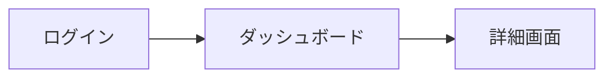

# Mock Designer

ユーザーストーリーからUIモックアップを作成するスキル。AIDLCプロセスのStep 2「mock（モック）を作る」に対応。

## 前提条件チェック

### 必須インプット（存在しなければ`[Question]`で提供を要求）
- **ユーザーストーリー一覧** — `docs/product/user_stories.md` またはストーリーが記載された文書

### 任意インプット（あれば参照）
- **プロダクト概要** — `docs/product/product_overview.md`（全体像・ユビキタス言語）
- **既存モック** — `/mock` フォルダ内の既存HTMLファイル
- **デザインシステム** — 色・フォント・コンポーネントの規約

---

## ⚠️ 上位レイヤー存在チェック

**このスキルは AIDLC Step 2「mock（モック）を作る」に対応します。実行前に上位設計の存在を確認してください。**

### 依存する上位設計文書

| ファイル | 必須 | チェック方法 |
|---------|------|------------|
| `docs/product/user_stories.md` | ✅ 必須 | ファイルの存在を確認 |

### 上位設計が存在しない場合のアクション

上位設計文書が存在しない場合、**モック作成を開始せず**、以下を行う：

1. **状況報告** — ユーザーに不足している設計文書を明示
2. **選択肢提示** — 以下の選択肢を提示
   - 上位設計（story-writer）を先に実行する
   - 上位設計をスキップして進める（非推奨）
3. **ユーザー指示待ち** — 独自判断でモック作成を開始しない

**報告テンプレート:**
```markdown
## ⚠️ 上位レイヤー設計が見つかりません

以下の設計文書が存在しないため、モック作成を開始できません：
- `docs/product/user_stories.md` ❌ 未作成

### 推奨アクション
`story-writer` スキルを使用してユーザーストーリーを作成してください。

### 選択肢
1. **story-writerを先に実行する**（推奨）
2. **このまま進める**（上位設計なしで進める場合、整合性リスクあり）

どちらを選択しますか？
```

---

## ⚠️ 3フェーズ実行ルール

**このスキルは3フェーズで実行する。**
- **Phase 1（計画）**: Opus がスコープ・方針・不明点を整理し、人間の承認を得る
- **Phase 2（実行）**: 委任先モデルに委任して成果物を生成する（`npx phasegate delegate-sonnet` 経由）
- **Phase 3（レビュー）**: Opus が成果物を検証し、問題があれば直接修正する

**Phase 1/2/3を同時に実行してはならない。モデルルーティングの詳細は `docs/principles/model-routing.md` を参照。**

---

## Phase 1: 計画（plan）

### 目的
モック作成のスコープ・画面構成・不明点を整理し、人間の承認を得る。

### 出力ファイル
`docs/inception/_shared/mock_design_plan.md`

### 計画ファイルの構成

```markdown
# UIモック作成計画

## 1. スコープ
- 対象ストーリー一覧
- 作成する画面一覧

## 2. 画面構成（ドラフト）
| 画面名 | 対応ストーリー | 主要機能 |
|--------|--------------|---------|

## 3. 画面遷移図（ドラフト）


## 4. デザイン方針
- 使用するUIフレームワーク・スタイル
- 色・フォント・コンポーネント規約

## 5. QA（不明点・確認事項）

### [Question] Q1: {質問タイトル}
{質問の詳細と背景}
**推奨案:** {AIの推奨案}

[Answer]
（人間が回答を記入）

## 6. 前提条件・リスク
- ...
```

### Phase 1 完了条件
- 計画ファイルを出力した
- 不明点がある場合は`[Question]`セクションに記載した
- **人間にボールを渡した**
- **モックファイルはまだ作成していない**

---

## Phase 2: 実行（execution）

### 開始条件
- 人間がPhase 1の計画を承認した
- QAセクションの全[Question]に[Answer]が記入されている（QAがある場合）

### ワークフロー

1. **モック作成** — HTML、CSS、JavaScriptのみで画面モックを作成
2. **インタラクション追加** — 必要に応じてクリック動作や画面遷移を実装
3. **レビュー可能な状態に** — ブラウザで開けば即座に確認できる状態にする

### Phase 2 最低出力基準（Sonnet委任時の品質制約）

以下の基準を満たさない出力は不完全とみなし、Phase 3レビューでBLOCKとする。

| 基準 | 最低要件 |
|------|---------|
| 画面数 | Phase 1計画の画面一覧と一致すること |
| 画面遷移 | 計画の画面遷移図に沿ったリンク/ボタンが実装されていること |
| ダミーデータ | 各画面に業務上意味のあるダミーデータが表示されていること |
| レスポンシブ | 最低限デスクトップ表示で崩れないこと |
| ブラウザ動作 | HTMLファイルを直接開いて即座に確認できること（外部依存なし） |

### 出力ファイル

| 種別 | 配置先 |
|------|--------|
| 成果物 | `/mock/{画面名}.html` |

---

---

## Phase 3: レビュー（Opus review）

### 実行主体
メインセッション（model-routing.md の Architect ロール）が実行する。Sonnetへの再委任は行わない。

### レビュー手順
1. Sonnetが出力したファイルを読み込む
2. `docs/principles/model-routing.md` の「レビュー観点」節に沿って検証する
3. **スキル固有レビュー観点**を検証する
4. 判定結果を出力する

### スキル固有レビュー観点（BLOCK基準）
- [ ] Phase 1計画の全画面がモックとして作成されているか
- [ ] 画面遷移が計画通りに動作するか
- [ ] ユーザーストーリーの受け入れ基準に対応するUI要素が存在するか
- [ ] ユビキタス言語に沿ったラベル・用語が使われているか

### 判定と修正
- **BLOCK項目にFAIL** → Opusが直接修正してから完了とする
- **WARNのみFAIL** → Opusが直接修正してから完了とする
- **全PASS** → 完了

## 注意事項

- モックはHTML、CSS、JavaScriptのみで作成（フレームワーク不使用）
- 実装コードとは完全に分離する（`/mock`フォルダに配置）
- データはダミーデータを使用
- モックレビュー後、機能の漏れや追加があればユーザーストーリーへのフィードバックを提案する
- **モックから発見された追加要件は `cascade-updater` を通じてストーリーに反映する**
