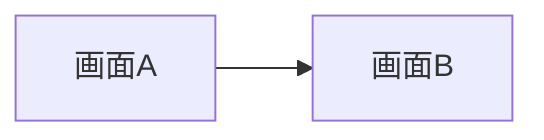

# uiux_design.md テンプレート

```markdown
# UIUX設計: {Unit名}

## 概要
このドキュメントは {Unit名} UnitのUIUX設計を定義する。
仕様変更のたびに更新される永続的な設計文書。

## 1. 画面一覧

| 画面名 | パス | 対象ストーリー | 状態 |
|--------|------|---------------|------|
| {画面名} | `/path/to/screen` | US-XXX | 実装済/設計中 |

---

## 2. 画面設計

### 2.1 {画面名}

#### 対象ストーリー
- US-XXX: {ストーリー概要}

#### レイアウト
```
┌────────────────────────┐
│  Header               │
├────────────────────────┤
│  Main Content         │
│  ┌───────┐  ┌───────┐ │
│  │ Card  │  │ Card  │ │
│  └───────┘  └───────┘ │
└────────────────────────┘
```

#### コンポーネント
| コンポーネント | Props | 状態 | イベント |
|-------------|-------|------|---------|

#### データバインディング
| 表示項目 | データソース | 形式 |
|---------|------------|------|

### 2.2 ...

---

## 3. 共通コンポーネント仕様

### {コンポーネント名}

#### Props
| Prop名 | 型 | 必須 | 説明 |
|--------|-----|------|------|

#### 状態管理
- ...

#### イベント
| イベント | トリガー | 処理内容 |
|---------|---------|---------|

---

## 4. 画面遷移



---

## 5. エラーハンドリング

| エラー種別 | 表示内容 | UX |
|-----------|---------|-----|

---

## 6. アクセシビリティ

- キーボードナビゲーション
- スクリーンリーダー対応
- 色のコントラスト比

---

## 7. data-testid一覧

| 要素 | data-testid |
|------|-------------|

※ 命名規約は `skills/uiux-designer/references/data-testid-convention.md` を参照

---

## 変更履歴

| 日付 | ストーリー | 変更内容 |
|------|-----------|---------|
| YYYY-MM-DD | US-XXX | 初版作成 |
| YYYY-MM-DD | US-YYY | {画面名}を追加 |
```
