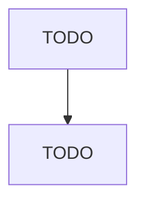

# <プロダクト名>

> **スキル**: `product-architect` Phase 2（実行）
> **入力**: `docs/inception/_shared/product_overview_plan.md`（承認済み）
> **作成日**: <YYYY-MM-DD>

このファイルは `phasegate scaffold-inception --kind product-overview --apply`
が生成した雛形です。TODO を実体で埋めてください。
このドキュメントは全スキルの**前提**として参照されます。

---

## 1. プロダクト定義

### 1.1 根本思想

TODO: このプロダクトが何を信条として作られるかを 2〜3 行で記述

### 1.2 解決する問題

TODO: 現状の痛みと、それが放置された場合のコスト

### 1.3 対象ユーザー

TODO: 主ターゲットと、明示的に対象外とするユーザー

## 2. コアドメイン

### 2.1 主要概念（ユビキタス言語）

| 概念 | 定義 | 例 |
|------|------|-----|
| TODO | TODO | TODO |

### 2.2 概念間の関係図



## 3. アーキテクチャ仕様

### 3.1 全体構造（レイヤー図）

```
TODO: レイヤー構成
```

### 3.2 技術スタック

| レイヤー | 技術 | 選定理由 |
|---------|------|---------|
| TODO | TODO | TODO |

### 3.3 分離方針

TODO: 認証/認可、同期/非同期 等の分離方針

## 4. ADR Summary（技術決定記録）

| # | 決定事項 | 選択肢 | 決定 | 理由 |
|---|---------|-------|------|------|
| 1 | TODO | TODO | TODO | TODO |

## 5. 制約

### 5.1 運用上の制約

TODO

### 5.2 実装上の制約

TODO

### 5.3 パフォーマンス要件

TODO

---

## 注意事項

- ユビキタス言語はプロジェクト全体で一貫して使用する
- 技術選定の「なぜ」を必ず ADR Summary に記録する
